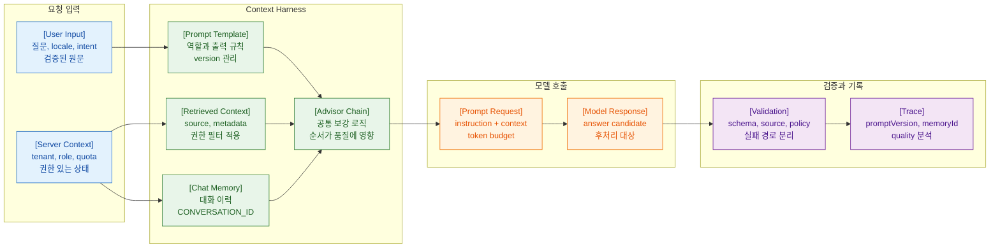

>[!success] 이 문서를 통해 아래 질문들에 답할 수 있게 됩니다.
>- Spring AI에서 prompt, context, advisor, memory는 각각 어떤 책임을 가지는가?
>- Prompt engineering에서 context engineering, harness engineering으로 어떻게 확장되는가?
>- Advisor ordering과 memory conversation id를 왜 조심해야 하는가?
>- 대화 memory를 운영 서비스에서 안전하게 쓰려면 무엇이 필요한가?

---



---

## 개요

Spring AI의 prompt, advisor, memory는 문자열 조립 도구가 아니다. 모델 입력을 어떤 데이터와 정책으로 구성할지 정하는 실행 하네스다.

초기에는 prompt 문구를 잘 쓰는 것이 중요해 보인다. 하지만 실전에서는 어떤 context를 넣을지, 어떤 순서로 advisor를 적용할지, 어떤 memory를 다시 주입할지가 더 큰 영향을 준다.

## 원리

책임을 나누면 다음과 같다.

- Prompt: 모델에게 전달하는 instruction과 user input의 형식
- Context: 검색 결과, 권한, 사용자 상태, 대화 이력, 정책, source
- Advisor: 모델 호출 전후에 반복 패턴을 삽입하는 interceptor
- Memory: 다음 호출에 재사용할 대화 이력
- Harness: 위 요소를 조립하고 검증하고 기록하는 실행 장치

Spring AI Advisors API는 LLM 요청을 가로채고 보강하는 구조를 제공한다. 따라서 advisor는 AOP와 비슷하게 보일 수 있지만, 모델 입력과 출력 품질에 직접 영향을 준다는 점을 기억해야 한다.

## 실습

prompt registry를 작게 만든다.

```java
record PromptSpec(String version, String system, String userTemplate) {
}

@Component
class SupportPromptRegistry {

    PromptSpec supportAnswer() {
        return new PromptSpec(
                "support-answer-v2",
                """
                You answer customer support questions.
                Use only supplied context.
                If context is insufficient, mark escalation required.
                """,
                """
                question:
                {question}

                context:
                {context}
                """
        );
    }
}
```

context 조립은 모델 호출과 분리한다.

```java
@Service
class SupportContextAssembler {

    private final KnowledgeSearch knowledgeSearch;

    SupportContextAssembler(KnowledgeSearch knowledgeSearch) {
        this.knowledgeSearch = knowledgeSearch;
    }

    String assemble(String tenantId, String userId, String question) {
        return knowledgeSearch.searchAuthorized(tenantId, userId, question).stream()
                .limit(5)
                .map(block -> "[source=%s]\n%s".formatted(block.sourceId(), block.text()))
                .collect(Collectors.joining("\n\n"));
    }
}
```

memory는 conversation id를 명시한다.

```java
@Service
class ConversationAssistant {

    private final ChatClient chatClient;
    private final ConversationAccessPolicy accessPolicy;

    ConversationAssistant(ChatClient chatClient, ConversationAccessPolicy accessPolicy) {
        this.chatClient = chatClient;
        this.accessPolicy = accessPolicy;
    }

    String reply(String tenantId, String userId, String conversationId, String message) {
        accessPolicy.checkOwner(tenantId, userId, conversationId);

        return chatClient.prompt()
                .advisors(a -> a.param(ChatMemory.CONVERSATION_ID, conversationId))
                .user(message)
                .call()
                .content();
    }
}
```

성공 경로는 prompt, context, memory가 각각 테스트 가능한 단위로 분리되는 것이다.

자주 나는 오류는 memory conversation id를 빼는 것이다. Spring AI memory advisors는 `ChatMemory.CONVERSATION_ID`가 필요하며 없으면 런타임 예외가 난다.

운영에서는 memory 저장소, TTL, 삭제, 민감정보 마스킹, 대화 요약 정책을 정한다.

## 실전 판단

advisor를 붙일 때는 순서를 문서화한다.

- memory를 먼저 넣고 RAG를 검색할 것인가?
- 현재 질문만으로 RAG를 검색할 것인가?
- 권한 필터는 어느 계층에서 적용되는가?
- logging advisor가 민감정보를 보기 전에 masking되는가?

순서가 바뀌면 답변 품질과 보안 결과가 달라질 수 있다.

## 실전 팁

- prompt version을 code constant나 registry로 관리한다.
- context assembler는 모델 없이 단위 테스트한다.
- advisor chain version을 로그에 남긴다.
- memory는 기본 OFF에서 시작하고 필요한 유스케이스에만 켠다.
- memory에 tool 결과를 저장할지 별도 정책을 둔다.

## 위험 신호!

- prompt가 여러 파일과 Controller에 흩어져 있다.
- context를 하나의 거대한 문자열로만 관리한다.
- advisor 순서를 설명할 수 없다.
- memory에 민감정보가 저장되는데 TTL과 삭제 정책이 없다.
- 대화 이력이 다른 사용자나 테넌트와 섞일 가능성이 있다.

## 확인 질문

>[!question] 확인 질문
>- prompt와 context의 차이는 무엇인가?
>	- prompt는 전달 형식이고 context는 그 안에 넣을 데이터와 정책이다.
>- advisor를 harness로 보는 이유는 무엇인가?
>	- 모델 호출 전후에 memory, retrieval, logging, safety 같은 실행 정책을 삽입하기 때문이다.
>- memory 사용 시 `ChatMemory.CONVERSATION_ID`가 중요한 이유는 무엇인가?
>	- 대화 이력을 올바른 conversation에 묶고 누락 시 런타임 실패를 피하기 위해서다.
>- memory 운영에서 필요한 정책은 무엇인가?
>	- TTL, 삭제, 민감정보 처리, 사용자/테넌트 격리, 요약, 오염 제거 정책이다.

## 학습 연결

- 이전 문서: [04. ChatClient Model Auto Configuration.md](<04. ChatClient Model Auto Configuration.md>)
- 다음 문서: [06. Structured Output과 Bean Validation.md](<06. Structured Output과 Bean Validation.md>)
- 함께 보면 좋은 문서: [02. Context Engineering과 컨텍스트 조립.md](<../03. Prompt Context Harness Engineering/02. Context Engineering과 컨텍스트 조립.md>)
- 함께 보면 좋은 문서: [03. Harness Engineering과 실행 안정성.md](<../03. Prompt Context Harness Engineering/03. Harness Engineering과 실행 안정성.md>)

## 참고 문서

- [Spring AI Prompts](https://docs.spring.io/spring-ai/reference/api/prompt.html)
- [Spring AI Advisors](https://docs.spring.io/spring-ai/reference/api/advisors.html)
- [Spring AI Chat Memory](https://docs.spring.io/spring-ai/reference/api/chat-memory.html)
- [Spring AI Retrieval Augmented Generation](https://docs.spring.io/spring-ai/reference/api/retrieval-augmented-generation.html)
