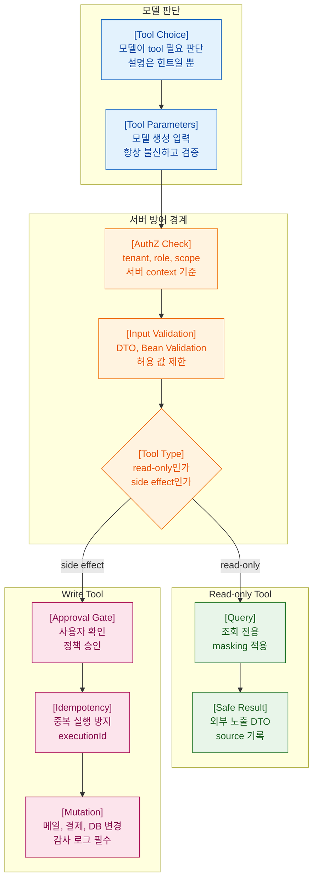

>[!success] 이 문서를 통해 아래 질문들에 답할 수 있게 됩니다.
>- Spring AI tool calling을 서버 API 경계로 봐야 하는 이유는 무엇인가?
>- read-only tool과 write tool은 어떻게 다르게 설계해야 하는가?
>- 모델이 만든 tool parameter를 왜 그대로 믿으면 안 되는가?
>- side effect tool의 중복 실행과 권한 문제를 어떻게 막는가?

---



---

## 개요

Tool calling은 모델이 서버 기능을 호출하게 만드는 기능이다. 생산성은 높지만 위험도 크다. 단순히 Java 메서드를 호출하는 것이 아니라, 모델 판단이 DB 조회, 외부 API 호출, 메일 발송, 결제, 권한 변경으로 이어질 수 있기 때문이다.

Spring AI tool API를 사용할 때는 tool을 “모델에게 제공하는 API”로 봐야 한다. API라면 인증, 인가, input validation, idempotency, audit log가 필요하다.

## 원리

tool 설계 원칙은 다음과 같다.

- read-only tool부터 시작한다.
- tool input은 작고 명확하게 만든다.
- tenant id, user id, role은 인증된 서버 context에서 검증한다.
- tool output은 외부 노출 가능한 DTO로 줄인다.
- write tool은 idempotency key와 approval gate를 둔다.
- tool execution id를 남긴다.

모델 설명은 모델이 tool을 잘 고르게 돕는 힌트다. 보안 정책은 서버 코드로 검증한다.

## 실습

read-only 주문 조회 tool을 만든다.

```java
@Component
class OrderTools {

    private final OrderQueryService orderQueryService;
    private final OrderPermissionService permissionService;

    OrderTools(OrderQueryService orderQueryService, OrderPermissionService permissionService) {
        this.orderQueryService = orderQueryService;
        this.permissionService = permissionService;
    }

    @Tool(description = "Find a customer's order summary by order id. Read-only.")
    OrderSummary findOrder(String tenantId, String userId, String orderId) {
        permissionService.checkCanReadOrder(tenantId, userId, orderId);
        return orderQueryService.findSummary(tenantId, orderId);
    }
}
```

tool을 ChatClient에 연결한다.

```java
@Service
class OrderAssistant {

    private final ChatClient chatClient;
    private final OrderTools orderTools;

    OrderAssistant(ChatClient.Builder builder, OrderTools orderTools) {
        this.chatClient = builder
                .defaultSystem("Use tools only when order data is required.")
                .build();
        this.orderTools = orderTools;
    }

    String answer(String tenantId, String userId, String question) {
        return chatClient.prompt()
                .user(user -> user.text("""
                        tenantId: {tenantId}
                        userId: {userId}
                        question: {question}
                        """)
                        .param("tenantId", tenantId)
                        .param("userId", userId)
                        .param("question", question))
                .tools(orderTools)
                .call()
                .content();
    }
}
```

성공 경로는 tool이 필요한 경우에만 호출되고, 서버 권한 검증을 통과한 최소 DTO만 반환하는 것이다.

자주 나는 오류는 모델이 만든 `tenantId`나 `userId`를 그대로 믿는 것이다. 사용자 인증 context와 대조해야 한다.

운영에서는 tool execution id, tool name, input hash, output size, latency, success/failure를 감사 로그로 남긴다.

## 실전 판단

write tool은 바로 실행하지 않는 편이 안전하다. 먼저 action plan을 structured output으로 만들고, 사람이 승인하거나 별도 API가 실행하게 한다.

```java
record ToolPlan(
        String action,
        String targetId,
        String reason,
        boolean requiresApproval
) {
}
```

결제, 환불, 삭제, 권한 변경, 메일 발송은 기본적으로 approval 대상이다.

## 실전 팁

- tool 이름과 description은 짧고 구체적으로 쓴다.
- internal entity를 tool output으로 반환하지 않는다.
- read-only tool과 write tool을 class/package 단위로도 분리한다.
- write tool에는 idempotency key를 필수로 둔다.
- tool 실패를 모델에게 그대로 노출하지 말고 안전한 오류 DTO로 바꾼다.

## 위험 신호!

- tool method에 권한 검사가 없다.
- 모델이 만든 user id와 role을 그대로 사용한다.
- side effect tool이 human approval 없이 실행된다.
- provider retry와 application retry가 중복 실행을 만든다.
- tool output에 개인정보나 secret이 포함된다.

## 확인 질문

- tool calling을 API 경계로 봐야 하는 이유는 무엇인가?
	- 모델 판단이 서버 기능 실행과 side effect로 이어질 수 있기 때문이다.
- read-only tool부터 시작해야 하는 이유는 무엇인가?
	- 권한과 감사 로그를 익히면서 side effect 위험을 줄일 수 있기 때문이다.
- write tool에서 idempotency key가 필요한 이유는 무엇인가?
	- retry나 중복 호출로 같은 side effect가 반복되는 것을 막기 위해서다.
- tool description은 왜 보안 경계가 아닌가?
	- 모델에게 주는 힌트일 뿐 서버 권한 검증을 대신하지 못하기 때문이다.

## 학습 연결

- 이전 문서: [06. Structured Output과 Bean Validation.md](<06. Structured Output과 Bean Validation.md>)
- 다음 문서: [08. MCP Client Server 통합.md](<08. MCP Client Server 통합.md>)
- 함께 보면 좋은 문서: [02. Tool Calling과 서버 실행 경계.md](<../05. Structured Output과 Tool Calling/02. Tool Calling과 서버 실행 경계.md>)
- 함께 보면 좋은 문서: [01. Prompt Injection과 Tool Poisoning.md](<../11. AI 보안과 개인정보/01. Prompt Injection과 Tool Poisoning.md>)

## 참고 문서

- [Spring AI Tools](https://docs.spring.io/spring-ai/reference/api/tools.html)
- [OWASP Top 10 for LLM Applications 2025](https://genai.owasp.org/resource/owasp-top-10-for-llm-applications-2025/)
- [Spring Security Reference](https://docs.spring.io/spring-security/reference/index.html)
