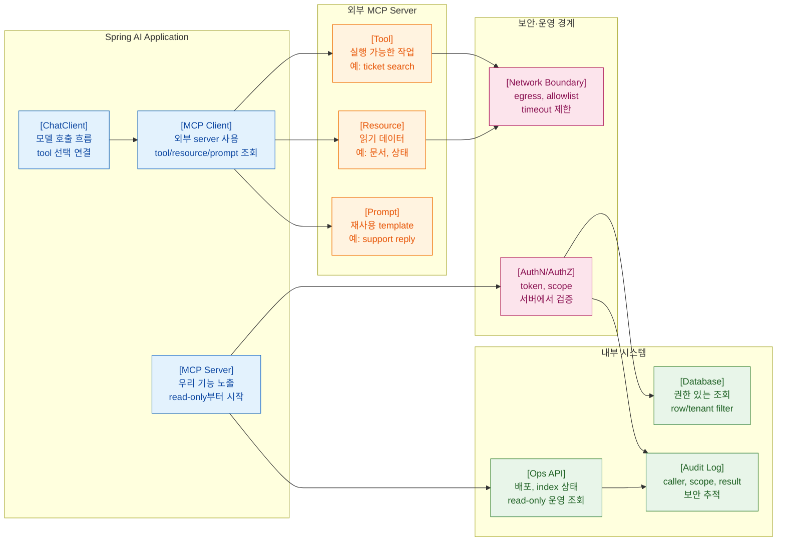

>[!success] 이 문서를 통해 아래 질문들에 답할 수 있게 됩니다.
>- MCP가 Spring AI 애플리케이션에서 어떤 문제를 해결하는가?
>- MCP client와 MCP server의 책임은 어떻게 다른가?
>- Spring 서비스를 MCP server로 노출할 때 어떤 보안과 운영 책임이 생기는가?
>- MCP를 tool calling과 어떻게 구분해서 설계해야 하는가?

---



---

## 개요

MCP는 Model Context Protocol이다. tool, resource, prompt를 AI client와 server 사이에 표준 방식으로 연결한다. Spring AI에서는 MCP client/server 통합을 통해 외부 MCP server의 기능을 사용하거나, Spring 서비스를 MCP server로 노출할 수 있다.

MCP는 도구 연결의 표준화에 가깝다. 인증, 인가, 감사, 네트워크 경계, 데이터 노출 정책을 자동으로 완성해주는 것은 아니다.

## 원리

MCP 역할을 나누면 다음과 같다.

- MCP client: 외부 MCP server의 tool/resource/prompt를 사용한다.
- MCP server: 우리 애플리케이션의 tool/resource/prompt를 외부 client에 제공한다.
- Tool: 실행 가능한 작업
- Resource: 읽을 수 있는 데이터
- Prompt: 재사용 가능한 prompt template

Spring 백엔드에서는 read-only 운영 조회나 사내 문서 조회부터 시작하는 것이 좋다.

## 실습

MCP server로 노출할 수 있는 read-only tool 예시는 다음과 같다.

```java
@Component
class DeploymentStatusTools {

    private final DeploymentStatusService deploymentStatusService;

    DeploymentStatusTools(DeploymentStatusService deploymentStatusService) {
        this.deploymentStatusService = deploymentStatusService;
    }

    @McpTool(name = "read_deployment_status", description = "Read deployment status for a service and environment. Read-only.")
    DeploymentStatus readDeploymentStatus(String serviceName, String environment) {
        if (!List.of("dev", "stage", "prod").contains(environment)) {
            throw new IllegalArgumentException("Unknown environment: " + environment);
        }
        return deploymentStatusService.findStatus(serviceName, environment);
    }
}
```

MCP client로 외부 tool을 사용할 때는 tool 결과를 내부 정책으로 한 번 더 감싼다.

```java
record ExternalToolResult(String toolName, String text, boolean success) {
}

record SafeToolResult(String toolName, String safeText, boolean success) {
}

@Service
class McpToolResultPolicy {

    SafeToolResult sanitize(ExternalToolResult result) {
        return new SafeToolResult(
                result.toolName(),
                maskSecrets(result.text()),
                result.success()
        );
    }

    private String maskSecrets(String text) {
        return text.replaceAll("sk-[A-Za-z0-9_-]+", "sk-***");
    }
}
```

성공 경로는 MCP tool/resource가 최소 권한으로 동작하고, 호출 로그와 실패 원인이 남는 것이다.

자주 나는 오류는 MCP server를 내부망에 띄웠다는 이유로 인증과 감사 로그를 생략하는 것이다.

운영에서는 MCP server의 transport, 인증, ingress, egress, rate limit, version 호환성을 인프라팀과 합의한다.

## 실전 판단

MCP를 도입할지 판단하는 기준은 다음과 같다.

- 여러 AI client가 같은 tool/resource 계약을 재사용하는가?
- IDE, agent, 운영 도구와 Spring 서비스를 연결해야 하는가?
- tool 목록과 권한을 표준 인터페이스로 관리하고 싶은가?
- 단순히 우리 애플리케이션 내부에서만 tool을 쓰는가?

마지막 경우라면 Spring AI tool calling만으로 충분할 수 있다.

## 실전 팁

- MCP server는 read-only부터 시작한다.
- tool/resource 목록을 inventory로 관리한다.
- 인증 없는 MCP server를 운영망에 두지 않는다.
- tool output size 제한과 timeout을 둔다.
- MCP version과 Spring AI version을 배포 노트에 남긴다.

## 위험 신호!

- MCP server가 어떤 tool을 노출하는지 팀이 모른다.
- 내부망이라는 이유로 인증을 생략한다.
- 운영 secret이나 raw log를 resource로 노출한다.
- write operation이 승인 없이 MCP tool로 열려 있다.
- MCP 장애가 전체 API 장애로 전파된다.

## 확인 질문

>[!question] 확인 질문
>- MCP client와 server의 차이는 무엇인가?
>	- client는 외부 MCP server를 사용하고, server는 우리 기능을 MCP 계약으로 제공한다.
>- MCP가 tool calling과 다른 점은 무엇인가?
>	- MCP는 client/server 간 tool/resource/prompt 연결 표준이고, tool calling은 모델이 사용할 실행 기능을 호출하는 메커니즘이다.
>- MCP server를 read-only부터 시작해야 하는 이유는 무엇인가?
>	- 노출 범위와 감사 체계를 검증하면서 side effect 위험을 줄이기 위해서다.
>- MCP 운영 전 인프라팀과 합의할 것은 무엇인가?
>	- transport, 인증, 네트워크 위치, rate limit, 로그, 장애 대응, 배포/rollback 기준이다.

## 학습 연결

- 이전 문서: [07. Tool Calling과 Side Effect 방어.md](<07. Tool Calling과 Side Effect 방어.md>)
- 다음 문서: [09. Embedding VectorStore RAG ETL 설계.md](<09. Embedding VectorStore RAG ETL 설계.md>)
- 함께 보면 좋은 문서: [01. MCP 기본 구조.md](<../13. MCP와 외부 도구 통합/01. MCP 기본 구조.md>)
- 함께 보면 좋은 문서: [05. MCP 도입 판단과 인프라 협업.md](<../13. MCP와 외부 도구 통합/05. MCP 도입 판단과 인프라 협업.md>)

## 참고 문서

- [Spring AI Model Context Protocol](https://docs.spring.io/spring-ai/reference/api/mcp/mcp-overview.html)
- [Spring AI MCP Server Boot Starter](https://docs.spring.io/spring-ai/reference/api/mcp/mcp-server-boot-starter-docs.html)
- [Model Context Protocol Documentation](https://modelcontextprotocol.io/docs)
- [Spring AI Tools](https://docs.spring.io/spring-ai/reference/api/tools.html)
- [OWASP Top 10 for LLM Applications 2025](https://genai.owasp.org/resource/owasp-top-10-for-llm-applications-2025/)
