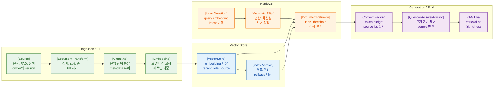

>[!success] 이 문서를 통해 아래 질문들에 답할 수 있게 됩니다.
>- Spring AI의 embedding, `VectorStore`, `DocumentRetriever`, RAG advisor는 어떻게 연결되는가?
>- RAG 품질을 결정하는 ingestion, chunking, metadata, 권한 필터는 무엇인가?
>- embedding model이나 chunk 정책을 바꿀 때 왜 재색인이 필요한가?
>- 개인 프로젝트와 기업 운영에서 vector DB 판단 기준은 어떻게 다른가?

---



---

## 개요

RAG는 모델이 모르는 지식을 검색해 context로 넣고 답하게 만드는 방식이다. Spring AI는 `VectorStore`, document abstraction, `DocumentRetriever`, `QuestionAnswerAdvisor` 같은 구성 요소로 RAG를 Spring 애플리케이션 안에 넣을 수 있게 한다.

실전 RAG의 핵심은 모델 호출보다 문서 파이프라인이다. 검색할 문서가 잘못되어 있으면 좋은 모델도 잘못 답한다.

## 원리

RAG는 다음 단계로 나뉜다.

- source 수집
- document 변환
- chunking
- embedding
- vector store 저장
- query embedding
- similarity search
- metadata filtering
- context packing
- answer generation
- evaluation

Spring AI는 이 흐름의 도구를 제공하지만, metadata 설계와 권한 정책은 애플리케이션이 책임진다.

## 실습

문서 chunk 모델을 먼저 정한다.

```java
record KnowledgeChunk(
        String id,
        String tenantId,
        String sourceId,
        String sourceType,
        String title,
        String text,
        Instant updatedAt,
        String role,
        String embeddingModel,
        String indexVersion
) {
}
```

vector store에 저장할 document를 만든다.

```java
@Service
class KnowledgeIndexingService {

    private final VectorStore vectorStore;
    private final KnowledgeDocumentRepository repository;

    KnowledgeIndexingService(VectorStore vectorStore, KnowledgeDocumentRepository repository) {
        this.vectorStore = vectorStore;
        this.repository = repository;
    }

    void reindexTenant(String tenantId, String indexVersion) {
        List<Document> documents = repository.findActiveDocuments(tenantId).stream()
                .flatMap(source -> SimpleChunker.split(source).stream())
                .map(chunk -> new Document(
                        chunk.text(),
                        Map.of(
                                "tenantId", chunk.tenantId(),
                                "sourceId", chunk.sourceId(),
                                "role", chunk.role(),
                                "indexVersion", indexVersion
                        )
                ))
                .toList();

        vectorStore.add(documents);
    }
}
```

권한 필터가 있는 retrieval 예시는 다음과 같다.

```java
@Service
class AuthorizedKnowledgeSearch {

    private final VectorStore vectorStore;

    AuthorizedKnowledgeSearch(VectorStore vectorStore) {
        this.vectorStore = vectorStore;
    }

    List<Document> search(String tenantId, String role, String question) {
        FilterExpressionBuilder b = new FilterExpressionBuilder();
        Expression filter = b.and(
                b.eq("tenantId", tenantId),
                b.eq("role", role)
        ).build();

        DocumentRetriever retriever = VectorStoreDocumentRetriever.builder()
                .vectorStore(vectorStore)
                .topK(8)
                .similarityThreshold(0.72)
                .filterExpression(filter)
                .build();

        return retriever.retrieve(Query.builder()
                .text(question)
                .build());
    }
}
```

성공 경로는 검색 결과가 사용자의 tenant와 role에 맞고 source id를 추적할 수 있는 것이다.

자주 나는 오류는 문서 원문만 저장하고 metadata를 생략하는 것이다. 그러면 권한, 최신성, source 추적이 모두 어려워진다.

운영에서는 index version을 두고 새 index를 만든 뒤 eval을 통과하면 active version을 전환한다.

## 실전 판단

vector DB 선택 기준은 개인 프로젝트와 기업 운영이 다르다.

개인 프로젝트는 빠른 시작, local 실행, 간단한 백업이 중요하다. 기업 운영은 metadata filter 성능, tenant 격리, backup/restore, index rebuild 시간, latency, 모니터링, 인프라팀 운영 경험이 중요하다.

RAG fallback은 답변 생성 실패뿐 아니라 검색 실패도 고려해야 한다. 검색 결과 없음은 오류가 아니라 정상 상태일 수 있다.

## 실전 팁

- source id와 index version은 개인 프로젝트에서도 남긴다.
- chunking은 문서 유형과 질문 유형별 eval로 조정한다.
- 권한 필터는 retrieval 전에 적용한다.
- embedding model 변경은 index migration으로 본다.
- 삭제된 문서는 vector store에서도 삭제되게 job을 만든다.

## 위험 신호!

- tenant id와 권한 metadata 없이 문서를 저장한다.
- PDF 전체를 하나의 chunk로 넣는다.
- embedding model을 바꾸고 기존 index를 그대로 쓴다.
- 삭제된 문서가 검색 결과에 남는다.
- RAG 품질을 느낌으로만 판단한다.

## 확인 질문

>[!question] 확인 질문
>- RAG에서 ingestion이 중요한 이유는 무엇인가?
>	- 검색 품질, 권한, 최신성, source 추적이 ingestion 단계에서 결정되기 때문이다.
>- metadata에 넣어야 할 최소 정보는 무엇인가?
>	- tenant id, source id, source type, updated at, ACL 또는 role, embedding model, index version이다.
>- 권한 필터가 retrieval 후에 적용되면 왜 위험한가?
>	- 권한 없는 문서가 이미 모델 context나 provider로 전달될 수 있기 때문이다.
>- index version을 두는 이유는 무엇인가?
>	- 새 embedding/chunk/index를 eval하고 rollback할 수 있게 하기 위해서다.

## 학습 연결

- 이전 문서: [08. MCP Client Server 통합.md](<08. MCP Client Server 통합.md>)
- 다음 문서: [10. Evaluation Testing Regression.md](<10. Evaluation Testing Regression.md>)
- 함께 보면 좋은 문서: [02. Vector Search와 Metadata Filter.md](<../06. Embedding과 Vector Search/02. Vector Search와 Metadata Filter.md>)
- 함께 보면 좋은 문서: [02. RAG 권한 최신성 Source 관리.md](<../07. RAG 설계/02. RAG 권한 최신성 Source 관리.md>)

## 참고 문서

- [Spring AI Vector Databases](https://docs.spring.io/spring-ai/reference/api/vectordbs.html)
- [Spring AI ETL Pipeline](https://docs.spring.io/spring-ai/reference/api/etl-pipeline.html)
- [Spring AI Retrieval Augmented Generation](https://docs.spring.io/spring-ai/reference/api/retrieval-augmented-generation.html)
- [LlamaIndex Production RAG](https://docs.llamaindex.ai/en/stable/optimizing/production_rag/)
