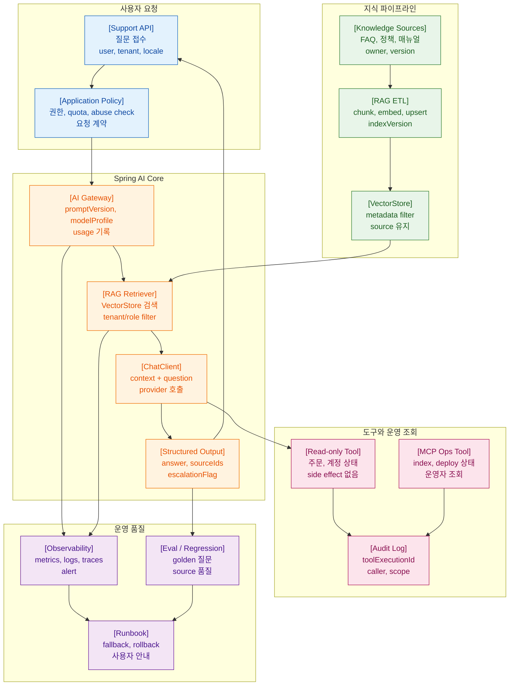

>[!success] 이 문서를 통해 아래 질문들에 답할 수 있게 됩니다.
>- Spring AI 학습 내용을 고객지원 RAG 서비스 하나로 어떻게 묶을 수 있는가?
>- capstone 산출물에는 어떤 API, gateway, RAG, tool, MCP, eval, observability 요소가 들어가는가?
>- 개인 프로젝트 수준에서 프로덕션에 가까운 결과물을 내려면 무엇을 포함해야 하는가?
>- 이 과제를 통해 Spring AI 운영 입문-고급 수준을 어떻게 확인할 수 있는가?

---



---

## 개요

졸업 과제는 고객지원 RAG 서비스다. 사용자가 제품 사용 질문을 보내면, 서버는 권한 있는 문서를 검색하고, 모델은 근거 기반 답변을 생성한다. 필요하면 read-only tool로 주문이나 계정 상태를 조회하고, 운영자는 MCP read-only tool로 index와 배포 상태를 확인한다.

이 과제의 목적은 챗봇 데모가 아니다. Spring AI를 백엔드 서비스에 안전하게 붙이고 운영 가능한 설계를 만드는 것이다.

## 원리

capstone 흐름은 다음과 같다.

- Controller가 질문을 받는다.
- Application service가 권한과 quota를 확인한다.
- AI Gateway가 prompt version과 model profile을 정한다.
- RAG retriever가 tenant/role 필터로 문서를 검색한다.
- ChatClient가 context와 질문으로 답변을 생성한다.
- Structured output이 answer, source ids, escalation flag를 반환한다.
- Read-only tool은 필요한 경우에만 호출된다.
- Metrics와 audit log가 남는다.
- Eval set으로 regression을 검증한다.
- 장애 시 fallback과 runbook이 작동한다.

## 실습

최종 응답 DTO를 정한다.

```java
record SupportAiResponse(
        String answer,
        List<String> sourceIds,
        boolean escalationRequired,
        String reason,
        String modelProfile,
        String promptVersion
) {
}
```

요청 흐름은 service가 조율한다.

```java
@Service
class SupportRagUseCase {

    private final SupportPolicy policy;
    private final SupportContextAssembler contextAssembler;
    private final SupportAiGateway aiGateway;

    SupportRagUseCase(
            SupportPolicy policy,
            SupportContextAssembler contextAssembler,
            SupportAiGateway aiGateway
    ) {
        this.policy = policy;
        this.contextAssembler = contextAssembler;
        this.aiGateway = aiGateway;
    }

    SupportAiResponse answer(String tenantId, String userId, String question) {
        policy.checkCanUseAi(tenantId, userId);
        policy.checkQuota(tenantId, userId);

        RagContext context = contextAssembler.assemble(tenantId, userId, question);

        return aiGateway.answer(new SupportRagCommand(
                tenantId,
                userId,
                question,
                context,
                "support-rag-v1",
                "default-chat"
        ));
    }
}
```

AI gateway는 structured output을 받는다.

```java
@Component
class SpringAiSupportRagGateway implements SupportAiGateway {

    private final ChatClient chatClient;

    SpringAiSupportRagGateway(ChatClient.Builder builder, OrderTools orderTools) {
        this.chatClient = builder
                .defaultSystem("""
                        Answer customer support questions using supplied context.
                        If the context is insufficient, set escalationRequired to true.
                        Use read-only tools only when account or order status is required.
                        """)
                .defaultTools(orderTools)
                .build();
    }

    @Override
    public SupportAiResponse answer(SupportRagCommand command) {
        return chatClient.prompt()
                .user(user -> user.text("""
                        question:
                        {question}

                        context:
                        {context}
                        """)
                        .param("question", command.question())
                        .param("context", command.context().asPromptText()))
                .call()
                .entity(SupportAiResponse.class);
    }
}
```

MCP 운영 조회 tool은 read-only로 둔다.

```java
@Component
class SupportAiOpsTools {

    private final IndexStatusService indexStatusService;

    SupportAiOpsTools(IndexStatusService indexStatusService) {
        this.indexStatusService = indexStatusService;
    }

    @McpTool(name = "read_support_index_status", description = "Read current support RAG index status. Read-only.")
    IndexStatus readSupportIndexStatus(String tenantId) {
        return indexStatusService.currentStatus(tenantId);
    }
}
```

성공 경로는 질문에 답변과 source id가 포함되고, 권한 없는 문서는 검색되지 않으며, 로그와 metrics가 남는 것이다.

자주 나는 오류는 capstone을 기능만으로 끝내는 것이다. eval, observability, fallback, production checklist가 없으면 졸업 과제가 아니다.

운영에서는 prompt/model/index/tool schema를 release 단위로 기록한다.

## 실전 판단

capstone acceptance criteria는 다음이다.

- 첫 ChatClient 호출을 설명할 수 있다.
- AI Gateway 경계를 설명할 수 있다.
- RAG index metadata와 권한 필터를 설명할 수 있다.
- structured output validation 실패 시 fallback을 설명할 수 있다.
- read-only tool과 write tool의 차이를 설명할 수 있다.
- MCP 운영 조회 tool의 노출 범위를 설명할 수 있다.
- eval set과 observability 지표를 제시할 수 있다.
- provider 장애와 vector DB 장애 런북을 구분할 수 있다.

## 실전 팁

- capstone 문서에는 API 흐름도, DTO, release metadata, eval case를 함께 둔다.
- 개인 프로젝트라도 source id와 index version을 반드시 남긴다.
- tool은 주문 조회 같은 read-only 하나로 충분하다.
- MCP는 운영 조회 하나로 시작한다.
- 답변 생성 실패 fallback으로 검색 결과만 제공하는 모드를 둔다.

## 위험 신호!

- source id 없이 답변만 반환한다.
- RAG 검색에 tenant/role filter가 없다.
- tool이 권한 검증 없이 DB를 조회한다.
- eval 없이 prompt를 고친다.
- 장애 런북이 provider timeout만 다룬다.
- 운영자가 index 상태를 확인할 방법이 없다.

## 확인 질문

- 고객지원 RAG capstone의 핵심 목표는 무엇인가?
	- Spring AI의 chat, RAG, structured output, tool, MCP, eval, observability를 하나의 운영 가능한 설계로 묶는 것이다.
- capstone이 단순 챗봇과 다른 점은 무엇인가?
	- 권한, source, validation, tool safety, eval, 장애 대응, 인프라 협업을 포함한다는 점이다.
- capstone에서 MCP는 어떤 용도로 시작하는 것이 좋은가?
	- 운영자가 index 상태나 배포 상태를 조회하는 read-only tool부터 시작하는 것이 좋다.
- 이 과제를 끝내면 어떤 역량을 확인할 수 있는가?
	- Spring AI 기능을 개인 프로젝트 수준에서 프로덕션에 가깝게 설계하고 설명하는 역량이다.

## 학습 연결

- 이전 문서: [12. Production Readiness와 인프라 협업.md](<12. Production Readiness와 인프라 협업.md>)
- 다시 볼 문서: [03. Spring Boot 계층 설계와 AI Gateway.md](<03. Spring Boot 계층 설계와 AI Gateway.md>)
- 다시 볼 문서: [06. Structured Output과 Bean Validation.md](<06. Structured Output과 Bean Validation.md>)
- 다시 볼 문서: [09. Embedding VectorStore RAG ETL 설계.md](<09. Embedding VectorStore RAG ETL 설계.md>)
- 다시 볼 문서: [11. Observability와 장애 대응 런북.md](<11. Observability와 장애 대응 런북.md>)
- 함께 보면 좋은 문서: [07. AI 기능 리뷰 체크리스트.md](<../90. AI 실전 플레이북/07. AI 기능 리뷰 체크리스트.md>)

## 참고 문서

- [Spring AI Chat Client API](https://docs.spring.io/spring-ai/reference/api/chatclient.html)
- [Spring AI Structured Output Converter](https://docs.spring.io/spring-ai/reference/api/structured-output-converter.html)
- [Spring AI Tools](https://docs.spring.io/spring-ai/reference/api/tools.html)
- [Spring AI Retrieval Augmented Generation](https://docs.spring.io/spring-ai/reference/api/retrieval-augmented-generation.html)
- [Spring AI Model Context Protocol](https://docs.spring.io/spring-ai/reference/api/mcp/mcp-overview.html)
- [Spring AI MCP Server Boot Starter](https://docs.spring.io/spring-ai/reference/api/mcp/mcp-server-boot-starter-docs.html)
- [Spring AI Observability](https://docs.spring.io/spring-ai/reference/observability/index.html)
