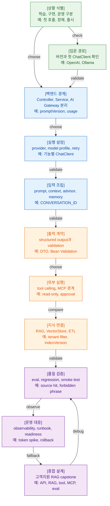

>[!success] 이 가이드북을 통해 아래 질문들에 답할 수 있게 됩니다.
>- Spring AI 기능을 처음 붙일 때 무엇부터 확인하고 어떤 문서를 먼저 봐야 하는가?
>- 데모 코드를 운영 코드로 키울 때 어떤 경계를 먼저 분리해야 하는가?
>- RAG, tool calling, MCP, structured output 중 지금 문제에 필요한 선택지는 무엇인가?
>- 장애가 났을 때 provider, RAG, tool, prompt, 비용 문제를 어떻게 나눠 확인해야 하는가?
>- 출시 전 코드 리뷰와 인프라 협업에서 빠뜨리면 안 되는 점검 항목은 무엇인가?

## 이 가이드북을 쓰는 법

이 문서는 Spring AI 내용을 다시 요약하는 문서가 아니다. 이미 있는 14개 문서를 실전 상황에서 빠르게 다시 찾아가기 위한 안내서다.

처음 공부한다면 `Case 1`부터 `Case 14`까지 순서대로 읽는다. Spring AI가 단순 호출에서 gateway, context, tool, RAG, eval, 운영까지 어떻게 커지는지 업무 흐름으로 잡을 수 있다.

이미 구현 중이라면 필요한 상황만 골라 본다. “첫 호출이 실패한다”, “Controller에서 바로 호출하고 있다”, “RAG가 이상한 문서를 물고 온다”, “tool이 side effect를 만든다”, “출시 전 리뷰가 필요하다”처럼 지금 겪는 문제를 기준으로 Case를 찾는다.

각 Case의 `찾아볼 문서`는 다시 읽을 상세 문서의 입구다. 이 가이드북에서 판단 순서를 잡고, 실제 코드와 설정은 연결된 문서에서 확인한다.

## 실전 판단 지도

## 상황별 실전 가이드

### Case 1. Spring AI를 처음 공부해야 한다

#### 상황
- Spring Boot 백엔드 개발자로 AI 기능을 붙이고 싶지만, Spring AI 문서를 어디서부터 읽어야 할지 모른다.

#### 관찰할 증거 또는 확인할 단서
- Boot 3.x 프로젝트인지 Boot 4.x 프로젝트인지 아직 모른다.
- OpenAI와 Ollama 중 무엇으로 시작할지 정하지 않았다.
- 목표가 단순 챗봇인지 운영 가능한 기능인지 흐릿하다.

#### 먼저 생각해보기
- 지금 필요한 것은 최신 API 학습인가, 기존 서비스 적용인가?
- 첫 목표가 모델 호출 성공인가, 운영 가능한 설계 초안인가?

#### 찾아볼 문서
- [00. Spring AI 압축 정리](<00. Spring AI 압축 정리.md>) - 전체 주제와 상세 문서 위치를 빠르게 잡는다.
- [01. Spring AI 학습 로드맵과 버전 선택](<01. Spring AI 학습 로드맵과 버전 선택.md>) - Spring AI 2.0.x, Boot 4.x, Boot 3.x 호환성 판단을 확인한다.
- [02. 개발 환경 구축과 첫 ChatClient](<02. 개발 환경 구축과 첫 ChatClient.md>) - 첫 호출에 필요한 의존성, provider 설정, 최소 코드를 본다.

#### 정리
- 먼저 학습 기준 버전을 정한다.
- OpenAI로 managed provider 감각을 익히고, Ollama는 비용 없는 반복 실습과 로컬 실행 제약을 확인하는 용도로 둔다.
- 첫 호출 성공만으로 학습을 끝내지 말고 `03` 이후의 gateway와 운영 경계를 바로 이어서 본다.

#### 가져갈 한 문장
- 첫 호출은 출발선이고, Spring AI 학습의 본게임은 호출 이후의 경계와 운영에서 시작된다.

### Case 2. 첫 ChatClient 호출은 성공했지만 운영 코드로 키우기 불안하다

#### 상황
- `/api/ai/ask` 같은 엔드포인트에서 답변은 나오지만, 이 코드를 그대로 서비스에 붙여도 되는지 확신이 없다.

#### 관찰할 증거 또는 확인할 단서
- Controller가 `ChatClient`, prompt, model 이름을 직접 안다.
- provider 예외가 그대로 사용자 응답이나 로그에 드러난다.
- token usage, latency, prompt version 기록이 없다.

#### 먼저 생각해보기
- 이 코드는 실습 코드인가, 운영 코드의 시작점인가?
- 실패했을 때 사용자 메시지와 내부 장애 원인을 분리할 수 있는가?

#### 찾아볼 문서
- [02. 개발 환경 구축과 첫 ChatClient](<02. 개발 환경 구축과 첫 ChatClient.md>) - 첫 호출 코드의 성공 경로와 흔한 오류를 확인한다.
- [03. Spring Boot 계층 설계와 AI Gateway](<03. Spring Boot 계층 설계와 AI Gateway.md>) - Controller, service, gateway 경계를 나눈다.
- [04. ChatClient Model Auto Configuration](<04. ChatClient Model Auto Configuration.md>) - 기능별 `ChatClient`와 model profile을 분리한다.
- [11. Observability와 장애 대응 런북](<11. Observability와 장애 대응 런북.md>) - 최소 metric과 audit log 차원을 확인한다.

#### 정리
- Controller는 HTTP 계약만 맡기고, AI 호출은 service와 AI Gateway 뒤로 옮긴다.
- prompt version, model profile, tenant, latency, error type을 gateway에서 기록한다.
- 첫 호출 코드는 버리지 말고, 운영 경계를 세우는 기준 샘플로 작게 보존한다.

#### 가져갈 한 문장
- 데모 코드는 답을 보여주고, gateway는 그 답이 실패할 때를 설명해준다.

### Case 3. 계층 분리가 흐릿해서 테스트와 변경이 어려워졌다

#### 상황
- AI 기능이 여러 Controller와 service에 흩어져 있고, provider를 바꾸거나 fake test를 만들 때마다 코드가 흔들린다.

#### 관찰할 증거 또는 확인할 단서
- 업무 service가 Spring AI 타입이나 provider raw response를 직접 안다.
- prompt version과 model profile이 메서드마다 문자열로 흩어져 있다.
- 테스트가 실제 provider 호출에 의존한다.

#### 먼저 생각해보기
- 업무 정책과 AI provider 호출 정책이 같은 계층에 섞여 있는가?
- 이 기능을 fake gateway로 테스트할 수 있는가?

#### 찾아볼 문서
- [03. Spring Boot 계층 설계와 AI Gateway](<03. Spring Boot 계층 설계와 AI Gateway.md>) - AI Gateway 책임과 내부 DTO 경계를 다시 잡는다.
- [10. Evaluation Testing Regression](<10. Evaluation Testing Regression.md>) - fake gateway, adapter test, provider smoke test를 나눈다.
- [13. 고객지원 RAG Capstone](<13. 고객지원 RAG Capstone.md>) - 전체 서비스 흐름에서 gateway가 어디에 놓이는지 본다.

#### 정리
- 업무 service는 `SupportAiGateway` 같은 업무 언어의 interface에만 의존하게 만든다.
- Spring AI 구현체는 prompt 조립, provider 호출, 예외 변환, usage 기록을 맡는다.
- 테스트는 대부분 fake gateway로 빠르게 돌리고, 실제 provider는 smoke test와 eval로 제한한다.

#### 가져갈 한 문장
- AI 호출도 외부 시스템 호출이다. 업무 코드가 provider의 기분까지 알 필요는 없다.

### Case 4. model, provider, retry 설정을 어떻게 관리할지 고민된다

#### 상황
- 기능별로 모델을 다르게 쓰고 싶고, retry를 켜야 할지도 고민된다. model 이름이 코드 곳곳에 들어가기 시작했다.

#### 관찰할 증거 또는 확인할 단서
- `gpt-...` 같은 물리 모델명이 service 코드에 직접 있다.
- retry가 provider 429 상황에서 latency와 비용을 키운다.
- 기능마다 system prompt, tool set, output format이 다른데 같은 `ChatClient`를 쓴다.

#### 먼저 생각해보기
- 기능별 model profile이 필요한가?
- retry는 사용자 경험을 개선하는가, 실패를 늦추고 비싸게 만드는가?

#### 찾아볼 문서
- [04. ChatClient Model Auto Configuration](<04. ChatClient Model Auto Configuration.md>) - `ChatClient`, `ChatModel`, auto-configuration, model profile 책임을 구분한다.
- [03. Spring Boot 계층 설계와 AI Gateway](<03. Spring Boot 계층 설계와 AI Gateway.md>) - model profile을 gateway command에 포함하는 흐름을 본다.
- [11. Observability와 장애 대응 런북](<11. Observability와 장애 대응 런북.md>) - retry, provider error, latency를 운영 지표로 보는 방법을 확인한다.
- [12. Production Readiness와 인프라 협업](<12. Production Readiness와 인프라 협업.md>) - model 변경을 배포 자산으로 관리하는 기준을 본다.

#### 정리
- 물리 모델명은 기능 코드에서 숨기고 `default-chat`, `strict-json` 같은 profile로 다룬다.
- prompt, advisor, tool set, output format이 다르면 기능별 `ChatClient`를 분리한다.
- retry는 작게 시작하고, provider retry와 application retry가 겹치지 않게 본다.

#### 가져갈 한 문장
- model profile은 코드의 취향 정리가 아니라 운영 중 바꿀 수 있는 안전핀이다.

### Case 5. 답변 품질이 흔들리고 memory나 context가 의심된다

#### 상황
- 같은 질문인데 답변이 달라지고, 이전 대화나 검색 결과가 섞인 것처럼 보인다.

#### 관찰할 증거 또는 확인할 단서
- `ChatMemory.CONVERSATION_ID`가 누락되었거나 사용자/테넌트 격리 기준이 없다.
- advisor 순서를 설명할 수 없다.
- context assembler가 권한, 최신성, token budget을 따로 보지 않는다.
- prompt 원문만 고치고 검색 결과나 memory 오염 여부는 확인하지 않는다.

#### 먼저 생각해보기
- 문제는 prompt 문구인가, context 선택인가, memory 재주입인가?
- 모델 입력에 들어간 데이터가 모두 권한과 최신성 기준을 통과했는가?

#### 찾아볼 문서
- [05. Prompt Context Advisor Memory 설계](<05. Prompt Context Advisor Memory 설계.md>) - prompt, context, advisor, memory, harness 책임을 나눈다.
- [09. Embedding VectorStore RAG ETL 설계](<09. Embedding VectorStore RAG ETL 설계.md>) - 검색 context와 metadata filter 기준을 확인한다.
- [11. Observability와 장애 대응 런북](<11. Observability와 장애 대응 런북.md>) - prompt version, model profile, index version, memory id 추적 기준을 본다.

#### 정리
- prompt만 보지 말고 모델 입력 전체를 본다.
- memory는 기본 OFF에서 시작하고, 필요한 유스케이스에만 conversation id, TTL, 삭제 정책을 붙인다.
- advisor chain은 순서를 문서화하고 변경 시 eval과 trace로 확인한다.

#### 가져갈 한 문장
- 답변 품질은 문장력보다 어떤 정보를 넣었는지에서 더 자주 흔들린다.

### Case 6. 모델 출력을 서버 로직에 연결해야 한다

#### 상황
- 티켓 분류, 환불 판단, escalation 여부처럼 모델 답변을 문자열이 아니라 서버 로직의 입력으로 써야 한다.

#### 관찰할 증거 또는 확인할 단서
- JSON 파싱은 성공했지만 필수값, enum, 범위, 업무 rule이 틀린다.
- 모델 confidence를 승인/거절의 근거로 바로 사용한다.
- invalid output 발생 시 무한 재시도하거나 일반 500으로 처리한다.

#### 먼저 생각해보기
- 이 출력은 화면 표시용인가, DB 변경이나 업무 판단으로 이어지는가?
- 검증 실패 시 retry, fallback, human review 중 무엇이 맞는가?

#### 찾아볼 문서
- [06. Structured Output과 Bean Validation](<06. Structured Output과 Bean Validation.md>) - DTO 설계, Bean Validation, 업무 rule 검증 흐름을 본다.
- [10. Evaluation Testing Regression](<10. Evaluation Testing Regression.md>) - schema valid, forbidden phrase, latency 같은 속성 검증을 확인한다.
- [07. Tool Calling과 Side Effect 방어](<07. Tool Calling과 Side Effect 방어.md>) - DTO 결과가 tool 실행으로 이어질 때의 위험을 본다.

#### 정리
- 출력 DTO는 작게 시작하고 내부 entity를 그대로 노출하지 않는다.
- Bean Validation은 형태와 값 범위를 잡고, 업무 rule은 별도로 검증한다.
- invalid output은 error type으로 집계하고, 기능별 fallback 정책을 둔다.

#### 가져갈 한 문장
- JSON이 맞았다는 말은 업무적으로 안전하다는 말의 아주 작은 일부다.

### Case 7. tool calling으로 서버 기능을 실행하게 만들고 싶다

#### 상황
- 모델이 주문 조회, 계정 상태 확인, 메일 발송, 환불 요청 같은 서버 기능을 호출하게 만들고 싶다.

#### 관찰할 증거 또는 확인할 단서
- 모델이 만든 `tenantId`, `userId`, `role`을 그대로 사용하려 한다.
- read-only tool과 write tool의 승인 기준이 같다.
- tool output에 내부 entity, 개인정보, secret이 포함된다.
- retry와 중복 실행 방어가 없다.

#### 먼저 생각해보기
- 이 tool은 조회 전용인가, side effect를 만드는가?
- 모델이 결정해도 되는 일인가, 사용자의 승인이나 별도 API가 필요한 일인가?

#### 찾아볼 문서
- [07. Tool Calling과 Side Effect 방어](<07. Tool Calling과 Side Effect 방어.md>) - read-only, write, approval, idempotency, audit 기준을 확인한다.
- [06. Structured Output과 Bean Validation](<06. Structured Output과 Bean Validation.md>) - tool 실행 전 action plan을 DTO로 검증하는 흐름을 본다.
- [11. Observability와 장애 대응 런북](<11. Observability와 장애 대응 런북.md>) - tool execution id와 중복 실행 장애를 확인한다.
- [12. Production Readiness와 인프라 협업](<12. Production Readiness와 인프라 협업.md>) - tool schema와 rollback을 배포 자산으로 본다.

#### 정리
- read-only tool부터 시작하고, 권한 검사는 서버 context 기준으로 한다.
- write tool은 action plan, approval gate, idempotency key, audit log가 준비된 뒤 연다.
- tool result는 모델 context로 다시 들어갈 수 있으므로 노출 가능한 DTO로 줄인다.

#### 가져갈 한 문장
- tool은 함수가 아니라 모델에게 열어주는 서버 API다.

### Case 8. MCP를 도입할지 tool calling만 쓸지 고민된다

#### 상황
- 외부 도구, 운영 조회, 사내 문서, IDE/agent 연동을 표준 방식으로 묶고 싶지만 MCP가 필요한지 확신이 없다.

#### 관찰할 증거 또는 확인할 단서
- 여러 client가 같은 tool/resource를 써야 한다.
- MCP server가 어떤 tool을 노출하는지 inventory가 없다.
- 내부망이라는 이유로 인증, 인가, 감사 로그를 생략하려 한다.
- write operation을 바로 노출하려 한다.

#### 먼저 생각해보기
- 이 기능은 우리 애플리케이션 내부에서만 쓰는 tool인가, 여러 AI client가 재사용해야 하는 표준 접점인가?
- MCP server를 운영하는 팀, 네트워크 위치, 인증 방식은 정해졌는가?

#### 찾아볼 문서
- [08. MCP Client Server 통합](<08. MCP Client Server 통합.md>) - MCP client/server 책임과 보안·운영 경계를 본다.
- [07. Tool Calling과 Side Effect 방어](<07. Tool Calling과 Side Effect 방어.md>) - MCP tool도 결국 실행 경계라는 점을 확인한다.
- [12. Production Readiness와 인프라 협업](<12. Production Readiness와 인프라 협업.md>) - 인프라팀과 합의할 transport, 인증, 로그, rollback을 본다.
- [13. 고객지원 RAG Capstone](<13. 고객지원 RAG Capstone.md>) - 운영 조회용 read-only MCP tool 예시를 확인한다.

#### 정리
- 내부 기능 하나만 모델이 쓰면 Spring AI tool calling으로 충분할 수 있다.
- 여러 client가 재사용하고 표준 인터페이스가 필요하면 MCP를 검토한다.
- MCP server는 read-only부터 시작하고, 인증과 감사 로그 없는 운영 노출은 피한다.

#### 가져갈 한 문장
- MCP는 연결을 표준화하지만, 책임을 대신 져주지는 않는다.

### Case 9. RAG를 붙였는데 어떤 문서를 검색해야 할지 설계가 막힌다

#### 상황
- FAQ나 정책 문서를 넣고 답변은 나오지만, 권한, 최신성, source, 재색인 기준이 정리되지 않았다.

#### 관찰할 증거 또는 확인할 단서
- vector store에 원문 text만 있고 tenant, role, source id, index version이 없다.
- 권한 필터를 retrieval 이후 prompt 지시로 처리한다.
- 삭제된 문서가 검색 결과에 남는다.
- chunk size를 근거 없이 정했다.

#### 먼저 생각해보기
- 검색 결과가 사용자의 권한과 최신성을 만족하는가?
- 답변 source를 나중에 추적할 수 있는가?

#### 찾아볼 문서
- [09. Embedding VectorStore RAG ETL 설계](<09. Embedding VectorStore RAG ETL 설계.md>) - ingestion, chunking, metadata, retrieval, generation 흐름을 본다.
- [05. Prompt Context Advisor Memory 설계](<05. Prompt Context Advisor Memory 설계.md>) - 검색 결과를 context로 조립하는 기준을 본다.
- [10. Evaluation Testing Regression](<10. Evaluation Testing Regression.md>) - retrieval hit와 forbidden leak 검증을 확인한다.
- [13. 고객지원 RAG Capstone](<13. 고객지원 RAG Capstone.md>) - 고객지원 RAG의 end-to-end 흐름을 본다.

#### 정리
- RAG 설계는 vector DB 선택보다 metadata와 권한 필터에서 시작한다.
- index version을 두고 embedding model, chunk policy, source 변경을 추적한다.
- 검색 결과 없음은 오류가 아니라 정상 상태일 수 있으므로 no-answer/fallback도 설계한다.

#### 가져갈 한 문장
- RAG의 첫 품질은 모델이 아니라 문서를 넣는 방식에서 결정된다.

### Case 10. RAG 품질이 나빠졌는데 어디서 깨졌는지 모르겠다

#### 상황
- 어제까지 잘 답하던 고객지원 RAG가 오늘은 source를 못 찾거나 오래된 정책을 인용한다.

#### 관찰할 증거 또는 확인할 단서
- index version, embedding model, chunk policy 변경 이력이 없다.
- retrieval hit와 generation 품질을 분리해서 보지 않는다.
- eval set 없이 index를 재생성했다.
- vector DB latency와 provider latency를 같은 장애로 본다.

#### 먼저 생각해보기
- 검색이 실패한 것인가, 검색은 됐지만 답변 생성이 실패한 것인가?
- 문서 최신성 문제인가, 권한 필터 문제인가, index 배포 문제인가?

#### 찾아볼 문서
- [09. Embedding VectorStore RAG ETL 설계](<09. Embedding VectorStore RAG ETL 설계.md>) - index version, metadata, 재색인 흐름을 확인한다.
- [10. Evaluation Testing Regression](<10. Evaluation Testing Regression.md>) - RAG eval과 source 검증 기준을 본다.
- [11. Observability와 장애 대응 런북](<11. Observability와 장애 대응 런북.md>) - retrieval hit, index version, latency를 trace로 묶는다.
- [12. Production Readiness와 인프라 협업](<12. Production Readiness와 인프라 협업.md>) - vector DB backup, restore, rebuild 운영 기준을 본다.

#### 정리
- 먼저 retrieval 결과를 직접 확인한다.
- 다음으로 context packing과 source id 유지 여부를 본다.
- 마지막으로 generation, structured output, fallback을 확인한다.

#### 가져갈 한 문장
- RAG 장애를 한 덩어리로 보면 고칠 곳도 한 덩어리로 흐려진다.

### Case 11. 장애 신고가 들어왔는데 provider 문제인지 애플리케이션 문제인지 모르겠다

#### 상황
- 사용자는 느리거나 틀린 답변을 받았고, 운영자는 `AI가 이상하다`는 신고만 받았다.

#### 관찰할 증거 또는 확인할 단서
- feature, prompt version, model profile, index version, tool execution id가 로그에 없다.
- token spike, validation failure, retrieval miss를 볼 dashboard가 없다.
- timeout, quota, JSON 깨짐, tool 중복 실행이 모두 같은 500으로 보인다.

#### 먼저 생각해보기
- 증상은 latency, 비용, 품질, 권한, 출력 형식, side effect 중 무엇인가?
- fallback은 다른 모델 호출뿐인가, 검색 결과 제공이나 비동기 전환도 가능한가?

#### 찾아볼 문서
- [11. Observability와 장애 대응 런북](<11. Observability와 장애 대응 런북.md>) - 장애 유형별 첫 확인 항목과 fallback 선택지를 본다.
- [04. ChatClient Model Auto Configuration](<04. ChatClient Model Auto Configuration.md>) - provider, retry, model profile 설정을 확인한다.
- [07. Tool Calling과 Side Effect 방어](<07. Tool Calling과 Side Effect 방어.md>) - tool 중복 실행과 side effect를 점검한다.
- [12. Production Readiness와 인프라 협업](<12. Production Readiness와 인프라 협업.md>) - 장애 대응과 rollback 기준을 운영 계약으로 본다.

#### 정리
- 먼저 user-facing 증상을 분류한다.
- gateway trace에서 provider, RAG, structured output, tool, memory 중 어느 단계가 실패했는지 좁힌다.
- 사용자 안내 문구와 내부 조치 절차를 런북에 함께 남긴다.

#### 가져갈 한 문장
- AI 장애 대응은 모델을 탓하기 전에 어느 경계가 흔들렸는지 이름을 붙이는 일이다.

### Case 12. 출시 전 코드 리뷰와 production readiness를 해야 한다

#### 상황
- Spring AI 기능이 staging에서 동작하고, 이제 production 배포 전 리뷰를 해야 한다.

#### 관찰할 증거 또는 확인할 단서
- API key rotation, egress, proxy, provider 장애 대응이 문서화되지 않았다.
- prompt/model/index/tool schema 변경이 release note에 없다.
- eval gate나 rollback 문서가 없다.
- 인프라팀이 vector DB나 MCP server 존재를 모른다.

#### 먼저 생각해보기
- 이 기능이 새 외부 의존성, 새 저장소, 새 로그 차원을 만들었는가?
- 배포 후 문제가 생기면 어떤 버전을 어떻게 되돌릴 수 있는가?

#### 찾아볼 문서
- [12. Production Readiness와 인프라 협업](<12. Production Readiness와 인프라 협업.md>) - 출시 전 운영 계약과 체크리스트를 본다.
- [10. Evaluation Testing Regression](<10. Evaluation Testing Regression.md>) - prompt/model/index 변경 전 regression gate를 확인한다.
- [11. Observability와 장애 대응 런북](<11. Observability와 장애 대응 런북.md>) - 운영 지표와 장애 런북을 점검한다.
- [13. 고객지원 RAG Capstone](<13. 고객지원 RAG Capstone.md>) - 종합 산출물 기준을 확인한다.

#### 정리
- code release와 prompt/model/index/tool schema release를 연결한다.
- 개인 프로젝트라도 timeout, quota, validation, 작은 eval, 로그 마스킹은 챙긴다.
- 기업 운영에서는 secret, egress, vector DB, MCP, audit log, incident runbook을 인프라팀과 같이 본다.

#### 가져갈 한 문장
- Spring AI 출시는 코드 배포가 아니라 새 운영 계약을 배포하는 일에 가깝다.

### Case 13. 개인 프로젝트를 포트폴리오급 Spring AI 서비스로 만들고 싶다

#### 상황
- 단순 챗봇이 아니라 백엔드 개발자로서 수준 있는 AI 프로젝트를 보여주고 싶다.

#### 관찰할 증거 또는 확인할 단서
- 첫 ChatClient 호출만 있고 계층, RAG, eval, observability가 없다.
- source id, index version, prompt version이 응답이나 로그에 없다.
- 실패 시 사용자 메시지와 내부 원인 분리가 없다.

#### 먼저 생각해보기
- 이 프로젝트를 운영한다고 가정하면 무엇이 먼저 깨질까?
- 사용자가 틀린 답을 받았을 때 원인을 추적할 수 있는가?

#### 찾아볼 문서
- [13. 고객지원 RAG Capstone](<13. 고객지원 RAG Capstone.md>) - capstone 산출물과 acceptance criteria를 확인한다.
- [01. Spring AI 학습 로드맵과 버전 선택](<01. Spring AI 학습 로드맵과 버전 선택.md>) - 입문부터 운영 입문-고급까지 학습 순서를 잡는다.
- [03. Spring Boot 계층 설계와 AI Gateway](<03. Spring Boot 계층 설계와 AI Gateway.md>) - 프로젝트의 백엔드 구조를 갖춘다.
- [09. Embedding VectorStore RAG ETL 설계](<09. Embedding VectorStore RAG ETL 설계.md>) - RAG 지식 파이프라인을 설계한다.
- [12. Production Readiness와 인프라 협업](<12. Production Readiness와 인프라 협업.md>) - 개인 프로젝트 최소 운영 기준을 확인한다.

#### 정리
- 고객지원 RAG를 주제로 잡으면 ChatClient, gateway, RAG, structured output, read-only tool, eval, observability를 한 번에 묶을 수 있다.
- 기능 수를 늘리기보다 운영 가능한 증거를 남긴다.
- README에는 성공 경로뿐 아니라 실패 경로, fallback, eval 결과, 배포 메타데이터를 넣는다.

#### 가져갈 한 문장
- 포트폴리오의 깊이는 기능 수보다 실패를 설명하는 문서에서 드러난다.

### Case 14. AI 기능 PR을 리뷰해야 한다

#### 상황
- 팀원이 Spring AI 기능 PR을 올렸고, 단순 동작 여부를 넘어 운영 위험까지 리뷰해야 한다.

#### 관찰할 증거 또는 확인할 단서
- Controller에 prompt와 `ChatClient`가 직접 있다.
- structured output 검증, tool 권한, RAG source, eval, observability 중 빠진 항목이 있다.
- prompt/model/index 변경이 테스트 없이 포함되어 있다.
- 링크된 설계 문서나 런북이 없다.

#### 먼저 생각해보기
- 이 PR은 학습용 데모인가, production으로 갈 코드인가?
- 실패했을 때 사용자 영향, 비용 영향, 데이터 영향, 운영자 조치가 설명되는가?

#### 찾아볼 문서
- [00. Spring AI 압축 정리](<00. Spring AI 압축 정리.md>) - 전체 주제 누락 여부를 빠르게 훑는다.
- [03. Spring Boot 계층 설계와 AI Gateway](<03. Spring Boot 계층 설계와 AI Gateway.md>) - 계층과 gateway 경계를 확인한다.
- [06. Structured Output과 Bean Validation](<06. Structured Output과 Bean Validation.md>) - DTO와 validation 누락을 확인한다.
- [07. Tool Calling과 Side Effect 방어](<07. Tool Calling과 Side Effect 방어.md>) - tool side effect와 권한 경계를 본다.
- [10. Evaluation Testing Regression](<10. Evaluation Testing Regression.md>) - regression gate와 테스트 층을 확인한다.
- [11. Observability와 장애 대응 런북](<11. Observability와 장애 대응 런북.md>) - 운영 지표와 장애 분류를 점검한다.

#### 정리
- 리뷰는 “답변이 나온다”에서 멈추지 않는다.
- 호출 경계, 입력 조립, 출력 검증, 외부 실행, 지식 검색, 테스트, 관측성, 배포 자산을 차례로 본다.
- 빠진 항목은 지금 구현할지, release blocker로 둘지, follow-up으로 뺄지 명확히 남긴다.

#### 가져갈 한 문장
- AI 기능 리뷰의 질문은 “맞게 답했나”보다 “틀릴 때 무엇이 보이나”에 더 가깝다.

## 커버리지 지도

| 기존 문서 | 연결된 Case | 역할 |
|---|---:|---|
| [00. Spring AI 압축 정리](<00. Spring AI 압축 정리.md>) | Case 1, Case 14 | 전체 주제 누락 확인 |
| [01. Spring AI 학습 로드맵과 버전 선택](<01. Spring AI 학습 로드맵과 버전 선택.md>) | Case 1, Case 13 | 학습 순서와 버전 판단 |
| [02. 개발 환경 구축과 첫 ChatClient](<02. 개발 환경 구축과 첫 ChatClient.md>) | Case 1, Case 2 | 첫 호출과 환경 구축 |
| [03. Spring Boot 계층 설계와 AI Gateway](<03. Spring Boot 계층 설계와 AI Gateway.md>) | Case 2, Case 3, Case 4, Case 13, Case 14 | 백엔드 계층과 gateway 경계 |
| [04. ChatClient Model Auto Configuration](<04. ChatClient Model Auto Configuration.md>) | Case 2, Case 4, Case 11 | provider, model profile, retry 설정 |
| [05. Prompt Context Advisor Memory 설계](<05. Prompt Context Advisor Memory 설계.md>) | Case 5, Case 9 | 입력 조립과 memory/advisor 경계 |
| [06. Structured Output과 Bean Validation](<06. Structured Output과 Bean Validation.md>) | Case 6, Case 7, Case 14 | DTO 계약과 검증 |
| [07. Tool Calling과 Side Effect 방어](<07. Tool Calling과 Side Effect 방어.md>) | Case 6, Case 7, Case 8, Case 11, Case 14 | 서버 실행 경계와 side effect 방어 |
| [08. MCP Client Server 통합](<08. MCP Client Server 통합.md>) | Case 8 | MCP client/server 도입 판단 |
| [09. Embedding VectorStore RAG ETL 설계](<09. Embedding VectorStore RAG ETL 설계.md>) | Case 5, Case 9, Case 10, Case 13 | RAG, metadata, index 운영 |
| [10. Evaluation Testing Regression](<10. Evaluation Testing Regression.md>) | Case 3, Case 6, Case 9, Case 10, Case 12, Case 14 | 테스트 층과 eval gate |
| [11. Observability와 장애 대응 런북](<11. Observability와 장애 대응 런북.md>) | Case 2, Case 4, Case 5, Case 7, Case 10, Case 11, Case 12, Case 14 | 지표, 로그, trace, 장애 대응 |
| [12. Production Readiness와 인프라 협업](<12. Production Readiness와 인프라 협업.md>) | Case 4, Case 7, Case 8, Case 10, Case 11, Case 12, Case 13 | 출시 전 운영 계약과 인프라 협업 |
| [13. 고객지원 RAG Capstone](<13. 고객지원 RAG Capstone.md>) | Case 3, Case 8, Case 9, Case 12, Case 13 | 전체 설계와 졸업 과제 |

## 상황별 빠른 길찾기

- 처음 공부한다 -> Case 1, Case 2, Case 13
- 첫 호출은 됐는데 구조가 불안하다 -> Case 2, Case 3, Case 4
- 답변 품질이나 context가 이상하다 -> Case 5, Case 9, Case 10
- DTO나 업무 로직으로 모델 출력을 연결한다 -> Case 6, Case 14
- tool calling이나 MCP를 붙인다 -> Case 7, Case 8
- RAG를 설계하거나 디버깅한다 -> Case 9, Case 10, Case 13
- 장애를 디버깅한다 -> Case 10, Case 11
- 출시 전 리뷰가 필요하다 -> Case 12, Case 14
- 개인 프로젝트를 수준 있게 만들고 싶다 -> Case 13, Case 12

## 실전 체크리스트

- Spring Boot, Spring AI, provider starter 버전과 호환성을 확인했는가?
- API key와 provider secret이 코드, 노트, 일반 로그에 남지 않는가?
- Controller가 `ChatClient`, prompt, model 이름을 직접 알지 않는가?
- AI Gateway가 prompt version, model profile, latency, token, error type을 기록하는가?
- 기능별 `ChatClient`와 model profile이 필요한 곳에서 분리되어 있는가?
- retry가 provider 429, timeout, side effect tool 중복 실행을 악화시키지 않는가?
- prompt, context, advisor, memory의 책임과 순서를 설명할 수 있는가?
- memory를 쓴다면 `ChatMemory.CONVERSATION_ID`, TTL, 삭제, 민감정보 정책이 있는가?
- structured output DTO가 작고, Bean Validation과 업무 rule 검증을 통과하는가?
- invalid output 발생 시 retry, fallback, human review 기준이 정해져 있는가?
- tool input은 서버 인증 context로 검증하고, tool output은 외부 노출 DTO로 줄였는가?
- write tool에는 approval gate, idempotency key, audit log가 있는가?
- MCP server는 read-only부터 시작하고, 인증/인가/감사/네트워크 경계가 합의되었는가?
- RAG metadata에 tenant, source id, ACL 또는 role, updated at, embedding model, index version이 있는가?
- 권한 필터가 retrieval 전에 적용되는가?
- prompt/model/index/tool schema 변경 전에 작은 eval gate를 통과하는가?
- metrics, logs, traces가 feature, model profile, prompt version, index version, tool execution id를 연결하는가?
- raw prompt와 completion을 장기 일반 로그로 저장하지 않는가?
- provider 장애, vector DB 장애, structured output 실패, tool 중복 실행의 런북이 분리되어 있는가?
- 출시 전 production readiness 문서에 secret, egress, quota, rollback, incident owner가 적혀 있는가?

## 흔한 오해

- `ChatClient` 호출이 성공하면 Spring AI 적용이 끝났다고 생각한다.
	- 실제 시작점은 호출 이후의 gateway, 예외 변환, 사용량 기록, 테스트 경계다.
- Spring bean으로 주입되면 내부 의존성처럼 안정적이라고 생각한다.
	- provider는 네트워크, quota, 비용, 정책 변경을 가진 외부 시스템이다.
- prompt 문구를 잘 쓰면 context engineering이 끝난다고 생각한다.
	- 실전에서는 권한, 최신성, token budget, memory, retrieval 순서가 더 자주 품질을 흔든다.
- structured output이면 안전하다고 생각한다.
	- DTO 매핑은 시작일 뿐이고 Bean Validation, 업무 rule, fallback이 필요하다.
- tool description에 금지사항을 적으면 보안이 된다고 생각한다.
	- description은 모델 힌트이고 권한 검사는 서버 코드의 책임이다.
- MCP를 쓰면 외부 도구 통합이 자동으로 안전해진다고 생각한다.
	- MCP는 연결 표준이고 인증, 인가, 감사, rate limit은 별도 설계다.
- Vector DB를 붙이면 RAG가 완성된다고 생각한다.
	- RAG 품질은 ingestion, metadata, 권한 필터, 재색인, eval에서 많이 결정된다.
- 모델 응답이 비결정적이라 테스트할 수 없다고 생각한다.
	- exact match 대신 schema valid, required source, forbidden phrase, latency, safety를 검증할 수 있다.
- observability를 켜면 자동으로 원인이 보인다고 생각한다.
	- 어떤 tag와 event를 남길지 설계하지 않으면 trace가 있어도 원인이 흐릿하다.
- 개인 프로젝트에는 운영 기준이 과하다고 생각한다.
	- timeout, quota, validation, 작은 eval, source id, index version만 챙겨도 결과물의 신뢰도가 달라진다.

## 참고한 기존 문서

- 전체 기준: [00. Spring AI 압축 정리](<00. Spring AI 압축 정리.md>), [01. Spring AI 학습 로드맵과 버전 선택](<01. Spring AI 학습 로드맵과 버전 선택.md>)
- 입문과 계층 설계: [02. 개발 환경 구축과 첫 ChatClient](<02. 개발 환경 구축과 첫 ChatClient.md>), [03. Spring Boot 계층 설계와 AI Gateway](<03. Spring Boot 계층 설계와 AI Gateway.md>), [04. ChatClient Model Auto Configuration](<04. ChatClient Model Auto Configuration.md>)
- 핵심 기능 판단: [05. Prompt Context Advisor Memory 설계](<05. Prompt Context Advisor Memory 설계.md>), [06. Structured Output과 Bean Validation](<06. Structured Output과 Bean Validation.md>), [07. Tool Calling과 Side Effect 방어](<07. Tool Calling과 Side Effect 방어.md>), [08. MCP Client Server 통합](<08. MCP Client Server 통합.md>), [09. Embedding VectorStore RAG ETL 설계](<09. Embedding VectorStore RAG ETL 설계.md>)
- 운영과 졸업 과제: [10. Evaluation Testing Regression](<10. Evaluation Testing Regression.md>), [11. Observability와 장애 대응 런북](<11. Observability와 장애 대응 런북.md>), [12. Production Readiness와 인프라 협업](<12. Production Readiness와 인프라 협업.md>), [13. 고객지원 RAG Capstone](<13. 고객지원 RAG Capstone.md>)
