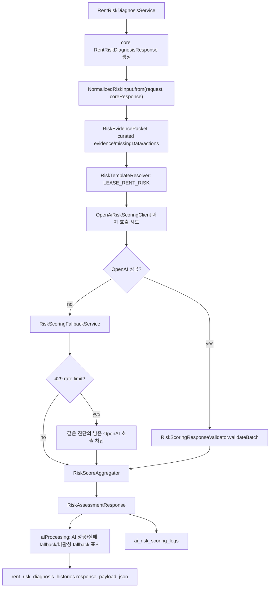

# AI 위험도 산정 엔진

> Status: Implemented

## 목적

ZIP:ON의 AI 위험도 산정 엔진은 사용자가 보는 매물의 전세·월세 계약 전 위험을 고정 항목별로 구조화해 보여주기 위한 보조 계층이다. AI는 최종 판정자가 아니며, 최종 총점과 등급은 백엔드의 `RiskScoreAggregator`와 `RiskGradeCalculator`가 계산한다.

이 구현은 자유 대화형 챗봇을 되살린 것이 아니다. 챗봇 UI, 대화 세션, Spring AI 설명 보조는 제거된 상태를 유지하고, `RentRiskDiagnosisService`가 만든 공공데이터 기반 core response 뒤에 `riskAssessment` 섹션을 추가한다.

## 구현 흐름



## 주요 클래스

| 파일 | 책임 |
| --- | --- |
| `com.zipon.risk.ai.RiskAssessmentService` | core response를 normalized input으로 바꾸고 항목별 산정, fallback, audit command를 조립한다. |
| `RiskEvidencePacket` | AI와 fallback이 사용할 수 있는 curated evidence, missingData, limitation, required action 묶음을 만든다. 원문 주소와 매물 설명은 넣지 않는다. |
| `RiskTemplateResolver` | `LEASE_RENT_RISK` 템플릿과 고정 criterion 12개를 제공한다. |
| `RiskPromptBuilder` | 단건/배치 프롬프트 본문을 코드에서 버전 관리한다. 실제 HTTP 구현은 배치 프롬프트를 사용한다. |
| `HttpOpenAiRiskScoringClient` | backend-only OpenAI Responses API 호출 경계다. `scoreTemplate(...)`은 12개 criterion을 1회 HTTP 요청으로 보낸다. |
| `RiskScoringResponseValidator` | 단건 JSON과 배치 JSON 응답의 필수 필드, 허용 필드, enum, 점수 범위, 상태별 점수 허용 여부, criterion 누락 여부를 검증한다. |
| `RiskScoringFallbackService` | OpenAI 비활성화/실패 시 고정 항목을 rule-based fallback으로 채운다. |
| `RiskScoreAggregator` | `baseScore`, `uncertaintyPenalty`, `totalRiskScore`를 계산한다. |
| `RiskGradeCalculator` | `LOW`, `MODERATE`, `HIGH`, `CRITICAL`, `NEED_MORE_INFORMATION`을 계산한다. |
| `RiskAiProcessingSummary` | 사용자/관리자 화면이 볼 AI 처리 상태, 시도 수, 성공 수, fallback 수, short-circuit 여부를 만든다. |
| `AiRiskScoringAuditMapper` | `ai_risk_scoring_logs`에 감사/디버깅 데이터를 저장한다. |

## 데이터 저장

진단 응답의 파싱 결과는 기존 `rent_risk_diagnosis_histories.response_payload_json`에 포함된다. 항목별 감사 로그는 `V16__create_ai_risk_scoring_logs.sql`이 만든 `ai_risk_scoring_logs`에 저장된다. AI 입력의 전체 `RiskEvidencePacket`은 prompt에는 포함되지만 감사 로그에는 전문을 저장하지 않고 packet version, evidence count, missingData count, requiredAction count만 `request_summary_json`에 남긴다.

저장하는 것:

- `template_code`, `criterion_code`, `prompt_version`, `schema_version`
- `provider`, `model`, `scoring_mode`
- 주소 원문을 제거한 `request_summary_json`
- `evidencePacketVersion`, `evidenceCount`, `missingDataCount`, `requiredActionCount`
- OpenAI가 성공했을 때의 `raw_response_json`
- 백엔드가 검증한 `parsed_response_json`
- `result_status`, `duration_millis`, `error_message`

저장하지 않는 것:

- `OPENAI_API_KEY`
- 전체 prompt 원문
- 전체 `RiskEvidencePacket` 전문
- 사용자가 입력한 원문 주소
- 등기부등본, 계약서, 민감 문서 원문

## OpenAI 호출 방식

`RiskAssessmentService`는 OpenAI가 켜져 있을 때 `OpenAiRiskScoringClient.scoreTemplate(...)`을 한 번 호출해 `LEASE_RENT_RISK` 12개 criterion을 배치로 산정한다. 실제 HTTP 구현인 `HttpOpenAiRiskScoringClient`는 OpenAI Responses API를 직접 호출한다. 의존성 추가를 피하기 위해 Java 21 `HttpClient`를 사용한다. 요청은 `store=false`, `temperature=0`, JSON Schema 기반 structured output을 사용한다. batch schema의 `criteria.minItems`와 `criteria.maxItems`는 현재 template의 criterion 개수에서 만든다. 관련 공식 문서는 [OpenAI Structured Outputs](https://developers.openai.com/api/docs/guides/structured-outputs)와 [Responses API reference](https://platform.openai.com/docs/api-reference/responses)를 기준으로 한다.

응답은 `{ templateCode, promptVersion, criteria: [...] }` 형태이며, `RiskScoringResponseValidator.validateBatch(...)`가 모든 criterion이 한 번씩 들어왔는지 확인한 뒤 각 항목을 기존 단건 검증 규칙으로 다시 검증한다. Structured Outputs schema에도 `additionalProperties=false`를 두지만, 백엔드는 한 번 더 허용 필드만 받는다. 또한 `AVAILABLE`, `PARTIAL`이 아닌 `DATA_MISSING`, `NEEDS_USER_DOCUMENT`, `NOT_APPLICABLE`, `AI_UNAVAILABLE`, `CALCULATION_FAILED` 상태에는 `riskScore=null`만 허용한다. 이 규칙은 데이터가 부족한 항목을 숫자로 포장하지 않기 위한 방어선이다. 최종 총점과 등급은 여전히 AI가 아니라 `RiskScoreAggregator`와 `RiskGradeCalculator`가 계산한다.

환경변수:

```properties
OPENAI_RISK_SCORING_ENABLED=false
OPENAI_API_KEY=
OPENAI_MODEL=
OPENAI_BASE_URL=https://api.openai.com/v1
OPENAI_TIMEOUT_MS=5000
OPENAI_MAX_OUTPUT_TOKENS=2400
OPENAI_RISK_SCORING_SEED=
```

Spring Boot 설정 키:

```properties
zipon.openai.risk-scoring.enabled
zipon.openai.risk-scoring.api-key
zipon.openai.risk-scoring.model
zipon.openai.risk-scoring.base-url
zipon.openai.risk-scoring.timeout-ms
zipon.openai.risk-scoring.max-output-tokens
zipon.openai.risk-scoring.seed
```

이 값들은 `OpenAiRiskScoringProperties`에 바인딩된다. `OPENAI_RISK_SCORING_ENABLED=false`가 기본값이고, `OPENAI_API_KEY`가 비어 있거나 `OPENAI_MODEL`이 비어 있으면 `HttpOpenAiRiskScoringClient`는 성공 결과를 만들지 않고 `RiskAssessmentService`가 fallback으로 전환한다.

무료 또는 낮은 usage tier에서 실제 검증을 할 때는 OpenAI Platform의 `Limits` 화면에서 현재 프로젝트에 허용된 가장 작은 structured-output 가능 모델을 `OPENAI_MODEL`로 지정한다. ZIP:ON 기본 요청은 12개 criterion을 한 번에 계산하므로, `OPENAI_MAX_OUTPUT_TOKENS`를 낮게 유지하고 실제 검증은 1회만 수행한다. 단, API free credit이나 billing 한도가 0인 프로젝트는 코드 최적화와 무관하게 성공 호출을 만들 수 없으며, 이 경우 `OPENAI_RISK_SCORING_ENABLED=false`로 두고 fallback 결과를 사용한다.

## Fallback

OpenAI가 꺼져 있거나 실패해도 진단은 실패하지 않는다.

- `OPENAI_RISK_SCORING_ENABLED=false`: 모든 항목은 `RULE_BASED_FALLBACK`
- OpenAI enabled지만 배치 호출/검증 실패: 모든 항목은 `HYBRID_FALLBACK`
- OpenAI가 4xx/5xx를 반환하면 상태 코드와 provider의 짧은 `error.message`만 `error_message`에 남기고, API key와 prompt 원문은 저장하지 않는다.
- 등기부등본, 선순위 임차인, 보증보험 항목은 확정하지 않고 `NEEDS_USER_DOCUMENT`
- 데이터 없음은 안전이 아니라 `DATA_MISSING` 또는 `NEEDS_USER_DOCUMENT`

`RiskAssessmentResponse.aiProcessing`은 사용자와 관리자 화면에서 아래 상태를 명확히 표시하기 위한 필드다.

| status | 사용자 표시 | 의미 |
| --- | --- | --- |
| `OPENAI_SUCCESS` | AI 성공 | OpenAI batch structured output이 모든 항목 검증을 통과했고, 백엔드가 최종 점수와 등급을 계산했다. |
| `OPENAI_PARTIAL_FALLBACK` | AI 일부 성공 + fallback | 일부 항목만 OpenAI 결과를 사용했고 나머지는 fallback으로 계산했다. 현재 batch 구조에서는 일반적으로 발생하지 않지만 이전/확장 구조 호환을 위해 남겨 둔다. |
| `OPENAI_FAILED_FALLBACK` | AI 실패 fallback | OpenAI batch 호출이나 검증이 성공하지 못해 모든 항목을 fallback으로 계산했다. 429 등 rate limit이면 `openAiShortCircuited=true`와 사유를 함께 내려준다. |
| `OPENAI_DISABLED_FALLBACK` | AI 비활성 fallback | 설정상 OpenAI를 호출하지 않고 rule-based fallback으로 계산했다. |

이 표시는 "AI가 최종 판단했다"는 뜻이 아니다. AI가 성공하더라도 최종 `totalRiskScore`, `riskGrade`, `displayVerdict`, `uncertaintyPenalty`는 `RiskScoreAggregator`와 `RiskGradeCalculator`가 계산한다.

## 관심 부동산 리포트 표시

`GET /api/favorites/{favoriteId}/analysis`는 새 OpenAI 호출을 만들지 않는다. 관심 부동산 리포트는 저장된 관심 조건, 공공데이터 근거, 같은 주소의 이전 `rent_risk_diagnosis_histories.response_payload_json`에 들어 있는 `riskAssessment`를 재사용한다. 이전 위험진단에 구조화 위험산정 결과가 있으면 `aiAssessment.criteria`도 해당 criterion 결과를 사용자용 문장으로 변환해 내려준다. 이전 위험진단에 구조화 위험산정 결과가 없으면 `aiAssessment.enabled=false`로 내려가며, 화면은 “최종 판정 아님”과 직접 확인 필요 항목을 표시한다.

관심 리포트의 `dashboardGrade`와 `reportSummary`는 프론트엔드나 AI가 계산하지 않는다. `FavoriteService.getFavoriteAnalysis(...)`가 건축물대장 정확 주소 매칭, 실거래, 월별 지역 통계, 공시가격, R-ONE 시장 signal, 이전 진단 근거 연결 상태를 조합해 사전 검토 등급과 summary 문장을 계산한다. 이 등급은 계약 가능 여부가 아니라 현재 확보된 근거로 사용자가 무엇을 더 확인해야 하는지 보여주는 화면용 신호다.

실제 OpenAI 검증을 할 때도 이 관심 리포트 조회를 이유로 추가 호출하지 않는다. OpenAI를 켠 정확 주소 위험진단 1건은 `RiskAssessmentService -> OpenAiRiskScoringClient.scoreTemplate(...)` 흐름으로 12개 기준을 1회 HTTP 요청에 묶어 산정한다.

## Decision: 비동기 분석과 polling/SSE

### Context

외부 공공 API, OpenAI structured output, 향후 사용자 문서 분석은 모두 요청 스레드 안에서 끝난다고 가정하기 어렵다. 사용자가 "분석 시작"을 눌렀을 때 화면이 오래 멈추면 실패처럼 보이고, 429/timeout이 전체 진단 실패로 오해될 수 있다.

### Options considered

1. 기존 `POST /api/rent-risk-diagnoses` 동기 응답 유지
2. `POST /api/rent-risk-diagnoses`를 202 Accepted + polling으로 변경
3. 기존 동기 API는 보존하고 `/api/rent-risk-diagnoses/async`를 추가
4. polling 대신 SSE를 먼저 도입

### Decision

다음 구현 단계는 기존 동기 API를 보존하고, 새 비동기 시작 API와 상태 조회 API를 추가한다. 기본 UX는 polling으로 시작하고, SSE는 상태 전파가 더 필요해질 때 확장한다.

```text
POST /api/rent-risk-diagnoses/async
-> 202 Accepted
-> diagnosisId, processingStatus: RECEIVED | RUNNING

GET /api/rent-risk-diagnoses/{diagnosisId}
-> processingStatus: RECEIVED | RUNNING | COMPLETED | FAILED | FALLBACK_COMPLETED
-> result가 준비되면 RentRiskDiagnosisResponse
```

### Why

기존 프론트와 테스트가 동기 API에 의존하고 있으므로 한 번에 깨지 않는다. polling은 Spring MVC와 현재 Vue 구조에서 가장 단순하게 검증할 수 있고, 서버 연결 수 관리 부담이 SSE보다 작다.

### Tradeoffs

- polling은 완료 직후 즉시 push되지 않으므로 약간의 지연이 있다.
- 진단 상태를 저장하려면 `rent_risk_diagnosis_histories`에 processing status, started/completed/failed timestamp, failure reason 같은 컬럼이 필요하다.
- 백그라운드 executor, 중복 요청 방지, 재시도 정책은 별도 운영 기준이 필요하다.

### Future revisit

SSE는 문서 업로드/OCR, 긴 외부 API 조합, 관리자 실시간 모니터링이 들어올 때 검토한다. 그 전에는 polling으로 충분하다.

## 테스트

| 테스트 | 검증 |
| --- | --- |
| `RiskTemplateResolverTest` | 12개 criterion과 weight 합계 |
| `RiskEvidencePacketTest` | AI 입력 packet의 근거/누락 데이터 구성과 원문 주소 제외 |
| `RiskPromptBuilderTest` | 동일 입력의 prompt 재현성, 배치 prompt, 금지 규칙 포함 |
| `HttpOpenAiRiskScoringClientTest` | 실제 OpenAI 대신 로컬 HTTP 서버를 사용해 배치 산정이 `/responses`를 1회만 호출하는지, 4xx 오류 메시지를 짧게 보존하는지 검증 |
| `RiskScoringResponseValidatorTest` | 정상 단건/배치 JSON, 점수 범위, enum, 필수/허용 필드, 문자열 점수 거부, 판단 불가 상태의 숫자 점수 거부 |
| `RiskScoringFallbackServiceTest` | OpenAI 비활성/실패 시 고정 criterion을 rule-based fallback으로 채우는지 검증 |
| `RiskScoreAggregatorTest` | 가중 점수와 불확실성 패널티 |
| `RiskGradeCalculatorTest` | 등급 threshold와 핵심 데이터 부족 override |
| `RiskAssessmentServiceTest` | OpenAI disabled/failure fallback, enabled 상태의 배치 1회 호출, 429 batch failure의 `aiProcessing` 표시 |
| `RentRiskDiagnosisIntegrationTest` | `/api/rent-risk-diagnoses` 응답의 `riskAssessment.criteria` 12개와 `aiProcessing` |

## Learning path

1. First read: `RiskTemplateResolver`
2. Then inspect: `RiskEvidencePacket`과 `NormalizedRiskInput`
3. Then inspect: `RiskPromptBuilder`와 `RiskScoringResponseValidator`
4. Then inspect: `RiskScoringFallbackService`
5. Then inspect: `RiskScoreAggregator`와 `RiskGradeCalculator`
6. Then run: `cd backend && ./mvnw -Dtest=RiskTemplateResolverTest,RiskEvidencePacketTest,RiskPromptBuilderTest,HttpOpenAiRiskScoringClientTest,RiskScoringResponseValidatorTest,RiskScoringFallbackServiceTest,RiskScoreAggregatorTest,RiskGradeCalculatorTest,RiskAssessmentServiceTest,RentRiskDiagnosisIntegrationTest test`
