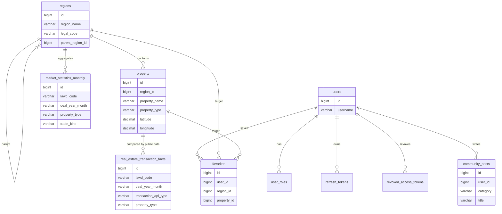

# MyBatis 도메인 persistence 전환 로드맵 기록

> Status: Historical Reference
>
> 이 문서는 ZIP:ON이 JPA/Hibernate 없는 MyBatis-only persistence로 전환하던 초기 로드맵을 보존한 기록이다. 현재 실행 계획으로 그대로 쓰면 안 된다. 최신 기준은 `backend/src/main/resources/db/migration`, `backend/src/main/java/com/zipon/mapper`, [저장소 정책](/docs/architecture/DATA_STORAGE_POLICY.md), [MyBatis와 Flyway 개요](/docs/study/Database/01-mybatis-and-flyway-overview.md)를 먼저 확인한다.

## 목적

이 문서는 인증 외 도메인을 MyBatis-only persistence와 Flyway migration 기준으로 전환하기 위해 작성했던 작업 순서를 정리한다.

현재 ZIP:ON backend는 더 이상 "인증만 DB schema와 MyBatis mapper가 연결된 상태"가 아니다. 현재 source 기준으로 `backend/src/main/resources/db/migration`에는 44개 migration SQL 파일이 있고 최신 version은 `V45`이다. `V35` 파일이 없기 때문에 최신 version 번호와 파일 개수는 같지 않다. `backend/src/main/java/com/zipon/mapper`에는 71개 mapper package Java 파일이 있으며, 이 중 `*Mapper.java` interface는 47개이고 나머지는 mapper row/upsert helper class다. 인증, 지역/법정동, 정확 주소 위험진단, 건축물대장 snapshot/seed, 공시가격 snapshot/sync target/admin seed target, 실거래 fact/statistics, R-ONE 통계, market indicator, favorite, community, admin audit, map field check, user profile까지 Flyway/MyBatis 경계가 구현되어 있다.

따라서 이 문서는 "앞으로 그대로 수행할 backlog"가 아니라, 왜 vertical slice 방식으로 schema, mapper SQL, service transaction boundary, API response, test, docs를 함께 전진시켰는지 보여주는 학습 기록으로 읽는다. 새 persistence 작업을 시작할 때는 아래 원칙만 가져가고, 구체 작업 목록은 현재 코드와 product docs를 기준으로 다시 작성한다.

관련 문서:

- [MySQL 개발환경과 Flyway migration](/docs/operations/DOCKER_MYSQL_REDIS.md)
- [인증 DB 스키마](/docs/architecture/security/AUTH_SCHEMA.md)
- [Spring Security JWT 인증 흐름](/docs/architecture/security/SECURITY_AUTHENTICATION.md)
- [ZIP:ON API와 함수 학습 지도](/docs/api/API_FUNCTION_MAP.md)
- [ZIP:ON 개선 체크리스트](/docs/operations/IMPROVEMENT_CHECKLIST.md)

## 현재 구현 상태

현재 schema source of truth는 단일 `V1` migration이 아니라 아래 디렉터리 전체다.

```text
backend/src/main/resources/db/migration/
```

현재 실제 MyBatis mapper도 인증 3개 mapper에 그치지 않는다.

```text
backend/src/main/java/com/zipon/mapper/
```

대표 구현 상태는 아래처럼 읽는다.

| Domain | Controller/Service boundary | Migration/Mapper boundary | Test/document boundary |
| --- | --- | --- | --- |
| Auth/JWT | `AuthController`, `AuthService`, `CustomUserDetailsService` | `V1__create_auth_schema.sql`, `V8__normalize_audit_timestamp_defaults.sql`, `UserMapper`, `RefreshTokenMapper`, `RevokedAccessTokenMapper` | `AuthIntegrationTest`, `SECURITY_AUTHENTICATION.md`, `AUTH_SCHEMA.md` |
| Legal dong/region | `RegionController`, `RegionService`, `LegalDongCodeService` | `V2__create_region_schema.sql`, `V5__create_legal_dong_codes.sql`, `V10__create_legal_dong_alias_schema.sql`, `V25__create_legal_dong_code_source_rows.sql`, `RegionMapper`, `LegalDongCodeMapper` | `RegionIntegrationTest`, `MyBatisLegalDongCodeCatalogIntegrationTest`, `REGION_SCHEMA.md` |
| 정확 주소 위험진단 | `RentRiskDiagnosisController`, `RentRiskDiagnosisService`, `RiskAssessmentService` | `V11__create_rent_risk_diagnosis_history.sql`, `V13__create_registry_document_confirmations.sql`, `V16__create_ai_risk_scoring_logs.sql`, `V21__create_property_identity_candidates.sql`, `V24__create_risk_evidence_snapshots.sql`, `RentRiskDiagnosisHistoryMapper`, `RegistryDocumentConfirmationMapper`, `AiRiskScoringAuditMapper`, `PropertyIdentityCandidateMapper`, `RiskEvidenceSnapshotMapper` | `RentRiskDiagnosisIntegrationTest`, `RiskAssessmentServiceTest`, `MVP_SCOPE.md` |
| 외부 공공데이터 snapshot | `DataGoKrBuildingRegisterApiClient`, `VWorldPublicPriceApiClient`, `BuildingRegisterSeedService`, `PublicPriceSeedService`, `PublicPriceSnapshotStore` | `V22__create_building_register_title_snapshots.sql`, `V23__create_public_price_snapshots.sql`, `V44__create_vworld_public_price_sync_targets.sql`, `V45__create_vworld_public_price_admin_seed_targets.sql`, `BuildingRegisterTitleSnapshotMapper`, `BuildingRegisterSeedCandidateMapper`, `PublicPriceSnapshotMapper`, `VWorldPublicPriceSyncTargetMapper` | external-api specs, `DATA_STORAGE_POLICY.md`, `EXTERNAL_DATA_SEEDING.md` |
| 실거래/시장 지표 | `MarketIndicatorContextService`, `RegionalIndicatorAnalysisService`, sync services | `V20__create_external_data_fact_statistics_schema.sql`, `V27__create_kab_r_one_statistics_schema.sql`, `V38__create_market_indicator_domain_schema.sql`, `RegionalIndicatorAnalysisMapper`, `RealEstateTransactionFactMapper`, `MarketStatisticsMonthlyMapper`, `MarketIndicatorMapper`, `KabROneStatisticsMapper` | `RegionalIndicatorAnalysisIntegrationTest`, `MARKET_INDICATOR_FOUNDATION.md`, `IMPLEMENTATION_BACKLOG.md` |
| Community/admin/favorite/profile | `CommunityController`, `Admin*Controller`, `FavoriteController`, `UserProfileController` | community/admin/favorite/profile migrations, mapper interfaces under `com.zipon.mapper` | community, frontend, security, data-storage docs |

아직 모든 service가 같은 성숙도는 아니다. 예를 들어 일부 화면 보조 API와 legacy 샘플 응답은 현재 매물 제공으로 오해되지 않도록 더 다듬어야 한다. 그러나 이제 persistence 작업의 기본 질문은 "어떤 도메인을 처음 DB에 붙일 것인가"가 아니라, "현재 구현된 MyBatis/Flyway 경계를 어떤 제품 slice에서 더 정확하고 안전하게 발전시킬 것인가"다.

## Decision: 큰 schema 일괄 작성 대신 vertical slice로 전환

### Context

JPA/Hibernate와 `ddl-auto`를 제거했기 때문에 이제 테이블은 Flyway migration으로만 만들어야 한다. 동시에 이 프로젝트는 학습 목적도 크기 때문에, 한 번에 모든 도메인 schema를 만들면 리뷰와 학습 포인트가 흐려진다.

### Options considered

1. 모든 도메인 테이블을 한 migration에 한 번에 만든다.
2. 도메인별 migration과 mapper를 작은 MR로 나눈다.
3. API 구현 없이 schema만 먼저 전부 만든다.

### Decision

2번을 선택한다. 각 MR은 하나의 사용자 행동 또는 한 도메인 read/write path를 기준으로 만든다.

### Why

이 방식은 Flyway migration, MyBatis mapper, Service 책임, Controller 응답, test를 한 번에 묶어 볼 수 있다. 초보자가 "테이블만 만들었는데 어디서 쓰는지 모르는 상태"나 "Service만 만들었는데 schema가 없는 상태"에 빠지지 않는다.

### Tradeoffs

작은 MR이 많아져서 전체 전환에는 시간이 더 걸린다. 대신 각 단계가 실패했을 때 되돌리기 쉽고, 리뷰어가 table/mapper/service/test의 정합성을 좁은 범위에서 확인할 수 있다.

### Future revisit

도메인 schema가 안정되고 데이터 양이 많아지면, 읽기 전용 query 최적화, aggregation table, cache, search index를 별도 로드맵으로 분리한다.

## 전환 원칙

새 persistence 작업은 항상 아래 순서를 따른다.

```text
1. 사용자 행동과 API를 먼저 고른다.
2. 필요한 table과 column을 migration SQL에 정의한다.
3. table 제약조건과 index를 함께 정의한다.
4. MyBatis mapper method와 SQL을 추가한다.
5. Service에서 transaction boundary와 business rule을 명시한다.
6. Controller 응답 DTO를 실제 조회 결과에 맞춘다.
7. mapper 또는 integration test를 추가한다.
8. 관련 docs와 API 지도를 갱신한다.
```

금지한다:

- `spring-boot-starter-data-jpa` 재도입
- `@Entity`, `JpaRepository`, Spring Data JPA repository 추가
- `ddl-auto=update`, `create`, `create-drop`
- Hibernate mapping을 schema 기준으로 사용하는 방식

허용한다:

- domain object를 plain Java object로 유지
- mapper method와 SQL을 명시적으로 작성
- 복잡한 조회에는 result map 또는 전용 response projection 사용
- 큰 도메인은 여러 migration으로 나누기

## 과거 추천 MR 순서

아래 순서는 MyBatis/Flyway 전환 초기에 작성했던 과거 추천 순서다. `Region`, `Favorite`, `Community`, `RentRiskDiagnosis`, `MarketIndicator`, `KabROne` 등 다수 slice가 이미 구현된 현재 기준 실행 계획이 아니다. 새 작업을 시작할 때는 이 목록을 그대로 재사용하지 말고, 현재 코드의 controller/service/mapper/test/docs 상태와 제품 문서의 MVP 경계를 먼저 확인한다.

### MR 1. Region read model

브랜치 후보:

```text
feature/region-mybatis-read-model
```

목표:

- 지역 검색과 상세 조회의 가장 작은 read path를 만든다.
- `RegionController.getRegionList(...)`와 `RegionController.getRegionDetail(...)`가 더 이상 placeholder 결과를 반환하지 않게 한다.

예상 변경:

```text
backend/src/main/resources/db/migration/V2__create_region_schema.sql
backend/src/main/java/com/zipon/mapper/RegionMapper.java
backend/src/main/java/com/zipon/service/RegionService.java
backend/src/test/java/com/zipon/RegionIntegrationTest.java
docs/architecture/REGION_SCHEMA.md 또는 이 기록 문서 갱신
```

테이블 후보:

```text
regions
- id
- region_name
- legal_code
- parent_region_id
- created_at
- updated_at
```

제약과 index 후보:

- `legal_code`는 외부 공공데이터와 연결할 가능성이 높으므로 unique 후보로 검토한다.
- `region_name` 검색이 자주 일어나므로 index 후보로 검토한다.
- `parent_region_id`는 서울시 > 강남구 > 역삼동 같은 계층 구조를 표현할 때 필요하다.

테스트 후보:

- Flyway가 `regions` table을 생성하는지 확인한다.
- seed data 또는 test setup으로 지역을 넣고 `RegionMapper`가 `legalCode`, `regionName` 조건으로 조회하는지 확인한다.
- 존재하지 않는 `regionId` 상세 조회가 어떤 에러로 매핑되는지 확인한다.

학습 포인트:

- 계층형 데이터를 self foreign key로 표현하는 방법
- 검색 조건이 있을 때 mapper method 이름을 명확하게 정하는 방법
- Service가 mapper 결과를 response DTO로 바꾸는 위치

### MR 2. Property and transaction read foundation

> 현재 실행 계획이 아니라 초기 계획 기록이다. 실제 구현은 `V17__create_property_catalog.sql`의 단수 `property` catalog, `V20__create_external_data_fact_statistics_schema.sql`의 `real_estate_transaction_facts`/`market_statistics_monthly`, `PropertyMapper`, `RealEstateTransactionFactMapper`, `MarketStatisticsMonthlyMapper`로 대체되었다. 현재 제품 기준에서 이 영역은 현재 매물 목록 foundation이 아니라 관심 부동산 snapshot, 과거 실거래 fact, 지역·유형 과거 지표 분석 근거로 읽어야 한다.

브랜치 후보:

```text
feature/property-transaction-read-model
```

목표:

- 초기 목표는 매물 목록, 매물 상세, 지역 요약 통계의 기반이 되는 `properties`와 `transactions` schema를 만드는 것이었다.
- 현재 구현에서는 이 목표를 그대로 따르지 않는다. `property`는 저장/검토 대상 catalog로 쓰고, 거래 이력은 외부 API 기반 `real_estate_transaction_facts`와 집계용 `market_statistics_monthly`로 분리한다.

예상 변경:

```text
V17__create_property_catalog.sql
V20__create_external_data_fact_statistics_schema.sql
PropertyMapper.java
RealEstateTransactionFactMapper.java
MarketStatisticsMonthlyMapper.java
PropertyService.java
RegionService.java 일부
PropertyIntegrationTest.java
```

테이블 후보:

```text
초기 후보였던 properties는 현재 property table로 구현됨
- id
- region_id
- property_name
- address
- property_type
- latitude
- longitude
- created_at
- updated_at

초기 후보였던 transactions는 현재 real_estate_transaction_facts와 market_statistics_monthly로 분리됨
- id
- lawd_code
- legal_dong_name
- deal_year_month
- transaction_api_type
- property_type
- exclusive_area_square_meter
- floor_number
- deposit_amount
- monthly_rent_amount
- deal_amount
```

중요 판단:

- `Property.price`는 현재 화면 표시 후보 필드지만, 위험진단과 지역 분석의 거래 근거는 `real_estate_transaction_facts`와 `market_statistics_monthly`가 기준이다.
- 월세는 단일 `transaction_price`로 표현하지 않는다. 현재 schema는 전월세 `deposit_amount`/`monthly_rent_amount`, 매매 `deal_amount`를 분리한다.
- 좌표 범위 조회를 위해 `latitude`, `longitude` index 또는 MySQL spatial type을 검토한다. 처음에는 단순 numeric column과 composite index로 시작할 수 있다.

테스트 후보:

- `PropertyMapper.selectBySearchCondition(...)`가 region/type/tradeType 조건을 안전하게 처리하는지 확인한다.
- `PropertyService.getPropertyDetail(...)`가 없는 ID에 대해 명확한 예외를 던지는지 확인한다.
- `RegionalIndicatorAnalysisService.analyze(...)`는 `market_statistics_monthly`와 R-ONE 지표를 현재 매물 목록이 아니라 과거 지표 분석 문장으로 바꾸는지 확인한다.

학습 포인트:

- 현재 상태 table과 이력 table을 분리하는 이유
- 목록 응답과 상세 응답을 같은 DTO로 둘지 분리할지 판단하는 기준
- aggregate SQL을 Service 계산으로 둘지 mapper SQL로 둘지 나누는 기준

### MR 3. Map and search query path

브랜치 후보:

```text
feature/map-search-mybatis-query
```

목표:

- 초기 목표는 지도 화면과 통합 검색이 실제 DB query를 호출하게 하는 것이었다.
- 현재 구현은 현재 매물 지도 검색이 아니라, 분석 가능 지역 경계, 정확 주소 후보 marker, 현장 확인 기록을 DB에서 읽고 쓰는 보조 지도 흐름으로 바뀌었다.

예상 변경:

```text
MapAnalyzableLocationMapper.java
MapDiagnosisAddressMarkerMapper.java
MapFieldCheckRecordMapper.java
MapController.java
MapDiagnosisContextIntegrationTest.java
MapFieldCheckIntegrationTest.java
MapPropertyIntegrationTest.java
```

중요 판단:

- 지도 API는 현재 매물 marker가 아니라 `MapAnalyzableLocationResponse`, `MapDiagnosisAddressMarkerResponse`, `MapFieldCheckRecordResponse`처럼 진단 보조 목적을 드러내는 response가 더 적절하다.
- `강남 원룸` 같은 입력은 지도 검색 결과가 아니라 `RegionalIndicatorAnalysisController`의 지역·유형 과거 지표 분석으로 보낸다.
- 지도 바탕 클릭이나 장소 검색 중심점은 자동으로 정확 주소 위험진단 입력으로 승격하지 않는다.

테스트 후보:

- `GET /api/map/diagnosis-context`가 분석 가능 지역 경계와 정확 주소 후보 marker를 분리해서 내려주는지 확인한다.
- `GET/PUT /api/map/field-checks`가 사용자별 현장 확인 기록을 저장하고 다시 읽는지 확인한다.
- 지도 place search 결과가 현재 매물 목록처럼 보이지 않는지 frontend 문구와 함께 확인한다.

학습 포인트:

- 지도 bounds query 설계
- 여러 mapper 결과를 하나의 response로 조합하는 Service 책임
- 검색어 validation과 normalization 위치

### MR 4. Favorite authenticated write path

브랜치 후보:

```text
feature/favorite-mybatis-authenticated
```

목표:

- 로그인 사용자가 관심 지역 또는 계약 전 다시 볼 관심 부동산 검토 대상을 저장/조회/삭제할 수 있게 한다.
- auth가 이미 구현되어 있으므로 `userId`를 request body로 받지 않고 `CustomUserPrincipal`에서 얻는다.

예상 변경:

```text
V9__create_favorite_schema.sql
FavoriteMapper.java
FavoriteController.java
FavoriteService.java
FavoriteAnalysisIntegrationTest.java
```

테이블 후보:

```text
favorites
- id
- user_id
- region_id
- property_id
- favorite_name
- created_at
```

제약 후보:

- `user_id`는 `users.id` foreign key다.
- `region_id`와 `property_id`는 둘 중 하나만 값이 있어야 한다.
- MySQL에서 check constraint를 사용할지, Service validation으로 우선 막을지 결정한다.
- 같은 사용자가 같은 region/property를 중복 저장하지 않도록 unique constraint를 검토한다.

테스트 후보:

- 인증 없이 관심 목록 조회 시 401
- 로그인 사용자가 관심 지역 저장 성공
- 같은 관심 항목 중복 저장 시 409
- 다른 사용자의 favorite 삭제 시 403
- 본인 favorite 삭제 성공

학습 포인트:

- 인증된 사용자 ID를 요청 DTO에서 받지 않는 이유
- Service-level transaction boundary
- DB unique constraint와 Service validation의 역할 분담

### MR 5. Environment layer read model

브랜치 후보:

```text
feature/environment-layer-mybatis
```

목표:

- 생활환경 레이어를 `EnvironmentController`와 `MapController`에서 실제 DB 조회로 제공한다는 초기 계획이었다.
- 현재 코드는 `EnvironmentService`가 빈 목록을 반환하는 MVP 후순위 빈 응답 계약이며, 생활환경 전용 table과 mapper는 아직 없다.

예상 변경:

```text
아직 Environment 전용 migration 없음
아직 EnvironmentMapper 없음
EnvironmentService.java
EnvironmentController.java
MapService.java 일부
OpenApiDocumentationIntegrationTest.java
```

테이블 후보:

```text
environment_infos
- id
- environment_name
- environment_type
- address
- latitude
- longitude
- external_source
- external_id
- created_at
- updated_at
```

중요 판단:

- 외부 API에서 가져온 시설이면 `external_source`, `external_id`가 중복 방지에 유용하다.
- `environment_type`만으로 부족하면 이후 `facility_category`를 분리한다.
- 거리 계산은 처음에는 좌표 범위 조회로 시작하고, 실제 거리 정렬은 별도 최적화 단계로 미룬다.

테스트 후보:

- type별 조회
- 좌표 bounds 조회
- 중복 external source/id 저장 방지

학습 포인트:

- 외부 데이터 원본 ID를 저장하는 이유
- 지도 레이어 read model과 일반 목록 read model의 차이
- 좌표 query의 단순 시작점과 최적화 시점

### MR 6. Community post write path

브랜치 후보:

```text
feature/community-post-mybatis
```

목표:

- 커뮤니티 게시글 목록, 상세, 작성, 수정, 삭제를 실제 DB와 연결한다.
- 처음부터 신고/댓글/관리자 검수까지 넣지 않고 게시글 본체만 구현한다.

예상 변경:

```text
V4__create_community_board_schema.sql
CommunityPostMapper.java
CommunityController.java
CommunityService.java
CommunityIntegrationTest.java
```

테이블 후보:

```text
community_posts
- id
- user_id
- category
- title
- content
- view_count
- hidden
- created_at
- updated_at
- deleted_at
```

중요 판단:

- 게시글은 hard delete보다 soft delete가 운영에 유리하다.
- 작성/수정/삭제는 인증이 필요하다.
- 작성자 본인 또는 관리자 권한 검사는 Controller가 아니라 Service에서 수행한다.

테스트 후보:

- 인증 없이 작성 시 401
- 제목/본문 validation 실패 시 400
- 작성자 본인 수정 성공
- 다른 사용자 수정 시 403
- 삭제 후 목록에서 제외

학습 포인트:

- soft delete의 장단점
- 작성자 권한 검사 위치
- 긴 text column과 validation의 관계

### MR 7. Documentation cleanup for old JPA wording

브랜치 후보:

```text
docs/remove-stale-jpa-learning-paths
```

목표:

- reference 문서와 study 문서에 남아 있는 예전 JPA 중심 표현을 정리한다.
- JPA 자체를 설명하는 학습 문서는 삭제가 아니라 "현재 프로젝트의 구현 방향이 아님"을 명확히 표시한다.

우선 정리 후보:

```text
docs/architecture/BACKEND_STRUCTURE.md
docs/architecture/CONVENTIONS.md
docs/LEARNING_PATH.md
docs/product/ROADMAP.md
docs/api/API_FUNCTION_MAP.md
docs/operations/IMPROVEMENT_CHECKLIST.md
docs/study/Database/*
docs/study/Spring/10-mybatis-mapper-and-sql.md
docs/study/Spring/11-domain-object-and-flyway-schema.md
```

정리 기준:

- `Repository`라는 일반 계층 표현은 `Mapper` 또는 `persistence adapter`로 바꾼다.
- `Entity`라는 표현은 JPA entity가 아니라면 `domain object`로 바꾼다.
- JPA 학습 문서는 "일반 Spring 생태계 개념"으로 남기되, ZIP:ON 구현 경로가 아님을 상단에 표시한다.
- 새 기능 가이드는 MyBatis mapper와 Flyway migration을 기준으로 바꾼다.

## 도메인별 schema 초안

이 섹션은 초기 초안에서 출발했지만, 현재 읽을 때는 실제 Flyway table명에 맞춘 부분 지도다. 전체 schema source of truth는 `backend/src/main/resources/db/migration`이다.



## 테스트 전략

각 MR은 최소 하나의 검증 축을 가져야 한다.

| Change type | Recommended test |
| --- | --- |
| migration만 추가 | Spring Boot context 또는 mapper test로 Flyway 적용 확인 |
| mapper 추가 | mapper method가 실제 SQL로 기대 row를 반환하는지 확인 |
| service read path | 없는 ID, 빈 목록, 정상 조회를 확인 |
| authenticated write path | 401, 403, 409, success를 분리해서 확인 |
| aggregation query | 집계 기준과 금액 단위가 맞는지 fixture로 확인 |

현재는 인증 외에도 region, legal dong, risk diagnosis, external data, community, profile 등 여러 통합 테스트가 존재한다. 새 persistence 변경은 이미 있는 테스트 스타일을 먼저 읽고, 변경한 slice와 가장 가까운 integration test 또는 service test를 추가/수정한다. DB-specific behavior가 강한 변경은 기존 Testcontainers 기반 테스트 흐름과 Flyway migration 적용 순서를 함께 확인한다.

## Debugging checklist

DB 관련 변경이 실패하면 아래 순서로 확인한다.

```text
1. migration 파일명이 V숫자__description.sql 형식인가?
2. application profile이 기대한 datasource를 바라보는가?
3. flyway_schema_history에 migration이 적용됐는가?
4. table/column 이름이 mapper SQL과 정확히 같은가?
5. enum 문자열 값이 Java enum 이름과 맞는가?
6. nullable column에 Service가 null을 넣어도 되는가?
7. foreign key 대상 row가 먼저 존재하는가?
8. unique constraint 실패를 Service 또는 GlobalExceptionHandler가 의미 있게 다루는가?
9. test fixture가 migration schema와 같은 컬럼을 사용하고 있는가?
10. 문서가 migration과 mapper method 이름을 실제 이름으로 설명하는가?
```

## Learning path

1. First read: [Docker MySQL/Redis 운영 가이드](/docs/operations/DOCKER_MYSQL_REDIS.md), [MyBatis와 Flyway 개요](/docs/study/Database/01-mybatis-and-flyway-overview.md)
2. Then inspect: `backend/src/main/resources/db/migration/V1__create_auth_schema.sql`, `V5__create_legal_dong_codes.sql`, `V11__create_rent_risk_diagnosis_history.sql`, `V27__create_kab_r_one_statistics_schema.sql`, `V38__create_market_indicator_domain_schema.sql`
3. Then inspect: `UserMapper`, `LegalDongCodeMapper`, `RentRiskDiagnosisHistoryMapper`, `RegionalIndicatorAnalysisMapper`, `KabROneStatisticsMapper`
4. Then compare: `AuthIntegrationTest`, `RegionIntegrationTest`, `RentRiskDiagnosisIntegrationTest`, `RegionalIndicatorAnalysisIntegrationTest`
5. Then run a focused check: `cd backend && ./mvnw -Dtest=ZipOnApplicationTests test`
6. Then design the next slice from the current product docs, not from the old MR order below
7. Key concept to understand: Flyway는 table의 기준이고, MyBatis mapper SQL은 data access의 기준이며, Service는 transaction과 business rule의 기준이다.

## 이전 작업 제안 기록

이 섹션은 `Region` read model이 아직 구현되지 않았던 시점의 제안 기록이다. 현재는 그대로 실행하지 않는다.

이유:

- 인증 권한 검사가 필요 없다.
- `regions`는 다른 도메인인 property, transaction, map, search의 기반 데이터다.
- 지역 목록/상세 조회는 read-only라 첫 MyBatis domain mapper 연습으로 적합하다.
- 실패했을 때 rollback 범위가 작다.

권장 첫 구현 범위:

```text
1. V2__create_region_schema.sql
2. RegionMapper.selectById(...)
3. RegionMapper.selectBySearchCondition(...)
4. RegionService.getRegionList(...)
5. RegionService.getRegionDetail(...)
6. RegionIntegrationTest
7. REGION_SCHEMA.md 또는 이 문서의 Region 섹션 갱신
```

이 범위 밖:

- 가격 추이
- 실거래 aggregate
- 지도 bounds query
- 검색 자동완성 랭킹
- admin 지역 관리 UI

위 항목은 `Region` read path가 안정된 뒤 별도 MR로 분리한다.
