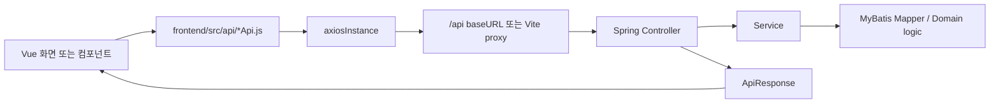

# API 명세와 프론트엔드 연결 현황

> Status: Current implementation audit
> Last audited: 2026-06-25

## Goal

이 문서는 ZIP:ON의 백엔드 API 명세가 프론트엔드 어디에 연결되어 있는지 한눈에 보기 위한 문서다.

기존 [ZIP:ON API와 함수 학습 지도](/docs/api/API_FUNCTION_MAP.md)는 "사용자 행동에서 어떤 함수가 필요한가"를 설명한다. 이 문서는 그 다음 단계로, 실제 코드에서 아래 연결이 맞는지 검수한다.

```text
Vue View/Component
-> frontend/src/api/*Api.js
-> frontend/src/api/axiosInstance.js
-> Vite proxy 또는 VITE_API_BASE_URL
-> Spring Controller
-> Request DTO / Response DTO
```

## How to read status

| 상태 | 의미 |
|---|---|
| 화면 연결 완료 | View 또는 Component가 `frontend/src/api` 함수를 import해서 실제 사용자 행동과 연결한다. |
| API 모듈만 있음 | `frontend/src/api` 함수는 있지만 현재 View/Component에서 호출하지 않는다. |
| 백엔드만 있음 | Spring Controller endpoint는 있지만 프론트 API 함수가 아직 없다. |
| 수동 확인용 | 브라우저나 curl로 확인하는 endpoint이며 화면 기능과 직접 연결하지 않는다. |

프론트 API 함수의 path는 `/api`를 생략한다. `axiosInstance`의 `baseURL`이 기본 `/api`이기 때문이다.

예:

```text
Backend endpoint: POST /api/auth/login
Frontend call: axiosInstance.post('/auth/login', payload)
```

## Common API contract

일반 JSON API는 `ApiResponse<T>`로 감싼다.

```json
{
  "success": true,
  "message": "요청이 정상 처리되었습니다.",
  "data": {}
}
```

프론트에서는 보통 `response.data.data`를 화면 상태에 넣는다.

예:

```js
const response = await createRentRiskDiagnosis(payload)
diagnosis.value = response.data.data
```

예외는 파일 다운로드/이미지 조회 API다. `GET /api/community/attachments/{attachmentId}/download`와 `GET /api/users/profile-images/{userId}/{storedFileName}`는 `ApiResponse`가 아니라 `Resource`를 직접 내려준다.

## Frontend API infrastructure

| 항목 | 현재 구현 |
|---|---|
| 공통 axios | `frontend/src/api/axiosInstance.js` |
| 기본 baseURL | `import.meta.env.VITE_API_BASE_URL || '/api'` |
| 개발 proxy | `frontend/vite.config.js`의 `/api -> http://localhost:8082` |
| cookie 전송 | `withCredentials: true` |
| access token 저장 | `frontend/src/auth/authSession.js`의 메모리 상태 |
| refresh token 저장 | JavaScript에서 읽을 수 없는 HttpOnly cookie |
| 401 처리 | access token이 있고 auth endpoint가 아니면 `/auth/refresh` 후 원 요청 1회 재시도 |

보안상 중요한 규칙:

```text
access token은 localStorage에 저장하지 않는다.
refresh token은 HttpOnly cookie로만 전송한다.
프론트 API 함수는 Authorization header를 직접 만지지 않는다.
Authorization header 부착은 axiosInstance request interceptor가 담당한다.
```

## Connected flow



## Code and test references

| 영역 | 먼저 읽을 코드 | 검증 테스트 |
|---|---|---|
| 인증/내 프로필 | `AuthController`, `UserController`, `AuthService`, `UserProfileService`, `frontend/src/api/authApi.js`, `AuthModal.vue`, `AppHeader.vue`, `MyPageView.vue`, `axiosInstance.js` | `AuthIntegrationTest` |
| 위험진단 | `RentRiskDiagnosisController`, `RentRiskDiagnosisService`, `rentRiskDiagnosisApi.js`, `MainHero.vue`, `SearchBar.vue`, `LeaseRiskDiagnosisResult.vue` | `RentRiskDiagnosisIntegrationTest` |
| 커뮤니티 | `CommunityController`, `CommunityService`, `communityApi.js`, `communityDraft.js`, `CommunityListView.vue`, `CommunityPostDetailView.vue` | `CommunityIntegrationTest` |
| 관리자 사용자 관리 | `AdminUserController`, `AdminUserService`, `adminApi.js`, `AdminDashboardView.vue` | `AdminUserIntegrationTest` |
| 관리자 감사 로그 | `AdminActionAuditLogController`, `AdminActionAuditLogService`, `AdminActionAuditLogMapper` | `AdminActionAuditLogIntegrationTest` |
| 관리자 커뮤니티 신고 관리 | `CommunityAdminController`, `CommunityAdminService`, `adminApi.js`, `AdminDashboardView.vue` | `CommunityIntegrationTest` |
| 관리자 위험진단 이력 | `AdminRentRiskDiagnosisHistoryController`, `RentRiskDiagnosisHistoryService`, `adminApi.js`, `AdminDashboardView.vue` | `RentRiskDiagnosisHistoryIntegrationTest` |
| 공통 응답 | `ApiResponse`, `GlobalExceptionHandler`, `axiosInstance.js` | 각 integration test의 status/body assertion |

프론트엔드 테스트 runner는 아직 없다. 따라서 현재 프론트 연결 검증은 브라우저 Network 탭, Vite dev server, 백엔드 integration test 조합으로 확인한다.

## Auth and account APIs

### Connected endpoints

| 사용자 행동 | Method | Backend endpoint | Request DTO | Response DTO | Frontend API | 화면/호출 위치 | 권한 | 상태 |
|---|---|---|---|---|---|---|---|---|
| 회원가입 | POST | `/api/auth/signup` | `SignUpRequest` | `AuthUserResponse` | `signUp(payload)` | `AuthModal.vue` | public | 화면 연결 완료 |
| 로그인 | POST | `/api/auth/login` | `LoginRequest` | `AuthTokenResponse` + refresh cookie | `login(payload)` | `AuthModal.vue` | public | 화면 연결 완료 |
| access token 갱신 | POST | `/api/auth/refresh` | HttpOnly cookie | `AuthTokenResponse` + rotated refresh cookie | `refreshAccessToken()` | `authActions.js`, `authSession.js`, `axiosInstance.js`, `router/index.js`, `App.vue` | refresh cookie 필요 | 화면 연결 완료 |
| 로그아웃 | POST | `/api/auth/logout` | Authorization header + refresh cookie | `Void` + expired refresh cookie | `logout()` | `AppHeader.vue` | public endpoint, token 있으면 revoke | 화면 연결 완료 |
| 내 정보 조회 | GET | `/api/users/me` | 없음 | `CurrentUserResponse` | `getCurrentUser()` | `AuthModal.vue`, `AppHeader.vue`, `MyPageView.vue`, `authActions.js` | authenticated | 화면 연결 완료 |
| 내 프로필 수정 | PUT | `/api/users/me/profile` | `UpdateMyProfileRequest` | `CurrentUserResponse` | `updateMyProfile(payload)` | `MyPageView.vue` 프로필 편집 폼, 저장 후 `authState.user` 갱신 | authenticated | 화면 연결 완료 |
| 내 프로필 이미지 업로드 | POST | `/api/users/me/profile-image` | multipart `file` | `CurrentUserResponse` | `uploadMyProfileImage(file)` | `MyPageView.vue` 파일 선택/업로드, 저장 후 `authState.user` 갱신 | authenticated | 화면 연결 완료 |
| 프로필 이미지 조회 | GET | `/api/users/profile-images/{userId}/{storedFileName}` | path | `Resource` | `` | `AppHeader.vue`, `MyPageView.vue` avatar 렌더링 | public | 화면 연결 완료 |

### 내 프로필 화면 계약

`CurrentUserResponse`는 프론트 세션의 단일 사용자 shape로 사용한다. 주요 필드는 `userId`, `username`, `nickname`, `profileImageUrl`, `departmentCode`, `authorities`, `permissions`, `pagePermissions`다. `AuthModal.vue`는 로그인/회원가입 직후 `GET /api/users/me`로 이 shape를 채우고, `AppHeader.vue`는 어느 화면에 있든 `nickname`과 `profileImageUrl`을 사용해 사용자 표시와 마이페이지 버튼 avatar를 렌더링한다.

`PUT /api/users/me/profile`은 닉네임과 이미지 URL을 수정한다. 닉네임이 비어 있으면 backend `UserProfileService`가 ZIP:ON 맥락의 기본 닉네임을 배정하고, 이미 같은 표시명이 있으면 숫자 suffix를 붙인다. 외부 이미지 URL을 직접 등록할 수 있고, 실제 파일 업로드는 `POST /api/users/me/profile-image`가 담당한다.

`POST /api/users/me/profile-image`는 JPG, PNG, WEBP, GIF 파일을 multipart `file`로 받는다. `UserProfileImageStorageService`가 파일을 `zipon.user.profile-images.storage-path` 아래에 저장하고, `UserProfileMapper.updateUploadedProfileImage(...)`가 `user_profiles.profile_image_url`과 업로드 metadata를 갱신한다. 프론트는 응답의 `CurrentUserResponse.profileImageUrl`을 `authState.user`에 반영하므로 `AppHeader.vue`와 `MyPageView.vue`의 avatar가 같은 URL을 사용한다. 이 조회 URL은 `` 태그가 Authorization header를 붙일 수 없기 때문에 `GET /api/users/profile-images/{userId}/{storedFileName}` public endpoint로 노출한다.

### 주소 입력 UX

현재 구현에서 기본 사용자 진입점은 홈 화면 `MainHero.vue`가 렌더링하는 `SearchBar.vue`의 `diagnosis` mode다. 사용자는 홈 화면 분석/진단 입력 폼에 주소 또는 지역을 먼저 입력하거나 `MainHero.vue`의 "주소·지역으로 분석 시작" 버튼을 눌러 `#diagnosis-form` 위치로 이동한다. `SearchBar.vue`는 입력값이 정확 주소 후보인지 지역·유형 분석 후보인지 먼저 구분한다. 정확 주소 후보는 다시 "바로 진단 요청 가능한 주소"와 "주소 후보 선택이 필요한 주소"로 나눈다. `서울시 관악구 신림동 1422-5`, `서울 성동구 성수동1가 685-143`, `서울특별시 관악구 남현동 산 12-3`처럼 시도·시군구·법정동·지번이 모두 있는 지번주소는 주소, 계약 목적, 보증금, 월세, 관리비, 유형 힌트, 설명을 모아 `POST /api/rent-risk-diagnoses`로 보낸다. 단, 계약 목적별 필수 금액이 비어 있으면 바로 진단 요청을 만들지 않고 `POST /api/rent-risk-diagnoses/address-candidates`로 해당 지번의 과거 전월세 실거래 후보를 먼저 조회한다. 화면은 이 후보를 현재 매물이 아니라 과거 실거래 기준 카드로 표시하고, 사용자가 카드를 선택하면 후보의 보증금·월세·전용면적·층수를 `POST /api/rent-risk-diagnoses` 요청에 채워 기존 위험진단 흐름으로 이어간다. `신림동 1422-5`처럼 동+지번만 있거나 `서울특별시 관악구 관악로 1`처럼 도로명주소만 있는 입력은 시군구와 법정동코드를 화면에서 확정할 수 없으므로 먼저 `GET /api/address-search/juso` 후보 목록을 열고, 사용자가 후보를 선택한 뒤 진단 요청 또는 과거 전월세 후보 조회로 보낸다. `강남 원룸`, `서울대입구역 근처 오피스텔`처럼 지역·유형 수준인 입력은 현재 매물 목록 API를 호출하지 않고 `SearchResultView.vue`의 지역·유형 과거 지표 분석 화면으로 이동한다.

주소 단계에서는 `frontend/src/api/addressSearchApi.js`가 ZIP:ON 백엔드 `GET /api/address-search/juso`를 호출하고, 백엔드가 Juso 직접 주소검색 API를 대신 호출한다. 화면은 응답 주소 후보 중 사용자가 선택한 `jibunAddr`를 우선 `POST /api/rent-risk-diagnoses`의 `address` 값으로 전달한다. 또한 `admCd`, `siNm`, `sggNm`, `emdNm`, `mtYn`, `lnbrMnnm`, `lnbrSlno` 같은 Juso 선택 메타데이터를 `jusoAddress`로 함께 보내서 백엔드 주소 정규화의 보조 식별값으로 사용한다. 이 구조화 값이 있으면 `LeaseRiskAddressNormalizer`는 사용자가 입력한 문자열보다 Juso가 준 법정동/지번 정보를 우선한다. 지역·유형 과거 지표 분석은 `frontend/src/api/regionalIndicatorAnalysisApi.js`의 `createRegionalIndicatorAnalysis(payload)`와 `POST /api/regional-indicator-analyses` 첫 slice로 연결되어 있으며, 현재 매물 목록 API로 만들지 않는다.

`MainHero.vue`는 CTA 스크롤과 홈 화면 배치만 담당하고 진단 API 호출 상태를 직접 소유하지 않는다. 입력, 검증, 로딩, API 호출, 결과 패널 연결은 `SearchBar.vue`가 담당한다. 모바일 홈에서는 첫 화면이 진단 폼 전체에 잠기지 않도록 계약 조건과 입력 해석 영역을 기본 접힘으로 두고, 사용자가 펼치거나 주소 선택·검증 오류가 발생하면 자동으로 펼친다.

이 선택은 브라우저가 `business.juso.go.kr`을 직접 `axios/fetch`로 호출하지 않게 하기 위한 구조다. `SearchBar.vue`의 "주소 찾기"는 새 창을 열지 않고 현재 검색어로 `searchJusoAddresses(...)`를 호출한다. `JusoAddressSearchController`가 백엔드 검색용 승인키로 `addrLinkApi.do?resultType=json`을 호출하고, 화면은 후보 목록을 인라인으로 보여준다. 팝업 endpoint인 `/api/address-search/juso-popup`과 `/api/address-search/juso-popup/callback`은 보조/호환 경로로 남아 있지만, 현재 홈 위험진단 화면의 기본 주소 검색 UX는 직접검색 proxy다. `LeaseRiskAddressNormalizer`는 `jusoAddress`가 있으면 문자열 파싱보다 먼저 Juso의 행정구역코드와 지번 본번/부번을 사용하되, `legal_dong_codes` seed catalog에서 확인되는 법정동만 정규화 성공으로 처리한다. 위험진단의 결과 조립은 `RentRiskDiagnosisService`의 백엔드 흐름이 책임지고, 건축물대장 조회와 내부 유형 판별은 `LeaseRiskBuildingRegisterLookupService`, 전월세·매매 실거래가와 공시가격 조회 orchestration은 `LeaseRiskExternalDataLookupService`가 담당한다.

금액 문자열 parsing은 `frontend/src/utils/money.js`의 `parseMoneyToManwon(...)`가 담당한다. 전세는 양수 보증금, 월세는 양수 월세가 있어야 `POST /api/rent-risk-diagnoses`를 바로 호출한다. 필수 금액이 비어 있으면 `SearchBar.vue`가 `searchRentRiskDiagnosisCandidates(payload)`로 `POST /api/rent-risk-diagnoses/address-candidates`를 호출해 과거 전월세 후보 카드 목록을 보여준다. 사용자가 후보를 선택하면 `depositAmountManwon`, `monthlyRentAmountManwon`, `exclusiveAreaSquareMeter`, `floorNumber`를 진단 요청에 채운다. 관리비는 여전히 선택 입력이며 비어 있으면 0만 원으로 보낸다. 전용면적과 층수는 선택 입력이며, `SearchBar.vue`가 빈 값은 `null`, 숫자 값은 `exclusiveAreaSquareMeter`, `floorNumber`로 보낸다. 이 값들은 "안전" 판정 기준이 아니라 유사 거래 비교 보조 조건이다.

## Diagnosis purpose catalog API


| 사용자 행동 | Method | Backend endpoint | Request/Response | Frontend API | 화면/호출 위치 | 권한 | 상태 |
|---|---|---|---|---|---|---|---|
| Juso 직접 주소검색 | GET | `/api/address-search/juso` | query: `keyword`, `currentPage`, `countPerPage`, `hstryYn`, `firstSort`, `addInfoYn` -> `JusoAddressSearchResponse` | `searchJusoAddresses()` | `SearchBar.vue` 주소 후보 인라인 목록 | public | 화면 연결 완료 |
| Juso 주소 팝업 열기 | GET | `/api/address-search/juso-popup` | query -> Juso launch HTML | `openJusoAddressPopup()` | 현재 기본 화면에서는 미사용 | public | 보조/호환 endpoint |
| Juso 주소 팝업 콜백 | GET/POST | `/api/address-search/juso-popup/callback` | query/form -> `postMessage` callback HTML | `openJusoAddressPopup()` | 현재 기본 화면에서는 미사용 | public | 보조/호환 endpoint |
| 진단 목적 카탈로그 조회 | GET | `/api/diagnosis-purposes` | none -> `DiagnosisPurposeCatalogResponse` | `getDiagnosisPurposes()` | `SearchBar.vue` 계약 목적 선택지. 실패 시 local fallback | public | 화면 연결 완료 |

카탈로그 응답에서 `mvpSupported=true`인 목적만 현재 실행 가능한 API를 가진다. `LEASE_JEONSE`, `LEASE_MONTHLY_RENT`는 `currentEndpoint=/api/rent-risk-diagnoses`이고, 주거용 매매·상가 창업·토지 개발·꼬마빌딩·문서 권리관계 보조 분석은 `currentEndpoint=null`로 내려간다. 프론트는 `currentEndpoint=null`을 자동 진단 가능 상태로 보여주면 안 된다.

### Request shape

`LoginRequest`

```json
{
  "username": "user1",
  "password": "password123"
}
```

`SignUpRequest`

```json
{
  "username": "user1",
  "password": "password123",
  "email": "user1@example.com",
  "nickname": "사용자"
}
```

### Frontend state rule

`AuthTokenResponse.accessToken`은 `authSession.js`의 reactive memory state에 저장한다. 로그인 또는 refresh 성공 시 `authSession.js`는 localStorage에 비민감 복원 힌트만 남기고, token 원문은 저장하지 않는다. 새로고침 후 `App.vue`의 `restoreAuthSession()`은 이 힌트가 있을 때만 HttpOnly refresh cookie로 `/api/auth/refresh`를 조용히 시도하고, 성공하면 `/api/users/me`로 사용자 정보를 다시 채운다. `/favorites`, `/mypage`, `/admin`처럼 보호 route에 직접 진입한 경우에는 `router/index.js`가 `restoreAuthSession({ force: true })`로 기존 refresh cookie 기반 복원을 한 번 시도한다.

## Rent risk diagnosis API

### Current user-facing connections

| 사용자 행동 | Method | Backend endpoint | Request/Response | Frontend API | 화면/호출 위치 | 권한 | 상태 |
|---|---|---|---|---|---|---|---|
| 전세·월세 위험진단 요청 | POST | `/api/rent-risk-diagnoses` | `RentRiskDiagnosisRequest` -> `RentRiskDiagnosisResponse` | `createRentRiskDiagnosis(payload)` | `SearchBar.vue` -> `LeaseRiskDiagnosisResult.vue` | public | 화면 연결 완료 |
| 정확 주소 과거 전월세 후보 조회 | POST | `/api/rent-risk-diagnoses/address-candidates` | `RentRiskDiagnosisCandidateSearchRequest` -> `PageResponse<RentRiskDiagnosisCandidateResponse>` | `searchRentRiskDiagnosisCandidates(payload)` | `SearchBar.vue` 후보 카드/정렬/페이지네이션 | public | 화면 연결 완료 |
| 내 진단 리포트 요약 조회 | GET | `/api/rent-risk-diagnoses` | query: `page`, `size`; API는 `diagnosisState` 필터도 지원 -> `PageResponse<RentRiskDiagnosisHistorySummaryResponse>` | `getMyRentRiskDiagnoses(params)` | `MyPageView.vue` 최근 진단 리포트 카드 | authenticated | 화면 연결 완료 |
| 내 위험진단 상세 조회 | GET | `/api/rent-risk-diagnoses/{diagnosisId}` | path: `diagnosisId` -> `RentRiskDiagnosisResponse` | `getMyRentRiskDiagnosis(diagnosisId)` | `MyPageView.vue` 상세 modal -> `LeaseRiskDiagnosisResult.vue` | authenticated, 본인 이력만 | 화면 연결 완료 |

`GET /api/rent-risk-diagnoses`와 `GET /api/rent-risk-diagnoses/{diagnosisId}`는 현재 access token의 `CustomUserPrincipal.id`와 `rent_risk_diagnosis_histories.requester_user_id`를 비교해 로그인 사용자 본인의 이력만 반환한다. 다른 사용자의 이력과 익명 진단 이력은 마이페이지 상세에서 노출하지 않는다. 관리자 전체 조회와 raw snapshot 상세 조회는 `/api/admin/rent-risk-diagnoses`를 계속 사용한다.

정확 주소 기반 전세·월세 위험진단은 현재 ZIP:ON MVP의 구현된 중심 흐름이다. MVP 전체 방향은 현재 매물 미제공과 과거 지표 분석까지 포함한다. 현재 구현은 홈 화면 `MainHero.vue` 안의 `SearchBar.vue` `diagnosis` mode에서 진단을 시작한다. `App.vue`에 전역 플로팅 챗봇이나 채팅 세션 상태는 더 이상 연결하지 않는다.

`LeaseRiskDiagnosisResult.vue`는 `RentRiskDiagnosisResponse`를 데이터 리포트 순서가 아니라 계약 전 판단 순서로 표시한다. `decisionSummary`가 있으면 최상단에서 `자료 기준 검토 가능`, `조건부 주의`, `계약 전 중단 검토 필요`, `판단 보류` 중 하나를 보여준다. 이 값은 계약 가능 확정이 아니라 확인 우선순위다. `topRiskFindings`는 보증금·월세, 권리관계, 공적장부·현장 불일치 위험을 3개 카드로 표시한다. `confirmationMatrix`는 `confirmed`, `caution`, `required`를 세 열로 나눠 데이터 확인 상태와 직접 확인 항목을 분리한다.

프론트 fallback 규칙:

```text
decisionSummary 없음 -> riskSummary로 최상단 판단 fallback
topRiskFindings 없음 -> riskSummary.reasons + checklist + nextActions로 핵심 위험 신호 fallback
confirmationMatrix 없음 -> dataStatuses + checklist로 확인 상태 fallback
riskAssessment 있음 -> 상세 산정 근거로 후순위 표시
```

| 사용자 행동 | Method | Backend endpoint | Request DTO | Response DTO | Frontend API | 화면/호출 위치 | 권한 | 상태 |
|---|---|---|---|---|---|---|---|---|
| 위험진단 요청 | POST | `/api/rent-risk-diagnoses` | `RentRiskDiagnosisRequest` | `RentRiskDiagnosisResponse` | `createRentRiskDiagnosis(payload)` | `MainHero.vue` -> `SearchBar.vue` -> `LeaseRiskDiagnosisResult.vue` | public | 화면 연결 완료 |
| 계약 금액 미입력 시 과거 전월세 후보 조회 | POST | `/api/rent-risk-diagnoses/address-candidates` | `RentRiskDiagnosisCandidateSearchRequest` | `PageResponse<RentRiskDiagnosisCandidateResponse>` | `searchRentRiskDiagnosisCandidates(payload)` | `SearchBar.vue` 후보 카드/정렬/페이지네이션 | public | 화면 연결 완료 |
| 내 위험진단 상세 조회 | GET | `/api/rent-risk-diagnoses/{diagnosisId}` | path: `diagnosisId` | `RentRiskDiagnosisResponse` | `getMyRentRiskDiagnosis(diagnosisId)` | `MyPageView.vue` 상세 modal -> `LeaseRiskDiagnosisResult.vue` | authenticated, 본인 이력만 | 화면 연결 완료 |
| 등기부등본 확인 상태 조회 | GET | `/api/rent-risk-diagnoses/{diagnosisId}/registry-document-confirmation` | path: `diagnosisId` | `RegistryDocumentConfirmationResponse` | `getRegistryDocumentConfirmation(diagnosisId)` | `LeaseRiskDiagnosisResult.vue` 권리관계 확인 panel | authenticated, 본인 이력만 | 화면 연결 완료 |
| 등기부등본 확인 상태 저장 | PUT | `/api/rent-risk-diagnoses/{diagnosisId}/registry-document-confirmation` | `RegistryDocumentConfirmationRequest` | `RegistryDocumentConfirmationResponse` | `saveRegistryDocumentConfirmation(diagnosisId,payload)` | `LeaseRiskDiagnosisResult.vue` 권리관계 확인 panel | authenticated, 본인 이력만 | 화면 연결 완료 |

### Request shape

금액은 프론트에서 만 원 단위 숫자로 파싱해서 보낸다.

```json
{
  "address": "서울시 관악구 신림동 1422-5",
  "contractPurpose": "JEONSE",
  "depositAmountManwon": 12000,
  "monthlyRentAmountManwon": 0,
  "maintenanceFeeAmountManwon": 8,
  "exclusiveAreaSquareMeter": 29.35,
  "floorNumber": 3,
  "knownPropertyType": "원룸",
  "listingDescription": "3층 원룸, 보증보험 가능하다고 안내받음"
}
```

### Response fields used by frontend

| Response section | 사용 위치 |
|---|---|
| `diagnosisId` | 백엔드에 저장된 진단 이력 id다. 현재 프론트 화면에서는 표시하지 않지만, 관리자 이력 조회와 후속 내 진단 이력 기능의 연결점이다. |
| `diagnosisState` | `SearchBar.vue`가 `success` 또는 `empty` 화면 상태를 결정한다. |
| `inputSummary` | `LeaseRiskDiagnosisResult.vue`의 입력 확인 영역. 주소, 계약 목적, 금액, 선택 입력인 전용면적·층수, 사용자 입력 유형, 검토 메모를 다시 보여준다. |
| `address` | 주소 정제, 법정동코드, 본번/부번 표시 |
| `propertyIdentity` | 사용자가 말한 유형 힌트와 공부상 확인 방향 표시 |
| `dataStatuses` | `LeaseRiskDiagnosisResult.vue`의 공공데이터 확인 패널. 건축물대장, 전월세 실거래가, 매매 실거래가, 공시가격, 등기부등본 상태와 상세 근거 표시 |
| `riskSummary` | 결과 상단 제목, 요약, 위험 수준 표시 |
| `riskAssessment` | `LeaseRiskDiagnosisResult.vue`의 AI 구조화 위험 산정 섹션. 12개 고정 항목의 상태, 점수, confidence, 근거, 부족 데이터, 권장 행동 표시 |
| `checklist` | 계약 전 체크리스트 카드 |
| `nextActions` | 사용자의 다음 행동 목록. `DiagnosisPurpose.directConfirmationRequiredItems`는 `직접 확인 필요: ...` 문장으로 포함된다. |

`dataStatuses[].state`와 `propertyIdentity.state`는 `success`, `partial`, `empty`, `unavailable`, `ambiguous`, `error`를 사용할 수 있다. `partial`은 건축물대장 기준 확정 유형은 아니지만 사용자 힌트나 해당 지번 과거 실거래가 조회 가능성을 기준으로 분석 기준 후보를 잡았다는 뜻이다. `ambiguous`는 건축물대장 후보가 여러 건이라 사용자 동·호수 보완 또는 후보 선택이 필요하다는 뜻이며, 프론트엔드 `LeaseRiskDiagnosisResult.vue`에서는 `partial`과 `ambiguous`를 주황색 제한 진단 상태로 표시한다.

건축물대장 주용도 불일치와 노후도 안내는 별도 top-level 필드를 추가하지 않는다. 백엔드 `BuildingRiskAnalyzer`가 만든 문장은 기존 `riskSummary.reasons`, `checklist`, `nextActions`에 합쳐 내려오므로, 프론트엔드는 기존 결과 패널 렌더링으로 표시한다. 목적별 직접 확인 영역은 `DiagnosisPurpose.directConfirmationRequiredItems`에서 `nextActions`에 합쳐진다. 위반건축물 여부는 아직 자동 판정하지 않으며, 사용자가 원본 건축물대장과 중개대상물 확인설명서에서 확인해야 하는 checklist 성격으로 유지한다.

`riskAssessment`는 자유 대화형 챗봇 응답이 아니다. 백엔드 `RiskAssessmentService`가 `LEASE_RENT_RISK` template의 12개 항목을 산정하고, `RiskScoreAggregator`와 `RiskGradeCalculator`가 `baseScore`, `uncertaintyPenalty`, `totalRiskScore`, `riskGrade`, `displayVerdict`를 계산한 결과다. 프론트엔드는 항목별 `status`, `riskScore`, `confidence`, `evidence`, `missingData`, `userVisibleExplanation`, `recommendedActions`를 그대로 표시하되, 등기부등본·선순위 임차인·보증보험·현장 하자처럼 직접 확인해야 하는 항목을 안전 확정으로 표현하면 안 된다. 관심 부동산 리포트는 이전 진단의 `riskAssessment`가 있으면 `aiAssessment.criteria`에 같은 criterion 결과를 사용자 문장으로 변환해 내려받고, 새 OpenAI 호출을 만들지 않는다.


`LeaseRiskDiagnosisResult.vue`는 `dataStatuses[].key`를 기준으로 공공데이터 출처를 구분한다.

| key | 화면 출처명 | 의미 |
|---|---|---|
| `building-register` | 건축물대장 표제부 | 공부상 주용도와 매물 정체 판별 근거 |
| `rent-transaction` | 전월세 실거래가 | 사용자의 보증금·월세와 비교할 전월세 거래 후보 |
| `sale-transaction` | 매매 실거래가 | 보증금 대비 매매가 수준을 판단하기 위한 거래 후보 |
| `public-price` | 공시가격 | VWorld 공시가격 조회 결과 또는 key 미설정/결과 없음/오류 상태를 표시 |
| `registry-document` | 등기부등본 | 자동 확정하지 않고 사용자가 최신본을 확인해야 할 자료로 표시 |

`contractPurpose`가 `MONTHLY_RENT`이고 `rent-transaction`에 월세 금액이 있으면 `riskSummary.reasons`에 입력 월세와 조회된 월세 대표값을 단순 비교한 문장이 추가된다. 이 문장은 보증금 차이, 관리비, 권리관계까지 환산한 총 주거비 확정값이 아니라 사용자가 추가 확인해야 할 가격 단서다.

`contractPurpose`가 `MONTHLY_RENT`이면 `riskSummary.reasons`에 사용자가 입력한 월세와 관리비를 합산한 월 고정 주거비 문장이 추가된다. `checklist`에는 `관리비 세부 항목 확인` 항목이 포함되며, 프론트엔드는 기존 `LeaseRiskDiagnosisResult.vue`의 checklist 렌더링으로 그대로 표시한다. 이 값은 사용자 입력 합계이지 관리비 원본 데이터 자동 검증 결과가 아니다.

`exclusiveAreaSquareMeter` 또는 `floorNumber`가 있으면 백엔드 `TransactionSimilarityFilter`가 전월세·매매 실거래가 snapshot 중 유사 면적·층 거래를 우선 비교한다. 유사 거래가 없으면 전체 거래 기준으로 fallback하며, 프론트엔드는 `dataStatuses[].details`와 `riskSummary.reasons`에 내려온 문장을 그대로 표시한다.

`LeaseRiskDiagnosisResult.vue`는 `diagnosisId`와 로그인 상태가 있으면 `getRegistryDocumentConfirmation(diagnosisId)`로 등기부등본 수동 확인 상태를 불러온다. 사용자가 `NOT_CHECKED`, `CHECKED`, `NEEDS_HELP` 중 하나와 memo를 저장하면 `saveRegistryDocumentConfirmation(diagnosisId,payload)`가 `registry_document_confirmations`에 상태를 남긴다. 이 화면은 원본 PDF 업로드나 OCR 분석을 수행하지 않으며, 민감 파일 저장은 S3/object storage 전략이 정해진 뒤 별도 upload API로 분리한다.

### UI state

| Frontend state | 의미 |
|---|---|
| `idle` | 아직 API 호출 전 |
| `loading` | 진단 요청 중 |
| `success` | 진단 결과 있음 |
| `empty` | 주소나 외부 데이터 부족으로 제한된 결과 |
| `error` | API 호출 실패 또는 서버 검증 실패 |
| `retry` | 사용자가 재시도 버튼을 누른 직후 |

## Regional indicator analysis API

> Status: Implemented first slice

`SearchResultView.vue`는 `강남 원룸`, `서울대입구역 근처 오피스텔`, `관악구 오피스텔 월세` 같은 지역·유형 입력을 `POST /api/regional-indicator-analyses`로 보낸다. 이 API는 현재 매물 목록이나 지도 marker feed를 반환하지 않고, 저장된 R-ONE 통계자료와 `market_statistics_monthly` 실거래가 월별 통계를 읽어 입력 해석, 공부상 유형 후보, 지표 상태, 통찰 문장, 데이터 한계, 다음 행동을 반환한다.

프론트 API 함수인 `createRegionalIndicatorAnalysis(payload)`는 public endpoint이므로 `axiosInstance.js`의 `isPublicApiEndpoint(...)`에서 Authorization header를 붙이지 않는다. 만료된 access token이 남아 있어도 public 분석 요청이 JWT 검증 실패로 막히지 않게 하기 위한 처리다.

### Endpoint

| 사용자 행동 | Method | Backend endpoint | Request/Response | Frontend API | 화면/호출 위치 | 권한 | 상태 |
|---|---|---|---|---|---|---|---|
| 지역·유형 과거 지표 분석 요청 | POST | `/api/regional-indicator-analyses` | `RegionalIndicatorAnalysisRequest` -> `RegionalIndicatorAnalysisResponse` | `createRegionalIndicatorAnalysis(payload)` | `SearchResultView.vue` | public | 화면 연결 완료 |

### Request shape

```json
{
  "locationKeyword": "강남",
  "rawKeyword": "강남 원룸",
  "contractPurpose": "MONTHLY_RENT",
  "typeHints": ["원룸"],
  "precisionLevel": "REGION_OR_PLACE"
}
```

### Response sections

| Response section | 의미 |
|---|---|
| `analysisState` | `success`, `empty`, `limited` 같은 분석 상태. 현재 구현은 저장 지표가 있으면 `success`, 없으면 `empty`를 사용한다. |
| `inputInterpretation` | 위치 기준, 유형 힌트, 입력 정확도, 현재 매물 미제공 안내 |
| `propertyTypeCandidates` | 원룸·빌라·오피스텔 같은 사용자 표현을 공부상 후보 유형으로 분해 |
| `indicatorStatuses` | R-ONE, 전월세 실거래가, 매매 실거래가, 공시가격의 `success`, `empty`, `unavailable`, `error` 상태 |
| `rOneIndicators` | `kab_r_one_statistical_data_points`에서 찾은 최근 R-ONE 통계 row 요약 |
| `marketStatistics` | `market_statistics_monthly`에서 찾은 월별 실거래가 통계 row 요약 |
| `insightSentences` | 추세, 변동성, 표본 부족, 기준 시점 차이를 사용자 문장으로 해석 |
| `dataLimitations` | 현재 호가, 개별 권리관계, 내부 상태, 등기부등본처럼 자동 확정하지 않는 영역 |
| `nextActions` | 정확 주소 보완, 계약 조건 입력, 직접 확인 체크리스트로 이어지는 행동 |

현재 첫 slice는 저장된 DB를 읽는 분석 API다. 요청 시점에 R-ONE 외부 API나 실거래가 외부 API를 직접 호출하지 않는다. `RegionalIndicatorAnalysisMapper`는 `kab_r_one_statistical_data_points`와 `market_statistics_monthly`를 조회하고, `RegionalIndicatorAnalysisService`는 해당 row를 사용자 문장과 한계 안내로 바꾼다.

지역 수준 입력에서는 공시가격처럼 정확 주소가 필요한 지표를 억지로 채우지 않는다. `public-price` 상태는 `unavailable`로 내려가며, 정확 주소 위험진단에서 PNU 또는 주소 후보를 보완해야 한다고 안내한다.

### Code and tests

| 영역 | 파일 |
|---|---|
| Backend controller | `RegionalIndicatorAnalysisController` |
| Backend service | `RegionalIndicatorAnalysisService` |
| MyBatis mapper | `RegionalIndicatorAnalysisMapper` |
| Request/response DTO | `RegionalIndicatorAnalysisRequest`, `RegionalIndicatorAnalysisResponse` |
| Frontend API | `frontend/src/api/regionalIndicatorAnalysisApi.js` |
| Frontend screen | `frontend/src/views/SearchResultView.vue` |
| Integration test | `RegionalIndicatorAnalysisIntegrationTest` |

## Community APIs

### 화면 연결 완료

| 사용자 행동 | Method | Backend endpoint | Request DTO | Response DTO | Frontend API | 화면/호출 위치 | 권한 | 상태 |
|---|---|---|---|---|---|---|---|---|
| 게시판 목록 | GET | `/api/community/boards` | 없음 | `List<CommunityBoardResponse>` | `getCommunityBoardList()` | `CommunityListView.vue` | public | 화면 연결 완료 |
| 게시글 목록 | GET | `/api/community/posts` | query: `boardCode`, `keyword`, `page`, `size` | `PageResponse<CommunityPostSummaryResponse>` | `getCommunityPostList(params)` | `CommunityListView.vue` | public | 화면 연결 완료 |
| 게시글 상세 | GET | `/api/community/posts/{postId}` | path: `postId` | `CommunityPostDetailResponse` | `getCommunityPostDetail(postId)` | `CommunityPostDetailView.vue` | public | 화면 연결 완료 |
| 게시글 작성 | POST | `/api/community/posts` | `CommunityPostCreateRequest` | `CommunityPostDetailResponse` | `createCommunityPost(payload)` | `CommunityListView.vue` write modal | authenticated | 화면 연결 완료 |
| 게시글 수정 | PUT | `/api/community/posts/{postId}` | `CommunityPostUpdateRequest` | `CommunityPostDetailResponse` | `updateCommunityPost(postId,payload)` | `CommunityPostDetailView.vue` | authenticated | 화면 연결 완료 |
| 게시글 삭제 | DELETE | `/api/community/posts/{postId}` | path: `postId` | `Void` | `deleteCommunityPost(postId)` | `CommunityPostDetailView.vue` | authenticated | 화면 연결 완료 |
| 댓글 목록 | GET | `/api/community/posts/{postId}/comments` | path: `postId` | `List<CommunityCommentResponse>` | `getCommunityCommentList(postId)` | `CommunityPostDetailView.vue` | public | 화면 연결 완료 |
| 댓글 작성 | POST | `/api/community/posts/{postId}/comments` | `CommunityCommentCreateRequest` | `CommunityCommentResponse` | `createCommunityComment(postId,payload)` | `CommunityPostDetailView.vue` | authenticated | 화면 연결 완료 |
| 대댓글 작성 | POST | `/api/community/posts/{postId}/comments/{commentId}/replies` | `CommunityCommentCreateRequest` | `CommunityCommentResponse` | `createCommunityReply(postId,commentId,payload)` | `CommunityPostDetailView.vue` | authenticated | 화면 연결 완료 |
| 댓글 수정 | PUT | `/api/community/comments/{commentId}` | `CommunityCommentUpdateRequest` | `CommunityCommentResponse` | `updateCommunityComment(commentId,payload)` | `CommunityPostDetailView.vue` | authenticated | 화면 연결 완료 |
| 댓글 삭제 | DELETE | `/api/community/comments/{commentId}` | path: `commentId` | `Void` | `deleteCommunityComment(commentId)` | `CommunityPostDetailView.vue` | authenticated | 화면 연결 완료 |
| 게시글 좋아요 | POST | `/api/community/posts/{postId}/like` | path: `postId` | `CommunityReactionResponse` | `likeCommunityPost(postId)` | `CommunityPostDetailView.vue` | authenticated | 화면 연결 완료 |
| 게시글 좋아요 취소 | DELETE | `/api/community/posts/{postId}/like` | path: `postId` | `CommunityReactionResponse` | `unlikeCommunityPost(postId)` | `CommunityPostDetailView.vue` | authenticated | 화면 연결 완료 |
| 댓글 좋아요 | POST | `/api/community/comments/{commentId}/like` | path: `commentId` | `CommunityReactionResponse` | `likeCommunityComment(commentId)` | `CommunityPostDetailView.vue` | authenticated | 화면 연결 완료 |
| 댓글 좋아요 취소 | DELETE | `/api/community/comments/{commentId}/like` | path: `commentId` | `CommunityReactionResponse` | `unlikeCommunityComment(commentId)` | `CommunityPostDetailView.vue` | authenticated | 화면 연결 완료 |
| 게시글 신고 | POST | `/api/community/posts/{postId}/reports` | `CommunityReportCreateRequest` | `CommunityReportResponse` | `reportCommunityPost(postId,payload)` | `CommunityPostDetailView.vue` 신고 modal | authenticated | 화면 연결 완료 |
| 댓글 신고 | POST | `/api/community/comments/{commentId}/reports` | `CommunityReportCreateRequest` | `CommunityReportResponse` | `reportCommunityComment(commentId,payload)` | `CommunityPostDetailView.vue` 신고 modal | authenticated | 화면 연결 완료 |
| 게시글 첨부 업로드 | POST | `/api/community/posts/{postId}/attachments` | multipart `file` | `CommunityAttachmentResponse` | `uploadCommunityPostAttachment(postId,file)` | `CommunityPostDetailView.vue` 작성자 전용 upload form | authenticated | 화면 연결 완료 |
| 첨부 다운로드 | GET | `/api/community/attachments/{attachmentId}/download` | path: `attachmentId` | `Resource` | 응답의 `downloadUrl` 직접 링크 | `CommunityPostDetailView.vue` 첨부 목록 | public | 화면 연결 완료 |
| 커뮤니티 SSE 구독 | GET | `/api/community/events` | 없음 | `text/event-stream`, `CommunityEventResponse` | `subscribeCommunityEvents(onMessage)` | `CommunityListView.vue` 새 활동 알림 bar | public | 화면 연결 완료 |

`LeaseRiskDiagnosisResult.vue`의 "커뮤니티에 질문하기" 버튼은 새 백엔드 endpoint를 만들지 않는다. 결과 화면은 `frontend/src/utils/communityDraft.js`의 `saveCommunityDraft(...)`로 주소, 계약 목적, 보증금, 사용자가 말한 유형, 공부상 확인 방향, 핵심 위험 신호, 자동 판단 불가 항목, 체크리스트를 게시글 초안으로 `sessionStorage`에 한 번 저장하고 `/community?compose=diagnosis`로 이동한다. `CommunityListView.vue`는 `consumeCommunityDraft()`로 초안을 읽은 뒤 query를 제거하고, 로그인 사용자는 글쓰기 modal을 바로 열며 비로그인 사용자는 `AuthModal.vue` 인증 후 같은 초안을 이어서 작성한다. 실제 저장은 기존 `POST /api/community/posts`와 `createCommunityPost(payload)`가 담당한다.

`CommunityListView.vue`는 mount 시 `subscribeCommunityEvents(onMessage)`로 SSE 연결을 열고, `POST_CREATED`, `POST_UPDATED`, `POST_DELETED`, `COMMENT_CREATED`, `COMMENT_UPDATED`, `COMMENT_DELETED`, `POST_ATTACHMENT_UPLOADED` 이벤트가 오면 목록을 갑자기 덮어쓰지 않고 새 활동 알림 bar를 보여준다. 사용자가 "새로고침"을 누르면 현재 board/search/page 조건으로 `getCommunityPostList(params)`를 다시 호출한다.

### Request shape

`CommunityPostCreateRequest`

```json
{
  "boardCode": "FREE",
  "title": "계약 전에 확인할 점",
  "content": "등기부등본과 건축물대장을 함께 확인했습니다."
}
```

`CommunityCommentCreateRequest`

```json
{
  "content": "좋은 체크리스트입니다."
}
```

## Admin APIs

### User management screen

관리자 사용자 관리 기능은 매우 단순한 표 중심 화면인 `AdminDashboardView.vue`에 연결되어 있다.

| 사용자 행동 | Method | Backend endpoint | Request DTO | Response DTO | Frontend API | 화면/호출 위치 | 권한 | 상태 |
|---|---|---|---|---|---|---|---|---|
| 회원 목록 조회 | GET | `/api/admin/users` | query: `keyword`, `enabled`, `page`, `size` | `PageResponse<AdminUserResponse>` | `getAdminUsers(params)` | `AdminDashboardView.vue` | 사용자 관리 authority | 화면 연결 완료 |
| 관리자 회원 추가 | POST | `/api/admin/users` | `AdminUserCreateRequest` | `AdminUserResponse` | `createAdminUser(payload)` | `AdminDashboardView.vue` | 사용자 관리 authority | 화면 연결 완료 |
| 사용자 역할 변경 | PUT | `/api/admin/users/{userId}/role` | `AdminUserRoleUpdateRequest` | `AdminUserResponse` | `updateAdminUserRole(userId,payload)` | `AdminDashboardView.vue` | 사용자 관리 authority | 화면 연결 완료 |
| 글/댓글/page 권한 변경 | PUT | `/api/admin/users/{userId}/permissions` | `AdminUserPermissionUpdateRequest` | `AdminUserResponse` | `updateAdminUserPermissions(userId,payload)` | `AdminDashboardView.vue` | 사용자 관리 authority | 화면 연결 완료 |
| 회원 탈퇴 처리 | DELETE | `/api/admin/users/{userId}` | path: `userId` | `AdminUserResponse` | `withdrawAdminUser(userId)` | `AdminDashboardView.vue` | 사용자 관리 authority | 화면 연결 완료 |
| 탈퇴 회원 복구 | PUT | `/api/admin/users/{userId}/enable` | path: `userId` | `AdminUserResponse` | `enableAdminUser(userId)` | `AdminDashboardView.vue` | 사용자 관리 authority | 화면 연결 완료 |

### Permission request shape

`AdminUserPermissionUpdateRequest`

```json
{
  "canCreatePost": true,
  "canUpdatePost": true,
  "canDeletePost": false,
  "canCreateComment": true,
  "canUpdateComment": true,
  "canDeleteComment": false,
  "canAccessAllPages": false,
  "canManageUsers": false,
  "canManageCommunity": false,
  "confirmationPassword": "admin-current-password",
  "pagePermissions": [
    {
      "pageKey": "community",
      "allowed": true
    },
    {
      "pageKey": "favorites",
      "allowed": false
    }
  ]
}
```

`router/index.js`는 route `meta.pageKey`와 `authState.user.pagePermissions`를 비교해서 page 접근을 막는다. 서버 API 권한과 프론트 route 권한은 서로 다른 방어선이다.

관리자 회원 화면의 `페이지별 접근` 칼럼은 `frontend/src/router/index.js`에 선언된 주요 `pageKey`를 체크박스로 보여준다. 체크를 해제한 항목은 `allowed: false`로 저장되어 해당 프론트 화면 진입을 막고, `운영 권한`에서 `전체 페이지 접근`이 켜진 사용자는 개별 체크박스 상태와 무관하게 모든 `pageKey` 접근이 허용된다.

### Community moderation screen

관리자 화면은 `CommunityAdminController`의 제한된 도메인 API만 호출한다. 현재 `AdminDashboardView.vue`에 연결된 커뮤니티 운영 화면은 신고 목록, 신고 검토, 게시글/댓글 숨김, 게시글/댓글 복구 동작이다. 같은 controller에는 정책 이벤트·제재 운영 API도 구현되어 있지만, 아직 `frontend/src/api/adminApi.js` 함수와 화면은 연결되어 있지 않다.

| 사용자 행동 | Method | Backend endpoint | Request/Response | Frontend API | 화면/호출 위치 | 권한 | 상태 |
|---|---|---|---|---|---|---|---|
| 신고 목록 조회 | GET | `/api/admin/community/reports` | query: `status`, `targetType`, `page`, `size` -> `PageResponse<CommunityReportResponse>` | `getAdminCommunityReports(params)` | `AdminDashboardView.vue` 커뮤니티 신고 관리 표 | `AuthorityCode.COMMUNITY_MODERATE` | 화면 연결 완료 |
| 신고 검토 | PUT | `/api/admin/community/reports/{reportId}/review` | `CommunityReportReviewRequest` -> `CommunityReportResponse` | `reviewAdminCommunityReport(reportId,payload)` | `AdminDashboardView.vue` 신고 검토 패널 | `AuthorityCode.COMMUNITY_MODERATE` | 화면 연결 완료 |
| 게시글 숨김 | PUT | `/api/admin/community/posts/{postId}/hide` | `CommunityModerationRequest` -> `Void` | `hideAdminCommunityPost(postId,payload)` | `AdminDashboardView.vue` 대상 숨김 form | `AuthorityCode.COMMUNITY_MODERATE` | 화면 연결 완료 |
| 게시글 복구 | PUT | `/api/admin/community/posts/{postId}/restore` | `CommunityModerationRequest` -> `Void` | `restoreAdminCommunityPost(postId,payload)` | `AdminDashboardView.vue` 대상 복구 button | `AuthorityCode.COMMUNITY_MODERATE` | 화면 연결 완료 |
| 댓글 숨김 | PUT | `/api/admin/community/comments/{commentId}/hide` | `CommunityModerationRequest` -> `Void` | `hideAdminCommunityComment(commentId,payload)` | `AdminDashboardView.vue` 대상 숨김 form | `AuthorityCode.COMMUNITY_MODERATE` | 화면 연결 완료 |
| 댓글 복구 | PUT | `/api/admin/community/comments/{commentId}/restore` | `CommunityModerationRequest` -> `Void` | `restoreAdminCommunityComment(commentId,payload)` | `AdminDashboardView.vue` 대상 복구 button | `AuthorityCode.COMMUNITY_MODERATE` | 화면 연결 완료 |
| 정책 이벤트 조회 | GET | `/api/admin/community/policy-events` | query: `userId`, `page`, `size` -> `PageResponse<CommunityPolicyEventResponse>` | 아직 없음 | 아직 화면 미연결 | `AuthorityCode.COMMUNITY_MODERATE` | 백엔드 구현, 프론트 미연결 |
| 정책 제재 이력 조회 | GET | `/api/admin/community/policy-sanctions` | query: `userId`, `status`, `page`, `size` -> `PageResponse<CommunityPolicySanctionResponse>` | 아직 없음 | 아직 화면 미연결 | `AuthorityCode.COMMUNITY_MODERATE` | 백엔드 구현, 프론트 미연결 |
| 정책 제재 수동 해제 | PUT | `/api/admin/community/policy-sanctions/{sanctionId}/release` | `CommunityPolicySanctionReleaseRequest` -> `CommunityPolicySanctionResponse` | 아직 없음 | 아직 화면 미연결 | `AuthorityCode.COMMUNITY_MODERATE` + 관리자 비밀번호 재확인 | 백엔드 구현, 프론트 미연결 |
| 정책 제재 기간 연장 | PUT | `/api/admin/community/policy-sanctions/{sanctionId}/extend` | `CommunityPolicySanctionExtendRequest` -> `CommunityPolicySanctionResponse` | 아직 없음 | 아직 화면 미연결 | `AuthorityCode.COMMUNITY_MODERATE` + 관리자 비밀번호 재확인 | 백엔드 구현, 프론트 미연결 |
| 만료 정책 제재 수동 복구 | POST | `/api/admin/community/policy-sanctions/restore-expired` | query: `limit` -> `CommunityPolicyRestoreResultResponse` | 아직 없음 | 아직 화면 미연결 | `AuthorityCode.COMMUNITY_MODERATE` | 백엔드 구현, 프론트 미연결 |
| 신고 통계 조회 | GET | `/api/admin/community/report-statistics` | query: `days` -> `List<CommunityReportStatisticResponse>` | 아직 없음 | 아직 화면 미연결 | `AuthorityCode.COMMUNITY_MODERATE` | 백엔드 구현, 프론트 미연결 |
| 반복 반려 신고자 조회 | GET | `/api/admin/community/false-reporters` | query: `days`, `rejectedThreshold`, `limit` -> `List<RepeatedFalseReporterResponse>` | 아직 없음 | 아직 화면 미연결 | `AuthorityCode.COMMUNITY_MODERATE` | 백엔드 구현, 프론트 미연결 |
| 관리자 운영 알림 조회 | GET | `/api/admin/community/notifications` | query: `page`, `size` -> `PageResponse<NotificationResponse>` | 아직 없음 | 아직 화면 미연결 | `AuthorityCode.COMMUNITY_MODERATE` | 백엔드 구현, 프론트 미연결 |

### Rent risk diagnosis history screen

사용자 마이페이지는 관리자 이력 조회 API를 재사용하지 않는다. `MyPageView.vue`는 `getMyRentRiskDiagnoses(params)`로 `/api/rent-risk-diagnoses`를 호출하고, 백엔드는 JWT principal의 사용자 ID로 `rent_risk_diagnosis_histories.requester_user_id`를 제한한다. 이 화면은 관리자식 이력 표나 로그 필터가 아니라 개인 작업대다. 목록 응답의 계약 목적·주소·법정동코드·보증금·월세·진단 상태는 최근 진단 리포트 카드, 요약 지표, 지도 검토 CTA, 커뮤니티 질문 CTA를 만들 때만 사용한다. 상세 modal에서는 `getMyRentRiskDiagnosis(diagnosisId)`로 같은 본인 이력의 `RentRiskDiagnosisResponse`만 다시 보여준다. 관리자 raw request/response snapshot은 사용자 화면에 노출하지 않는다.

`MyPageView.vue`의 최근 진단 리포트 카드에 있는 "질문" 버튼도 새 endpoint를 만들지 않는다. 목록 응답의 요약값으로 `saveCommunityDraft(...)`를 호출하고 `/community?compose=diagnosis`로 이동해 `CommunityListView.vue` 글쓰기 modal을 연다. 관리자 상세 화면과 달리 사용자 화면은 request/response snapshot을 초안에 포함하지 않는다. "지도" 버튼은 `/map?diagnosisHistoryId=...`로 이동하며, `MapService.getDiagnosisHistoryContext(...)`가 본인 이력만 지도 맥락으로 변환한다.

| 사용자 행동 | Method | Backend endpoint | Request/Response | Frontend API | 화면/호출 위치 | 권한 | 상태 |
|---|---|---|---|---|---|---|---|
| 내 진단 리포트 목록 조회 | GET | `/api/rent-risk-diagnoses` | query: `page`, `size`; API는 `diagnosisState` 필터도 지원 -> `PageResponse<RentRiskDiagnosisHistorySummaryResponse>` | `getMyRentRiskDiagnoses(params)` | `MyPageView.vue` 최근 리포트 카드; 질문 초안은 `communityDraft.js` 재사용 | authenticated | 화면 연결 완료 |
| 내 위험진단 이력 상세 조회 | GET | `/api/rent-risk-diagnoses/{diagnosisId}` | path: `diagnosisId` -> `RentRiskDiagnosisResponse` | `getMyRentRiskDiagnosis(diagnosisId)` | `MyPageView.vue` 상세 modal, `LeaseRiskDiagnosisResult.vue` 재사용 | authenticated, 본인 이력만 | 화면 연결 완료 |

관리자 화면은 `rent_risk_diagnosis_histories` 전용 조회 API만 호출한다. 관리자 페이지가 임의 SQL 실행기가 되지 않도록 `keyword`, `diagnosisState`, `page`, `size` query와 단건 `diagnosisId` path만 사용한다.

| 사용자 행동 | Method | Backend endpoint | Request/Response | Frontend API | 화면/호출 위치 | 권한 | 상태 |
|---|---|---|---|---|---|---|---|
| 위험진단 이력 목록 조회 | GET | `/api/admin/rent-risk-diagnoses` | query: `keyword`, `diagnosisState`, `page`, `size` -> `PageResponse<RentRiskDiagnosisHistorySummaryResponse>` | `getAdminRentRiskDiagnoses(params)` | `AdminDashboardView.vue` 위험진단 이력 표 | 진단 데이터 authority | 화면 연결 완료 |
| 위험진단 이력 상세 조회 | GET | `/api/admin/rent-risk-diagnoses/{diagnosisId}` | path: `diagnosisId` -> `RentRiskDiagnosisHistoryDetailResponse` | `getAdminRentRiskDiagnosis(diagnosisId)` | `AdminDashboardView.vue` request/response snapshot 상세 패널 | 진단 데이터 authority | 화면 연결 완료 |

### External API call log screen

외부 API 호출 로그 화면은 `external_api_call_logs` 전용 조회 API만 호출한다. 관리자 페이지가 임의 SQL 실행기가 되지 않도록 `keyword`, `resultStatus`, `page`, `size` query만 제공하고, service key와 외부 API 원본 response body는 저장하거나 표시하지 않는다.

| 사용자 행동 | Method | Backend endpoint | Request/Response | Frontend API | 화면/호출 위치 | 권한 | 상태 |
|---|---|---|---|---|---|---|---|
| 외부 API 호출 로그 조회 | GET | `/api/admin/external-api-call-logs` | query: `keyword`, `resultStatus`, `page`, `size` -> `PageResponse<ExternalApiCallLogResponse>` | `getAdminExternalApiCallLogs(params)` | `AdminDashboardView.vue` 외부 API 호출 로그 표 | 외부 API 운영 authority | 화면 연결 완료 |

저장 흐름:

```text
POST /api/rent-risk-diagnoses
-> RentRiskDiagnosisService.diagnose(...)
-> RentRiskDiagnosisHistoryService.saveHistory(...)
-> rent_risk_diagnosis_histories
-> RentRiskDiagnosisResponse.diagnosisId
```

익명 사용자가 진단하면 `requesterUserId`는 `null`이다. 로그인 사용자가 진단하면 JWT principal의 `userId`가 저장된다.

### Admin audit log backend API

관리자 감사 로그는 현재 백엔드 조회 API와 통합 테스트가 먼저 준비된 상태다. 아직 `frontend/src/api/adminApi.js`의 전용 함수나 `AdminDashboardView.vue` 화면 탭에는 연결하지 않았다. 운영 화면에 붙일 때도 관리자 page가 임의 SQL 실행기가 되지 않도록 아래 query만 제공한다.

| 사용자 행동 | Method | Backend endpoint | Request/Response | Frontend API | 화면/호출 위치 | 권한 | 상태 |
|---|---|---|---|---|---|---|---|
| 관리자 운영 변경 감사 로그 조회 | GET | `/api/admin/audit-logs` | query: `actionType`, `targetType`, `resultStatus`, `keyword`, `page`, `size` -> `PageResponse<AdminActionAuditLogResponse>` | 없음 | 추후 관리자 감사 화면 | 감사 조회 authority | 백엔드만 구현 |

보안 표시 규칙:

```text
integritySignature 원문은 화면에 노출하지 않는다.
integritySignatureValid 값으로 변조 가능성만 표시한다.
requestSummaryJson과 changedFieldsJson은 password, confirmationPassword, token, Authorization 값을 포함하지 않아야 한다.
ROLE_AUDIT_MANAGER는 감사 로그 조회만 가능하고 사용자 관리 API 호출은 403이어야 한다.
```

## Saved review item detail connection

> Status: Implemented

저장 검토 항목 상세보기는 사용자가 지도 보조 화면이나 정확 주소 위험진단 결과에서 저장한 DB `propertyId`와 사용자별 `favoriteId`를 함께 유지해야 한다. 이 흐름은 기존 `property`/`favorite` API 호환을 유지하지만, 제품 언어상 현재 매물 목록이나 찜 기능으로 강화하지 않는다. 관심 위치 마커는 사용자가 `/map`에서 `저장 위치 켜기`를 눌렀을 때만 보조 레이어로 표시된다. 이때 `frontend/src/components/map/MapPlaceholder.vue`가 현재 Kakao Map 경계에 패딩을 더한 `swLat`, `swLng`, `neLat`, `neLng`, `zoomLevel`을 `getMapPropertyList()`로 보내 `GET /api/map/properties`를 호출한다. 백엔드는 로그인 사용자의 `favorites.property_id`에 연결된 `property` row 중 지도 경계 안의 항목만 반환하되, 개발 seed catalog(`external_id`가 `seed-`로 시작하는 row)는 지도 관심 위치 레이어에서 제외한다. 따라서 비로그인 상태, 관심 부동산이 없는 상태, seed catalog만 즐겨찾기한 상태에서는 기본 파란 마커가 표시되지 않는다. 저장은 `MapSidePanel.vue` 또는 `LeaseRiskDiagnosisResult.vue`가 `propertySnapshot`과 `favoriteName`을 `POST /api/favorites`에 보낸다. 저장 항목 화면 `FavoriteView.vue`는 `/properties/{propertyId}?favoriteId={favoriteId}`로 상세 화면에 진입하며, `PropertyDetailView.vue`는 `route.query.favoriteId`가 있으면 `getFavoriteAnalysis(favoriteId)`를 먼저 호출하고, 직접 URL처럼 `favoriteId`가 없을 때만 `getPropertyDetail(propertyId)`로 fallback한다.

백엔드 fallback 상세 조회는 `PropertyController.getPropertyDetail(...) -> PropertyService.getPropertyDetail(...) -> PropertyMapper.findById(...) -> property` 순서로 조회한다. 관심 부동산 분석 리포트는 `FavoriteController.getFavoriteAnalysis(...) -> FavoriteService.getFavoriteAnalysis(...) -> FavoriteService.loadAnalysisContext(...)` 흐름으로 저장된 `property`, 사용자 소유 `favorites`, 과거 진단 이력, 공공데이터 snapshot/fact, 시장지표 summary를 조합한다. `PropertyDetailResponse.baseProperty.lat/lng`와 `FavoriteAnalysisResponse.baseProperty.lat/lng`는 Kakao Roadview 기준 좌표다. 이 흐름에서 프론트가 `route.params.id`를 읽거나 지도 화면이 프론트 더미 배열의 ID를 저장하면 상세 화면이 항상 1번 검토 대상처럼 보일 수 있다.

검증 테스트는 `PropertyDetailIntegrationTest`, `FavoriteAnalysisIntegrationTest`, `MapPropertyIntegrationTest`가 나눠 담당한다. `PropertyDetailIntegrationTest`는 `/api/properties/1`과 `/api/properties/2`가 서로 다른 이름과 좌표를 반환하는지 확인하고, `FavoriteAnalysisIntegrationTest`는 `POST /api/favorites`의 `propertySnapshot` 저장과 `GET /api/favorites/{favoriteId}/analysis`의 리포트 조합을 확인한다. `MapPropertyIntegrationTest`는 `/api/map/properties`가 비로그인 상태에서는 빈 배열을 반환하며 로그인 사용자의 지도 저장 snapshot 중 요청 좌표 경계 안의 `property` row만 반환하는지 확인한다. 이때 개발 seed catalog favorite은 파란 마커로 표시하지 않는다.

## Map bounds marker connection

> Status: Implemented

`/map` 화면의 첫 역할은 현재 매물 지도 검색이나 저장 위치 전시가 아니라 진단 위치 선택과 주소 후보 확인이다. 홈 진단 폼 `SearchBar.vue`의 `지도에서 위치 선택` CTA는 입력값을 `mapKeyword` query로 넘길 수 있고, `MapPlaceSearchPanel.vue`는 이를 장소 검색창 초기값으로 사용한다. 기본 상태에서는 `GET /api/map/properties`를 호출하지 않는다. 장소 검색 결과를 선택하면 `MapView.vue`가 `placeFocus`를 갱신하고 `MapPlaceholder.vue`는 지도 중심과 zoom만 조정한다. 지도 배경 클릭이나 장소 중심점은 진단 주소 후보가 아니며, 정확 주소 위험진단으로 넘길 수 있는 대상은 청록색 정확 주소 후보 marker 또는 Juso 주소 후보처럼 구조화 주소를 가진 선택지다. 관심 위치는 사용자가 `저장 위치 켜기`를 누른 뒤에만 보조 레이어로 표시한다. 이때 프론트엔드는 전체 `property` row를 한 번에 불러오지 않고, Kakao Map의 현재 bounds를 읽어 약간 넓힌 뒤 `GET /api/map/properties` query parameter로 보낸다.

```text
SearchBar.vue
-> router.push({ name: 'map', query: { mapKeyword } })
-> MapView.vue
-> MapPlaceSearchPanel.vue 장소 검색
-> MapPlaceholder.vue 지도 중심 이동
-> 정확 주소 후보 marker 또는 MapSidePanel.vue Juso 후보 확인
-> SearchBar.vue 정확 주소 위험진단 prefill
```

```text
MapView.vue
-> MapPlaceholder.vue
-> getMapPropertyList({ swLat, swLng, neLat, neLng, zoomLevel })
-> MapController.getMapPropertyList(...)
-> MapService.getMapPropertyList(...)
-> PropertyMapper.selectFavoritePropertiesByMapBounds(...)
-> favorites(user_id, property_id)
-> property(latitude, longitude)
```

```text
MapView.vue
-> getMapDiagnosisContext({ favoriteId | diagnosisHistoryId | address })
-> MapController.getMapDiagnosisContext(...)
-> MapService.getMapDiagnosisContext(...)
-> 단일 검토 대상, 생활권 범위, 데이터 확보 상태, 현장 확인 포인트
```

```text
MapPlaceholder.vue
-> getMapAnalyzableLocations({ swLat, swLng, neLat, neLng, zoomLevel })
-> getMapDiagnosisAddressMarkers({ swLat, swLng, neLat, neLng, zoomLevel })
-> MapController.getMapAnalyzableLocationList(...)
-> MapController.getMapDiagnosisAddressMarkerList(...)
-> 가능 지역 polygon과 정확 주소 위험진단 후보 marker
```

```text
MapSidePanel.vue
-> getMapFieldChecks({ favoriteId | diagnosisHistoryId | address })
-> saveMapFieldChecks({ favoriteId | diagnosisHistoryId | address, items })
-> MapController.getMapFieldChecks(...) / saveMapFieldChecks(...)
-> MapFieldCheckService
```

백엔드는 `MapPropertySearchRequest`로 지도 전용 좌표 조건을 받고, `MapService`가 좌표 순서를 `min/max`로 정규화한 뒤 `PropertyMapper.selectFavoritePropertiesByMapBounds(...)`에 넘긴다. 이 mapper는 `favorites`와 `property`를 조인해 로그인 사용자의 관심 부동산만 반환하고, 개발용 `seed-` property는 제외한다. `property` 테이블에는 `idx_property_coordinate(latitude, longitude)` 인덱스가 있고 `favorites`에는 `idx_favorites_user_id`, `idx_favorites_property_id`가 있으므로, 지도 영역이 넓어질 때도 전체 row를 무조건 가져오는 방향으로 확장하지 않는다.

마커 클러스터링은 관심 위치 보조 레이어가 켜졌을 때만 프론트엔드 `MapPlaceholder.vue`의 Kakao `MarkerClusterer`가 담당한다. `MapFilterBar.vue`는 `저장 위치 켜기/끄기` 토글만 보여주고, 레이어가 켜지면 관심 부동산으로 저장한 항목을 단일 파란 마커 계열로 표시한다. 가능 지역 polygon과 정확 주소 위험진단 후보 marker는 현재 매물 위치가 아니며, 지도 바탕 클릭 좌표를 자동으로 진단 주소로 승격하지 않는다. 기존 `전체 검토`, `전월세 검토`, `매매 검토`, `주소 확인`, `가격 지표`, `직접 확인` 필터는 사용자가 반드시 구분해야 할 정보가 아니므로 지도 toolbar에서 제거했다.

## Existing API module connection inventory

아래 표는 백엔드 Controller와 프론트 API module이 함께 있는 기능 중 화면 연결 상태를 정리한다. `미연결`은 View/Component가 API 함수를 아직 호출하지 않는다는 뜻이고, `부분 연결`은 일부 화면만 쓰거나 제품 방향상 legacy/보조 경계로 제한한다는 뜻이다.

| Domain | Backend endpoint | Frontend API module | Frontend functions | 현재 화면 상태 |
|---|---|---|---|---|
| Search | `GET /api/search` | `searchApi.js` | `searchKeyword(searchKeyword)` | `SearchBar.vue`의 일반 검색 mode는 `/search` route 이동만 수행하고 API 호출은 하지 않음 |
| Region | `GET /api/regions`, `GET /api/regions/{regionId}`, `GET /api/regions/{regionId}/summary`, `GET /api/regions/{regionId}/trend` | `regionApi.js` | `getRegionList`, `getRegionDetail`, `getRegionSummary`, `getRegionTrend` | `RegionDetailView.vue`에서 아직 API 호출 없음. 이 모듈은 `regions` 기준 데이터용 legacy 보조 API이고, 지역·유형 과거 지표 분석 화면은 별도 `POST /api/regional-indicator-analyses` 흐름으로 연결됨 |
| Property | `GET /api/properties`, `GET /api/properties/popular`, `GET /api/properties/{propertyId}` | `propertyApi.js` | `getPropertyList`, `getLegacyPropertySampleList`, `getPropertyDetail` | 기존 DB 기반 목록/상세 API가 있지만 제품 방향상 현재 매물 목록 제공을 강화하지 않음. `/api/properties/popular`는 호환성 때문에 deprecated로 남긴 seed 기반 샘플 목록이며 현재 매물 추천이나 인기 매물 feed로 연결하지 않음 |
| Environment | `GET /api/environment`, `GET /api/environment/schools`, `GET /api/environment/transport`, `GET /api/environment/facilities` | `environmentApi.js` | `getEnvironmentList`, `getSchoolList`, `getTransportList`, `getFacilityList` | `EnvironmentView.vue`에서 아직 API 호출 없음. 백엔드는 MVP 후순위 생활환경 계약으로 빈 목록을 반환 |
| Favorite | `GET /api/favorites`, `GET /api/favorites/{favoriteId}/analysis`, `POST /api/favorites`, `DELETE /api/favorites/{favoriteId}` | `favoriteApi.js` | `getFavoriteList`, `getFavoriteAnalysis`, `createFavorite`, `deleteFavorite` | 연결됨. `FavoriteView.vue`, `MyPageView.vue`, `MapSidePanel.vue`, `LeaseRiskDiagnosisResult.vue`, `PropertyDetailView.vue`가 관심 부동산 조회/저장/해제와 분석 리포트 조회에 사용 |

## Manual or infrastructure endpoints

| 용도 | Method | Backend endpoint | Frontend connection | 상태 |
|---|---|---|---|---|
| 서버 상태 확인 | GET | `/api/health` | 없음 | 수동 확인용 |
| H2 console | GET | `/h2-console/**` | 없음 | `SecurityConfig`에는 호환 허용 rule이 남아 있지만, 현재 기본/local profile은 MySQL datasource이고 `application-local.yml`의 H2 console은 disabled |

## Add or verify a new frontend connection

새 API를 화면에 연결할 때는 아래 순서로 본다.

```text
1. Controller endpoint가 있는지 확인한다.
2. Request DTO와 Response DTO 이름을 확인한다.
3. frontend/src/api/*Api.js에 얇은 API 함수를 만든다.
4. 함수 path에는 /api를 붙이지 않는다.
5. View/Component에서 API 함수를 import한다.
6. loading, empty, error, success 상태를 만든다.
7. 인증이 필요하면 route meta 또는 AuthModal 유도 흐름을 정한다.
8. 401/403/400 에러가 화면에서 구분되는지 확인한다.
9. 이 문서의 표에 상태를 갱신한다.
```

## Debugging checklist

```text
브라우저 Network 탭에서 요청 URL이 /api/... 인가?
Vite dev server를 쓴다면 frontend/vite.config.js proxy target이 백엔드 port와 같은가?
API 함수에서 /api를 중복으로 붙이지 않았는가?

현재 local env는 repository root `.env`의 `VITE_API_BASE_URL`을 비워 두는 proxy-first 방식을 권장한다. 이 값이 비어 있으면 `axiosInstance.js`의 `baseURL`은 `/api`가 되고, `frontend/vite.config.js`의 proxy가 `/api` 요청을 `http://localhost:8082` 백엔드로 넘긴다. `VITE_API_BASE_URL=http://localhost:8082/api`를 넣으면 proxy를 우회하는 direct API 모드가 되므로 백엔드 CORS 응답의 `Access-Control-Allow-Origin`이 브라우저 Origin과 정확히 맞아야 한다.
응답을 response.data가 아니라 response.data.data에서 읽어야 하는가?
401이면 access token 만료인지, refresh cookie 누락인지 구분했는가?
403이면 로그인은 됐지만 해당 관리자 authority 또는 page permission이 부족한가?
cookie가 필요한 요청에서 withCredentials가 true인가?
백엔드 Controller의 Request DTO 필드명과 프론트 payload key가 같은가?
multipart 업로드라면 JSON payload가 아니라 FormData를 보내는가?
```

## Design decisions

### Decision: API 지도와 연결 명세를 분리한다

#### Context

`/docs/api/API_FUNCTION_MAP.md`에 모든 endpoint, 화면 연결, DTO field, 상태를 계속 넣으면 문서가 너무 커지고 초보자가 목적을 잃기 쉽다.

#### Options considered

1. `/docs/api/API_FUNCTION_MAP.md`에 표를 계속 추가한다.
2. 기능별 문서마다 프론트 연결 표를 흩어 둔다.
3. API와 프론트 연결만 추적하는 별도 reference 문서를 둔다.

#### Decision

3번을 선택한다. 이 문서는 연결 검수표이고, `/docs/api/API_FUNCTION_MAP.md`는 사용자 행동에서 함수 이름을 학습하는 문서로 둔다.

#### Why

학습자는 먼저 "왜 이 API가 필요한지"를 이해하고, 그 다음 "실제로 어느 화면에서 호출되는지"를 확인할 수 있다. 두 질문을 분리하면 문서가 덜 복잡해진다.

#### Tradeoffs

새 endpoint를 추가하면 두 문서를 함께 갱신해야 한다. 대신 각 문서의 책임이 명확해진다.

#### Future revisit

OpenAPI 문서가 도입되면 이 문서는 자동 생성 명세가 아니라 "프론트 연결 상태와 학습 해설" 문서로 남긴다.

## Related documents

- [ZIP:ON API와 함수 학습 지도](/docs/api/API_FUNCTION_MAP.md)
- [ZIP:ON 학습 경로](/docs/LEARNING_PATH.md)
- [인증/인가 구현 학습 문서](/docs/architecture/security/SECURITY_AUTHENTICATION.md)
- [과거 지표 기반 부동산 분석 MVP 범위](/docs/product/MVP_SCOPE.md)
- [AI 위험도 산정 엔진](/docs/CODEX/reference/AI_RISK_SCORING_ENGINE.md)
- [커뮤니티 게시판 백엔드 학습 문서](/docs/community/README.md)
- [Vue API Layer와 axios](/docs/study/Vue/05-api-layer-and-axios.md)
- [JSON API Contract](/docs/study/Web/05-json-api-contract.md)

## 관심 부동산 스냅샷 연결

관심 부동산 등록은 기존 `propertyId` 저장과 지도 선택 스냅샷 저장을 모두 지원한다. 이 화면은 현재 매물 찜 목록이 아니라, 사용자가 계약 전 다시 볼 주소·가격 기준·직접 확인 항목을 모아두는 보조 surface다. `MapPlaceholder.vue`에서 사용자가 관심 위치 marker, 가능 지역 경계, 정확 주소 후보 marker처럼 의미가 있는 지도 요소를 선택하면 `MapView.vue`가 `selectedLocation` 또는 `selectedProperty`를 갱신하고, `MapSidePanel.vue`는 선택 대상의 주소·근거·저장 가능 상태를 보여준다. 장소 검색 결과는 지도 중심 이동에만 쓰이며 그 자체를 스냅샷 저장 좌표나 진단 주소로 승격하지 않는다. 사용자가 `이 위치를 관심 부동산으로 저장`을 누르면 선택 주소와 좌표를 `propertySnapshot`으로 저장하고, 이후 `저장 위치 켜기` 레이어에서 같은 위치가 파란 marker로 표시된다.

프론트엔드는 `POST /api/favorites`에 `propertySnapshot`과 `favoriteName`을 보낸다. 백엔드는 `FavoriteService.createFavorite(...) -> PropertyService.saveSnapshot(...) -> PropertyMapper.findByExternalId(...)` 흐름으로 `property.external_id`가 있으면 기존 row를 갱신하고, 없으면 새 `property` row를 만든다. 이후 `favorites.property_id`에는 저장된 `property.id`가 들어간다. `FavoriteView.vue`는 상세 이동 시 `/properties/{propertyId}?favoriteId={favoriteId}`를 사용하고, `PropertyDetailView.vue`는 `favoriteId`가 있으면 `GET /api/favorites/{favoriteId}/analysis`를 먼저 호출한다. `favoriteId`가 없는 직접 URL 진입에서는 기존 `GET /api/properties/{propertyId}` fallback을 유지한다.

기존 seed row 중 `propertyId=6`은 표시 이름과 좌표가 서로 맞지 않는 혼동 데이터였으므로 `V18__support_property_favorite_snapshots.sql`에서 별도 seed 이름으로 정정했다. 이후 `V32__localize_property_seed_display_names.sql`에서 seed 표시 이름, 주소, 지역, 층수 표기를 한글로 보정한다. 실제 지도 선택 항목은 seed row를 억지로 재사용하지 않고, 저장 시점의 Kakao 좌표 스냅샷으로 새/기존 `property` row에 저장한다.

`PropertyDetailView.vue`는 `baseProperty`, `trendData`, `listings` 응답을 그대로 현재 매물 상세처럼 보여주지 않는다. 분석 API가 있으면 `FavoriteAnalysisResponse.reportSummary`, `features`, `marketContext`, `aiAssessment`, `priceTrend`를 화면 표시용 view model로 변환한다. 사용자 화면 순서는 상단 물건 요약과 백엔드 리포트 판정, 현재 상태 네 축, 최근 거래 기준 가격 흐름, AI 구조화 분석 v2, 지역·유형 시장 흐름, 근거 데이터 보드, 직접 확인 체크리스트 순서다. 결론 카드에는 DB table명, raw key, raw enum을 직접 노출하지 않고 `매물 기본 정보`, `주변 시세 비교`, `지역·유형 시장 흐름`, `확인 가능한 근거 수준`처럼 서비스 문구로 표시한다.

`FavoriteService.getFavoriteAnalysis(...)`는 `property`, `legal_dong_codes`, `market_statistics_monthly`, `real_estate_transaction_facts`, `building_register_title_snapshots`, `public_price_snapshots`, `rent_risk_diagnosis_histories`, `risk_evidence_snapshots`에서 조회 가능한 개별 주소 후보 근거를 묶는다. R-ONE 시장지표는 raw source table을 직접 읽지 않고 `FavoriteMarketContextService -> MarketIndicatorContextService -> MarketIndicatorMapper.findTrendSummariesForContext(...)` 경계를 통해 `market_indicator_trend_summaries` summary만 조회한다. `priceTrend`는 `market_statistics_monthly`의 월별 통계를 먼저 검토하되, 통계 시계열이 12개월 미만이고 최근 최대 240개 `real_estate_transaction_facts`를 월별로 묶은 기준점이 더 길면 실거래 fact 집계를 사용한다. 각 기준점은 `period`, `periodLabel`, `primaryAmountManwon`, `monthlyRentAmountManwon`, `sampleCount`, `sourceLabel`을 가진다. 자료가 12개월 미만이면 프론트는 장기 추이처럼 과장하지 않고 `최신 자료 N개 기준` 또는 `자료 부족` 상태를 함께 보여준다. 다만 이 화면은 등기부등본, 선순위 임차인, 실제 하자, 보증보험 가능성을 자동 확정하지 않는다. 정확 주소와 계약 조건이 있으면 홈의 위험진단 입력 폼으로 이어져야 한다.

`marketContext` 응답은 아래 성격의 사용자 표시 contract다. 내부 R-ONE 원천 필드명인 `DTA_VAL`, `CLS_ID`, `GRP_ID`나 구현 테이블명인 `market_indicator_observation`은 응답에 노출하지 않는다.

```json
{
  "marketContext": {
    "status": "available",
    "purposeProfile": {
      "code": "MONTHLY_RENT",
      "label": "월세",
      "supported": true,
      "interpretationFocus": "월세가격지수와 월 고정비 부담을 함께 보되 관리비 포함 범위를 별도로 확인합니다.",
      "caution": "월세 흐름은 실제 관리비, 옵션, 별도 부과 항목을 자동 확인하지 않습니다."
    },
    "summary": "강남구 2026.05 기준으로 월세 연립/다세대 월세가격지수 신호를 확인했습니다...",
    "currentListingPolicy": "ZIP:ON은 현재 매물 목록이나 실시간 호가를 제공하지 않고...",
    "signals": [
      {
        "signalCode": "ROW_HOUSE_MONTHLY_RENT_PRICE_INDEX",
        "title": "연립/다세대 월세가격지수",
        "latestPeriod": "2026.05",
        "latestValueText": "104.2지수",
        "directionLabel": "상승",
        "volatility12Periods": 1.8,
        "freshnessStatus": "FRESH",
        "connectionReliability": "확인된 지역 연결 / 중간 신뢰도",
        "interpretation": "연립/다세대 월세가격지수은 월세와 관리비 부담을 설명하는 지역 배경 지표입니다...",
        "limitation": "이 지표는 현재 매물가나 실시간 호가가 아닙니다."
      }
    ],
    "limitations": [],
    "nextActions": []
  }
}
```

`aiAssessment`는 `version=zipon-ai-risk-v2-market-context`로 내려가며, 관심 부동산 리포트에서는 OpenAI 호출 여부와 무관하게 백엔드가 만든 v2 criterion 문장을 표시한다. criterion code는 `REGIONAL_MARKET_TREND_RISK`, `PRICE_INDEX_VOLATILITY_RISK`, `RENT_INDEX_PRESSURE_RISK`, `MARKET_DATA_FRESHNESS_RISK`, `MARKET_DATA_COVERAGE_RISK`, `PURPOSE_MARKET_CONTEXT_RISK`다. 프론트엔드는 `aiAssessment.criteria`가 없으면 fallback criterion을 만들지 않는다.

Example request:

```json
{
  "propertySnapshot": {
    "externalId": "kakao-place:123456",
    "name": "서초 푸르지오 스튜디오 C",
    "address": "서울 서초구 서초대로 396",
    "regionName": "서초구",
    "propertyType": "MULTI_HOUSE",
    "tradeType": "MONTHLY_RENT",
    "price": 1000,
    "monthlyRent": 90,
    "avgPrice": 1100,
    "latitude": 37.5027,
    "longitude": 127.0242
  },
  "favoriteName": "서초 푸르지오 스튜디오 C"
}
```

## Learning path

1. First read: [ZIP:ON API와 함수 학습 지도](/docs/api/API_FUNCTION_MAP.md)
2. Then inspect: `frontend/src/api/axiosInstance.js`
3. Then inspect: `frontend/src/api/authApi.js`, `frontend/src/components/auth/AuthModal.vue`, `backend/src/main/java/com/zipon/controller/AuthController.java`
4. Then inspect: `frontend/src/api/rentRiskDiagnosisApi.js`, `frontend/src/components/home/MainHero.vue`, `frontend/src/components/common/SearchBar.vue`, `frontend/src/components/home/LeaseRiskDiagnosisResult.vue`, `frontend/src/utils/communityDraft.js`, `backend/src/main/java/com/zipon/controller/RentRiskDiagnosisController.java`
5. Then run: 브라우저 Network 탭에서 요청 path, status, response body를 확인한다.
6. Then debug: 401, 403, 400을 서로 다른 원인으로 분리해서 본다.
7. Key concept to understand: API 명세는 Controller만의 문서가 아니라 화면 상태, 인증 저장 방식, DTO field name까지 포함하는 프론트-백엔드 계약이다.
