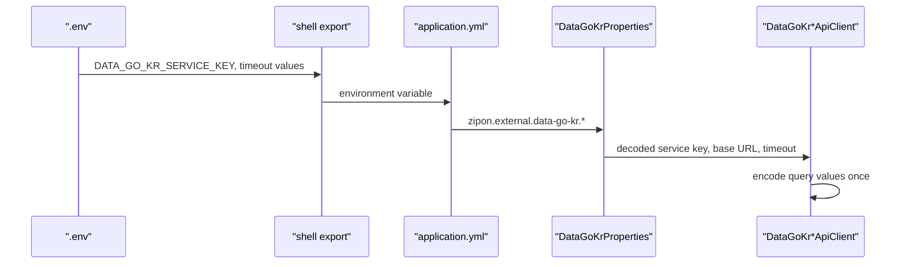

# 외부 API 설정과 data.go.kr 키 관리

> Status: Partially Implemented

## 목적


아직 구현하지 않은 것:

- 보증금-월세 환산, 분위 비교까지 포함한 정교한 비교 service
- 외부 API adapter 전용 retry, circuit breaker, provider quota/rate-limit 대응
- 건축물대장과 실거래가 원본 응답의 object storage 보존 write path, redaction, retention job

## 현재 구현

로컬 secret 저장:

```text
.env
```

저장소에 commit되는 예시 변수:

```text
.env.example
```

Spring Boot 설정 키:

```text
zipon.external.data-go-kr.base-url
zipon.external.data-go-kr.service-key
zipon.external.data-go-kr.connect-timeout
zipon.external.data-go-kr.read-timeout
zipon.external.data-go-kr.transaction-page-size
zipon.external.data-go-kr.transaction-max-pages
zipon.external.building-register.seed.enabled
zipon.external.building-register.seed.exit-when-finished
zipon.external.building-register.seed.dry-run
zipon.external.building-register.seed.max-candidates
zipon.external.building-register.seed.lawd-codes
zipon.external.building-register.seed.include-public-price-sync-targets
zipon.external.building-register.seed.include-admin-seed-targets
zipon.external.building-register.seed.include-property-identity-candidates
zipon.external.vworld.base-url
zipon.external.vworld.api-key
zipon.external.vworld.domain
zipon.external.vworld.connect-timeout
zipon.external.vworld.read-timeout
zipon.external.vworld.public-price.seed.enabled
zipon.external.vworld.public-price.seed.exit-when-finished
zipon.external.vworld.public-price.seed.dry-run
zipon.external.vworld.public-price.seed.standard-year
zipon.external.vworld.public-price.seed.materialize-targets
zipon.external.vworld.public-price.seed.sync-targets
zipon.external.vworld.public-price.seed.max-materialization-candidates
zipon.external.vworld.public-price.seed.max-candidates
zipon.external.vworld.public-price.seed.lawd-codes
zipon.external.vworld.public-price.seed.include-property-identity-candidates
zipon.external.vworld.public-price.seed.include-building-register-snapshots
zipon.external.vworld.public-price.seed.include-favorite-properties
zipon.external.vworld.public-price.seed.include-transaction-fact-candidates
zipon.external.vworld.public-price.seed.include-admin-seed-targets
zipon.external.vworld.public-price.seed.include-service-region-bulk-targets
zipon.external.vworld.public-price.seed.transaction-deal-year-month
zipon.external.vworld.public-price.seed.minimum-callable-confidence-score
zipon.external.vworld.public-price.seed.minimum-transaction-confidence-score
zipon.external.vworld.public-price.seed.max-failure-count
zipon.external.juso.base-url
zipon.external.juso.popup-confirm-key
zipon.external.juso.popup-return-origin
zipon.external.juso.address-search-key
zipon.external.juso.connect-timeout
zipon.external.juso.read-timeout
zipon.external.kab-r-one.base-url
zipon.external.kab-r-one.api-key
zipon.external.kab-r-one.connect-timeout
zipon.external.kab-r-one.read-timeout
zipon.external.kab-r-one.page-size
zipon.external.kab-r-one.max-pages
zipon.external.kab-r-one.sync.enabled
zipon.external.kab-r-one.sync.exit-when-finished
zipon.external.kab-r-one.sync.sync-tables
zipon.external.kab-r-one.sync.sync-items
zipon.external.kab-r-one.sync.sync-data
zipon.external.kab-r-one.sync.page-size
zipon.external.kab-r-one.sync.max-pages
zipon.external.kab-r-one.sync.table-ids
zipon.external.kab-r-one.sync.data-queries
zipon.external.data.scheduler.enabled
zipon.external.data.scheduler.weekly-refresh-cron
zipon.external.data.scheduler.zone
zipon.external.data.scheduler.batch-size
zipon.external.data.scheduler.lock-ttl
zipon.external.data.scheduler.register-latest-targets
zipon.external.data.scheduler.source-codes
zipon.external.data.scheduler.lawd-codes
zipon.external.data.scheduler.use-catalog-lawd-codes
zipon.external.data.scheduler.require-nationwide-catalog
zipon.external.data.scheduler.nationwide-minimum-lawd-code-count
zipon.external.data.scheduler.lawd-code-offset
zipon.external.data.scheduler.lawd-code-limit
zipon.external.data.scheduler.latest-month-lookback-count
zipon.external.data.scheduler.max-targets-to-register
zipon.external.data.seed.enabled
zipon.external.data.seed.register-targets
zipon.external.data.seed.collect-targets
zipon.external.data.seed.exit-when-finished
zipon.external.data.seed.dry-run
zipon.external.data.seed.source-codes
zipon.external.data.seed.lawd-codes
zipon.external.data.seed.use-catalog-lawd-codes
zipon.external.data.seed.require-nationwide-catalog
zipon.external.data.seed.nationwide-minimum-lawd-code-count
zipon.external.data.seed.lawd-code-offset
zipon.external.data.seed.lawd-code-limit
zipon.external.data.seed.from-year-month
zipon.external.data.seed.to-year-month
zipon.external.data.seed.max-targets-to-register
zipon.external.data.seed.batch-size
zipon.external.data.seed.max-runs
zipon.external.legal-dong-code.sync.enabled
zipon.external.legal-dong-code.sync.exit-when-finished
zipon.external.legal-dong-code.sync.page-size
zipon.external.legal-dong-code.sync.max-pages
zipon.external.legal-dong-code.sync.locatadd-name
```

환경변수 이름:

```text
DATA_GO_KR_BASE_URL
DATA_GO_KR_SERVICE_KEY
DATA_GO_KR_CONNECT_TIMEOUT
DATA_GO_KR_READ_TIMEOUT
DATA_GO_KR_TRANSACTION_PAGE_SIZE
DATA_GO_KR_TRANSACTION_MAX_PAGES
BUILDING_REGISTER_SEED_ENABLED
BUILDING_REGISTER_SEED_EXIT_WHEN_FINISHED
BUILDING_REGISTER_SEED_DRY_RUN
BUILDING_REGISTER_SEED_MAX_CANDIDATES
BUILDING_REGISTER_SEED_LAWD_CODES
BUILDING_REGISTER_SEED_INCLUDE_PUBLIC_PRICE_SYNC_TARGETS
BUILDING_REGISTER_SEED_INCLUDE_ADMIN_SEED_TARGETS
BUILDING_REGISTER_SEED_INCLUDE_PROPERTY_IDENTITY_CANDIDATES
VWORLD_BASE_URL
VWORLD_API_KEY
VWORLD_DOMAIN
VWORLD_CONNECT_TIMEOUT
VWORLD_READ_TIMEOUT
JUSO_BASE_URL
JUSO_ADDRESS_CONFIRM_KEY
JUSO_POPUP_RETURN_ORIGIN
JUSO_ADDRESS_SEARCH_KEY
JUSO_CONNECT_TIMEOUT
JUSO_READ_TIMEOUT
KAB_R_ONE_BASE_URL
KAB_R_ONE_API_KEY
KAB_R_ONE_CONNECT_TIMEOUT
KAB_R_ONE_READ_TIMEOUT
KAB_R_ONE_PAGE_SIZE
KAB_R_ONE_MAX_PAGES
KAB_R_ONE_SYNC_ENABLED
KAB_R_ONE_SYNC_EXIT_WHEN_FINISHED
KAB_R_ONE_SYNC_TABLES
KAB_R_ONE_SYNC_ITEMS
KAB_R_ONE_SYNC_DATA
KAB_R_ONE_SYNC_PAGE_SIZE
KAB_R_ONE_SYNC_MAX_PAGES
KAB_R_ONE_SYNC_TABLE_IDS
KAB_R_ONE_SYNC_DATA_QUERIES
PUBLIC_PRICE_SEED_ENABLED
PUBLIC_PRICE_SEED_EXIT_WHEN_FINISHED
PUBLIC_PRICE_SEED_DRY_RUN
PUBLIC_PRICE_SEED_STANDARD_YEAR
PUBLIC_PRICE_SEED_MATERIALIZE_TARGETS
PUBLIC_PRICE_SEED_SYNC_TARGETS
PUBLIC_PRICE_SEED_MAX_MATERIALIZATION_CANDIDATES
PUBLIC_PRICE_SEED_MAX_CANDIDATES
PUBLIC_PRICE_SEED_LAWD_CODES
PUBLIC_PRICE_SEED_INCLUDE_PROPERTY_IDENTITY_CANDIDATES
PUBLIC_PRICE_SEED_INCLUDE_BUILDING_REGISTER_SNAPSHOTS
PUBLIC_PRICE_SEED_INCLUDE_FAVORITE_PROPERTIES
PUBLIC_PRICE_SEED_INCLUDE_TRANSACTION_FACT_CANDIDATES
PUBLIC_PRICE_SEED_INCLUDE_ADMIN_SEED_TARGETS
PUBLIC_PRICE_SEED_INCLUDE_SERVICE_REGION_BULK_TARGETS
PUBLIC_PRICE_SEED_TRANSACTION_DEAL_YEAR_MONTH
PUBLIC_PRICE_SEED_MINIMUM_CALLABLE_CONFIDENCE_SCORE
PUBLIC_PRICE_SEED_MINIMUM_TRANSACTION_CONFIDENCE_SCORE
PUBLIC_PRICE_SEED_MAX_FAILURE_COUNT
EXTERNAL_DATA_SCHEDULER_ENABLED
EXTERNAL_DATA_WEEKLY_REFRESH_CRON
EXTERNAL_DATA_SCHEDULER_ZONE
EXTERNAL_DATA_SCHEDULER_BATCH_SIZE
EXTERNAL_DATA_SCHEDULER_LOCK_TTL
EXTERNAL_DATA_SCHEDULER_REGISTER_LATEST_TARGETS
EXTERNAL_DATA_SCHEDULER_SOURCE_CODES
EXTERNAL_DATA_SCHEDULER_LAWD_CODES
EXTERNAL_DATA_SCHEDULER_USE_CATALOG_LAWD_CODES
EXTERNAL_DATA_SCHEDULER_REQUIRE_NATIONWIDE_CATALOG
EXTERNAL_DATA_SCHEDULER_NATIONWIDE_MINIMUM_LAWD_CODE_COUNT
EXTERNAL_DATA_SCHEDULER_LAWD_CODE_OFFSET
EXTERNAL_DATA_SCHEDULER_LAWD_CODE_LIMIT
EXTERNAL_DATA_SCHEDULER_LATEST_MONTH_LOOKBACK_COUNT
EXTERNAL_DATA_SCHEDULER_MAX_TARGETS_TO_REGISTER
EXTERNAL_DATA_SEED_ENABLED
EXTERNAL_DATA_SEED_REGISTER_TARGETS
EXTERNAL_DATA_SEED_COLLECT_TARGETS
EXTERNAL_DATA_SEED_EXIT_WHEN_FINISHED
EXTERNAL_DATA_SEED_DRY_RUN
EXTERNAL_DATA_SEED_SOURCE_CODES
EXTERNAL_DATA_SEED_LAWD_CODES
EXTERNAL_DATA_SEED_USE_CATALOG_LAWD_CODES
EXTERNAL_DATA_SEED_REQUIRE_NATIONWIDE_CATALOG
EXTERNAL_DATA_SEED_NATIONWIDE_MINIMUM_LAWD_CODE_COUNT
EXTERNAL_DATA_SEED_LAWD_CODE_OFFSET
EXTERNAL_DATA_SEED_LAWD_CODE_LIMIT
EXTERNAL_DATA_SEED_FROM_YEAR_MONTH
EXTERNAL_DATA_SEED_TO_YEAR_MONTH
EXTERNAL_DATA_SEED_MAX_TARGETS_TO_REGISTER
EXTERNAL_DATA_SEED_BATCH_SIZE
EXTERNAL_DATA_SEED_MAX_RUNS
LEGAL_DONG_CODE_SYNC_ENABLED
LEGAL_DONG_CODE_SYNC_EXIT_WHEN_FINISHED
LEGAL_DONG_CODE_SYNC_PAGE_SIZE
LEGAL_DONG_CODE_SYNC_MAX_PAGES
LEGAL_DONG_CODE_SYNC_LOCATADD_NAME
```

프론트엔드 Kakao Map SDK 환경변수:

```text
KAKAO_MAP_REST_API_KEY
VITE_KAKAO_MAP_JS_KEY
VITE_KAKAO_MAP_APP_KEY
```

`KAKAO_MAP_REST_API_KEY`는 향후 backend-side Kakao REST API 연동이 필요할 때 local `.env`나 배포 secret에만 둔다. 현재 `application.yml`에는 아직 바인딩하지 않는다.

`VITE_KAKAO_MAP_JS_KEY`는 Kakao console에서 보는 JavaScript 키 이름과 맞춘 alias다. 현재 프론트엔드 `MapPlaceholder.vue`가 실제로 읽는 값은 `VITE_KAKAO_MAP_APP_KEY`이므로, local `.env`에서는 두 값을 같은 JavaScript 키로 맞춘다.

`VWORLD_BASE_URL`은 `https://api.vworld.kr` 같은 host 기준 URL이고, 공시가격 endpoint path는 `VWorldPublicPriceApiClient`가 `/ned/data/getIndvdHousingPriceAttr` 또는 `/ned/data/getApartHousingPriceAttr`로 붙인다. `VWORLD_DOMAIN`은 VWorld 공식 예제의 `domain` query parameter로만 사용하며, endpoint 전체 URL을 넣지 않는다. VWorld key가 도메인 제한으로 발급된 경우 `VWORLD_DOMAIN`이 비어 있거나 발급 시 등록한 도메인과 다르면 HTTP 200이어도 본문이 `INCORRECT_KEY`로 떨어질 수 있다.

현재 홈 위험진단 화면의 기본 주소 검색은 Juso 직접검색 backend proxy다. `frontend/src/api/addressSearchApi.js`의 `searchJusoAddresses()`가 `GET /api/address-search/juso`를 호출하고, `JusoAddressSearchController` -> `JusoAddressSearchService` -> `JusoAddressSearchApiClient`가 백엔드 검색용 승인키로 `https://business.juso.go.kr/addrlink/addrLinkApi.do`를 `resultType=json`으로 호출한다. 화면은 받은 후보를 인라인 목록으로 보여주고, 사용자가 선택한 후보를 `RentRiskDiagnosisRequest.address`와 `RentRiskDiagnosisRequest.jusoAddress`로 넘긴다. 이 방식에서는 브라우저가 Juso를 직접 `axios/fetch`로 호출하지 않고, Juso 팝업 callback도 거치지 않는다.

Juso 주소 팝업 승인키는 `JUSO_ADDRESS_CONFIRM_KEY`로 보관하고, `application.yml`의 `zipon.external.juso.popup-confirm-key`를 통해 `JusoAddressProperties`에 바인딩한다. 팝업 endpoint는 보조/호환 경로로 남아 있으며, 프론트엔드가 `openJusoAddressPopup()`을 사용할 때도 승인키를 읽지 않고 `/api/address-search/juso-popup`만 새 창으로 연다. `JusoAddressPopupController`는 백엔드 설정의 승인키로 Juso 팝업 API form을 생성하고, Juso가 선택 주소를 `/api/address-search/juso-popup/callback`으로 돌려주면 `JusoAddressPopupPageRenderer`가 `postMessage`로 부모 창에 결과를 전달한다. 이 endpoint는 주소 후보 검색용 HTML callback boundary이며, ZIP:ON 백엔드는 Juso 검색 결과를 DB에 저장하지 않는다.

`JusoAddressPopupController.openPopup()`이 Juso 팝업 API에 넘기는 `returnUrl`은 기본적으로 현재 백엔드 요청 URL에 `/callback`을 붙여 만든다. 따라서 로컬 Spring Boot가 `http://localhost:8082`에서 실행 중이면 Juso callback은 `http://localhost:8082/api/address-search/juso-popup/callback`으로 돌아온다. HTTPS callback이 필요하면 `JUSO_POPUP_RETURN_ORIGIN` 또는 `zipon.external.juso.popup-return-origin`에 실제 접근 가능한 HTTPS origin을 넣는다. 이 값은 scheme/host/port까지만 쓰고 path는 컨트롤러가 `/api/address-search/juso-popup/callback`으로 붙인다. `targetOrigin`은 `postMessage` 대상인 실제 프론트엔드 origin이므로 로컬 Vite가 `http://localhost:5173`에서 실행 중이면 그대로 `http://localhost:5173`을 유지한다.

Juso 주소검색용 별도 키는 `JUSO_ADDRESS_SEARCH_KEY`로 보관하고, `application.yml`의 `zipon.external.juso.address-search-key`를 통해 같은 `JusoAddressProperties`에 바인딩한다. 커밋되는 `.env.example`과 문서에는 실제 발급 키를 남기지 않는다.

직접 주소검색 API의 요청 파라미터는 `keyword`, `currentPage`, `countPerPage`, `hstryYn`, `firstSort`, `addInfoYn`이다. ZIP:ON은 `countPerPage`를 1~100으로 제한하고, `hstryYn`/`addInfoYn`은 `Y` 또는 `N`, `firstSort`는 `none`/`road`/`location`만 허용한다. Juso 원문 오류 코드 `E0001`, `E0014`는 `UNAVAILABLE`, 검색어 오류 계열은 `INVALID_REQUEST`, `totalCount=0`은 `EMPTY`로 변환한다.

한국부동산원 R-ONE 통계 OpenAPI 인증키는 `KAB_R_ONE_API_KEY`로 보관한다. 이 키는 사용자가 제공한 실제 값이라도 저장소, 문서, 테스트 fixture, 로그에 남기지 않는다. `KAB_R_ONE_BASE_URL` 기본값은 `https://www.reb.or.kr/r-one/openapi`이며, 공식 개발가이드 예시 기준 endpoint는 `SttsApiTbl.do`, `SttsApiTblItm.do`, `SttsApiTblData.do`이고 인증 파라미터명은 `KEY`다. R-ONE API는 현재 매물 목록이 아니라 과거 가격지수, 전세·월세 지표, 오피스텔 수익률, 상가 공실률 같은 통계 분석에만 사용한다.

R-ONE 수동 sync는 `KAB_R_ONE_SYNC_ENABLED=true`일 때만 실행된다. `KAB_R_ONE_SYNC_TABLE_IDS`는 ZIP:ON 과거 지표 분석용 allowlist이고, 통계자료 저장은 `KAB_R_ONE_SYNC_DATA=true`와 `KAB_R_ONE_SYNC_DATA_QUERIES`를 함께 명시해야 한다. `KAB_R_ONE_SYNC_DATA_QUERIES`는 `tableId=A_2024_00615|cycle=MM|start=202401|end=202412|grpId=...|clsId=...|itmId=...`처럼 쿼리 하나를 pipe-separated key/value로 표현하고, 여러 쿼리는 쉼표로 구분한다.

실거래가 최신월 scheduler는 `EXTERNAL_DATA_SCHEDULER_ENABLED=true`일 때만 주간 cron으로 실행된다. scheduler가 켜지면 `EXTERNAL_DATA_SCHEDULER_REGISTER_LATEST_TARGETS=true` 기본값에 따라 `ExternalDataLatestTargetMaterializer`가 최신 완료월 rolling window의 `source + LAWD_CD + DEAL_YMD` target을 `external_data_refresh_targets`에 등록한다. 실제 data.go.kr 호출은 `ExternalDataRefreshSchedulerService`가 due target을 `EXTERNAL_DATA_SCHEDULER_BATCH_SIZE`만큼만 처리한다. 전국 운영에서는 먼저 법정동코드 catalog sync를 실행하고, `EXTERNAL_DATA_SCHEDULER_REQUIRE_NATIONWIDE_CATALOG=true`와 Redis lock을 함께 켠다. 상세 절차는 [외부 실거래가 최신월 scheduler](/docs/operations/EXTERNAL_DATA_SCHEDULER.md)를 따른다.

`SearchBar.vue`는 선택 결과의 `jibunAddr`를 `RentRiskDiagnosisRequest.address`로 보내고, `admCd`, `siNm`, `sggNm`, `emdNm`, `liNm`, `mtYn`, `lnbrMnnm`, `lnbrSlno`를 `RentRiskDiagnosisRequest.jusoAddress`로 함께 보낸다. `LeaseRiskAddressNormalizer`는 이 구조화 필드를 문자열 파싱보다 먼저 사용한다. 다만 `admCd`나 읍면동명이 들어왔다고 해서 전국 주소를 자동 지원하는 것은 아니다. `MyBatisLegalDongCodeCatalog`가 `legal_dong_codes` seed catalog에서 `admCd` 또는 지역명 조합을 찾을 수 있을 때만 법정동코드 확정으로 처리하고, seed 밖 주소는 `LEGAL_DONG_CODE_NOT_FOUND` 제한 진단으로 남긴다.

관련 코드:

```text
backend/src/main/resources/application.yml
backend/pom.xml
backend/src/main/java/com/zipon/config/ExternalApiConfig.java
backend/src/main/java/com/zipon/config/DataGoKrProperties.java
backend/src/main/java/com/zipon/config/BuildingRegisterSeedProperties.java
backend/src/main/java/com/zipon/config/JusoAddressProperties.java
backend/src/main/java/com/zipon/external/buildingregister/BuildingRegisterApiClient.java
backend/src/main/java/com/zipon/external/buildingregister/DataGoKrBuildingRegisterApiClient.java
backend/src/main/java/com/zipon/external/buildingregister/BuildingRegisterApiResponseParser.java
backend/src/main/java/com/zipon/external/transaction/RentTransactionApiClient.java
backend/src/main/java/com/zipon/external/transaction/DataGoKrRentTransactionApiClient.java
backend/src/main/java/com/zipon/external/transaction/RentTransactionApiResponseParser.java
backend/src/main/java/com/zipon/external/transaction/SaleTransactionApiClient.java
backend/src/main/java/com/zipon/external/transaction/DataGoKrSaleTransactionApiClient.java
backend/src/main/java/com/zipon/external/transaction/SaleTransactionApiResponseParser.java
backend/src/main/java/com/zipon/config/VWorldProperties.java
backend/src/main/java/com/zipon/controller/JusoAddressSearchController.java
backend/src/main/java/com/zipon/service/JusoAddressSearchService.java
backend/src/main/java/com/zipon/external/juso/JusoAddressSearchApiClient.java
backend/src/main/java/com/zipon/external/juso/JusoAddressSearchApiResponseParser.java
backend/src/main/java/com/zipon/external/publicprice/PublicPriceApiClient.java
backend/src/main/java/com/zipon/external/publicprice/PublicPriceApiQuery.java
backend/src/main/java/com/zipon/external/publicprice/PublicPriceApiResponseParser.java
backend/src/main/java/com/zipon/external/publicprice/VWorldPublicPriceApiClient.java
backend/src/main/java/com/zipon/config/PublicPriceSeedProperties.java
backend/src/main/java/com/zipon/external/geocoder/GeocodingApiClient.java
backend/src/main/java/com/zipon/external/geocoder/GeocodingApiQuery.java
backend/src/main/java/com/zipon/external/geocoder/GeocodingApiResponseParser.java
backend/src/main/java/com/zipon/external/geocoder/VWorldGeocodingApiClient.java
backend/src/main/java/com/zipon/config/KabROneProperties.java
backend/src/main/java/com/zipon/config/KabROneSyncProperties.java
backend/src/main/java/com/zipon/external/kabrone/KabROneStatisticsApiClient.java
backend/src/main/java/com/zipon/external/kabrone/KabROneApiResponseParser.java
backend/src/main/java/com/zipon/service/KabROneSyncService.java
backend/src/main/java/com/zipon/service/KabROneSyncRunner.java
backend/src/main/java/com/zipon/config/ExternalDataSchedulerProperties.java
backend/src/main/java/com/zipon/config/ExternalDataSeedProperties.java
backend/src/main/java/com/zipon/config/LegalDongCodeSyncProperties.java
backend/src/main/java/com/zipon/service/ExternalDataWeeklyRefreshScheduler.java
backend/src/main/java/com/zipon/service/ExternalDataLatestTargetMaterializer.java
backend/src/main/java/com/zipon/service/ExternalDataTransactionMonthTargetRegistrationService.java
backend/src/main/java/com/zipon/service/ExternalDataSeedRunner.java
backend/src/main/java/com/zipon/service/ExternalDataSeedTargetService.java
backend/src/main/java/com/zipon/service/LegalDongCodeSyncRunner.java
backend/src/main/java/com/zipon/service/LegalDongCodeSyncService.java
backend/src/main/java/com/zipon/controller/AdminExternalApiHealthController.java
backend/src/main/java/com/zipon/service/ExternalApiHealthCheckService.java
backend/src/main/java/com/zipon/dto/response/ExternalApiHealthResponse.java
backend/src/main/java/com/zipon/dto/response/ExternalApiHealthCheckResponse.java
backend/src/main/java/com/zipon/mapper/KabROneStatisticsMapper.java
backend/src/test/java/com/zipon/config/DataGoKrPropertiesTest.java
backend/src/test/java/com/zipon/config/JusoAddressPropertiesTest.java
backend/src/test/java/com/zipon/config/KabROnePropertiesTest.java
backend/src/test/java/com/zipon/external/buildingregister/DataGoKrBuildingRegisterApiClientTest.java
backend/src/test/java/com/zipon/external/buildingregister/BuildingRegisterApiResponseParserTest.java
backend/src/test/java/com/zipon/external/transaction/DataGoKrRentTransactionApiClientTest.java
backend/src/test/java/com/zipon/external/transaction/RentTransactionApiResponseParserTest.java
backend/src/test/java/com/zipon/external/transaction/DataGoKrSaleTransactionApiClientTest.java
backend/src/test/java/com/zipon/external/transaction/SaleTransactionApiResponseParserTest.java
backend/src/test/java/com/zipon/external/publicprice/PublicPriceApiQueryTest.java
backend/src/test/java/com/zipon/external/publicprice/PublicPriceApiResponseParserTest.java
backend/src/test/java/com/zipon/external/publicprice/VWorldPublicPriceApiClientTest.java
backend/src/test/java/com/zipon/external/geocoder/GeocodingApiQueryTest.java
backend/src/test/java/com/zipon/external/geocoder/GeocodingApiResponseParserTest.java
backend/src/test/java/com/zipon/external/geocoder/VWorldGeocodingApiClientTest.java
backend/src/test/java/com/zipon/external/kabrone/KabROneStatisticsApiClientTest.java
backend/src/test/java/com/zipon/external/kabrone/KabROneApiResponseParserTest.java
backend/src/test/java/com/zipon/service/KabROneSyncServiceTest.java
backend/src/test/java/com/zipon/service/ExternalApiHealthCheckServiceTest.java
backend/src/test/java/com/zipon/ExternalApiHealthIntegrationTest.java
backend/src/test/java/com/zipon/controller/JusoAddressSearchControllerTest.java
backend/src/test/java/com/zipon/service/JusoAddressSearchServiceTest.java
backend/src/test/java/com/zipon/external/juso/JusoAddressSearchApiClientTest.java
backend/src/test/java/com/zipon/external/juso/JusoAddressSearchApiResponseParserTest.java
backend/src/test/java/com/zipon/RentRiskDiagnosisPublicPriceIntegrationTest.java
frontend/.env.example
frontend/src/components/map/MapPlaceholder.vue
frontend/src/utils/jusoAddressSearch.js
frontend/src/components/common/SearchBar.vue
backend/src/main/java/com/zipon/controller/JusoAddressPopupController.java
backend/src/test/java/com/zipon/controller/JusoAddressPopupControllerTest.java
backend/src/main/java/com/zipon/service/JusoAddressPopupPageRenderer.java
backend/src/test/java/com/zipon/service/JusoAddressPopupPageRendererTest.java
backend/src/main/java/com/zipon/service/LeaseRiskAddressNormalizer.java
```

`MapPlaceholder.vue`는 `VITE_KAKAO_MAP_APP_KEY`가 비어 있으면 Kakao SDK script를 삽입하지 않는다. 기존처럼 `appkey`를 컴포넌트 문자열에 하드코딩하지 않는다.

MVP에서 어떤 외부 API를 언제 호출할지는 [과거 지표 분석과 정확 주소 위험진단 MVP API 호출 전략](/docs/api/API_CALL_FLOW.md)을 기준으로 한다. 핵심 원칙은 현재 매물 목록을 제공하지 않고, 지역·유형 입력은 R-ONE/실거래가 과거 지표 분석으로, 정확 주소 입력은 물건 유형 판별 이후 필요한 API 호출로 분기하는 것이다.


## 설정 흐름



ZIP:ON local profile은 `application.yml`의 `spring.config.import`로 repository root `.env`를 선택적으로 읽는다. shell 환경변수로 같은 값을 export하면 Spring Boot의 일반 property override 규칙에 따라 export 값이 우선한다.

```bash
set -a
source .env
set +a

cd backend
./mvnw spring-boot:run -Dspring-boot.run.profiles=local
```

Windows PowerShell 5.1에서는 Bash의 `source`, `export`, `&&` 문법을 그대로 사용할 수 없다. 필요한 값만 명시적으로 주입한 뒤 `mvnw.cmd`를 실행한다.

```powershell
$env:DATA_GO_KR_SERVICE_KEY = "local-data-go-kr-key"
$env:DATA_GO_KR_CONNECT_TIMEOUT = "3s"
$env:DATA_GO_KR_READ_TIMEOUT = "5s"

Set-Location backend
.\mvnw.cmd spring-boot:run -Dspring-boot.run.profiles=local
```

## 인코딩 키와 원본 키

data.go.kr은 문서나 포털에서 URL에 바로 붙일 수 있는 인코딩된 service key와, 원본 service key를 함께 보여준다.

ZIP:ON의 `.env`에는 원본 service key를 저장한다.

이유:

- `DataGoKrBuildingRegisterApiClient`, `DataGoKrRentTransactionApiClient`, `DataGoKrSaleTransactionApiClient`가 query parameter 값을 한 번만 인코딩한다.
- 이미 인코딩된 값을 HTTP client에 넘기면 `%2F`가 `%252F`처럼 다시 인코딩되는 문제가 생길 수 있다.
- 원본 키와 인코딩 키를 둘 다 저장하면 나중에 둘 중 하나만 교체되어 불일치가 생길 수 있다.

인코딩된 key는 수동으로 URL 문자열을 만들거나 curl 예제를 빠르게 확인할 때만 사용한다. 애플리케이션 설정에서는 `DATA_GO_KR_SERVICE_KEY` 하나만 사용한다.

실제 구현에서 한 번 확인한 주의점:

- Spring `RestClient`의 URI builder만 믿으면 service key의 `/`, `+`가 그대로 남을 수 있다.
- 이미 `%3D`처럼 인코딩된 문자열을 다시 URI template에 넘기면 `%253D`처럼 double-encoding될 수 있다.
- 그래서 data.go.kr client는 `URLEncoder.encode(...)`로 query parameter 값을 만든 뒤 최종 `URI`를 한 번만 생성한다.
- `DataGoKrBuildingRegisterApiClientTest`, `DataGoKrRentTransactionApiClientTest`, `DataGoKrSaleTransactionApiClientTest`가 `sample/decoded+key==`가 `sample%2Fdecoded%2Bkey%3D%3D`로 나가는지 검증한다.

## Decision: data.go.kr key는 `.env`에 원본 값으로 저장한다

### Context

외부 API key는 코드, 문서, Git history, 테스트 로그에 남으면 안 된다. 동시에 Spring Boot 코드에서는 명확한 설정 이름으로 읽을 수 있어야 한다.

### Options considered

1. `application.yml`에 직접 key를 넣는다.
2. `.env`에 원본 key와 인코딩 key를 둘 다 넣는다.
3. `.env`에는 원본 key만 넣고, Spring 설정으로 바인딩한다.

### Decision

`.env`에는 `DATA_GO_KR_SERVICE_KEY` 원본 값만 저장하고, `application.yml`에서 `zipon.external.data-go-kr.service-key`로 바인딩한다. endpoint와 timeout은 `DATA_GO_KR_BASE_URL`, `DATA_GO_KR_CONNECT_TIMEOUT`, `DATA_GO_KR_READ_TIMEOUT`으로 조정할 수 있지만 secret은 아니다.

### Why

이 방식은 secret을 Git에서 분리하면서도, Java 코드가 `DataGoKrProperties`를 통해 명시적인 설정 객체를 주입받을 수 있게 한다. 또한 HTTP client가 URL을 만들 때 중복 인코딩을 피할 수 있다.

### Tradeoffs

`.env`를 수정한 뒤 backend를 실행할 때 shell별 환경변수 주입 흐름을 기억해야 한다. Bash/zsh는 `set -a`, `source .env`, `set +a`를 순서대로 실행하고, Windows PowerShell 5.1은 `$env:...` 값을 명시적으로 설정하거나 PowerShell용 env 로딩 스크립트를 별도로 사용해야 한다. 나중에 배포 환경을 만들면 같은 환경변수 이름을 배포 플랫폼 secret 설정에도 등록해야 한다.

### Future revisit

건축물대장 client, 전월세 실거래가 client, 매매 실거래가 client, VWorld 공시가격 client, VWorld Geocoder client는 `RestClient`를 사용한다. 공시가격 client는 `VWORLD_API_KEY`가 없으면 실제 HTTP 호출을 하지 않고 `PublicPriceLookupStatus.UNAVAILABLE`을 반환한다. 공동주택가격은 `/ned/data/getApartHousingPriceAttr`, 개별주택가격은 `/ned/data/getIndvdHousingPriceAttr`를 호출하고, `PublicPriceApiResponseParser`가 공시가격 금액을 만 원 단위 `PublicPriceSnapshot`으로 변환한다. `PublicPriceApiClient.lookupLatestAvailablePublicPrice(...)`는 현재 기준연도 조회가 `NOT_FOUND`이면 같은 PNU를 기준연도 없이 한 번 더 조회하고, 응답 중 가장 최신 `stdrYear`/`stdrMt` 가격 후보만 진단에 사용한다. `PublicPriceSeedRunner`는 `zipon.external.vworld.public-price.seed.enabled=true`일 때 `VWorldPublicPriceSyncTargetMapper`로 `vworld_public_price_admin_seed_targets`를 포함한 후보를 `vworld_public_price_sync_targets`에 materialize하고, callable target만 같은 공시가격 client와 `PublicPriceSnapshotStore`로 `public_price_snapshots`에 저장한다. coverage snapshot은 `vworld_public_price_coverage_metrics`에 남긴다. `BuildingRegisterSeedRunner`는 `zipon.external.building-register.seed.enabled=true`일 때 `vworld_public_price_sync_targets`, `vworld_public_price_admin_seed_targets`, `property_identity_candidates`의 PNU 후보를 건축물대장 표제부 조회 파라미터로 복원하고, 30일 이내 fresh snapshot이 없는 후보만 `BuildingRegisterApiClient`와 `BuildingRegisterTitleSnapshotStore`로 `building_register_title_snapshots`에 저장한다. `LeaseRiskDiagnosisDataStatusService`는 이 기준시점을 `가격 기준시점` 상세 줄로 내려 보내고, `LeaseRiskDiagnosisResult.vue`는 공공데이터 확인 카드에서 이 값을 표시한다. 주소 좌표 변환은 `VWorldGeocodingApiClient`가 VWorld Geocoder API 2.0의 `/req/address`를 호출하고, `GeocodingApiResponseParser`가 `GeocodingCoordinate`로 변환한다. 공식 문서가 별도 저장장치나 DB 저장을 금지하므로 좌표 결과는 후행 API 호출 직전 실시간 사용으로 제한하고, `external_api_call_logs.request_summary`에는 원문 주소 대신 `addressHash`만 남긴다. GIS건물통합정보도 VWorld에서 가능하다고 확인되었지만, 구체 endpoint와 응답 필드는 [VWorld 공시가격/GIS 명세](/docs/api/external-api/specs/vworld-public-price-and-gis-api.md)에 `확인 필요`로 남긴다. 외부 API 호출 운영 로그는 `external_api_call_logs`에 남긴다. Redis/volatile state는 현재 access token denylist cache, 로그인 실패 rate limit, scheduler lock에만 적용했고, 외부 API raw response short TTL cache와 재시도/circuit breaker는 아직 구현하지 않았다.

## External API call logs

외부 API client는 `ExternalApiCallLogger`를 통해 `external_api_call_logs`에 운영 로그를 남긴다.

대상 client:

```text
DataGoKrBuildingRegisterApiClient
DataGoKrRentTransactionApiClient
DataGoKrSaleTransactionApiClient
VWorldPublicPriceApiClient
VWorldGeocodingApiClient
KabROneStatisticsApiClient
```

저장하는 값:

- provider: `data.go.kr`, `vworld`, `reb.or.kr`
- apiName: `building-register-title`, `APARTMENT_RENT`, `APARTMENT_TRADE`, `CONDOMINIUM_HOUSING_PRICE`, `SttsApiTbl`, `SttsApiTblItm`, `SttsApiTblData` 등
- endpointPath: query string 없는 path
- requestSummary: `serviceKey` 없는 조회 요약
- resultStatus: `SUCCESS`, `EMPTY`, `UNAVAILABLE`, `ERROR`
- httpStatusCode, durationMillis, errorMessage

저장하지 않는 값:

- `DATA_GO_KR_SERVICE_KEY`, `VWORLD_API_KEY`, `KAB_R_ONE_API_KEY`
- 외부 API 원본 response body
- 등기부등본/계약서/PDF 같은 원본 파일

관리자는 `GET /api/admin/external-api-call-logs`와 `AdminDashboardView.vue`의 "외부 API 호출 로그" 표로 상태를 확인한다. 이 기능은 장애 원인 추적용 운영 데이터이며, 외부 API 원본 보존 전략은 [저장소 전략](/docs/architecture/DATA_STORAGE_POLICY.md)의 S3 후보 항목으로 따로 본다.

## External data collection status

관리자는 `GET /api/admin/external-data-status`와 `AdminDashboardView.vue`의 "공공데이터 수집 상태" 섹션으로 DB-first 공공데이터 수집 상태와 데이터 품질을 확인한다. 이 endpoint는 `ROLE_ADMIN`, `ROLE_DEVELOPER_ADMIN`, `ROLE_SYSTEM_ADMIN`, `ROLE_EXTERNAL_API_MANAGER` 같은 외부 API 운영 authority만 호출할 수 있고, `SecurityConfig`의 `/api/admin/external-data-status/**` 규칙을 따른다.

이 화면은 `external_api_call_logs`의 원시 호출 로그를 대체하지 않는다. 호출 로그는 개별 HTTP 호출을 추적하고, 수집 상태 화면은 다음 운영 질문에 답한다.

| 질문 | 응답 필드 | 원천 테이블 |
| --- | --- | --- |
| 수집 대상이 얼마나 쌓였는가? | `refreshTargets.totalCount`, `dueCount`, `failedCount` | `external_data_refresh_targets` |
| 최근 scheduler/user request 수집이 성공했는가? | `latestRun`, `recentRuns` | `external_data_collection_runs` |
| 최근 7일 수집 시도에서 어떤 오류가 많은가? | `recentAttemptStatuses` | `external_data_collection_attempts` |
| 실거래가 fact가 충분하고 신뢰 가능한가? | `transactionFacts.qualityCounts`, `confidenceCounts` | `real_estate_transaction_facts` |
| 월별 시장 통계 표본이 부족하지 않은가? | `marketStatistics.totalSampleCount`, `qualityCounts` | `market_statistics_monthly` |
| 어떤 source에 실패 target이나 최근 실패가 몰렸는가? | `sources[]` | `external_data_sources`, refresh target, attempt 집계 |

구현 위치:

```text
backend/src/main/java/com/zipon/controller/AdminExternalDataStatusController.java
backend/src/main/java/com/zipon/service/AdminExternalDataStatusService.java
backend/src/main/java/com/zipon/mapper/AdminExternalDataStatusMapper.java
backend/src/main/java/com/zipon/dto/response/AdminExternalDataStatusResponse.java
frontend/src/views/AdminDashboardView.vue
frontend/src/api/adminApi.js
backend/src/test/java/com/zipon/AdminExternalDataStatusIntegrationTest.java
```

응답에는 외부 API 원본 response body, service key, 사용자 입력 원문 주소, 임의 SQL 실행 결과를 포함하지 않는다. `AdminExternalDataStatusMapper`는 정해진 집계 SQL만 실행하며, schema source of truth는 `V20__create_external_data_fact_statistics_schema.sql`이다.

### External data status learning path

1. First read: `V20__create_external_data_fact_statistics_schema.sql`
2. Then inspect: `AdminExternalDataStatusMapper`
3. Then inspect: `AdminExternalDataStatusService`
4. Then inspect: `AdminExternalDataStatusController`
5. Then inspect: `AdminDashboardView.vue`의 "공공데이터 수집 상태" 섹션
6. Then run: `cd backend && ./mvnw -Dtest=AdminExternalDataStatusIntegrationTest test`
7. Key concept to understand: 관리자 화면은 DB를 직접 열어보는 콘솔이 아니라, 운영자가 판단해야 하는 질문을 제한된 read-only API로 번역한 관측성 계층이다.

## External API health check

관리자는 `GET /api/admin/external-api-health`로 외부 API가 실제로 호출 가능한지 세분화해서 확인할 수 있다. 이 endpoint는 `ROLE_ADMIN`, `ROLE_DEVELOPER_ADMIN`, `ROLE_SYSTEM_ADMIN`, `ROLE_EXTERNAL_API_MANAGER` 같은 외부 API 운영 authority만 호출할 수 있고, `SecurityConfig`의 `/api/admin/external-api-*` 규칙을 따른다.

현재 점검 항목은 다음 다섯 가지다.

| key | provider | API | sample query |
| --- | --- | --- | --- |
| `building-register-title` | `data.go.kr` | 건축물대장 표제부 | `sigunguCd=11620,bjdongCd=10200,platGbCd=0,bun=1422,ji=0005` |
| `row-house-rent-transaction` | `data.go.kr` | 연립/다세대 전월세 실거래가 | `apiType=ROW_HOUSE_RENT,LAWD_CD=11620,DEAL_YMD=<최근 완료월>` |
| `row-house-sale-transaction` | `data.go.kr` | 연립/다세대 매매 실거래가 | `apiType=ROW_HOUSE_TRADE,LAWD_CD=11620,DEAL_YMD=<최근 완료월>` |
| `condominium-public-price` | `vworld` | 공동주택 공시가격 | `dataType=CONDOMINIUM_HOUSING_PRICE,pnu=1162010200114220005,stdrYear=<현재연도>` 후 `NOT_FOUND`이면 `stdrYear` 없이 최신 가용 자료 재조회 |
| `vworld-geocoder` | `vworld` | 주소 좌표 변환 | `type=PARCEL,crs=EPSG:4326,address=sample-address-redacted` |

이 health check는 현재 정확 주소 위험진단에 직접 연결된 `data.go.kr` 건축물대장/실거래가와 VWorld 공시가격/Geocoder adapter를 검사한다. Juso 주소검색과 R-ONE 통계 sync는 같은 설정 문서에 포함되지만, 아직 `GET /api/admin/external-api-health`의 점검 항목은 아니다. 해당 기능은 `JusoAddressSearchApiClientTest`, `KabROneStatisticsApiClientTest`, `KabROneSyncServiceTest`처럼 전용 adapter/service 테스트로 검증한다.

`ExternalApiHealthCheckService`는 API key가 없으면 실제 외부 HTTP 호출을 하지 않고 `configured=false`, `httpCallAttempted=false`, `resultStatus=UNAVAILABLE`, `lookupStatus=NOT_CONFIGURED`로 응답한다. API key가 있으면 기존 adapter (`DataGoKrBuildingRegisterApiClient`, `DataGoKrRentTransactionApiClient`, `DataGoKrSaleTransactionApiClient`, `VWorldPublicPriceApiClient`, `VWorldGeocodingApiClient`)를 그대로 사용해 sample query를 호출한다. 따라서 parser, timeout, base URL, service key encoding 문제가 실제 진단 흐름과 같은 방식으로 드러난다.

헬스체크 관점에서는 `FOUND`, `AMBIGUOUS`, `NOT_FOUND`를 호출 가능 상태로 본다. sample query에 데이터가 없는 것은 장애가 아니라 "외부 API가 응답했고 parser가 빈 결과로 해석했다"는 뜻이므로 `resultStatus=EMPTY`, `healthy=true`가 될 수 있다. 다만 VWorld가 `resultCode=INCORRECT_KEY` 같은 오류 payload를 반환하면 HTTP 200이어도 `ERROR`로 본다. 반대로 `UNAVAILABLE`, `ERROR`, `EXCEPTION`은 설정 누락, HTTP 오류, timeout, 응답 parsing 실패를 의심해야 한다.

응답에는 `DATA_GO_KR_SERVICE_KEY`, `VWORLD_API_KEY`, `KAB_R_ONE_API_KEY`, 원본 response body를 포함하지 않는다. 다만 key가 설정된 상태에서 헬스체크를 실행하면 실제 외부 HTTP 호출과 `external_api_call_logs` 기록이 발생할 수 있으므로 운영에서는 필요할 때만 수동으로 실행한다.

PowerShell:

```powershell
$login = Invoke-RestMethod `
  -Method Post `
  -Uri http://localhost:8082/api/auth/login `
  -ContentType 'application/json' `
  -Body '{"username":"admin","password":"admin"}'

$token = $login.data.accessToken

Invoke-RestMethod `
  -Uri http://localhost:8082/api/admin/external-api-health `
  -Headers @{ Authorization = "Bearer $token" } |
  ConvertTo-Json -Depth 8
```

macOS/Linux Bash 또는 Windows Git Bash:

```bash
ADMIN_TOKEN="$(
  curl -s -X POST http://localhost:8082/api/auth/login \
    -H 'Content-Type: application/json' \
    -d '{"username":"admin","password":"admin"}' \
  | node -pe 'JSON.parse(fs.readFileSync(0, "utf8")).data.accessToken'
)"

curl -s http://localhost:8082/api/admin/external-api-health \
  -H "Authorization: Bearer ${ADMIN_TOKEN}" \
  | node -pe 'JSON.stringify(JSON.parse(fs.readFileSync(0, "utf8")), null, 2)'
```

### Health check learning path

1. First read: `README.md`의 `External API health check`
2. Then inspect: `AdminExternalApiHealthController`
3. Then inspect: `ExternalApiHealthCheckService`
4. Then inspect: `DataGoKrBuildingRegisterApiClient`, `DataGoKrRentTransactionApiClient`, `DataGoKrSaleTransactionApiClient`, `VWorldPublicPriceApiClient`, `VWorldGeocodingApiClient`
5. Then run: `cd backend && ./mvnw -Dtest=ExternalApiHealthCheckServiceTest,ExternalApiHealthIntegrationTest test`
6. Then debug: `configured=false`는 key 누락, `httpCallAttempted=false`는 실제 HTTP 미호출, `resultStatus=EMPTY`는 sample query 데이터 없음, `resultStatus=ERROR`는 HTTP/timeout/parser 실패로 나눠 본다.
7. Key concept to understand: 운영용 health check는 단순 서버 생존 확인이 아니라 외부 설정, 네트워크 호출, parser 결과 해석을 분리해서 보여주는 관측성 기능이다.

## Debugging checklist

- `git status --short --ignored .env`에서 `.env`가 ignored 상태인지 확인한다.
- `git diff`에 실제 service key가 들어가지 않았는지 확인한다.
- `frontend/src/components/map/MapPlaceholder.vue`에 실제 Kakao appkey가 하드코딩되지 않았는지 확인한다.
- `frontend/src/api/addressSearchApi.js`, `frontend/src/utils/jusoAddressSearch.js`, `SearchBar.vue`, 문서에 실제 Juso 승인키나 프론트엔드 Juso 승인키 의존이 남지 않았는지 확인한다.
- `SearchBar.vue`의 "주소 찾기"가 `searchJusoAddresses()`를 통해 `GET /api/address-search/juso`를 호출하고, 브라우저가 `business.juso.go.kr`을 직접 호출하지 않는지 확인한다.
- `JusoAddressPopupControllerTest`에서 기본 로컬 Juso 팝업 `returnUrl`이 `http://localhost:8082/api/address-search/juso-popup/callback...`로 생성되는지 확인한다.
- `JUSO_POPUP_RETURN_ORIGIN`을 설정했다면 해당 HTTPS origin이 실제로 접근 가능한지 먼저 확인한다. TLS가 없는 `8082`에 `https://localhost:8082`를 넘기면 Tomcat `Invalid character found in method name [0x16...]` 오류가 난다.
- `JusoAddressSearchApiClientTest`에서 `confmKey`, `keyword`, `resultType=json`, `hstryYn`, `firstSort`, `addInfoYn` query가 의도대로 만들어지고, `requestSummary`에 원문 검색어 대신 `keywordHash`가 남는지 확인한다.
- `JUSO_ADDRESS_SEARCH_KEY`가 비어 있으면 `JusoAddressSearchApiClient`가 외부 호출 없이 `JusoAddressSearchStatus.UNAVAILABLE`로 끝나는지 확인한다.
- `JusoAddressSearchApiResponseParserTest`에서 `errorCode=0`, `totalCount=0`, `E0001`, `E0014`, 검색어 오류 계열이 각각 `SUCCESS`/`EMPTY`/`UNAVAILABLE`/`INVALID_REQUEST`로 매핑되는지 확인한다.
- backend 실행 전에 `set -a`, `source .env`, `set +a`를 실행했는지 확인한다.
- HTTP client 코드에는 인코딩된 key가 아니라 `DataGoKrProperties.getServiceKey()`의 원본 key를 넘긴다.
- `DataGoKrBuildingRegisterApiClientTest`에서 service key가 한 번만 인코딩되는지 확인한다.
- `DataGoKrRentTransactionApiClientTest`에서 service key, `LAWD_CD`, `DEAL_YMD`가 한 번만 인코딩되는지 확인한다.
- `DataGoKrSaleTransactionApiClientTest`에서 service key, `LAWD_CD`, `DEAL_YMD`가 한 번만 인코딩되고 매매 유형별 endpoint가 올바른지 확인한다.
- service key가 비어 있으면 외부 호출을 하지 않고 `BuildingRegisterLookupStatus.UNAVAILABLE`로 끝나는지 확인한다.
- 전월세 실거래가 service key가 비어 있으면 외부 호출을 하지 않고 `RentTransactionLookupStatus.UNAVAILABLE`로 끝나는지 확인한다.
- 매매 실거래가 service key가 비어 있으면 외부 호출을 하지 않고 `SaleTransactionLookupStatus.UNAVAILABLE`로 끝나는지 확인한다.
- `VWORLD_API_KEY`가 비어 있으면 외부 호출을 하지 않고 `PublicPriceLookupStatus.UNAVAILABLE`로 끝나는지 확인한다.
- `VWorldPublicPriceApiClientTest`에서 VWorld endpoint, `pnu`, `stdrYear`, `domain`, `format=json` query가 의도대로 만들어지는지 확인한다.
- `VWORLD_API_KEY`가 비어 있으면 `VWorldGeocodingApiClient`도 외부 호출을 하지 않고 `GeocodingLookupStatus.UNAVAILABLE`로 끝나는지 확인한다.
- `KAB_R_ONE_API_KEY`가 비어 있으면 `KabROneStatisticsApiClient`가 외부 호출을 하지 않고 `UNAVAILABLE`로 끝나는지 확인한다.
- `KabROneStatisticsApiClientTest`에서 `KEY`, `Type=json`, `pIndex`, `pSize` query가 의도대로 만들어지고 `requestSummary`에 `KEY` 원문이 남지 않는지 확인한다.
- `KabROneApiResponseParserTest`에서 `INFO-000`, `INFO-200`, key 오류, malformed body가 각각 `FOUND`/`EMPTY`/`UNAVAILABLE`/`ERROR`로 매핑되는지 확인한다.
- `VWorldGeocodingApiClientTest`에서 VWorld `/req/address`, `service=address`, `request=getCoord`, `type`, `crs`, `format=json` query가 의도대로 만들어지고, `requestSummary`에 원문 주소 대신 `addressHash`가 남는지 확인한다.
- `GET /api/admin/external-api-call-logs`가 외부 API 운영 authority만 조회 가능하고 service key나 원본 response body를 반환하지 않는지 확인한다.
- `GET /api/admin/external-data-status`가 외부 API 운영 authority만 조회 가능하고 집계 결과 외의 원본 response body나 service key를 반환하지 않는지 확인한다.
- 기본값 `spring.ai.model.chat=none`, `zipon.ai.diagnosis.enabled=false`에서 `ZipOnApplicationTests`가 API key 없이 통과하는지 확인한다.
- HTTP 오류, JSON parsing 오류, XML parsing 오류는 각각 `BuildingRegisterLookupStatus.ERROR`, `RentTransactionLookupStatus.ERROR`, `SaleTransactionLookupStatus.ERROR`로 끝나는지 확인한다.
- 실거래가 XML fixture는 한글 태그가 깨지지 않도록 UTF-8 content type으로 테스트한다.
- 로그, 예외 메시지, 테스트 실패 메시지에 `DATA_GO_KR_SERVICE_KEY`, `VWORLD_API_KEY`, `KAB_R_ONE_API_KEY` 값이 출력되지 않게 한다.

## Learning path

1. First read: root `.env.example`
2. Then inspect: `frontend/.env.example`
3. Then inspect: `backend/src/main/resources/application.yml`
4. Then inspect: `ExternalApiConfig`
5. Then inspect: `DataGoKrProperties`, `VWorldProperties`, `JusoAddressProperties`, `KabROneProperties`, `KabROneSyncProperties`
6. Then inspect: `frontend/src/api/addressSearchApi.js`
7. Then inspect: `frontend/src/components/common/SearchBar.vue`
8. Then inspect: `JusoAddressSearchController`
9. Then inspect: `JusoAddressSearchService`
10. Then inspect: `JusoAddressSearchApiClient`
11. Then inspect: `JusoAddressSearchApiResponseParser`
12. Then inspect: `JusoAddressPopupController`, `JusoAddressPopupPageRenderer`
13. Then inspect: `frontend/src/components/map/MapPlaceholder.vue`
14. Then inspect: `DataGoKrBuildingRegisterApiClient`, `DataGoKrRentTransactionApiClient`, `DataGoKrSaleTransactionApiClient`
15. Then inspect: `VWorldPublicPriceApiClient`, `VWorldGeocodingApiClient`
16. Then inspect: `KabROneStatisticsApiClient`, `KabROneApiResponseParser`, `KabROneSyncService`
17. Then run: `cd backend && ./mvnw -Dtest=JusoAddressPropertiesTest,JusoAddressPopupControllerTest,JusoAddressPopupPageRendererTest,JusoAddressSearchApiClientTest,JusoAddressSearchApiResponseParserTest,JusoAddressSearchServiceTest,JusoAddressSearchControllerTest,KabROnePropertiesTest,KabROneStatisticsApiClientTest,KabROneApiResponseParserTest,KabROneSyncServiceTest test`

## Related documents

- [과거 지표 분석과 정확 주소 위험진단 MVP API 호출 전략](/docs/api/API_CALL_FLOW.md)
- [MySQL 개발환경과 Flyway migration](/docs/operations/DOCKER_MYSQL_REDIS.md)
- [외부 실거래가 최신월 scheduler](/docs/operations/EXTERNAL_DATA_SCHEDULER.md)
- [구조 학습 가이드](/docs/architecture/BACKEND_STRUCTURE.md)
- [API와 함수 학습 지도](/docs/api/API_FUNCTION_MAP.md)
- [외부 API 구현 기준 문서](/docs/api/external-api/README.md)
- [Juso 주소검색 팝업/검색 API 명세](/docs/api/external-api/specs/juso-address-search-api.md)
- [VWorld 공시가격/GIS 명세](/docs/api/external-api/specs/vworld-public-price-and-gis-api.md)
