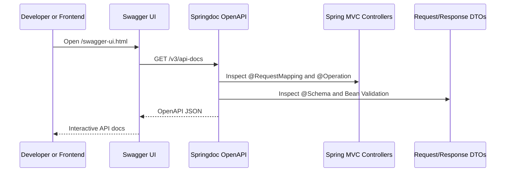

# OpenAPI/Swagger API 문서 가이드

> Status: Implemented
> Last updated: 2026-06-26

## Goal

이 문서는 ZIP:ON 백엔드의 Swagger/OpenAPI 문서가 어디에 구현되어 있고, 프론트 개발자가 어떻게 확인하며, 새 API를 추가할 때 무엇을 함께 갱신해야 하는지 설명한다.

Swagger는 별도 수기 문서가 아니라 실행 중인 Spring MVC controller, DTO, validation annotation, OpenAPI annotation에서 생성되는 API 계약이다.

## Current Implementation

| 항목 | 현재 값 |
| --- | --- |
| 라이브러리 | `org.springdoc:springdoc-openapi-starter-webmvc-ui:3.0.3` |
| 설정 클래스 | `backend/src/main/java/com/zipon/config/OpenApiConfig.java` |
| Swagger UI | `http://localhost:8082/swagger-ui.html` |
| OpenAPI JSON | `http://localhost:8082/v3/api-docs` |
| Public group | `public-api` |
| Authenticated group | `authenticated-api` |
| Admin group | `admin-api` |
| 보안 스킴 | `bearerAuth` HTTP Bearer JWT |
| 끄는 환경변수 | `ZIPON_OPENAPI_ENABLED=false`, `ZIPON_SWAGGER_UI_ENABLED=false` |

`SecurityConfig`는 다음 문서 경로를 인증 없이 열어둔다.

```text
/v3/api-docs/**
/swagger-ui/**
/swagger-ui.html
```

운영 환경에서 Swagger를 노출하지 않으려면 배포 환경변수로 `ZIPON_OPENAPI_ENABLED=false`, `ZIPON_SWAGGER_UI_ENABLED=false`를 설정한다.

OpenAPI group은 `OpenApiConfig`에서 다음 기준으로 나뉜다.

```text
public-api:
  health, auth, Juso address search, diagnosis purposes, regional indicator analysis,
  public risk-diagnosis creation/candidate lookup, property/region/search/environment/map/community read surfaces

authenticated-api:
  users, favorites, my rent-risk diagnosis history/registry confirmation,
  map field-checks, authenticated community operations, DB notifications

admin-api:
  /api/admin/** 전체 운영 API
```

## Request Flow



## What Was Documented

모든 현재 backend controller endpoint에 `@Operation` 설명을 추가했다.

| 영역 | 대표 controller | 문서화 기준 |
| --- | --- | --- |
| Health | `HealthController` | 서버 연결 확인 목적 |
| Auth/User | `AuthController`, `UserController` | access token, refresh cookie, 401/403 흐름 |
| Rent risk diagnosis | `RentRiskDiagnosisController` | MVP 위험진단 목적, 금액 단위, 확정 사실 금지 |
| Regional indicator analysis | `RegionalIndicatorAnalysisController` | 지역·유형 입력을 현재 매물이 아닌 과거 지표 분석으로 해석 |
| Region/Search/Property/Map/Environment | 각 controller | 현재 구현 경계와 legacy/보조 API 한계 명시 |
| Juso address search | `JusoAddressSearchController`, `JusoAddressPopupController` | 주소 후보 조회, 팝업 callback, 공개 endpoint 보안 경계 |
| Favorite | `FavoriteController` | 인증 필요, 저장 검토 항목과 사용자별 분석 리포트 경계 |
| Community | `CommunityController` | public 읽기와 authenticated 쓰기 분리 |
| Notifications | `NotificationController` | 로그인 사용자 DB 알림 조회 |
| Admin | `AdminUserController`, `CommunityAdminController`, `AdminActionAuditLogController`, `AdminExternalApiCallLogController`, `AdminExternalApiHealthController`, `AdminExternalDataStatusController`, `AdminVolatileStateAlertController`, `AdminRentRiskDiagnosisHistoryController` | `ROLE_ADMIN`과 운영 authority 전용 관리 API |

주요 request/response DTO에는 `@Schema` 설명과 예시를 추가했다. 특히 `RentRiskDiagnosisRequest`와 `RentRiskDiagnosisResponse`는 ZIP:ON의 제품 원칙에 맞게 다음을 명시한다.

- 금액 단위는 만원이다.
- 사용자가 입력한 `knownPropertyType`은 확정된 공적 사실이 아니다.
- 사용자가 입력한 `listingDescription`은 광고 문구와 현장 설명 단서이며, 공부상 확인 전의 참고 입력이다.
- 건축물대장, 실거래가, 공시가격, 등기 확인 상태는 데이터 상태 문장으로 표현한다.
- ZIP:ON은 사전 진단 보조 서비스이며 법률/감정/중개 판단을 확정하지 않는다.

## Frontend Usage

백엔드만 실행 중이면 다음 주소를 직접 연다.

```text
http://localhost:8082/swagger-ui.html
```

프론트 Vite dev server를 통해서도 Swagger 경로를 프록시한다.

```text
http://localhost:5173/swagger-ui.html
http://localhost:5173/v3/api-docs
```

프론트 API 함수와 화면 연결 상태는 여전히 [API 명세와 프론트엔드 연결 현황](/docs/api/API_FRONTEND_CONNECTION_SPEC.md)을 기준으로 본다. Swagger는 endpoint/request/response 계약을 확인하는 도구이고, 그 문서는 실제 Vue 화면 연결 여부와 학습 해설을 추적한다.

## Add a New API

새 backend API를 추가할 때는 다음 순서로 갱신한다.

1. Controller method에 `@Operation(summary, description)`을 추가한다.
2. 인증이 필요한 API에는 `security = @SecurityRequirement(name = OpenApiConfig.BEARER_AUTH)`를 추가한다.
3. path/query parameter에는 `@Parameter(description, example)`을 추가한다.
4. request/response DTO record component에는 `@Schema(description, example)`을 추가한다.
5. 호환 endpoint, legacy endpoint, 빈 응답 계약, 프론트 미연결, deprecated 경계가 있으면 Swagger 설명에 그 상태를 명시한다.
6. `OpenApiDocumentationIntegrationTest`에 새 path가 포함되는지 확인한다.
7. 프론트 API 함수가 생기면 `/docs/api/API_FRONTEND_CONNECTION_SPEC.md`도 갱신한다.

## Tests

OpenAPI 문서 노출은 다음 테스트가 확인한다.

```text
backend/src/test/java/com/zipon/OpenApiDocumentationIntegrationTest.java
```

검증 내용:

- `GET /v3/api-docs`가 200을 반환한다.
- `bearerAuth` security scheme이 포함된다.
- Juso 주소 검색, 위험진단, 지역·유형 분석, 지도 진단 보조, 커뮤니티, 관리자 운영, 알림 등 현재 controller path가 OpenAPI JSON에 포함된다.
- `GET /swagger-ui.html`이 공개 접근 가능하다.

실행 명령:

```bash
cd backend
./mvnw -Dtest=OpenApiDocumentationIntegrationTest test
```

전체 백엔드 확인:

```bash
cd backend
./mvnw test
```

## Debugging Checklist

```text
/swagger-ui.html 이 401이면 SecurityConfig의 swagger permitAll matcher를 확인한다.
/v3/api-docs 가 404이면 springdoc dependency와 springdoc.api-docs.enabled 값을 확인한다.
Swagger UI는 열리지만 endpoint 설명이 빈약하면 controller의 @Operation을 확인한다.
request/response field 설명이 빈약하면 DTO의 @Schema를 확인한다.
Bearer Authorize 버튼이 없으면 OpenApiConfig의 bearerAuth SecurityScheme을 확인한다.
프론트 dev server에서 /swagger-ui.html 이 안 열리면 frontend/vite.config.js proxy를 확인한다.
운영에서 Swagger가 열리면 ZIPON_OPENAPI_ENABLED와 ZIPON_SWAGGER_UI_ENABLED 값을 확인한다.
```

## Decision: Springdoc OpenAPI를 사용한다

### Context

ZIP:ON은 Spring Boot 4 기반이고 모든 backend API의 최신 계약을 프론트와 학습 문서가 함께 볼 수 있어야 한다.

### Options Considered

1. README나 Markdown 표로만 API를 관리한다.
2. Postman collection을 수동 관리한다.
3. Springdoc OpenAPI로 controller/DTO 기반 문서를 생성한다.

### Decision

`springdoc-openapi-starter-webmvc-ui`를 사용한다.

### Why

Spring MVC controller, Bean Validation, `@Schema`, `@Operation`에서 API 계약을 생성하므로 코드와 문서가 함께 움직인다. Swagger UI에서 Bearer token도 바로 테스트할 수 있어 프론트 개발과 학습에 모두 유리하다.

### Tradeoffs

Swagger annotation이 controller/DTO에 늘어난다. 대신 endpoint 설명이 코드 가까이에 남아 새 API를 추가할 때 누락을 빨리 발견할 수 있다.

### Future Revisit

운영 배포가 생기면 Swagger UI는 기본적으로 비활성화하고 내부망 또는 인증된 운영 도구에서만 접근하게 재검토한다.

## Related Documents

- Parent overview: [CODEX reference index](../README.md)
- Docs index: [docs README](/README.md)
- API/frontend connection: [API 명세와 프론트엔드 연결 현황](/docs/api/API_FRONTEND_CONNECTION_SPEC.md)
- API function map: [ZIP:ON API와 함수 학습 지도](/docs/api/API_FUNCTION_MAP.md)
- Security: [Spring Security JWT 인증 흐름](/docs/architecture/security/SECURITY_AUTHENTICATION.md)
- MVP analysis/diagnosis: [과거 지표 기반 부동산 분석 MVP 범위](/docs/product/MVP_SCOPE.md)

## Learning Path

1. First read: `backend/src/main/java/com/zipon/config/OpenApiConfig.java`
2. Then inspect: `backend/src/main/java/com/zipon/config/SecurityConfig.java`
3. Then inspect: `backend/src/main/java/com/zipon/controller/RentRiskDiagnosisController.java`
4. Then inspect: `backend/src/main/java/com/zipon/dto/request/RentRiskDiagnosisRequest.java`
5. Then run: `OpenApiDocumentationIntegrationTest`
6. Then open: `http://localhost:8082/swagger-ui.html`
7. Key concept to understand: OpenAPI 문서는 별도 산출물이 아니라 Spring MVC endpoint와 DTO metadata에서 생성되는 실행 가능한 API 계약이다.
