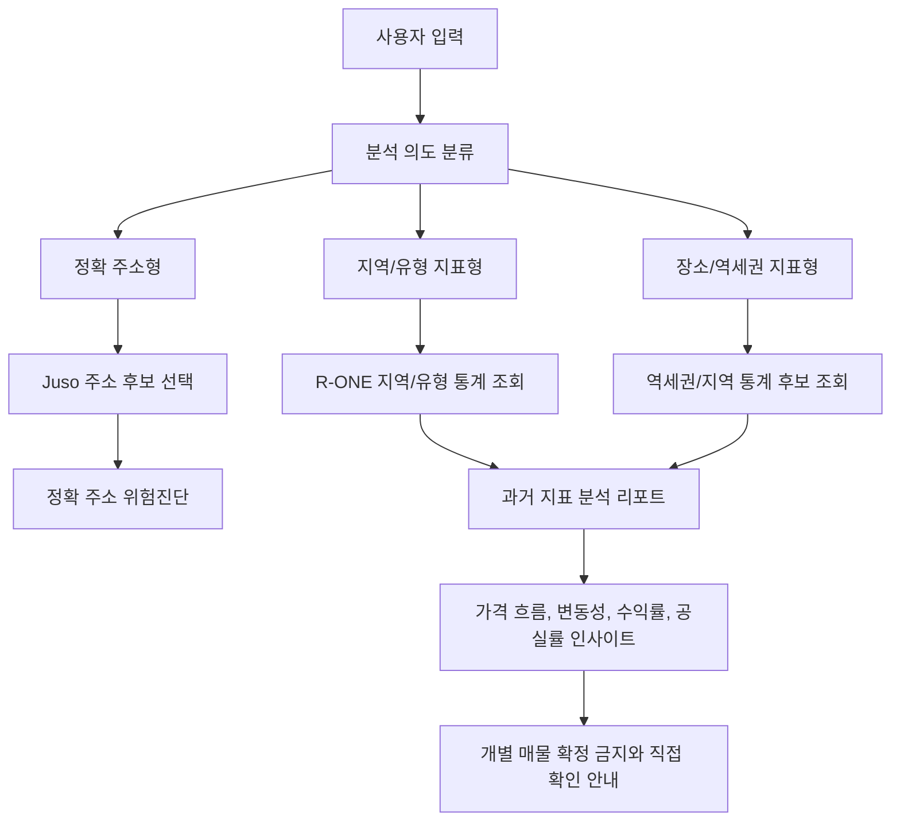

# 한국부동산원 R-ONE 부동산통계 OpenAPI 명세

> Status: Provided XLS analyzed
> Provider: 한국부동산원
> Base URL: `https://www.reb.or.kr/r-one/openapi`
> Source files:
> - `서비스 통계목록_오픈API명세서.xls`
> - `통계 세부항목 목록_오픈API명세서.xls`
> - `통계 조회 조건 설정_오픈API명세서.xls`
> - `OpenAPI_통계코드.xls`

이 문서는 사용자가 제공한 한국부동산원 R-ONE 통계 OpenAPI XLS 자료를 ZIP:ON 외부 API 문서 체계로 변환한 것이다. 제공된 인증키 원문은 저장소에 기록하지 않는다. 실제 값은 local `.env` 또는 배포 secret의 `KAB_R_ONE_API_KEY`로만 둔다.

## ZIP:ON 활용 결론

이 API는 현재 매물 목록을 내려주는 API가 아니라 부동산 시장 통계를 조회하는 API다.

따라서 ZIP:ON은 이 API를 붙이면서도 현재 시장에 나온 매물을 보여주지 않는다. `강남 원룸`, `서울대입구역 근처`, `신림동 월세` 같은 입력은 "현재 매물 목록" 요청으로 처리하지 않고, 해당 지역/유형의 과거 가격·전세·월세·수익률·공실률 지표를 분석하는 요청으로 좁힌다.

R-ONE 통계 API는 아래 역할에 적합하다.

- 지역/유형별 매매가격지수, 전세가격지수, 월세가격지수 제공
- 오피스텔 가격, 전월세전환율, 수익률 같은 시장 맥락 제공
- 상가 임대가격지수, 공실률, 임대료 추이 제공
- 지역/유형별 과거 지표 분석 리포트 제공
- 위험진단 결과에서 "이 지역 가격 흐름은 참고 정보이며 개별 매물 안전성을 확정하지 않는다"는 보조 근거 제공
- 관리자/운영 지표에서 지역별 데이터 부족 또는 통계 기반 설명 품질 확인

## Endpoint Summary

| 기능 | Endpoint | Method | 설명 |
| --- | --- | --- | --- |
| 서비스 통계목록 | `/SttsApiTbl.do` | `GET` | 통계표 목록과 통계표 코드 조회 |
| 통계 세부항목 목록 | `/SttsApiTblItm.do` | `GET` | 특정 통계표의 그룹/분류/항목 코드 조회 |
| 통계자료 조회 | `/SttsApiTblData.do` | `GET` | 통계표, 주기, 그룹/분류/항목, 기간 조건으로 통계값 조회 |

모든 endpoint는 `https://www.reb.or.kr/r-one/openapi`에 path를 붙여 호출한다.

공식 개발가이드의 JavaScript/JSP/PHP 예시는 `https://www.reb.or.kr/r-one/openapi/SttsApiTblData.do?...&Type=json` 형식을 사용한다. ZIP:ON 구현도 `KabROneStatisticsApiClient`에서 `.do` path와 `KEY`, `Type`, `pIndex`, `pSize` 파라미터명을 그대로 사용한다.

## Common Request Parameters

| 파라미터 | 필수 | 설명 | 예시/값 |
| --- | --- | --- | --- |
| `KEY` | Y | 한국부동산원 R-ONE OpenAPI 인증키 | local secret only |
| `Type` | Y | 응답 형식. 기본값은 `xml`이며 `json` 가능 | `json` |
| `pIndex` | Y | 페이지 번호 | `1` |
| `pSize` | Y | 페이지 크기. 1회 최대 1,000건 제한 | `100` |

주의:

- 공식 개발가이드 예시 기준 인증키 파라미터명은 `KEY`다. `ServiceKey`, `serviceKey`, `key`로 바꾸지 않는다.
- 1회 요청은 1,000건을 넘길 수 없다. 전체 수집이 필요하면 `pIndex`를 증가시키며 paging한다.
- 통계표 코드, 항목 코드, 지역/분류 코드는 숫자처럼 보여도 문자열로 취급한다.

## 1. 서비스 통계목록

### Request

```text
GET https://www.reb.or.kr/r-one/openapi/SttsApiTbl.do
```

| 파라미터 | 필수 | 설명 |
| --- | --- | --- |
| `STATBL_ID` | N | 통계표 코드. 없으면 목록 조회 |

### Response Fields

| 필드 | 의미 | ZIP:ON 후보 |
| --- | --- | --- |
| `STATBL_ID` | 통계표 코드 | `statisticalTableId` |
| `STATBL_NM` | 통계표명 | `statisticalTableName` |
| `DTACYCLE_CD` | 자료주기 코드 | `dataCycleCode` |
| `DTACYCLE_NM` | 자료주기명 | `dataCycleName` |
| `STAT_ID` | 통계 ID | `statisticId` |
| `TOP_ORG_NM` | 최상위 기관명 | provider metadata |
| `OPEN_STATE` | 공개 상태 | `openState` |
| `DATA_START_YY` | 자료 시작 연도 | `dataStartYear` |
| `DATA_END_YY` | 자료 종료 연도 | `dataEndYear` |
| `STATBL_IDTFR` | 통계표 식별자 | source identifier |
| `STATBL_CMMT` | 통계표 설명 | source comment |
| `V_ORDER` | 표시 순서 | source order |
| `RPSTUI_NM` | 대표 단위명 | source unit name |

## 2. 통계 세부항목 목록

### Request

```text
GET https://www.reb.or.kr/r-one/openapi/SttsApiTblItm.do
```

| 파라미터 | 필수 | 설명 |
| --- | --- | --- |
| `STATBL_ID` | Y | 통계표 코드 |
| `ITM_TAG` | N | 항목 구분 태그. 원문 값은 통계표별 확인 필요 |

### Response Fields

| 필드 | 의미 | ZIP:ON 후보 |
| --- | --- | --- |
| `STATBL_ID` | 통계표 코드 | `statisticalTableId` |
| `ITM_TAG` | 항목 태그 | `itemTag` |
| `ITM_ID` | 항목 ID | `itemId` |
| `PAR_ITM_ID` | 상위 항목 ID | `parentItemId` |
| `ITM_NM` | 항목명 | `itemName` |
| `ITM_FULLNM` | 항목 전체명 | `itemFullName` |
| `UI_NM` | 단위명 | `unitName` |
| `ITM_CMMT_IDTFR` | 항목 설명 식별자 | source comment id |
| `ITM_CMMT_CONT` | 항목 설명 | source comment |
| `V_ORDER` | 표시 순서 | source order |

세부항목은 R-ONE 통계자료 조회의 `GRP_ID`, `CLS_ID`, `ITM_ID` 후보를 찾는 선행 단계다. 통계표마다 그룹/분류/항목의 의미가 다르므로 한 통계표에서 확인한 코드를 다른 통계표에 재사용하지 않는다.

## 3. 통계자료 조회

### Request

```text
GET https://www.reb.or.kr/r-one/openapi/SttsApiTblData.do
```

| 파라미터 | 필수 | 설명 |
| --- | --- | --- |
| `STATBL_ID` | Y | 통계표 코드 |
| `DTACYCLE_CD` | Y | 자료주기 코드 |
| `WRTTIME_IDTFR_ID` | N | 작성시점 식별자 |
| `GRP_ID` | N | 그룹 ID |
| `CLS_ID` | N | 분류 ID |
| `ITM_ID` | N | 항목 ID |
| `START_WRTTIME` | N | 조회 시작 시점 |
| `END_WRTTIME` | N | 조회 종료 시점 |

### Response Fields

| 필드 | 의미 | ZIP:ON 후보 |
| --- | --- | --- |
| `STATBL_ID` | 통계표 코드 | `statisticalTableId` |
| `DTACYCLE_CD` | 자료주기 코드 | `dataCycleCode` |
| `WRTTIME_IDTFR_ID` | 작성시점 식별자 | `writtenTimeIdentifierId` |
| `GRP_ID` | 그룹 ID | `groupId` |
| `GRP_NM` | 그룹명 | `groupName` |
| `CLS_ID` | 분류 ID | `classId` |
| `CLS_NM` | 분류명 | `className` |
| `ITM_ID` | 항목 ID | `itemId` |
| `ITM_NM` | 항목명 | `itemName` |
| `DTA_VAL` | 통계값 | `dataValue` |
| `UI_NM` | 단위명 | `unitName` |
| `GRP_FULLNM` | 그룹 전체명 | `groupFullName` |
| `CLS_FULLNM` | 분류 전체명 | `classFullName` |
| `ITM_FULLNM` | 항목 전체명 | `itemFullName` |
| `WRTTIME_DESC` | 작성시점 설명 | `writtenTimeDescription` |

`DTA_VAL`은 통계표마다 단위가 다르다. `UI_NM`, `RPSTUI_NM`, 통계표 설명을 함께 확인한 뒤 내부 단위를 정한다.

## Message Codes

| 코드 | 원문 의미 | ZIP:ON 처리 후보 |
| --- | --- | --- |
| `INFO 000` | 정상 처리 | `SUCCESS` |
| `INFO 200` | 해당하는 데이터가 없음 | `EMPTY` |
| `INFO 300` | 관리자에 의해 key 사용 제한 | `UNAVAILABLE` |
| `ERROR 290` | 인증키가 유효하지 않음 | `UNAVAILABLE` |
| `ERROR 300` | 필수 값 누락 | 개발/요청 조립 오류 |
| `ERROR 310` | 해당 서비스가 없거나 요청이 잘못됨 | 개발/endpoint 오류 |
| `ERROR 333` | `pIndex` 타입 오류 | 개발/요청 조립 오류 |
| `ERROR 336` | 1회 요청 row 수 1,000건 초과 | 요청 크기 조정 |
| `ERROR 337` | 일일 traffic 초과 | rate limit, 운영 확인 |
| `ERROR 500` | 서버 오류 | retryable external error |
| `ERROR 600` | DB connection 오류 | provider 장애 |
| `ERROR 601` | SQL 오류 | provider 장애 |

## 통계표 코드 분석 결과

`OpenAPI_통계코드.xls`는 실제 Excel workbook이 아니라 HTML table 형식의 문서였고, 634개 통계표 코드가 포함되어 있었다. 키워드 기준으로 확인한 결과는 아래와 같다.

| 키워드 | 매칭 수 | 해석 |
| --- | ---: | --- |
| `매매` | 111 | 매매가격지수, 평균매매가격, 거래 관련 통계가 풍부함 |
| `전세` | 78 | 전세가격지수, 평균전세가격, 전세수급 등 보조 가능 |
| `월세` | 73 | 월세가격지수, 월세가격, 전월세전환율 보조 가능 |
| `임대` | 211 | 상가/오피스/임대동향 분석에 유용 |
| `가격` | 196 | 가격지수와 평균가격 중심 |
| `지수` | 143 | 지역/유형별 흐름 설명에 적합 |
| `역세권` | 2 | 역세권 지가지수는 있으나 개별 역 주변 매물 API는 아님 |
| `원룸` | 0 | 원룸 현재 매물 검색 원천으로 사용할 수 없음. 원룸은 공부상 유형이 아니므로 오피스텔, 연립/다세대, 단독/다가구 등으로 해석 필요 |
| `오피스텔` | 35 | 오피스텔 가격지수, 가격, 수익률, 전월세전환율 후보 |
| `아파트` | 78 | 아파트 가격지수, 평균가격, 수급 동향 후보 |
| `연립/다세대` | 46 | 빌라/다세대 가격 흐름 보조 후보 |
| `상가` | 159 | 상가 임대가격지수, 공실률, 임대료 후보 |

## 대표 통계표 코드 후보

아래 코드는 제공된 통계코드 파일에서 확인한 후보이며, 실제 구현 전 `SttsApiTblItm`으로 세부항목과 지역/분류 코드를 다시 조회해야 한다.

| 목적 | 통계표명 | `STATBL_ID` |
| --- | --- | --- |
| 지하철 역세권 지가 흐름 | `지하철 역세권 지가지수` | `A_2024_00010` |
| 고속철도 역세권 지가 흐름 | `고속철도 역세권 지가지수` | `A_2024_00009` |
| 오피스텔 매매가격지수 | `(월) 오피스텔 매매가격지수(시계열)` | `A_2024_00615` |
| 오피스텔 전세가격지수 | `(월) 오피스텔 전세가격지수(시계열)` | `A_2024_00618` |
| 오피스텔 월세가격지수 | `(월) 오피스텔 월세가격지수(시계열)` | `A_2024_00621` |
| 오피스텔 매매가격 | `(월) 오피스텔 매매가격(2024년1월~)` | `T241773133446051` |
| 오피스텔 전세가격 | `(월) 오피스텔 전세가격(2024년1월~)` | `T247903133465270` |
| 오피스텔 월세가격 | `(월) 오피스텔 월세가격(2024년1월~)` | `T248193133484912` |
| 오피스텔 전월세전환율 | `(월) 오피스텔 전월세전환율(2024년1월~)` | `T241163133546529` |
| 오피스텔 수익률 | `(월) 오피스텔 수익률(2024년1월~)` | `T245503133561624` |
| 아파트 매매가격지수 | `(월) 매매가격지수_아파트` | `A_2024_00045` |
| 아파트 전세가격지수 | `(월) 전세가격지수_아파트` | `A_2024_00050` |
| 아파트 월세가격지수 | `(월) 월세가격지수_아파트` | `A_2024_00055` |
| 아파트 평균매매가격 | `(월) 평균매매가격_아파트` | `A_2024_00060` |
| 아파트 평균전세가격 | `(월) 평균전세가격_아파트` | `A_2024_00064` |
| 아파트 평균월세가격 | `(월) 평균월세가격_아파트` | `A_2024_00069` |
| 연립/다세대 매매가격지수 | `(월) 매매가격지수_연립/다세대` | `A_2024_00080` |
| 연립/다세대 전세가격지수 | `(월) 전세가격지수_연립/다세대` | `A_2024_00085` |
| 연립/다세대 월세가격지수 | `(월) 월세가격지수_연립/다세대` | `A_2024_00090` |
| 중대형 상가 임대가격지수 | `임대동향 지역별 임대가격지수(2024년3분기~)_중대형 상가` | `T249863134832916` |
| 일반 상가 공실률 | `임대동향 지역별 공실률(2024년3분기~)_일반 상가` | `T262303140824764` |

## 과거 지표 분석에서의 사용 방식



예시:

| 사용자 입력 | 주 동작 | R-ONE API 역할 |
| --- | --- | --- |
| `신림동 1422` | 정확 주소 후보 선택 후 개별 위험진단 | 통계 API 호출 전 주소 확정과 물건 정체 판별이 우선 |
| `강남 원룸` | 현재 매물 목록 대신 지역/유형 과거 지표 분석 | 강남구 또는 하위 지역의 오피스텔/연립다세대/전월세 지표 요약 |
| `서울대입구역 근처` | 현재 주변 매물 대신 역세권/지역 지표 분석 | 역세권 지가지수는 보조 정보. 개별 역 주변 현재 매물 목록 아님 |
| `상가 월세` | 현재 상가 매물 대신 상가 임대시장 지표 분석 | 상가 임대가격지수, 공실률, 임대료 추이 보조 |

## Decision: 현재 매물 목록은 제공하지 않는다

### Context

사용자가 `강남 원룸`처럼 입력하면 일반 부동산 앱에서는 현재 매물 목록을 기대할 수 있다. 그러나 제공된 한국부동산원 R-ONE API는 현재 매물 feed가 아니라 과거 통계와 지표를 제공한다. ZIP:ON의 차별점도 매물 노출량이 아니라 과거 지표를 해석해 계약 전 판단 근거를 만드는 데 있다.

### Options considered

1. 현재 매물 DB나 제휴/수집 inventory를 별도로 구축한다.
2. R-ONE 통계 API를 현재 매물 검색처럼 포장한다.
3. 현재 매물 표시는 포기하고, 과거 지표 분석과 정확 주소 위험진단으로 제품 범위를 좁힌다.

### Decision

3번을 선택한다. ZIP:ON은 현재 매물을 보여주지 않는다. 지역/유형/역세권 입력은 과거 지표 분석으로, 정확 주소 입력은 주소 후보 선택 후 위험진단으로 보낸다.

### Why

현재 매물 재고를 만들면 제품이 부동산 매물 플랫폼으로 커지고, 데이터 확보·정합성·법적 리스크·운영 비용이 급격히 증가한다. 반면 R-ONE API와 기존 실거래가/공시가격/건축물대장 API를 조합하면 ZIP:ON다운 강점인 "과거 지표를 자세하고 통찰력 있게 해석하는 서비스"를 만들 수 있다.

### Tradeoffs

사용자는 ZIP:ON 안에서 바로 방을 고를 수 없다. 대신 사용자가 다른 서비스에서 본 매물 주소나 지역 조건을 가져오면, ZIP:ON은 과거 가격 흐름, 전월세 지표, 오피스텔 수익률, 상가 공실률, 개별 주소 위험진단을 더 깊게 설명한다.

### Future revisit

현재 매물 제공은 별도 제품 결정이 있기 전까지 금지한다. 나중에 다시 검토하더라도 R-ONE 통계 API를 현재 매물 API처럼 사용하지 않는다.

## 저장/캐시 방향

| 데이터 | 추천 처리 | 이유 |
| --- | --- | --- |
| 통계표 목록 `SttsApiTbl` | DB `kab_r_one_statistical_tables` | 코드표 성격이며 변경 빈도가 낮음 |
| 통계 세부항목 `SttsApiTblItm` | DB `kab_r_one_statistical_items` | 통계자료 조회 전 코드 탐색에 반복 사용 |
| 통계자료 `SttsApiTblData` | DB `kab_r_one_statistical_data_points` | 검색 결과와 진단에서 반복 사용 가능 |
| 원문 응답 전문 | 기본 미저장, 필요 시 redaction 후 object storage 후보 | DB에 무제한 누적할 성격은 아님 |
| 인증키 `KEY` | 저장 금지 | secret은 `.env`/배포 secret에만 |

## 구현 전 확인사항

- `SttsApiTblData`의 JSON 응답 wrapper 구조와 paging total field는 실제 호출 fixture로 확인한다.
- `DTACYCLE_CD`의 코드값 의미는 `SttsApiTbl` 결과와 통계코드 자료를 함께 확인한다.
- 지역 분류가 `GRP_ID`인지 `CLS_ID`인지, 통계표별로 `SttsApiTblItm` 결과를 보고 결정한다.
- `DTA_VAL`의 단위는 `UI_NM`, `RPSTUI_NM`, 통계표 설명으로 검증한다.
- R-ONE 통계는 지역 평균/지수이므로 개별 매물의 안전성 또는 수익성을 확정하는 문장으로 쓰지 않는다.

## Learning path

1. First read: 이 문서의 `ZIP:ON 활용 결론`
2. Then inspect: `Endpoint Summary`, `대표 통계표 코드 후보`
3. Then design: 현재 매물 표시를 제외하고 R-ONE 통계를 과거 지표 분석 리포트로 설계한다.
4. Then inspect code: `KabROneProperties`, `KabROneStatisticsApiClient`, `KabROneApiResponseParser`, `KabROneSyncService`, `KabROneStatisticsMapper`
5. Then test: key 미설정, `INFO 200`, `ERROR 290`, `ERROR 336`, 단건/배열 응답을 fixture로 고정한다.
6. Key concept to understand: 시장 통계 API는 현재 매물 API가 아니며, ZIP:ON에서는 과거 지표 해석과 위험진단 근거로만 사용한다.
