# ZIP:ON 백엔드 구조 기준

> Status: Implemented + Guidance

## 목적

이 문서는 ZIP:ON 백엔드 코드를 처음 읽는 개발자가 Controller, Service, Mapper, Domain, DTO, external client의 책임을 구분하도록 돕는 구조 기준이다.

현재 프로젝트는 거대한 DDD 패키지로 강제 분리하지 않는다. 실제 코드가 이미 사용하는 단순하고 학습하기 쉬운 계층 구조를 유지하되, 전세·월세 위험진단 MVP가 커져도 역할이 섞이지 않도록 아래 책임선을 지킨다.

## 현재 패키지 구조

```text
backend/src/main/java/com/zipon/
├── audit/       관리자/운영 행동 감사 AOP, request context, payload sanitizing
├── common/      ApiResponse 같은 공통 응답
├── config/      Security, Web, OpenAPI, 외부 API configuration
├── controller/  HTTP endpoint 경계
├── domain/      DB 조회 결과와 진단 계산에 쓰는 plain Java model
├── dto/         request/response DTO
├── exception/   공통 예외와 error response
├── external/    data.go.kr, VWorld, Juso, R-ONE 외부 API client와 parser
├── mapper/      MyBatis mapper
├── risk/        backend-only 구조화 위험도 산정, OpenAI scoring adapter, fallback
├── security/    Spring Security/JWT adapter
├── service/     use case, transaction, 위험진단 orchestration
└── web/         request correlation ID filter와 HTTP request context 보조
```

| 역할 | 현재 패키지 | 책임 |
| --- | --- | --- |
| presentation | `controller`, `dto.request`, `dto.response` | HTTP 요청/응답, validation 경계, 응답 DTO |
| application | `service` | use case 흐름, transaction, 외부 API/mapper 조합, 진단 결과 구성 |
| domain | `domain`, `risk` | 물건 유형, 진단 결과, 위험도 계산 값, 구조화 위험 산정 model, DB row model |
| infrastructure | `external`, `mapper` | 공공데이터 API 호출, 응답 parsing, MyBatis SQL |
| operation/security | `audit`, `security`, `web` | 운영 감사, JWT/security adapter, request correlation |
| common | `common`, `exception` | 공통 응답과 예외 처리 |
| config | `config` | Spring bean, 외부 설정, OpenAPI/Web configuration |

## MVP 위험진단 흐름

```mermaid
flowchart TD
    A["RentRiskDiagnosisController<br/>POST /api/rent-risk-diagnoses"] --> B["RentRiskDiagnosisService"]
    B --> C["LeaseRiskDiagnosisRequestValidator"]
    B --> D["LeaseRiskAddressNormalizer"]
    D --> E["LegalDongCodeCatalog"]
    D --> V["AddressResolution"]
    B --> F["LeaseRiskBuildingRegisterLookupService"]
    F --> Y["BuildingRegisterTitleSnapshotStore"]
    Y --> Z["BuildingRegisterTitleSnapshotMapper"]
    F --> G["BuildingRegisterApiClient"]
    B --> W["PropertyIdentityCandidateService"]
    W --> X["PropertyIdentityCandidateMapper"]
    B --> H["LeaseRiskDiagnosisPropertyIdentityService"]
    B --> I["LeaseRiskExternalDataLookupService"]
    I --> P["RealEstateTransactionFactStore"]
    I --> S["ExternalDataCollectionService"]
    I --> T["MarketStatisticsMonthlyService"]
    S --> AC["ExternalDataRefreshTargetMapper"]
    AD["ExternalDataWeeklyRefreshScheduler"] --> AF["ExternalDataLatestTargetMaterializer"]
    AF --> AG["ExternalDataTransactionMonthTargetRegistrationService"]
    AG --> AC
    AD --> AE["ExternalDataRefreshSchedulerService"]
    AE --> AC
    AE --> S
    AE --> P
    AE --> T
    AE --> J
    AE --> K
    P --> Q["RealEstateTransactionFactMapper"]
    P --> R["MarketStatisticsMonthlyMapper"]
    I --> J["RentTransactionApiClient"]
    I --> K["SaleTransactionApiClient"]
    I --> L["PublicPriceApiClient"]
    I --> AA["PublicPriceSnapshotStore"]
    AA --> AB["PublicPriceSnapshotMapper"]
    B --> M["DepositRiskCalculator"]
    B --> N["BuildingRiskAnalyzer"]
    B --> O["Checklist / NextAction / RiskSummary services"]
    B --> U["RentRiskDiagnosisHistoryMapper"]
```



중요한 순서:

```text
1. 사용자 입력 정제
2. 주소·법정동코드·PNU 식별
3. 사용자 표현 기반 후보 유형 해석
4. 건축물대장 표제부 DB snapshot 우선 조회
5. fresh snapshot이 없으면 건축물대장 API fallback 호출
6. 표제부 snapshot을 `building_register_title_snapshots`에 저장
7. 물건 식별 후보를 `property_identity_candidates`에 저장
8. 물건 유형에 맞는 전월세/매매 실거래가 API 선택
9. 최근 3개월 DB 실거래가 fact 우선 조회
10. fact가 부족할 때만 외부 실거래가 API fallback 호출
11. fallback 대상 `source + LAWD_CD + DEAL_YMD`를 `external_data_refresh_targets`에 등록
12. fallback snapshot을 정규화 fact로 저장하고 월별 통계 갱신
13. `ExternalDataWeeklyRefreshScheduler`가 활성화된 경우 최신 완료월 `TRANSACTION_MONTH` target을 먼저 등록하고 due target을 주간 배치로 재수집
14. 공시가격 DB snapshot 우선 조회
15. fresh snapshot이 없으면 VWorld 공시가격 API fallback 호출
16. 보증금 위험도 1차 계산
17. 등기부등본/선순위 임차인처럼 자동 판단 불가 항목 분리
18. 계약 전 체크리스트 생성
19. 프론트엔드 분석 화면 응답 생성
```

물건 유형 판별 전에는 실거래가 API를 무작정 호출하지 않는다.

## 파일 책임 규칙

### Controller

Controller는 HTTP 경계만 담당한다. endpoint, request 수신, validation, Service 호출, response wrapping만 맡는다. SQL, 외부 API 호출, 위험도 계산, 권한 정책을 직접 처리하지 않는다.

### Service

Service는 use case와 transaction 경계다. mapper와 external client 호출 순서를 결정하고, domain model을 해석해 response DTO를 구성한다. 외부 API 호출을 긴 DB transaction 안에 넣지 않는다.

### Mapper

Mapper는 MyBatis 기반 DB 접근만 담당한다. business rule을 SQL에 숨기지 않고, JPA/Hibernate entity나 repository를 새로 추가하지 않는다.

### Domain

`domain`은 DB row와 진단 계산에 쓰는 plain Java object를 둔다. JPA entity가 아니다.

### External client

`external`은 공공데이터와 VWorld API 호출을 맡는다. service는 가능한 한 `LookupResult`, `Snapshot`, `Status` 같은 domain 결과로 판단한다.

## MVP Core와 Extension 경계

Core에 둔다:

- 주소 정제
- 법정동코드 변환
- 건축물대장 기반 물건 유형 판별
- 주변 전월세 실거래가 비교
- 주변 매매 실거래가 또는 공시가격 참고
- 보증금 위험도 1차 계산
- 위반건축물·용도·노후도 확인
- 등기부등본/선순위 임차인 직접 확인 안내
- 계약 전 체크리스트

Extension으로 둔다:

- 주거용 매매 사전진단
- 상가 창업 입지진단
- 임야·토지 개발 가능성 진단
- 꼬마빌딩 수익성·리스크 진단
- 생활·상권·환경·재난 분석 고도화
- OCR 기반 사용자 문서 분석

Extension은 삭제하지 않는다. 다만 실제 구현 slice가 시작되기 전에는 빈 controller, 빈 service, 빈 화면을 만들지 않는다.

## 코드 구조 점검 결과

- `controller`는 대부분 Service 위임과 response wrapping에 머무른다.
- 공공데이터 API별 client는 `external/buildingregister`, `external/transaction`, `external/publicprice`, `external/juso`, `external/legaldong`, `external/kabrone`, `external/geocoder`, `external/boundary`로 분리되어 있다. Kakao 지도 SDK와 geocoder/places 보조 사용은 현재 프론트엔드 코드가 맡고, backend에는 Kakao REST adapter가 없다.
- 전세·월세 위험진단은 `RentRiskDiagnosisService`가 orchestrator 역할을 하고, 주소, 물건 정체, 외부 데이터 조회, 위험 요약, 체크리스트가 별도 service로 나뉘어 있다.
- 주소 기반 API key 계산은 `AddressResolution`이 맡고, 건축물대장 표제부 DB-first snapshot은 `BuildingRegisterTitleSnapshotStore`와 `BuildingRegisterTitleSnapshotMapper`가 맡는다.
- 내부 물건 식별 후보 저장은 `PropertyIdentityCandidateService`와 `PropertyIdentityCandidateMapper`가 맡는다.
- 실거래가 DB-first 흐름은 `LeaseRiskExternalDataLookupService`가 조율하고, DB fact 조회·upsert는 `RealEstateTransactionFactStore`, 수집 이력은 `ExternalDataCollectionService`, 월별 통계는 `MarketStatisticsMonthlyService`가 맡는다.
- 실거래가 refresh target 등록과 주간 갱신은 `ExternalDataCollectionService`, `ExternalDataTransactionMonthTargetRegistrationService`, `ExternalDataLatestTargetMaterializer`, `ExternalDataRefreshTargetMapper`, `ExternalDataWeeklyRefreshScheduler`, `ExternalDataRefreshSchedulerService`가 맡는다. scheduler는 기본 비활성화이며 `TRANSACTION_MONTH` target만 처리한다. scheduler를 켜면 최신 완료월 target materialization 후 batch size만큼 due target을 수집한다.
- 공시가격 DB-first 흐름도 `LeaseRiskExternalDataLookupService`가 조율하고, snapshot 조회·upsert는 `PublicPriceSnapshotStore`와 `PublicPriceSnapshotMapper`가 맡는다. 공시가격은 보증금 위험도 보조 근거이며 현재 시세나 권리관계 확정값이 아니다.
- 구조화 위험 산정 이후의 항목별 근거 저장은 `RiskEvidenceSnapshotService`와 `RiskEvidenceSnapshotMapper`가 맡는다. `risk_evidence_snapshots`는 AI 감사 로그가 아니라 해당 진단 시점의 evidence, missingData, limitation, user action을 조회 가능하게 남기는 DB snapshot이다.
- 지도 진단 context와 현장 확인 기록은 `MapController`, `MapService`, `MapFieldCheckService`, `MapFieldCheckRecordMapper`가 맡는다. `map_field_check_records`는 사용자가 직접 확인한 항목과 memo를 저장할 뿐, 권리관계나 물리적 하자를 ZIP:ON이 확정했다는 뜻이 아니다.
- 운영 감사는 `@AdminAudit`, `AdminAuditAspect`, `OperationLoggingAspect`, `AdminActionAuditLogMapper`가 맡는다. `web/RequestCorrelationFilter`가 request ID를 만들고 MDC에 넣어 감사 로그와 HTTP request를 추적할 수 있게 한다.
- 현재 구조는 사용자가 요청한 단순 계층 구조 `controller/service/mapper/dto/domain/client/config/common`에 가깝다. 기존 코드에서는 `client` 대신 `external`이라는 더 명확한 이름을 사용한다.
- 추가 패키지 리네이밍은 이번 작업에서 하지 않았다. 기능 동작을 바꾸지 않는 것이 우선이고, 현 구조가 이미 역할을 비교적 잘 드러내기 때문이다.

## Related documents

- [제품 개요](/docs/product/PRODUCT_OVERVIEW.md)
- [MVP 범위](/docs/product/MVP_SCOPE.md)
- [MVP API 호출 흐름](/docs/api/API_CALL_FLOW.md)
- [공공데이터 API 전략](/docs/api/PUBLIC_API_STRATEGY.md)
- [위험도 산정 정책](/docs/architecture/RISK_SCORING_POLICY.md)

## Learning path

1. First read: `RentRiskDiagnosisController`.
2. Then inspect: `RentRiskDiagnosisService`.
3. Then inspect: `LeaseRiskAddressNormalizer`, `AddressResolution`, `LeaseRiskBuildingRegisterLookupService`, `BuildingRegisterTitleSnapshotStore`, `PropertyIdentityCandidateService`, `LeaseRiskDiagnosisPropertyIdentityService`, `LeaseRiskExternalDataLookupService`, `RiskEvidenceSnapshotService`.
4. Then inspect DB-first services: `BuildingRegisterTitleSnapshotStore`, `RealEstateTransactionFactStore`, `ExternalDataCollectionService`, `ExternalDataTransactionMonthTargetRegistrationService`, `ExternalDataLatestTargetMaterializer`, `ExternalDataRefreshSchedulerService`, `MarketStatisticsMonthlyService`, `PublicPriceSnapshotStore`.
5. Then inspect persistence: `RentRiskDiagnosisHistoryMapper`, `ExternalApiCallLogMapper`, `BuildingRegisterTitleSnapshotMapper`, `PropertyIdentityCandidateMapper`, `ExternalDataRefreshTargetMapper`, `RealEstateTransactionFactMapper`, `MarketStatisticsMonthlyMapper`, `PublicPriceSnapshotMapper`, `RiskEvidenceSnapshotMapper`.
6. Then run: `cd backend && ./mvnw -Dtest=RentRiskDiagnosisIntegrationTest,LeaseRiskAddressNormalizerTest,BuildingRegisterTitleSnapshotStoreTest,PropertyIdentityCandidateServiceTest,LeaseRiskExternalDataLookupServiceTest,ExternalDataRefreshSchedulerServiceTest,RealEstateTransactionFactStoreTest,MarketStatisticsMonthlyServiceTest,PublicPriceSnapshotStoreTest,RiskEvidenceSnapshotServiceTest test`.
7. Key concept to understand: Spring MVC의 Controller는 입구이고, Service는 use case 경계이며, MyBatis Mapper는 persistence adapter다.
