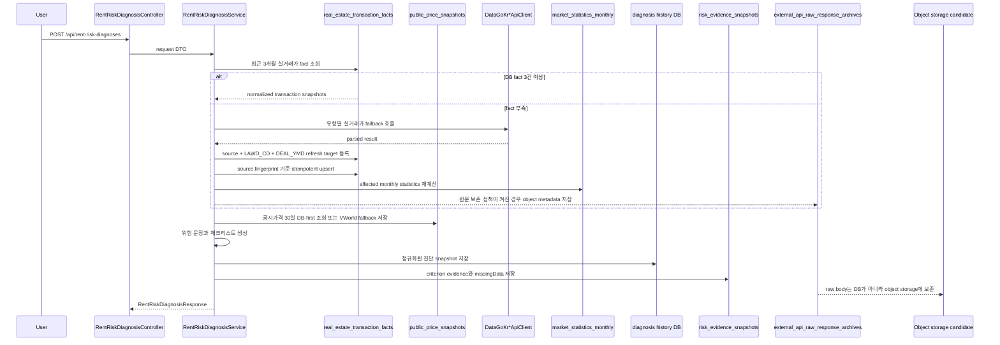
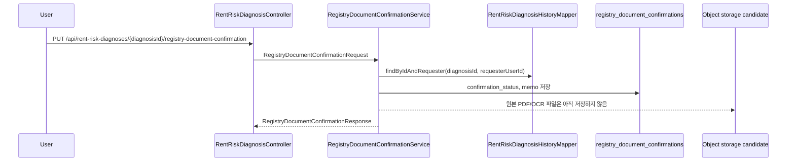
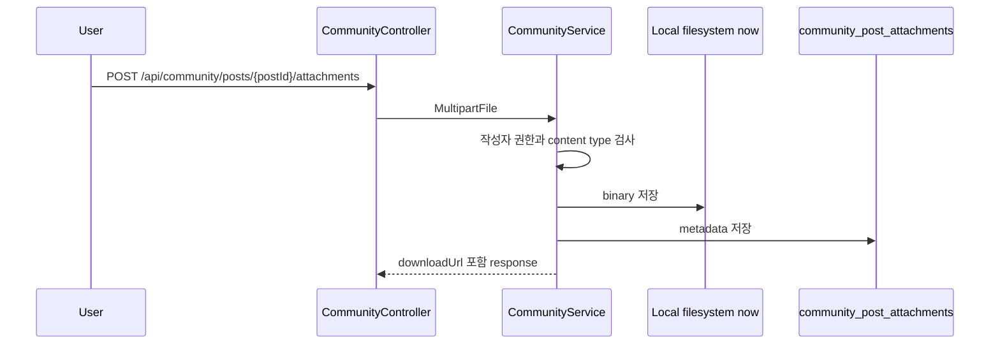
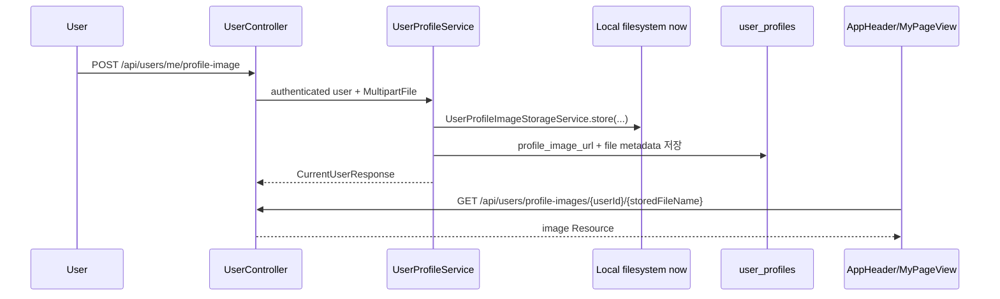

# ZIP:ON 저장소 전략

> Status: Current Storage Policy

이 문서는 ZIP:ON MVP에서 데이터를 어디에 저장해야 하는지 결정하기 위한 기준 문서다.

현재 repository에는 MyBatis/Flyway 기반 DB, 관리자 변경 감사 로그, 건축물대장/공시가격 DB-first snapshot 저장소, 실거래가 DB-first fact/statistics 저장소, 한국부동산원 R-ONE 통계 저장소, 지도 현장 확인 기록, 외부 API raw response archive metadata schema, 커뮤니티 신고 제한 이력, 커뮤니티 첨부파일용 local filesystem 저장소, 사용자 프로필 이미지용 local filesystem 저장소가 구현되어 있다. Redis는 `spring-boot-starter-data-redis`와 `VolatileStateStore` adapter가 추가되었다. 로컬 Docker `.env.example`은 Redis를 켜지만, `application.yml` fallback과 test profile은 Redis가 없어도 단일 프로세스용 in-memory fallback으로 동작하게 둔다. S3는 아직 설정과 dependency가 없다. 따라서 이 문서는 저장소별 책임과 도입 조건을 나누는 설계 기준이다.

## Goal

ZIP:ON은 현재 매물 탐색 서비스가 아니라 과거 지표 분석과 정확 주소 위험진단 서비스다. 저장소 결정도 이 질문에서 시작한다.

```text
이 매물을 계약해도 되는지 판단하기 전에, 무엇을 확인해야 하는가?
```

저장소 전략의 목표는 다음이다.

1. 구조화·검색·비교·조인이 필요한 데이터는 DB에 둔다.
2. 원본 보존이 필요한 큰 파일과 외부 API 원문은 object storage 후보로 두고, DB에는 object metadata만 둔다.
3. 짧은 수명의 반복 조회, rate limit counter, 중복 요청 방지는 Redis/volatile state 후보로 둔다.
4. 운영 책임, 권한 판단, 제재 이력처럼 나중에 조회·감사해야 하는 상태는 TTL이 있더라도 DB에 남긴다.
5. S3와 외부 API raw response cache처럼 아직 구현되지 않은 저장소 기능을 성급히 도입하지 않는다.
6. "데이터 없음"을 "안전함"으로 저장하거나 표시하지 않는다.

## Current implementation

### DB

현재 backend는 `backend/pom.xml` 기준 MyBatis와 Flyway를 사용한다. schema source of truth는 `backend/src/main/resources/db/migration` 아래 migration SQL이다.

현재 DB에 저장되는 대표 데이터:

| 영역 | 테이블 또는 migration | 저장 이유 |
| --- | --- | --- |
| 인증/권한 | `V1__create_auth_schema.sql`, `V3__seed_admin_and_demo_users.sql`, `V7__create_admin_user_permission_schema.sql`, `V43__reseed_demo_users_by_user_table_cases.sql` | 사용자, role, refresh token hash, access token denylist, 관리자 권한을 검색하고 검증해야 한다. `V43`은 로컬/학습 검증용 `demo_user_*`만 재시드해 `department_code`, `enabled`, `profile_image_url` 조합별 화면과 인증 테스트 데이터를 만든다. |
| 사용자 화면 프로필 | `V39__create_user_profiles.sql`, `V40__extend_user_profiles_for_uploaded_images.sql` | 닉네임, 프로필 이미지 URL, 업로드 이미지 metadata를 사용자별로 조회하고 중복 닉네임/저장 파일명을 제약해야 한다. 이미지 binary는 DB에 넣지 않고 local filesystem에 둔다. |
| 관리자 변경 감사 | `V29__create_admin_action_audit_logs.sql`, `V31__upgrade_admin_action_audit_logs_for_aop.sql` | role/permission 변경은 운영 책임 추적이 필요하다. `request_id`, `actor_user_id`, `actor_roles`, `target_type`, `target_id`, `action_type`, `result_status`, `client_ip_hash`, `user_agent_summary`, 변경 전후 `AdminUserResponse` snapshot, `integrity_signature`를 남기되, 비밀번호 원문과 token 원문 및 raw client IP는 저장하지 않는다. |
| 지역 | `V2__create_region_schema.sql` | 지역 검색과 화면 표시를 위해 구조화된 지역 데이터가 필요하다. |
| 커뮤니티 | `V4__create_community_board_schema.sql`, `V6__extend_community_moderation_schema.sql`, `V30__create_community_report_restrictions.sql`, `V33__create_community_policy_events.sql`, `V34__create_community_policy_operations.sql` | 게시글, 댓글, 신고, 좋아요, 첨부 metadata, 관리자 조치 이력, 신고자 제한 이력, 피신고자 자동 제재 근거, 활성 제재 상태, permission lock, DB 기반 운영 알림은 검색·정렬·권한 검사·복구 판단·운영 감사가 필요하다. |
| 법정동 | `V5__create_legal_dong_codes.sql`, `V10__create_legal_dong_alias_schema.sql` | 주소 정규화 후 법정동코드와 `LAWD_CD`를 안정적으로 찾아야 한다. |
| 관심 부동산 검토 대상 | `V9__create_favorite_schema.sql` | 사용자별 저장 관계를 조회하고 중복을 막아야 한다. 현재 매물 찜이 아니라 계약 전 다시 볼 검토 대상이다. |
| 검토 대상 카탈로그 | `V17__create_property_catalog.sql`, `V18__support_property_favorite_snapshots.sql` | 관심목록 상세보기와 지도 저장 위치에서 사용하는 `propertyId`의 이름, 주소, 좌표, 가격 후보, 면적, 층수 같은 구조화된 snapshot을 조회해야 한다. |
| 위험진단 이력 | `V11__create_rent_risk_diagnosis_history.sql` | 입력 조건, 정제 주소, 위험 수준, 요청/응답 snapshot을 관리자와 사용자 흐름에서 추적해야 한다. |
| 등기부등본 수동 확인 상태 | `V13__create_registry_document_confirmations.sql` | 원본 파일이 아니라 본인 진단 이력에 연결된 `NOT_CHECKED`, `CHECKED`, `NEEDS_HELP` 상태와 memo를 검색·권한 검증 가능한 구조로 남겨야 한다. |
| 공공 실거래가 fact/statistics/refresh target | `V20__create_external_data_fact_statistics_schema.sql` | 전월세·매매 실거래가를 요청마다 API에 의존하지 않고, 정규화 fact와 월별 통계로 재사용해야 한다. `external_data_refresh_targets`는 사용자 fallback target과 scheduler가 등록하는 최신 완료월 `TRANSACTION_MONTH` target의 DB source of truth이고, 수집 run/attempt 이력은 장애와 fallback 원인 분석에 필요하다. |
| 물건 식별 후보 | `V21__create_property_identity_candidates.sql` | 주소 정규화 결과, PNU, 본번/부번, 사용자 표현, 건축물대장 판별 상태를 후속 snapshot/evidence와 연결할 수 있어야 한다. 다만 확정 물건이 아니라 match/confidence/data_quality가 붙은 후보로 저장한다. |
| 건축물대장 표제부 snapshot | `V22__create_building_register_title_snapshots.sql` | 같은 지번/PNU의 표제부 주용도, 대장구분, 세대수, 가구수, 사용승인일을 30일 DB-first로 재사용한다. 원본 전체나 권리관계 확정값이 아니라 match/confidence/data_quality가 붙은 내부 근거 snapshot이다. 수동 seed는 공시가격 sync target, 운영자 admin seed target, 물건 식별 후보의 PNU를 건축물대장 조회 파라미터로 복원해 이 snapshot을 보강한다. |
| 공시가격 snapshot/sync target | `V23__create_public_price_snapshots.sql`, `V44__create_vworld_public_price_sync_targets.sql`, `V45__create_vworld_public_price_admin_seed_targets.sql` | 같은 PNU와 기준연도 공시가격 후보를 30일 DB-first로 재사용한다. `vworld_public_price_admin_seed_targets`는 운영자가 명시 등록한 조사 대상을 보관하고, `vworld_public_price_sync_targets`는 여러 원천의 후보를 confidence/match status와 함께 모아 callable target만 VWorld에 조회하기 위한 운영 테이블이다. `vworld_public_price_coverage_metrics`는 coverage 추적용이다. 공동주택가격/개별주택가격은 보증금 위험도 보조 근거이며 현재 시세, 권리관계, 동·호 정밀 매칭 확정값이 아니다. |
| 위험진단 근거 snapshot | `V24__create_risk_evidence_snapshots.sql` | `rent_risk_diagnosis_histories`에 묶인 criterion evidence와 missingData를 항목별 row로 남긴다. 원천 공공데이터 저장소가 아니라 진단 시점의 claim, limitation, user action을 재분석하기 위한 저장소다. |
| 외부 API raw archive metadata | `V26__create_external_api_raw_response_archives.sql` | 외부 API 원문 보존이 필요할 때 API별 raw table을 만들지 않고 object storage 위치, hash, redaction, encryption, retention metadata만 저장한다. raw XML/JSON body는 DB에 넣지 않는다. |
| 한국부동산원 R-ONE 통계 | `V27__create_kab_r_one_statistics_schema.sql` | 통계표, 세부항목, 통계자료를 `kab_r_one_statistical_tables`, `kab_r_one_statistical_items`, `kab_r_one_statistical_data_points`에 저장해 지역·유형 과거 지표 분석에서 재사용한다. 현재 매물 목록이나 개별 주소 안전성 확정값이 아니다. |
| 지도 현장 확인 기록 | `V36__create_map_field_check_records.sql` | `diagnosisHistoryId`, `favoriteId`, `address` 중 하나로 식별한 사용자의 직접 확인 완료 여부와 memo를 저장한다. 같은 사용자·대상·항목은 unique key로 한 행만 유지하며, 권리관계·하자·생활 만족도를 자동 확정하는 테이블이 아니다. |

`property` 테이블은 지도 저장 위치, 정확 주소 위험진단 결과 저장, 관심목록 상세보기 사이에서 같은 검토 대상 snapshot을 식별하기 위한 MVP용 catalog table이다. 기본키 `id`가 URL의 `propertyId`와 관심목록의 `property_id`로 전달되고, `latitude`와 `longitude`는 `PropertyDetailView.vue`의 Kakao Roadview 기준 좌표가 된다. `external_id`는 진단 이력, 정확 주소 후보 marker, 지도 선택 좌표 같은 저장 원천과 연결할 수 있도록 unique constraint를 둔다. `region_name`, `trade_type`, `price`, `latitude`, `longitude`에는 목록 검색과 지도 표시를 고려한 index를 둔다.

현재 fallback 상세 조회 흐름은 `PropertyController.getPropertyDetail(...) -> PropertyService.getPropertyDetail(...) -> PropertyMapper.findById(...) -> property` 순서다. 관심 부동산 리포트 흐름은 `FavoriteController.getFavoriteAnalysis(...) -> FavoriteService.getFavoriteAnalysis(...) -> PropertyService.getPropertyDetail(...) -> FavoriteService.loadAnalysisContext(...)` 순서로 저장 대상과 사용자별 분석 근거를 조합한다. `FavoriteService.createFavorite(...)`는 `propertyId`가 들어오면 `PropertyMapper.findById(...)`로 기존 검토 대상 존재 여부를 확인하고, `propertySnapshot`이 들어오면 `PropertyService.saveSnapshot(...)`으로 `property.external_id` 기준 upsert를 수행한 뒤 `favorites.property_id`에 연결한다. 이 흐름은 `PropertyDetailIntegrationTest`, `FavoriteAnalysisIntegrationTest`, `MapPropertyIntegrationTest`가 나눠 검증한다.

DB에 넣기 좋은 데이터의 기준:

- 검색 조건, 정렬, 페이지네이션, 조인이 필요한 데이터
- 관리자 페이지에서 제한된 domain API로 CRUD 또는 상태 변경해야 하는 데이터
- 이력 관리, 감사, 중복 방지, 권한 검증에 쓰이는 데이터
- 외부 API 원본 전체가 아니라 서비스 판단에 필요한 정규화 snapshot
- 외부 API 원본의 object key, hash, redaction 상태, retention 상태 같은 archive metadata

DB에 넣지 말아야 할 데이터:

- 등기부등본, 계약서, 이미지, OCR 대상 PDF 같은 큰 binary 원본
- 외부 API 원본 응답 전체를 무조건 누적한 payload
- API별 raw response table에 저장된 XML/JSON body
- API key, refresh token 원문, 비밀번호 원문
- 관리자 저장 dialog에서 입력한 `confirmationPassword` 원문
- 짧은 TTL만 필요한 cache entry

### Local filesystem

커뮤니티 첨부파일은 현재 `zipon.community.attachments.storage-path`에 지정된 local filesystem 경로에 저장하고, DB에는 `community_post_attachments` metadata만 저장한다. 사용자 프로필 이미지는 `zipon.user.profile-images.storage-path`에 지정된 local filesystem 경로에 저장하고, DB에는 `user_profiles`의 업로드 metadata만 저장한다.

관련 설정:

```text
backend/src/main/resources/application.yml
zipon.community.attachments.storage-path
ZIPON_COMMUNITY_ATTACHMENT_STORAGE_PATH
zipon.user.profile-images.storage-path
ZIPON_USER_PROFILE_IMAGE_STORAGE_PATH
zipon.user.profile-images.max-file-size-bytes
ZIPON_USER_PROFILE_IMAGE_MAX_FILE_SIZE_BYTES
```

local filesystem은 개발과 MVP 검증에는 단순하지만 운영 저장소로는 한계가 있다.

- 서버가 여러 대이면 파일이 각 서버에 흩어진다.
- 배포/재시작/디스크 정리 과정에서 파일 보존 정책을 실수하기 쉽다.
- 접근 제어, 암호화, lifecycle, virus scan 같은 운영 기능을 직접 만들어야 한다.

따라서 운영 배포 전에는 커뮤니티 첨부, 등기부등본, 계약서, OCR 대상 파일을 S3 같은 object storage로 옮기는 migration plan이 필요하다.

### S3/object storage

현재 repository에는 S3 설정이 없다. `spring-cloud-aws`, AWS SDK, bucket 환경변수도 추가하지 않았다. 다만 외부 API 원문 보존이 필요할 때 DB가 어떤 object를 가리킬지 추적하기 위한 `external_api_raw_response_archives` metadata table은 있다.

S3 또는 호환 object storage 후보:

| 데이터 | 저장 후보인 이유 | DB에는 무엇을 저장할까 |
| --- | --- | --- |
| 외부 API 원본 응답 | 장애 분석, 재현, 감사 목적으로 원문 보존이 필요할 수 있다. | `external_api_raw_response_archives`의 `source_id`, `collection_attempt_id`, `archive_policy`, `object_key`, `object_key_hash`, `response_content_hash`, `redaction_status`, `encryption_status`, `retention_expires_at` |
| 등기부등본 PDF | 권리관계 확인 자료이고 파일 자체가 크며 민감하다. | 사용자/진단 이력 연결 id, object key, 암호화 여부, 만료 시각, OCR 상태 |
| 계약서 PDF | 민감한 원본 파일이고 DB binary 저장에 부적합하다. | object key, 업로드 사용자, content type, size, virus scan 상태 |
| 커뮤니티 첨부 이미지/PDF | 게시글 파일은 binary 원본이므로 DB metadata와 분리하는 편이 안전하다. | `community_post_attachments` metadata와 object key |
| 프로필 이미지 | 전역 헤더와 마이페이지에서 반복 조회되는 사용자 이미지이며 binary 원본은 DB row에 부적합하다. | `user_profiles.profile_image_url`, 저장 파일명, content type, size, object key |
| OCR 대상 이미지 | 처리 전후 파일 lifecycle이 필요하다. | 작업 id, object key, 처리 상태, 삭제 예정 시각 |

S3를 도입할 때 지켜야 할 규칙:

- object key만 DB에 저장하고 원본 binary는 DB에 넣지 않는다.
- 긴 object key는 unique index에 직접 넣지 않고 `object_key_hash`로 중복을 막는다.
- 파일 접근은 controller가 권한을 확인한 뒤 signed URL 또는 streaming adapter로 제공한다.
- 민감 파일은 암호화, 짧은 보존 기간, 삭제 정책을 먼저 정한다.
- 외부 API 원본 응답을 저장하더라도 모든 응답을 영구 보존하지 않는다.
- API key, 개인 식별정보, refresh token 원문이 object에 남지 않도록 redaction 정책을 둔다.

### Redis

현재 repository에는 Redis Docker service 후보, `spring-boot-starter-data-redis`, `VolatileStateStore` adapter가 있다. `application.yml` fallback과 test profile은 `ZIPON_REDIS_ENABLED=false`로 두어 Redis 없이도 `InMemoryVolatileStateStore`를 사용할 수 있게 한다. 반면 로컬 Docker `.env.example`은 `ZIPON_REDIS_ENABLED=true`로 둔다. `ZIPON_REDIS_ENABLED=true`일 때는 `RedisVolatileStateStore`가 `StringRedisTemplate`로 Redis를 사용한다.

현재 구현된 Redis/volatile state 적용:

| 데이터 | 현재 구현 | TTL 또는 lifecycle |
| --- | --- | --- |
| access token denylist cache | `AccessTokenRevocationService`가 DB `revoked_access_tokens`를 source of truth로 유지하면서 `auth:access-token-revoked:{jti}`를 volatile store에 저장한다. 폐기 token으로 API를 호출하면 `JwtAuthenticationFilter`와 `JwtAuthenticationEntryPoint`가 token 값이나 jti를 노출하지 않고 재로그인 안내 detail을 반환하며, `frontend/src/api/axiosInstance.js`가 전역 토스트로 세션 종료를 알린다. | access token 만료 시각까지 |
| 로그인 실패 rate limit | `LoginRateLimitService`가 username과 client key를 hash한 key로 실패 횟수를 센다. 제한 기준에 도달하면 `/api/auth/login`은 401과 상세 detail을 반환하고, `AuthModal.vue`와 전역 토스트가 "로그인 시도 제한"을 사용자에게 보여준다. | `LOGIN_RATE_LIMIT_WINDOW`, 기본 15분 |
| 커뮤니티 신고 rate limit | `CommunityReportRateLimitService`가 reporter id 기준으로 빠른 반복 클릭을 제한한다. volatile 상태는 짧은 window의 카운터이고, 실제 제한 이력은 `community_report_restrictions`에 남긴다. 시간당/일일/반려 신고 누적처럼 운영자가 사후 설명해야 하는 정책은 DB의 `community_reports`와 `community_report_restrictions` 기준으로 판단한다. 제한 생성 시 사용자 알림과 반복 반려 신고자 관리자 알림은 `notifications`에 남기며, 429 응답은 전역 토스트로 즉시 표시한다. | `COMMUNITY_REPORT_RATE_LIMIT_COOLDOWN`, 기본 10분 |
| 커뮤니티 제재 복구 scheduler lock | `CommunityPolicyRestoreScheduler`가 `VolatileLockService`로 `community-policy-restore` lock을 잡은 뒤 `restriction_until`이 지난 `community_policy_sanctions`를 복구 평가한다. 실제 복구 판단 source of truth는 `community_policy_sanction_permission_locks`와 `user_permissions.updated_at`이다. 운영자는 `GET /api/admin/volatile-state-alerts`의 `SCHEDULER_LOCK_COMMUNITY_POLICY_RESTORE` 알림으로 활성 lock을 확인한다. | `COMMUNITY_POLICY_RESTORE_LOCK_TTL`, 기본 5분 |
| scheduler 중복 실행 lock | `ExternalDataWeeklyRefreshScheduler`가 `VolatileLockService`로 `external-data-weekly-refresh` lock을 잡은 뒤 실행한다. 운영자는 `GET /api/admin/volatile-state-alerts`의 `SCHEDULER_LOCK_EXTERNAL_DATA_WEEKLY_REFRESH` 알림으로 활성 lock을 확인한다. | `EXTERNAL_DATA_SCHEDULER_LOCK_TTL`, 기본 30분 |

사용자에게 보여주는 알림은 Redis key/value를 그대로 노출하지 않는다. `frontend/src/components/common/GlobalToast.vue`는 API 오류 응답과 DB `notifications` row, 관리자용 volatile alert 응답을 팝업으로 보여주는 표시 계층이다. `VolatileStateAlertService`와 `AdminVolatileStateAlertController`는 scheduler lock처럼 운영자가 알아야 하는 known key만 안전한 문장으로 변환한다. 로그인 실패 counter와 폐기 access token jti는 username hash, client key, jti 같은 민감한 식별자가 섞일 수 있으므로 별도 조회 API로 열지 않고 해당 요청의 오류 응답에서만 안내한다.

Redis 후보:

| 데이터 | Redis가 맞는 이유 | TTL 또는 lifecycle |
| --- | --- | --- |
| 동일 주소 위험진단 임시 결과 | 같은 주소·보증금 조합을 짧은 시간 반복 조회할 수 있다. | 수 분에서 수 시간 |
| 외부 API short TTL cache | data.go.kr 같은 외부 API 반복 호출을 줄인다. | API 성격에 따라 수 분에서 1일 |
| rate limit counter | user/IP 단위 호출 제한은 원자적 증가와 만료가 필요하다. | 제한 window와 동일 |
| 장애 circuit 상태 | 외부 API 장애 시 잠시 호출을 막고 fallback 문장을 보여준다. | 수 초에서 수 분 |
| 중복 요청 방지 lock | 같은 사용자가 같은 진단을 동시에 여러 번 요청하는 것을 막는다. | 요청 처리 예상 시간보다 약간 길게 |
| multi-server SSE 이벤트 fan-out | 현재 `CommunityEventPublisher`는 서버 메모리 기반이므로 다중 서버에서는 이벤트가 누락될 수 있다. | connection/event 정책에 따름 |

Redis를 도입할 때 지켜야 할 규칙:

- Redis cache miss가 서비스 실패로 이어지면 안 된다.
- Redis 값은 DB의 정본 데이터가 아니라 재생성 가능한 데이터로 둔다.
- "위험 없음" 같은 판단 결과를 TTL 없이 캐시하지 않는다.
- cache key에는 개인정보 원문을 넣지 않고 hash 또는 정규화된 최소 key를 쓴다.
- 테스트는 embedded Redis나 실제 Redis 의존 대신 `InMemoryVolatileStateStore` 같은 fake/in-memory adapter부터 고려한다.

## Storage decision matrix

| 질문 | DB | S3/object storage | Redis | Local filesystem |
| --- | --- | --- | --- | --- |
| 구조화 검색이 필요한가? | 적합 | 부적합 | 제한적 | 부적합 |
| 조인·정렬·관리자 CRUD가 필요한가? | 적합 | metadata만 DB 필요 | 부적합 | 부적합 |
| 큰 binary 원본인가? | 부적합 | 적합 | 부적합 | 개발용 가능 |
| 짧은 TTL 반복 조회인가? | 제한적 | 부적합 | 적합 | 부적합 |
| 운영 감사 이력인가? | 적합 | 원본 보존 보조 | 부적합 | 부적합 |
| 민감 파일인가? | metadata만 적합 | 암호화·만료 전제 적합 | 부적합 | 운영 부적합 |
| 서버 재시작 후 사라져도 되는가? | 아니오 | 아니오 | 예, cache라면 가능 | 아니오 |

## Request flow examples

### 위험진단 외부 API 응답



핵심은 외부 API 응답 원문을 곧바로 DB에 밀어 넣지 않는 것이다. DB에는 위험진단 판단에 필요한 `real_estate_transaction_facts`, `market_statistics_monthly`, `public_price_snapshots`를 저장하고, 최종 진단 시점의 설명 가능한 근거는 `risk_evidence_snapshots`에 따로 저장한다. 원본 응답은 보존 목적·retention·redaction 정책이 정해진 뒤 object storage로 분리하고, DB에는 `external_api_raw_response_archives`의 object metadata만 남긴다. 실거래가 fact나 공시가격 snapshot이 충분하면 외부 API를 호출하지 않고, 부족할 때만 fallback을 호출한다.

`ExternalDataWeeklyRefreshScheduler`는 기본 비활성화 상태다. 운영자가 `EXTERNAL_DATA_SCHEDULER_ENABLED=true`로 켜면 `ExternalDataLatestTargetMaterializer`가 최신 완료월 rolling window의 `TRANSACTION_MONTH` target을 `external_data_refresh_targets`에 등록하고, `ExternalDataRefreshSchedulerService`가 due target을 주간 cron으로 batch 처리한다. 결과는 `external_data_collection_runs`와 `external_data_collection_attempts`에 남긴다. 실행 전에는 `VolatileLockService`가 `external-data-weekly-refresh` lock을 잡아 중복 실행을 줄인다. Redis가 꺼진 fallback 설정에서는 이 lock이 단일 backend 프로세스 안에서만 유효하므로, 다중 인스턴스 운영에서는 `ZIPON_REDIS_ENABLED=true`가 필요하다. 운영자는 `GET /api/admin/external-data-status`와 `AdminDashboardView.vue`의 "공공데이터 수집 상태" 섹션에서 수집 대상 큐, 최근 run/attempt, `real_estate_transaction_facts`, `market_statistics_monthly` 품질 집계를 확인한다.

### 등기부등본 수동 확인 상태



현재 구현은 사용자가 등기부등본을 확인했는지, 도움이 필요한지, 어떤 memo를 남겼는지만 DB에 저장한다. PDF 원본, OCR 대상 이미지, OCR 결과 원문은 민감하고 큰 데이터이므로 `registry_document_confirmations`에 넣지 않는다. 파일 업로드를 열 때는 DB에 object key와 lifecycle metadata만 남기고 binary는 S3/object storage 후보로 분리한다.

### 커뮤니티 첨부파일



운영 전환 시에는 `FileStore` adapter의 구현만 object storage로 바꾸고, `community_post_attachments` metadata와 controller/service 책임은 유지하는 방향이 안전하다.

### 사용자 프로필 이미지



현재 구현은 프로필 이미지 binary를 `user_profiles`에 넣지 않는다. `user_profiles`에는 `profile_image_url`, 원본 파일명, 저장 파일명, 저장 경로, content type, size만 남긴다. 전역 헤더의 avatar는 어느 페이지에서나 보이므로 이미지 조회 URL은 public GET endpoint로 제공하고, 업로드/수정은 인증된 사용자만 가능하게 분리한다.

## Decision: Redis는 volatile state adapter로 제한하고 S3는 아직 추가하지 않는다

### Context

ZIP:ON은 외부 API, 위험진단 이력, 커뮤니티 첨부파일, 관리자 운영 데이터가 모두 필요하다. 하지만 현재 MVP는 먼저 법정동코드, 건축물대장 표제부 snapshot, 실거래가 fact/statistics, 공시가격 snapshot, risk evidence snapshot을 조합해 위험 문장과 체크리스트를 만드는 흐름을 안정화해야 한다.

### Options considered

1. 지금 S3와 Redis를 모두 넓게 적용한다.
2. DB에 외부 API 원본과 파일까지 모두 저장한다.
3. Redis는 짧은 TTL 상태 adapter로만 제한 적용하고, S3는 도입 조건을 문서로 고정한다.

### Decision

3번을 선택한다. 현재 코드는 MyBatis/Flyway DB를 source of truth로 유지하고, Redis/volatile store는 access token denylist cache, 로그인 실패 rate limit, 커뮤니티 신고 rate limit counter, scheduler lock처럼 만료 가능한 상태에만 사용한다. 다만 커뮤니티 신고 제한처럼 운영자가 나중에 확인해야 하는 제재 이력은 TTL 정책이 있더라도 `community_report_restrictions` DB row로 남긴다. 반복 재사용이 필요한 실거래가 판단 데이터는 DB fact/statistics로 저장하고, 공시가격 판단 데이터는 DB snapshot으로 저장한다. S3는 아직 도입하지 않는다.

### Why

이 repository는 학습용이면서 실제 서비스로 성장해야 한다. Redis를 `StringRedisTemplate` 호출로 각 service에 흩뿌리면 장애 fallback, TTL, key hashing, 테스트 전략이 빠르게 흐려진다. 그래서 `VolatileStateStore` interface를 먼저 두고 Redis 장애는 cache miss 또는 fail-open으로 처리한다.

### Tradeoffs

S3 도입 전까지는 운영 수준의 파일 보존이 제한된다. Redis가 꺼진 fallback 설정에서는 in-memory fallback이므로 여러 서버 인스턴스 간 rate limit과 lock은 공유되지 않는다. 대신 단일 테스트나 `.env` 없는 smoke 환경은 Redis 없이도 동작하고, 로컬 Docker와 운영에서 Redis를 켜는 순간 같은 interface로 확장된다.

### Future revisit

다음 조건 중 하나가 생기면 이 결정을 다시 본다.

- 등기부등본/계약서/PDF 업로드를 실제 사용자에게 열기 전
- 커뮤니티 첨부파일을 운영 환경에 보존해야 할 때
- 프로필 이미지를 운영 환경에서 장기 보존하거나 여러 서버 인스턴스로 제공해야 할 때
- data.go.kr 호출량 제한이나 응답 지연이 MVP 사용성을 막을 때
- 여러 서버 인스턴스로 community SSE를 운영해야 할 때
- 관리자 페이지에서 외부 API 장애율과 호출량을 운영 지표로 봐야 할 때

## Debugging checklist

### DB에 저장할지 헷갈릴 때

- 이 데이터로 검색, 정렬, 조인, 관리자 CRUD를 해야 하는가?
- 이 데이터가 이력, 감사, 권한 검증, 중복 방지에 필요한가?
- 원본 전체가 아니라 서비스 판단에 필요한 snapshot으로 줄일 수 있는가?
- Flyway migration과 MyBatis mapper로 책임을 설명할 수 있는가?

### S3/object storage 후보인지 헷갈릴 때

- 파일이나 원본 payload가 DB row로 관리하기에 큰가?
- 원본 보존, 다운로드, OCR, 감사 재현이 필요한가?
- 보존 기간, 암호화, 접근 권한, 삭제 정책을 설명할 수 있는가?
- DB에는 object key와 metadata만 있어도 되는가?

### Redis 후보인지 헷갈릴 때

- 재시작 후 사라져도 다시 만들 수 있는 데이터인가?
- TTL이 명확한가?
- 같은 요청이 짧은 시간 반복되는가?
- 외부 API 장애나 rate limit을 줄이는 데 직접 도움이 되는가?

## Related documents

- Parent overview: [docs README](/README.md)
- CODEX overview: [CODEX README](../README.md)
- [과거 지표 분석과 정확 주소 위험진단 MVP API 호출 전략](/docs/api/API_CALL_FLOW.md)
- [외부 API 설정과 data.go.kr 키 관리](/docs/api/EXTERNAL_API_CONFIGURATION.md)
- [MySQL 개발환경과 Flyway migration](/docs/operations/DOCKER_MYSQL_REDIS.md)
- [공공데이터 API 연동 전략](/docs/api/PUBLIC_API_STRATEGY.md)
- [커뮤니티 게시판 백엔드 학습 문서](/docs/community/README.md)

## Favorite property snapshot storage

지도에서 사용자가 명시적으로 저장한 관심 부동산 검토 위치와 정확 주소 위험진단 결과에서 저장한 검토 기준은 `PropertySnapshotRequest`로 백엔드에 전달되고 `PropertyService.saveSnapshot(...)`이 `property.external_id` 기준으로 upsert한다. 이것은 VWorld Geocoder의 주소->좌표 변환 결과를 캐시하는 것이 아니라, 사용자가 지도 UI 또는 진단 결과에서 저장한 계약 검토용 위치/주소 스냅샷을 DB 정본으로 남기는 흐름이다.

`favorites.property_id`는 항상 실제 상세 조회 가능한 `property.id`를 가리키고, `PropertyDetailView.vue`의 Kakao Roadview는 그 row의 `latitude`, `longitude`를 사용한다. `V18__support_property_favorite_snapshots.sql`은 `price`를 nullable로 완화한다. Kakao 장소, 정확 주소 후보 marker, 지도 선택 위치에는 가격 정보가 없을 수 있기 때문에, 가격이 없는 스냅샷은 위험진단의 가격 판단 근거가 아니라 상세보기 위치/주소/로드뷰 연결을 위한 최소 catalog row로 취급한다. 사용자가 위험진단 결과에서 저장한 경우에는 `frontend/src/utils/favoritePayload.js`가 보증금, 월세, 관리비, 면적, 층수 같은 입력 요약을 가능한 범위에서 `propertySnapshot`에 채운다.

## Learning path

1. First read: 이 문서의 `Storage decision matrix`
2. Then inspect: `backend/src/main/resources/db/migration`
3. Then inspect: `backend/src/main/resources/application.yml`의 `zipon.community.attachments.storage-path`, `zipon.user.profile-images.storage-path`
4. Then inspect: `docs/community/README.md`의 `community_post_attachments` 설명
5. Then read: `/docs/api/API_CALL_FLOW.md`의 `사전 저장/캐시/실시간 호출 분류`
6. Then inspect: `RealEstateTransactionFactStore`, `MarketStatisticsMonthlyService`, `ExternalDataCollectionService`, `PublicPriceSnapshotStore`
7. Then run: docs-only 변경이면 `git diff --check`
8. Then debug: 저장소 선택이 흔들릴 때 "검색·조인·이력은 DB, 원본 binary는 object storage, 짧은 TTL은 Redis"로 되돌아간다.
9. Key concept to understand: DB는 정본과 질의를 위한 저장소이고, object storage는 원본 파일 보존소이며, Redis는 짧은 수명의 재생성 가능한 상태 저장소다.
