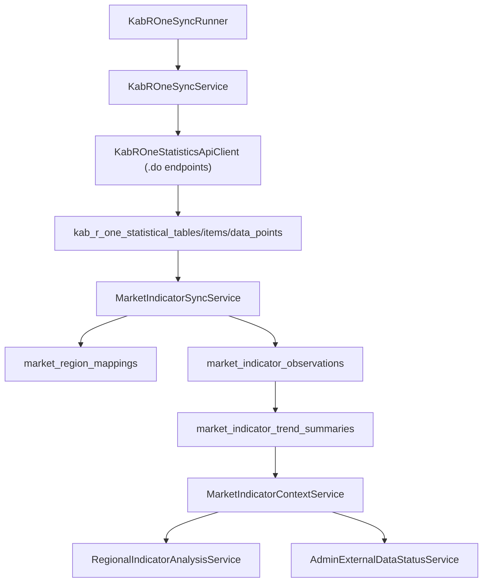

# Market Indicator Foundation

> Status: Implemented first slice

이 문서는 한국부동산원 R-ONE 원천 통계 row를 ZIP:ON의 지역·유형 과거 지표 분석에 맞는 domain indicator로 바꾸는 저장소와 서비스 경계를 설명한다. 이 계층은 현재 매물 목록, 현재 호가, broker inventory를 만들기 위한 계층이 아니다. 목표는 통계표별 원천 row를 그대로 화면에 노출하지 않고, 지역·유형·거래종류·지표분류 기준으로 해석 가능한 관측치와 추세 요약을 만드는 것이다.

## 설계 목표

- R-ONE 원천 저장 계층과 사용자-facing 분석 계층을 분리한다.
- 통계표, 세부항목, 통계자료 원문은 `kab_r_one_statistical_*` 테이블에 보존한다.
- ZIP:ON이 실제로 해석할 지표는 `market_indicator_*` 테이블로 정규화한다.
- 지역 매핑은 자동 확정하지 않고 `AUTO_MAPPED`, `NEEDS_REVIEW`, `UNMAPPED` 상태를 남긴다.
- 지역·유형 과거 지표 API는 요청 중 외부 API를 호출하지 않고 저장된 summary만 읽는다.

## 데이터 흐름

핵심은 `KabROneSyncService`가 외부 API와 원천 저장을 맡고, `MarketIndicatorSyncService`가 이미 저장된 원천 row를 domain read model로 변환한다는 점이다. 이렇게 나누면 API 장애, 원천 코드 의미 재검토, 화면 분석 로직 변경을 서로 덜 흔들리게 다룰 수 있다.

## Flyway 테이블

`V38__create_market_indicator_domain_schema.sql`이 schema source of truth다.

| 테이블 | 책임 |
| --- | --- |
| `market_indicator_definitions` | ZIP:ON이 해석할 지표 catalog. 예: 아파트 매매가격지수, 오피스텔 수익률, 상가 공실률 |
| `market_indicator_source_bindings` | R-ONE 통계표/주기/그룹/분류/항목 코드와 ZIP:ON 지표의 연결 |
| `market_region_mappings` | R-ONE 원천 지역 텍스트를 ZIP:ON 지역 수준과 법정동코드 catalog에 매핑한 결과 |
| `market_indicator_observations` | 특정 지표, 지역, 기간의 계산 가능한 관측치 |
| `market_indicator_trend_summaries` | 최근값, 1/3/6/12기간 변화, YoY, 변동성, 방향, 품질 상태를 저장한 read model |
| `market_indicator_sync_targets` | R-ONE 지표별 backfill 후보. 기본은 `enabled = false`라 실수로 대량 호출하지 않는다 |

`market_indicator_source_bindings.binding_status = 'ACTIVE'`인 row만 자동 관측치 변환 대상이다. 코드 의미가 아직 불확실한 수익률, 전월세전환율, 상가 지표 일부는 `NEEDS_REVIEW`로 seed되어 사람이 `kab_r_one_statistical_items`를 확인한 뒤 활성화해야 한다.

## 지역 매핑 규칙

`MarketIndicatorSyncService`의 첫 slice는 보수적인 문자열 매핑만 수행한다.

| 조건 | 결과 |
| --- | --- |
| 원천 지역명이 `전국` | `NATION`, `AUTO_MAPPED`, `MEDIUM` confidence |
| 원천 지역명에 정확히 하나의 시군구명이 포함됨 | `SIGUNGU`, `AUTO_MAPPED`, `MEDIUM` confidence |
| 매칭되는 시군구가 없음 | `PLACE_OR_STATION_CANDIDATE`, `UNMAPPED`, `UNAVAILABLE` confidence |
| 여러 시군구가 동시에 매칭됨 | `PLACE_OR_STATION_CANDIDATE`, `NEEDS_REVIEW`, `UNAVAILABLE` confidence |

`강남 원룸`, `서울대입구역 근처`, `상가 월세` 같은 입력은 현재 매물 검색이 아니다. 지역 또는 장소 표현이 모호하면 `UNMAPPED`나 `NEEDS_REVIEW` 상태를 남기고, 사용자에게 데이터 한계를 설명해야 한다.

## 추세 요약 규칙

`market_indicator_observations`는 원천 `DTA_VAL`을 `value_raw`와 `value_decimal`로 정규화한다. `market_indicator_trend_summaries`는 같은 지표·지역·거래종류·통계단위의 관측치를 기간순으로 읽고 아래 값을 계산한다.

| 필드 | 의미 |
| --- | --- |
| `latest_value_raw`, `latest_value_decimal` | 가장 최근 관측치의 원문 값과 숫자 값 |
| `change_1_period_value`, `change_3_period_value`, `change_6_period_value`, `change_12_period_value` | 최근값과 n기간 전 값의 차이 |
| `change_1_period_percent`, `change_3_period_percent`, `change_6_period_percent`, `change_12_period_percent` | 최근값과 n기간 전 값의 변화율 |
| `year_over_year_value`, `year_over_year_percent` | 현재 slice에서는 12기간 전 대비 변화와 같은 의미로 계산 |
| `volatility_12_periods` | 최근 12개 기간의 기간별 변화율 표준편차 |
| `direction` | 최근값이 3기간 전보다 높으면 `UP`, 낮으면 `DOWN`, 같으면 `FLAT` |
| `freshness_status` | 최신 기간이 현재 월 기준 6개월보다 오래되면 `STALE`, 아니면 `FRESH` |
| `data_quality_status` | 매핑 상태, 표본 수, 최신성으로 계산한 품질 상태 |
| `limitation_message` | 통계 단위와 개별 주소 위험을 혼동하지 말라는 사용자-facing 한계 문장 |

데이터가 없거나 기간이 부족한 경우에는 안전함으로 해석하지 않는다. `EMPTY`, `STALE`, `LOW_SAMPLE_COUNT`, `UNAVAILABLE` 상태와 다음 행동으로 표현한다.

## 코드 읽는 순서

1. `backend/src/main/resources/db/migration/V38__create_market_indicator_domain_schema.sql`
2. `backend/src/main/java/com/zipon/mapper/MarketIndicatorMapper.java`
3. `backend/src/main/java/com/zipon/service/MarketIndicatorSyncService.java`
4. `backend/src/main/java/com/zipon/service/MarketIndicatorContextService.java`
5. `backend/src/main/java/com/zipon/service/RegionalIndicatorAnalysisService.java`
6. `backend/src/main/java/com/zipon/service/AdminExternalDataStatusService.java`

이 순서로 보면 Flyway schema, MyBatis SQL, service transaction boundary, 사용자-facing 조립 로직이 어떻게 이어지는지 보인다.

## API surface

| Endpoint | 변화 |
| --- | --- |
| `POST /api/regional-indicator-analyses` | `marketIndicatorSummaries`를 응답에 포함한다. 기존 `rOneIndicators` raw-style field는 호환용으로 남아 있지만 새 분석 로직은 summary를 기준으로 한다. |
| `GET /api/admin/external-data-status` | `marketIndicators` 품질 요약을 포함한다. definition, source binding, observation, summary, unmapped region, disabled target count와 품질/신뢰도 분포를 볼 수 있다. |

두 endpoint 모두 요청 중 R-ONE 외부 API를 호출하지 않는다. R-ONE 수집은 명시적인 sync runner 또는 운영 batch의 책임이다.

## 테스트

| 테스트 | 확인 내용 |
| --- | --- |
| `MarketIndicatorDomainIntegrationTest` | R-ONE 원천 data point가 region mapping, observation, trend summary로 변환되는지 확인 |
| `RegionalIndicatorAnalysisIntegrationTest` | 지역·유형 분석 API가 `marketIndicatorSummaries`를 사용자-facing 응답에 포함하는지 확인 |
| `AdminExternalDataStatusIntegrationTest` | 관리자 외부 데이터 상태 응답에 market indicator 품질 요약이 포함되는지 확인 |
| `KabROneSyncServiceTest` | R-ONE 통계자료 sync 뒤 domain refresh가 호출되는지 확인 |
| `KabROneStatisticsSchemaIntegrationTest` | R-ONE 원천 schema와 새 domain schema가 Flyway로 적용되는지 확인 |

## 운영 주의사항

- 실제 `KAB_R_ONE_API_KEY`는 `.env`나 배포 secret에만 둔다.
- 문서, 테스트 fixture, 로그, DB row에 실제 key를 저장하지 않는다.
- `.do`가 붙은 공식 endpoint를 사용한다. `.do`가 없는 경로는 HTML을 반환할 수 있다.
- `market_indicator_sync_targets`는 기본 비활성화다. 넓은 backfill은 지표와 기간을 검토한 뒤 별도 작업 단위로 켠다.
- `NEEDS_REVIEW` binding은 세부항목 의미를 `kab_r_one_statistical_items`와 원문 명세에서 확인한 뒤 활성화한다.

## 학습 포인트

이 설계는 "외부 API row를 바로 화면에 뿌리는 코드" 냄새를 피한다. 원천 저장, domain 정규화, 사용자-facing 해석을 분리하면 MyBatis mapper는 SQL을, service는 use case와 transaction을, controller는 HTTP 경계를 맡는다는 Spring 계층 원칙이 선명해진다.

또한 Flyway migration이 schema source of truth이고, MyBatis mapper가 persistence access라는 프로젝트 규칙을 유지한다. JPA entity나 Hibernate schema generation 없이도 충분히 해석 가능한 read model을 만들 수 있다는 점을 보여주는 예시다.
