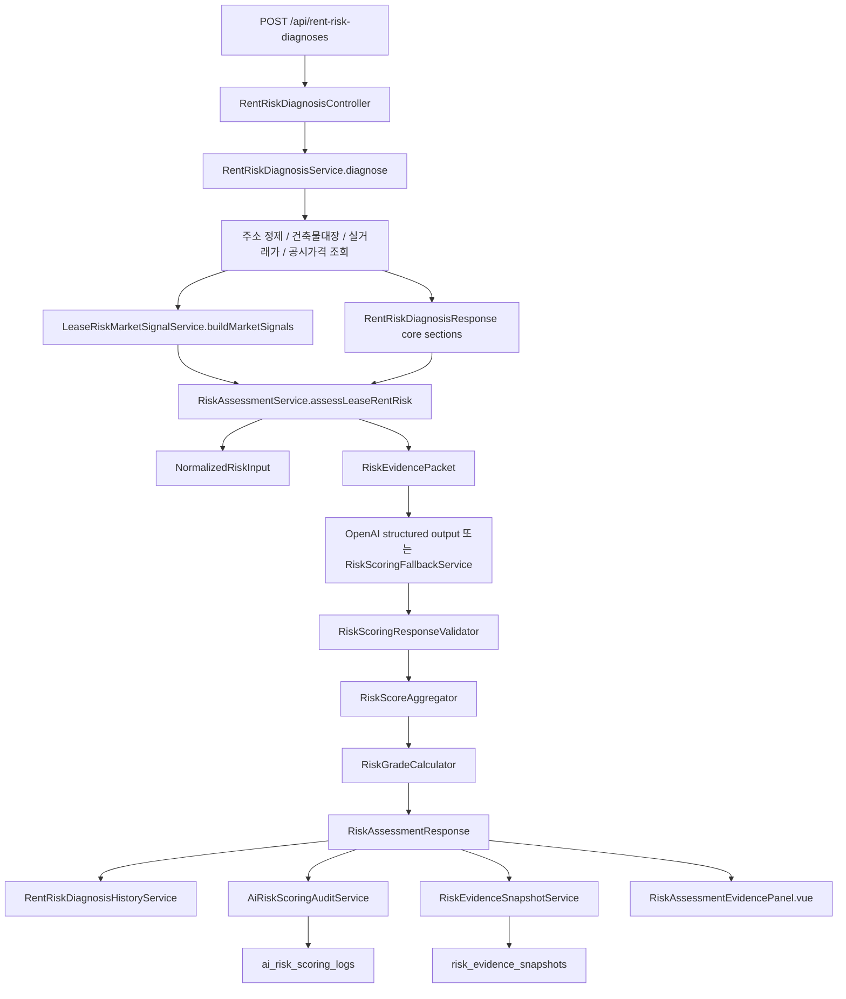

# 위험도 산정 근거 모델과 점수 계산 구조

> Status: Current Reference

## 목적

이 문서는 ZIP:ON 정확 주소 위험진단에서 위험도 산정 근거가 어떤 칼럼으로 표현되고, 어떤 로직으로 점수와 등급이 계산되며, 왜 그런 구조가 만들어졌는지를 설명한다.

핵심 목적은 두 가지다.

1. 공공데이터, R-ONE 시장지표, 사용자 입력, 직접 확인 항목을 한 화면에서 섞어 보여주더라도 무엇이 점수 근거이고 무엇이 계약 전 확인 행동인지 분리한다.
2. "데이터가 없음", "파싱 오류", "해석 불가", "직접 확인 필요"를 같은 의미로 취급하지 않는다.

이 문서는 [RISK_SCORING_POLICY.md](RISK_SCORING_POLICY.md)의 룰 사전보다 구현에 더 가깝다. 룰의 제품 언어를 먼저 보고 싶으면 `RISK_SCORING_POLICY.md`를 읽고, DB 칼럼과 계산 흐름을 보고 싶으면 이 문서를 읽는다.

## 제품 배경

ZIP:ON은 현재 매물 탐색 서비스가 아니다. MVP의 핵심은 과거 지표 기반 부동산 분석과 정확 주소 계약 전 위험진단이다.

따라서 위험도 산정은 아래 원칙을 따른다.

| 원칙 | 의미 |
| --- | --- |
| 현재 매물가를 만들지 않는다 | 실거래가, 공시가격, R-ONE 지표는 현재 호가나 현재 매물의 존재를 뜻하지 않는다. |
| 법적 안전을 확정하지 않는다 | 등기부등본, 선순위 임차인, 보증보험, 하자 여부는 자동 확정하지 않고 계약 전 확인 행동으로 분리한다. |
| 원천 API dump를 보여주지 않는다 | 원천 응답은 진단 근거, 한계, 다음 행동으로 해석해 화면에 보여준다. |
| AI가 최종 판정자가 아니다 | AI는 criterion별 구조화 점수를 보조할 수 있지만 최종 총점, 등급, verdict는 백엔드가 계산한다. |
| 단일 필드에 과의존하지 않는다 | 원천 API의 한 필드가 비어 있어도 같은 의미를 가진 다른 필드가 있으면 조합해 해석한다. |

이번 설계 보완의 직접 배경은 아래 문제였다.

| 문제 | 원인 | 설계 보완 |
| --- | --- | --- |
| 건축물대장은 조회됐지만 MVP 물건 유형으로 분류하지 못함 | `mainUseName`만 보면 `업무시설`처럼 넓은 용도만 보이고, 실제 상세 용도인 `오피스텔`은 다른 필드에 들어올 수 있음 | `building_register_title_snapshots.detail_use_name`을 저장하고 `BuildingTypeResolver`가 `main_use_name + detail_use_name + household_count + family_count`를 조합한다. |
| VWorld 공시가격 API 응답 해석 중 오류로 표시됨 | 조회 결과 없음과 파서 오류를 같은 error로 취급할 수 있음 | `PublicPriceApiResponseParser`는 `NOT_FOUND`, `totalCount=0`을 `DATA_MISSING` 계열로 해석하고, 실제 오류 응답만 error로 본다. |
| 시장 signal 미연결, 변동성 signal 미연결이 화면에 남음 | 정확 주소 실거래가나 공시가격이 없어도 R-ONE 지역·유형 summary로 보조 판단을 만들 수 있는데 이를 연결하지 못함 | `LeaseRiskMarketSignalService`가 `market_indicator_trend_summaries`를 읽어 부분 근거를 만들고, 화면 카드 문구를 "미연결"이 아니라 "지역·유형 시장 맥락"으로 바꿀 수 있게 한다. |
| 직접확인이 점수에 영향을 줌 | 등기부등본, 선순위 임차인, 보증보험은 나중에 확인해야 하는 항목인데 미확인 상태만으로 모든 주소에 위험 점수가 부여됨 | 직접 확인 criterion의 `weight`를 `0.00`으로 두고 총점과 불확실성 패널티에서 제외한다. |

## 전체 흐름



중요한 경계는 아래와 같다.

| 경계 | 책임 |
| --- | --- |
| `RentRiskDiagnosisService` | 정확 주소 진단의 전체 orchestration, 공공데이터 조회, core response 조립 |
| `LeaseRiskMarketSignalService` | 정확 주소 진단에 사용할 R-ONE 지역·유형 시장 signal 조회 |
| `RiskAssessmentService` | normalized input과 evidence packet을 만들고 AI/fallback 산정을 실행 |
| `RiskScoringFallbackService` | OpenAI 비활성, 실패, 일부 데이터 부족 상황의 백엔드 fallback criterion 산정 |
| `RiskScoringResponseValidator` | AI 응답 schema, criterion code, 점수 범위, 직접확인 점수 금지 검증 |
| `RiskScoreAggregator` | criterion별 점수에서 base score, uncertainty penalty, total score 계산 |
| `RiskGradeCalculator` | total score와 핵심 데이터 부족 여부로 grade/verdict 결정 |
| `RiskEvidenceSnapshotService` | 화면에 나온 criterion evidence/missing data를 DB snapshot으로 저장 |
| `AiRiskScoringAuditService` | AI/fallback 처리 경로와 raw/parsed response audit 저장 |

## 위험도 응답 모델

프론트엔드는 `RentRiskDiagnosisResponse.riskAssessment`를 사용해 평가 항목 차트와 상세 근거 패널을 그린다.

### `RiskAssessmentResponse`

| 필드 | 의미 | 비고 |
| --- | --- | --- |
| `templateCode` | 위험 산정 template 코드 | 현재 `LEASE_RENT_RISK` |
| `templateName` | 사용자/운영자가 읽을 template 이름 | `정확 주소 기반 계약 전 위험진단` |
| `promptVersion` | AI prompt version | 현재 `LEASE_RISK_ADDRESS_SCORING_V3` |
| `schemaVersion` | 구조화 응답 schema version | 현재 `zipon-risk-criterion-result-v3` |
| `scoringMode` | 산정 모드 | `OPENAI_STRUCTURED_OUTPUT`, `HYBRID_FALLBACK`, `RULE_BASED_FALLBACK` 계열 |
| `baseScore` | criterion 가중합 점수 | `riskScore * weight` 합산 후 반올림 |
| `uncertaintyPenalty` | 데이터 불확실성 패널티 | 직접확인 `weight=0` 항목은 제외 |
| `totalRiskScore` | 최종 위험 점수 | `baseScore + uncertaintyPenalty`, 0~100 clamp |
| `riskGrade` | 최종 등급 | `LOW`, `MODERATE`, `HIGH`, `CRITICAL`, `NEED_MORE_INFORMATION` |
| `displayVerdict` | 화면용 결론 | 확정 판정이 아니라 검토 필요 수준 |
| `summary` | 등급별 요약 문장 | `RiskScoreAggregator.summaryText(...)` |
| `aiProcessing` | OpenAI/fallback 처리 상태 | 사용자에게 AI 처리 경로를 설명하기 위한 별도 요약 |
| `criteria` | criterion별 상세 결과 | 평가 항목 차트와 상세 패널의 원천 |

### `RiskCriterionResponse`

| 필드 | 의미 | 점수 계산 영향 |
| --- | --- | --- |
| `criterionCode` | 항목 코드 | template definition과 매칭된다. |
| `criterionName` | 항목 이름 | 화면 카드 제목으로 사용된다. |
| `status` | 산정 상태 | 불확실성 패널티와 화면 badge에 영향 |
| `riskScore` | 0~100 항목 위험 점수 | `weight=0` 항목은 `null`이어야 한다. |
| `confidence` | 0~1 신뢰도 | snapshot의 `confidence_level`로 변환된다. |
| `weight` | 총점 반영 비율 | `0.00`이면 직접확인 항목으로 점수 제외 |
| `weightedScore` | `riskScore * weight` | `RiskScoreAggregator`가 계산한다. |
| `riskLevel` | 화면용 위험 수준 | 점수 또는 status에서 파생된다. |
| `evidence` | 점수/판단에 사용한 근거 | `risk_evidence_snapshots`의 `CRITERION_EVIDENCE`로 저장된다. |
| `missingData` | 부족하거나 확인해야 하는 근거 | `risk_evidence_snapshots`의 `MISSING_DATA`로 저장된다. |
| `reason` | 내부/운영자용 판단 이유 | 화면 설명 fallback에도 사용된다. |
| `userVisibleExplanation` | 사용자용 설명 | 원천 값이 아니라 해석 문장이다. |
| `recommendedActions` | 사용자가 해야 할 다음 행동 | 직접확인과 계약 전 checklist의 핵심 출력이다. |
| `scoringMode` | 항목별 산정 모드 | AI와 fallback이 섞일 수 있으므로 항목 단위로 남긴다. |

### `RiskEvidenceResponse`

| 필드 | 의미 | 예시 |
| --- | --- | --- |
| `source` | 근거 출처 | `publicPrice`, `buildingRegister`, `rentTransaction`, `marketContext` |
| `field` | 참조한 field 이름 | `publicPriceAmountManwon`, `mainUseName`, `direction` |
| `value` | 실제 근거 값 | `25000`, `업무시설`, `UP` |
| `description` | 사용자/운영자가 읽을 근거 설명 | `공시가격 후보`, `건축물대장 주용도` |

### `RiskMissingDataResponse`

| 필드 | 의미 | 예시 |
| --- | --- | --- |
| `field` | 부족한 데이터 또는 직접 확인 대상 | `registryDocument`, `seniorTenantDeposits` |
| `reason` | 왜 부족한지 | `등기부등본 원본은 자동 조회하지 않습니다.` |
| `requiredAction` | 사용자가 해야 할 행동 | `최신 등기부등본 갑구·을구를 확인하세요.` |

## Criterion template

현재 `RiskTemplateResolver`의 `LEASE_RENT_RISK` template은 12개 criterion으로 구성된다.

| criterionCode | 이름 | weight | 총점 반영 | 핵심 데이터 부족 시 등급 보류 | 주요 근거 |
| --- | --- | ---: | --- | --- | --- |
| `PROPERTY_IDENTITY_RISK` | 물건 정체 판별 위험 | 0.16 | 예 | 예 | 주소 정제, 공부상 물건 유형, 후보 유형 |
| `DEPOSIT_TO_VALUE_RISK` | 보증금 대비 기준가 위험 | 0.17 | 예 | 아니오 | 보증금, 매매 실거래가, 공시가격, 매매가격지수 |
| `MARKET_PRICE_COMPARISON_RISK` | 전월세 비교가격 위험 | 0.14 | 예 | 아니오 | 전월세 실거래가, 전월세 가격지수 |
| `SALE_TRANSACTION_SUPPORT_RISK` | 매매 거래 근거 위험 | 0.11 | 예 | 아니오 | 매매 실거래가, 매매가격지수 |
| `PUBLIC_PRICE_SUPPORT_RISK` | 공시가격·기준가 보조 근거 위험 | 0.10 | 예 | 아니오 | VWorld 공시가격, 매매 실거래가, 매매가격지수 |
| `BUILDING_LEGAL_USE_RISK` | 건축물 용도 위험 | 0.14 | 예 | 아니오 | `main_use_name`, `detail_use_name`, 주거 목적 일치 여부 |
| `BUILDING_AGE_CONDITION_RISK` | 건물 노후·상태 위험 | 0.10 | 예 | 아니오 | `use_approval_date`, 현장 하자 직접 확인 |
| `MULTI_HOUSEHOLD_SENIOR_TENANT_RISK` | 다가구 선순위 보증금 확인 | 0.00 | 아니오 | 아니오 | 다가구/단독 후보, 선순위 임차인 직접 확인 |
| `REGISTRY_RIGHTS_RISK` | 등기 권리관계 확인 | 0.00 | 아니오 | 아니오 | 등기부등본 갑구·을구 직접 확인 |
| `GUARANTEE_INSURANCE_RISK` | 보증보험 가능 여부 확인 | 0.00 | 아니오 | 아니오 | 보증기관 직접 확인 |
| `MONTHLY_COST_BURDEN_RISK` | 월 고정 주거비 위험 | 0.08 | 예 | 아니오 | 월세, 관리비, 보증금 |
| `CONTRACT_CHECKLIST_RISK` | 계약 전 확인 행동 | 0.00 | 아니오 | 아니오 | 체크리스트와 다음 행동 |

가중치가 있는 항목의 합은 `1.00`이다. 직접확인 항목은 중요도가 낮아서 제외한 것이 아니라, 자동 산정 시점에 점수화하면 잘못된 신호가 되기 때문에 제외했다.

`DEPOSIT_TO_VALUE_RISK`는 `RentRiskDiagnosisService`가 진단 본 흐름에서 만든 `DepositRiskAssessment`를 `NormalizedRiskInput.depositToValueAssessment`로 넘겨 산정한다. `DepositRiskCalculator.assessSalePriceRatio(...)`가 매매 실거래가 대표값 대비 보증금 비율을 계산하면 `RiskScoringFallbackService`는 그 `suggestedRiskScore`를 `AVAILABLE` 점수로 사용한다. 매매 비율이 없고 `DepositRiskCalculator.assessPublicPriceRatio(...)`만 계산되면 공시가격은 시세가 아니므로 `PARTIAL` 점수로 사용한다. 거래 또는 공시가격 조회 상태가 `success`여도 금액 필드가 없어 비율을 계산하지 못하면 `riskScore=null`, `DATA_MISSING`으로 남기며, 지역 매매가격지수 signal은 정확 주소 비율을 대체하지 않는 제한적 보조 근거다.

## 점수 계산 로직

### 1. Criterion별 점수

점수 항목은 `riskScore`가 0~100 사이의 값이다. 높을수록 위험 신호가 강하다.

직접확인 항목은 `weight=0.00`이고 `riskScore=null`이어야 한다. OpenAI가 직접확인 항목에 숫자 점수를 반환하면 `RiskScoringResponseValidator`가 응답을 거부한다.

### 2. `weightedScore`

`RiskScoreAggregator.toScoredResult(...)`는 아래 규칙으로 `weightedScore`를 만든다.

```text
if weight == 0 or riskScore == null:
    weightedScore = 0
else:
    weightedScore = round(riskScore * weight, 2)
```

### 3. `baseScore`

```text
baseScore = round(sum(weightedScore))
baseScore = clamp(baseScore, 0, 100)
```

직접확인 항목은 `weightedScore=0`이므로 base score에 들어가지 않는다.

### 4. `uncertaintyPenalty`

데이터 부족은 안전 신호가 아니다. 그래서 점수 항목에서 데이터가 부족하면 별도 패널티를 더한다.

| status | penalty | 설명 |
| --- | ---: | --- |
| `AVAILABLE` | 0 | 점수화 가능한 근거가 충분함 |
| `NOT_APPLICABLE` | 0 | 해당 없는 항목 |
| `PARTIAL` | 1 | 일부 근거 또는 보조 근거만 있음 |
| `DATA_MISSING` | 3 | 필요한 데이터가 없음 |
| `NEEDS_USER_DOCUMENT` | 5 | 문서 확인이 필요함 |
| `AI_UNAVAILABLE` | 2 | AI를 사용할 수 없어 fallback으로 처리 |
| `CALCULATION_FAILED` | 4 | 계산 실패 |

단, `weight=0.00` 항목은 패널티에서도 제외한다. 직접확인 항목은 나중에 확인해야 하는 행동이지, 미확인 상태만으로 자동 점수를 올릴 이유가 없기 때문이다.

```text
uncertaintyPenalty = min(sum(nonZeroWeightCriterionPenalty), 25)
```

### 5. `totalRiskScore`

```text
totalRiskScore = clamp(baseScore + uncertaintyPenalty, 0, 100)
```

### 6. `riskGrade`와 `displayVerdict`

`PROPERTY_IDENTITY_RISK`처럼 template definition에서 `coreMissingDataBlocksFinalGrade=true`인 항목이 핵심 데이터 부족 상태이면 점수와 관계없이 `NEED_MORE_INFORMATION`이 된다.

| 조건 | riskGrade | displayVerdict |
| --- | --- | --- |
| 핵심 데이터 부족 | `NEED_MORE_INFORMATION` | `INSUFFICIENT_DATA` |
| `totalRiskScore >= 75` | `CRITICAL` | `DO_NOT_PROCEED_WITHOUT_EXPERT_REVIEW` |
| `totalRiskScore >= 50` | `HIGH` | `HIGH_RISK_REVIEW_REQUIRED` |
| `totalRiskScore >= 25` | `MODERATE` | `CHECK_REQUIRED_BEFORE_CONTRACT` |
| 그 외 | `LOW` | `REVIEW_POSSIBLE` |

`LOW`도 "안전 확정"이 아니다. 현재 조회된 공공데이터만 보면 큰 이상 신호가 적다는 뜻이고, 계약 전 문서 확인은 계속 필요하다.

## 직접확인 항목을 점수에서 제외한 이유

직접확인 항목은 아래처럼 공공 API만으로 자동 확정하면 안 되는 항목이다.

| 항목 | 자동 점수화하면 생기는 문제 | ZIP:ON 처리 |
| --- | --- | --- |
| 선순위 임차인 보증금 | 공공 API로 자동 조회되지 않으므로 모든 다가구 후보가 과도하게 위험해짐 | checklist와 `missingData`로 표시, score 제외 |
| 등기 권리관계 | 최신 등기부등본 원본 확인 없이는 근저당, 압류, 신탁을 확정할 수 없음 | 직접 확인 행동으로 표시, score 제외 |
| 보증보험 가능 여부 | 보증기관, 임대인, 건물, 계약 조건에 따라 달라짐 | 보증기관 확인 행동으로 표시, score 제외 |
| 계약 전 확인 행동 | 확인해야 할 일 자체를 위험 점수로 더하면 모든 진단이 불리해짐 | action list로 표시, score 제외 |

이 결정은 UI에도 그대로 반영된다.

| 화면 표현 | 의미 |
| --- | --- |
| `점수 제외` | 계약 전 직접 확인이 필요하지만 `totalRiskScore` 계산에는 들어가지 않는다. |
| `문서 확인 필요` | 사용자가 등기부등본, 보증보험, 선순위 정보를 확인해야 한다. |
| `데이터 부족` | 자동 점수 항목에 필요한 공공데이터 또는 보조 근거가 부족하다. |

## 근거 수집 모델

`RiskEvidencePacket`은 AI와 fallback이 함께 읽는 구조화 근거 packet이다.

| 필드 | 의미 |
| --- | --- |
| `packetVersion` | evidence packet version, 현재 `zipon-ai-evidence-packet-v2` |
| `templateCode` | 현재 `LEASE_RENT_RISK` |
| `evidence` | 입력, 주소, 물건 정체, 데이터 상태, 시장 signal 등 확인된 근거 |
| `missingData` | 부족한 근거와 필요한 사용자 행동 |
| `marketSignals` | R-ONE summary에서 만든 지역·유형 시장 signal |
| `limitations` | 자동 판단 한계 |
| `requiredUserActions` | 계약 전 사용자가 해야 할 행동 |

### `EvidenceItem`

| 필드 | 의미 | snapshot 매핑 |
| --- | --- | --- |
| `code` | packet 내부의 안정적인 근거 코드 | `risk_evidence_snapshots.evidence_code`의 후보 |
| `source` | 근거 출처 | `source_table_name`, `source_provider`, `source_api_name` 파생 |
| `field` | 출처 안의 field | `field_name` |
| `value` | 값 | `value_text`, `value_number`, `value_unit` |
| `valueUnit` | 단위 | `MANWON`, `SQUARE_METER`, `COUNT` 등 |
| `confidenceLevel` | 신뢰도 | `confidence_level` |
| `dataQualityStatus` | 데이터 품질 | `data_quality_status` |
| `description` | 화면/운영자용 설명 | `display_message` fallback |

### `MissingDataItem`

| 필드 | 의미 | snapshot 매핑 |
| --- | --- | --- |
| `code` | 부족 데이터 코드 | `evidence_code`의 후보 |
| `field` | 부족한 field 또는 확인 대상 | `field_name` |
| `reason` | 부족한 이유 | `limitation`, `display_message` |
| `requiredAction` | 필요한 행동 | `user_action_required` |

### `MarketSignalItem`

| 필드 | 의미 | 사용처 |
| --- | --- | --- |
| `signalCode` | signal 코드 | 카드/근거 코드 구분 |
| `title` | signal 제목 | 화면 카드 제목 후보 |
| `purposeCode` | 계약 목적 | 전세, 월세, 주거용 매매 등 |
| `tradeKind` | 거래/지표 종류 | rent, sale 등 |
| `regionName` | 지역 이름 | 법정동/시군구 매핑 설명 |
| `latestPeriodLabel` | 최신 기간 | 시장지표 최신성 표시 |
| `latestValueText` | 최신 값 표시 문자열 | 사용자가 읽을 값 |
| `direction` | 방향성 | `UP`, `DOWN`, `FLAT`, `UNKNOWN` |
| `change12PeriodValue` | 12기간 변화량 | 추세 판단 보조 |
| `volatility12Periods` | 12기간 변동성 | 변동성 signal |
| `freshnessStatus` | 최신성 | `FRESH`, `STALE`, `UNKNOWN` |
| `confidenceLevel` | 신뢰도 | `HIGH`, `MEDIUM`, `LOW`, `UNAVAILABLE` |
| `dataQualityStatus` | 품질 | `NORMAL`, `PARTIAL`, `EMPTY` 등 |
| `limitation` | 한계 | 개별 주소 확정 불가 문장 |

## 원천 데이터와 해석 필드

위험 산정은 단일 API 필드 하나만 보고 `FOUND` 또는 `GOOD`을 판단하지 않는다. 같은 의미를 가진 필드가 여러 곳에 있으면 조합하고, 근거의 범위가 약하면 `PARTIAL`로 낮춘다.

| 원천 | 주요 테이블/필드 | 해석에 쓰는 방식 | 관련 criterion |
| --- | --- | --- | --- |
| 주소 정제 | `legal_dong_code`, `sigungu_code`, `bjdong_cd`, `bun`, `ji`, `pnu` | 공공 API 조회 가능 여부와 물건 정체 판별의 기반 | `PROPERTY_IDENTITY_RISK` |
| 건축물대장 | `building_register_title_snapshots.main_use_name` | 주용도 기반 1차 해석 | `BUILDING_LEGAL_USE_RISK` |
| 건축물대장 | `building_register_title_snapshots.detail_use_name` | `업무시설` 안의 `오피스텔`처럼 상세 용도 보완 | `PROPERTY_IDENTITY_RISK`, `BUILDING_LEGAL_USE_RISK` |
| 건축물대장 | `household_count`, `family_count` | 다가구/공동주택 후보 판단 보조 | `PROPERTY_IDENTITY_RISK`, `MULTI_HOUSEHOLD_SENIOR_TENANT_RISK` |
| 건축물대장 | `use_approval_date` | 노후도와 현장 확인 필요성 판단 | `BUILDING_AGE_CONDITION_RISK` |
| VWorld 공시가격 | `public_price_snapshots.public_price_amount_manwon` | 매매 비율이 없을 때 보증금 대비 공시가격 보조 비율 계산 | `DEPOSIT_TO_VALUE_RISK`, `PUBLIC_PRICE_SUPPORT_RISK` |
| VWorld 공시가격 | `data_type`, `standard_year`, `exclusive_area_square_meter` | 공동주택/개별주택 가격 후보와 매칭 신뢰도 판단 | `PUBLIC_PRICE_SUPPORT_RISK` |
| 실거래가 | `real_estate_transaction_facts.sale_amount_manwon` | 매매 실거래가 대표값 대비 보증금 비율 계산 | `DEPOSIT_TO_VALUE_RISK`, `SALE_TRANSACTION_SUPPORT_RISK` |
| 실거래가 | `real_estate_transaction_facts.deposit_amount_manwon`, `monthly_rent_amount_manwon` | 전월세/월세 유사 거래 비교 | `MARKET_PRICE_COMPARISON_RISK` |
| R-ONE summary | `market_indicator_trend_summaries.direction` | 지역·유형 추세 방향성 | `MARKET_PRICE_COMPARISON_RISK`, `SALE_TRANSACTION_SUPPORT_RISK` |
| R-ONE summary | `change_12_period_value`, `volatility_12_periods` | 12기간 변화와 변동성 signal | `DEPOSIT_TO_VALUE_RISK`, `PUBLIC_PRICE_SUPPORT_RISK` |
| R-ONE summary | `freshness_status`, `confidence_level`, `data_quality_status` | signal을 쓸 수 있는지와 화면 한계 문장 결정 | 모든 시장 보조 criterion |
| 사용자 입력 | `depositAmountManwon`, `monthlyRentAmountManwon`, `maintenanceFeeAmountManwon` | 가격 부담과 비교 기준 | `DEPOSIT_TO_VALUE_RISK`, `MONTHLY_COST_BURDEN_RISK` |
| 사용자 입력 | `knownPropertyType`, `exclusiveAreaSquareMeter`, `floorNumber` | 공부상 데이터와 사용자 인식 차이 확인 | `PROPERTY_IDENTITY_RISK` |

## 해석 로직의 핵심 결정

### 1. 건축물대장 용도는 `main_use_name`만 보지 않는다

건축물대장 API는 한 필드에 사용자가 기대하는 MVP 유형이 항상 들어오지 않는다. 예를 들어 `main_use_name=업무시설`만 보면 주거용 여부를 판단하기 어렵지만, 상세 용도에 `오피스텔`이 들어오면 MVP에서 해석 가능한 물건 유형으로 볼 수 있다.

현재 방향은 아래와 같다.

```text
combinedUseText = main_use_name + detail_use_name

if combinedUseText contains "오피스텔":
    classify as officetel candidate
else if combinedUseText contains apartment/multi-family keywords:
    classify as 공동주택/다가구/단독 계열
else if household_count or family_count indicates residential scale:
    keep partial residential candidate
else:
    keep building register found but property type unresolved
```

이 결정은 "건축물대장은 조회됨"과 "MVP 물건 유형으로 분류됨"을 분리한다. 조회 성공은 원천 데이터 상태이고, 유형 분류 성공은 도메인 해석 상태다.

### 2. VWorld 결과 없음은 파서 오류가 아니다

VWorld 공시가격 API가 정상적으로 응답했지만 대상 공시가격이 없을 수 있다. 이 경우를 error로 표시하면 사용자는 연결 자체가 망가졌다고 이해한다.

현재 방향은 아래와 같다.

| 응답 상황 | 해석 |
| --- | --- |
| HTTP/API 호출 실패, service key 오류, 명확한 error message | `error` |
| `NOT_FOUND`, `totalCount=0`, item 없음 | `empty` 또는 `DATA_MISSING` |
| item은 있으나 필수 가격 필드 파싱 실패 | parser/data quality 문제 |
| 공시가격 없음 + 매매 실거래가 또는 R-ONE 매매가격지수 있음 | `PUBLIC_PRICE_SUPPORT_RISK`를 `PARTIAL` 보조 근거로 산정 |

공시가격이 없다는 사실은 안전 신호가 아니다. 하지만 API 오류와도 다르다. 화면은 "공시가격 보조 판단을 수행할 데이터가 부족합니다"처럼 표현하고, 연결 오류 문구는 실제 오류일 때만 쓴다.

### 3. 시장 signal은 미연결 카드로 방치하지 않는다

정확 주소의 전월세 실거래가나 공시가격이 부족해도, 법정동/시군구와 물건 유형이 충분하면 `market_indicator_trend_summaries`의 R-ONE summary가 부분 근거가 될 수 있다.

| 원래 화면 문제 | 개선 방향 |
| --- | --- |
| `시장 signal 미연결` | R-ONE summary가 있으면 `지역·유형 시장 추세 보조 근거`로 표시 |
| `변동성 signal 미연결` | `volatility_12_periods`가 있으면 `최근 12기간 변동성 참고`로 표시 |
| 전월세 실거래가 없음 | 전세·월세 가격지수 방향성을 `MARKET_PRICE_COMPARISON_RISK`의 `PARTIAL` 근거로 사용 |
| 매매 실거래가/공시가격 없음 | 매매가격지수 방향성과 변화율을 기준가 보조 맥락으로 사용 |

단, 시장 signal은 개별 주소의 현재 가격, 권리관계, 보증보험 가능성을 확정하지 않는다. 그래서 시장 signal 기반 criterion은 보통 `PARTIAL`이고, `confidence`는 원천 품질에 맞게 제한된다.

### 4. 다른 가치 있는 판단근거는 카드 내용 변경으로 흡수한다

고정 카드가 항상 좋은 것은 아니다. 어떤 API가 비어 있어도 관련 근거가 있으면 카드 자체의 제목과 설명을 바꿔야 한다.

예시는 아래와 같다.

| 상황 | 나쁜 표현 | 좋은 표현 |
| --- | --- | --- |
| 공시가격은 없지만 매매가격지수 signal 있음 | `공시가격 데이터 부족`만 표시 | `공시가격은 없지만 지역 매매가격지수로 기준가 맥락을 보조했습니다.` |
| 건축물대장 주용도가 넓은 분류지만 상세 용도에 오피스텔 있음 | `MVP 물건 유형 분류 실패` | `건축물대장 상세 용도 기준 오피스텔 후보로 해석했습니다.` |
| 전월세 실거래가 sample 부족, R-ONE 전세지수 있음 | `전월세 비교 불가` | `유사 거래는 부족하지만 지역 전세가격지수 추세를 보조 근거로 참고했습니다.` |
| 등기부등본 없음 | 위험 점수 상승 | `최신 등기부등본 갑구·을구 직접 확인` checklist |

## `risk_evidence_snapshots` 저장 칼럼

`risk_evidence_snapshots`는 사용자가 본 위험도 산정 근거를 진단 이력에 붙여 저장한다. 이 테이블은 AI 원문 로그가 아니라, 화면에 나온 criterion evidence와 missing data를 운영자가 나중에 추적할 수 있게 만든 snapshot이다.

| 칼럼 | 의미 | 현재 채움 방식 |
| --- | --- | --- |
| `id` | snapshot PK | auto increment |
| `diagnosis_history_id` | 진단 이력 FK | `rent_risk_diagnosis_histories.id` |
| `evidence_code` | 근거 코드 | source/field 또는 missing field에서 canonical code 생성 |
| `evidence_type` | 근거 유형 | `CRITERION_EVIDENCE`, `MISSING_DATA` |
| `risk_criterion_code` | criterion 코드 | `RiskCriterionResponse.criterionCode` |
| `source_table_name` | 원천 table 이름 | source token에서 파생 |
| `source_record_id` | 원천 row id | 현재 응답 evidence에 row id가 없어 대부분 비어 있음 |
| `source_provider` | 원천 제공자 | `DATA_GO_KR`, `VWORLD`, `KAB_R_ONE`, `MIXED` |
| `source_api_name` | API 이름 | `BUILDING_REGISTER_TITLE`, `VWORLD_PUBLIC_PRICE` 등 |
| `source_collected_at` | 원천 수집 시각 | 현재 응답 evidence에 직접 노출되지 않아 비어 있을 수 있음 |
| `field_name` | 근거 field | `publicPriceAmountManwon`, `direction` 등 |
| `value_text` | 값 문자열 | 숫자/문자/boolean을 문자열로 보존 |
| `value_number` | 숫자 값 | 숫자 또는 숫자로 파싱 가능한 문자열 |
| `value_unit` | 단위 | field 이름에서 `MANWON`, `SQUARE_METER`, `COUNT` 파생 |
| `comparison_operator` | 비교 연산자 | 향후 ratio/threshold 근거용 |
| `baseline_value_number` | 비교 기준값 | 향후 기준가 비교 근거용 |
| `baseline_value_unit` | 비교 기준 단위 | 향후 기준가 비교 근거용 |
| `ratio_percent` | 비율 | 향후 전세가율/가격 괴리율 저장용 |
| `percentile_rank` | 분위/순위 | 향후 지역 분포 비교용 |
| `period_start` | 기준 기간 시작 | 향후 거래/지표 기간 저장용 |
| `period_end` | 기준 기간 끝 | 향후 거래/지표 기간 저장용 |
| `sample_count` | sample 수 | 향후 실거래가 표본 수 저장용 |
| `match_level` | 매칭 수준 | `DIAGNOSIS_CONTEXT`, `CANDIDATE_CONTEXT`, `MARKET_CONTEXT`, `UNCONFIRMED` 등 |
| `confidence_level` | 신뢰도 | criterion confidence에서 `HIGH`, `MEDIUM`, `LOW`, `UNAVAILABLE`로 변환 |
| `data_quality_status` | 데이터 품질 | evidence는 보통 `NORMAL`, missing은 `EMPTY` 또는 `PARTIAL` |
| `limitation` | 한계 문장 | criterion explanation 또는 missing reason |
| `user_action_required` | 사용자 행동 | 첫 번째 recommended action 또는 missing required action |
| `display_message` | 화면/운영자 표시 문장 | evidence description, missing reason, criterion reason 순서 |
| `created_at` | 생성 시각 | DB default |

### source 매핑

`RiskEvidenceSnapshotService`는 `source` 또는 `field` token으로 원천을 추론한다.

| source token | `source_table_name` | `source_provider` | `source_api_name` |
| --- | --- | --- | --- |
| `rentTransaction` | `real_estate_transaction_facts` | `DATA_GO_KR` | `REAL_ESTATE_RENT_TRANSACTION` |
| `saleTransaction` | `real_estate_transaction_facts` | `DATA_GO_KR` | `REAL_ESTATE_SALE_TRANSACTION` |
| `publicPrice` | `public_price_snapshots` | `VWORLD` | `VWORLD_PUBLIC_PRICE` |
| `buildingRegister` | `building_register_title_snapshots` | `DATA_GO_KR` | `BUILDING_REGISTER_TITLE` |
| `marketContext`, `marketSignal` | `market_indicator_trend_summaries` | `KAB_R_ONE` | `KAB_R_ONE_MARKET_INDICATOR` |
| `propertyIdentity` | `property_identity_candidates` | null | null |
| sale + public price 혼합 | null 또는 mixed source | `MIXED` | `PRICE_REFERENCE_DATA` |

현재 한계도 분명하다. `risk_evidence_snapshots`는 구조적으로 `source_record_id`, `period_start`, `ratio_percent`, `sample_count` 같은 칼럼을 가지고 있지만, 모든 `RiskEvidenceResponse`가 아직 이 값들을 직접 내려주지는 않는다. 향후 비교 근거를 더 세밀하게 보여주려면 response evidence에 원천 row id, 기간, 표본 수, 비교 기준값을 추가해야 한다.

## `ai_risk_scoring_logs` 저장 칼럼

`ai_risk_scoring_logs`는 화면 근거가 아니라 AI/fallback 실행 audit이다.

| 칼럼 | 의미 |
| --- | --- |
| `id` | log PK |
| `diagnosis_history_id` | 진단 이력 FK, 삭제 시 null |
| `template_code` | `LEASE_RENT_RISK` |
| `criterion_code` | criterion 코드 |
| `prompt_version` | prompt version |
| `schema_version` | structured output schema |
| `provider` | `OPENAI` 또는 fallback provider |
| `model` | 호출 모델 |
| `scoring_mode` | 산정 모드 |
| `request_summary_json` | 민감정보를 줄인 요청 요약 |
| `raw_response_json` | 원본 응답 |
| `parsed_response_json` | 검증 후 파싱 응답 |
| `result_status` | 성공/실패 상태 |
| `duration_millis` | 처리 시간 |
| `error_message` | 실패 사유 |
| `created_at` | 생성 시각 |

운영자가 "왜 이번 진단은 fallback이었나"를 볼 때는 `ai_risk_scoring_logs`를 보고, "사용자에게 어떤 근거가 표시됐나"를 볼 때는 `risk_evidence_snapshots`를 본다.

## UI 표시 정책

`frontend/src/components/home/RiskAssessmentEvidencePanel.vue`는 `riskAssessment.criteria`를 화면에 표시한다.

| 데이터 상태 | 표시 방향 |
| --- | --- |
| `weight=0.00` | `점수 제외` badge, progress/score 강조 약화 |
| `riskScore=null` | 숫자 점수 대신 `직접 확인`, `데이터 부족`, `판단 보류` 계열 문구 |
| `marketContext` evidence 있음 | `지역·유형 시장 맥락` source label |
| `missingData` 있음 | "계약 전 행동" 영역에 required action 표시 |
| 공공데이터 empty | API 장애처럼 보이지 않게 "조회 가능한 근거 부족"으로 표시 |

화면 문구를 만들 때 피해야 할 표현은 아래와 같다.

| 피할 표현 | 이유 | 대체 표현 |
| --- | --- | --- |
| `안전합니다` | 계약 안전 확정처럼 읽힘 | `현재 조회된 데이터상 큰 이상 신호는 적습니다.` |
| `공시가격 API 오류` | 결과 없음과 장애를 혼동 | `공시가격 보조 판단 데이터가 부족합니다.` |
| `시장 signal 미연결` | 이미 DB에 대체 근거가 있을 수 있음 | `지역·유형 시장지표를 보조 근거로 참고했습니다.` |
| `등기부등본 미확인으로 위험 점수 상승` | 직접확인을 자동 위험으로 오해 | `등기부등본 원본을 직접 확인하세요.` |

## 디버깅 체크리스트

### 건축물대장은 조회됐지만 유형 분류가 안 될 때

1. `building_register_title_snapshots.lookup_status`가 `FOUND` 또는 `AMBIGUOUS`인지 확인한다.
2. `main_use_name`만 보지 말고 `detail_use_name`을 함께 확인한다.
3. `household_count`, `family_count`가 주거 후보 판단에 도움을 주는지 확인한다.
4. `BuildingRegisterApiItem`, `BuildingRegisterSnapshotConverter`, `BuildingRegisterTitleSnapshotStore`가 해당 필드를 잃지 않는지 확인한다.
5. `BuildingTypeResolver`가 `main_use_name + detail_use_name` 조합을 처리하는지 확인한다.
6. 화면의 `PROPERTY_IDENTITY_RISK`, `BUILDING_LEGAL_USE_RISK` evidence에 `buildingRegister` source가 들어왔는지 확인한다.

### VWorld 공시가격이 error로 보일 때

1. 실제 HTTP 실패인지, 응답은 정상인데 item이 없는지 구분한다.
2. `PublicPriceApiResponseParser`가 `NOT_FOUND`, `totalCount=0`을 error가 아니라 empty로 해석하는지 확인한다.
3. `public_price_snapshots`에 저장 가능한 item이 있었는지 확인한다.
4. 공시가격이 없더라도 매매 실거래가나 R-ONE 매매가격지수가 있으면 `PUBLIC_PRICE_SUPPORT_RISK`가 `PARTIAL` 보조 근거를 만들 수 있는지 확인한다.
5. 화면 문구가 "API 호출 또는 응답 해석 오류"처럼 장애로 단정하지 않는지 확인한다.

### 시장 signal이 미연결로 남을 때

1. `market_region_mappings`에 진단 주소의 법정동/시군구 매핑이 있는지 확인한다.
2. `market_indicator_definitions`에 계약 목적과 물건 유형에 맞는 active indicator가 있는지 확인한다.
3. `market_indicator_trend_summaries`에 `direction`, `latest_period_label`, `freshness_status`, `confidence_level`, `data_quality_status`가 채워졌는지 확인한다.
4. `LeaseRiskMarketSignalService`가 해당 주소, 목적, 유형으로 signal을 조회하는지 확인한다.
5. `RiskEvidencePacket.evidence`에 `MARKET_SIGNAL_COUNT`와 `MARKET_SIGNAL_DIRECTION_*` 근거가 들어가는지 확인한다.
6. UI가 `marketContext` source를 읽어 "지역·유형 시장 맥락" 카드로 표시하는지 확인한다.

### 직접확인이 점수에 들어갈 때

1. `RiskTemplateResolver`에서 직접확인 criterion의 `weight`가 `0.00`인지 확인한다.
2. `RiskScoringFallbackService`가 해당 항목의 `riskScore`를 `null`로 만드는지 확인한다.
3. OpenAI 응답이 직접확인 항목에 숫자 점수를 넣으면 `RiskScoringResponseValidator`가 거부하는지 확인한다.
4. `RiskScoreAggregator`가 `weight=0.00` 항목을 `weightedScore=0`으로 처리하고 uncertainty penalty에서도 제외하는지 확인한다.
5. 프론트가 `점수 제외`로 표시하는지 확인한다.

## 테스트 기준

이 문서의 정책을 바꿀 때는 아래 테스트를 우선 확인한다.

```bash
cd backend && ./mvnw -Dtest=BuildingTypeResolverTest,DepositRiskCalculatorTest,PublicPriceApiResponseParserTest,LeaseRiskMarketSignalServiceTest,RiskTemplateResolverTest,RiskScoringFallbackServiceTest,RiskScoringResponseValidatorTest,RiskScoreAggregatorTest,RiskAssessmentServiceTest,RiskEvidenceSnapshotServiceTest test
```

관련 테스트의 역할은 아래와 같다.

| 테스트 | 확인하는 것 |
| --- | --- |
| `BuildingTypeResolverTest` | `main_use_name`, `detail_use_name`, 세대/가구 수 조합 기반 유형 해석 |
| `DepositRiskCalculatorTest` | 보증금 대비 매매가/공시가격 비율과 criterion 점수 signal 계산 |
| `PublicPriceApiResponseParserTest` | VWorld empty/error 구분 |
| `LeaseRiskMarketSignalServiceTest` | R-ONE summary를 정확 주소 진단 signal로 연결 |
| `RiskTemplateResolverTest` | criterion weight와 직접확인 score 제외 정의 |
| `RiskScoringFallbackServiceTest` | 데이터 부족과 보조 근거 기반 fallback 결과 |
| `RiskScoringResponseValidatorTest` | AI 응답 검증, 직접확인 숫자 점수 거부 |
| `RiskScoreAggregatorTest` | base score, uncertainty penalty, weight 0 제외 |
| `RiskAssessmentServiceTest` | end-to-end risk assessment assembly |
| `RiskEvidenceSnapshotServiceTest` | criterion evidence와 missing data snapshot 저장 |

프론트 변경이 있으면 아래도 확인한다.

```bash
cd frontend && npm run build
```

## 앞으로의 개선 방향

| 개선 | 이유 |
| --- | --- |
| `RiskEvidenceResponse`에 `sourceRecordId`, `periodStart`, `periodEnd`, `sampleCount`, `ratioPercent` 추가 | `risk_evidence_snapshots`가 이미 가진 칼럼을 더 풍부하게 채우기 위함 |
| 공시가격 없음 + 매매 실거래가 있음 + R-ONE 매매지수 있음 조합을 더 명시적인 카드로 분리 | "공시가격 부족"이 아니라 "기준가 보조 근거"로 더 정확히 설명하기 위함 |
| 건축물대장 층별/호별 용도 데이터 연결 | `main_use_name`, `detail_use_name`만으로 부족한 호실 단위 판단을 보강하기 위함 |
| UI source label 표준화 | `publicPrice`, `marketContext`, `buildingRegister` 같은 source를 사용자가 이해할 표현으로 안정화 |
| snapshot source row id 연결 | 운영자가 사용자가 본 근거에서 원천 row로 바로 역추적할 수 있게 하기 위함 |

## 읽을 코드 순서

위험도 산정 구조를 처음 읽는다면 아래 순서가 좋다.

1. `backend/src/main/java/com/zipon/service/RentRiskDiagnosisService.java`
2. `backend/src/main/java/com/zipon/service/LeaseRiskMarketSignalService.java`
3. `backend/src/main/java/com/zipon/risk/ai/RiskTemplateResolver.java`
4. `backend/src/main/java/com/zipon/risk/ai/RiskEvidencePacket.java`
5. `backend/src/main/java/com/zipon/risk/ai/RiskScoringFallbackService.java`
6. `backend/src/main/java/com/zipon/risk/ai/RiskScoringResponseValidator.java`
7. `backend/src/main/java/com/zipon/risk/ai/RiskScoreAggregator.java`
8. `backend/src/main/java/com/zipon/risk/ai/RiskGradeCalculator.java`
9. `backend/src/main/java/com/zipon/service/RiskEvidenceSnapshotService.java`
10. `frontend/src/components/home/RiskAssessmentEvidencePanel.vue`

이 순서로 읽으면 Spring MVC 요청이 서비스 orchestration을 거쳐 domain evidence로 정리되고, 최종적으로 DB snapshot과 Vue 화면까지 이어지는 흐름을 한 번에 볼 수 있다.
