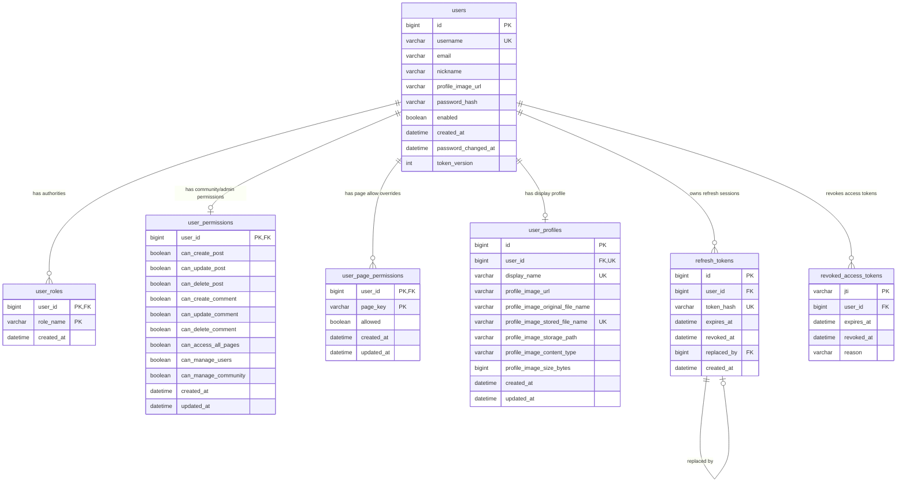
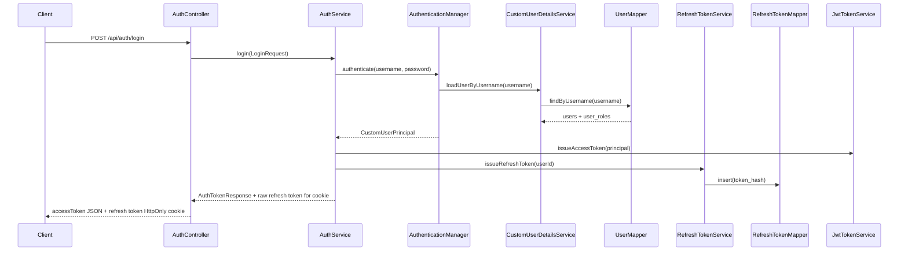
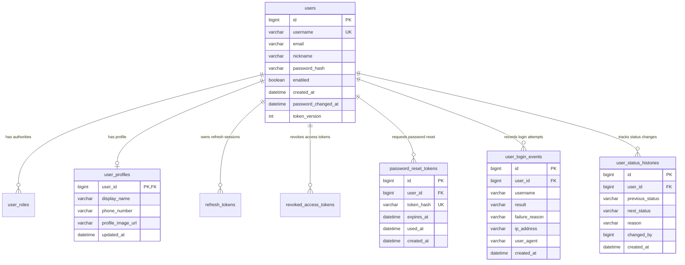

# 회원 관리 ERD

> Status: Implemented + Extension candidates

## 목적

이 문서는 ZIP:ON 로그인과 회원 관리에 필요한 DB 관계를 Mermaid ERD로 설명한다.

현재 구현된 인증 schema의 시작점은 `backend/src/main/resources/db/migration/V1__create_auth_schema.sql`이다. 커뮤니티 작성자 프로필 표시를 위해 `backend/src/main/resources/db/migration/V4__create_community_board_schema.sql`이 `users.profile_image_url`을 추가했고, `backend/src/main/resources/db/migration/V7__create_admin_user_permission_schema.sql`이 `user_permissions`, `user_page_permissions`를 추가했다. `backend/src/main/resources/db/migration/V39__create_user_profiles.sql`이 `user_profiles`를 별도 프로필 기준 테이블로 추가하고, `backend/src/main/resources/db/migration/V40__extend_user_profiles_for_uploaded_images.sql`은 업로드한 프로필 이미지 metadata를 `user_profiles`에 확장한다. 현재 애플리케이션 데이터 접근은 MyBatis mapper인 `UserMapper`, `UserPermissionMapper`, `UserProfileMapper`, `RefreshTokenMapper`, `RevokedAccessTokenMapper`가 담당한다.

이 문서는 두 범위를 구분한다.

```text
현재 구현됨:
- users
- user_profiles
- user_roles
- user_permissions
- user_page_permissions
- refresh_tokens
- revoked_access_tokens
- users.profile_image_url

회원 관리 확장 후보:
- password_reset_tokens
- user_login_events
- user_status_histories
```

확장 후보는 아직 migration으로 구현하지 않는다. 새 테이블이 필요해질 때 별도 Flyway migration과 MyBatis mapper를 추가해야 한다.

관련 문서:

- [인증 DB 스키마](/docs/architecture/security/AUTH_SCHEMA.md)
- [Spring Security JWT 인증 흐름](/docs/architecture/security/SECURITY_AUTHENTICATION.md)
- [로그인 검증 방법](/docs/operations/LOGIN_VERIFICATION_GUIDE.md)
- [MySQL 개발환경과 Flyway migration](/docs/operations/DOCKER_MYSQL_REDIS.md)
- [커뮤니티 게시판 백엔드 학습 문서](/docs/community/README.md)

## 현재 구현 ERD



## 현재 테이블 책임

### users

`users`는 로그인 계정의 중심 테이블이다.

주요 책임:

- `username`으로 로그인 사용자를 식별한다.
- `password_hash`에 BCrypt hash를 저장한다.
- `enabled`로 로그인 가능 여부를 표현한다.
- `nickname`, `profile_image_url`은 현재 커뮤니티/관리자 mapper 호환을 위한 표시 정보 동기화 컬럼이다.
- `password_changed_at`과 `token_version`은 향후 전체 access token 무효화 전략에 사용할 수 있다.

현재 쓰는 코드:

```text
AuthService.signUp(...)
CustomUserDetailsService.loadUserByUsername(...)
UserMapper.findByUsername(...)
UserMapper.findById(...)
```

주의:

- 비밀번호 원문은 저장하지 않는다.
- schema 기준은 `User` 클래스가 아니라 Flyway migration SQL이다. `users` 기본 구조는 `V1__create_auth_schema.sql`, `profile_image_url` 추가는 `V4__create_community_board_schema.sql`에 있다.
- `User`는 MyBatis가 값을 담는 plain Java object이며 JPA entity가 아니다.

### user_profiles

`user_profiles`는 로그인 계정의 화면 표시 정체성을 저장한다.

주요 책임:

- `display_name`에 전역 헤더와 마이페이지에서 보여줄 닉네임을 저장한다.
- `profile_image_url`에 프로필 이미지 URL을 저장한다.
- 업로드 이미지가 있으면 원본 파일명, 저장 파일명, local filesystem 경로, content type, 크기를 metadata로 저장한다.
- `display_name`은 unique이므로 같은 닉네임이 요청되면 `UserProfileService`가 숫자 suffix를 붙인다.
- 회원가입 또는 관리자 사용자 생성 때 닉네임이 없으면 `계약전탐정`, `등기부메모왕` 같은 ZIP:ON 맥락의 기본 닉네임을 배정한다.

현재 쓰는 코드:

```text
UserProfileService.createProfileForNewUser(...)
UserProfileService.updateProfile(...)
UserProfileService.uploadProfileImage(...)
UserProfileImageStorageService.store(...)
UserProfileMapper.findByUserId(...)
UserProfileMapper.insert(...)
UserProfileMapper.update(...)
UserProfileMapper.updateUploadedProfileImage(...)
UserMapper.updateProfileIdentity(...)
```

주의:

- `user_profiles`가 기준 테이블이다.
- `users.nickname`, `users.profile_image_url`은 기존 `CommunityPostMapper`, `CommunityCommentMapper`, `CommunityReportMapper`, `AdminUserMapper`가 바로 깨지지 않도록 유지하는 동기화 컬럼이다.
- 프로필 이미지 binary는 DB에 넣지 않고 `zipon.user.profile-images.storage-path` local filesystem 경로에 저장한다. 운영 전에는 S3/object storage 전환과 삭제 정책을 다시 결정해야 한다.

### user_roles

`user_roles`는 Spring Security authority를 저장한다.

현재 구현:

- 회원가입 시 `AuthService.signUp(...)`가 기본 `ROLE_USER`를 저장한다.
- `UserMapper.findByUsername(...)`는 `user_roles`에서 role 하나를 읽어 `User.roleName`에 매핑한다.

확장 방향:

- 현재 Java model은 대표 role 하나만 읽는다.
- 여러 role을 access token에 모두 넣으려면 `User.roleName`을 collection 구조로 바꾸고 mapper query도 확장해야 한다.

### user_permissions

`user_permissions`는 커뮤니티 작성/수정/삭제 권한과 관리자 화면 보조 권한을 사용자별로 저장한다.

현재 쓰는 코드:

```text
UserPermissionService.createDefaultPermissions(...)
UserPermissionService.updatePermissions(...)
UserPermissionMapper.findByUserId(...)
UserPermissionMapper.updatePermissions(...)
AdminUserService.updatePermissions(...)
CommunityPolicyAutomationService
CommunityPolicyOperationsService
```

주의:

- 이 테이블은 Spring Security URL matcher를 대체하지 않는다.
- `/api/admin/**` 접근의 최종 방어선은 `SecurityConfig`의 role authority matcher다.
- `user_permissions`는 커뮤니티 작성 가능 여부, 관리자 화면 세부 기능, 커뮤니티 정책 제재 복구 같은 도메인 권한 상태를 보조한다.

### user_page_permissions

`user_page_permissions`는 사용자별 화면 접근 override를 저장한다.

현재 쓰는 코드:

```text
UserPermissionService.replacePagePermissions(...)
UserPermissionMapper.findPagePermissionsByUserId(...)
UserPermissionMapper.insertPagePermission(...)
AdminUserController.updatePermissions(...)
```

주의:

- 이 값은 프론트 화면 노출과 사용자 경험을 돕는 보조 권한이다.
- 보안이 필요한 backend API는 별도 URL authorization과 service-level 권한 검사를 유지해야 한다.

### refresh_tokens

`refresh_tokens`는 refresh token의 원문이 아니라 SHA-256 digest를 저장한다.

주요 책임:

- 로그인 시 refresh token digest를 저장한다.
- refresh 요청마다 refresh token을 rotation한다.
- 이전 refresh token은 `revoked_at`과 `replaced_by`로 폐기 상태를 남긴다.
- logout 시 현재 refresh token을 폐기한다.

현재 쓰는 코드:

```text
RefreshTokenService.issueRefreshToken(...)
RefreshTokenService.rotate(...)
RefreshTokenService.revoke(...)
RefreshTokenMapper.findByTokenHash(...)
RefreshTokenMapper.markReplacedBy(...)
```

### revoked_access_tokens

`revoked_access_tokens`는 logout 이후 아직 만료되지 않은 access token을 막기 위한 denylist다.

주요 책임:

- logout 시 현재 access token의 `jti`를 저장한다.
- `JwtAuthenticationFilter`가 매 요청에서 `jti`가 denylist에 있는지 확인한다.
- `AccessTokenRevocationService`는 DB를 source of truth로 유지하되, `VolatileStateStore`에 `auth:access-token-revoked:{jti}` TTL cache를 넣어 반복 DB 조회를 줄인다.
- access token 원래 만료 시각이 지나면 정리 가능한 row가 된다.

현재 쓰는 코드:

```text
AccessTokenRevocationService.revoke(...)
AccessTokenRevocationService.isRevoked(...)
VolatileStateStore.get(...)
RevokedAccessTokenMapper.findActiveExpiresAtByJti(...)
JwtAuthenticationFilter.doFilterInternal(...)
```

### login rate limit

`LoginRateLimitService`는 username과 client key를 hash한 volatile key로 로그인 실패 횟수를 제한한다. 현재 `AuthController`는 신뢰되지 않은 forwarding header 대신 `HttpServletRequest.getRemoteAddr()` 값을 client key로 넘긴다. 기본값은 15분 동안 5회 실패이며, Redis가 꺼져 있으면 단일 backend 프로세스의 in-memory fallback에서만 동작한다.

## 로그인 중심 관계 흐름



## 회원 관리 확장 후보 ERD

아래 ERD는 아직 구현된 schema가 아니다. 회원 관리 요구가 커질 때 검토할 수 있는 방향이다.



## 확장 후보 테이블 설명

### user_profiles 추가 확장 후보

`user_profiles` 테이블 자체는 현재 구현되어 있다. 아래 항목은 현재 테이블을 더 확장할 때의 후보다.

사용 후보:

- 전화번호
- 마이페이지용 부가 정보

`users`에 모든 프로필 필드를 넣지 않는 이유:

- 로그인 인증에 필요한 정보와 화면 표시용 정보의 변경 주기가 다르다.
- 인증 코드는 `users.password_hash`, `users.enabled`, `user_roles` 같은 보안 필드에 집중해야 한다.

### password_reset_tokens

비밀번호 찾기/재설정을 만들 때 추가한다.

보안 규칙:

- token 원문을 저장하지 않고 hash만 저장한다.
- `expires_at`과 `used_at`으로 만료와 사용 여부를 구분한다.
- 사용 후에는 재사용할 수 없어야 한다.

### user_login_events

로그인 성공/실패 기록을 남기고 싶을 때 추가한다.

사용 후보:

- 비정상 로그인 탐지
- 관리자 감사 로그
- 사용자 보안 알림
- brute force 방어 정책의 근거 데이터

주의:

- 개인정보와 IP 주소를 저장할 때는 보존 기간과 접근 권한을 별도로 정해야 한다.

### user_status_histories

회원 정지, 탈퇴, 관리자 비활성화 같은 상태 변경 이력을 남기고 싶을 때 추가한다.

사용 후보:

- `enabled` 변경 사유 기록
- 관리자 조치 이력
- 계정 복구 근거

## 설계 판단

### 현재 구현에서 refresh token을 별도 테이블로 둔 이유

JWT access token은 stateless지만 refresh token은 서버가 상태를 관리해야 한다. 그래야 logout, refresh token rotation, 도난 의심 token 폐기가 가능하다. 그래서 `refresh_tokens`는 사용자별 로그인 세션에 가까운 역할을 한다.

### access token denylist를 둔 이유

access token은 이미 발급되면 만료 전까지 서명 검증만으로 유효하다. logout 직후 같은 access token을 계속 쓰지 못하게 하려면 `jti`를 서버 DB에 저장하고 매 요청마다 확인해야 한다.

### `token_version`이 아직 쓰이지 않는 이유

`users.token_version`은 전체 access token 무효화 후보이다. 예를 들어 비밀번호 변경 시 `token_version`을 증가시키고, access token claim에도 version을 넣어 비교할 수 있다. 현재는 logout의 현재 access token 차단만 구현했기 때문에 아직 사용하지 않는다.

## 남은 회원 관리 과제

- 여러 role을 collection으로 읽도록 `UserMapper`와 `CustomUserPrincipal` 확장
- 비밀번호 변경 API 구현
- 비밀번호 변경 시 `password_changed_at` 또는 `token_version` 기반 access token 무효화 구현
- 만료된 `refresh_tokens`, `revoked_access_tokens` 정리 job 추가
- 관리자 회원 비활성화/활성화 API 추가
- 로그인 성공/실패 이벤트 저장 여부 결정

## Learning path

1. First read: `backend/src/main/resources/db/migration/V1__create_auth_schema.sql`, `backend/src/main/resources/db/migration/V7__create_admin_user_permission_schema.sql`, `backend/src/main/resources/db/migration/V39__create_user_profiles.sql`, `backend/src/main/resources/db/migration/V40__extend_user_profiles_for_uploaded_images.sql`
2. Then inspect: `UserMapper`, `UserPermissionMapper`, `UserProfileMapper`, `RefreshTokenMapper`, `RevokedAccessTokenMapper`
3. Then inspect: `AuthService`, `UserPermissionService`, `UserProfileService`, `RefreshTokenService`, `AccessTokenRevocationService`
4. Then inspect: `JwtAuthenticationFilter`, `JwtTokenService`
5. Then run: `cd backend && ./mvnw -Dtest=AuthIntegrationTest test`
6. Then debug: `users`, `user_profiles`, `user_roles`, `user_permissions`, `user_page_permissions`, `refresh_tokens`, `revoked_access_tokens`
7. Key concept to understand: 회원 관리는 단순 `users` CRUD가 아니라 password hash, display profile, authority, page/domain permission, refresh token state, access token denylist가 함께 움직이는 보안 흐름이다.
