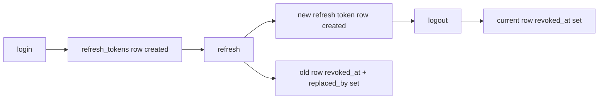

# 인증 DB 스키마

> Status: Implemented

## 목적

이 문서는 ZIP:ON 인증 기능이 사용하는 DB 테이블과 MyBatis mapper를 설명한다.

현재 저장소는 MyBatis-only persistence와 Flyway migration SQL을 기준으로 한다. 인증 schema의 source of truth는 `backend/src/main/resources/db/migration/V1__create_auth_schema.sql`이고, 로컬/학습용 seed data는 `backend/src/main/resources/db/migration/V3__seed_admin_and_demo_users.sql`와 `backend/src/main/resources/db/migration/V43__reseed_demo_users_by_user_table_cases.sql`에 있다. 커뮤니티 작성자 프로필 표시를 위해 `backend/src/main/resources/db/migration/V4__create_community_board_schema.sql`이 `users.profile_image_url`을 추가했고, 현재 프로필 기준 테이블은 `backend/src/main/resources/db/migration/V39__create_user_profiles.sql`의 `user_profiles`다. 업로드한 프로필 이미지의 파일 metadata는 `backend/src/main/resources/db/migration/V40__extend_user_profiles_for_uploaded_images.sql`이 `user_profiles`에 추가한다.

관련 흐름 문서: [Spring Security JWT 인증 흐름](/docs/architecture/security/SECURITY_AUTHENTICATION.md)

관련 ERD 문서: [회원 관리 ERD](/docs/architecture/security/AUTH_MEMBER_ERD.md)

관련 검증 문서: [로그인 검증 방법](/docs/operations/LOGIN_VERIFICATION_GUIDE.md)

관련 DB 실행 문서: [MySQL 개발환경과 Flyway migration](/docs/operations/DOCKER_MYSQL_REDIS.md)

관련 커뮤니티 문서: [커뮤니티 게시판 백엔드 학습 문서](/docs/community/README.md)

## 현재 스키마 생성 방식

```text
Flyway V1__create_auth_schema.sql
-> users / user_roles / refresh_tokens / revoked_access_tokens
Flyway V4__create_community_board_schema.sql
-> users.profile_image_url 추가
Flyway V39__create_user_profiles.sql
-> user_profiles 추가
-> 기존 users.nickname/profile_image_url backfill
Flyway V40__extend_user_profiles_for_uploaded_images.sql
-> user_profiles에 업로드 이미지 metadata 추가
-> MyBatis mapper SQL로 인증 데이터 읽기/쓰기

Flyway V3__seed_admin_and_demo_users.sql
-> admin 계정과 초기 demo_user 생성
-> user_roles에 ROLE_ADMIN / ROLE_USER 부여

Flyway V43__reseed_demo_users_by_user_table_cases.sql
-> 기존 demo_user_* 삭제
-> department_code, enabled, profile_image_url 존재 여부 조합별 100명씩 demo_user_001..demo_user_3600 재생성
-> user_roles, user_permissions, user_profiles 동기화

Flyway V19__grant_admin_all_permissions.sql
-> admin seed 계정에 UserRole enum의 운영 role 전체 부여

Flyway V29__create_admin_action_audit_logs.sql
-> 초기 관리자 감사 테이블 생성

Flyway V31__upgrade_admin_action_audit_logs_for_aop.sql
-> AOP 기반 운영 감사 컬럼, 결과 상태, 무결성 서명, 조회 인덱스 추가
```

JPA/Hibernate와 `ddl-auto`는 backend persistence에서 제거되었다. Domain object는 plain Java object이며, DB table/column/index/constraint는 migration SQL에 정의한다.

## users

Domain object: `backend/src/main/java/com/zipon/domain/User.java`

Mapper: `backend/src/main/java/com/zipon/mapper/UserMapper.java`

Migration: `backend/src/main/resources/db/migration/V1__create_auth_schema.sql`, `backend/src/main/resources/db/migration/V4__create_community_board_schema.sql`

Service owner: `backend/src/main/java/com/zipon/service/AuthService.java`

목적:

- 회원가입 사용자 계정을 저장한다.
- `CustomUserDetailsService`가 `UserMapper.findByUsername(...)`로 인증 사용자를 조회한다.

주요 컬럼:

```text
id                    PK, auto increment
username              로그인 ID, unique, not null
email                 선택 이메일
nickname              표시 이름 동기화 컬럼, 기준값은 user_profiles.display_name
profile_image_url     프로필 이미지 URL 동기화 컬럼, 기준값은 user_profiles.profile_image_url
password_hash         BCrypt hash, not null
enabled               로그인 가능 여부
created_at            계정 생성 시각
password_changed_at   비밀번호 변경 시각
token_version         향후 전체 token 무효화 전략 후보
```

제약과 인덱스:

- `uk_users_username`: username 중복 가입 방지
- `uk_users_username` unique index가 로그인 조회 경로도 지원한다.

주의:

- 비밀번호 원문은 저장하지 않는다.
- `AuthService.signUp(...)`가 `PasswordEncoder.encode(...)`로 `password_hash`를 만든다.
- `AuthService.signUp(...)`는 `UserMapper.insert(...)` 후 `UserMapper.insertRole(...)`로 기본 `ROLE_USER`를 저장한다.
- `CommunityPostMapper`와 `CommunityCommentMapper`는 작성자 응답을 만들 때 아직 `users.nickname`, `users.username`, `users.profile_image_url`을 읽는다. `UserProfileService`가 `user_profiles` 변경을 `users` 표시 컬럼에 동기화하는 이유가 이 호환 경로다.
- 비밀번호 해싱을 AOP로 숨기지 않는다. 보안상 중요한 변환은 회원가입 use case 안에서 보여야 코드 리뷰와 학습이 쉽다.

## user_profiles

Domain object: `backend/src/main/java/com/zipon/domain/UserProfile.java`

Mapper: `backend/src/main/java/com/zipon/mapper/UserProfileMapper.java`

Migration: `backend/src/main/resources/db/migration/V39__create_user_profiles.sql`, `backend/src/main/resources/db/migration/V40__extend_user_profiles_for_uploaded_images.sql`

Service owner: `backend/src/main/java/com/zipon/service/UserProfileService.java`

목적:

- 로그인 계정의 화면 표시 정체성을 인증 핵심 컬럼에서 분리한다.
- 닉네임과 프로필 이미지 URL을 마이페이지, 전역 헤더, 커뮤니티 작성자 표시에서 일관되게 사용한다.
- 닉네임 미입력 시 ZIP:ON 맥락의 기본 표시명을 배정하고, 중복 표시명이 있으면 숫자 suffix를 붙인다.
- 업로드한 프로필 이미지의 파일명, 저장 경로, content type, 크기 metadata를 DB에 남기되 binary 원본은 DB에 저장하지 않는다.

주요 컬럼:

```text
id                  PK, auto increment
user_id             users.id FK, unique
display_name        화면 표시 닉네임, unique, not null
profile_image_url   선택 프로필 이미지 URL
profile_image_original_file_name   사용자가 올린 원본 파일명
profile_image_stored_file_name     서버가 생성한 저장 파일명, unique
profile_image_storage_path         local filesystem 저장 경로
profile_image_content_type         image/png 같은 MIME type
profile_image_size_bytes           파일 크기, 0 이상
created_at          프로필 생성 시각
updated_at          프로필 수정 시각
```

전환 설계:

```text
UserProfileService
-> UserProfileMapper.insert/update(...)
-> UserMapper.updateProfileIdentity(...)
-> users.nickname/profile_image_url 동기화

UserProfileService.uploadProfileImage(...)
-> UserProfileImageStorageService.store(...)
-> UserProfileMapper.updateUploadedProfileImage(...)
-> UserMapper.updateProfileIdentity(...)
-> GET /api/users/profile-images/{userId}/{storedFileName}로 avatar 표시
```

장기적으로 커뮤니티/관리자 mapper가 `user_profiles`를 직접 join하면 `users.nickname`과 `users.profile_image_url`은 제거 후보가 된다. 현재는 기존 mapper를 한 번에 흔들지 않기 위해 동기화 컬럼으로 유지한다.

## Seed accounts

Migration: `backend/src/main/resources/db/migration/V3__seed_admin_and_demo_users.sql`, `backend/src/main/resources/db/migration/V43__reseed_demo_users_by_user_table_cases.sql`

목적:

- 로컬 개발과 학습용 테스트에서 바로 로그인할 수 있는 계정을 제공한다.
- 권한별 인증 흐름을 빠르게 확인할 수 있도록 관리자 계정과 일반 사용자 계정을 함께 만든다.

생성되는 계정:

| username | raw password | role | 설명 |
| --- | --- | --- | --- |
| `admin` | `admin` | `ROLE_ADMIN` + 운영 role 전체 | 관리자 접근 규칙을 검증하는 root seed 계정 |
| `demo_user_001`..`demo_user_3600` | `password123` | `ROLE_USER` | 목록/검색/마이페이지와 관리자 사용자 목록의 상태/부서/프로필 조합 확인용 계정 |

`V43__reseed_demo_users_by_user_table_cases.sql`의 데모 사용자 조합은 아래 규칙을 따른다.

```text
department_code 9종
enabled TRUE/FALSE
profile_image_url NULL/non-NULL
각 조합 100명
총 9 * 2 * 2 * 100 = 3600명
```

순서는 `department_code -> enabled -> profile_image_url -> case 내부 번호`로 고정되어 있다. 랜덤처럼 다양한 닉네임, 생성 시각, token_version, profile URL을 갖지만 SQL `RAND()`를 쓰지 않으므로 테스트와 로컬 DB에서 재현 가능하다.

보안 주의:

- migration에는 원문 비밀번호가 아니라 BCrypt hash만 저장한다.
- `admin/admin`은 기억하기 쉬운 로컬 학습용 조합이다. 운영 DB에 이 seed를 그대로 적용하면 안 된다.
- `V3__seed_admin_and_demo_users.sql`은 기존 `admin` row가 있으면 `password_hash`, `enabled`, `password_changed_at`을 관리자 seed 기준으로 맞춘다.
- `V43__reseed_demo_users_by_user_table_cases.sql`은 관리자 `admin`은 유지하고 `demo_user_*` seed row만 재구성한다. 데모 사용자는 모두 `ROLE_USER`이며, 부서 코드는 사용자 목록/필터/정렬 검증을 위한 표시 데이터다.
- 현재 구현은 `User.roleName`을 대표 role로 유지하되, `UserMapper.findRoleNamesByUserId(...)`로 사용자별 role 목록을 읽어 `CustomUserPrincipal` authority로 반영한다.
- `SecurityConfig`는 `/api/admin/users/**`, `/api/admin/community/**`, `/api/admin/rent-risk-diagnoses/**`, `/api/admin/external-api-*`를 `UserRole`의 업무별 authority set으로 나누어 보호한다.

## user_roles

Domain object: 별도 public domain object 없이 `User.roleName`으로 현재 대표 role을 읽는다.

Mapper: `backend/src/main/java/com/zipon/mapper/UserMapper.java`

Service owner: `backend/src/main/java/com/zipon/service/AuthService.java`

목적:

- 사용자의 Spring Security authority를 저장한다.
- 회원가입과 관리자 사용자 생성/role 변경 use case는 한 번에 하나의 대표 role을 부여한다.
- 로컬 root `admin` 계정은 `V19__grant_admin_all_permissions.sql`에서 운영 role 전체를 함께 부여받는다.
- 실제 인증 principal은 `UserMapper.findRoleNamesByUserId(...)`로 해당 사용자의 모든 role row를 읽어 authority로 반영한다.
- schema는 `(user_id, role_name)` 복합 primary key라 이후 여러 role로 확장할 수 있다.

주요 컬럼:

```text
user_id     users.id FK
role_name   ROLE_USER, ROLE_ADMIN 같은 Spring Security authority
created_at  role 부여 시각
```

제약과 인덱스:

- PK `(user_id, role_name)`: 같은 사용자에게 같은 role 중복 부여 방지
- `fk_user_roles_user`: users row 삭제 시 role도 함께 삭제
- `idx_user_roles_role_name`: role 기준 조회 후보

Mapper 연결:

```text
UserMapper.findByUsername(...)
-> users 조회
-> user_roles에서 role_name 하나를 subquery로 읽음
-> User.roleName에 매핑

CustomUserDetailsService.loadUserByUsername(...)
-> UserMapper.findRoleNamesByUserId(userId)
-> CustomUserPrincipal authority 목록으로 모든 role row 반영

JwtAuthenticationFilter.requireActiveUser(...)
-> access token claim만 믿지 않고 UserMapper.findById(userId)로 현재 사용자 상태 확인
-> UserMapper.findRoleNamesByUserId(userId)로 현재 DB role 목록을 다시 읽어 Authentication 생성

AdminUserService.updateRole(...)
-> adminUserMapper.deleteRoles(userId)
-> adminUserMapper.insertRole(userId, selectedRole)
```

주의:

- `User.roleName`과 관리자 목록의 `role_name`은 대표 표시값이다. root `admin`처럼 여러 role row가 있는 계정의 전체 권한 목록은 `findRoleNamesByUserId(...)` 결과를 기준으로 봐야 한다.
- 관리자 화면의 일반 role 변경은 기존 role row를 지우고 선택한 role 하나를 다시 넣는다. root `admin`은 `AdminUserService.requireMutableNonRootAdmin(...)`로 role/permission/탈퇴 변경이 막힌다.

## refresh_tokens

Domain object: `backend/src/main/java/com/zipon/domain/RefreshToken.java`

Mapper: `backend/src/main/java/com/zipon/mapper/RefreshTokenMapper.java`

Service owner: `backend/src/main/java/com/zipon/service/RefreshTokenService.java`

목적:

- refresh token 원문 대신 SHA-256 digest를 저장한다.
- refresh token 만료, 폐기, rotation 상태를 추적한다.

주요 컬럼:

```text
id            PK, auto increment
user_id       users.id 값
token_hash    refresh token SHA-256 digest, unique, not null
expires_at    refresh token 만료 시각
revoked_at    폐기 시각, null이면 아직 사용 가능 후보
replaced_by   rotation 후 새 refresh_tokens.id
created_at    발급 시각
```

제약과 인덱스:

- `token_hash` unique: 같은 refresh token digest 중복 방지
- `uk_refresh_tokens_token_hash`: refresh token 검증 조회 경로도 지원
- `idx_refresh_tokens_user_id`: 사용자별 token 추적 후보
- `idx_refresh_tokens_expires_at`: 만료 token 정리 후보
- `idx_refresh_tokens_replaced_by`: rotation chain 추적 후보
- `fk_refresh_tokens_user`: users row와의 무결성
- `fk_refresh_tokens_replaced_by`: 새 refresh token row와의 연결

생명주기:



재사용 방지:

- `RefreshTokenService.rotate(...)`는 기존 refresh token이 active일 때만 새 token을 발급한다.
- rotation 후 이전 token은 `revoked_at`과 `replaced_by`가 채워진다.
- 이전 refresh token을 다시 쓰면 401로 실패한다.

## revoked_access_tokens

Domain object: `backend/src/main/java/com/zipon/domain/RevokedAccessToken.java`

Mapper: `backend/src/main/java/com/zipon/mapper/RevokedAccessTokenMapper.java`

Service owner: `backend/src/main/java/com/zipon/service/AccessTokenRevocationService.java`

목적:

- JWT access token은 stateless라서 발급 후 만료 전까지 자체적으로 유효하다.
- 로그아웃 직후에도 같은 access token이 남아 있을 수 있으므로 `jti` denylist로 막는다.

주요 컬럼:

```text
jti          JWT ID, PK
user_id      users.id 값
expires_at   access token 원래 만료 시각
revoked_at   폐기 시각
reason       LOGOUT 같은 폐기 이유
```

제약과 인덱스:

- `jti` PK: 같은 access token 폐기 기록 중복 방지
- `idx_revoked_access_tokens_user_id`: 사용자별 폐기 기록 조회 후보
- `idx_revoked_access_tokens_expires_at`: 만료된 denylist 정리 작업 후보
- `fk_revoked_access_tokens_user`: users row와의 무결성

요청 검증:

```text
JwtAuthenticationFilter
-> JwtTokenService.decode(...)
-> AccessTokenRevocationService.isRevoked(jti)
-> VolatileStateStore.get(auth:access-token-revoked:{jti})
-> RevokedAccessTokenMapper.findActiveExpiresAtByJti(...)
```

`revoked_access_tokens`는 여전히 source of truth다. `VolatileStateStore`는 만료 가능한 cache일 뿐이며, Redis가 꺼져 있거나 장애가 나도 DB 조회로 logout denylist가 유지된다.

## admin_action_audit_logs

Domain object: `backend/src/main/java/com/zipon/domain/AdminActionAuditLog.java`

Mapper: `backend/src/main/java/com/zipon/mapper/AdminActionAuditLogMapper.java`

Service owner: `backend/src/main/java/com/zipon/service/AdminActionAuditLogService.java`

Migration: `backend/src/main/resources/db/migration/V29__create_admin_action_audit_logs.sql`, `backend/src/main/resources/db/migration/V31__upgrade_admin_action_audit_logs_for_aop.sql`

목적:

- 관리자 사용자 관리와 커뮤니티 moderation 같은 운영 변경의 성공/실패 증거를 저장한다.
- `@AdminAudit`가 붙은 service method를 `AdminAuditAspect`가 감싸고, `AdminActionAuditLogMapper.insert(...)`로 저장한다.
- 운영자가 누가, 언제, 어떤 대상에, 어떤 변경을 시도했고, 실패했다면 왜 실패했는지 조회할 수 있게 한다.
- 비밀번호, token, Authorization header, client IP 원문 같은 민감정보는 저장하지 않는다.

주요 컬럼:

```text
id                    PK, auto increment
request_id            RequestCorrelationFilter가 만든 요청 추적 ID
actor_user_id         작업을 시도한 users.id, 사용자 삭제 시 null 가능
actor_username        작업 시점 username snapshot
actor_roles           작업 시점 authority snapshot
action_type           USER_ROLE_UPDATE, COMMUNITY_POST_HIDE 같은 행위 enum
target_type           USER, COMMUNITY_REPORT, COMMUNITY_POST, COMMUNITY_COMMENT
target_id             대상 ID 문자열
result_status         SUCCESS 또는 FAILURE
failure_code          실패 시 ErrorCode 또는 예외 분류
failure_message       실패 메시지, 최대 500자
request_summary_json  AuditPayloadSanitizer가 만든 민감정보 제거 요청 요약
changed_fields_json   변경 필드 요약
client_ip_hash        client IP HMAC hash, 원문 IP 아님
user_agent_summary    user-agent 요약
duration_millis       작업 소요 시간
integrity_signature   감사 행 주요 필드 HMAC-SHA256 signature
created_at            감사 행 생성 시각
```

제약과 인덱스:

- `fk_admin_action_audit_logs_actor`: actor user와의 참조 무결성. 사용자가 삭제되면 audit row는 남기고 `actor_user_id`만 null로 둔다.
- `chk_admin_action_audit_result_status`: `SUCCESS`, `FAILURE` 외 값 방지.
- `idx_admin_action_audit_logs_created_at`: 최신 감사 로그 조회.
- `idx_admin_action_audit_logs_actor_created_at`: actor 기준 운영 이력 조회.
- `idx_admin_action_audit_logs_action_created_at`: action type 기준 조회.
- `idx_admin_action_audit_logs_target`: target type/id 기준 조회.
- `idx_admin_action_audit_logs_result_created_at`: 성공/실패 상태 기준 조회.

생명주기:

```text
관리자 운영 API 요청
-> RequestCorrelationFilter가 requestId 생성 또는 수용
-> SecurityConfig/JWT 인증과 인가 통과
-> @AdminAudit service method 실행
-> SUCCESS 또는 FAILURE audit row insert
-> GET /api/admin/audit-logs로 제한 조회
```

이관 정책:

- `V29__create_admin_action_audit_logs.sql`은 예전 수동 감사 로그 형식의 테이블을 만든다.
- `V31__upgrade_admin_action_audit_logs_for_aop.sql`은 같은 테이블을 AOP 운영 감사 형식으로 확장한다.
- 기존 V29 형식 행은 `request_id=legacy-{id}`, `target_type=USER`, `target_id=target_user_id`, `result_status=SUCCESS`, `integrity_signature=legacy-unverified`로 이관한다.
- legacy row는 조회할 수 있지만 `AuditIntegritySigner.matches(...)` 검증은 실패할 수 있다. 이는 기존 row에 서명이 없었기 때문이다.

## Login failure rate limit

Service owner: `backend/src/main/java/com/zipon/service/LoginRateLimitService.java`

Volatile state owner: `backend/src/main/java/com/zipon/service/VolatileStateStore.java`

목적:

- 같은 username과 client key 조합에서 짧은 시간 동안 비밀번호 실패가 반복되면 인증 시도를 막는다.
- 현재 client key는 `AuthController`가 `HttpServletRequest.getRemoteAddr()`에서 얻는다. 신뢰된 proxy 설정 없이 `X-Forwarded-For` 같은 요청 header를 그대로 rate limit key로 믿지 않는다.
- key에는 username/IP 원문을 저장하지 않고 SHA-256 hash를 사용한다.
- Redis가 활성화되면 여러 backend 인스턴스가 실패 횟수를 공유할 수 있고, 기본 설정에서는 in-memory fallback으로 단일 프로세스에서만 동작한다.

설정:

```text
zipon.security.login-rate-limit.enabled
zipon.security.login-rate-limit.max-failures
zipon.security.login-rate-limit.window
ZIPON_REDIS_ENABLED
ZIPON_REDIS_KEY_PREFIX
```

## 운영상 남은 과제

- 만료된 `revoked_access_tokens`와 오래된 revoked `refresh_tokens`를 정리하는 scheduled job을 추가한다.
- `token_version` 또는 `password_changed_at` 기반 전체 access token 무효화 전략을 별도 과제로 구현한다.
- 여러 role을 응답/토큰 claim에 모두 반영하려면 `User.roleName` 단일 값 모델을 확장한다.

## 테스트

테스트 파일:

```text
backend/src/test/java/com/zipon/AuthIntegrationTest.java
backend/src/test/java/com/zipon/SeedUserIntegrationTest.java
backend/src/test/java/com/zipon/AdminActionAuditLogIntegrationTest.java
```

검증하는 DB 관련 동작:

- Flyway migration으로 auth tables가 생성되는 흐름
- 회원가입 시 `users.password_hash`와 `user_roles.role_name`이 저장되는 흐름
- username 중복 가입 409
- refresh token rotation 후 이전 refresh token 재사용 401
- logout 후 refresh token 재사용 401
- logout 후 access token `jti` denylist 적용 401
- Flyway V29/V31 순서로 `admin_action_audit_logs`가 생성/확장되는 흐름
- 관리자 운영 변경 성공/실패 audit row 저장
- 감사 payload에서 password, confirmationPassword, Authorization 원문 제거
- `integritySignatureValid` 검증
- `ROLE_AUDIT_MANAGER`의 감사 조회 허용과 사용자 관리 API 403 차단
- seed admin 계정이 `admin/admin`으로 로그인되고 JWT roles claim에 `ROLE_ADMIN`을 포함한 운영 role 목록이 들어가는 흐름
- seed demo 사용자 3600명, 36개 `users` 테이블 조합, `ROLE_USER`, `user_permissions`, `user_profiles`가 생성되는 흐름
- `/api/address-search/**`는 Juso 팝업/검색 공개 endpoint이므로 `SecurityConfig`에서 `permitAll()` 처리하고, `JwtAuthenticationFilter.shouldNotFilter(...)`에서도 제외한다. `permitAll()`보다 커스텀 JWT 필터가 먼저 실행되기 때문에 stale bearer token이 붙은 공개 요청도 401로 막히지 않게 하기 위한 보정이다.

## Learning path

1. First read: `User`, `UserProfile`, `RefreshToken`, `RevokedAccessToken`, `AdminActionAuditLog`
2. Then inspect: `UserMapper`, `UserProfileMapper`, `RefreshTokenMapper`, `RevokedAccessTokenMapper`, `AdminActionAuditLogMapper`
3. Then run: `cd backend && ./mvnw -Dtest=AuthIntegrationTest,SeedUserIntegrationTest,AdminActionAuditLogIntegrationTest test`
4. Then debug: `flyway_schema_history`, `V1__create_auth_schema.sql`, `V3__seed_admin_and_demo_users.sql`, `V19__grant_admin_all_permissions.sql`, `V29__create_admin_action_audit_logs.sql`, `V31__upgrade_admin_action_audit_logs_for_aop.sql`, `V43__reseed_demo_users_by_user_table_cases.sql`, mapper SQL
5. Key concept to understand: schema 생성 책임은 Flyway migration으로, 데이터 접근 책임은 MyBatis mapper SQL로 이동해야 한다.
