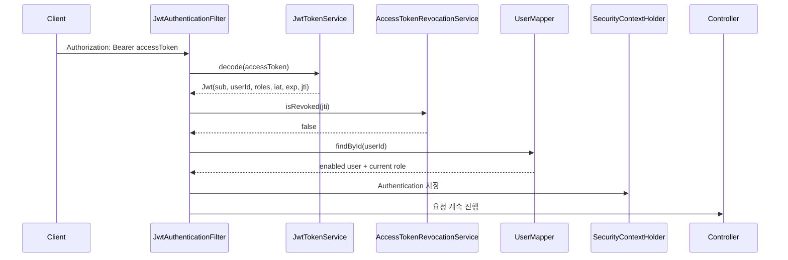
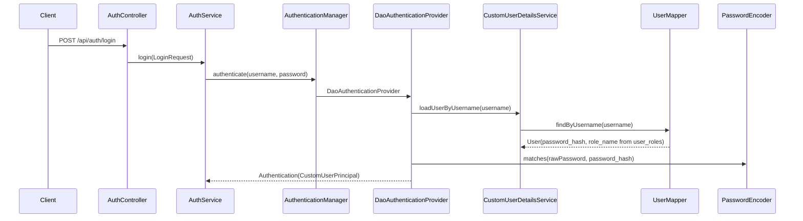
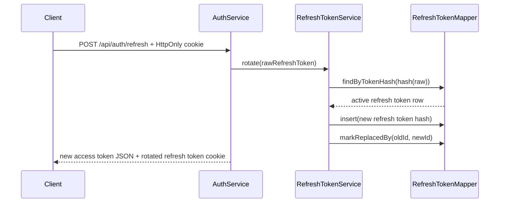
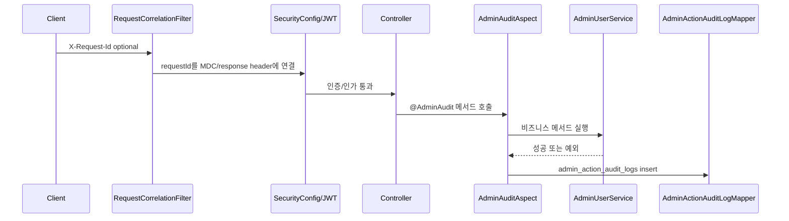

# Spring Security JWT 인증 흐름

> Status: Implemented

## 목적

이 문서는 ZIP:ON의 Spring Security + JWT + MyBatis 인증 구현을 설명한다.

관련 DB 문서: [인증 DB 스키마](/docs/architecture/security/AUTH_SCHEMA.md)

관련 ERD 문서: [회원 관리 ERD](/docs/architecture/security/AUTH_MEMBER_ERD.md)

관련 검증 문서: [로그인 검증 방법](/docs/operations/LOGIN_VERIFICATION_GUIDE.md)

## 구현된 API

| Method | Path | 인증 | 역할 |
| --- | --- | --- | --- |
| `POST` | `/api/auth/signup` | 불필요 | username/password 회원가입 |
| `POST` | `/api/auth/login` | 불필요 | username/password 로그인 후 token 발급 |
| `POST` | `/api/auth/refresh` | 불필요 | refresh token rotation 후 새 token 발급 |
| `POST` | `/api/auth/logout` | refresh cookie 필요 | refresh token 폐기와 가능한 경우 access token jti denylist 기록 |
| `GET` | `/api/address-search/juso` | 불필요 | Juso 직접 주소검색 backend proxy |
| `GET` | `/api/address-search/juso-popup` | 불필요 | Juso 주소 팝업 HTML launch |
| `GET/POST` | `/api/address-search/juso-popup/callback` | 불필요 | Juso 주소 팝업 callback HTML |
| `GET` | `/api/diagnosis-purposes` | 불필요 | MVP/확장 진단 목적 catalog 조회 |
| `POST` | `/api/regional-indicator-analyses` | 불필요 | 지역·유형 과거 지표 분석 생성 |
| `POST` | `/api/rent-risk-diagnoses` | 불필요 | 정확 주소 전세·월세 위험진단 생성 |
| `POST` | `/api/rent-risk-diagnoses/address-candidates` | 불필요 | 정확 주소 과거 전월세 후보 조회 |
| `GET` | `/api/rent-risk-diagnoses` | 필요 | 내 위험진단 이력 목록 조회 |
| `GET` | `/api/rent-risk-diagnoses/{diagnosisId}` | 필요 | 내 위험진단 이력 상세 조회 |
| `GET` | `/api/users/me` | 필요 | 현재 JWT principal 확인 |
| `PUT` | `/api/users/me/profile` | 필요 | 현재 사용자의 닉네임과 프로필 이미지 URL 수정 |
| `POST` | `/api/users/me/profile-image` | 필요 | 현재 사용자의 프로필 이미지 파일 업로드 |
| `GET` | `/api/users/profile-images/{userId}/{storedFileName}` | 불필요 | 저장된 프로필 이미지 binary 조회 |
| `GET/PUT` | `/api/map/field-checks` | 필요 | 로그인 사용자의 진단 지도 현장 확인 기록 조회/저장 |
| `GET` | `/api/admin/users` | 관리자 사용자 관리 authority | 관리자 사용자 목록 조회 |
| `POST` | `/api/admin/users` | 관리자 사용자 관리 authority | 관리자 사용자 추가 |
| `PUT` | `/api/admin/users/{userId}/role` | 관리자 사용자 관리 authority | 사용자 role 변경 |
| `PUT` | `/api/admin/users/{userId}/permissions` | 관리자 사용자 관리 authority | 사용자 글/댓글/page 권한 변경 |
| `DELETE` | `/api/admin/users/{userId}` | 관리자 사용자 관리 authority | 회원 탈퇴 처리 |
| `PUT` | `/api/admin/users/{userId}/enable` | 관리자 사용자 관리 authority | 탈퇴 회원 복구 |
| `GET` | `/api/admin/audit-logs` | 감사 조회 authority | 관리자 운영 변경 감사 로그 조회 |
| `GET` | `/api/admin/external-api-call-logs` | 외부 API 운영 authority | 외부 API 호출 운영 로그 조회 |
| `GET` | `/api/admin/external-api-health` | 외부 API 운영 authority | 외부 API 세부 헬스체크 |
| `GET` | `/api/admin/external-data-status` | 외부 API 운영 authority | 외부 데이터 수집 상태 조회 |
| `GET` | `/api/admin/volatile-state-alerts` | 운영 authority | volatile state 운영 알림 조회 |
| `GET` | `/api/rent-risk-diagnoses/{diagnosisId}/registry-document-confirmation` | 필요 | 본인 위험진단 이력의 등기부등본 수동 확인 상태 조회 |
| `PUT` | `/api/rent-risk-diagnoses/{diagnosisId}/registry-document-confirmation` | 필요 | 본인 위험진단 이력의 등기부등본 수동 확인 상태 저장 |
| `GET` | `/api/notifications` | 필요 | 로그인 사용자의 DB 알림 조회 |

공통 성공 응답은 `ApiResponse`를 사용한다. 인증/인가 실패는 Spring Security handler가 `ErrorResponse`와 같은 필드 구조의 JSON을 반환한다.

## 로컬 seed 계정

`backend/src/main/resources/db/migration/V3__seed_admin_and_demo_users.sql`은 로컬 개발과 학습 검증용 기본 계정을 만들고, `backend/src/main/resources/db/migration/V43__reseed_demo_users_by_user_table_cases.sql`은 기존 `demo_user_*`를 지운 뒤 `users` 테이블 조합 검증용 데모 계정으로 다시 만든다.

| username | password | authority | 용도 |
| --- | --- | --- | --- |
| `admin` | `admin` | `ROLE_ADMIN` + 운영 role 전체 | 관리자 인가 규칙 확인 |
| `demo_user_001`..`demo_user_3600` | `password123` | `ROLE_USER` | 일반 사용자 로그인과 `department_code`, `enabled`, `profile_image_url` 조합별 화면 데이터 확인 |

데모 사용자는 `department_code` 9종, `enabled` 2종, `profile_image_url` 존재 여부 2종의 36개 조합마다 100명씩 생성된다. `department_code`는 화면 필터와 정렬 검증을 위한 사용자 속성이며, 데모 사용자의 실제 Spring Security authority는 모두 `ROLE_USER`다.

원문 비밀번호는 DB에 저장하지 않고 BCrypt hash만 `users.password_hash`에 저장한다. `admin/admin`은 의도적으로 약한 로컬 학습용 계정이므로 운영 DB에 이 seed를 적용하지 않는다.

`ProductionSecurityStartupValidator`는 `prod` 또는 `production` profile에서 시작할 때 DB의 `users` 테이블을 확인한다. 기본 `admin/admin` BCrypt hash 또는 `demo_user_*` 계정이 남아 있으면 `IllegalStateException`으로 서버 시작을 중단한다. 이 가드는 학습용 Flyway seed가 운영 서비스로 흘러가는 것을 막기 위한 fail-fast 장치다.

## 핵심 파일

```text
backend/src/main/java/com/zipon/config/SecurityConfig.java
backend/src/main/java/com/zipon/web/RequestCorrelationFilter.java
backend/src/main/java/com/zipon/audit/AdminAudit.java
backend/src/main/java/com/zipon/audit/AdminAuditAspect.java
backend/src/main/java/com/zipon/audit/OperationLog.java
backend/src/main/java/com/zipon/audit/OperationLoggingAspect.java
backend/src/main/java/com/zipon/audit/AuditPayloadSanitizer.java
backend/src/main/java/com/zipon/audit/AuditIntegritySigner.java
backend/src/main/java/com/zipon/controller/AuthController.java
backend/src/main/java/com/zipon/controller/UserController.java
backend/src/main/java/com/zipon/controller/AdminActionAuditLogController.java
backend/src/main/java/com/zipon/service/AuthService.java
backend/src/main/java/com/zipon/service/UserProfileService.java
backend/src/main/java/com/zipon/service/UserProfileImageStorageService.java
backend/src/main/java/com/zipon/service/RefreshTokenService.java
backend/src/main/java/com/zipon/service/AccessTokenRevocationService.java
backend/src/main/java/com/zipon/service/AdminUserService.java
backend/src/main/java/com/zipon/service/AdminActionAuditLogService.java
backend/src/main/java/com/zipon/service/UserPermissionService.java
backend/src/main/java/com/zipon/service/RegistryDocumentConfirmationService.java
backend/src/main/java/com/zipon/security/JwtAuthenticationFilter.java
backend/src/main/java/com/zipon/security/JwtTokenService.java
backend/src/main/java/com/zipon/security/CustomUserDetailsService.java
backend/src/main/java/com/zipon/security/CustomUserPrincipal.java
backend/src/main/java/com/zipon/security/ProductionSecurityStartupValidator.java
backend/src/main/java/com/zipon/mapper/UserMapper.java
backend/src/main/java/com/zipon/mapper/UserProfileMapper.java
backend/src/main/java/com/zipon/mapper/AdminUserMapper.java
backend/src/main/java/com/zipon/mapper/AdminActionAuditLogMapper.java
backend/src/main/java/com/zipon/mapper/UserPermissionMapper.java
backend/src/main/java/com/zipon/mapper/RefreshTokenMapper.java
backend/src/main/java/com/zipon/mapper/RevokedAccessTokenMapper.java
backend/src/main/java/com/zipon/mapper/RegistryDocumentConfirmationMapper.java
backend/src/test/java/com/zipon/AuthIntegrationTest.java
backend/src/test/java/com/zipon/AdminUserIntegrationTest.java
backend/src/test/java/com/zipon/AdminActionAuditLogIntegrationTest.java
backend/src/test/java/com/zipon/RentRiskDiagnosisHistoryIntegrationTest.java
backend/src/test/java/com/zipon/config/SecurityConfigTest.java
backend/src/test/java/com/zipon/security/ProductionSecurityStartupValidatorTest.java
```

## Security filter chain

`SecurityConfig.securityFilterChain(...)`가 URL별 접근 규칙을 선언한다.

중요한 규칙:

```text
POST /api/auth/signup, /api/auth/login, /api/auth/refresh, /api/auth/logout
-> permitAll

GET /api/address-search/juso, /api/address-search/juso-popup, /api/address-search/juso-popup/callback
POST /api/address-search/juso-popup/callback
-> permitAll

GET /api/health
-> permitAll

GET /api/properties/**, /api/regions/**, /api/search/**, /api/environment/**, /api/map/**
-> permitAll

GET /api/map/field-checks
-> SecurityConfig URL matcher는 GET /api/map/**로 permitAll이지만, MapFieldCheckService.requirePrincipal(...)가 로그인 사용자만 허용한다.

PUT /api/map/field-checks
-> 인증 필요, MapFieldCheckService에서 requester_user_id와 favorite/diagnosis ownership을 검증한다.

GET /api/diagnosis-purposes
-> permitAll

GET /api/users/profile-images/**
-> permitAll

POST /api/rent-risk-diagnoses
-> permitAll

POST /api/rent-risk-diagnoses/address-candidates
-> permitAll

POST /api/regional-indicator-analyses
-> permitAll

GET /api/rent-risk-diagnoses, /api/rent-risk-diagnoses/*
-> 인증 필요, 서비스/mapper에서 requester_user_id로 본인 이력만 조회

GET/PUT /api/rent-risk-diagnoses/*/registry-document-confirmation
-> 인증 필요, RegistryDocumentConfirmationService에서 requester_user_id로 본인 이력만 조회/저장

GET /api/community/posts/**
-> permitAll

/api/admin/users/**
-> AuthorityCode.USER_MANAGE
-> ROLE_ADMIN, ROLE_DEVELOPER_ADMIN, ROLE_SYSTEM_ADMIN

/api/admin/external-api-call-logs/**, /api/admin/external-api-health/**, /api/admin/external-data-status/**
-> AuthorityCode.EXTERNAL_API_READ
-> ROLE_ADMIN, ROLE_DEVELOPER_ADMIN, ROLE_SYSTEM_ADMIN, ROLE_EXTERNAL_API_MANAGER

/api/admin/volatile-state-alerts/**
-> UserRole.OPERATOR_AUTHORITIES
-> UserRole에서 operatorRole=true인 운영 role 전체

/api/admin/rent-risk-diagnoses/**
-> AuthorityCode.DIAGNOSIS_DATA_READ
-> ROLE_ADMIN, ROLE_DEVELOPER_ADMIN, ROLE_SYSTEM_ADMIN, ROLE_DATA_MANAGER

/api/admin/community/**
-> AuthorityCode.COMMUNITY_MODERATE
-> ROLE_ADMIN, ROLE_SYSTEM_ADMIN, ROLE_OPERATION_MANAGER, ROLE_CS_MANAGER

/api/admin/audit-logs/**
-> AuthorityCode.AUDIT_LOG_READ
-> ROLE_ADMIN, ROLE_DEVELOPER_ADMIN, ROLE_SYSTEM_ADMIN, ROLE_AUDIT_MANAGER

fallback /api/admin/**
-> AuthorityCode.ADMIN_SYSTEM_ACCESS
-> ROLE_ADMIN, ROLE_DEVELOPER_ADMIN, ROLE_SYSTEM_ADMIN

/api/users/me, /api/users/me/profile, /api/users/me/profile-image, /api/favorites/**
-> 인증 필요

GET /api/notifications
-> 인증 필요

POST/PUT/DELETE /api/community/posts/**
POST/PUT/DELETE /api/community/comments/**
-> 인증 필요
```

요청 처리 흐름:



Bearer token이 없으면 filter는 인증을 만들지 않고 다음 filter로 넘긴다. 이후 URL이 보호 대상이면 `JwtAuthenticationEntryPoint`가 401을 반환한다.

`JwtAuthenticationFilter`는 JWT claim만 믿지 않고 `UserMapper.findById(...)`로 현재 사용자 상태를 다시 확인한다. 그래서 관리자가 `AdminUserService.withdrawUser(...)`로 `users.enabled = false`를 만들면 이미 발급된 access token도 다음 요청부터 401이 된다. role 변경도 다음 요청부터 DB의 현재 role을 principal authority로 사용한다.

## 로그인 흐름

`AuthController.login(...)`은 password를 직접 비교하지 않는다.



`ProviderManager`는 실제로 여러 `AuthenticationProvider` 후보를 순서대로 시도할 수 있는 관리자이다. 현재 ZIP:ON은 `DaoAuthenticationProvider` 하나를 등록하고, 이 provider가 `CustomUserDetailsService`와 `PasswordEncoder`를 사용한다.

## 회원가입 흐름

`AuthService.signUp(...)` 순서:

```text
1. UserMapper.countByUsername(...)로 중복 username 확인
2. PasswordEncoder.encode(...)로 BCrypt hash 생성
3. 기본 roleName = ROLE_USER 설정
4. UserMapper.insert(...)로 users 저장
5. UserMapper.insertRole(...)로 ROLE_USER 저장
6. UserPermissionService.createDefaultPermissions(...)로 user_permissions 기본 row 생성
7. UserProfileService.createProfileForNewUser(...)로 user_profiles row 생성
8. nickname이 비어 있으면 ZIP:ON 기본 닉네임 배정, 중복 닉네임이면 숫자 suffix 부여
9. UserMapper.updateProfileIdentity(...)로 기존 커뮤니티/관리자 mapper용 users.nickname/profile_image_url 동기화
10. AuthUserResponse 반환
```

## 프로필 이미지 업로드 흐름

프로필 이미지 업로드는 인증된 사용자만 할 수 있지만, 저장된 이미지는 `AppHeader.vue`와 `MyPageView.vue`의 `` 태그가 직접 읽을 수 있도록 public GET endpoint로 제공한다. 브라우저 이미지 요청은 일반 axios 요청처럼 Authorization header를 자동으로 붙이지 않기 때문에 업로드 권한과 조회 경로를 분리한다.

```text
MyPageView.vue
-> uploadMyProfileImage(file)
-> POST /api/users/me/profile-image
-> UserController.uploadMyProfileImage(...)
-> UserService.uploadMyProfileImage(...)
-> UserProfileService.uploadProfileImage(...)
-> UserProfileImageStorageService.store(...)
-> UserProfileMapper.updateUploadedProfileImage(...)
-> CurrentUserResponse.profileImageUrl 반환
-> AppHeader.vue와 MyPageView.vue가 같은 profileImageUrl 렌더링
```

비밀번호 해싱을 AOP로 숨기지 않는 이유:

- password hash는 보안상 중요한 use case 규칙이다.
- `AuthService.signUp(...)`를 읽으면 “언제 해싱되는지” 바로 보여야 한다.
- AOP로 숨기면 테스트와 코드 리뷰에서 원문 비밀번호 저장 실수를 발견하기 어려워진다.

## JWT access token

`JwtTokenService.issueAccessToken(...)`이 access token을 만든다.

포함 claim:

```text
sub    username
userId users.id
roles  ROLE_USER 같은 authority 목록
iat    발급 시각
exp    만료 시각
jti    access token 고유 ID
```

설정 위치:

```yaml
zipon:
  security:
    jwt:
      issuer: zipon
      secret: ${ZIPON_JWT_SECRET:}
      access-token-expiration: 15m
      refresh-token-expiration: 7d
```

주의:

- secret은 코드에 쓰지 않는다.
- `ZIPON_JWT_SECRET`이 비어 있거나 32바이트보다 짧으면 `SecurityConfig`가 JWT encoder/decoder bean을 만들지 않고 실패한다.
- 로컬 개발은 root `.env`의 `ZIPON_JWT_SECRET`으로 실행하고, 테스트는 `backend/src/test/resources/application-test.yml`의 테스트용 secret을 사용한다.
- 운영 배포에서는 `.env.example` 값을 그대로 쓰지 말고 반드시 다른 고엔트로피 값으로 교체해야 한다.

폐기되었거나 만료된 access token 안내:

- `AccessTokenRevocationService`는 `revoked_access_tokens` DB row를 정본으로 두고 `auth:access-token-revoked:{jti}`를 volatile store에 cache한다.
- `JwtAuthenticationFilter`는 요청 token의 `jti`가 폐기 상태이면 인증을 중단한다.
- `JwtAuthenticationEntryPoint`는 jti나 token 원문을 노출하지 않고 "로그아웃되었거나 폐기된 인증 정보입니다. 다시 로그인해주세요." 같은 사용자 안내 detail만 오류 응답에 넣는다.
- 프론트의 `axiosInstance.js`는 refresh 실패나 최종 401이 확정되면 세션을 비우고 `GlobalToast.vue`로 세션 종료 팝업을 띄운다.

## Refresh token rotation

refresh token은 JWT가 아니라 랜덤 opaque token이다.

```text
클라이언트: refresh token 원문을 HttpOnly cookie로만 보관
DB: SHA-256 digest만 저장
```

Rotation 흐름:



이전 refresh token을 다시 사용하면 `revoked_at`이 채워져 있으므로 401로 실패한다.

## Logout

JWT 로그아웃은 session logout과 다르다.

세션 방식은 서버 세션을 지우면 서버가 바로 상태를 잃는다. JWT access token은 이미 클라이언트가 들고 있는 서명된 문자열이므로, 만료 전까지는 검증만으로 통과할 수 있다. 그래서 ZIP:ON은 logout 때 두 가지를 한다.

```text
1. refresh token digest row를 revoked_at으로 폐기한다. 이 단계가 장기 세션 차단의 핵심이다.
2. 현재 access token이 해석 가능하면 jti를 revoked_access_tokens에 저장한다.
```

이후 같은 access token으로 보호 API를 호출하면 `JwtAuthenticationFilter`가 denylist를 확인하고 401을 반환한다.

`POST /api/auth/logout`은 만료된 access token이 붙어 있어도 refresh cookie를 폐기할 수 있어야 한다. 그래서 `JwtAuthenticationFilter`는 logout 요청을 건너뛰고, `AuthController`가 refresh cookie를 확인한 뒤 `AuthService.logout(...)`에서 refresh token 폐기를 먼저 수행한다. access token denylist 기록은 실패해도 logout 전체를 되돌리지 않는 best-effort 단계다.

## Token theft 대응 전략

현재 구현한 전략:

- 짧은 access token 만료시간: `15m`
- refresh token DB 저장: 원문이 아니라 SHA-256 digest 저장
- refresh token rotation: refresh마다 이전 token 폐기
- refresh token 원문은 JSON 응답에 담지 않고 `HttpOnly`, `SameSite=Strict`, path `/api/auth` cookie로 전달
- 프론트는 access token을 `localStorage`나 `sessionStorage`에 저장하지 않고 메모리에만 보관
- access token `jti` denylist: logout 후 현재 access token 차단
- access token 요청 때마다 `users.enabled`와 현재 role을 DB에서 다시 확인

선택하지 않은 전략:

- `user.token_version`: 컬럼은 준비했지만 전체 token 무효화 로직은 아직 구현하지 않았다.
- `password_changed_at` 기반 무효화: 컬럼은 준비했지만 비밀번호 변경 API가 아직 없다.

Tradeoff:

- denylist는 logout 보안성을 높이지만 매 요청마다 DB 조회가 추가된다.
- `token_version`은 대량 무효화에 유리하지만 token 발급/검증 로직이 더 복잡해진다.

## 401과 403

```text
401 Unauthorized
-> 인증되지 않았거나 token/credentials가 유효하지 않다.
-> JwtAuthenticationEntryPoint

403 Forbidden
-> 인증은 되었지만 필요한 authority가 없다.
-> JwtAccessDeniedHandler
```

예시:

- token 없이 `GET /api/users/me` 호출: 401
- 잘못된 token으로 `GET /api/users/me` 호출: 401
- `ROLE_USER` token으로 관리자 API 호출: 403

## 관리자 감사 로그와 AOP

ZIP:ON의 관리자 감사는 Spring Security를 대체하지 않는다. URL 진입 권한은 `SecurityConfig`와 controller의 `@PreAuthorize`가 담당하고, 사용자 변경이나 커뮤니티 moderation의 실제 규칙은 서비스 코드가 담당한다. AOP는 이 흐름의 앞뒤에서 운영 증거를 일관되게 남기는 보조 계층이다.



저장 원칙:

```text
성공 감사 로그
-> 비즈니스 변경과 같은 transaction 안에 저장한다.
-> 감사 저장이 실패하면 운영 변경도 rollback된다.

실패 감사 로그
-> 원래 예외를 rethrow한다.
-> 실패 증적은 REQUIRES_NEW transaction으로 남긴다.

민감정보
-> AuditPayloadSanitizer가 password, confirmationPassword, token, Authorization 값을 제거한다.
-> client IP는 원문 대신 HMAC hash로 저장한다.
-> integrity_signature는 HMAC-SHA256으로 생성하고, 조회 응답은 integritySignatureValid만 노출한다.
```

DB 영향:

```text
V29__create_admin_action_audit_logs.sql
-> 초기 관리자 감사 테이블 생성

V31__upgrade_admin_action_audit_logs_for_aop.sql
-> request_id, target_type, target_id, result_status, failure_code, sanitized payload, hashed client value, integrity_signature 추가
-> 기존 V29 행은 legacy requestId와 legacy-unverified signature로 이관
```

조회 API:

```text
GET /api/admin/audit-logs
query: actionType, targetType, resultStatus, keyword, page, size
authority: ROLE_ADMIN, ROLE_DEVELOPER_ADMIN, ROLE_SYSTEM_ADMIN, ROLE_AUDIT_MANAGER
controller: AdminActionAuditLogController
service: AdminActionAuditLogService.getLogs(...)
```

Decision: 관리자 감사는 수동 `record(...)` 호출보다 `@AdminAudit` AOP로 남긴다. 수동 호출은 성공 경로에는 붙이기 쉽지만 실패 경로, sanitizer, requestId, 무결성 서명 규칙이 서비스마다 흩어질 위험이 있다. 반대로 AOP에 비밀번호 해싱이나 최종 권한 판단까지 숨기면 보안 핵심 로직이 보이지 않게 된다. 그래서 ZIP:ON은 "보안 판단은 SecurityConfig/Service에 명시, 증거 수집은 AOP에 집중"으로 경계를 나눈다.

## CSRF와 CORS

현재 인증 방식:

```text
Authorization: Bearer <accessToken>
Refresh token: HttpOnly cookie on /api/auth/refresh and /api/auth/logout
```

보호 API는 여전히 `Authorization` header의 access token으로 인증한다. refresh/logout에는 브라우저가 cookie를 자동 전송하므로 CSRF 고려가 필요하다.

현재 선택:

```text
refresh cookie path = /api/auth
SameSite = Strict
HttpOnly = true
Secure = request.isSecure()
```

`SameSite=Strict`는 cross-site 요청에 cookie가 붙는 범위를 줄인다. 다만 운영에서 프론트/백엔드 도메인이 분리되거나 `SameSite=None`이 필요해지면 CSRF token 또는 double-submit cookie 같은 방어를 반드시 재검토해야 한다.

CORS는 `WebConfig.corsConfigurationSource()`에서 local 개발용 `http://localhost:*`, `http://127.0.0.1:*` origin을 `/api/**`에 한정해 허용한다. wildcard 전체 허용은 하지 않는다.

## Frontend token handling

현재 Vue 프론트엔드는 아래 파일에서 인증 상태를 다룬다.

```text
frontend/src/api/authApi.js
frontend/src/api/adminApi.js
frontend/src/api/axiosInstance.js
frontend/src/auth/authSession.js
frontend/src/router/index.js
frontend/src/components/auth/AuthModal.vue
frontend/src/components/common/AppHeader.vue
frontend/src/components/common/GlobalToast.vue
frontend/src/notifications/toastStore.js
frontend/src/views/AdminDashboardView.vue
```

흐름:

```text
AuthModal.vue
-> authApi.login(...) 또는 authApi.signUp(...)
-> AuthService가 access token 발급 + refresh token cookie 설정
-> authSession.saveAuthSession(...)이 access token만 메모리에 저장
-> getCurrentUser()가 authorities, permissions, pagePermissions를 갱신
-> axiosInstance request interceptor가 Authorization header 부착
-> 보호 API 호출
-> token 폐기/만료 또는 로그인 제한 같은 사용자 행동 필요 상태는 GlobalToast.vue로 팝업 표시
```

현재 선택:

```text
access token은 Vue 메모리 상태에만 저장한다.
refresh token은 JavaScript에서 읽을 수 없는 HttpOnly cookie에만 존재한다.
localStorage에는 token 원문이 아니라 zipon.auth.restore-hint.v1 복원 힌트만 저장한다.
401 응답이 오고 저장된 access token이 있으면 axiosInstance가 /api/auth/refresh를 한 번 호출해 access token을 재발급받고 원래 요청을 재시도한다.
```

이 구조는 `localStorage`에 token을 두는 방식보다 XSS 피해 범위를 줄인다. 그래도 XSS가 발생하면 현재 메모리의 access token으로 요청을 보낼 수 있으므로, CSP, 안전한 렌더링, 입력 검증, 의심스러운 HTML 삽입 금지가 함께 필요하다.

## ThreadLocal SecurityContext

현재 앱은 Spring MVC 기반이다. Spring MVC servlet 요청은 보통 한 요청을 한 thread가 처리하고, Spring Security는 `SecurityContextHolder`의 ThreadLocal에 `Authentication`을 저장한다.

그래서 `UserController.getMyPage(...)`는 `@AuthenticationPrincipal CustomUserPrincipal principal`로 현재 사용자를 받을 수 있다.

WebFlux/Reactive에서는 thread가 고정되지 않기 때문에 같은 방식의 ThreadLocal 사고방식이 맞지 않는다. Reactive Security는 Reactor context를 사용한다.

## 테스트 전략

테스트 파일:

```text
backend/src/test/java/com/zipon/AuthIntegrationTest.java
backend/src/test/java/com/zipon/SeedUserIntegrationTest.java
backend/src/test/java/com/zipon/AdminUserIntegrationTest.java
backend/src/test/java/com/zipon/AdminActionAuditLogIntegrationTest.java
backend/src/test/java/com/zipon/config/SecurityConfigTest.java
backend/src/test/java/com/zipon/security/ProductionSecurityStartupValidatorTest.java
backend/src/test/java/com/zipon/MapFieldCheckIntegrationTest.java
backend/src/test/java/com/zipon/RegionalIndicatorAnalysisIntegrationTest.java
backend/src/test/java/com/zipon/controller/JusoAddressPopupControllerTest.java
backend/src/test/java/com/zipon/CorsIntegrationTest.java
```

이 테스트는 `@WithMockUser`를 쓰지 않는다. 실제 HTTP 요청으로 회원가입, 로그인, JWT bearer 요청, refresh, logout을 검증한다.

검증 목록:

- 회원가입 성공
- username 중복 409
- password validation 400
- 로그인 성공
- 잘못된 password 401
- 보호 API token 없음 401
- 잘못된 token 401
- 만료된 token 401
- `ROLE_USER`의 admin API 접근 403
- 관리자 role/permission 변경 성공과 재인증 실패가 `admin_action_audit_logs`에 SUCCESS/FAILURE로 남는다
- 감사 로그 조회는 `ROLE_AUDIT_MANAGER`도 가능하지만 사용자 관리 API는 403으로 차단된다
- 감사 로그 응답에는 password, confirmationPassword, Authorization 원문이 포함되지 않는다
- 새 감사 로그의 `integritySignatureValid`가 true로 검증된다
- refresh token 재발급 성공
- rotation 후 이전 refresh token 재사용 401
- logout 후 refresh token 재사용 401
- logout 후 revoked access token 요청 401
- `admin/admin` seed 로그인 성공과 JWT `ROLE_ADMIN` claim
- `demo_user_001`..`demo_user_3600` seed 생성, 36개 사용자 테이블 조합, `ROLE_USER` 부여
- `ZIPON_JWT_SECRET` 누락/짧은 값은 JWT bean 생성 실패
- `prod`/`production` profile에서 학습용 seed user가 남아 있으면 startup 실패
- 관리자가 회원을 추가하고 사용자별 글/댓글 권한을 바꾸면 커뮤니티 API가 403으로 차단
- 관리자가 role을 `ROLE_SYSTEM_ADMIN`처럼 관리자 authority로 바꾸면 기존 access token 요청도 다음 요청부터 관리자 API 접근 가능
- 관리자가 회원 탈퇴 처리하면 기존 access token과 새 login 모두 401
- 등기부등본 수동 확인 상태는 로그인한 본인 진단 이력만 조회/저장 가능하고, 타인 이력은 404, token 없는 요청은 401
- 등기부등본 수동 확인 상태 저장 요청에서 `confirmationStatus`가 없으면 validation 400
- Juso 주소검색/팝업 경로는 public security pattern으로 분류된다
- 지도 현장 확인 기록은 로그인한 사용자만 조회/저장할 수 있고, 타인의 favorite/diagnosis target은 403 또는 404로 막는다

`@WithMockUser`는 controller authorization 규칙만 빠르게 확인할 때 유용하다. 하지만 실제 JWT 생성, filter 검증, `jti` denylist, refresh token rotation은 검증하지 못한다.

## Debugging checklist

401이 날 때:

```text
Authorization header가 Bearer 형식인가?
access token이 만료됐는가?
JWT secret이 발급 시점과 검증 시점에 같은가?
jti가 revoked_access_tokens에 남아 있는가?
roles claim이 비어 있지 않은가?
users.enabled가 false로 바뀌었는가?
```

403이 날 때:

```text
로그인은 성공했는가?
JWT roles claim 또는 DB user_roles에 필요한 role이 있는가?
해당 role이 `UserRole`에서 필요한 `AuthorityCode`를 갖는가?
커뮤니티 글/댓글이면 user_permissions의 해당 boolean이 false인가?
SecurityConfig의 requestMatchers 순서가 더 넓은 규칙에 먼저 잡히지 않는가?
SecurityConfig의 URL matcher가 필요한 `UserRole` authority set을 참조하는가?
```

refresh가 실패할 때:

```text
refresh token 원문을 보냈는가?
이미 rotation된 이전 refresh token을 다시 쓰고 있지 않은가?
refresh_tokens.revoked_at이 채워져 있는가?
refresh_tokens.expires_at이 지났는가?
```

## Decision: MyBatis를 인증 경로에 추가

### Context

첨부 과제는 Spring Security + JWT + MyBatis 인증 구현을 요구했다. baseline 저장소는 Spring Data JPA repository와 Hibernate DDL을 사용하고 있었지만, 현재 backend persistence는 MyBatis mapper와 Flyway migration 기준으로 정리되었다.

### Options considered

1. 기존 JPA를 모두 MyBatis로 전환한다.
2. 인증만 MyBatis mapper로 구현하고, 기존 JPA 구조는 임시로 유지한다.
3. MyBatis 요구사항을 보류하고 JPA로만 인증을 구현한다.

### Decision

처음 인증 구현에서는 2번을 선택했다. 이후 persistence policy 정리와 MySQL/Flyway 도입을 거치면서 1번 방향으로 전환했다. 현재 인증 조회/쓰기는 `UserMapper`, `UserProfileMapper`, `RefreshTokenMapper`, `RevokedAccessTokenMapper`가 담당하고, table 생성은 Flyway migration SQL이 담당한다.

### Why

- MyBatis 학습 목표를 인증 흐름에서 실제로 경험할 수 있다.
- Flyway migration을 통해 schema 변경 이력을 명시적으로 남긴다.
- JPA/Hibernate 없이도 Spring Security login, refresh rotation, logout denylist 흐름을 유지한다.

### Tradeoffs

- JPA 제거 과정에서 실제 기능과 연결되지 않은 초기 부동산/커뮤니티 repository 껍데기도 함께 제거했다.
- `user_roles`는 schema 확장성을 위해 분리했지만, 현재 Java model은 대표 `roleName` 하나만 읽는다.

### Future revisit

여러 role을 access token claim에 모두 담아야 할 때 `User.roleName` 단일 값 모델을 collection 기반으로 확장한다.

## Learning path

1. 먼저 읽을 문서: 이 문서와 [인증 DB 스키마](/docs/architecture/security/AUTH_SCHEMA.md)
2. 다음에 읽을 코드: `SecurityConfig`, `AuthController`, `UserController`, `AuthService`, `UserProfileService`
3. 다음에 읽을 보안 코드: `CustomUserDetailsService`, `JwtAuthenticationFilter`, `JwtTokenService`
4. 다음에 읽을 관리자 코드: `AdminUserController`, `AdminUserService`, `UserPermissionService`
5. 다음에 읽을 감사 코드: `AdminAudit`, `AdminAuditAspect`, `AdminActionAuditLogService`, `AuditPayloadSanitizer`, `AuditIntegritySigner`
6. 다음에 읽을 SQL 코드: `UserMapper`, `UserProfileMapper`, `AdminUserMapper`, `UserPermissionMapper`, `AdminActionAuditLogMapper`, `RefreshTokenMapper`, `RevokedAccessTokenMapper`
7. 다음에 읽을 테스트: `AuthIntegrationTest`, `AdminUserIntegrationTest`, `AdminActionAuditLogIntegrationTest`
8. 핵심 개념: `AuthenticationManager`는 로그인을 처리하고, JWT filter는 로그인 이후의 요청 인증을 처리한다. AOP는 보안 판단을 숨기지 않고 운영 증거를 일관되게 남길 때 가장 안전하다.

## Related documents

- [권한과 부서 기반 관리자 접근 정책](/docs/architecture/security/ROLE_DEPARTMENT_AUTHORIZATION.md)
- [인증 DB 스키마](/docs/architecture/security/AUTH_SCHEMA.md)
- [MySQL 개발환경과 Flyway migration](/docs/operations/DOCKER_MYSQL_REDIS.md)
- [ZIP:ON 구조 학습 가이드](/docs/architecture/BACKEND_STRUCTURE.md)
- [ZIP:ON 관례와 표현](/docs/architecture/CONVENTIONS.md)
