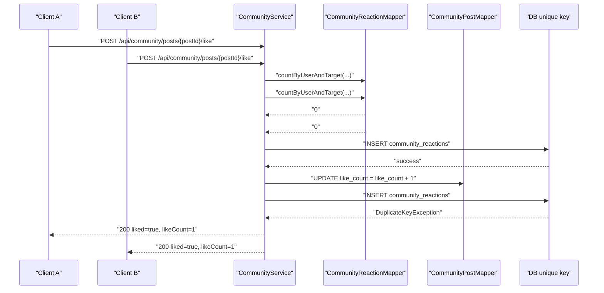
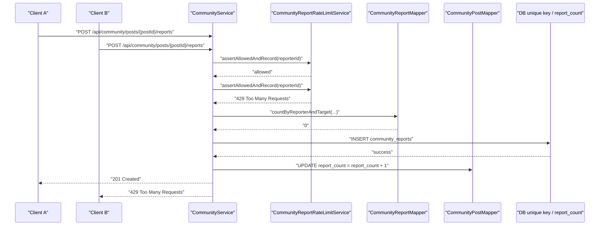

# 커뮤니티 DB 동시성 제어 설계

> Status: Implemented for MVP community counters and duplicate actions

## 1. 목적

이 문서는 ZIP:ON 커뮤니티에서 여러 사용자가 동시에 게시글을 조회하고, 댓글을 달고, 좋아요를 누르고, 신고할 때 DB 값이 어긋나지 않도록 어떤 제어를 하는지 설명한다.

커뮤니티는 전세·월세 위험진단 이후 사용자가 질문과 경험을 공유하는 MVP 지원 기능이다. 그래서 `view_count`, `comment_count`, `like_count`, `report_count` 같은 집계값이 틀어지면 단순 숫자 오류를 넘어 사용자 신뢰와 관리자 운영 판단에 영향을 준다.

이번 구현의 목표는 아래 다섯 가지다.

1. 카운터는 Java에서 읽고 더해 저장하지 않고 DB 원자적 `UPDATE`로 증감한다.
2. 중복 좋아요와 중복 신고는 DB `UNIQUE` 제약을 최종 방어선으로 둔다.
3. 같은 요청이 동시에 들어와도 500 내부 오류가 아니라 의도된 200, 409 또는 429로 응답한다.
4. 병렬 API 테스트로 위 정책을 회귀 테스트에 남긴다.
5. 댓글 스레드 조회와 신고 정책/관리자 조회 경로는 실제 WHERE/ORDER BY에 맞는 복합 인덱스로 보조한다.

## 2. 현재 구현 요약

| 상황 | 제어 방식 | 구현 위치 |
| --- | --- | --- |
| 게시글 상세 조회수 증가 | `view_count = view_count + 1` 원자적 SQL | `CommunityPostMapper.incrementViewCount(...)` |
| 댓글/대댓글 작성 수 증가 | `comment_count + 1`로 게시글 row를 먼저 갱신한 뒤 댓글 insert를 같은 transaction에서 실행 | `CommunityService.createComment(...)`, `createReply(...)`, `incrementPostCommentCountOrRollback(...)` |
| 댓글 삭제 수 감소 | `markDeleted(...)` 성공 row 수가 1일 때만 `comment_count` 감소 | `CommunityService.deleteComment(...)` |
| 게시글/댓글 좋아요 | `community_reactions` unique key + 중복 insert race를 no-op 처리 | `CommunityService.tryCreateLikeReaction(...)` |
| 좋아요 취소 | reaction delete row 수가 1일 때만 `like_count` 감소 | `CommunityService.unlikePost(...)`, `unlikeComment(...)` |
| 게시글/댓글 신고 | `CommunityReportPolicyService`가 활성 제한, 시간당/일일/반려 누적, volatile rate limit을 먼저 검사하고, `community_reports` unique key가 나머지 중복 insert race를 409 Conflict로 처리 | `CommunityReportPolicyService.assertCanReportAndRecord(...)`, `CommunityService.createReport(...)` |
| 신고 제한 이력 | volatile rate limit 또는 persistent policy limit에 걸리면 `community_report_restrictions`에 별도 transaction으로 제한 이력을 남김 | `CommunityReportRestrictionService.recordRestriction(...)` |
| 만료 제재 복구 | scheduler가 volatile lock을 잡고 batch size만큼 만료된 `community_policy_sanctions`를 복구 평가 | `CommunityPolicyRestoreScheduler`, `CommunityPolicyOperationsService.restoreExpiredSanctions(...)` |
| 첨부파일 수 증가 | attachment metadata insert와 `attachment_count + 1`을 같은 transaction에서 실행 | `CommunityService.uploadPostAttachment(...)` |
| 게시글 삭제/숨김 중 댓글·좋아요·신고 경합 | counter update row 수가 0이면 예외를 던져 transaction rollback | `CommunityService`의 count update 확인 코드 |
| 댓글 스레드 조회 | `post_id`, `status`, `parent_comment_id`, `created_at`, `id` 복합 인덱스로 게시글별 댓글 조회를 보조 | `V37__add_community_high_traffic_indexes.sql` |
| 신고 제한/운영 조회 | 신고자별 시간 window와 반려 신고 누적은 `V33`, 관리자 상태/대상 필터는 `V37`의 복합 인덱스로 보조 | `V33__create_community_policy_events.sql`, `V37__add_community_high_traffic_indexes.sql` |

핵심 원칙은 “읽기 확인은 사용자 친화적 빠른 경로이고, DB 제약은 최종 동시성 방어선”이라는 점이다.

## 3. DB 제약과 원자적 SQL

### community_reactions

`V6__extend_community_moderation_schema.sql`은 같은 사용자가 같은 대상에 같은 반응을 두 번 만들 수 없도록 unique key를 둔다.

```text
UNIQUE (target_type, target_id, user_id, reaction_type)
```

이 제약이 없으면 아래 race가 가능하다.

```text
Thread A: 좋아요 없음 확인
Thread B: 좋아요 없음 확인
Thread A: INSERT reaction
Thread B: INSERT reaction
결과: 같은 사용자의 좋아요 2개
```

현재는 Thread B의 insert가 DB에서 막힌다. `CommunityService.tryCreateLikeReaction(...)`는 이 `DuplicateKeyException`을 잡아 이미 좋아요가 있는 상태로 간주한다. 그래서 같은 사용자의 동시 좋아요 요청은 모두 200을 받지만 `like_count`는 1만 증가한다.

### community_reports

`community_reports`도 같은 사용자가 같은 대상을 여러 번 신고하지 못하도록 unique key를 둔다.

```text
UNIQUE (target_type, target_id, reporter_id)
```

신고는 좋아요와 달리 “이미 처리됨”으로 조용히 넘기지 않는다. 사용자는 중복 신고를 알아야 하므로 `CommunityService.createReport(...)`가 `DuplicateKeyException`을 `ConflictException`으로 바꾸고 API는 409 Conflict를 반환한다.

다만 신고 버튼을 너무 빠르게 반복 클릭하거나 같은 사용자가 짧은 시간 동안 너무 많은 신고를 보내는 경우에는 DB insert 전에 `CommunityReportPolicyService`가 먼저 막는다. 정책 흐름은 `community_report_restrictions` 활성 제한 확인, persistent policy limit 확인, `CommunityReportRateLimitService`의 volatile rate limit 확인 순서다. 제한이 걸리면 API는 429 Too Many Requests를 반환한다.

`CommunityReportRateLimitService`의 기본 volatile 기준은 10분 window에서 5회 초과, 2초 안의 빠른 반복 클릭, 10분 cooldown이다. Redis가 켜져 있으면 여러 backend 인스턴스가 `community:report:*` 제한 상태를 공유하고, Redis가 꺼진 기본 설정에서는 in-memory TTL 상태가 단일 backend 프로세스 안에서 자동 만료된다.

운영자가 나중에 설명해야 하는 제한 이력은 volatile state만으로 끝내지 않는다. `CommunityReportRestrictionService.recordRestriction(...)`은 `REQUIRES_NEW` transaction으로 `community_report_restrictions` row를 남긴다. 그래서 신고 API 본 transaction이 429로 rollback되어도 제한 이력과 사용자 알림은 별도로 commit될 수 있다.

현재 persistent policy limit은 다음과 같다.

| 정책 | 기준 | 제한 기간 | reason_code |
| --- | --- | --- | --- |
| 빠른 반복/10분 과다 신고 | `CommunityReportRateLimitService`가 차단 | `COMMUNITY_REPORT_RATE_LIMIT_COOLDOWN`, 기본 10분 | `REPORT_RATE_LIMITED` |
| 시간당 과다 신고 | 1시간 동안 신고 5건 이상 | 1시간 | `REPORT_HOURLY_LIMITED` |
| 일일 과다 신고 | 24시간 동안 신고 20건 이상 | 24시간 | `REPORT_DAILY_LIMITED` |
| 반복 반려 신고 | 7일 동안 반려 신고 5건 이상 | 3일 | `REPORT_REJECTED_ABUSE` |

### counter update

카운터는 아래처럼 DB가 한 문장으로 증가시킨다.

```sql
UPDATE community_posts
SET view_count = view_count + 1
WHERE id = #{postId}
  AND status = 'PUBLISHED'
```

Java에서 `SELECT view_count` 후 `viewCount + 1`을 계산해 `UPDATE view_count = ?`로 저장하면 lost update가 생길 수 있다. 현재 방식은 DB row lock과 update 연산에 맡기므로 동시에 여러 요청이 와도 성공한 요청 수만큼 증가한다.

감소는 음수가 되지 않도록 `CASE`를 사용한다.

```sql
SET like_count = CASE
        WHEN like_count > 0 THEN like_count - 1
        ELSE 0
    END
```

### high traffic lookup indexes

`V37__add_community_high_traffic_indexes.sql`은 동시성 정합성 자체를 바꾸지 않고, 사용자가 많아졌을 때 자주 타는 조회 경로를 보조한다.

| 인덱스 | 보조하는 요청 | 이유 |
| --- | --- | --- |
| `idx_community_comments_post_status_parent_created_at` | `/api/community/posts/{postId}/comments` | 게시글별 댓글/대댓글 트리를 status와 parent 기준으로 정렬해 읽는다. |
| `idx_community_reports_status_target_created_at` | 관리자 신고 목록 | `status`, `target_type` 필터 뒤 `created_at`, `id` 정렬로 운영자가 최신 신고를 본다. |

참고로 신고 rate limit의 `idx_community_reports_reporter_created_at`와 반려 신고 누적 정책의 `idx_community_reports_reporter_status_reviewed_at`는 이미 `V33__create_community_policy_events.sql`에서 추가되어 있다. `V37`은 그 위에 빠진 조회 경로만 보강한다.

이번 인덱스 추가는 "많은 사용자가 동시에 쓰는 상황"의 기본 체력을 올리는 작업이다. 그래도 모든 확장 문제를 해결하는 것은 아니다. `view_count`가 특정 인기 글 한 row에 집중되는 write hotspot, 본문 `LIKE '%keyword%'` 검색의 full scan, 깊은 `OFFSET` pagination은 트래픽이 실제로 커지면 별도 설계가 필요하다.

## 4. 요청 흐름

### 게시글 좋아요 동시성 흐름



### 게시글 신고 동시성 흐름



### 댓글 작성과 게시글 삭제 경합

댓글 작성은 먼저 `requirePublishedPost(postId)`로 게시글 상태를 확인한다. 하지만 그 직후 다른 transaction이 게시글을 삭제하거나 숨길 수 있다.

그래서 `CommunityService.createComment(...)`와 `createReply(...)`는 `incrementPostCommentCountOrRollback(postId)`를 먼저 호출해 게시글 row를 갱신한 뒤 댓글을 insert한다. 이 순서는 InnoDB FK lock upgrade가 동시에 많이 발생할 때 deadlock 가능성을 낮추기 위한 현재 구현 선택이다.

```text
comment_count update row count = 1 -> 댓글 insert 후 정상 commit
comment_count update row count = 0 -> 게시글이 더 이상 PUBLISHED가 아니므로 NotFoundException -> transaction rollback
```

이 확인이 없으면 삭제된 게시글에 댓글 row만 남는 불일치가 생길 수 있다.

### 만료 제재 복구 scheduler

커뮤니티 자동 제재는 `community_policy_sanctions`와 `community_policy_sanction_permission_locks`에 현재 상태를 남긴다. 만료 복구는 두 경로가 있다.

| 경로 | 동시성 제어 | 기본값 |
| --- | --- | --- |
| 자동 scheduler | `CommunityPolicyRestoreScheduler`가 `community-policy-restore` volatile lock을 획득한 뒤 실행 | `COMMUNITY_POLICY_RESTORE_SCHEDULER_ENABLED=false` |
| 관리자 수동 실행 | `POST /api/admin/community/policy-sanctions/restore-expired` | 요청 `limit` 또는 service 기본 흐름 |

scheduler 기본 설정은 `COMMUNITY_POLICY_RESTORE_CRON=0 */10 * * * *`, `COMMUNITY_POLICY_RESTORE_ZONE=Asia/Seoul`, `COMMUNITY_POLICY_RESTORE_BATCH_SIZE=50`, `COMMUNITY_POLICY_RESTORE_LOCK_TTL=5m`이다. Redis가 꺼진 경우 lock은 단일 backend 프로세스 안에서만 유효하므로, 다중 인스턴스 운영에서 scheduler를 켤 때는 `ZIPON_REDIS_ENABLED=true`를 함께 고려한다.

## 5. 테스트

동시성 회귀 테스트는 `backend/src/test/java/com/zipon/CommunityConcurrencyIntegrationTest.java`에 있다.

테스트 이름과 주석은 API 계약처럼 읽히도록 작성했다.

| 테스트 | 검증 |
| --- | --- |
| `concurrentPostDetailRequestsAtomicallyIncrementViewCount` | 12개 상세 조회가 동시에 들어와도 `view_count`가 정확히 12 증가 |
| `concurrentDuplicatePostLikesAreIdempotent` | 같은 사용자의 10개 동시 좋아요가 모두 200이고 `like_count`는 1 |
| `concurrentCommentsDoNotLoseCommentCountUpdates` | 12개 동시 댓글 작성 후 `comment_count`가 12 |
| `concurrentDuplicatePostReportsReturnOneCreatedAndRateLimits` | 같은 사용자의 8개 빠른 동시 신고 중 1개만 201, 나머지는 429, `report_count`는 1 |

실행:

```bash
cd backend
./mvnw -Dtest=CommunityConcurrencyIntegrationTest test
```

Windows PowerShell에서 Java 8이 먼저 잡히면 Maven enforcer가 실패한다. 이 경우 현재 테스트 실행 터미널에서만 Java 21을 지정한다.

```powershell
$env:JAVA_HOME='C:\Program Files\Eclipse Adoptium\jdk-21.0.11.10-hotspot'
$env:PATH="$env:JAVA_HOME\bin;$env:PATH"
./mvnw -Dtest=CommunityConcurrencyIntegrationTest test
```

## 6. 설계 결정

### Decision: 카운터는 atomic update, 중복 행동은 unique key로 막는다

#### Context

게시판 카운터와 중복 행동은 부하가 크지 않은 MVP에서도 사용자가 여러 번 클릭하거나 네트워크 재시도, 브라우저 중복 요청, 모바일 더블탭으로 쉽게 race가 생긴다.

#### Options considered

1. Java `synchronized`로 서비스 메서드를 감싼다.
2. 먼저 조회하고 Java에서 값을 계산한 뒤 저장한다.
3. DB atomic update와 unique constraint를 사용한다.
4. Redis distributed lock을 도입한다.

#### Decision

3번을 선택했다.

#### Why

- 현재 ZIP:ON은 MyBatis + RDB 중심 구조다.
- DB는 이미 row lock과 unique constraint를 제공한다.
- 단일 서버뿐 아니라 여러 서버로 늘어나도 DB 제약은 계속 동작한다.
- Redis는 캐시, 중복 요청 방지, rate limit 후보지만 원본 정합성의 최종 방어선으로 쓰면 안 된다.

#### Tradeoffs

- `DuplicateKeyException`을 서비스에서 의도적으로 해석해야 한다.
- 카운터가 더 복잡해지면 실시간 집계와 비동기 재계산을 분리해야 할 수 있다.
- 아주 높은 트래픽의 조회수는 write hotspot이 될 수 있다. 현재 MVP 규모에서는 DB atomic update가 더 단순하고 안전하다.

#### Future revisit

아래 상황이 오면 재검토한다.

- 조회수 write가 DB 병목이 되는 경우
- 인기글 랭킹을 실시간으로 계산해야 하는 경우
- Redis rate limit 또는 duplicate request lock을 실제로 도입하는 경우
- 이벤트 기반 비동기 카운터 재계산을 도입하는 경우
- 커뮤니티 게시글 수가 커져 `OFFSET` pagination이나 본문 `LIKE` 검색이 느려지는 경우
- 신고 운영 화면에서 상태/대상/기간 조합 필터가 더 늘어나는 경우

## 7. 디버깅 체크리스트

### 좋아요가 500으로 실패한다

- `community_reactions`의 `uk_community_reactions_user_target` unique key가 존재하는지 확인한다.
- `CommunityService.tryCreateLikeReaction(...)`가 `DuplicateKeyException`을 잡고 있는지 확인한다.
- `GlobalExceptionHandler`의 마지막 `RuntimeException` 처리로 흘러간 로그가 있는지 확인한다.

### 좋아요 수가 중복 증가한다

- `CommunityService.likePost(...)` 또는 `likeComment(...)`가 reaction insert 성공 시에만 `incrementLikeCount(...)`를 호출하는지 확인한다.
- 직접 SQL로 `community_reactions`에 같은 `(target_type, target_id, user_id, reaction_type)` 조합이 중복 저장됐는지 확인한다. 중복이 있다면 migration 제약이 빠진 DB일 가능성이 높다.

### 신고가 모두 201로 성공한다

- `community_reports`의 `uk_community_reports_reporter_target` unique key를 확인한다.
- `CommunityService.createReport(...)`가 중복 insert를 `ConflictException`으로 변환하는지 확인한다.
- 중복이 아닌데 429가 난다면 `community_report_restrictions`에 활성 row가 있는지, `CommunityReportPolicyService`의 시간당/일일/반려 신고 누적 조건에 걸렸는지 확인한다.

### 댓글 수가 실제 댓글 수와 다르다

- `CommunityService.createComment(...)`, `createReply(...)`, `deleteComment(...)`가 모두 같은 transaction 안에서 counter update를 수행하는지 확인한다.
- 직접 DB를 수정했거나 실패한 migration이 있었는지 확인한다.
- 장기적으로는 운영 복구용 recount SQL을 별도 관리자 도구로 둘 수 있다. 현재 MVP에는 자동 복구 batch를 두지 않는다.

## 8. 주의할 점

- Controller에서 카운터를 직접 조작하지 않는다.
- Java에서 `count = count + 1`을 계산해 저장하지 않는다.
- Redis 캐시나 lock을 도입하더라도 RDB unique key와 FK를 제거하지 않는다.
- 좋아요 중복은 idempotent 200이 자연스럽지만, 신고는 사용자가 알아야 하므로 빠른 반복/과다 신고는 429, 제한이 아닌 중복 신고는 409로 구분한다.
- volatile state는 빠른 제한 판단용이고, 운영자가 설명해야 하는 신고 제한 이력과 자동 제재 이력은 DB row로 남긴다.
- 동시성 테스트는 불안정해지기 쉽다. CountDownLatch로 시작 시점을 맞추고, 최종 DB/API 상태를 검증해야 한다.

## 9. 관련 문서

- [커뮤니티 게시판 백엔드 학습 문서](README.md)
- [MySQL 개발환경과 Flyway migration](/docs/operations/DOCKER_MYSQL_REDIS.md)
- [로컬 Docker 개발환경](/docs/operations/LOCAL_SETUP.md)
- [기술 적용 타당성 검증 보고서](/docs/operations/review/TECH_APPLICABILITY_REVIEW.md)

## 10. Learning path

1. First read: 이 문서의 2장과 3장에서 DB 제약과 atomic update를 이해한다.
2. Then inspect: `CommunityService.tryCreateLikeReaction(...)`, `CommunityService.createReport(...)`, `CommunityPostMapper.incrementViewCount(...)`.
3. Then inspect: `CommunityReportPolicyService`, `CommunityReportRestrictionService`, `CommunityPolicyRestoreScheduler`.
4. Then inspect: `V6__extend_community_moderation_schema.sql`의 `community_reactions`, `community_reports` unique key와 `V30`, `V33`, `V34`, `V37`의 제한/정책/인덱스 구조.
5. Then run: `./mvnw -Dtest=CommunityConcurrencyIntegrationTest,CommunityReportRateLimitServiceTest test`.
6. Then debug: 실패하면 7장의 체크리스트 순서로 unique key, service exception mapping, counter update row count, restriction row를 확인한다.
7. Key concept to understand: Spring `@Transactional`은 같은 use case 안의 DB 작업을 commit/rollback 단위로 묶고, MyBatis mapper의 `UPDATE count = count + 1`은 DB가 원자적으로 처리한다. `REQUIRES_NEW`는 본 요청이 실패하더라도 운영 이력을 별도 transaction으로 남길 때 사용한다.
