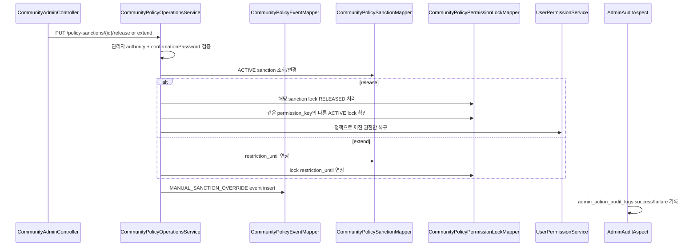
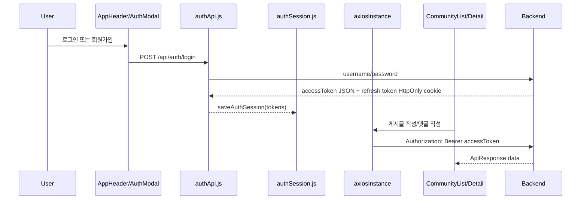
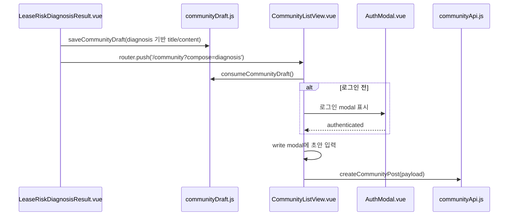
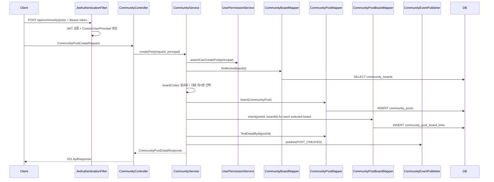
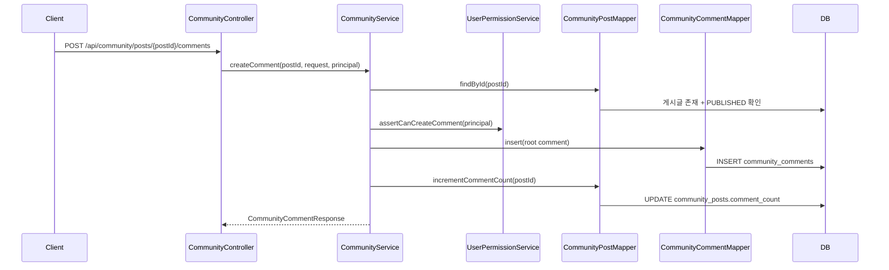
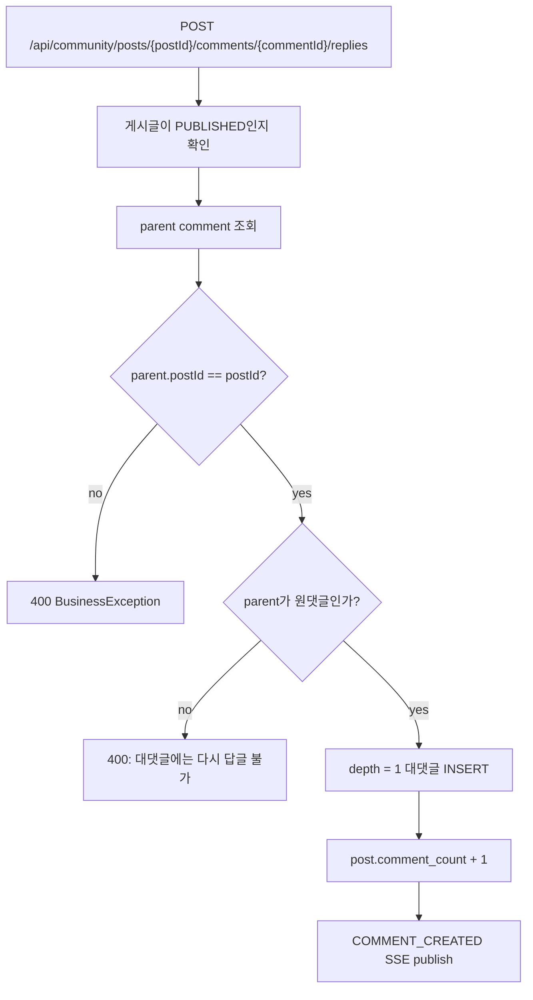
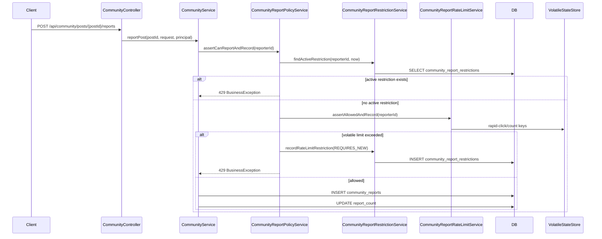

# 커뮤니티 게시판 백엔드 학습 문서

> Status: Implemented

## 1. 목적

이 문서는 ZIP:ON 커뮤니티 게시판 백엔드가 어떻게 설계되고 구현되었는지 설명한다.

커뮤니티는 ZIP:ON MVP에 포함되는 지원 기능이다. MVP의 중심 가치는 현재 매물 미제공, 과거 지표 분석, 정확 주소 위험진단이고, 커뮤니티는 그 이후 사용자가 질문, 경험, 사례, 주의사항을 공유하도록 돕는다. 따라서 커뮤니티를 분석/진단과 무관한 범용 게시판 포털로 키우기보다, 분석/진단 결과를 보고 생긴 질문과 운영 moderation 흐름에 연결하는 방향을 우선한다.

현재 구현된 범위:

- 게시판 목록 조회
- 게시글 목록, 상세, 작성, 수정, 삭제
- 게시글 다중 게시판 선택, 다중 게시판 필터, 좋아요/신고/조회/작성일/수정일/댓글 수 정렬
- 댓글 작성, 수정, 삭제
- 대댓글 작성
- 작성자 표시명과 프로필 이미지 URL 응답
- 작성일자와 수정일자 응답
- 조회수와 댓글 수 집계
- 좋아요 중복 방지와 좋아요 수 집계
- 신고 접수, 중복 신고 방지, 관리자 신고 검토
- 게시글 첨부파일 업로드/다운로드와 첨부 metadata 응답
- 관리자 게시글/댓글 숨김과 복구, 운영 감사 로그
- 사용자별 게시글/댓글 작성, 수정, 삭제 가능 여부 제어
- 사용자 프로필 수정과 프로필 이미지 업로드/조회 API, 작성자 avatar 표시 호환
- 사용자/관리자 DB 기반 in-app 알림 조회
- 관리자 정책 이벤트, 정책 제재 이력, 수동 해제, 기간 연장, 만료 복구, 신고 통계, 반복 반려 신고자 탐지 API
- soft delete
- Server-Sent Events 기반 실시간 변경 이벤트
- MyBatis mapper와 Flyway migration 기반 DB 구현
- 실제 signup/login/JWT 흐름을 사용하는 통합 테스트
- Vue 프론트엔드의 커뮤니티 목록/상세/글쓰기/댓글/대댓글 API 연결
- Vue 프론트엔드의 게시글 첨부파일 업로드/다운로드 화면 연결
- Vue 프론트엔드의 compact 목록과 우측 슬라이드 상세 패널
- `CommunityListView.vue` 우측 상세 패널의 게시글 좋아요, 게시글 신고, 댓글 작성, 대댓글 작성, 댓글 좋아요, 댓글 신고, 작성자 첨부파일 업로드
- `CommunityPostDetailView.vue` 전체 상세 화면의 게시글 수정/삭제, 첨부파일 업로드, 댓글/대댓글 수정·삭제·좋아요·신고
- `AdminDashboardView.vue` 관리자 신고 목록, 신고 검토, 게시글/댓글 숨김·복구 화면 연결
- `MyPageView.vue` 사용자 프로필 수정과 프로필 이미지 업로드 화면 연결
- 위험진단 결과에서 커뮤니티 글쓰기 초안을 여는 Vue 연결

아직 구현하지 않은 범위:

- 북마크
- 정책 제재/해제·통계·반복 신고자 전용 관리자 화면 고도화
- 전문 검색, 기간별 인기글 랭킹
- 댓글/대댓글 일반 알림 고도화, 이메일/SMS/push
- 여러 서버 사이에서 공유되는 Redis/Kafka 기반 실시간 이벤트

관련 문서:

- Parent overview: [ZIP:ON README](/README.md)
- Docs index: [CODEX 기록](/docs/README.md)
- DB 실행: [MySQL 개발환경과 Flyway migration](/docs/operations/DOCKER_MYSQL_REDIS.md)
- 인증 schema: [인증 DB 스키마](/docs/architecture/security/AUTH_SCHEMA.md)
- 인증 흐름: [Spring Security JWT 인증 흐름](/docs/architecture/security/SECURITY_AUTHENTICATION.md)
- API 지도: [ZIP:ON API와 함수 학습 지도](/docs/api/API_FUNCTION_MAP.md)
- DB 동시성 제어: [커뮤니티 DB 동시성 제어 설계](CONCURRENCY_CONTROL.md)

## 2. 핵심 설계 요약

커뮤니티 게시판은 단순 CRUD처럼 보이지만 실제로는 아래 질문을 함께 풀어야 한다.

| 질문 | 이번 구현의 선택 | 이유 |
| --- | --- | --- |
| 작성자는 요청 body에서 받을까? | 받지 않는다. `CustomUserPrincipal.getId()`를 사용한다. | 사용자가 다른 사람 ID로 글을 쓰는 조작을 막기 위해서다. |
| 게시판 종류는 enum 컬럼만 둘까? | `community_boards` 테이블과 `CommunityBoardCode` enum을 함께 둔다. | 게시판 이름, 설명, 노출 순서, 활성화 여부를 DB에서 관리하기 위해서다. |
| 게시글/댓글 삭제는 hard delete일까? | `status = 'DELETED'` soft delete다. | 대댓글 트리 유지, 신고/운영 대응, 감사 가능성을 남기기 위해서다. |
| 댓글 depth는 무제한일까? | 원댓글 + 대댓글 1단계까지만 허용한다. | 무한 트리는 정렬, 화면, 삭제 정책이 크게 복잡해져 MVP에 과하다. |
| 프로필 사진은 어디서 가져올까? | 커뮤니티 조회는 호환 컬럼인 `users.profile_image_url`을 읽고, 장기 기준은 `user_profiles.profile_image_url`이다. | `UserProfileService`가 프로필 수정/업로드 후 `users.nickname/profile_image_url`을 동기화해 기존 커뮤니티 SQL을 깨지 않게 한다. |
| 좋아요는 게시글 전용일까? | `community_reactions`에 `target_type`, `target_id`로 게시글/댓글을 함께 저장한다. | 같은 중복 방지 규칙을 게시글과 댓글에 재사용하기 위해서다. |
| 신고는 바로 숨김 처리할까? | 신고 row는 `PENDING`으로 저장하고 관리자 검토 API가 별도로 처리한다. | 신고 접수와 운영 판단은 다른 책임이기 때문이다. |
| 첨부파일은 DB에 binary로 저장할까? | local filesystem에 저장하고 DB에는 metadata만 저장한다. | DB 비대화를 피하고, 나중에 object storage로 바꾸기 쉽다. |
| 관리자 조치 이력은 어디에 남길까? | `community_moderation_actions` append-only table에 남긴다. | 숨김/복구 이유와 actor를 추적하기 위해서다. |
| 사용자별 글/댓글 권한은 어디서 검사할까? | `UserPermissionService`가 `user_permissions`를 읽고 `CommunityService`가 작성/수정/삭제 전에 호출한다. | 권한 row만 저장하고 실제 use case에서 검사하지 않는 운영 실수를 막기 위해서다. |
| 실시간은 어떻게 시작할까? | `SseEmitter` 기반 Server-Sent Events를 사용한다. | 프론트가 새 글/댓글 이벤트를 받기 쉽고, 외부 브로커 없이 시작할 수 있다. |
| 동시에 좋아요/신고/댓글이 들어오면? | DB atomic update, unique key, `@Transactional` rollback을 함께 사용한다. | Java 메모리 lock보다 RDB 정합성을 기준으로 삼아 여러 서버에서도 같은 규칙을 유지하기 위해서다. |

## 2.1 프론트엔드 화면 연결

커뮤니티 기능은 API만 있어서는 사용자가 발견하기 어렵다. 현재 화면 책임은 아래처럼 나뉜다.

| 파일 | 화면 책임 | 주요 API |
| --- | --- | --- |
| `frontend/src/views/CommunityListView.vue` | 커뮤니티 첫 화면, 게시판 필터, 검색, 글쓰기, 우측 상세 패널 | `/api/community/boards`, `/api/community/posts`, 상세/댓글/좋아요/신고/첨부 API |
| `frontend/src/views/CommunityPostDetailView.vue` | 전체 상세 화면, 게시글 수정/삭제, 댓글/대댓글 수정·삭제, 첨부파일 업로드 | `/api/community/posts/{postId}`, `/api/community/comments/{commentId}` |
| `frontend/src/views/AdminDashboardView.vue` | 관리자 신고 검토, 게시글/댓글 숨김·복구 | `/api/admin/community/reports`, `/api/admin/community/.../hide`, `/restore` |
| `frontend/src/views/MyPageView.vue` | 내 프로필 수정, 프로필 이미지 업로드 | `/api/users/me/profile`, `/api/users/me/profile-image` |

`CommunityListView.vue`의 우측 상세 패널은 사용자가 목록에서 가장 자주 보는 표면이다. 그래서 단순 읽기 전용 preview가 아니라 게시글 좋아요, 게시글 신고, 댓글 작성, 답글, 댓글 좋아요, 댓글 신고, 작성자 첨부파일 업로드를 직접 노출한다. 전체 상세 화면은 긴 수정·삭제 흐름과 첨부파일 관리를 계속 담당한다.

UI에서 공개 사용자에게 신고 수를 정렬 기준처럼 강조하지 않는다. 신고는 운영 moderation 신호이므로 일반 사용자는 신고 접수 액션을 수행할 수 있으면 충분하고, 누적 신고 검토와 숨김·복구 판단은 관리자 화면에서 처리한다.

정책 이벤트, 자동 제재, 제재 수동 해제/연장, 만료 제재 복구, 신고 통계, 반복 반려 신고자, 관리자 운영 알림 API는 `CommunityAdminController`와 `CommunityPolicyOperationsService`에 구현되어 있다. 다만 현재 `frontend/src/api/adminApi.js`와 `AdminDashboardView.vue`에는 아직 연결되어 있지 않으므로, 운영자는 화면에서 신고 검토와 숨김·복구까지만 수행할 수 있다.

## 3. 현재 ERD

Schema source of truth:

```text
backend/src/main/resources/db/migration/V1__create_auth_schema.sql
backend/src/main/resources/db/migration/V4__create_community_board_schema.sql
backend/src/main/resources/db/migration/V6__extend_community_moderation_schema.sql
backend/src/main/resources/db/migration/V7__create_admin_user_permission_schema.sql
backend/src/main/resources/db/migration/V28__support_multi_board_community_posts.sql
backend/src/main/resources/db/migration/V30__create_community_report_restrictions.sql
backend/src/main/resources/db/migration/V33__create_community_policy_events.sql
backend/src/main/resources/db/migration/V34__create_community_policy_operations.sql
backend/src/main/resources/db/migration/V37__add_community_high_traffic_indexes.sql
```



```mermaid
erDiagram
    users ||--o{ user_roles : "has authorities"
    users ||--o{ refresh_tokens : "owns refresh sessions"
    users ||--o{ revoked_access_tokens : "revokes access tokens"
    users ||--o{ community_posts : "writes"
    users ||--o{ community_comments : "writes"
    users ||--o{ community_reactions : "likes"
    users ||--o{ community_reports : "reports and reviews"
    users ||--o{ community_report_restrictions : "has report restrictions"
    users ||--o{ community_policy_events : "has policy events"
    users ||--o{ community_policy_sanctions : "has policy sanctions"
    users ||--o{ notifications : "receives"
    users ||--o{ community_post_attachments : "uploads"
    users ||--o{ community_moderation_actions : "moderates"
    users ||--|| user_profiles : "has public profile"
    users ||--|| user_permissions : "has community permissions"
    users ||--o{ user_page_permissions : "has page access rules"
    community_boards ||--o{ community_posts : "primary board"
    community_boards ||--o{ community_post_board_links : "tags"
    community_posts ||--o{ community_post_board_links : "linked boards"
    community_posts ||--o{ community_comments : "has"
    community_posts ||--o{ community_post_attachments : "has"
    community_comments ||--o{ community_comments : "has replies"

    users {
        bigint id PK
        varchar username UK
        varchar email
        varchar nickname
        varchar profile_image_url
        varchar password_hash
        boolean enabled
        datetime created_at
        datetime password_changed_at
        int token_version
    }

    user_profiles {
        bigint id PK
        bigint user_id UK
        varchar display_name UK
        varchar profile_image_url
        varchar profile_image_original_file_name
        varchar profile_image_stored_file_name UK
        varchar profile_image_storage_path
        varchar profile_image_content_type
        bigint profile_image_size_bytes
        datetime created_at
        datetime updated_at
    }

    community_boards {
        bigint id PK
        varchar code UK
        varchar name
        varchar description
        int sort_order
        boolean active
        datetime created_at
    }

    community_posts {
        bigint id PK
        bigint board_id FK
        bigint author_id FK
        varchar title
        text content
        varchar status
        bigint view_count
        bigint comment_count
        bigint like_count
        bigint attachment_count
        bigint report_count
        datetime created_at
        datetime updated_at
        datetime deleted_at
        datetime hidden_at
        bigint hidden_by FK
        varchar hidden_reason
    }

    community_post_board_links {
        bigint post_id PK, FK
        bigint board_id PK, FK
        datetime created_at
    }

    community_comments {
        bigint id PK
        bigint post_id FK
        bigint parent_comment_id FK
        bigint author_id FK
        text content
        varchar status
        tinyint depth
        bigint like_count
        bigint report_count
        datetime created_at
        datetime updated_at
        datetime deleted_at
        datetime hidden_at
        bigint hidden_by FK
        varchar hidden_reason
    }

    community_reactions {
        bigint id PK
        varchar target_type
        bigint target_id
        bigint user_id FK
        varchar reaction_type
        datetime created_at
    }

    community_reports {
        bigint id PK
        varchar target_type
        bigint target_id
        bigint reporter_id FK
        varchar reason
        varchar status
        bigint reviewer_id FK
        datetime created_at
        datetime reviewed_at
    }

    community_report_restrictions {
        bigint id PK
        bigint reporter_id FK
        varchar reason_code
        varchar detail
        datetime starts_at
        datetime expires_at
        datetime created_at
    }

    community_policy_events {
        bigint id PK
        bigint user_id FK
        varchar policy_code
        varchar trigger_type
        bigint trigger_report_id FK
        bigint related_policy_event_id FK
        varchar target_type
        bigint target_id
        int points_delta
        int points_total
        varchar action_type
        datetime restriction_until
        boolean requires_admin_review
        varchar created_by
        varchar actor_type
        bigint actor_user_id FK
        datetime created_at
    }

    community_policy_sanctions {
        bigint id PK
        bigint user_id FK
        bigint source_event_id FK
        varchar action_type
        varchar status
        datetime restriction_until
        boolean requires_admin_review
        datetime permission_applied_at
        datetime released_at
    }

    community_policy_sanction_permission_locks {
        bigint id PK
        bigint sanction_id FK
        bigint user_id FK
        varchar permission_key
        boolean baseline_allowed
        varchar status
        datetime restriction_until
    }

    notifications {
        bigint id PK
        bigint recipient_user_id FK
        varchar recipient_type
        varchar notification_type
        varchar related_type
        bigint related_id
        datetime created_at
    }

    community_post_attachments {
        bigint id PK
        bigint post_id FK
        bigint uploader_id FK
        varchar original_file_name
        varchar stored_file_name
        varchar content_type
        bigint size_bytes
        varchar status
        datetime created_at
    }

    community_moderation_actions {
        bigint id PK
        varchar target_type
        bigint target_id
        varchar action_type
        bigint actor_id FK
        varchar reason
        datetime created_at
    }

    user_permissions {
        bigint user_id PK
        boolean can_create_post
        boolean can_update_post
        boolean can_delete_post
        boolean can_create_comment
        boolean can_update_comment
        boolean can_delete_comment
        boolean can_access_all_pages
    }

    user_page_permissions {
        bigint user_id PK
        varchar page_key PK
        boolean allowed
    }
```

## 4. 테이블별 책임

### users

기존 인증 테이블이다. V4 migration에서 `profile_image_url`을 추가했고, V39 이후 장기 기준 프로필은 `user_profiles`로 분리됐다. 현재 커뮤니티 SQL은 작성자 표시 호환을 위해 `users.nickname/profile_image_url`을 읽고, `UserProfileService`가 `user_profiles` 변경을 `users` 호환 컬럼에 동기화한다.

커뮤니티에서 사용하는 컬럼:

```text
users.id                 작성자 FK
users.username           작성자 계정명
users.nickname           화면 표시명 후보
users.profile_image_url  프로필 사진 URL 후보
```

작성자 표시명 규칙은 MyBatis SQL에서 처리한다.

```sql
COALESCE(NULLIF(u.nickname, ''), u.username) AS author_display_name
```

즉, nickname이 있으면 nickname을 보여주고, 없거나 빈 문자열이면 username을 보여준다.

### community_boards

게시판 탭 metadata를 저장한다.

초기 seed:

```text
FREE           자유게시판
REGION_REVIEW  지역 후기
INFORMATION    정보 공유
```

왜 enum만 쓰지 않았는가:

- enum만 있으면 화면 표시명과 설명을 코드에 넣어야 한다.
- 게시판 노출 순서와 활성화 여부를 바꾸려면 배포가 필요해진다.
- DB 테이블을 두면 게시글은 `board_id` FK로 무결성을 보장할 수 있다.

### community_posts

게시글 본문과 집계값을 저장한다.

중요 컬럼:

```text
board_id        community_boards.id
author_id       users.id
title           목록과 상세에 표시되는 제목
content         긴 본문, TEXT
status          PUBLISHED / DELETED / HIDDEN
view_count      상세 조회 누적 수
comment_count   PUBLISHED 댓글/대댓글 수
like_count      좋아요 수
attachment_count ACTIVE 첨부파일 수
report_count    접수된 신고 수
created_at      작성 시각
updated_at      제목/본문 수정 시각
deleted_at      soft delete 시각
hidden_at       관리자 숨김 시각
hidden_by       숨김 처리한 관리자 users.id
hidden_reason   숨김 이유
```

주의:

- `view_count` 증가는 `updated_at`을 바꾸지 않는다. 조회수 변화는 글 내용 수정이 아니기 때문이다.
- `comment_count`는 댓글/대댓글 작성 시 증가하고 삭제 시 감소한다.
- `like_count`는 `community_reactions` insert/delete와 같은 transaction에서 증감한다.
- `attachment_count`는 ACTIVE 첨부파일 metadata가 추가될 때 증가한다.
- `report_count`는 중복이 아닌 신고가 접수될 때 증가한다.
- 삭제되거나 숨김 처리된 글은 목록과 상세에서 보이지 않는다.
- 동시 요청에서 카운터가 어긋나지 않도록 자세한 정책은 [커뮤니티 DB 동시성 제어 설계](CONCURRENCY_CONTROL.md)를 먼저 읽는다.

### community_post_board_links

게시글 하나가 여러 게시판 성격을 가질 수 있도록 `community_posts`와 `community_boards`를 연결한다.

테이블 목적:

```text
post_id     community_posts.id
board_id    community_boards.id
created_at  연결 생성 시각
```

무결성 규칙:

- primary key는 `(post_id, board_id)` 복합키다. 같은 글이 같은 게시판에 중복 연결될 수 없다.
- `post_id`는 `community_posts.id`를 참조하고 `ON DELETE CASCADE`를 사용한다.
- `board_id`는 `community_boards.id`를 참조한다.
- `idx_community_post_board_links_board_post`는 게시판 필터 목록 조회를 위한 인덱스다.

설계 이유:

- `community_posts.board_id`는 기존 API와 기존 데이터의 대표 게시판을 위해 유지한다.
- 새 작성 화면은 `boardCodes` 배열을 보내고, `CommunityService.createPost(...)`가 첫 번째 게시판을 대표 게시판으로 저장한 뒤 모든 선택 게시판을 `CommunityPostBoardMapper.insert(...)`로 연결한다.
- 목록 필터는 `CommunityPostMapper.findSummaries(...)`와 `countSummaries(...)`에서 `EXISTS` 조건으로 연결 테이블을 조회한다.

### community_comments

원댓글과 대댓글을 한 테이블에 저장한다.

구조:

```text
parent_comment_id = null  원댓글
parent_comment_id != null 대댓글
depth = 0                 원댓글
depth = 1                 대댓글
like_count                좋아요 수
report_count              신고 수
hidden_at / hidden_by     관리자 숨김 정보
```

왜 댓글과 대댓글을 테이블로 나누지 않았는가:

- 원댓글과 대댓글은 작성자, 내용, 상태, 작성일이라는 공통 필드가 같다.
- 같은 테이블에서 자기 자신을 FK로 참조하면 구조가 단순하다.
- 단, 이번 구현은 `depth IN (0, 1)`로 제한한다.

삭제 정책:

- 댓글 row는 삭제하지 않고 `status = 'DELETED'`로 바꾼다.
- 관리자 숨김 댓글은 `status = 'HIDDEN'`으로 바꾸고 public 댓글 목록에서 제외한다.
- 응답에서는 `deleted = true`, `content = "삭제된 댓글입니다."`로 내려준다.
- 대댓글이 달린 원댓글을 삭제해도 트리 모양은 유지된다.

### community_reactions

게시글과 댓글 좋아요를 저장한다.

중복 방지:

```text
UNIQUE (target_type, target_id, user_id, reaction_type)
```

현재 `reaction_type`은 `LIKE`만 허용한다. 나중에 싫어요나 이모지 반응을 추가할 수 있지만, 이번 구현에서는 좋아요만 둔다.

### community_reports

신고 접수와 관리자 검토 상태를 저장한다.

중요 상태:

```text
PENDING   접수됨
RESOLVED  운영 조치 또는 확인 완료
REJECTED  신고 사유가 부족해 반려
```

같은 사용자가 같은 대상에 신고를 여러 번 넣으면 409 Conflict로 막는다.

신고 남용 방어는 `CommunityReportPolicyService`가 담당한다. 이 서비스는 먼저 `community_report_restrictions`에서 현재 시점에 활성화된 제한 이력이 있는지 확인하고, 제한 중이면 `429 Too Many Requests`를 반환한다. 활성 제한이 없으면 기존 `CommunityReportRateLimitService`가 `VolatileStateStore`로 짧은 window의 과다 신고와 빠른 반복 클릭을 판단한다.

기본 정책은 10분 동안 5회 초과 또는 2초 안의 빠른 반복 신고다. 이 조건에 걸리면 `CommunityReportRestrictionService.recordRateLimitRestriction(...)`가 `community_report_restrictions`에 제한 이력을 남긴다. 신고 API 자체는 429로 롤백되지만 제한 이력은 운영 판단 이력이므로 `REQUIRES_NEW` 트랜잭션으로 별도 커밋한다. `ZIPON_REDIS_ENABLED=true`이면 여러 backend 인스턴스가 volatile counter를 Redis로 공유하고, 기본 로컬/테스트 설정에서는 `InMemoryVolatileStateStore`가 같은 규칙을 단일 프로세스 안에서 적용한다.

### community_report_restrictions

신고 기능을 남용한 사용자의 일시적 신고 제한 이력을 저장한다. 이 테이블은 넓은 커뮤니티 권한을 영구 변경하는 `user_permissions`가 아니라, 신고 제출 기능만 일정 시간 막는 운영 정책 이력이다.

중요 컬럼:

```text
reporter_id   제한 대상 users.id
reason_code   REPORT_RATE_LIMITED, REPORT_HOURLY_LIMITED, REPORT_DAILY_LIMITED, REPORT_REJECTED_ABUSE
detail        운영/디버깅용 제한 사유
starts_at     제한 시작 시각
expires_at    제한 만료 시각
created_at    이력 생성 시각
```

신고자 제한 정책:

| 정책 | 기준 | 제한 | 저장 위치 |
| --- | --- | --- | --- |
| 중복 신고 | 같은 사용자가 같은 게시글/댓글을 다시 신고 | `409 Conflict` | `community_reports.uk_community_reports_reporter_target` |
| 빠른 반복 신고 | 2초 안의 반복 클릭 또는 10분 5회 초과 | `429 Too Many Requests`, 기본 10분 제한 | `REPORT_RATE_LIMITED` |
| 시간당 과다 신고 | 최근 1시간 신고 5회 이상인 상태에서 추가 신고 | `429 Too Many Requests`, 1시간 제한 | `REPORT_HOURLY_LIMITED` |
| 일일 과다 신고 | 최근 24시간 신고 20회 이상인 상태에서 추가 신고 | `429 Too Many Requests`, 24시간 제한 | `REPORT_DAILY_LIMITED` |
| 반려 신고 누적 | 최근 7일 내 `REJECTED` 신고 5회 이상 | `429 Too Many Requests`, 3일 제한 | `REPORT_REJECTED_ABUSE` |

왜 DB에 남기는가:

- 메모리/Redis TTL만으로 막으면 “왜 이 사용자가 막혔는지” 운영자가 나중에 확인하기 어렵다.
- 신고 생성 트랜잭션이 실패해도 제한 이력은 남아야 하므로 별도 트랜잭션 경계가 필요하다.
- 추후 관리자 화면에서 제한 이력 조회, 수동 해제, 반복 남용자 자동 권한 변경 정책으로 확장하기 쉽다.

### community_policy_events

운영정책이 자동/수동으로 평가된 결과를 append-only로 저장한다. 관리자 신고 검토 결과가 `RESOLVED`가 되었을 때 이를 “인정된 신고”로 해석하고 피신고자에게 정책 점수를 누적하며, 운영자의 제재 해제/기간 연장과 스케줄러의 만료 복구도 같은 이벤트 흐름에 남긴다. 이 테이블은 `user_permissions`의 boolean 값만으로는 설명할 수 없는 “어떤 정책이, 어떤 신고/수동 조치를 근거로, 언제까지 제한했는지”를 보존한다.

중요 컬럼:

```text
user_id                정책 적용 대상 users.id
policy_code            REPORTED_CONTENT_ACCEPTED, MANUAL_SANCTION_OVERRIDE, EXPIRED_SANCTION_RESTORE
trigger_type           COMMUNITY_REPORT_REVIEW, ADMIN_MANUAL_OVERRIDE, SCHEDULED_RESTORE
trigger_report_id      근거가 된 community_reports.id
related_policy_event_id 수동 override 또는 복구가 참조하는 원 정책 이벤트 id
target_type/target_id  신고 대상 게시글/댓글
report_reason          신고 사유
points_delta           이번 이벤트로 추가된 점수
points_total           최근 90일 기준 누적 점수
action_type            POINTS_RECORDED, COMMENT_WRITE_RESTRICTED, SANCTION_RELEASED 등
restriction_until      자동 제한이 의도한 종료 시각
requires_admin_review  관리자 추가 검토 필요 여부
created_by             SYSTEM_POLICY, ADMIN_POLICY
actor_type             SYSTEM_POLICY 또는 ADMIN
actor_user_id          수동 override를 수행한 관리자 users.id
created_at             이벤트 생성 시각
```

피신고자 제재 정책:

| 정책 | 점수 | 자동 조치 | 권한 변경 |
| --- | ---: | --- | --- |
| 인정 신고 기본 | +1 | 점수 기록 | 변경 없음 |
| 스팸/욕설·공격 | +2 | 점수 기록 또는 threshold 조치 | threshold에 따름 |
| 개인정보/불법성 | +3 | 점수 기록 또는 threshold 조치 | threshold에 따름 |
| 누적 3점 | 최근 90일 3점 이상 | 댓글 작성 24시간 제한 | `can_create_comment = false` |
| 누적 5점 | 최근 90일 5점 이상 | 글/댓글 작성 7일 제한 | `can_create_post = false`, `can_create_comment = false` |
| 누적 8점 | 최근 90일 8점 이상 | 커뮤니티 read-only 30일 제한 + 관리자 검토 필요 | 게시글/댓글 create/update/delete 모두 `false` |

설계 원칙:

- 신고자 제한과 피신고자 제재는 서로 다른 문제이므로 테이블과 서비스 책임을 분리한다.
- 자동 제재는 삭제, 탈퇴, 영구 정지처럼 비가역적인 조치가 아니라 권한 제한부터 시작한다.
- `user_permissions`는 현재 차단 표면이고, `community_policy_events`는 운영 설명 책임을 위한 근거 로그다.
- 자동 제재의 현재 상태와 복구 판단은 `community_policy_sanctions`와 `community_policy_sanction_permission_locks`가 담당한다.
- 운영자 수동 해제/기간 연장은 `@AdminAudit`로 `admin_action_audit_logs`에 남기고, 정책 관점의 결과는 `community_policy_events`에도 남긴다.

### community_policy_sanctions

피신고자에게 실제로 적용된 자동 제재의 현재 상태를 저장한다. `community_policy_events`가 append-only 근거 로그라면, 이 테이블은 운영자가 “이 제재가 아직 활성인지, 언제 풀렸는지, 권한 변경 전후가 어땠는지”를 조회하는 상태 테이블이다.

중요 컬럼:

```text
user_id                 제재 대상 users.id
source_event_id         제재를 만든 community_policy_events.id
action_type             COMMENT_WRITE_RESTRICTED 등 실제 제한 종류
status                  ACTIVE, RELEASED, EXPIRED
restriction_until       자동 제한 만료 예정 시각
before_*                제재 적용 전 커뮤니티 권한 snapshot
after_*                 제재 적용 후 커뮤니티 권한 snapshot
permission_applied_at   user_permissions가 정책으로 변경된 시각
released_by_user_id     수동 해제 관리자 users.id
released_at             수동 해제 또는 만료 처리 시각
release_reason          수동 해제/만료 처리 사유
```

### community_policy_sanction_permission_locks

자동 복구가 수동 권한 제한을 잘못 되돌리지 않도록 permission 단위 lock을 저장한다. 예를 들어 댓글 작성 제한이 먼저 걸리고, 이후 글/댓글 작성 제한이 겹쳐도 각 제한이 어떤 권한을 막고 있었는지 `permission_key`별로 추적한다.

복구 원칙:

- 특정 제재가 풀릴 때 같은 `permission_key`에 다른 `ACTIVE` lock이 있으면 복구하지 않는다.
- 최초 lock의 `baseline_allowed`를 후속 lock이 이어받아, 겹친 제재가 모두 풀렸을 때 원래 정책 적용 전 상태로 돌아갈 수 있게 한다.
- `user_permissions.updated_at`이 `permission_applied_at` 이후로 바뀌었다면 수동 변경 가능성이 있으므로 자동 복구를 건너뛴다.
- baseline이 원래 `false`였던 권한은 자동 제재가 끝나도 `true`로 바꾸지 않는다.

### notifications

이번 구현의 알림은 외부 SMS/이메일/푸시가 아니라 DB 기반 in-app 알림이다. 개인정보나 내부 운영 메모를 과하게 노출하지 않고, 사용자와 관리자에게 필요한 최소 상태만 알려준다.

알림 예:

| 대상 | notification_type | 발생 시점 |
| --- | --- | --- |
| 사용자 | `REPORT_RESTRICTION_APPLIED` | 신고자 제한 row 생성 |
| 사용자 | `COMMUNITY_SANCTION_APPLIED` | 피신고자 자동 제재 적용 |
| 사용자 | `COMMUNITY_SANCTION_RELEASED` | 운영자 수동 해제 |
| 사용자 | `COMMUNITY_SANCTION_EXTENDED` | 운영자 기간 연장 |
| 사용자 | `COMMUNITY_SANCTION_RESTORED` | 만료 복구 평가 |
| 관리자 | `HIGH_RISK_COMMUNITY_SANCTION` | 누적 8점 이상 고위험 제재 |
| 관리자 | `REPEATED_FALSE_REPORTER` | 반복 반려 신고자 제한 |

### 정책 복구와 수동 override 흐름



### community_post_attachments

게시글 첨부파일 metadata를 저장한다. 파일 binary는 local filesystem에 저장한다.

현재 허용 content type:

```text
image/jpeg
image/png
image/webp
application/pdf
```

파일 크기는 기본 2MB 이하로 제한한다. 운영 배포 전에는 이 local filesystem 저장 방식을 S3 같은 object storage로 교체하는 것이 안전하다.

저장 경로 설정:

```text
zipon.community.attachments.storage-path
환경변수: ZIPON_COMMUNITY_ATTACHMENT_STORAGE_PATH
기본값: ${java.io.tmpdir}/zipon-community-attachments

zipon.community.attachments.max-file-size-bytes
환경변수: ZIPON_COMMUNITY_ATTACHMENT_MAX_FILE_SIZE_BYTES
기본값: 2097152
```

### community_moderation_actions

관리자 숨김/복구 조치 이력을 append-only로 남긴다. 이 테이블은 public API 응답에는 노출하지 않고, 운영 감사와 디버깅에 사용한다.

## 5. API 계약

Base path:

```text
/api/community
```

### 게시판

| Method | Path | Auth | 설명 |
| --- | --- | --- | --- |
| GET | `/api/community/boards` | public | 활성 게시판 목록 |

### 게시글

| Method | Path | Auth | 설명 |
| --- | --- | --- | --- |
| GET | `/api/community/posts` | public | 게시글 목록 |
| GET | `/api/community/posts/{postId}` | public | 게시글 상세, 조회수 증가 |
| POST | `/api/community/posts` | required | 게시글 작성 |
| PUT | `/api/community/posts/{postId}` | required | 작성자만 게시글 수정 |
| DELETE | `/api/community/posts/{postId}` | required | 작성자 또는 관리자만 게시글 삭제 |
| POST | `/api/community/posts/{postId}/like` | required | 게시글 좋아요 |
| DELETE | `/api/community/posts/{postId}/like` | required | 게시글 좋아요 취소 |
| POST | `/api/community/posts/{postId}/reports` | required | 게시글 신고 |
| POST | `/api/community/posts/{postId}/attachments` | required | 작성자만 첨부파일 업로드 |
| GET | `/api/community/attachments/{attachmentId}/download` | public | 첨부파일 다운로드 |

목록 query parameter:

```text
boardCode   optional, legacy single board filter, FREE / REGION_REVIEW / INFORMATION
boardCodes  optional, comma-separated or repeated board filters, FREE / REGION_REVIEW / INFORMATION
sort        default CREATED_AT_DESC
            CREATED_AT_DESC / UPDATED_AT_DESC / LIKE_COUNT_DESC / REPORT_COUNT_ASC
            VIEW_COUNT_DESC / COMMENT_COUNT_DESC
keyword     optional, title/content LIKE 검색
page        default 0
size        default 20, max 50
```

정렬은 `CommunityPostSortOption` enum과 `CommunityPostMapper.findSummaries(...)`의 `<choose>` SQL로만 허용한다. 프론트에서 임의 문자열을 `ORDER BY`로 넘기지 않기 때문에 SQL injection 위험을 만들지 않는다.

게시글 작성 request:

```json
{
  "boardCode": "FREE",
  "boardCodes": ["FREE", "INFORMATION"],
  "title": "전세 계약 전에 확인한 것",
  "content": "본문"
}
```

`boardCode`는 기존 클라이언트 호환용이다. 새 프론트는 `boardCodes` 배열을 사용한다. `boardCodes`가 `["FREE", "REGION_REVIEW", "INFORMATION"]`처럼 모든 게시판을 의미할 때, 화면에서는 `전체` 선택으로 보여준다.

게시글 상세 response의 `data` 예:

```json
{
  "postId": 1,
  "boardCode": "FREE",
  "boardName": "자유게시판",
  "boards": [
    {
      "code": "FREE",
      "name": "자유게시판",
      "description": "계약 전 궁금한 점과 경험을 나누는 공간입니다."
    },
    {
      "code": "INFORMATION",
      "name": "정보 공유",
      "description": "계약, 공공데이터, 체크리스트 정보를 공유합니다."
    }
  ],
  "title": "전세 계약 전에 확인한 것",
  "content": "본문",
  "author": {
    "userId": 1,
    "username": "writer01",
    "displayName": "작성자닉네임",
    "profileImageUrl": null
  },
  "viewCount": 1,
  "commentCount": 0,
  "likeCount": 0,
  "attachmentCount": 1,
  "attachments": [
    {
      "attachmentId": 3,
      "originalFileName": "lease-check.png",
      "contentType": "image/png",
      "sizeBytes": 9284,
      "downloadUrl": "/api/community/attachments/3/download",
      "createdAt": "2026-06-17T11:22:04"
    }
  ],
  "createdAt": "2026-06-17T11:22:04",
  "updatedAt": "2026-06-17T11:22:04"
}
```

### 댓글과 대댓글

| Method | Path | Auth | 설명 |
| --- | --- | --- | --- |
| GET | `/api/community/posts/{postId}/comments` | public | 댓글 트리 조회 |
| POST | `/api/community/posts/{postId}/comments` | required | 원댓글 작성 |
| POST | `/api/community/posts/{postId}/comments/{commentId}/replies` | required | 대댓글 작성 |
| PUT | `/api/community/comments/{commentId}` | required | 작성자만 댓글 수정 |
| DELETE | `/api/community/comments/{commentId}` | required | 작성자 또는 관리자만 댓글 삭제 |
| POST | `/api/community/comments/{commentId}/like` | required | 댓글 좋아요 |
| DELETE | `/api/community/comments/{commentId}/like` | required | 댓글 좋아요 취소 |
| POST | `/api/community/comments/{commentId}/reports` | required | 댓글 신고 |

댓글 작성 request:

```json
{
  "content": "댓글 내용"
}
```

댓글 목록 response의 `data` 예:

```json
[
  {
    "commentId": 10,
    "parentCommentId": null,
    "author": {
      "userId": 2,
      "username": "commenter",
      "displayName": "댓글작성자",
      "profileImageUrl": null
    },
    "content": "원댓글",
    "deleted": false,
    "likeCount": 0,
    "createdAt": "2026-06-17T11:22:04",
    "updatedAt": "2026-06-17T11:22:04",
    "replies": [
      {
        "commentId": 11,
        "parentCommentId": 10,
        "content": "대댓글",
        "deleted": false,
        "replies": []
      }
    ]
  }
]
```

### 좋아요 response

```json
{
  "liked": true,
  "likeCount": 1
}
```

### 신고 request

```json
{
  "reason": "ABUSE",
  "detail": "개인 공격성 댓글입니다."
}
```

신고 제한 error:

```text
429 Too Many Requests
message: 신고 요청이 일시적으로 제한되었습니다. 10분 후 다시 시도하세요.
```

관련 설정:

```text
zipon.community.report-rate-limit.enabled
zipon.community.report-rate-limit.max-reports
zipon.community.report-rate-limit.window
zipon.community.report-rate-limit.rapid-click-window
zipon.community.report-rate-limit.cooldown
```

허용 reason:

```text
SPAM
ABUSE
PRIVACY
MISINFORMATION
ILLEGAL
OTHER
```

### 첨부파일 업로드

`multipart/form-data`로 `file` part를 보낸다.

```text
POST /api/community/posts/{postId}/attachments
Content-Type: multipart/form-data
Authorization: Bearer <accessToken>
```

첨부파일은 작성자만 올릴 수 있다. 현재 local filesystem에 저장하고, DB에는 `community_post_attachments` metadata를 저장한다.

### 사용자별 커뮤니티 권한

게시글/댓글 CUD는 인증만으로 끝나지 않고 `user_permissions`를 추가로 확인한다.

| 행위 | Service 검사 |
| --- | --- |
| 게시글 작성 | `UserPermissionService.assertCanCreatePost()` |
| 게시글 수정 | `assertCanUpdatePost()` |
| 게시글 삭제 | `assertCanDeletePost()` |
| 댓글/대댓글 작성 | `assertCanCreateComment()` |
| 댓글 수정 | `assertCanUpdateComment()` |
| 댓글 삭제 | `assertCanDeleteComment()` |
| 게시글 첨부 업로드 | `assertCanUpdatePost()` |

`COMMUNITY_MODERATE` authority를 가진 운영 role은 운영 조치와 작성자 외 삭제 같은 관리자 use case를 위해 이 사용자별 커뮤니티 권한 검사를 우회한다. 일반 사용자가 자기 글을 수정/삭제하려면 작성자 소유권 검사와 `user_permissions` 검사를 모두 통과해야 한다.

### 관리자 API

Base path:

```text
/api/admin/community
```

| Method | Path | Auth | 설명 |
| --- | --- | --- | --- |
| GET | `/api/admin/community/reports` | COMMUNITY_MODERATE authority | 신고 목록 조회 |
| PUT | `/api/admin/community/reports/{reportId}/review` | COMMUNITY_MODERATE authority | 신고 검토 결과 저장 |
| PUT | `/api/admin/community/posts/{postId}/hide` | COMMUNITY_MODERATE authority | 게시글 숨김 |
| PUT | `/api/admin/community/posts/{postId}/restore` | COMMUNITY_MODERATE authority | 게시글 복구 |
| PUT | `/api/admin/community/comments/{commentId}/hide` | COMMUNITY_MODERATE authority | 댓글 숨김 |
| PUT | `/api/admin/community/comments/{commentId}/restore` | COMMUNITY_MODERATE authority | 댓글 복구 |
| GET | `/api/admin/community/policy-events` | COMMUNITY_MODERATE authority | 정책 이벤트 조회 |
| GET | `/api/admin/community/policy-sanctions` | COMMUNITY_MODERATE authority | 제재 이력과 권한 스냅샷 조회 |
| PUT | `/api/admin/community/policy-sanctions/{sanctionId}/release` | COMMUNITY_MODERATE authority + 비밀번호 재확인 | 제재 수동 해제 |
| PUT | `/api/admin/community/policy-sanctions/{sanctionId}/extend` | COMMUNITY_MODERATE authority + 비밀번호 재확인 | 제재 기간 연장 |
| POST | `/api/admin/community/policy-sanctions/restore-expired` | COMMUNITY_MODERATE authority | 만료 제재 복구 수동 실행 |
| GET | `/api/admin/community/report-statistics` | COMMUNITY_MODERATE authority | 신고 사유/상태별 통계 |
| GET | `/api/admin/community/false-reporters` | COMMUNITY_MODERATE authority | 반복 반려 신고자 탐지 |
| GET | `/api/admin/community/notifications` | COMMUNITY_MODERATE authority | 관리자 운영 알림 조회 |

개인 알림:

| Method | Path | Auth | 설명 |
| --- | --- | --- | --- |
| GET | `/api/notifications` | required | 현재 로그인 사용자의 DB 기반 in-app 알림 조회 |

관리자 숨김/복구 request:

```json
{
  "reason": "신고 검토 결과 숨김"
}
```

신고 검토 request:

```json
{
  "status": "RESOLVED",
  "resolutionNote": "숨김 조치 완료"
}
```

제재 수동 해제 request:

```json
{
  "reason": "운영자 재검토 결과 제재 해제",
  "confirmationPassword": "현재 관리자 비밀번호"
}
```

제재 기간 연장 request:

```json
{
  "restrictionUntil": "2026-06-30T09:00:00",
  "reason": "동일 유형 위반 반복으로 기간 연장",
  "confirmationPassword": "현재 관리자 비밀번호"
}
```

만료 제재 복구 수동 실행 response:

```json
{
  "processedCount": 1
}
```

`processedCount`는 권한이 실제로 true로 돌아간 개수가 아니라, 만료 상태로 평가하고 이벤트/상태 처리를 완료한 제재 건수다. 수동 권한 변경이나 다른 활성 제재가 있으면 권한 flag 복구는 건너뛸 수 있다.

### 실시간 이벤트

| Method | Path | Auth | 설명 |
| --- | --- | --- | --- |
| GET | `/api/community/events` | public | SSE 연결 |

이벤트 type:

```text
CONNECTED
POST_CREATED
POST_UPDATED
POST_DELETED
POST_LIKED
POST_REPORTED
POST_ATTACHMENT_UPLOADED
COMMENT_CREATED
COMMENT_UPDATED
COMMENT_DELETED
COMMENT_LIKED
COMMENT_REPORTED
```

SSE payload:

```json
{
  "type": "COMMENT_CREATED",
  "postId": 1,
  "commentId": 10,
  "occurredAt": "2026-06-17T11:22:04"
}
```

주의:

- 현재 `CommunityEventPublisher`는 `CopyOnWriteArrayList<SseEmitter>`에 연결을 보관한다.
- 서버가 재시작되면 연결은 끊긴다.
- 서버가 여러 대가 되면 각 서버 메모리에 연결이 나뉘므로 이벤트가 누락될 수 있다.
- 운영 확장 시 Redis Pub/Sub 또는 Kafka 같은 외부 이벤트 계층을 검토해야 한다.

## 6. 프론트엔드 연결

현재 Vue 프론트엔드는 더미 게시글 배열 대신 실제 백엔드 API를 호출한다. `CommunityListView.vue`는 `GET /api/community/events` SSE도 구독해 새 게시글·댓글·첨부 이벤트가 오면 목록을 자동으로 흔들지 않고 새 활동 알림 bar와 수동 새로고침 버튼을 보여준다.

핵심 파일:

```text
frontend/src/api/authApi.js
frontend/src/api/adminApi.js
frontend/src/api/axiosInstance.js
frontend/src/api/communityApi.js
frontend/src/auth/authSession.js
frontend/src/router/index.js
frontend/src/components/auth/AuthModal.vue
frontend/src/components/common/AppHeader.vue
frontend/src/components/home/LeaseRiskDiagnosisResult.vue
frontend/src/utils/communityDraft.js
frontend/src/views/AdminDashboardView.vue
frontend/src/views/CommunityListView.vue
frontend/src/views/CommunityPostDetailView.vue
frontend/src/views/MyPageView.vue
```

프론트 요청 흐름:



화면별 책임:

| 파일 | 책임 |
| --- | --- |
| `AuthModal.vue` | 로그인/회원가입 form, 성공 후 access token을 메모리 상태에 저장 |
| `authSession.js` | 브라우저 저장소 없이 access token과 현재 사용자 상태를 메모리에 보관 |
| `axiosInstance.js` | API 요청마다 `Authorization: Bearer <accessToken>` header 부착, 401 시 cookie 기반 refresh 1회 시도 |
| `router/index.js` | `pageKey`와 `pagePermissions`를 비교해 화면 접근을 1차 제어 |
| `AdminDashboardView.vue` | 사용자별 role, 글/댓글 권한, page 접근 권한, 탈퇴/복구 관리 |
| `LeaseRiskDiagnosisResult.vue` | 위험진단 결과의 주소, 금액, 위험 문장, 체크리스트를 커뮤니티 질문 초안으로 변환 |
| `communityDraft.js` | 커뮤니티 글쓰기 초안을 `sessionStorage`에 1회 저장하고 소비 |
| `CommunityListView.vue` | 다중 게시판 필터, 정렬, 검색, 페이지네이션, 게시글 작성, compact 목록, 우측 슬라이드 상세 패널, SSE 새 활동 알림 |
| `CommunityPostDetailView.vue` | 직접 URL 진입용 상세 조회, compact 첨부파일 영역, 게시글 수정/삭제, 댓글/대댓글 작성·수정·삭제 |
| `MyPageView.vue` | 로그인 사용자의 위험진단 이력 요약을 커뮤니티 질문 초안으로 변환 |

주의:

- refresh token 원문은 JavaScript에서 읽을 수 없도록 `HttpOnly`, `SameSite=Strict`, path `/api/auth` cookie로만 전달한다.
- access token은 `localStorage`나 `sessionStorage`에 저장하지 않고 Vue 메모리 상태에만 둔다.
- `communityDraft.js`가 `sessionStorage`에 저장하는 값은 인증 토큰이 아니라 사용자가 명시적으로 커뮤니티 질문 버튼을 누른 뒤 한 번만 소비되는 게시글 초안이다.
- 새로고침하면 메모리 access token은 사라지지만, `App.vue`가 `/api/auth/refresh`를 호출해 HttpOnly cookie 기반으로 access token을 다시 발급받는다.
- 로그아웃은 `/api/auth/logout`에서 refresh cookie를 폐기하고, access token이 아직 해석 가능하면 denylist에도 기록한다.
- XSS가 생기면 access token 메모리 접근 위험은 여전히 있으므로, 운영 수준에서는 CSP와 입력/출력 escaping을 함께 강화해야 한다.

위험진단 결과에서 커뮤니티 질문으로 이어지는 흐름:



## 7. 요청 흐름

### 게시글 작성 흐름



### 댓글 작성 흐름



### 대댓글 작성 흐름



### 신고 제한 정책 흐름



## 8. 코드 읽는 순서

1. `backend/src/main/resources/db/migration/V4__create_community_board_schema.sql`
2. `backend/src/main/resources/db/migration/V6__extend_community_moderation_schema.sql`
3. `backend/src/main/resources/db/migration/V28__support_multi_board_community_posts.sql`
4. `backend/src/main/resources/db/migration/V30__create_community_report_restrictions.sql`
5. `backend/src/main/resources/db/migration/V33__create_community_policy_events.sql`
6. `backend/src/main/resources/db/migration/V34__create_community_policy_operations.sql`
7. `backend/src/main/java/com/zipon/config/SecurityConfig.java`
8. `backend/src/main/java/com/zipon/controller/CommunityController.java`
9. `backend/src/main/java/com/zipon/controller/CommunityAdminController.java`
10. `backend/src/main/java/com/zipon/controller/NotificationController.java`
11. `backend/src/main/java/com/zipon/service/CommunityService.java`
12. `backend/src/main/java/com/zipon/service/CommunityReportPolicyService.java`
13. `backend/src/main/java/com/zipon/service/CommunityReportRestrictionService.java`
14. `backend/src/main/java/com/zipon/service/CommunityAdminService.java`
15. `backend/src/main/java/com/zipon/service/CommunityPolicyAutomationService.java`
16. `backend/src/main/java/com/zipon/service/CommunityPolicyOperationsService.java`
17. `backend/src/main/java/com/zipon/service/CommunityPolicyRestoreScheduler.java`
18. `backend/src/main/java/com/zipon/service/NotificationService.java`
19. `backend/src/main/java/com/zipon/mapper/CommunityPostMapper.java`
20. `backend/src/main/java/com/zipon/mapper/CommunityPostBoardMapper.java`
21. `backend/src/main/java/com/zipon/mapper/CommunityCommentMapper.java`
22. `backend/src/main/java/com/zipon/mapper/CommunityReactionMapper.java`
23. `backend/src/main/java/com/zipon/mapper/CommunityReportMapper.java`
24. `backend/src/main/java/com/zipon/mapper/CommunityReportRestrictionMapper.java`
25. `backend/src/main/java/com/zipon/mapper/CommunityPolicyEventMapper.java`
26. `backend/src/main/java/com/zipon/mapper/CommunityPolicySanctionMapper.java`
27. `backend/src/main/java/com/zipon/mapper/CommunityPolicyPermissionLockMapper.java`
28. `backend/src/main/java/com/zipon/mapper/NotificationMapper.java`
29. `backend/src/main/java/com/zipon/mapper/CommunityAttachmentMapper.java`
30. `backend/src/main/java/com/zipon/service/CommunityEventPublisher.java`
31. `backend/src/test/java/com/zipon/CommunityIntegrationTest.java`
32. `frontend/src/api/communityApi.js`
33. `frontend/src/views/CommunityListView.vue`
34. `frontend/src/views/CommunityPostDetailView.vue`

이 순서로 읽으면 “DB 구조 → 보안 진입 → HTTP 계약 → 비즈니스 규칙 → SQL → 실시간 이벤트 → 검증” 순서가 된다.

## 9. Spring Boot 관점에서 배울 점

### MVC request lifecycle

`CommunityController`는 HTTP 요청을 Java 메서드 호출로 바꾸는 입구다.

중요한 점:

- `@RequestParam`은 목록 필터와 페이지 값을 받는다.
- `@PathVariable`은 `postId`, `commentId`처럼 URL 일부를 받는다.
- `@Valid @RequestBody`는 JSON body를 DTO로 바꾸고 Bean Validation을 실행한다.
- `@AuthenticationPrincipal`은 Spring Security가 만든 현재 로그인 사용자를 받는다.

### Service transaction boundary

`CommunityService`는 `@Transactional`을 사용한다.

예:

```text
댓글 작성
-> community_comments INSERT
-> community_posts.comment_count + 1
```

두 DB 변경은 하나의 use case다. 댓글은 저장됐는데 댓글 수 증가는 실패하면 데이터가 어긋난다. 그래서 service method 하나를 transaction boundary로 둔다.

### MyBatis persistence integration

이 프로젝트는 JPA/Hibernate를 사용하지 않는다.

커뮤니티 DB 접근 source of truth:

```text
CommunityBoardMapper
CommunityPostMapper
CommunityPostBoardMapper
CommunityCommentMapper
CommunityReportMapper
CommunityReportRestrictionMapper
```

Schema source of truth:

```text
V4__create_community_board_schema.sql
V28__support_multi_board_community_posts.sql
V30__create_community_report_restrictions.sql
```

Domain object는 JPA entity가 아니다. `CommunityPost`, `CommunityComment`는 MyBatis가 값을 담는 plain Java object다.

### Security ownership check

URL 권한은 `SecurityConfig`가 먼저 검사한다.

```text
POST /api/community/posts/**     authenticated
PUT /api/community/posts/**      authenticated
DELETE /api/community/posts/**   authenticated
POST /api/community/comments/**  authenticated
PUT /api/community/comments/**   authenticated
DELETE /api/community/comments/** authenticated
/api/admin/community/**          COMMUNITY_MODERATE authority
```

하지만 “내 글인가?”는 URL만 보고 알 수 없다. 그래서 `CommunityService.assertAuthor(...)`와 `assertAuthorOrAdmin(...)`에서 DB row의 `author_id`와 현재 `principal.id`를 비교한다.

이 구분이 중요하다.

```text
SecurityConfig: 로그인했는가?
CommunityService: 이 리소스의 작성자인가?
```

## 10. 에러와 상태 코드

| 상황 | 예외/처리 | HTTP |
| --- | --- | --- |
| 로그인 없이 작성/수정/삭제 | Spring Security | 401 |
| 다른 사용자의 글 수정 | `ForbiddenException` | 403 |
| 없는 게시글 조회 | `NotFoundException` | 404 |
| 대댓글에 다시 답글 작성 | `BusinessException` | 400 |
| request body 검증 실패 | `MethodArgumentNotValidException` | 400 |
| 중복 username | `ConflictException` | 409 |
| 신고 과다 또는 빠른 반복 클릭 | `CommunityReportPolicyService` + `BusinessException` | 429 |

401과 403은 다르다.

```text
401 Unauthorized: 로그인하지 않았거나 token이 유효하지 않음
403 Forbidden: 로그인은 했지만 해당 리소스 권한이 없음
```

## 11. 테스트

테스트 파일:

```text
backend/src/test/java/com/zipon/CommunityIntegrationTest.java
backend/src/test/java/com/zipon/CommunityConcurrencyIntegrationTest.java
backend/src/test/java/com/zipon/AdminUserIntegrationTest.java
```

검증하는 것:

- Flyway V4/V6 migration으로 community tables가 생성된다.
- `community_boards` seed data가 조회된다.
- 실제 signup/login으로 받은 JWT access token으로 게시글을 작성한다.
- 목록 검색과 상세 조회가 동작한다.
- `boardCodes` 기반 다중 게시판 작성/필터가 동작한다.
- `LIKE_COUNT_DESC`, `REPORT_COUNT_ASC`, `VIEW_COUNT_DESC`, `COMMENT_COUNT_DESC` 정렬이 집계값 기준으로 동작한다.
- 상세 조회 시 `view_count`가 증가한다.
- 로그인 없이 게시글 작성하면 401이다.
- 빈 제목으로 작성하면 400이다.
- 다른 사용자가 게시글을 수정하면 403이다.
- 작성자가 게시글을 삭제하면 이후 상세 조회는 404다.
- 댓글과 대댓글을 작성할 수 있다.
- 대댓글의 대댓글은 400으로 막는다.
- 댓글 soft delete 후에도 대댓글 트리는 유지된다.
- 게시글/댓글 좋아요는 같은 사용자가 중복 증가시킬 수 없다.
- 게시글 첨부파일은 작성자만 업로드할 수 있고 public download URL로 내려받을 수 있다.
- 2MB를 초과한 게시글 첨부파일은 400으로 막힌다.
- 신고는 빠른 반복 클릭과 과다 요청을 429로 막고, 제한 이력을 `community_report_restrictions`에 남기며, 제한이 아닌 중복 신고는 409로 막는다.
- 관리자 숨김/복구는 public 게시글/댓글 가시성을 바꾼다.
- 정책 이벤트/제재 이력을 관리자 API에서 조회할 수 있다.
- 제재 수동 해제와 기간 연장은 관리자 비밀번호 재확인을 요구하고 `admin_action_audit_logs`와 `community_policy_events`에 모두 흔적을 남긴다.
- 만료 제재 복구는 다른 활성 제재와 수동 권한 변경을 고려해 자동 제재가 끈 권한만 복구한다.
- 신고 사유/상태 통계와 반복 반려 신고자 탐지 API가 동작한다.
- 사용자/관리자 DB 알림이 생성되고 조회된다.
- 관리자 권한 변경으로 `can_create_post` 또는 `can_create_comment`가 false가 되면 커뮤니티 작성 API가 403으로 막힌다.
- 관리자 탈퇴 처리 후 기존 access token도 401로 막힌다.
- 동시 상세 조회는 `view_count`를 요청 수만큼 원자적으로 증가시킨다.
- 같은 사용자의 동시 좋아요 요청은 모두 200으로 끝나고 `like_count`는 1만 증가한다.
- 동시 댓글 작성은 `comment_count` update를 잃지 않는다.
- 같은 사용자의 동시 신고 요청은 1개만 201이고 나머지는 429이며 `report_count`는 1만 증가한다.

실행:

```bash
cd backend
./mvnw -Dtest=CommunityIntegrationTest,AdminUserIntegrationTest test
```

동시성 테스트만 실행:

```bash
cd backend
./mvnw -Dtest=CommunityConcurrencyIntegrationTest test
```

전체 테스트:

```bash
cd backend
./mvnw test
```

프론트 빌드 확인:

```bash
cd frontend
npm run build
```

프론트에는 아직 unit/component test runner가 없다. 현재는 Vite production build와 로컬 smoke test로 화면 연결을 확인한다.

## 12. 디버깅 체크리스트

### Flyway migration 실패

- `backend/src/main/resources/db/migration` 아래 `V4__create_community_board_schema.sql`, `V6__extend_community_moderation_schema.sql`, `V30__create_community_report_restrictions.sql` 파일명이 Flyway 규칙에 맞는지 확인한다.
- `flyway_schema_history`에 V1, V2가 순서대로 적용됐는지 확인한다.
- Testcontainers MySQL test profile과 local MySQL 모두에서 지원되는 SQL인지 확인한다.

### 게시글 작성이 401

- `Authorization: Bearer <accessToken>` header가 있는지 확인한다.
- 관리자가 탈퇴 처리한 사용자라면 `users.enabled = false` 때문에 기존 access token도 401이 된다.

### 게시글 작성이 403

- 작성자 소유권 문제인지, `user_permissions.can_create_post = false`인지 구분한다.
- 권한 row는 `AdminDashboardView.vue`의 권한 저장 또는 `PUT /api/admin/users/{userId}/permissions`로 바뀐다.
- 관리자 커뮤니티 API 접근 자체가 403이면 `user_roles.role_name`이 `ROLE_ADMIN`, `ROLE_SYSTEM_ADMIN`, `ROLE_OPERATION_MANAGER`, `ROLE_CS_MANAGER`처럼 `COMMUNITY_MODERATE` authority를 가진 role인지 확인한다.
- access token이 login 응답의 `data.accessToken`인지 확인한다.
- logout한 access token이면 denylist 때문에 실패할 수 있다.
- 프론트에서는 `frontend/src/auth/authSession.js`에 token이 저장되어 있고, `frontend/src/api/axiosInstance.js` interceptor가 header를 붙이는지 확인한다.

### 게시글 수정이 403

- token의 사용자가 `community_posts.author_id`와 같은지 확인한다.
- 관리자는 삭제는 가능하지만 일반 수정은 작성자만 가능하다.

### 댓글 트리가 이상함

- `community_comments.parent_comment_id`가 원댓글 ID를 가리키는지 확인한다.
- `depth`가 원댓글은 `0`, 대댓글은 `1`인지 확인한다.
- `CommunityCommentMapper.findThreadByPostId(...)` 정렬 조건을 확인한다.

### 실시간 이벤트가 오지 않음

- 프론트가 `GET /api/community/events`로 SSE 연결을 열었는지 확인한다.
- 백엔드가 `POST_CREATED`, `COMMENT_CREATED`처럼 이름 있는 SSE 이벤트를 보내므로 `communityApi.js`의 `subscribeCommunityEvents(...)`가 named event listener를 등록하는지 확인한다.
- 서버 재시작 후에는 SSE를 다시 연결해야 한다.
- 현재 구현은 단일 서버 메모리 기반이므로 여러 서버에서는 이벤트가 누락될 수 있다.

### 프론트 화면에 게시글이 비어 있음

- `VITE_API_BASE_URL`이 실행 중인 백엔드 주소를 가리키는지 확인한다.
- 백엔드가 빈 local MySQL 또는 새 Testcontainers DB로 실행 중이면 seed/fixture가 없어 게시글이 비어 있을 수 있다.
- `GET /api/community/boards`와 `GET /api/community/posts`가 브라우저 Network tab에서 200을 반환하는지 확인한다.
- local MySQL 상태를 보려면 [MySQL 개발환경과 Flyway migration](/docs/operations/DOCKER_MYSQL_REDIS.md)을 확인한다.

## 13. 보편적인 게시판에서 추가로 고민할 것

이번 구현은 게시글/댓글 뼈대와 운영 기본기를 포함한다. 실제 서비스 게시판으로 더 성장하려면 아래 항목을 별도 과제로 다뤄야 한다.

| 주제 | 왜 필요한가 | 구현 후보 |
| --- | --- | --- |
| 신고 고도화 | 자동 임시 숨김, 신고 누적 기준 | `community_reports` policy |
| 관리자 신고/검수 화면 고도화 | 운영자가 신고 콘텐츠를 더 빠르게 처리 | admin frontend moderation view |
| 정렬 고도화 | 기간별 인기글, 신고 가중치, 품질 점수 | 현재는 `CommunityPostSortOption` 기반 단일 정렬만 제공 |
| 북마크 | 나중에 읽기 | `community_post_bookmarks` |
| 첨부파일 저장소 전환 | 운영 안정성 | S3/object storage + virus scan |
| 알림 고도화 | 내 글 댓글, 대댓글, 운영 메시지의 화면 통합과 외부 채널 | 기존 `notifications` table/event + notification UI/push adapter |
| 검색 | 제목/본문 검색 품질 | MySQL FULLTEXT 또는 검색 엔진 |
| 인기글 | 조회수/댓글/좋아요 기반 랭킹 | 집계 batch 또는 cache |
| rate limit 확장 | 글/댓글 도배 방지 | 현재 신고 rate limit은 `CommunityReportRateLimitService`; 글/댓글은 IP/user 기준 제한 후보 |
| 금칙어 | 욕설/광고 1차 차단 | validation service |
| 운영 감사 리포트 | 운영 이력 검색/비교 UX | 기존 `admin_action_audit_logs`, `community_policy_events`, `community_moderation_actions` 조회 화면 고도화 |

한 번에 전부 넣지 않는 이유:

- 테이블과 규칙이 너무 많아지면 초심자가 핵심 흐름을 읽기 어렵다.
- 신고 검수 기본 화면은 있지만, 정책 제재 이력/통계/반복 신고자/알림까지 한 화면에서 다루는 운영 UX는 아직 더 정리해야 한다.
- 먼저 게시글/댓글/권한/마이그레이션/테스트의 기본기를 단단히 잡는 것이 더 중요하다.

## 14. Decision: 게시판 테이블과 enum을 함께 사용

### Context

게시판 종류는 프론트와 백엔드가 안정적으로 공유해야 한다. 동시에 게시판 이름, 설명, 노출 순서는 DB에서 관리하고 싶다.

### Options considered

1. `community_posts.category` 문자열만 저장
2. Java enum만 사용하고 DB에는 문자열 저장
3. `community_boards` 테이블 + `CommunityBoardCode` enum 사용

### Decision

3번을 선택했다.

### Why

- `community_boards.code`는 API와 DB에서 안정적인 식별자다.
- `community_boards.name`, `description`, `sort_order`, `active`는 화면/운영 metadata다.
- 게시글은 `board_id` FK로 존재하는 게시판에만 연결된다.

### Tradeoffs

- migration과 mapper가 조금 늘어난다.
- 새 게시판 code를 추가할 때 Java enum과 seed/migration을 함께 맞춰야 한다.

### Future revisit

관리자 화면에서 게시판을 동적으로 생성해야 한다면 enum 대신 DB code validation 중심으로 바꾸는 것을 검토한다.

## 15. Decision: 1단계 대댓글만 허용

### Context

대댓글은 필요하지만 무한 depth 댓글은 초반 구현과 화면 모두를 복잡하게 만든다.

### Options considered

1. 댓글만 허용
2. 원댓글 + 대댓글 1단계
3. 무한 tree 댓글

### Decision

2번을 선택했다.

### Why

- 대부분의 커뮤니티 MVP에서 충분히 익숙한 형태다.
- SQL 정렬과 프론트 렌더링이 단순하다.
- 삭제된 원댓글 아래 대댓글을 유지하는 정책을 배우기 좋다.

### Tradeoffs

- 토론형 게시판처럼 긴 thread가 필요한 서비스에는 부족할 수 있다.

### Future revisit

실제 사용자가 긴 토론을 요구하면 materialized path, closure table, nested set 같은 tree modeling을 별도 학습 과제로 검토한다.

## 16. Learning path

1. First read: 이 문서의 ERD와 API 계약
2. Then inspect: `V4__create_community_board_schema.sql`, `V6__extend_community_moderation_schema.sql`, `V7__create_admin_user_permission_schema.sql`, `V28__support_multi_board_community_posts.sql`, `V30__create_community_report_restrictions.sql`
3. Then inspect: `CommunityController`
4. Then inspect: `CommunityService`
5. Then inspect: `CommunityPostMapper`, `CommunityPostBoardMapper`, `CommunityCommentMapper`, `UserPermissionMapper`
6. Then inspect: `frontend/src/api/communityApi.js`, `frontend/src/api/adminApi.js`, `frontend/src/components/home/LeaseRiskDiagnosisResult.vue`, `frontend/src/views/MyPageView.vue`, `frontend/src/utils/communityDraft.js`, `CommunityListView.vue`, `CommunityPostDetailView.vue`, `AdminDashboardView.vue`
7. Then run: `cd backend && ./mvnw -Dtest=CommunityIntegrationTest,AdminUserIntegrationTest test`
8. Then run: `cd frontend && npm run build`
9. Then debug: 테스트 하나를 깨뜨려 401, 403, 404, 400이 각각 어디서 생기는지 추적한다.
10. Key concept to understand: Controller는 HTTP 경계, Service는 use case와 transaction, Mapper는 SQL, Flyway는 schema source of truth이고, Vue 화면은 API 계약을 소비하는 adapter다.
