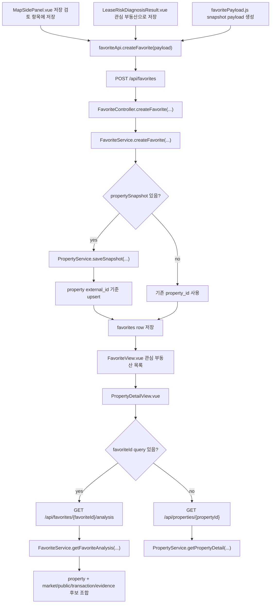

# 관심 부동산 상세와 진단 이력 연결 결정

> Status: First slice implemented

## Goal

이 문서는 `FavoriteView.vue`와 `PropertyDetailView.vue`가 보여주는 관심 부동산 상세 화면을 현재 매물 상세가 아니라 계약 전 재검토 리포트로 유지하기 위한 제품 결정을 정리한다. 핵심 질문은 아래 세 가지다.

```text
1. 관심 부동산 상세를 실제 정확 주소 위험진단 이력과 자동 연결할 것인가?
2. `PropertyDetailResponse.trendData`와 `FavoriteAnalysisResponse.priceTrend`를 구분해 표시하고 있는가?
3. 관심 부동산 저장 시 계약 목적, 보증금, 월세, 관리비, 매물 설명을 어디에 보존할 것인가?
```

## Current Implementation

현재 관심 부동산 저장과 상세 조회는 아래 흐름으로 동작한다.



주요 코드와 DB 객체는 아래와 같다.

| 책임 | 현재 파일 |
| --- | --- |
| 관심 부동산 목록 화면 | `frontend/src/views/FavoriteView.vue` |
| 관심 부동산 상세 화면 | `frontend/src/views/PropertyDetailView.vue` |
| 저장 요청 API module | `frontend/src/api/favoriteApi.js` |
| 상세 조회 API module | `frontend/src/api/propertyApi.js` |
| 지도에서 저장 payload 생성 | `frontend/src/components/map/MapSidePanel.vue` |
| 진단 결과에서 저장 payload 생성 | `frontend/src/components/home/LeaseRiskDiagnosisResult.vue`, `frontend/src/utils/favoritePayload.js`, `frontend/src/utils/kakaoGeocoding.js` |
| 저장 request DTO | `FavoriteCreateRequest`, `PropertySnapshotRequest` |
| 관심 부동산 저장 use case | `FavoriteService.createFavorite(...)` |
| property snapshot 저장 | `PropertyService.saveSnapshot(...)` |
| 상세 응답 생성 | `PropertyService.getPropertyDetail(...)`, `PropertyDetailResponse` |
| 관심 부동산 분석 응답 생성 | `FavoriteService.getFavoriteAnalysis(...)`, `FavoriteAnalysisResponse` |
| 관심 저장 table | `favorites` |
| 저장 위치/snapshot table | `property` |
| 정확 주소 위험진단 이력 table | `rent_risk_diagnosis_histories` |
| 분석 evidence table | `market_statistics_monthly`, `real_estate_transaction_facts`, `building_register_title_snapshots`, `public_price_snapshots`, `risk_evidence_snapshots` |

현재 `PropertySnapshotRequest`는 `price`, `monthlyRent`, `maintenanceFee`를 받지만 `contractPurpose`와 `listingDescription`은 받지 않는다. `PropertyDetailResponse.trendData`는 실제 실거래가 월별 추이가 아니라 `PropertyService.buildSimpleTrend(...)`가 `property.avgPrice`와 `property.price`로 만든 합성 비교값이다. 반면 `GET /api/favorites/{favoriteId}/analysis`의 `FavoriteAnalysisResponse.priceTrend`는 `FavoriteService.getFavoriteAnalysis(...)`가 조회한 `market_statistics_monthly` 월별 통계를 우선 검토하되, 통계 시계열이 12개월 미만이고 `real_estate_transaction_facts`를 월별로 묶은 기준점이 더 길면 실거래 fact 집계를 사용한다. 이 값은 관심 부동산 분석 전용 가격 흐름 기준점이다.

## Decision: 관심 저장 진입점은 지도와 진단 결과 양쪽에 둔다

### Context

사용자는 위치 검토 지도에서 청록색 정확 주소 후보를 고를 때도 관심이 생길 수 있고, 홈 정확 주소 위험진단 결과를 읽다가도 나중에 다시 보관하고 싶어질 수 있다. 관심 부동산 저장이 관심 목록 화면에만 있으면 분석 흐름 중 생기는 저장 의도를 놓친다.

### Options considered

1. 관심 목록 화면에서만 저장을 제공한다.
2. 지도 좌측 floating card에서만 저장을 제공한다.
3. 지도 좌측 floating card와 홈 진단 결과 floating action 양쪽에 저장 진입점을 둔다.

### Decision

3번을 선택한다. `MapSidePanel.vue`는 지도에서 클릭한 저장 위치와 청록색 정확 주소 후보를 `propertySnapshot`으로 저장한다. `LeaseRiskDiagnosisResult.vue`는 진단 결과의 정규화 주소와 입력 금액을 바탕으로 `frontend/src/utils/favoritePayload.js`가 payload를 만들고, `frontend/src/utils/kakaoGeocoding.js`가 Kakao geocoder로 주소 좌표를 확인한 뒤 같은 `POST /api/favorites`를 호출한다.

### Why

두 화면 모두 사용자가 "이 주소를 나중에 다시 봐야겠다"는 판단을 내리는 순간이다. 저장 동작을 별도 현재 매물 feed로 만들지 않고 기존 `FavoriteCreateRequest.propertySnapshot` 경계에 연결하면, ZIP:ON의 MVP 원칙인 현재 매물 미제공과 계약 전 검토 기준 저장을 동시에 지킬 수 있다.

### Tradeoffs

- 홈 진단 결과 응답에는 좌표가 없으므로 프론트에서 Kakao geocoder가 필요하다. API key가 없거나 주소 좌표 확인에 실패하면 사용자는 진단 지도에서 위치를 확인한 뒤 저장해야 한다.
- `favorites`는 아직 `diagnosis_id`를 직접 저장하지 않는다. 진단 결과에서 저장해도 현재는 property snapshot 중심 저장이며, 과거 진단 이력을 자동으로 "진단 완료" 상태로 병합하지 않는다.
- 같은 주소라도 진단 조건이 다르면 별도 snapshot이 생길 수 있다. 사용자별 검토 맥락을 더 정확히 보존하려면 향후 `favorite_review_contexts` 또는 명시적 `diagnosis_id` 연결을 다시 검토한다.

### Future revisit

`RentRiskDiagnosisResponse`가 좌표를 직접 내려주거나, `favorites`와 `rent_risk_diagnosis_histories`를 명시 연결하는 schema가 생기면 `kakaoGeocoding.js` 의존을 줄이고 `diagnosis_id` 기반 저장으로 전환할 수 있다.

## Decision: 진단 이력을 완료 판정으로 자동 병합하지 않는다

### Context

관심 부동산 상세에서 사용자가 과거에 실행한 정확 주소 위험진단 이력을 함께 보여주면 유용하다. 하지만 현재 `favorites.property_id`는 `property.id`만 가리키고, `property`는 지도에서 선택한 좌표와 표시 주소 중심의 snapshot이다. 반면 `rent_risk_diagnosis_histories`는 `address`, `normalized_address`, `legal_dong_code`, `contract_purpose`, `deposit_amount_manwon`, `monthly_rent_amount_manwon`, `maintenance_fee_amount_manwon`, `request_payload_json`, `response_payload_json`을 저장한다.

두 객체는 목적이 다르다.

```text
property:
지도/목록/로드뷰/상세 표시를 위한 위치와 가격 기준 snapshot

rent_risk_diagnosis_histories:
사용자가 특정 목적과 금액으로 실행한 정확 주소 위험진단 결과 snapshot
```

### Options considered

1. `property.address`와 `rent_risk_diagnosis_histories.address` 문자열이 비슷하면 자동 연결한다.
2. `legal_dong_code`와 주소 일부가 같으면 가장 최근 진단 이력을 자동 연결한다.
3. 관심 부동산 저장 시점에 사용자가 명시적으로 선택한 `diagnosis_id`만 연결한다.
4. 아직 자동 연결하지 않고, 상세 화면에서는 정확 주소 위험진단 CTA만 유지한다.

### Decision

MVP에서는 “진단 완료”처럼 보이는 자동 병합은 하지 않는다. 다만 1차 구현에서는 로그인 사용자 본인의 `rent_risk_diagnosis_histories.address` 또는 `normalized_address`가 관심 부동산 `property.address`와 정확히 같은 경우에 한해, `risk_evidence_snapshots`를 `DATA_QUALITY_GAP` feature의 후보 evidence로만 보여준다.

이 연결은 아래 의미가 아니다.

```text
이 관심 부동산은 이미 진단 완료
이 진단 결과가 현재 계약 목적과 금액에 그대로 유효
권리관계/보증보험/하자가 확인 완료
```

향후 사용자 행동으로 명시 연결을 제공하면 3번처럼 `diagnosis_id` 기반 연결로 승격한다.

### Why

주소 문자열 또는 좌표만으로 진단 이력을 자동 연결하면 아래 위험이 생긴다.

- 같은 건물이라도 호실, 층, 전유부, 계약 목적이 다르면 위험진단 결과가 달라질 수 있다.
- `property`의 주소는 Kakao 좌표 또는 지도 선택 결과일 수 있고, 진단 이력은 Juso 후보와 법정동코드를 기준으로 정제된 주소다.
- `rent_risk_diagnosis_histories`에는 보증금, 월세, 관리비, 계약 목적 같은 사용자별 민감 맥락이 있다.
- 과거 진단 이력을 자동으로 붙이면 사용자가 “이 관심 부동산은 이미 진단 완료”로 오해할 수 있다.

따라서 현재 `PropertyDetailView.vue`의 `정확 주소 위험진단으로 더 확인하기` CTA는 유지한다. 상세 화면은 “저장 snapshot과 후보 evidence 기반 사전 검토”이고, 위험진단 결과 화면은 `LeaseRiskDiagnosisResult.vue`가 담당한다.

### Tradeoffs

- 관심 부동산 상세에서 과거 진단 결과를 바로 재사용하는 편의성은 아직 없다.
- 사용자는 정확 주소 위험진단을 다시 실행하거나 마이페이지 진단 이력에서 따로 확인해야 한다.
- 대신 잘못된 주소/목적/금액 조합을 자동으로 섞는 위험을 피한다.

### Future revisit

다음 조건을 만족하면 명시 연결을 다시 검토한다.

- `favorites` 또는 별도 연결 table에 `diagnosis_id`를 저장할 수 있다.
- 연결 대상 진단 이력이 현재 로그인 사용자의 본인 이력임을 검증한다.
- `diagnosis_id`와 함께 `contract_purpose`, `deposit_amount_manwon`, `monthly_rent_amount_manwon`, `maintenance_fee_amount_manwon`을 화면에 다시 표시한다.
- 사용자가 “이 진단 결과를 관심 부동산에 연결” 같은 명시 행동을 수행한다.

권장 schema 방향은 아래 둘 중 하나다.

```text
Option A:
favorites.diagnosis_id nullable FK 추가

Option B:
favorite_diagnosis_links table 추가
- id
- favorite_id
- rent_risk_diagnosis_history_id
- linked_by_user_id
- created_at
```

연결 이력이 늘어나거나 한 관심 부동산에 여러 번 재진단을 붙일 가능성이 있으면 Option B가 더 안전하다.

## Decision: trendData는 호환용, priceTrend는 분석 그래프용으로 분리한다

### Context

현재 `PropertyService.toDetailResponse(...)`는 `buildSimpleTrend(property.getAvgPrice(), property.getPrice())`로 `trendData`를 만든다. 이 값은 실제 외부 API 실거래가 월별 데이터가 아니다.

```java
return List.of(
        Math.max(base - 300, 0),
        Math.max(base - 150, 0),
        base,
        base + 120,
        base + 240,
        base + 180
);
```

### Decision

`trendData`는 기존 API 호환을 위해 당장 유지한다. 다만 `favoriteId`가 있는 관심 부동산 상세에서는 `GET /api/favorites/{favoriteId}/analysis`가 내려주는 `priceTrend`를 우선 사용한다. `priceTrend`는 최근 최대 24개월의 `market_statistics_monthly`를 먼저 검토하고, 통계 시계열이 12개월 미만인데 더 넓게 조회한 `real_estate_transaction_facts` 월별 집계가 더 길면 실거래 fact 기준점을 사용한다. 각 기준점은 `period`, `periodLabel`, `primaryAmountManwon`, `monthlyRentAmountManwon`, `sampleCount`, `sourceLabel`로 내려간다.

`PropertyDetailView.vue`는 가격 영역을 막대 몇 개가 아니라 비교 가능한 SVG 리포트 차트로 표시한다. 12개월 이상 자료가 있으면 장기 흐름으로 읽을 수 있게 하고, 자료가 12개월 미만이면 `최신 자료 N개 기준`처럼 부족 상태를 명확히 표시한다. 기준점이 1개뿐이면 선형 추세 그래프를 그리지 않고 `단일 기준점만 확인됨` 안내를 보여준다. 화면 제목은 `최근 거래 기준 가격 흐름`처럼 실제 데이터 기반임을 말하되, 법적 확정 판단처럼 보이는 표현은 피한다.

가격 그래프는 최소한 아래 비교 장치를 포함해야 한다.

```text
1. 범례: 보증금/매매가, 내 조건, 최근 평균, 월별 표본 수
2. 기준선: 사용자가 저장한 내 조건과 최근 평균을 같은 축에 표시
3. 표본 수: 월별 대표값 신뢰도를 볼 수 있는 막대
4. 요약 지표: 분석 기간, 기간 변화율, 최저/최고, 총 표본 수
5. 보조축: 월세 자료가 2개 이상 있으면 보증금 축과 섞지 않고 별도 미니 그래프로 표시
6. 비교 카드: `comparisonSummary.items`의 내 조건, 최근 자료 평균, 최근 기준점, 지역 기준, 공시가격
```

### Why

사용자가 막대 chart를 보면 자연스럽게 시계열 그래프로 이해할 수 있다. `trendData`는 합성 참고값이므로 추세·변동성·실거래 흐름처럼 읽히면 제품 신뢰를 해친다. 그래서 관심 부동산 분석 API에는 실제 저장 거래 fact에서 만든 `priceTrend`를 별도 필드로 추가하고, 화면에서는 이 값을 먼저 사용한다.

### Tradeoffs

- 기존 `GET /api/properties/{propertyId}` fallback은 여전히 `trendData`만 가진다.
- 관심 부동산 분석 화면은 `priceTrend`가 없으면 저장 기준 비교값으로 흐름을 대체하지 않고 자료 부족으로 표시한다. `trendData` fallback은 `favoriteId` 없이 `GET /api/properties/{propertyId}`만 보는 호환 화면에 한정한다.
- `priceTrend`는 최근 저장 fact 또는 월별 통계 기준이므로 자료가 적으면 12개월 흐름을 보장하지 않는다. 이 경우 화면은 자료 부족 상태를 함께 보여준다.
- `market_statistics_monthly`가 충분히 적재되지 않은 지역·유형에서는 더 긴 `real_estate_transaction_facts` 월별 집계에 의존한다. 이 fallback은 raw 거래 목록 노출이 아니라 가격 흐름 기준점 산정이다.

### Future revisit

더 정교한 과거 지표가 준비되면 API 필드를 아래처럼 확장한다.

```text
priceReferenceBars:
저장 평균과 입력 금액으로 만든 참고 비교값

transactionTrend:
실제 실거래가 월별 집계, 기간, 거래 수, 데이터 출처, 한계 문구 포함
```

이때 `trendData`는 deprecated 처리하거나 `priceReferenceBars`로 이름을 바꾼다. 실제 거래 trend는 거래 월, 거래 수, 대표값 산정 기준, 유사 면적대·유사 주택유형 필터 조건이 함께 내려와야 한다.

## Decision: 관심 부동산 검토 등급은 고정값이 아니라 근거와 위험 신호로 산정한다

### Context

기존 `FavoriteService.buildAnalysisResponse(...)`는 `FavoriteAnalysisResponse.ReportSummaryResponse.riskLevel`을 항상 `CAUTION`으로 내려보냈다. 프론트엔드 `PropertyDetailView.vue`는 `CAUTION`을 D등급으로 변환하므로, 공공데이터가 연결된 리포트와 자료가 거의 없는 리포트가 모두 비슷한 D등급으로 보였다.

### Decision

`FavoriteService.assessFavoriteReport(...)`가 관심 부동산 검토 등급을 산정한다. 산정 기준은 아래 신호를 합친다.

- 연결 근거 수: `building_register_title_snapshots`, `market_statistics_monthly`, `real_estate_transaction_facts`, `public_price_snapshots`, `risk_evidence_snapshots`, R-ONE 시장지표 signal
- 가격 위치: 저장 금액과 `property.avgPrice`, 지역 월별 통계 중앙값, 공시가격 후보의 비율
- 계약 목적: 전세·월세에서는 공시가격과 임대가격 압력, 월세에서는 월 고정비 비교
- 데이터 품질: 진단 evidence의 `MISSING_DATA`, 낮은 confidence, 비정상 data quality
- 시장 signal: 최신성, 12기간 변동성, 전세·월세 상승 압력 또는 매매 하락 흐름
- 건물 노후도: 저장 snapshot의 사용승인 연도

응답 `riskLevel`은 `LOW`, `MODERATE`, `CAUTION`, `HIGH`, `CRITICAL`, `NEED_MORE_INFORMATION` 중 하나다. `PropertyDetailView.vue`는 이를 B/C/D/E/F 또는 자료 보완 상태로 표시한다. 특히 `NEED_MORE_INFORMATION`은 D등급으로 보이지 않게 `자료 부족` 상태로 분리한다.

`FavoriteAnalysisResponse.aiAssessment.enabled=false`인 현재 MVP 화면은 이 영역을 `AI 구조화 분석`이 아니라 `기준별 보조 점검`으로 표시한다. 시장 signal과 저장 근거를 기준별로 풀어 보여줄 수는 있지만, AI가 최종 등급을 판정한 것처럼 보이면 제품 책임 범위와 충돌한다.

### Why

ZIP:ON의 리포트는 안전·위험을 확정하는 법률 판정이 아니다. 하지만 모든 리포트가 D등급이면 사용자는 실제 위험 신호와 단순 자료 부족을 구분할 수 없다. 동적 산정은 “근거가 잘 연결된 보완 검토”와 “자료가 거의 없어 판단 보류”를 분리해 보여준다.

### Tradeoffs

- 점수 모델은 아직 정교한 감정평가나 법률 판단이 아니라 MVP용 휴리스틱이다.
- 근거가 많아도 등기부등본, 선순위 임차인, 보증보험, 실제 하자는 확정하지 않는다.
- 새 데이터가 적재되면 같은 관심 부동산의 등급이 달라질 수 있으므로, 화면은 기준 시점과 직접 확인 항목을 계속 함께 보여줘야 한다.

### Tests

`FavoriteAnalysisIntegrationTest.favoriteAnalysisCombinesSnapshotPublicDataAndDiagnosisEvidence()`는 월별 통계 3개월을 seed하고, `GET /api/favorites/{favoriteId}/analysis`가 `reportSummary.riskLevel=MODERATE`, `confidenceLevel=HIGH`, `priceTrend` 3개 기준점을 내려주는지 검증한다.

## Decision: 계약 목적과 매물 설명은 property가 아니라 favorite 맥락으로 저장한다

### Context

관심 부동산 저장 시 사용자가 입력한 계약 목적, 보증금, 월세, 관리비, 매물 설명을 더 정교하게 보존하려는 요구가 있다. 현재 구조에서 보증금은 `property.price`, 월세는 `property.monthly_rent`, 관리비는 `property.maintenance_fee`로 저장된다. 그러나 `contractPurpose`와 `listingDescription`은 `PropertySnapshotRequest`에 없다.

문제는 `property`가 사용자별 계약 검토 맥락을 저장하기에 적합하지 않다는 점이다. `property.external_id`는 unique이고, `PropertyService.saveSnapshot(...)`은 같은 `external_id`가 있으면 기존 row를 update한다. 즉 같은 지도 snapshot을 여러 사용자가 저장하면 사용자별 목적과 설명이 뒤섞일 수 있다.

### Options considered

1. `property` table에 `contract_purpose`, `listing_description` column을 추가한다.
2. `favorites` table에 사용자별 검토 맥락 column을 추가한다.
3. `favorite_review_contexts` 같은 1:1 child table을 추가한다.
4. 지금은 저장하지 않고 정확 주소 위험진단 이력에만 보존한다.

### Decision

정교한 보존이 필요해지면 3번을 선택한다. 계약 목적, 보증금, 월세, 관리비, 매물 설명은 `property`가 아니라 `favorite_id`에 종속된 사용자별 review context로 저장한다.

권장 table 초안:

```sql
CREATE TABLE favorite_review_contexts (
    id BIGINT AUTO_INCREMENT PRIMARY KEY,
    favorite_id BIGINT NOT NULL,
    contract_purpose VARCHAR(30),
    deposit_amount_manwon BIGINT,
    monthly_rent_amount_manwon BIGINT,
    maintenance_fee_amount_manwon BIGINT,
    listing_description TEXT,
    source_diagnosis_history_id BIGINT,
    created_at DATETIME(6) NOT NULL DEFAULT CURRENT_TIMESTAMP(6),
    updated_at DATETIME(6) NOT NULL DEFAULT CURRENT_TIMESTAMP(6) ON UPDATE CURRENT_TIMESTAMP(6),
    CONSTRAINT fk_favorite_review_contexts_favorite
        FOREIGN KEY (favorite_id) REFERENCES favorites (id)
        ON DELETE CASCADE,
    CONSTRAINT fk_favorite_review_contexts_diagnosis
        FOREIGN KEY (source_diagnosis_history_id) REFERENCES rent_risk_diagnosis_histories (id)
        ON DELETE SET NULL,
    CONSTRAINT uq_favorite_review_contexts_favorite
        UNIQUE (favorite_id)
);
```

### Why

- `property`는 위치와 기본 snapshot의 공유 catalog에 가깝다.
- `favorites`는 로그인 사용자와 저장 행위를 나타낸다.
- 계약 목적과 매물 설명은 사용자별 입력이므로 `favorite_id`에 붙는 편이 자연스럽다.
- 진단 이력과 연결할 때도 `source_diagnosis_history_id`를 nullable로 둬 명시 연결만 표현할 수 있다.

### Tradeoffs

- table과 mapper가 하나 늘어난다.
- `FavoriteService.createFavorite(...)`가 저장 후 context까지 저장하는 transaction boundary를 가져야 한다.
- 상세 응답 `PropertyDetailResponse`만으로는 부족하므로 `FavoriteDetailResponse` 또는 `/api/favorites/{favoriteId}`가 필요할 수 있다.

### Current implementation and future revisit

현재 구현은 별도 `favorite_review_contexts` table 없이 진행한다. 홈 위험진단 결과의 `LeaseRiskDiagnosisResult.vue`와 지도 패널의 `MapSidePanel.vue`는 `frontend/src/utils/favoritePayload.js`를 통해 `propertySnapshot`과 `favoriteName`을 만들고, `FavoriteService.createFavorite(...)`가 `PropertyService.saveSnapshot(...)`으로 `property.external_id` 기준 upsert 후 `favorites.property_id`에 연결한다.

아래 조건 중 하나가 생기면 `favorite_review_contexts` 같은 사용자별 context schema를 다시 검토한다.

- 사용자가 관심 부동산 목록이나 상세에서 계약 목적, 보증금, 월세, 관리비, 설명을 저장 후 수정해야 한다.
- 여러 정확 주소 위험진단 이력 중 특정 이력을 사용자가 명시 선택해 관심 부동산과 연결해야 한다.
- 같은 `property` snapshot을 여러 사용자가 서로 다른 계약 조건으로 저장하면서, 사용자별 조건을 `property` row에 둘 수 없는 요구가 커진다.

## Decision: 관심 부동산 분석은 feature와 finding 계층으로 분리한다

### Context

현재 DB에는 `property`, `favorites`뿐 아니라 `property_identity_candidates`, `building_register_title_snapshots`, `real_estate_transaction_facts`, `market_statistics_monthly`, `public_price_snapshots`, `rent_risk_diagnosis_histories`, `risk_evidence_snapshots` 같은 원천·snapshot·evidence table이 있다. `PropertyDetailView.vue`는 `route.query.favoriteId`가 있으면 `GET /api/favorites/{favoriteId}/analysis`를 먼저 호출하고, `favoriteId` 없이 직접 URL로 들어온 경우에만 `GET /api/properties/{propertyId}`를 fallback으로 사용한다. 따라서 관심 부동산 상세의 중심 계약은 `FavoriteAnalysisResponse`이고, `PropertyDetailResponse`는 호환/직접 URL용 보조 계약이다.

이 상태에서는 table 수가 많아져도 사용자에게는 아래 정도만 보인다.

```text
저장된 주소
저장 가격
저장 평균 대비 합성 막대
일반 체크리스트
```

이것은 ZIP:ON의 차별점인 “흩어진 공공데이터를 목적별 판단 문장으로 바꾸는 서비스”에 충분하지 않다. 일반 사용자가 하기 어려운 일은 각 API 값을 따로 보는 것이 아니라, 서로 다른 출처의 값을 같은 질문으로 묶는 것이다.

### Options considered

1. `PropertyDetailView.vue`에서 여러 API를 각각 호출해 화면에서 조합한다.
2. `PropertyService.getPropertyDetail(...)`에 모든 분석 조합 로직을 계속 추가한다.
3. 관심 부동산 분석 전용 API와 feature/finding 응답 모델을 만든다.
4. 즉시 대규모 `analysis_*` table과 rule engine을 만든다.

### Decision

3번을 목표 구조로 선택한다. 4번처럼 대규모 table과 rule engine을 바로 만들지는 않는다. 1차 구현은 관심 부동산 분석 전용 응답 계약을 만들고, `FavoriteService.getFavoriteAnalysis(...)`가 기존 원천/분석 table에서 조회 가능한 근거를 조합해 feature/finding/AI card 리포트로 내려준다.

구현 endpoint:

```text
GET /api/favorites/{favoriteId}/analysis
```

이 endpoint는 `property` row 하나가 아니라 “관심 부동산 사전 검토 리포트”를 반환한다. 1차 구현에서 조합하는 근거는 아래와 같다.

```text
property
favorites
legal_dong_codes
market_statistics_monthly
real_estate_transaction_facts
building_register_title_snapshots
public_price_snapshots
rent_risk_diagnosis_histories
risk_evidence_snapshots
```

```json
{
  "favoriteId": 10,
  "propertyId": 31,
  "title": "서초 푸르지오 스튜디오 C",
  "reportSummary": {
    "headline": "저장 금액은 평균과 가깝지만 권리관계와 건축물대장 확인 전입니다.",
    "riskLevel": "CAUTION",
    "confidenceLevel": "LOW"
  },
  "priceTrend": [
    {
      "period": "202605",
      "periodLabel": "2026.05",
      "primaryAmountManwon": 1000,
      "monthlyRentAmountManwon": 80,
      "sampleCount": 1,
      "sourceLabel": "전월세 실거래 자료"
    }
  ],
  "features": [
    {
      "code": "DEPOSIT_POSITION",
      "title": "보증금 위치",
      "judgement": "입력 보증금은 저장 평균과 가깝지만 매매 대표값·공시가격과 아직 결합되지 않았습니다.",
      "evidence": [
        "입력 금액: 보증금 1,000만 원 / 월세 80만 원",
        "지역 중앙값: 보증금 1,100만 원 / 월세 85만 원",
        "공시가격 후보: 1억 8,000만 원"
      ],
      "limitation": "유사 면적 거래 수와 공시가격이 부족하면 전세가율을 확정할 수 없습니다.",
      "action": "전월세 fact, 매매 fact, 공시가격 snapshot을 같은 주소 기준으로 연결하세요."
    }
  ],
  "dashboardGrade": {
    "letter": "C",
    "label": "보완 후 검토",
    "score": 62,
    "confidenceLevel": "MEDIUM",
    "description": "가격과 일부 공공데이터는 연결됐지만 권리관계와 직접 확인 항목이 남아 있습니다.",
    "reasons": [
      "건축물대장은 정확 주소 기준으로 확인했습니다.",
      "등기부등본과 선순위 임차인 정보는 직접 확인이 필요합니다."
    ]
  },
  "aiAssessment": {
    "enabled": true,
    "statusLabel": "저장된 구조화 위험진단 연결",
    "limitation": "이전 위험진단의 고정 위험 기준을 함께 표시합니다. 그래도 최종 등급과 화면 문구는 백엔드 계산 결과이며, 계약 가능 여부를 확정하지 않습니다.",
    "criteria": [
      {
        "criterion": "REGISTRY_RIGHTS_DOCUMENT_RISK",
        "title": "등기 권리관계 문서 위험",
        "summary": "문서 확인 필요 기준입니다. 권리관계는 현재 데이터만으로 안전하다고 말할 수 없습니다.",
        "evidence": "자동 근거보다 직접 확인해야 할 자료가 더 중요합니다.",
        "limitation": "등기부등본 원본이 없어 권리관계를 확정할 수 없습니다.",
        "action": "최신 등기부등본 갑구·을구를 확인하세요."
      }
    ]
  }
}
```

### Why

- 화면에서 여러 API를 직접 조합하면 프론트가 분석 규칙을 갖게 되어 재사용과 테스트가 어렵다.
- `PropertyService`에 계속 붙이면 저장 snapshot 조회와 분석 리포트 생성 책임이 섞인다.
- 분석 전용 API는 여러 table의 값과 한계를 백엔드에서 검증한 뒤, 화면에는 이미 해석된 feature/finding 단위로 내려줄 수 있다.
- AI 분석 카드도 이 feature/finding을 입력으로 삼아야 하므로, 원천 데이터를 바로 AI에 넘기는 구조보다 안전하다.

### Tradeoffs

- `GET /api/properties/{propertyId}`와 별도로 관심 부동산 분석 API가 필요하다.
- 첫 구현은 정확 주소/PNU foreign key 없이 법정시군구와 동일 주소 문자열로 후보 근거를 묶으므로, feature 문구가 반드시 후보/한계임을 밝혀야 한다.
- 사용자가 `propertyId`만 가진 URL로 진입한 경우와 `favoriteId`가 있는 경우의 화면 흐름을 나눠야 한다.

### Future revisit

feature 계산 결과를 매번 즉시 조합하는 비용이 커지거나, 같은 분석 결과를 재분석/감사/AI 산정에 반복 사용하게 되면 아래 table 후보를 검토한다.

```text
favorite_analysis_snapshots
analysis_feature_values
analysis_findings
analysis_evidence_links
```

이 table들은 AI 답변 저장소가 아니라 백엔드가 재현 가능한 분석 근거를 저장하는 materialized analysis layer여야 한다.

## Analysis Feature Catalog

관심 부동산 상세에서 우선 만들어야 할 feature는 아래 순서다.

| feature code | 조합할 데이터 | 사용자에게 보여줄 질문 | 자동 확정 금지 |
| --- | --- | --- | --- |
| `PROPERTY_IDENTITY_MATCH` | `property`, `property_identity_candidates`, `building_register_title_snapshots` | 사용자가 저장한 유형과 공부상 정체가 맞는가? | 주용도만으로 실제 사용 가능성과 위반 여부 확정 |
| `DEPOSIT_POSITION` | `property.price`, `real_estate_transaction_facts`, `market_statistics_monthly`, `public_price_snapshots` | 입력 보증금이 주변 전월세·매매·공시가격 기준에서 어디인가? | 현재 시세, 보증금 회수 가능성 확정 |
| `MONTHLY_COST_BURDEN` | `property.monthly_rent`, `property.maintenance_fee`, 전월세 fact 월세 대표값 | 월세와 관리비를 합친 고정비가 과도한가? | 실제 관리비 포함 항목 자동 확인 |
| `REGIONAL_TREND_SIGNAL` | `market_statistics_monthly`, `kab_r_one_statistical_data_points` | 지역·유형 흐름이 안정적인가, 변동성이 큰가? | 미래 가격 예측 |
| `DATA_QUALITY_GAP` | `risk_evidence_snapshots`, `rent_risk_diagnosis_histories`, 직접 확인 상태 | 무엇이 부족해서 판단을 못 하는가? | 등기 권리관계, 선순위 임차인, 하자 자동 확정 |

각 feature는 아래 네 요소를 반드시 가져야 한다.

```text
판단 문장
사용한 데이터
데이터 한계
직접 확인할 것
```

이 네 요소가 없으면 단순 데이터 카드이지 ZIP:ON 분석 카드가 아니다.

## AI Card Boundary

`PropertyDetailView.vue`에는 AI 구조화 분석 카드 공간이 필요하다. 하지만 이 공간은 AI가 자유롭게 결론을 내리는 곳이 아니다.

AI card의 입력:

```text
analysis feature
evidence
missing data
limitation
recommended action
```

AI card의 출력:

```text
고정 criterion별 설명 보조
근거 요약
부족한 데이터 요약
사용자 확인 행동 문장 보조
```

AI card가 하면 안 되는 일:

```text
최종 안전/위험 판정
전세사기 확정
등기 권리관계 확정
보증보험 가능성 확정
없는 데이터를 추정해 채우기
```

최종 점수, 등급, 불확실성 penalty, 화면 verdict, fallback은 `RiskScoreAggregator`, `RiskGradeCalculator`, `RiskScoringFallbackService` 같은 백엔드 코드가 책임져야 한다.

## Decision: 관심 목록은 이미지 없는 검토 큐, 상세는 등급 우선 대시보드로 둔다

### Context

기존 `FavoriteView.vue`는 관심 부동산을 카드 grid로 보여주면서 큰 건물 placeholder 영역을 먼저 노출했다. 이 구조는 현재 매물 사진이나 매물 홍보 카드처럼 보일 수 있고, ZIP:ON이 제공해야 하는 계약 전 판단 정보보다 시각 장식이 먼저 보이는 문제가 있다.

기존 `PropertyDetailView.vue`도 로드뷰와 여러 정보 카드가 섞여 있어 사용자가 아래 세 질문을 빠르게 잡기 어려웠다.

```text
1. 지금 투자/계약 검토를 진행해도 되는가?
2. 현재 이 물건의 상태는 어느 정도인가?
3. AI/구조화 분석은 왜 이런 판단을 했는가?
```

### Decision

`FavoriteView.vue`는 이미지 영역을 제거하고, 저장된 관심 부동산을 한 줄 검토 큐로 보여준다. 각 행은 이름, 저장 기준 상태, 다음 확인 항목, 리포트 진입만 노출한다. 사용자는 현재 매물 사진을 고르는 것이 아니라, 저장한 검토 대상을 다시 여는 흐름으로 이해해야 한다.

`PropertyDetailView.vue`는 상단에서 A~F 검토 등급을 먼저 보여준다. 이 등급은 투자 추천 점수가 아니라 `FavoriteService.getFavoriteAnalysis(...)`가 `FavoriteAnalysisResponse.dashboardGrade`로 계산한 사전 검토 신호다. 가격 그래프와 표시용 라벨은 프론트에서 만들 수 있지만, 위험 점수·등급·AI criterion을 새로 계산하지 않는다. 화면의 중심 근거는 `features`다. 즉 DB 행을 많이 노출하는 것이 아니라, `PROPERTY_IDENTITY_MATCH`, `DEPOSIT_POSITION`, `REGIONAL_TREND_SIGNAL`, `DATA_QUALITY_GAP` 네 판단 축으로 근거·한계·다음 행동을 먼저 보여준다. 이전 정확 주소 위험진단의 `riskAssessment`가 연결된 경우에만 그 기준별 근거를 별도 하단 섹션으로 펼친다.

```text
A~F 검토 등급과 요약
-> 가격 흐름과 자료 연결 상태
-> DB 판단 근거: 물건 정체, 가격 위치, 지역 흐름, 근거 품질
-> 연결된 정확 주소 위험진단 기준(있을 때만)
-> 지역·유형 시장 흐름
-> 직접 확인 체크리스트
```

AI 구조화 분석 영역은 컬럼명, 가중치, raw enum을 설명하지 않는다. 사용자가 이해해야 하는 것은 "왜 C인가", "무엇 때문에 보류인가", "계약 전에 무엇을 확인해야 하는가"다. 이전 정확 주소 위험진단의 `riskAssessment`가 같은 주소로 연결되면 `FavoriteService`는 그 안의 `criteria`를 `aiAssessment.criteria` 사용자 문장으로 변환한다. 이전 위험진단이 없으면 새 OpenAI 호출을 만들지 않고, 현재 확보된 공공데이터와 직접 확인 필요 항목만 기준으로 fallback 카드를 내려준다.

### Why

- 관심 부동산은 현재 매물 목록이 아니라 저장한 사전 검토 대상이다.
- 건물 이미지 placeholder는 실제 판단 정보가 없으면서 화면 우선순위를 차지한다.
- A~F 등급을 먼저 보여주면 사용자가 현재 상태를 빠르게 파악하고, 아래 근거를 읽을 이유가 생긴다. 단, 등급의 근거는 백엔드 응답이어야 한다.
- 등급 근거를 가격·흐름·근거 연결·직접 확인 영역으로 분리하면 “좋다/나쁘다”보다 “무엇을 확인해야 하는가”로 이어진다.
- 프론트 화면은 백엔드의 구조화 분석을 사용자 언어로 재배치할 수 있지만, 등기·선순위·하자·보증보험 같은 영역을 확정 판정처럼 표시하면 안 된다.
- R-ONE 시장지표는 `marketContext.signals[]`로 분리 표시한다. 이 지표는 현재 매물 목록, 현재 호가, 개별 물건 안전성 확정값이 아니라 지역·유형 과거 흐름의 보조 근거다.

### Tradeoffs

- `dashboardGrade`는 백엔드 계산 결과지만, `RentRiskDiagnosisResponse.riskAssessment.riskGrade`를 그대로 복사한 최종 법적·계약 판정은 아니다.
- 관심 부동산 리포트가 이전 `riskAssessment`를 재사용하더라도 새 OpenAI 호출이 발생하지 않는다. 따라서 화면은 "저장된 구조화 위험진단 연결"과 "직접 확인 필요"를 분리해서 말해야 한다.
- `marketContext`가 붙으면서 화면 설명력은 좋아졌지만, R-ONE summary가 없거나 오래된 경우에는 "데이터 부족"을 그대로 보여줘야 한다.
- 프론트엔드는 백엔드 응답을 읽기 쉬운 카드로 재배치하지만, fallback AI criterion이나 위험 점수는 만들지 않는다.
- 대신 MVP 범위 안에서는 신규 schema 없이 사용자가 보기 쉬운 판단 대시보드로 개선할 수 있다.

### Future revisit

현재 구현은 같은 사용자와 같은 주소 문자열/정규화 주소를 기준으로 최신 위험진단 이력을 참고한다. 여러 진단 이력 중 사용자가 특정 진단을 직접 선택해야 하는 요구가 생기면, `favorite_analysis_snapshots` 또는 `favorites.source_diagnosis_history_id` 같은 명시 연결 schema를 다시 검토한다. 이때도 화면에는 등급, 근거, 한계, 다음 행동을 보여주고, 가중치나 내부 컬럼명은 사용자 문구로 바꿔야 한다.

## UI Requirements

`PropertyDetailView.vue`는 아래 문구 원칙을 지켜야 한다.

| 영역 | 사용할 표현 | 피할 표현 |
| --- | --- | --- |
| 관심 목록 | 사전 검토 리포트, 투자/계약 판단 대시보드 | 매물 카드, 건물 이미지, 추천 매물 |
| 화면 이름 | 관심 부동산 사전 검토, 검토 등급 | 매물 상세, 추천 매물 |
| 등급 | A~F 검토 등급, 조건부 검토, 보완 후 검토 | AI 확정 등급, 투자 추천 확정 |
| 타이밍 | 지금 검토해도 되는가, 조건부 검토 | 지금 사야 함, 무조건 보류 |
| 가격 그래프 | 최근 거래 기준 가격 흐름, 최신 자료 N개 기준 | 실거래 추이가 아님, 참고용일 뿐 |
| 진단 연결 | 정확 주소 위험진단으로 더 확인하기 | 진단 완료, 안전 확정 |
| 매물 정보 | 매물 기본 정보, 건축물 정보 확인 | 물건 정체 분석, property snapshot |
| 시장 맥락 | 지역·유형 시장 흐름, R-ONE 시장지표, 기준시점, 변동성 | 현재 매물, 실시간 호가, 인기 매물 |
| 부족 데이터 | 비교 자료 부족, 직접 확인 필요 | 문제 없음 |

현재 구현은 화면 표시 전 `PropertyDetailView.vue`의 computed view model에서 백엔드 응답을 사용자 문구로 변환한다. 일반 사용자 화면에는 `building_register_title_snapshots`, `market_statistics_monthly`, `real_estate_transaction_facts`, `risk_evidence_snapshots`, `fact`, `evidence`, `LOW_CONFIDENCE` 같은 내부 table/key/enum 표현을 직접 노출하지 않는다.

주요 화면 순서는 아래와 같다.

```text
A~F 검토 등급과 요약
-> 최근 거래 기준 가격 흐름
-> 자료 연결 상태
-> DB 판단 근거
-> 연결된 정확 주소 위험진단 기준(있을 때만)
-> 지역·유형 시장 흐름
-> 직접 확인 체크리스트
```

## Testing And Verification

현재 구현을 수정하거나 회귀 검증할 때 최소 검증은 아래 순서로 진행한다.

```text
1. cd frontend && npm run build
2. 관심 부동산 상세 브라우저 확인
   - 관심 목록에서 건물 이미지 placeholder가 보이지 않는다.
   - 상세 상단에서 A~F 검토 등급이 먼저 보인다.
   - 투자/계약 타이밍 판단이 가격, 흐름, 근거 수준과 분리되어 보인다.
   - AI 구조화 분석이 등급, 근거, 한계, 다음 행동으로 설명된다.
   - 지역·유형 시장 흐름 섹션이 `marketContext.signals[]`를 표시하고, 현재 매물/실시간 호가처럼 보이지 않는다.
   - 프론트가 `aiAssessment.criteria` fallback이나 자체 위험 점수를 만들지 않는다.
   - 한눈에 보는 결론에 DB table명, raw key, raw enum이 보이지 않는다.
   - 결론 카드는 긴 문장 나열이 아니라 라벨/값/상태 배지 중심으로 읽힌다.
   - 그래프 제목이 `최근 거래 기준 가격 흐름`처럼 실제 데이터 기반 표현을 쓴다.
   - 가격 그래프에는 범례, 내 조건 기준선, 최근 평균 기준선, 월별 표본 수 막대가 보인다.
   - 월세 기준점이 2개 이상이면 보증금/매매가와 같은 축에 섞지 않고 별도 보조 추이로 표시한다.
   - `comparisonSummary.items`의 지역 기준과 공시가격까지 비교 카드로 표시한다.
   - `market_statistics_monthly`가 12개월 미만이고 `real_estate_transaction_facts` 월별 집계가 더 길면 더 긴 실거래 기준점이 `priceTrend`로 표시된다.
   - `priceTrend`가 부족하면 `최신 자료 N개 기준` 또는 `자료 부족` 상태가 보인다.
   - 정확 주소 위험진단 CTA가 최종 진단 완료처럼 보이지 않는다.
   - AI 구조화 분석 카드가 있고 AI가 최종 판정자처럼 보이지 않는다.
3. 백엔드 분석 연결을 수정한 경우:
   - cd backend && ./mvnw -Dtest=FavoriteAnalysisIntegrationTest test
   - cd backend && ./mvnw -Dtest=RentRiskDiagnosisHistoryIntegrationTest test
```

## Debugging Checklist

- `PropertyDetailView.vue`에서 raw table/key/enum을 일반 사용자 화면에 노출하고 있지 않은가?
- `marketContext.signals[]`에 `DTA_VAL`, `CLS_ID`, `GRP_ID`, `market_indicator_observation` 같은 원천/구현 용어가 새지 않는가?
- `dashboardGrade`가 백엔드 `reportSummary.riskLevel`만 매핑하고, 프론트에서 자체 점수 계산을 하지 않는가?
- `PropertyDetailResponse.trendData` fallback과 `FavoriteAnalysisResponse.priceTrend`를 구분하고 있는가?
- `priceTrend`가 12개월 미만일 때 자료 부족 상태를 함께 보여주는가?
- `FavoriteService.createFavorite(...)`가 사용자별 맥락을 `property` row에 덮어쓰고 있지 않은가?
- 진단 evidence를 후보로 연결한다면 본인 이력인지 검증하는가?
- 주소 문자열이 정확히 같은 경우만 후보 evidence로 쓰고 있는가?
- 후보 evidence를 “진단 완료” 또는 “안전 확정”처럼 표시하지 않는가?

## Learning Path

1. First read: [과거 지표 기반 부동산 분석 MVP 범위](/docs/product/MVP_SCOPE.md)
2. Then inspect: `frontend/src/views/FavoriteView.vue`, `frontend/src/views/PropertyDetailView.vue`
3. Then inspect: `frontend/src/components/home/LeaseRiskDiagnosisResult.vue`, `frontend/src/components/map/MapSidePanel.vue`, `frontend/src/utils/favoritePayload.js`
4. Then inspect: `FavoriteCreateRequest`, `PropertySnapshotRequest`, `FavoriteService`, `PropertyService`
5. Then inspect: `V9__create_favorite_schema.sql`, `V17__create_property_catalog.sql`, `V18__support_property_favorite_snapshots.sql`, `V11__create_rent_risk_diagnosis_history.sql`
6. Then run: `cd frontend && npm run build`
7. Then debug: 브라우저에서 `/properties/{propertyId}?favoriteId={favoriteId}`의 화면 문구와 Network 응답의 `priceTrend`, `features`, `marketContext`, `aiAssessment`를 함께 확인한다.
8. Key concept to understand: shared catalog data와 user-specific review context를 같은 table에 섞으면 사용자별 계약 판단 맥락이 오염된다. 또한 프론트에서 위험 점수를 다시 계산하면 백엔드 검증·감사·fallback 정책이 우회된다.

## Related Documents

- [제품 기준과 서비스 경계](/docs/product/PRODUCT_OVERVIEW.md)
- [과거 지표 기반 부동산 분석 MVP 범위](/docs/product/MVP_SCOPE.md)
- [프론트엔드 화면 분석 정책](/docs/frontend/SCREEN_ANALYSIS_POLICY.md)
- [프론트엔드 컴포넌트 역할 지도](/docs/frontend/COMPONENT_ROLE_MAP.md)
- [저장소 정책](/docs/architecture/DATA_STORAGE_POLICY.md)
- [API 명세와 프론트엔드 연결 현황](/docs/api/API_FRONTEND_CONNECTION_SPEC.md)
