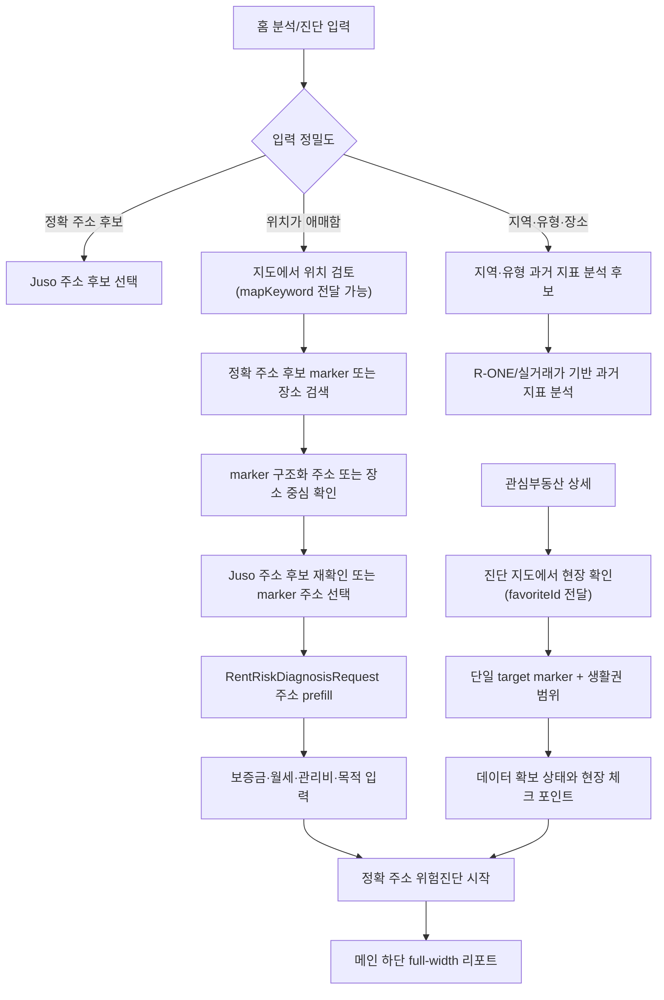

# 지도 기반 진단 지도 UX 계획

> Status: Location selection, exact-address marker, diagnosis-context, field-check storage, and report reflection slices implemented

이 문서는 ZIP:ON의 지도 화면을 현재 매물 탐색 지도가 아니라 정확 주소 위험진단과 지역·유형 과거 지표 분석을 돕는 보조 도구로 설계하기 위한 기준이다. 지도는 많은 데이터를 전시하는 화면이 아니라, 사용자가 진단하려는 위치와 주소 후보를 더 정확하게 고르고, 관심부동산의 생활권과 현장 확인 포인트를 분리해서 보는 진단 렌즈로 사용한다.

## Goal

ZIP:ON의 지도 UX 목표는 아래 한 문장으로 고정한다.

```text
지도는 데이터 전시장이 아니라 진단 렌즈다.
```

사용자가 지도에서 얻어야 하는 핵심 확신은 "여기에 매물이 많다"가 아니라 "내가 진단하려는 주소와 지역 기준이 맞다"이다. 따라서 지도 화면은 현재 매물 목록, 현재 매물 지도 검색, broker inventory, 인기 매물 feed처럼 보이면 안 된다. 지도 배경을 누른 임의 좌표는 진단 주소가 아니며, 정확 주소 위험진단으로 넘길 수 있는 입력은 Juso 후보 또는 정확 주소 후보 marker처럼 구조화 주소를 가진 대상이어야 한다.

## Current Implementation

현재 지도 관련 구현은 아래 파일에 나뉘어 있다.

| 책임 | 파일 |
| --- | --- |
| 지도 화면 route view | `frontend/src/views/MapView.vue` |
| Kakao Map SDK 로드, 지도 렌더링, 마커/클러스터 | `frontend/src/components/map/MapPlaceholder.vue` |
| 지도 왼쪽 패널, 관심 위치 설명, Kakao 역지오코딩 보조 | `frontend/src/components/map/MapSidePanel.vue` |
| Kakao Places 기반 장소/역/동네 검색 | `frontend/src/components/map/MapPlaceSearchPanel.vue` |
| 지도 레이어 문구와 필터 기준 | `frontend/src/components/map/mapLayerOptions.js` |
| 진단 지도 mode tab | `frontend/src/components/map/MapDiagnosisModeTabs.vue` |
| 진단 대상 요약 카드 | `frontend/src/components/map/MapDiagnosisTargetCard.vue` |
| 생활권 범위 선택 | `frontend/src/components/map/MapBoundarySelector.vue` |
| 데이터 확보 상태 panel | `frontend/src/components/map/MapDataCoveragePanel.vue` |
| 현장 확인 포인트 panel | `frontend/src/components/map/MapFieldCheckPanel.vue` |
| 정확 주소 위험진단 리포트와 현장 확인 기록 반영 | `frontend/src/components/home/LeaseRiskDiagnosisResult.vue` |
| 지도 API 호출 모듈 | `frontend/src/api/mapApi.js` |
| 백엔드 지도 API boundary | `backend/src/main/java/com/zipon/controller/MapController.java` |
| 지도용 관심 부동산 위치 조회 service | `backend/src/main/java/com/zipon/service/MapService.java` |
| 가능 지역 경계 request DTO | `backend/src/main/java/com/zipon/dto/request/MapAnalyzableLocationRequest.java` |
| 가능 지역 경계 response DTO | `backend/src/main/java/com/zipon/dto/response/MapAnalyzableLocationResponse.java` |
| 가능 지역 경계 MyBatis mapper | `backend/src/main/java/com/zipon/mapper/MapAnalyzableLocationMapper.java` |
| 가능 지역 경계 mapper row | `backend/src/main/java/com/zipon/mapper/MapAnalyzableLocationRow.java` |
| VWorld 법정동 경계 client/parser | `backend/src/main/java/com/zipon/external/boundary/*` |
| 정확 주소 후보 marker request DTO | `backend/src/main/java/com/zipon/dto/request/MapDiagnosisAddressMarkerRequest.java` |
| 정확 주소 후보 marker response DTO | `backend/src/main/java/com/zipon/dto/response/MapDiagnosisAddressMarkerResponse.java` |
| 정확 주소 후보 marker MyBatis mapper | `backend/src/main/java/com/zipon/mapper/MapDiagnosisAddressMarkerMapper.java` |
| 정확 주소 후보 marker mapper row | `backend/src/main/java/com/zipon/mapper/MapDiagnosisAddressMarkerRow.java` |
| 지도 현장 확인 저장 service | `backend/src/main/java/com/zipon/service/MapFieldCheckService.java` |
| 지도 좌표 조건 request DTO | `backend/src/main/java/com/zipon/dto/request/MapPropertySearchRequest.java` |
| 진단 지도 맥락 response DTO | `backend/src/main/java/com/zipon/dto/response/MapDiagnosisContextResponse.java` |
| 지도 현장 확인 저장 request DTO | `backend/src/main/java/com/zipon/dto/request/MapFieldCheckSaveRequest.java` |
| 지도 현장 확인 저장 response DTO | `backend/src/main/java/com/zipon/dto/response/MapFieldCheckSummaryResponse.java` |
| 지도 API 통합 테스트 | `backend/src/test/java/com/zipon/MapPropertyIntegrationTest.java` |
| 진단 지도 맥락 통합 테스트 | `backend/src/test/java/com/zipon/MapDiagnosisContextIntegrationTest.java` |
| 진단 지도 데이터 커버리지 단위 테스트 | `backend/src/test/java/com/zipon/MapServiceTest.java` |
| 진단 지도 현장 확인 저장 통합 테스트 | `backend/src/test/java/com/zipon/MapFieldCheckIntegrationTest.java` |

`MapPlaceholder.vue`는 `VITE_KAKAO_MAP_APP_KEY`로 Kakao Map SDK를 로드하고, `autoload=false`와 `kakao.maps.load(...)`를 사용한다. 현재 script URL은 `libraries=clusterer,services`를 포함하므로 마커 클러스터링과 `services.Geocoder`, `services.Places`를 사용할 준비가 되어 있다. `MapSidePanel.vue`에는 이미 `coord2Address(...)`, `coord2RegionCode(...)`를 이용해 좌표에서 주소와 지역명을 얻는 보조 함수가 있다.

위치 선택 1차 slice는 지도 SDK 자체보다 사용자 흐름을 보강했다. 홈 진단 폼 `SearchBar.vue`에는 `지도에서 위치 선택` CTA가 있고, 입력값이 있으면 `/map?mapKeyword=...`로 전달해 `MapPlaceSearchPanel.vue` 장소 검색창의 초기값으로 사용한다. `/map`에서 장소 검색 결과를 선택하면 `MapPlaceholder.vue`는 지도 중심만 이동하고, 장소 중심점이나 지도 배경 클릭 좌표를 진단 주소 후보로 만들지 않는다. 정확 주소 위험진단으로 바로 보낼 수 있는 대상은 `GET /api/map/diagnosis-address-markers`가 내려준 청록색 정확 주소 후보 marker 또는 `GET /api/address-search/juso`의 Juso 후보뿐이다. `MapSidePanel.vue`는 선택한 정확 주소 후보 marker의 구조화 주소를 "선택한 진단 주소" 카드로 보여주고, `MapView.vue`는 `saveDiagnosisAddressDraft(...)`로 브라우저 `sessionStorage`에 1회성 주소 draft를 저장한 뒤 route query로 홈 화면에 전달한다. `SearchBar.vue` diagnosis mode는 `consumeDiagnosisAddressDraft(...)`로 draft를 즉시 소비해 `RentRiskDiagnosisRequest.address`와 `RentRiskDiagnosisRequest.jusoAddress` 입력으로 prefill한다.

정확 주소 위험진단 결과는 더 이상 홈 hero 오른쪽 입력 column 안에 렌더링하지 않는다. `SearchBar.vue`는 진단 입력, 주소 후보 선택, API 요청 상태까지만 담당하고, `POST /api/rent-risk-diagnoses` 성공 응답은 `diagnosis-complete` event로 `MainHero.vue`에 전달한다. `MainHero.vue`는 hero 아래 full-width 결과 영역에서 `LeaseRiskDiagnosisResult.vue`를 렌더링하고, 상단 안내 문구는 입력 폼보다 위에 배치한다. 이 분리는 홈 화면을 분석/진단 진입점으로 유지하면서도 결과 화면이 좁은 입력 폼의 부속 카드처럼 보이는 문제를 피하기 위한 1차 UX 보정이다.

진단 지도 1차 slice는 관심부동산, 진단 이력, 주소 기반 진입을 구분한다. `GET /api/map/diagnosis-context`는 `favoriteId`, `diagnosisHistoryId`, `address` 중 하나를 받아 단일 대상 위치, 주소 준비 상태, 기본 검토 범위, 데이터 확보 상태, 현장 확인 포인트, 다음 행동을 내려준다. `favoriteId` 기반 조회는 로그인한 사용자의 본인 관심부동산만 허용하고, `diagnosisHistoryId` 기반 조회는 본인 위험진단 이력만 허용한다. `address` 기반 조회는 주소 문자열만 있는 공개 보조 흐름으로 처리한다. `MapView.vue`는 이 응답을 받아 관심 위치 목록 대신 단일 target marker와 `LEGAL_DONG` 기본 검토 범위를 우선 사용한다. 지도에서는 VWorld `LT_C_ADEMD_INFO` 기반 법정동 polygon이 확인된 경우에만 가능 구역을 강조하며, 경계가 없으면 원형으로 대체하지 않는다. `WALK_5_MIN`, `WALK_10_MIN`, `RADIUS_500M`은 사용자가 생활권 검토용으로 직접 선택했을 때만 보조 원으로 표시한다. `MapSidePanel.vue`는 `진단 대상`, `생활권`, `현장 체크` mode로 나누어 데이터 확보 상태와 직접 확인 포인트를 보여준다. `PropertyDetailView.vue`의 다음 행동에는 `진단 지도에서 현장 확인하기` CTA를 추가해 `/map?favoriteId=...`로 연결한다.

데이터 커버리지 1.2 slice는 `MapService`가 기존 MyBatis mapper를 읽어 panel 상태를 계산한다. 관심부동산 기반 진입에서는 `LegalDongCodeMapper.findLawdCodeBySigunguName(...)`로 시군구 기준 `lawdCode` 후보를 찾고, `MarketStatisticsMonthlyMapper`, `RealEstateTransactionFactMapper`, `BuildingRegisterTitleSnapshotMapper`, `PublicPriceSnapshotMapper`를 통해 저장된 지역 통계, 실거래 fact, 건축물대장 표제부 snapshot, 공시가격 snapshot 존재 여부를 확인한다. 로그인 사용자의 같은 주소 진단 이력이 있으면 `RentRiskDiagnosisHistoryMapper.findLatestByRequesterAndAddress(...)`와 `RiskEvidenceSnapshotMapper.findByDiagnosisHistoryId(...)`로 AI 위험 근거 snapshot 연결 여부도 표시한다. 단, 이 화면은 아직 PNU·동·호 정밀 매칭 결과를 확정하지 않으므로 상태명은 `CONNECTED_CANDIDATE`, `CONNECTED_AGGREGATE`, `CONNECTED_EVIDENCE`, `DATA_GAP`처럼 후보·집계·근거·공백을 구분한다.

가능 지역 경계 slice는 `/map`의 임의 클릭 문제를 줄이기 위해 `GET /api/map/analyzable-locations`를 추가했다. 이 API는 현재 매물 위치가 아니라 `legal_dong_codes`를 기준으로 `real_estate_transaction_facts`, `building_register_title_snapshots`, `public_price_snapshots`, `market_statistics_monthly` 중 기본 2개 이상 DB 근거가 연결되는 법정동을 반환한다. 2개 출처 기본값은 전국 실거래가와 월별 통계처럼 지역 단위로 넓게 쌓이는 과거 지표를 지도에서 먼저 확인하게 하기 위한 기준이며, 정확 주소 데이터가 충분하다는 뜻은 아니다. `MapService.getMapAnalyzableLocationList(...)`는 DB row를 모은 뒤 `VWorldLegalDongBoundaryApiClient`로 VWorld `LT_C_ADEMD_INFO` 읍면동 경계 polygon을 조회하고, `MapAnalyzableLocationResponse.boundaryPolygons`, `boundaryLookupStatus`, `boundaryLookupMessage`로 내려준다. `LegalDongBoundaryApiResponseParser`는 VWorld HTTP 200 응답 안의 `status=ERROR`를 빈 polygon으로 숨기지 않고 `ERROR` 상태로 분리한다. `MapPlaceholder.vue`는 polygon이 있는 지역만 Kakao `Polygon`으로 그리고, 가능/불가능만 전달하기 위해 투명한 파란색 하나로 표시한다. 경계가 없으면 법정동 주소 geocoding 결과나 Kakao `Circle`로 원형 fallback을 만들지 않는다. 대신 `MapSummaryBadge.vue`와 지도 안내는 `boundaryLookupStatus`가 `ERROR` 또는 `UNAVAILABLE`이면 VWorld API 키·도메인 설정 문제로 polygon이 표시되지 않았음을 알려준다. 사용자가 경계를 누르면 `MapSidePanel.vue`는 `가능 지역 경계`로 연결 출처 수, 출처별 건수, 최신 기준시점을 보여주지만, 이 경계를 `정확 주소 데이터 충분` 또는 `안전 진단 충분`으로 표현하지 않는다. 가능 지역 경계는 정확 건물 위치나 현재 매물로 저장하지 않고, 경계 중심 좌표로 Juso 후보를 생성하지 않는다.

정확 주소 후보 marker slice는 `GET /api/map/diagnosis-address-markers`를 추가해 가능 지역 경계와 다른 의미의 marker를 제공한다. 이 API는 전국 주소 기본 marker가 아니라 `property_identity_candidates`, `building_register_title_snapshots`, `public_price_snapshots`, `real_estate_transaction_facts`에서 PNU·법정동·본번·부번 기준으로 연결 가능한 저장 근거가 있는 주소 후보만 모아 내려준다. 프론트엔드는 기본 표시 기준을 주소 단위 근거 2개 이상으로 두어, "DB에 하나라도 있음" 수준의 marker가 진단 성공 기대를 만들지 않게 한다. 따라서 `legal_dong_codes` 동기화가 전국으로 되어 있지 않거나 주소 단위 근거 테이블이 일부 지역만 갖고 있으면 marker도 일부 지역에 집중된다. 전국 분포를 기대하려면 `LEGAL_DONG_CODE_SYNC_ENABLED=true`로 법정동코드 catalog를 먼저 채우고, 외부 데이터 수집 대상과 snapshot/fact 적재 범위를 전국으로 확장해야 한다. marker는 청록색 house-pin 모양으로 표시하고, `markerType=DIAGNOSIS_ADDRESS`, `jusoAddress`, `evidenceSummary`를 함께 가진다. 프론트엔드는 좌표가 없는 후보를 Kakao geocoder로 보완하되, marker 클릭만 `선택한 진단 주소`로 승격한다. 지도 배경 클릭과 장소 검색 중심점, 가능 지역 경계 중심점은 진단 주소를 만들지 않으며, 정확 주소 위험진단은 청록색 정확 주소 후보 marker 또는 홈/Juso 주소 검색에서 선택한 후보로만 실행한다. marker는 주소 선택 가능성을 뜻하지만, 사용자가 입력한 보증금·월세·관리비·계약 목적과 후행 공공데이터 조회 상태에 따라 최종 진단은 제한 결과가 될 수 있음을 계속 안내한다.

현장 확인 저장 2.0 slice는 `map_field_check_records` 테이블과 `GET/PUT /api/map/field-checks`를 추가한다. 사용자는 `diagnosisHistoryId`, `favoriteId`, `address` 중 하나를 기준으로 `ROADVIEW_CHECK`, `WALK_ROUTE_CHECK`, `NOISE_CANDIDATE_CHECK`, `NIGHT_RETURN_CHECK`, `BUILDING_ENTRANCE_CHECK`, `GROUND_FLOOR_USE_CHECK`, `PARKING_AND_ACCESS_CHECK` 항목의 완료 여부와 메모를 저장한다. 모든 저장/조회는 로그인 사용자 본인 기준이며, 진단 이력 대상은 `RentRiskDiagnosisHistoryMapper.findByIdAndRequester(...)`로 소유권을 확인한다. `LeaseRiskDiagnosisResult.vue`는 진단 결과에 `diagnosisId`가 있고 로그인한 사용자인 경우 `GET /api/map/field-checks?diagnosisHistoryId=...`로 저장 기록을 읽어 "현장 확인 기록" 섹션에 표시한다. 또한 `진단 지도에서 확인` CTA는 `/map?diagnosisHistoryId=...`로 이동해 같은 진단 이력에 현장 체크를 이어서 저장하게 한다.

Juso 후보 카드에는 `admCd`, `lnbrMnnm`, `lnbrSlno`, `rnMgtSn`, `bdMgtSn`, `zipNo` 같은 진단 기준 필드를 함께 보여준다. `frontend/src/utils/jusoAddressSearch.js`는 이 값을 `RentRiskDiagnosisRequest.jusoAddress`로 보존하고, 백엔드 `RentRiskDiagnosisRequest.JusoAddressSelection`도 같은 필드를 받는다. 이 값은 지도 위에 새 marker로 전시하지 않고 panel 안에서 "법정동코드·지번 후보"로 설명한다. 사용자가 후보를 누르면 즉시 화면을 이동하지 않고, 후보 목록을 접은 뒤 panel에 "선택한 진단 주소" 카드를 보여주고 `정확 주소 위험진단 폼으로 이동` CTA를 누르게 한다. 긴 건물관리번호는 카드 안에서 줄바꿈한다. 건축물대장, 과거 거래, 공시가격, 위험 근거는 이 단계에서 확정하지 않고 주소 후보 선택 후 정확 주소 위험진단에서 조회한다.

정확 주소 후보를 홈 진단 폼으로 넘긴 뒤 과거 전월세 후보 카드를 선택하면, `SearchBar.vue`는 후보의 금액·면적·층수만 채우지 않고 `candidateId`, `sourceLabel`, `dealDateLabel`, `propertyType`, `matchLevel`, `confidenceLabel`, `dataNotice`를 `RentRiskDiagnosisRequest.selectedRentCandidate`로 함께 보낸다. `matchLevel=지번 일치`인 후보와 `같은 법정동 후보`는 최종 리포트에서 다르게 해석되어야 한다. 같은 법정동 후보는 정확 주소 거래로 승격하지 않고 지역 시세 참고로만 표시한다.

남은 확장 지점은 더 깊은 지역 분석 연결이다. `/map`의 기본 화면은 진단 위치 선택으로 재정의했고, 관심 부동산 marker는 사용자가 "저장 위치 켜기"를 눌렀을 때만 보조 레이어로 불러온다. `MapPlaceSearchPanel.vue`는 `Places.keywordSearch(...)`로 `서울대입구역`, `강남역`, `성수동` 같은 장소/지역 중심점을 찾고, `강남 원룸`처럼 유형 단어가 섞인 입력은 위치 검색어와 유형 힌트로 분리한다. `MapController`와 API 문서의 지도 표현은 "지도 매물 목록"이 아니라 "지도 관심 부동산 위치 조회"로 정리한다.

## Decision: `/map`의 첫 역할은 진단 위치 선택이다

### Context

사용자는 주소를 완벽히 알지 못하거나, 역세권·장소·동네 기준으로 먼저 위치를 잡은 뒤 정확 주소 위험진단 또는 지역·유형 과거 지표 분석으로 넘어가고 싶을 수 있다. 그러나 지도가 현재 매물 중심 화면처럼 보이면 ZIP:ON의 MVP 원칙인 `현재 매물 미제공 + 과거 지표 기반 분석 + 정확 주소 위험진단`이 흐려진다.

### Options considered

1. `/map`을 저장 검토 위치 지도 그대로 유지한다.
2. `/map`을 진단 위치 선택 화면으로 재정의하고, 저장 검토 위치는 보조 레이어로 낮춘다.
3. 지도 기능을 홈 진단 입력 폼 안의 작은 modal로만 제공한다.

### Decision

우선 `/map`을 진단 위치 선택 화면으로 재정의한다. 관심 부동산 위치는 사용자가 명시적으로 켜는 보조 레이어 또는 낮은 강조의 참고 정보로 둔다. 홈 진단 입력 폼에는 이후 안정화된 `/map` 흐름을 작은 진입 버튼으로 연결한다.

### Why

이 선택은 카카오 지도 SDK를 충분히 활용하면서도 ZIP:ON이 현재 매물 플랫폼처럼 보이는 위험을 줄인다. `/map`은 전체 화면 지도가 필요한 복잡한 위치 선택과 장소 검색을 수용하고, 홈 화면은 계속 MVP core 진입점으로 유지된다.

### Tradeoffs

- 관심 부동산 위치 지도 기능은 첫 화면 중심에서 밀린다.
- 사용자가 기존 부동산 앱처럼 지도에서 매물을 찾을 것이라고 기대하면, 화면 문구로 ZIP:ON의 차이를 설명해야 한다.
- 장소 검색 중심점과 Juso 주소 후보가 다를 수 있어 한 단계 확인 흐름이 추가된다.
- 지도 배경 클릭으로 주소 후보를 만들지 않으므로 사용자는 청록색 정확 주소 후보 marker, Juso 검색, 홈 주소 검색 중 하나를 선택해야 한다.

### Future revisit

사용자가 관심 부동산 위치를 많이 쌓고 "내가 검토한 후보를 지도에서 비교"하는 사용성이 중요해질 때, 관심 위치 전용 tab이나 `/favorites/map` 같은 분리 화면을 검토한다.

## Decision: 관심부동산에서 들어온 `/map`은 단일 대상 진단 지도다

### Context

관심부동산 상세 화면은 AI 구조화 분석, 가격 비교, 위험 신호, 직접 확인 체크리스트를 이미 보여준다. 이 상태에서 `/map`이 단순히 같은 정보를 반복하면 카카오맵을 쓰는 이유가 약해지고, 반대로 주변 매물처럼 보이면 MVP 경계와 충돌한다.

### Options considered

1. 관심부동산 상세 안에서 로드뷰만 유지한다.
2. `/map?favoriteId=...`로 단일 대상 진단 지도를 열고, 생활권과 현장 확인 포인트를 지도 중심으로 보여준다.
3. `/map`을 관심부동산 비교 지도처럼 만들고 여러 저장 위치를 기본 노출한다.

### Decision

`/map?favoriteId=...`는 단일 관심부동산의 진단 지도 맥락을 보여준다. 기본 화면은 하나의 target marker, 선택된 생활권 범위, 데이터 확보 상태, 직접 확인 포인트를 보여주고, 관심 위치 다중 marker는 사용자가 명시적으로 켠 보조 레이어에 남긴다.

### Why

이 설계는 카카오맵의 강점인 좌표, 거리감, 로드뷰, 주변 동선 확인을 살리면서도 ZIP:ON의 핵심인 과거 지표와 정확 주소 위험진단을 흐리지 않는다. 지도는 "이 물건 주변에 무엇이 있는가"를 확정하는 화면이 아니라, "이 물건을 계약 전 현장에서 무엇을 확인해야 하는가"를 공간적으로 정리하는 화면이 된다.

### Tradeoffs

- 지도 화면에서 현재 매물 탐색 기대를 충족하지 않는다.
- 기본 검토 범위는 VWorld 법정동 polygon으로 표현하고, 생활권 원은 실제 도보 시간과 다를 수 있으므로 `WALK_5_MIN`, `WALK_10_MIN`, `RADIUS_500M`을 사용자가 직접 선택했을 때만 자동 확정 금지 문구와 함께 보조 표시한다.
- `favoriteId` 기반 조회는 개인정보와 저장 조건을 포함하므로 본인 관심부동산만 열 수 있어야 한다.

### Future revisit

2차 이후에는 단일 대상 주변의 R-ONE/실거래가 집계, 생활환경 위험 후보, 재방문 체크리스트 저장, 진단 이력과의 연결을 검토한다. 그래도 현재 매물 목록이나 broker inventory 지도는 만들지 않는다.

## User Flow



지도 배경 클릭은 더 이상 `G` 단계 후보를 만들지 않는다. 장소 검색은 지도 중심을 잡는 보조 행동이고, 진단 API로 보내기 전에는 청록색 정확 주소 후보 marker 또는 `H` 단계의 Juso 후보처럼 구조화 주소를 가진 대상을 선택해야 한다. 관심부동산에서 들어온 `favoriteId` 흐름도 지도에서 안전을 확정하지 않고, 단일 target 주변의 생활권과 직접 확인 포인트를 정리한 뒤 정확 주소 위험진단 또는 관심부동산 상세로 돌아가게 한다.

## Map Screen States

지도 화면 panel은 상태를 명확히 나눈다.

| 상태 | 사용자 의미 | 화면 CTA |
| --- | --- | --- |
| 위치 선택 전 | 아직 진단 기준 위치가 없다 | `정확 주소 후보 marker를 선택하거나 장소를 검색하세요` |
| 장소 중심 참고 | 장소 검색으로 지도 중심만 이동했다 | `정확 주소 후보 marker 또는 주소 검색으로 실제 주소 선택` |
| 정확 주소 후보 marker 선택 | DB 근거가 연결되는 지번 단위 후보다 | `정확 주소 위험진단 폼으로 이동` |
| Kakao 주소 참고 | 저장 위치나 보조 좌표의 참고 주소가 있다 | `주소 후보 확인하기` |
| Juso 후보 확인 필요 | 진단에 필요한 구조화 주소가 아직 없다 | `후보 중 실제 주소 선택` |
| 진단 준비 완료 | `address`와 `jusoAddress`를 만들 수 있고, 선택 후보의 `admCd`, 본번·부번, `rnMgtSn`, `bdMgtSn`, `zipNo`, 진단 후 확인 항목을 확인했다 | `정확 주소 위험진단 폼으로 이동` |
| 관심부동산 진단 지도 | 로그인 사용자의 본인 관심부동산을 단일 target으로 확인한다 | `진단 대상`, `생활권`, `현장 체크` |
| 생활권 범위 검토 | 대상 주변의 도보권/반경/법정동 기준을 고른다 | `도보 5분`, `도보 10분`, `반경 500m`, `법정동 기준` |
| 현장 확인 포인트 | 지도·공공데이터만으로 확정할 수 없는 항목을 분리한다 | `로드뷰`, `실제 이동 동선`, `소음`, `야간 귀가`, `출입구`, `주차·이삿짐 동선` |
| 현장 확인 저장됨 | 사용자가 직접 확인한 항목과 메모가 있다 | `확인 완료/메모 수정`, `진단 리포트에 반영` |
| 가능 지역 경계 선택 | DB 근거가 조합되는 법정동 기준 가능 지역이다 | `출처별 근거 확인`, `정확 주소는 청록색 후보 marker 또는 주소 검색에서 선택` |
| 지역 분석 후보 | 정확 주소가 아니라 지역·유형 입력이다 | `과거 지표 분석 보기` |

## Data Exposure Policy

지도에는 공간 판단을 돕는 최소 정보만 표시하고, 위험 판단 정보는 panel과 진단 결과에서 설명한다.

| DB/데이터 | 지도 표시 정책 | 이유 |
| --- | --- | --- |
| `property` 관심 위치 | 조건부 표시. "저장 위치 켜기" 레이어에서 로그인 사용자의 관심 부동산만 보여주고 기본 강조는 낮춘다. | 전체 기본 노출은 현재 매물 지도처럼 보일 수 있다. |
| `legal_dong_codes` + 공공데이터 근거 테이블 | 기본 표시 가능. `GET /api/map/analyzable-locations`가 일정 개수 이상 출처가 연결되는 법정동을 투명한 파란 가능 지역 경계 polygon으로 보여준다. | 사용자가 아무 위치나 클릭하기 전에 ZIP:ON이 분석 근거를 조합할 수 있는 지역을 먼저 보게 한다. 단, 정확 건물 위치나 현재 매물이 아니다. 경계 polygon이 없으면 임의 원형 범위를 그리지 않는다. |
| `rent_risk_diagnosis_histories` | 로그인 사용자 본인 이력만 후속 후보. 공용 지도에는 표시하지 않는다. | 진단 이력은 민감한 주소/금액/목적 정보를 포함할 수 있다. |
| `property_identity_candidates` | 단독으로 매물 marker처럼 노출하지 않는다. `GET /api/map/diagnosis-address-markers`의 PNU·지번 단위 후보를 보강하는 근거로만 사용하고, panel에는 공부상 후보/출처 한계로 설명한다. | 물건 정체는 공간보다 해석 정보다. 확정 사실이나 현재 매물로 오해하면 위험하다. |
| `building_register_title_snapshots` | 선택 주소 panel 또는 진단 결과에서 주용도, 사용승인일, 대장구분을 보여준다. | 건축물대장 정보는 지도 위 작은 overlay보다 설명형 카드가 적합하다. |
| `real_estate_transaction_facts` | 개별 거래 marker 금지. "최근 3개월 유사 거래 n건" 같은 집계만 표시한다. | 개별 거래를 찍으면 현재 매물/거래 지도처럼 오해될 수 있다. |
| `market_statistics_monthly`, R-ONE | 지역 분석 panel과 차트에 표시한다. 지도에는 지역 중심 또는 범위만 표시한다. | 가격지수와 월별 통계는 지도보다 시계열 해석에 적합하다. |
| `public_price_snapshots` | 선택 주소 panel 또는 진단 결과에서 보조 비교값으로 표시한다. | 공시가격은 현재 시세나 계약 안전성을 확정하지 않는다. |
| `risk_evidence_snapshots` | 진단 결과의 근거/부족 데이터 panel에 표시한다. | 지도 marker보다 "무엇을 확인했고 무엇이 부족한가"가 중요하다. |
| 외부 API 호출 로그, AI scoring 로그, raw response archive | 사용자 지도 노출 금지. 관리자/감사용 화면에서만 다룬다. | 보안, 개인정보, 운영 혼란 위험이 크다. |
| 커뮤니티 글/댓글 | 위치 기반 지도 노출 금지. | 개인 경험을 위치에 매핑하면 개인정보와 낙인 위험이 생긴다. |

## Kakao SDK Usage Priority

Kakao 지도 공식 문서는 `services` 라이브러리를 장소 검색과 주소-좌표 변환용으로, `clusterer`를 마커 클러스터링용으로, `drawing`을 지도 위 그리기 도구로 구분한다. ZIP:ON MVP에서는 아래 순서로 사용한다.

참고 문서:

- [Kakao 지도 Web API 가이드](https://apis.map.kakao.com/web/guide/)
- [Kakao 지도 Web API Documentation](https://apis.map.kakao.com/web/documentation/)

| 우선순위 | Kakao SDK 기능 | ZIP:ON 사용 방식 | 주의점 |
| ---: | --- | --- | --- |
| 1 | `services.Geocoder.addressSearch(...)` | 정확 주소 후보 marker의 주소 문자열을 지도 좌표로 보완한다. | 좌표 보완은 화면 표시용이며, 구조화 주소 자체는 백엔드/Juso 후보를 우선한다. 가능 지역 경계에는 geocoding 원형 fallback을 쓰지 않는다. |
| 2 | `services.Geocoder.coord2Address(...)` | 저장 위치나 보조 좌표의 참고 도로명/지번 주소를 확인한다. | 지도 배경 클릭으로 만든 좌표는 진단 주소 후보로 승격하지 않는다. |
| 3 | `services.Geocoder.coord2RegionCode(...)` | 법정동/행정동 후보와 지역명을 panel에 보여준다. | Kakao region code를 ZIP:ON 법정동코드 확정값으로 바로 쓰지 않는다. |
| 4 | `Marker`, `Polygon`, `Circle`, `CustomOverlay` | 정확 주소 후보 marker, 가능 지역 경계, 사용자가 선택한 생활권 원, 제한된 관심 위치를 의미별 모양으로 구분한다. | 가능 지역은 VWorld 법정동 polygon으로 통일하고, 생활권 원은 단일 진단 대상 주변 보조 범위에만 쓴다. |
| 5 | `services.Places.keywordSearch(...)` | `서울대입구역`, `강남역`, `성수동` 같은 장소 검색과 지도 중심 이동에 쓴다. | `강남 원룸`은 `강남` 위치와 `원룸` 유형 힌트로 분리하고 현재 매물 검색으로 처리하지 않는다. 장소 중심점은 진단 주소가 아니다. |
| 6 | `MarkerClusterer` | 사용자가 명시적으로 켠 관심 위치가 많을 때만 쓴다. | 첫 화면에 클러스터가 잔뜩 보이면 매물 플랫폼처럼 보인다. |
| 7 | `RoadviewClient.getNearestPanoId(...)` | 진단 이후 "현장 확인 보조" 또는 property detail 후반에서 사용한다. | 로드뷰는 실제 하자나 권리관계를 확정하지 않는다. |
| 8 | `Circle` | 사용자가 `WALK_5_MIN`, `WALK_10_MIN`, `RADIUS_500M` 같은 반경형 범위를 직접 선택했을 때 `selectedBoundary.radiusMeters`를 단일 대상 주변 생활권 원으로 표시한다. | 기본 가능 구역은 원이 아니라 VWorld 법정동 polygon이다. 원은 실제 도보 시간이나 안전을 확정하지 않으므로 panel에 caution을 함께 보여준다. |
| 9 | `drawing` | 후속 지역 분석에서 사용자 관심 범위나 생활 인프라 범위를 직접 그리는 도구가 필요할 때 검토한다. | MVP 1차에서는 직접 그리기 도구를 열지 않는다. |

## UI Copy Rules

지도 화면은 사용자가 현재 매물 탐색으로 오해하지 않도록 문구를 통일한다.

사용할 표현:

```text
진단 위치 선택
진단 지도
진단 대상
생활권
주소 후보 확인
정확 주소 후보
관심 위치
참고 주소
공부상 물건 정체 후보
과거 지표 분석
직접 확인 필요
현장 확인 포인트
```

피할 표현:

```text
지도 매물 목록
인기 매물
주변 매물 보기
실시간 매물
추천 매물
이 주소는 안전합니다
```

CTA 예시:

```text
이 위치로 주소 후보 확인
정확 주소 후보 켜기
Juso 후보에서 실제 주소 선택
정확 주소 위험진단 시작
지역·유형 과거 지표 보기
저장 위치 레이어 켜기
진단 지도에서 현장 확인하기
생활권 범위 선택
현장 체크 포인트 보기
```

## Implementation Slices

작게 구현한다.

1. `/map`의 화면 목표와 문구를 "진단 위치 선택"으로 정리한다. 구현됨: 기본 요약, 안내 panel, filter bar는 진단 위치 선택을 먼저 보여주고 관심 위치는 보조 레이어로 분리한다. 홈 진단 폼에서는 `지도에서 위치 선택` CTA로 `/map`에 진입한다.
2. 정확 주소 후보 marker API와 레이어를 추가한다. 구현됨: `GET /api/map/diagnosis-address-markers`, `MapDiagnosisAddressMarkerMapper`, `MapService.getMapDiagnosisAddressMarkerList(...)`, `MapPlaceholder.vue`, `MapFilterBar.vue`, `MapSummaryBadge.vue`, `MapSidePanel.vue`. 이 marker는 청록색 house-pin 모양이며, `jusoAddress`를 가진 후보만 홈 진단 폼으로 전달한다.
3. 지도 배경 클릭으로 선택 marker나 진단 주소 후보를 만들지 않는다. 구현됨: `MapPlaceholder.vue`에서 map click listener를 제거하고, `MapSidePanel.vue`는 정확 주소 후보 marker 또는 Juso 후보만 "선택한 진단 주소"로 표시한다.
4. panel의 `주소 후보 확인하기`가 `GET /api/address-search/juso`를 호출해 기존 Juso 후보 목록을 재사용하게 한다. 구현됨: `MapSidePanel.vue`.
5. 선택한 Juso 후보 또는 정확 주소 후보 marker를 `SearchBar.vue` diagnosis mode 또는 같은 panel의 진단 form에 prefill한다. 구현됨: `MapView.vue`, `utils/jusoAddressSearch.js`, `SearchBar.vue`. 후보 카드에는 법정동코드 후보, 지번 본번·부번, 도로명코드, 건물관리번호를 표시하고, 선택 후 "선택한 진단 주소" 카드에서 정확 주소 위험진단 폼 이동 CTA를 제공한다.
6. `Places.keywordSearch`를 붙여 장소 검색 결과로 지도 중심만 이동하고, 유형 힌트는 지역 분석 query로 분리한다. 구현됨: `MapPlaceSearchPanel.vue`가 유형 단어를 분리하고, `MapPlaceholder.vue`가 선택한 장소 중심으로 이동만 수행한다.
7. 관심 부동산 위치는 사용자가 켠 레이어에서만 보여주고, 많은 경우에만 `MarkerClusterer`를 사용한다. 구현됨: 기본 상태에서는 `GET /api/map/properties`를 호출하지 않고, 레이어를 켤 때만 로그인 사용자의 관심 부동산 위치를 조회한다.
8. 가능 지역 경계를 기본 레이어로 표시한다. 구현됨: `GET /api/map/analyzable-locations`, `MapAnalyzableLocationMapper`, `MapService.getMapAnalyzableLocationList(...)`, `VWorldLegalDongBoundaryApiClient`, `MapPlaceholder.vue`, `MapFilterBar.vue`, `MapSummaryBadge.vue`, `MapSidePanel.vue`. 이 경계는 현재 매물이 아니며, VWorld `LT_C_ADEMD_INFO` polygon이 있을 때만 지도에 표시한다.
9. 로드뷰는 진단 결과나 property detail의 현장 확인 보조로 유지한다.
10. 관심부동산 상세에서 `진단 지도에서 현장 확인하기` CTA를 제공하고 `/map?favoriteId=...`로 연결한다. 구현됨: `PropertyDetailView.vue`.
11. `/map`이 `GET /api/map/diagnosis-context`를 호출해 단일 target, 기본 생활권, 데이터 확보 상태, 현장 확인 포인트를 보여준다. 구현됨: `MapController`, `MapService`, `MapDiagnosisContextResponse`, `MapView.vue`, `MapDiagnosisTargetCard.vue`, `MapBoundarySelector.vue`, `MapDataCoveragePanel.vue`, `MapFieldCheckPanel.vue`. 데이터 확보 상태는 이제 관심부동산의 법정동 후보, 저장된 실거래 fact, 건축물대장 snapshot, 공시가격 snapshot, 지역 통계, 위험 근거 snapshot 존재 여부를 읽어 계산한다.
12. 홈 진단 입력에서 정확 주소 위험진단이 성공하면 `SearchBar.vue`가 결과를 `diagnosis-complete` event로 올리고, `MainHero.vue`가 메인 하단 full-width 리포트에서 보여준다. 구현됨: `SearchBar.vue`, `MainHero.vue`, `LeaseRiskDiagnosisResult.vue`.
13. 지도 현장 확인 항목의 완료 여부와 메모를 저장한다. 구현됨: `V36__create_map_field_check_records.sql`, `MapFieldCheckRecord`, `MapFieldCheckRecordMapper`, `MapFieldCheckService`, `MapFieldCheckSaveRequest`, `MapFieldCheckSummaryResponse`, `GET/PUT /api/map/field-checks`.
14. 저장된 현장 확인 기록을 진단 리포트에 표시한다. 구현됨: `LeaseRiskDiagnosisResult.vue`가 `GET /api/map/field-checks?diagnosisHistoryId=...`를 호출하고, 별도 "현장 확인 기록" 섹션에서 확인 완료 상태와 메모를 렌더링한다.

## Backend/API Impact

1차 진단 지도 맥락은 backend schema 변경 없이 가능했지만, 현장 확인 저장 2.0 slice부터는 Flyway migration을 사용한다.

- 기존 `GET /api/address-search/juso`를 지도 panel의 주소 후보 확인에 재사용한다.
- `POST /api/rent-risk-diagnoses`는 계속 `RentRiskDiagnosisRequest.address`와 `RentRiskDiagnosisRequest.jusoAddress`를 받는다.
- `GET /api/map/properties`는 호환을 위해 유지하되, 로그인 사용자의 관심 부동산 위치만 반환한다. 개발 seed catalog row는 지도 레이어에서 제외해 기본 파란 마커가 6개처럼 보이지 않게 한다. 문서와 UI에서는 "관심 위치" 또는 "저장 위치"로 표현하고 현재 매물 목록으로 보이지 않게 한다.
- `GET /api/map/analyzable-locations`는 `MapAnalyzableLocationRequest.minSourceCount`와 `limit`을 받아 `MapAnalyzableLocationResponse` 목록을 반환한다. 기본값은 2개 이상 출처, 300개 limit이며, `MapAnalyzableLocationMapper`는 `legal_dong_codes`와 공공데이터 근거 테이블의 집계 조합으로 가능한 지역 커버리지를 계산한다.
- `GET /api/map/diagnosis-address-markers`는 `MapDiagnosisAddressMarkerRequest.minSourceCount`와 `limit`을 받아 `MapDiagnosisAddressMarkerResponse` 목록을 반환한다. 백엔드 request DTO는 `minSourceCount`가 없으면 1개 이상으로 정규화하지만, 현재 `MapPlaceholder.vue`는 주소 단위 근거 2개 이상과 160개 limit을 명시해서 조회한다. `MapDiagnosisAddressMarkerMapper`는 PNU·법정동·본번·부번 기준으로 exact-address candidate를 계산한다.
- 정확 주소 후보 marker 응답은 `markerType=DIAGNOSIS_ADDRESS`, `jusoAddress`, `evidenceSummary`, `primaryNotice`, `actionHint`를 포함한다. 이는 현재 매물이나 거래 가능 물건이 아니라 홈 정확 주소 위험진단 폼에 보낼 수 있는 주소 후보다.
- `GET /api/map/diagnosis-context`는 `favoriteId`, `diagnosisHistoryId`, `address` 중 하나를 받아 `MapDiagnosisContextResponse`를 반환한다.
- `favoriteId` 기반 진단 지도 맥락은 로그인한 사용자 본인의 관심부동산만 허용한다. 미인증은 401, 타인 관심부동산은 403, 없는 favorite/property는 404로 처리한다.
- `diagnosisHistoryId` 기반 진단 지도 맥락은 로그인한 사용자 본인의 위험진단 이력만 허용한다. `MapService.getDiagnosisHistoryContext(...)`는 저장된 주소, 계약 목적, 보증금/월세/관리비, 위험 근거 snapshot 연결 여부를 지도 맥락으로 변환한다.
- `address` 기반 진단 지도 맥락은 공개 흐름이지만, 주소 문자열만으로 좌표·법정동코드·본번·부번을 확정하지 않고 `ADDRESS_ONLY` 상태와 Juso 후보 확인 안내를 내려준다.
- `favoriteId` 기반 데이터 커버리지는 새 테이블 없이 기존 `legal_dong_codes`, `market_statistics_monthly`, `real_estate_transaction_facts`, `building_register_title_snapshots`, `public_price_snapshots`, `rent_risk_diagnosis_histories`, `risk_evidence_snapshots`를 읽는다.
- 커버리지 panel은 원본 데이터를 확정 사실로 표시하지 않는다. 예를 들어 건축물대장과 공시가격은 `CONNECTED_CANDIDATE`, 실거래와 R-ONE은 `CONNECTED_AGGREGATE`, AI 근거는 `CONNECTED_EVIDENCE`로 표시한다.
- `GET /api/map/field-checks`는 로그인 사용자의 현장 확인 저장 기록을 조회한다. `diagnosisHistoryId`, `favoriteId`, `address` 중 정확히 하나만 받는다.
- `PUT /api/map/field-checks`는 로그인 사용자의 현장 확인 완료 여부와 메모를 upsert한다. 같은 사용자, 같은 target, 같은 `field_check_code`는 `map_field_check_records.target_key_hash` 기준으로 한 행만 유지한다.
- `map_field_check_records`는 사용자의 직접 확인 기록이며, 권리관계·하자·생활 만족도를 자동 확정하는 테이블이 아니다.
- `MapController`의 Swagger summary는 "지도 관심 부동산 위치 조회"로 정리했다.
- `MapController`의 `GET /api/map/diagnosis-address-markers` 설명은 가능 지역 경계와 지도 배경 클릭을 정확 주소 진단 후보로 승격하지 말라는 제한을 명시한다.
- Kakao REST API backend 연동은 1차 범위가 아니다. 브라우저 SDK의 `services` 결과는 참고값으로만 사용하고, 진단 확정 기준은 Juso와 백엔드 주소 정규화에 둔다.

## Testing And Verification

구현 시 검증 순서는 아래를 따른다.

1. `cd frontend && npm run build`
2. `cd backend && ./mvnw -Dtest=MapServiceTest test`
3. `cd backend && ./mvnw -Dtest=MapDiagnosisContextIntegrationTest test`
4. `cd backend && ./mvnw -Dtest=MapFieldCheckIntegrationTest test`
5. `cd backend && ./mvnw -Dtest=MapPropertyIntegrationTest test`
6. `cd backend && ./mvnw -Dtest=RentRiskDiagnosisIntegrationTest test`
7. 브라우저 수동 확인
   - Kakao JavaScript key가 없을 때 fallback 문구가 보인다.
   - Kakao JavaScript key가 있을 때 지도가 비어 있지 않다.
   - 지도 배경을 클릭해도 marker, 참고 주소 panel, 진단 주소 후보가 생성되지 않는다.
   - 청록색 정확 주소 후보 marker가 가능 지역 경계와 구분되어 보이고, marker를 누르면 "선택한 진단 주소" 카드가 바로 보인다.
   - 정확 주소 후보 marker 카드에는 출처 수, 출처명, 건축물대장/거래/공시가격 근거 수가 표시된다.
   - `진단 주소 후보 찾기` 버튼은 후보 검색 전, 로딩, 실패, 빈 결과 상태에서만 보이고 후보 목록이 뜨면 사라진다.
   - Juso 후보 확인 실패/빈 결과/성공 상태가 구분된다.
   - Juso 후보 카드에 법정동코드 후보와 본번·부번이 표시된다.
   - Juso 후보를 선택해도 즉시 이동하지 않고, 후보 목록은 접히며 "선택한 진단 주소" 카드와 최종 이동 CTA만 표시된다.
   - 건물관리번호처럼 긴 Juso 식별자는 카드 밖으로 튀어나오지 않고 줄바꿈된다.
   - `강남 원룸`은 현재 매물 목록이 아니라 지역·유형 과거 지표 후보로 안내된다.
   - `서울대입구역`, `강남역` 같은 장소 검색 결과를 선택하면 지도 중심만 이동하고 진단 주소 후보는 생성되지 않는다.
   - `강남 원룸`처럼 유형 힌트가 섞인 장소 검색은 `강남`을 장소 검색어로, `원룸`을 유형 힌트로 분리한다.
   - 홈 진단 폼에서 `강남 원룸`을 입력하고 `지도에서 위치 선택`을 누르면 `/map?mapKeyword=...`로 이동하고 장소 검색창에 검색어가 유지된다.
   - 관심부동산 상세에서 `진단 지도에서 현장 확인하기`를 누르면 `/map?favoriteId=...`로 이동한다.
   - `/map?favoriteId=...`는 단일 target marker와 VWorld 법정동 polygon 기반 기본 검토 범위를 보여주고, panel에는 `진단 대상`, `생활권`, `현장 체크` mode가 보인다.
   - 기존 snapshot이 있는 관심부동산은 데이터 확보 상태가 `CONNECTED_CANDIDATE`, `CONNECTED_AGGREGATE`, `CONNECTED_EVIDENCE`처럼 실제 연결 상태로 바뀐다.
   - 기존 snapshot이 없는 관심부동산은 `DATA_GAP` 또는 `AFTER_DIAGNOSIS`를 보여주며 안전함으로 표현하지 않는다.
   - 로그인 사용자는 현장 확인 항목을 완료 처리하고 메모를 저장한 뒤 새로고침해도 다시 조회할 수 있다.
   - `LeaseRiskDiagnosisResult.vue`는 로그인 사용자의 진단 이력에 연결된 현장 확인 기록을 "현장 확인 기록" 섹션으로 표시한다.
   - 진단 리포트의 `진단 지도에서 확인` 버튼은 `/map?diagnosisHistoryId=...`로 이동한다.
   - 다른 사용자의 `diagnosisHistoryId`로 현장 확인 기록을 조회하거나 저장하면 404 또는 403 계열 흐름으로 차단된다.
   - `favoriteId` 없이 `address`만 들어온 `/map?address=...`는 `ADDRESS_ONLY` 상태와 주소 후보 확인 필요 안내를 보여준다.
   - 로그인하지 않은 상태의 `favoriteId` 진입은 401 흐름으로 처리된다.
   - 기본 상태에서 투명한 파란 가능 지역 경계가 보이고, 경계를 누르면 출처 수와 출처별 건수/기준시점이 panel에 표시된다.
   - 가능 지역 경계를 눌러도 현재 매물 또는 정확 건물 위치로 저장되지 않는다.
   - 가능 지역 경계를 눌러도 `진단 주소 후보 찾기` 버튼이 나오지 않는다. 법정동 경계 중심점 주변의 임의 건물을 정확 주소 후보처럼 만들면 안 된다.
   - `주소 후보 끄기` 버튼을 누르면 청록색 정확 주소 후보 marker만 사라지고, 가능 지역 경계와 저장 위치 layer는 각각의 toggle 상태를 유지한다.
   - `가능 지역 끄기` 버튼을 누르면 투명한 파란 가능 지역 경계만 사라지고 저장 위치나 진단 대상 marker는 유지된다.
   - 저장 위치 레이어를 끈 기본 상태에서 매물 지도처럼 보이지 않는다.
   - 저장 위치 레이어를 켜도 로그인 사용자의 관심 부동산만 파란 marker로 표시되고, 개발 seed catalog 6개가 기본 marker처럼 보이지 않는다.
   - 저장 위치 레이어를 끈 기본 panel에는 `저장된 검토 위치 전체` 같은 레이어 중심 문구가 보이지 않는다.

## Debugging Checklist

- 지도가 뜨지 않으면 `.env`의 `VITE_KAKAO_MAP_APP_KEY`와 Kakao developer console의 JavaScript SDK 도메인 등록을 확인한다.
- script는 보이는데 `window.kakao.maps`가 없으면 API key 자체보다 JavaScript key domain, 네트워크 차단, Kakao SDK 응답 실패를 먼저 의심한다. 이 경우 `MapPlaceholder.vue`가 "Kakao 지도 SDK를 불러오지 못했습니다" 계열 fallback 문구를 보여야 한다.
- `window.kakao.maps.services`가 없으면 SDK URL에 `libraries=services`가 포함됐는지 확인한다.
- `/map`은 `services`와 `clusterer`를 함께 필요로 한다. 다른 화면이 먼저 `#kakao-map-sdk`를 로드한다면 그 URL도 `libraries=clusterer,services`를 포함해야 한다. 빠져 있으면 `MapPlaceholder.vue`가 SDK 로드 순서 충돌을 안내하는 fallback 문구를 보여야 한다.
- `coord2Address` 결과에 도로명주소가 없으면 지번주소와 `coord2RegionCode` 결과를 참고 주소로 표시하고 Juso 검색으로 넘긴다. 단, 지도 배경 클릭 좌표는 이 흐름에 들어오면 안 된다.
- Juso 후보가 없으면 Kakao 주소 문자열이 너무 짧거나 도로명/지번 표현이 불완전할 수 있다. 사용자가 직접 검색어를 수정할 수 있게 한다.
- `/map?favoriteId=...`가 401이면 Authorization header가 없는 상태다. `GET /api/map/diagnosis-context`는 `/api/map/**` permitAll 경로 안에 있지만, `MapService.getFavoriteDiagnosisContext(...)`가 본인 관심부동산 보호를 위해 로그인 여부를 다시 확인한다.
- `/map?favoriteId=...`가 403이면 로그인 사용자의 favorite이 아니다. `FavoriteMapper.selectById(...)`의 `userId`와 `CustomUserPrincipal.getId()` 비교를 확인한다.
- `/map?address=...`에서 기본 법정동 polygon이 보이지 않으면 `MapAnalyzableLocationResponse.boundaryPolygons`와 `boundaryLookupStatus`를 먼저 확인한다. 반경형 생활권 원은 사용자가 `WALK_5_MIN`, `WALK_10_MIN`, `RADIUS_500M`을 선택했고 대상 좌표가 있을 때만 표시된다.
- `/api/map/analyzable-locations`가 빈 배열이면 `MapAnalyzableLocationMapper.findAnalyzableLocations(...)`의 `minSourceCount`와 `real_estate_transaction_facts`, `building_register_title_snapshots`, `public_price_snapshots`, `market_statistics_monthly` 적재 상태를 확인한다.
- 가능 지역이 API에는 있는데 지도에 보이지 않으면 `MapAnalyzableLocationResponse.boundaryPolygons`가 비어 있는지, `boundaryLookupStatus`가 `ERROR`/`UNAVAILABLE`인지, `VWorldLegalDongBoundaryApiClient`의 `LT_C_ADEMD_INFO` 응답과 `MapPlaceholder.vue`의 `kakao.maps.Polygon` 생성 여부를 확인한다. `boundaryLookupStatus=ERROR`이고 VWorld 응답 메시지가 인증키 오류라면 `.env`의 `VWORLD_API_KEY`와 VWorld 등록 도메인을 먼저 확인한다. `kakao.maps.Circle` fallback을 추가하지 않는다.
- `/api/map/diagnosis-address-markers`가 빈 배열이거나 서울 일부 지역에만 몰리면 `MapDiagnosisAddressMarkerMapper.findDiagnosisAddressMarkers(...)`의 `minSourceCount`와 `property_identity_candidates`, `building_register_title_snapshots`, `public_price_snapshots`, `real_estate_transaction_facts` 적재 상태를 확인한다. 초기 Flyway seed는 일부 법정동만 포함하므로 전국 marker가 필요하면 `LegalDongCodeSyncRunner`와 외부 데이터 수집 범위를 먼저 점검한다.
- 정확 주소 후보 marker가 API에는 있는데 지도에 보이지 않으면 `MapPlaceholder.vue`의 후보 주소 geocoding cache, Kakao SDK `services.Geocoder.addressSearch(...)`, `showDiagnosisAddressMarkers` toggle 상태를 확인한다.
- `/map?favoriteId=...`의 데이터 커버리지가 계속 `DATA_GAP`이면 `Property.regionName` 또는 주소에서 시군구명을 뽑을 수 있는지, `LegalDongCodeMapper.findLawdCodeBySigunguName(...)`가 `lawd_cd`를 반환하는지 확인한다.
- 건축물대장 또는 공시가격 후보가 보이지 않으면 `BuildingRegisterTitleSnapshotMapper.findLatestFreshActiveByLawdCode(...)`, `PublicPriceSnapshotMapper.findLatestFreshActiveByLawdCode(...)`가 최근 fresh window 안의 active snapshot을 찾는지 확인한다.
- AI 위험 근거가 보이지 않으면 `rent_risk_diagnosis_histories.address` 또는 `normalized_address`가 관심부동산 주소와 소문자 정규화 기준으로 일치하는지 확인한다.
- 현장 확인 저장이 400이면 `diagnosisHistoryId`, `favoriteId`, `address` 중 하나만 보냈는지 확인한다.
- 현장 확인 저장이 401이면 access token이 없거나 만료된 상태다. `/api/map/field-checks`는 사용자 개인 기록을 쓰므로 공개 저장을 허용하지 않는다.
- 현장 확인 저장이 404이면 `RentRiskDiagnosisHistoryMapper.findByIdAndRequester(...)` 기준으로 본인 진단 이력이 아니거나 존재하지 않는 이력이다.
- 같은 현장 확인 항목이 중복 저장되면 `map_field_check_records`의 `uk_map_field_check_records_target_code`와 `MapFieldCheckService.target(...)`의 target key 계산을 확인한다.
- backend 진단이 주소 정규화에 실패하면 `LeaseRiskAddressNormalizer`, `MyBatisLegalDongCodeCatalog`, `legal_dong_codes`, `legal_dong_aliases`를 확인한다.

## Learning Path

1. First read: [과거 지표 기반 부동산 분석 MVP 범위](/docs/product/MVP_SCOPE.md)
2. Then inspect: `backend/src/main/java/com/zipon/controller/MapController.java`, `backend/src/main/java/com/zipon/service/MapService.java`, `backend/src/main/java/com/zipon/mapper/MapDiagnosisAddressMarkerMapper.java`, `backend/src/main/java/com/zipon/dto/request/MapDiagnosisAddressMarkerRequest.java`, `backend/src/main/java/com/zipon/dto/response/MapDiagnosisAddressMarkerResponse.java`, `backend/src/main/java/com/zipon/mapper/MapAnalyzableLocationMapper.java`, `backend/src/main/java/com/zipon/dto/request/MapAnalyzableLocationRequest.java`, `backend/src/main/java/com/zipon/dto/response/MapAnalyzableLocationResponse.java`, `backend/src/main/java/com/zipon/service/MapFieldCheckService.java`, `backend/src/main/java/com/zipon/dto/response/MapDiagnosisContextResponse.java`
3. Then inspect: `frontend/src/views/MapView.vue`, `frontend/src/components/map/MapPlaceholder.vue`, `frontend/src/components/map/MapSidePanel.vue`, `frontend/src/components/map/MapDiagnosisTargetCard.vue`, `frontend/src/components/map/MapBoundarySelector.vue`, `frontend/src/components/map/MapDataCoveragePanel.vue`, `frontend/src/components/map/MapFieldCheckPanel.vue`
4. Then run: `cd backend && ./mvnw -Dtest=MapServiceTest test`, `cd backend && ./mvnw -Dtest=MapDiagnosisContextIntegrationTest test`, `cd backend && ./mvnw -Dtest=MapFieldCheckIntegrationTest test`, then `cd frontend && npm run build`
5. Then debug: `GET /api/map/diagnosis-context`, `GET/PUT /api/map/field-checks`, `GET /api/address-search/juso`, `POST /api/rent-risk-diagnoses` 요청 payload를 브라우저 Network tab에서 확인한다.
6. Key concept to understand: 지도 SDK는 진단의 판단 엔진이 아니다. 지도는 좌표, 생활권, 현장 확인 포인트를 공간적으로 정리하는 UI이고, 계약 전 위험 판단은 백엔드의 주소 정규화, 물건 정체 판별, 공공데이터 해석, 직접 확인 경계에서 만들어진다. 특히 지도 배경 클릭 좌표는 주소 식별값이 아니며, 정확 주소 후보 marker와 Juso 후보만 진단 입력으로 승격된다.

## Related Documents

- [제품 기준과 서비스 경계](/docs/product/PRODUCT_OVERVIEW.md)
- [과거 지표 기반 부동산 분석 MVP 범위](/docs/product/MVP_SCOPE.md)
- [공공데이터 API 연동 전략](/docs/api/PUBLIC_API_STRATEGY.md)
- [MVP API 호출 흐름](/docs/api/API_CALL_FLOW.md)
- [주소와 코드 변환 흐름](/docs/api/external-api/ADDRESS_CODE_FLOW.md)
- [외부 API 기능 영역 매핑](/docs/api/external-api/API_DOMAIN_MAP.md)
- [프론트엔드 화면 분석 정책](/docs/frontend/SCREEN_ANALYSIS_POLICY.md)
