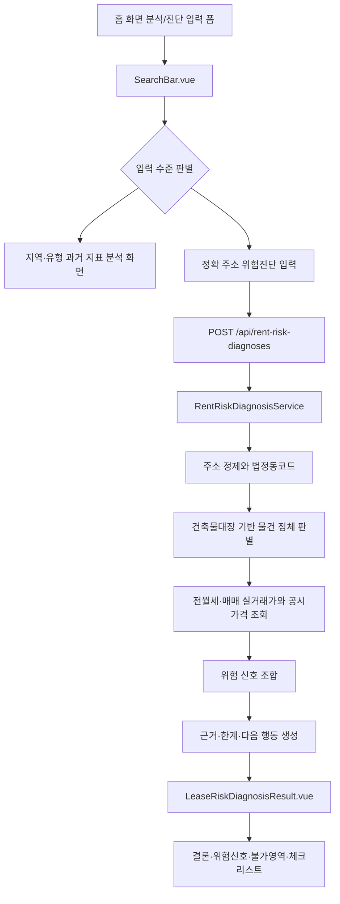

# ZIP:ON 통찰형 위험진단 리포트 전략

> Status: Current Guidance

## 목적

이 문서는 ZIP:ON의 과거 지표 분석/정확 주소 위험진단 결과 화면과 백엔드 분석 응답이 단순 조회 결과를 넘어, 사용자가 지표 흐름과 계약 전 확인사항을 이해하도록 만드는 설계 기준이다.

ZIP:ON의 분석 리포트는 현재 매물 목록이나 단순 데이터 대시보드가 아니다. MVP의 목표는 사용자가 지역·유형·정확 주소를 검토할 때 아래 질문에 답하도록 돕는 것이다.

```text
이 지역·유형의 과거 지표는 어떤 흐름인가?
이 매물을 계약해도 되는지 판단하기 전에,
무엇을 확인해야 하는가?
```

따라서 리포트는 항상 아래 순서로 깊어져야 한다.

```text
데이터
-> 해석
-> 위험 신호
-> 자동 판단 한계
-> 다음 행동
```

## 현재 구현과 연결되는 위치

현재 사용자 진입점은 `frontend/src/components/common/SearchBar.vue`다. 이 컴포넌트는 홈 화면 분석/진단 입력 폼에서 주소·지역 입력을 먼저 받고, 입력값이 정확 주소 후보인지 지역·유형 분석 후보인지 나눈다. 정확 주소 후보라도 `서울시 관악구 신림동 1422-5`처럼 시도·시군구·법정동·지번이 모두 있는 지번주소는 `frontend/src/api/rentRiskDiagnosisApi.js`의 `createRentRiskDiagnosis(payload)`를 호출할 수 있지만, 전세 보증금 또는 월세처럼 목적별 필수 금액이 비어 있으면 먼저 `searchRentRiskDiagnosisCandidates(payload)`로 `POST /api/rent-risk-diagnoses/address-candidates`를 호출한다. 화면은 해당 지번의 과거 전월세 실거래 후보를 현재 매물이 아닌 입력 보조 카드로 보여주고, 사용자가 후보를 선택하면 후보의 보증금·월세·전용면적·층수를 채워 기존 위험진단으로 이어간다. `신림동 1422-5` 같은 짧은 지번이나 `서울특별시 관악구 관악로 1` 같은 도로명주소는 먼저 `GET /api/address-search/juso` 후보 목록에서 실제 주소를 선택하게 한다. 선택된 후보는 `jusoAddress` 구조화 값으로 함께 보내져 백엔드 주소 정제의 기준이 된다. `강남 원룸`, `서울대입구역 근처 오피스텔` 같은 지역·유형 입력은 `frontend/src/views/SearchResultView.vue`로 이동하고, `frontend/src/api/regionalIndicatorAnalysisApi.js`가 `POST /api/regional-indicator-analyses`를 호출해 현재 매물 목록이 아닌 과거 지표 분석 첫 slice를 표시한다.

백엔드는 `RentRiskDiagnosisController`의 `POST /api/rent-risk-diagnoses`를 통해 `RentRiskDiagnosisService`로 진단을 위임한다. 현재 진단 흐름은 다음 class들이 나누어 가진다.

| 책임 | 현재 코드 |
| --- | --- |
| 진단 요청 검증 | `LeaseRiskDiagnosisRequestValidator` |
| 주소 정제와 법정동코드 연결 | `LeaseRiskAddressNormalizer`, `LeaseRiskDiagnosisAddressSectionService` |
| 사용자 표현 해석 | `LeaseRiskPropertyTypeInterpreter` |
| 건축물대장 기반 물건 정체 | `LeaseRiskBuildingRegisterLookupService`, `LeaseRiskDiagnosisPropertyIdentityService` |
| 건축물대장 미확정 시 분석 기준 후보 | `LeaseRiskTransactionEvidenceService` |
| 정확 주소 과거 전월세 후보 카드 | `RentRiskDiagnosisCandidateService` |
| 전월세·매매 실거래가와 공시가격 조회 | `LeaseRiskExternalDataLookupService` |
| 보증금 비교 | `DepositRiskCalculator` |
| 건축물 위험 문장 | `BuildingRiskAnalyzer` |
| 위험 요약 문장 | `LeaseRiskDiagnosisRiskSummaryService` |
| 구조화 위험 항목 산정 | `RiskAssessmentService`, `RiskScoreAggregator`, `RiskGradeCalculator` |
| 다음 행동 | `LeaseRiskDiagnosisNextActionService` |
| 체크리스트 | `LeaseRiskDiagnosisChecklistService` |
| 프론트 결과 표시 | `LeaseRiskDiagnosisResult.vue` |
| 구조화 위험 근거 UI | `RiskAssessmentEvidencePanel.vue` |

이 문서는 위 구조를 갈아엎는 지시가 아니다. 기존 응답의 `riskSummary`, `propertyIdentity`, `dataStatuses`, `riskAssessment`, `checklist`, `nextActions`를 더 설명 가능한 리포트 구조로 진화시키기 위한 기준이다.

## MVP 범위와 비범위

### 지금 MVP에서 다룰 것

- 현재 매물 미제공 원칙
- 지역·유형 과거 지표 분석
- 한국부동산원 R-ONE 통계 기반 가격지수, 전세·월세 지표, 오피스텔 수익률, 상가 공실률 해석
- 정확 주소 기반 전세·월세 계약 전 위험진단
- 물건 정체 판별
- 주변 전월세 실거래가 비교
- 매매 실거래가 또는 공시가격 기반 보증금 위험 보조 판단
- 다가구·다세대·오피스텔·근린생활시설 가능성 설명
- 건축물대장 기반 주용도, 대장구분, 사용승인일 안내
- `LEASE_RENT_RISK` 고정 항목별 구조화 위험 산정 결과
- 등기부등본, 선순위 임차인, 보증보험처럼 자동 확정할 수 없는 영역의 직접 확인 안내
- 계약 전 체크리스트

### 지금 만들지 않을 것

- 현재 매물 목록, 현재 매물 지도 탐색, 실시간 매물 크롤링
- 주거용 매매, 상가 창업, 토지 개발, 꼬마빌딩 진단의 빈 화면, 빈 API, 빈 service
- 지도·인기매물·매물 목록 중심 리포트
- 머신러닝 기반 자동 판정
- 등기부등본 권리관계, 전세사기 여부, 보증금 회수 가능성의 확정 판정
- “안전합니다”, “계약하지 마세요”처럼 법률·중개·감정평가 판단을 대신하는 문구

확장형 서비스 정의는 장기 방향이다. MVP 코드는 확장 가능해야 하지만, 실제 사용자가 쓸 수 없는 확장 껍데기를 먼저 만들면 안 된다.

## 통찰형 리포트의 기본 구조

프론트엔드 결과 화면은 최종적으로 아래 구조를 따라야 한다.

1. 한눈에 보는 결론
2. 핵심 위험 신호
3. 입력한 주소와 계약 조건
4. 물건 정체 판별
5. 가격·보증금 비교
6. 공공데이터 확인 상태
7. 자동 판단 불가 영역
8. 계약 전 체크리스트
9. 다음 행동

각 영역은 “점수”보다 “왜 그런 판단이 나왔는지”를 먼저 보여줘야 한다.

### 좋은 문장 구조

```text
현재 입력 보증금은 주변 유사 전월세 거래 대비 크게 낮지 않습니다.

다만 이 물건은 공부상 다가구주택일 가능성이 있습니다.
다가구주택은 호실별 소유권이 나뉘지 않을 수 있으므로,
내 보증금뿐 아니라 건물 전체 선순위 임차인 보증금과 근저당권을 함께 확인해야 합니다.

현재 등기부등본과 선순위 임차인 정보가 없으므로
"안전"이라고 판단할 수 없습니다.

계약 전에는 등기부등본 을구, 선순위 임차인 보증금 내역,
전세보증보험 가입 가능 여부를 확인하세요.
```

### 피해야 할 문장 구조

```text
위험도: 보통
전세보증금: 1억 2천만 원
주변 평균: 1억 1천만 원
```

이 표현은 데이터만 보여주고, 사용자가 다음에 무엇을 확인해야 하는지 알려주지 못한다.

## 리포트 흐름



물건 정체 판별은 실거래가 해석보다 먼저 와야 한다. 같은 “원룸 전세”라도 공부상 다가구주택, 다세대주택, 오피스텔, 근린생활시설 가능성에 따라 확인해야 할 위험이 달라지기 때문이다.

## 응답 모델 진화 방향

현재 `RentRiskDiagnosisResponse`는 이미 `propertyIdentity`, `riskSummary`, `dataStatuses`, `checklist`, `nextActions`를 통해 MVP 리포트의 뼈대를 갖고 있다.

다음 단계에서는 기존 필드를 깨지 않고, 위험 신호 하나를 표준 단위로 표현하는 `RiskFinding` 개념을 응답에 추가하는 방향이 좋다. 이 문서는 코드 추가 지시가 아니라 향후 구현 기준이다.

### RiskFinding 후보 구조

```json
{
  "code": "MULTI_FAMILY_SENIOR_TENANT_MISSING",
  "severity": "CAUTION",
  "title": "다가구주택 선순위 임차인 확인 필요",
  "summary": "다가구주택 전세는 건물 전체 보증금 구조 확인이 중요합니다.",
  "evidence": [
    "계약 목적: 전세",
    "공부상 유형: 다가구주택 추정",
    "선순위 임차인 정보: 미입력"
  ],
  "limitation": "선순위 임차인 보증금은 공공 API만으로 자동 확정하기 어렵습니다.",
  "actionItems": [
    "선순위 임차인 보증금 내역 요청",
    "등기부등본 을구 확인",
    "전세보증보험 가입 가능 여부 확인"
  ]
}
```

이 구조의 핵심은 프론트엔드가 카드, 아코디언, 표, 체크리스트를 안정적으로 그릴 수 있게 하는 것이다. 백엔드가 문장을 한 덩어리로만 내려주면 프론트는 화면을 깊게 만들기 어렵다.

## 확정, 추정, 판단 불가의 분리

리포트는 데이터의 확실성을 반드시 분리해야 한다.

| 구분 | 예시 | 화면 표현 |
| --- | --- | --- |
| 확인된 사실 | 건축물대장 주용도, 사용승인일, 조회된 실거래가 | `확인됨` |
| 사용자 입력 | 보증금, 월세, 관리비, 사용자 입력 유형, 검토 메모 | `사용자 입력` |
| 추정 | 유사 거래 기반 대표값, 보증금 비율, 물건 유형 후보 | `추정` |
| 판단 불가 | 근저당권, 신탁, 압류, 선순위 임차인 전체 보증금 | `직접 확인 필요` |


## 프론트엔드 표현 원칙

`LeaseRiskDiagnosisResult.vue`는 기존 디자인을 크게 갈아엎기보다 결과 영역을 점진적으로 깊게 만드는 방향이 맞다. 현재 구현은 구조화 위험 산정 표시를 `RiskAssessmentEvidencePanel.vue`로 분리한다. 이 패널은 `riskAssessment.totalRiskScore`를 원형 chart로 보여주고, `riskAssessment.criteria`를 항목별 막대 chart, 근거 출처 요약, 누락 데이터와 직접 확인 행동으로 나누어 표시한다.

권장 표시 순서:

1. 한눈에 보는 결론
2. 핵심 위험 신호 카드 3~5개
3. 입력한 주소와 계약 조건
4. 주소 정제와 법정동코드
5. 물건 정체 판별 섹션
6. 가격·보증금 비교 섹션
7. 공공데이터 확인 상태
8. 자동 판단 불가 영역과 등기부등본 확인 기록
9. 상세 근거 chart와 선택 항목 evidence panel
10. 계약 전 체크리스트
11. 다음 행동과 커뮤니티 질문 초안

가격 추이 그래프나 유사 거래 표는 데이터가 충분할 때만 보여준다. 유사 거래가 부족하면 빈 그래프를 억지로 보여주지 말고 “최근 유사 거래가 충분하지 않아 평균값 신뢰도가 낮습니다”라는 결과를 보여줘야 한다.

## 백엔드 설계 원칙

백엔드는 단순 API proxy가 아니라 공공데이터를 계약 전 판단 문장으로 바꾸는 해석 계층이다.

단, 지금 바로 거대한 추상화를 추가하지 않는다. 우선순위는 아래와 같다.

1. 현재 `LeaseRiskDiagnosisRiskSummaryService`, `BuildingRiskAnalyzer`, `DepositRiskCalculator`, `LeaseRiskDiagnosisNextActionService`에서 만드는 문장을 위험 신호 사전 기준으로 정렬한다.
2. RULE-001처럼 사용자 가치가 큰 MVP 룰부터 `RiskFinding`으로 분리한다.
3. 룰이 늘어나고 중복이 생길 때 `ExpertRule` 또는 `RiskRule` 같은 인터페이스를 도입한다.
4. 매매·상가·토지·꼬마빌딩은 실제 MVP 이후 slice가 시작될 때 별도 목적 분석기로 확장한다.

처음부터 `ExpertRuleEngine`을 코드로 만들면 추상화가 앞서갈 수 있다. 이 프로젝트에서는 “반복되는 룰이 실제로 생긴 뒤” 인터페이스를 추출하는 편이 학습과 유지보수에 더 좋다.

## Decision: RiskFinding은 모델 계약으로 먼저 문서화한다

### Context

프론트엔드 분석 화면을 깊게 만들려면 백엔드가 단순 문자열 배열이 아니라 근거, 한계, 행동을 구조화해서 내려줘야 한다.

### Options considered

1. 지금 바로 `RiskFinding` DTO와 rule engine을 구현한다.
2. 기존 `riskSummary` 문장만 계속 늘린다.
3. `RiskFinding`을 문서로 먼저 표준화하고, MVP 룰부터 점진적으로 코드화한다.

### Decision

3번을 선택한다. `RiskFinding`은 지금 문서상 응답 모델 방향으로 정의하고, 실제 코드는 RULE-001 같은 MVP 고가치 룰이 구현될 때 추가한다.

### Why

현재 코드는 이미 전세·월세 위험진단 흐름이 동작하고 있다. 새로운 껍데기를 먼저 만들기보다, 기존 서비스가 만드는 문장을 `근거 -> 한계 -> 다음 행동` 구조로 정렬한 뒤 필요한 만큼 모델을 확장하는 편이 안전하다.

### Tradeoffs

프론트엔드가 당장 모든 카드와 아코디언을 자동 생성할 수는 없다. 대신 문서가 먼저 기준을 잡으므로, 이후 구현자가 어떤 응답 구조로 옮겨야 하는지 알 수 있다.

### Future revisit

`LeaseRiskDiagnosisRiskSummaryService` 안의 위험 문장이 늘어나거나, 같은 조건 검사가 `BuildingRiskAnalyzer`, `DepositRiskCalculator`, `LeaseRiskDiagnosisNextActionService`에 반복되기 시작하면 `RiskFinding`과 rule interface를 코드로 분리한다.

## 현재 구현 상태

`RiskAssessmentEvidencePanel.vue`가 담당하는 화면 책임은 아래와 같다.

- `riskAssessment.totalRiskScore`, `baseScore`, `uncertaintyPenalty`, `riskGrade`, `displayVerdict`를 종합 점수 영역으로 표시한다.
- `criteria[].status`, `criteria[].riskScore`, `criteria[].confidence`를 항목별 막대 chart로 표시한다.
- `criteria[].evidence`를 출처별로 묶어 사용자가 어떤 데이터가 판단에 쓰였는지 확인하게 한다.
- `criteria[].missingData`와 `criteria[].recommendedActions`를 직접 확인 필요 영역으로 분리한다.
- API 응답 원문을 그대로 덤프하지 않고, `source`, `field`, `value`, `description`을 사용자가 읽는 근거 문장과 값으로 축약한다.

현재 `LeaseRiskDiagnosisResult.vue`는 점수 패널보다 앞에 계약 전 판단 요약, `evidenceReport`, 핵심 위험 신호, 입력/주소, 물건 정체, 가격·보증금 비교, 공공데이터 확인 상태, 자동 판단 불가 영역을 먼저 보여준다. `evidenceReport`는 `RentRiskDiagnosisResponse`가 내려주는 DB·공공데이터 근거 리포트이며, 건축물대장, 과거 전월세 거래, 과거 매매 거래, 공시가격을 현재 매물 목록이 아니라 계약 전 판단 근거로 표시한다. `RiskAssessmentEvidencePanel.vue`는 고정 위험 산정 항목의 상세 근거로 뒤쪽에 배치한다. 이 구현은 아직 별도 frontend unit test가 없다. 현재 검증 기준은 `cd frontend && npm run build`와 브라우저 화면 확인이다.

`PropertyDetailView.vue`의 관심 부동산 리포트는 `GET /api/favorites/{favoriteId}/analysis` 응답을 우선 사용한다. 이 화면은 저장된 관심 조건을 현재 매물 상세처럼 보여주는 화면이 아니라, 사용자가 저장한 주소·가격 조건과 연결 가능한 공공데이터 근거를 모아 사전 검토하는 대시보드다. 상단 첫 영역은 백엔드가 계산한 `dashboardGrade`와 핵심 metric만 보여주고, 별도 타이밍 카드와 현재 상태 카드로 같은 판단을 반복하지 않는다. 가격 흐름 옆에는 `dataCoverage.sources` 기반 자료 연결 상태만 짧게 배치해 빈 여백을 만들지 않는다. 그 다음 전체 폭 영역은 `features`를 중심으로 물건 정체, 가격 위치, 지역 흐름, 근거 품질의 근거·한계·다음 행동을 먼저 펼친다. `riskAssessment.criteria`가 연결된 경우에만 이전 정확 주소 위험진단 기준을 별도 하단 섹션으로 표시한다. 프론트엔드는 등급 점수를 자체 계산하지 않고, 백엔드가 내려준 점수·등급·이유를 사용자 문장으로 표시한다.

관심 부동산 리포트에서 건축물대장 상태는 정확 주소 기준으로만 강하게 표현한다. 주소가 `서울시 강남구 역삼동 123-1`처럼 법정동과 지번까지 정제되면 `LeaseRiskAddressNormalizer`와 `LeaseRiskBuildingRegisterLookupService`가 만든 `AddressResolution` 기준으로 건축물대장 기본 정보를 확인한다. 도로명주소나 불완전 주소처럼 한 건으로 특정하기 어려운 경우에는 “건축물대장 없음”이 아니라 “정확 주소 보완 필요”로 표시하고, 주소 검색에서 지번 주소를 선택하도록 안내한다.

가격 흐름 영역은 `priceTrend`와 `comparisonSummary`를 함께 사용한다. 화면은 내 조건, 최근 자료 평균, 최근 기준점, 지역 기준, 공시가격을 비교하되, 표본이 부족하면 빈 그래프를 억지로 보강하지 않는다. 가격 그래프에는 범례, 내 조건 기준선, 최근 평균 기준선, 월별 표본 수 막대, 분석 기간/변화율/최저·최고/총 표본 수 요약이 있어야 한다. 월세 기준점이 2개 이상 있으면 보증금 또는 매매가 축과 섞지 않고 별도 보조 추이로 표시한다. 이 경우 “최근 거래 자료가 부족합니다”와 함께 공시가격·최신 거래·원본 서류 확인이 필요하다는 다음 행동을 표시한다.

## 구현 단계 제안

| 단계 | 목표 | 구현 범위 |
| --- | --- | --- |
| 0 | 설계 기준 문서화 | 이 문서와 `/docs/architecture/RISK_SCORING_POLICY.md` 작성 |
| 1 | MVP 핵심 룰 구조화 | RULE-001, RULE-007, RULE-008부터 기존 응답에 반영 |
| 2 | 결과 화면 개선 | `LeaseRiskDiagnosisResult.vue`와 `RiskAssessmentEvidencePanel.vue`에 점수 chart, 근거 출처 요약, 상세 evidence panel 추가 |
| 3 | 가격 근거 강화 | 실거래가 비교 표본, 대표값, 데이터 부족 사유를 구조화 |
| 4 | RiskFinding DTO 도입 | 기존 응답을 유지하면서 `findings` 필드 추가 |
| 5 | rule engine 추출 | 룰 중복이 실제로 생긴 뒤 interface와 구현체로 분리 |

## 디버깅 체크리스트

- `SearchBar.vue`가 홈 화면 진단 폼 흐름에서 진단 요청을 보냈는가?
- `rentRiskDiagnosisApi.js`의 `createRentRiskDiagnosis(payload)`가 `/rent-risk-diagnoses`를 호출하는가?
- `RentRiskDiagnosisController`가 `RentRiskDiagnosisResponse`를 `ApiResponse`로 감싸는가?
- `propertyIdentity`가 사용자 표현과 공부상 유형을 확정/추정/주의 문장으로 나누는가?
- `riskSummary.reasons`가 “안전/위험 확정” 대신 “추가 확인 필요” 문장으로 내려오는가?
- `riskAssessment.criteria`가 12개 고정 항목을 유지하고, 직접 확인 항목을 `NEEDS_USER_DOCUMENT`나 `MISSING_DATA`로 표시하는가?
- `dataStatuses`가 외부 API 실패, 데이터 없음, 직접 확인 필요를 구분하는가?
- `checklist`와 `nextActions`가 등기부등본, 선순위 임차인, 보증보험 확인으로 연결되는가?
- 최종 총점·등급·화면 판정이 프론트나 AI 문장이 아니라 백엔드 계산 결과로 내려오는가?

## 관련 문서

- [과거 지표 기반 부동산 분석 MVP 범위](/docs/product/MVP_SCOPE.md)
- [과거 지표 분석과 정확 주소 위험진단 MVP API 호출 전략](/docs/api/API_CALL_FLOW.md)
- [API 명세와 프론트엔드 연결 현황](/docs/api/API_FRONTEND_CONNECTION_SPEC.md)
- [ZIP:ON 위험 신호 룰 사전](/docs/architecture/RISK_SCORING_POLICY.md)
- [AI 위험도 산정 엔진](/docs/CODEX/reference/AI_RISK_SCORING_ENGINE.md)

## Learning path

1. First read: `/docs/product/MVP_SCOPE.md`에서 ZIP:ON이 현재 매물 제공 서비스가 아니라 과거 지표 분석 서비스라는 기준을 잡는다.
2. Then inspect: `RentRiskDiagnosisService`, `LeaseRiskDiagnosisPropertyIdentityService`, `DepositRiskCalculator`, `BuildingRiskAnalyzer`, `RiskAssessmentService`를 읽는다.
3. Then inspect frontend: `SearchBar.vue`와 `LeaseRiskDiagnosisResult.vue`를 이어서 본다.
4. Then run: `cd backend && ./mvnw -Dtest=RentRiskDiagnosisIntegrationTest test`, `cd frontend && npm run build`.
5. Then debug: `dataStatuses`, `riskSummary`, `nextActions`가 각각 데이터 상태, 해석, 행동을 맡는다는 점을 확인한다.
6. Key concept to understand: 좋은 위험진단은 점수를 맞히는 것이 아니라, 불확실성을 숨기지 않고 사용자의 다음 확인 행동으로 바꾸는 것이다.
