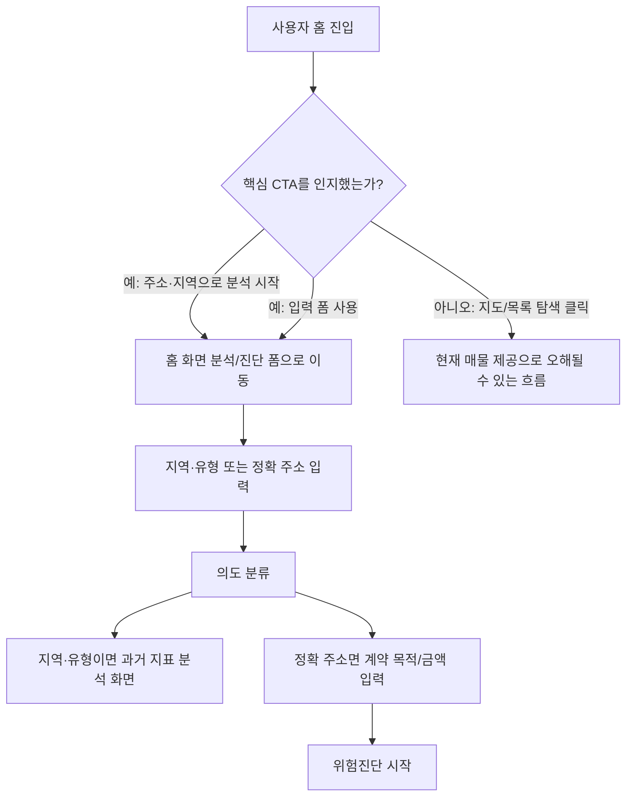
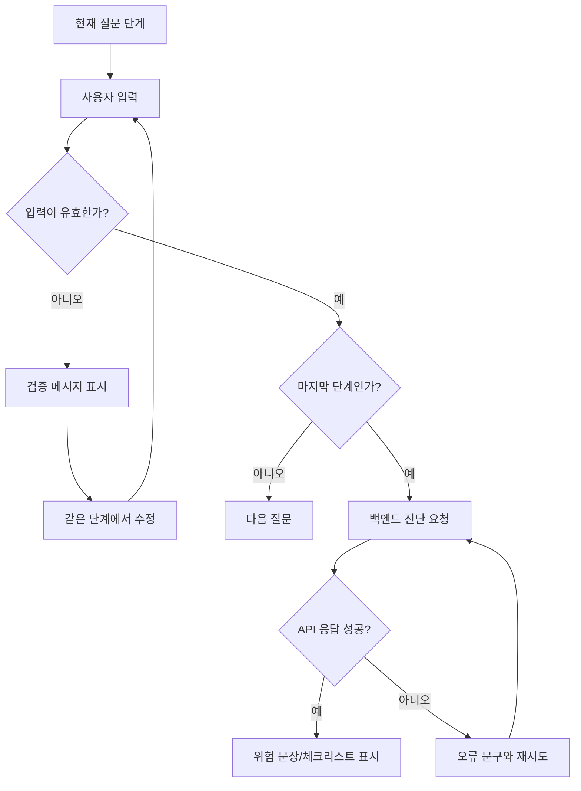
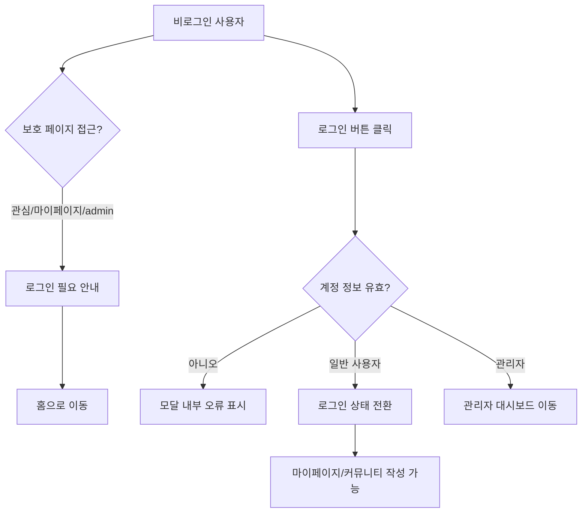
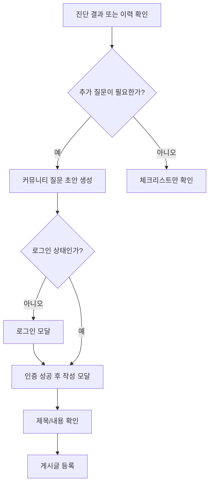
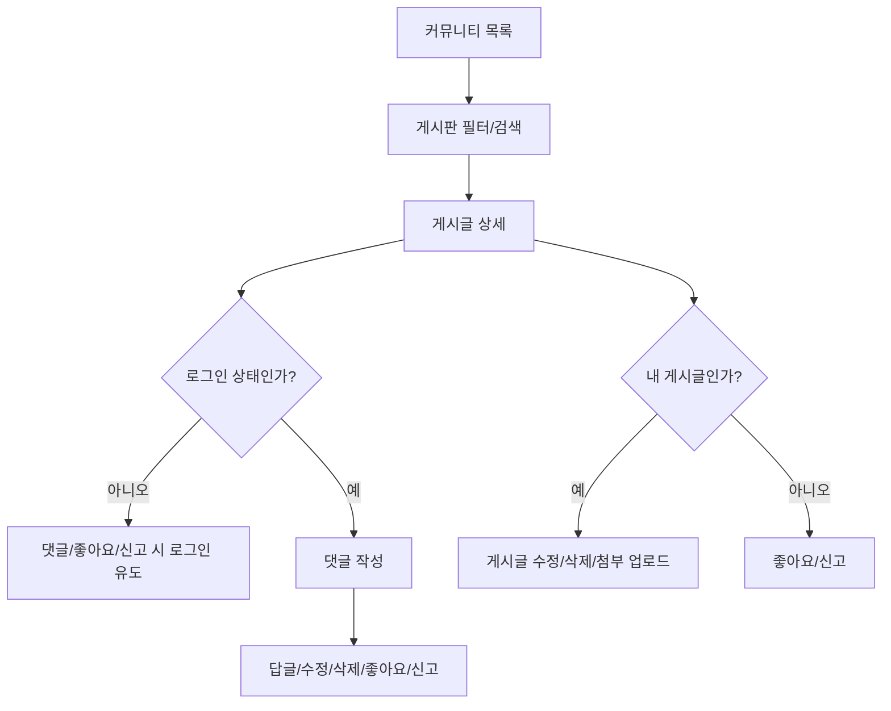
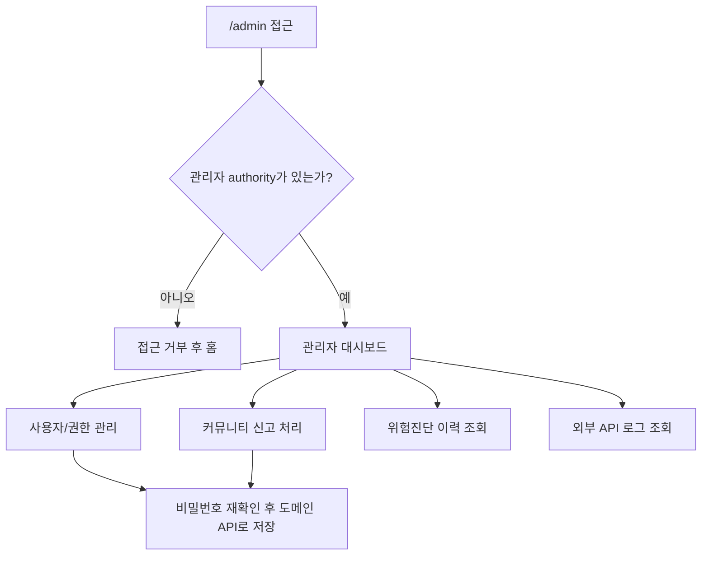
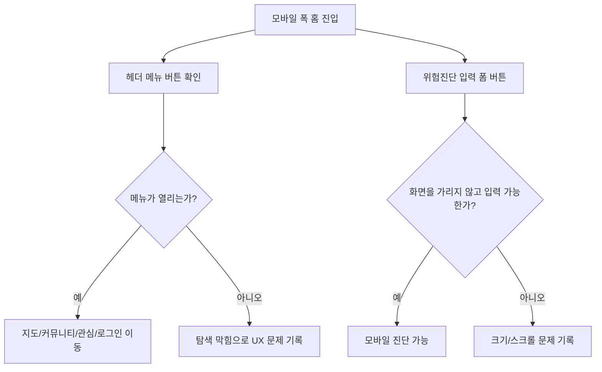

# 프론트엔드 클라이언트 시나리오 테스트 계획

## 목표

ZIP:ON 프론트엔드를 처음 만난 사용자가 실제로 할 수 있는 행동을 최대한 따라가며, 원하는 기능이 자연스럽게 동작하는지 확인한다. 테스트 기준은 "순수 클라이언트 관점"이다. 내부 API 구조를 알고 있는 개발자가 아니라, 화면에 보이는 버튼, 링크, 입력창, 오류 문구만 보고 판단하는 사용자를 가정한다.

## 비목표

- MVP 밖 확장형 부동산 진단 화면을 새로 만들거나 껍데기로 추가하지 않는다.
- 지도 검색, 현재 매물 목록, 인기 매물, 상가/환경 화면을 MVP 핵심처럼 키우지 않는다.
- 백엔드 비즈니스 로직을 이 작업에서 새로 구현하지 않는다.
- 실제 외부 공공 API나 실제 사용자 개인정보를 사용하지 않는다.

## Repository Map

1. Build and runtime
- Build tool: backend Maven Wrapper, frontend npm/Vite
- Java version: `backend/pom.xml` 기준 Java 21
- Spring Boot version: `4.0.6`
- Spring Framework version: Spring Boot BOM 관리
- Spring Security version: Spring Boot BOM 관리
- Dependency management style: Maven parent BOM, frontend `package-lock.json`
- Run command: backend `cd backend && ./mvnw spring-boot:run`, frontend `cd frontend && npm run dev`
- Test command: backend `cd backend && ./mvnw test`, frontend focused check `cd frontend && npm run build`
- Lint/format command: 현재 frontend/backend 별도 lint script 없음

2. Source structure
- Main packages: backend `com.zipon`, frontend `frontend/src`
- Controller pattern: `/api/...` REST Controller가 `ApiResponse`로 응답 래핑
- Service pattern: use case orchestration은 backend service 계층
- Mapper/repository pattern: MyBatis mapper 기반, JPA 사용 금지
- DTO/request/response pattern: backend `dto.request`, `dto.response`
- Exception handling pattern: `GlobalExceptionHandler`, security 401/403 handler
- Configuration pattern: `application.yml`, `application-local.yml`, typed security/external API properties

3. Database
- DB engine: 기본/local profile은 MySQL, backend tests는 Testcontainers MySQL
- Schema location: `backend/src/main/resources/db/migration`
- Migration tool: Flyway
- Naming convention: migration SQL 기반 `snake_case`
- Existing auth/user tables: `users`, `user_roles`, `refresh_tokens`, `revoked_access_tokens`, user permission tables
- Existing indexes/constraints: auth, region, community, rent-risk, admin 관련 Flyway migration에 정의

4. Tests
- Test framework: backend Spring Boot tests, frontend은 현재 자동 테스트 없음
- Unit test pattern: 제한적
- Slice test pattern: 아직 없음
- Integration test pattern: `AuthIntegrationTest`, `RegionIntegrationTest`
- Test data strategy: Flyway seed `V3__seed_admin_and_demo_users.sql` + demo user case reseed `V43__reseed_demo_users_by_user_table_cases.sql`
- Existing security test style: 실제 HTTP auth/JWT 흐름 중심

5. Docs
- README/index files: `README.md`, `docs/README.md`, `docs/frontend/README.md`
- Existing architecture docs: `/docs/architecture/BACKEND_STRUCTURE.md`
- Existing API docs: `/docs/api/API_FUNCTION_MAP.md`, `/docs/api/API_FRONTEND_CONNECTION_SPEC.md`
- Existing DB docs: `/docs/operations/DOCKER_MYSQL_REDIS.md`
- Existing security docs: `/docs/architecture/security/SECURITY_AUTHENTICATION.md`
- Docs to modify: `docs/README.md`, `docs/frontend/README.md`
- Docs to create only if needed: 이 계획 문서와 결과 보고서

6. Initial assumptions
- Assumption: 사용자는 홈 화면 분석/진단 입력 폼을 통해 지역·유형 과거 지표 분석 또는 정확 주소 위험진단을 시작해야 한다.
- Risk: 기존 프론트에는 지도/목록/검색 화면 골격도 있어 사용자가 핵심 흐름을 오해할 수 있다.
- Verification: 실제 브라우저에서 홈, 헤더, 진단 폼, 인증, 커뮤니티, 관리자, 마이페이지, 모바일 폭을 순회한다.

## 제품 기준

- MVP 핵심은 `현재 매물 미제공 + 과거 지표 기반 부동산 분석 + 정확 주소 위험진단`이다.
- 사용자 질의응답은 홈 화면 분석/진단 입력 폼으로 시작한다.
- `강남 원룸`, `서울대입구역 근처`, `상가 월세` 같은 입력은 현재 매물 검색이 아니라 과거 지표 분석으로 처리한다.
- 커뮤니티와 관리자 페이지는 MVP 지원 표면이다.
- 확장형 서비스 정의는 향후 확장 가능성을 위한 경계이며, 지금 주거용 매매/상가/토지/꼬마빌딩 껍데기를 늘리는 근거가 아니다.

## 테스트 범위

| 영역 | 사용자 행동 | 관찰 기준 |
| --- | --- | --- |
| 홈 | 첫 진입, CTA 클릭, 분석/진단 입력 폼 확인 | "어디를 확인할까요?"에서 주소·지역 우선 흐름이 보이는가 |
| 진단 폼 | 지역·유형 입력, 정확 주소 입력, 금액 입력, 주소 후보 선택, 진단 시작, 오류 재시도 | 정확 주소는 위험진단, 지역·유형은 과거 지표 분석 화면으로 갈라지는가 |
| 인증 | 로그인 실패, 회원가입, 로그인 성공, 로그아웃 | 사용자가 현재 상태를 이해할 수 있는가 |
| 권한 보호 | 비로그인 관심/마이페이지/admin 접근 | alert 후 홈 이동이 너무 급작스럽지 않은가 |
| 커뮤니티 | 목록, 필터, 검색, 글쓰기, 로그인 유도, 상세, 댓글, 좋아요, 신고 | 진단 후 질문/사례 공유 흐름이 이어지는가 |
| 마이페이지 | 진단 이력 조회, 상세, 커뮤니티 질문 초안 | 저장된 주소와 계약 전 확인사항을 다시 볼 수 있는가 |
| 관리자 | admin 계정 접근, 사용자 정렬/권한 저장/비밀번호 재확인, 신고/진단/API 로그 조회 | 임의 SQL이 아닌 도메인 관리 화면인가 |
| 위치/저장/검색 | 노출된 링크와 placeholder 확인 | `위치 확인`, `관심 부동산`, 지역·유형 분석 언어가 현재 매물 제공으로 오해되지 않는가 |
| 모바일 | 헤더, 메뉴 버튼, 진단 폼, 커뮤니티 작성 | 작은 화면에서 막히는 행동이 없는가 |

## 테스트 데이터

- 관리자 계정: `admin / admin`
- 일반 사용자는 테스트 중 회원가입으로 생성한다.
- 공공 API 키가 없는 상태도 사용자 시나리오에 포함한다.
- 로컬 API base URL은 기본값 `/api`를 사용한다. repository root `.env`의 `VITE_API_BASE_URL`은 비워 두고, `frontend/vite.config.js`의 proxy가 `/api` 요청을 `http://localhost:8082`로 전달하게 한다.

## 실행 순서

1. 계획 문서와 인덱스 링크를 먼저 커밋한다.
2. Docker MySQL을 띄운 뒤 백엔드를 기본 또는 local profile로 실행한다. 현재 문서 기준의 사용자 시나리오 smoke test는 H2 실행을 전제로 하지 않는다.
3. 프론트엔드를 Vite dev server로 실행한다.
4. in-app browser로 데스크톱 폭과 모바일 폭을 모두 확인한다.
5. 각 시나리오에서 콘솔 오류, 네트워크 실패, 화면 문구, 막힌 행동을 기록한다.
6. MVP 흐름을 더 자연스럽게 만드는 작은 프론트 개선만 수행한다.
7. `npm run build`로 프론트 빌드를 확인한다.
8. 결과 보고서에 관찰 결과, 개선 사항, 남은 리스크, 플로우차트를 남긴다.

## 사용자 흐름 플로우차트

### 1. 홈에서 위험진단 시작

### 2. 진단 폼 입력 실패와 회복

### 3. 인증과 보호 페이지

### 4. 위험진단 이후 커뮤니티 연결

### 5. 커뮤니티 상호작용

### 6. 관리자 운영 흐름

### 7. 모바일 헤더와 전역 행동

## 관찰 기록 양식

| 시나리오 | 기대 | 실제 | 문제 등급 | 개선 방향 | 수정 여부 |
| --- | --- | --- | --- | --- | --- |
| 예: 모바일 메뉴 | 메뉴가 열린다 | 클릭 반응 없음 | High | `SideMenu` 연결 또는 제거 | 대기 |

## 개선 판단 기준

- High: 사용자가 주요 행동을 완료하지 못한다.
- Medium: 완료는 가능하지만 다음 행동을 추측해야 한다.
- Low: 문구, 간격, 상태 표시가 어색하지만 기능은 유지된다.

## Learning path

1. First read: `frontend/src/router/index.js`
2. Then inspect: `frontend/src/App.vue`, `frontend/src/components/common/SearchBar.vue`
3. Then run: `cd frontend && npm run dev`
4. Then debug: 브라우저 콘솔, Network 탭, `frontend/src/api/axiosInstance.js`
5. Key concept to understand: 사용자는 API 이름이 아니라 화면의 상태와 다음 행동 가능성으로 제품을 이해한다.
