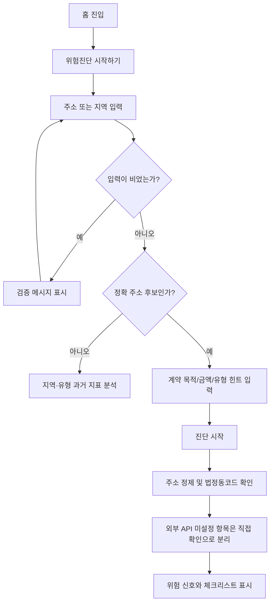
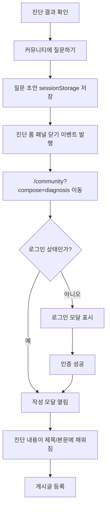
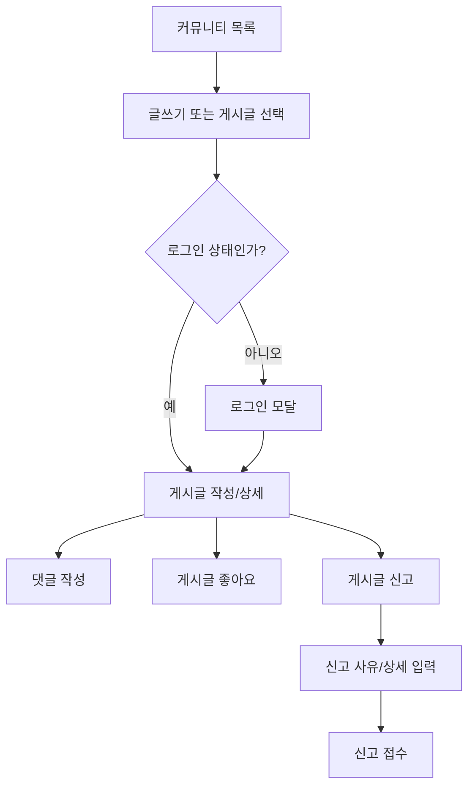
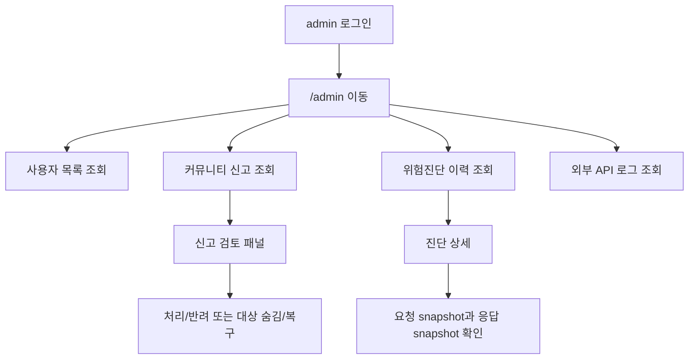
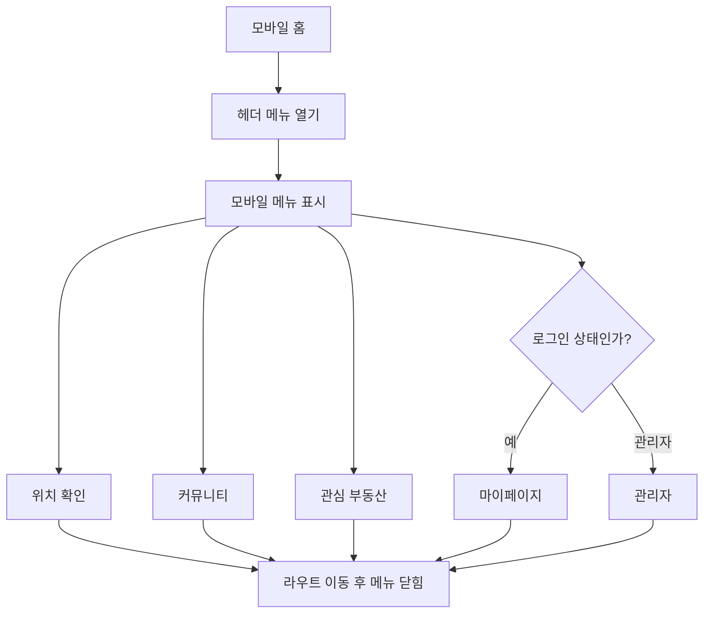
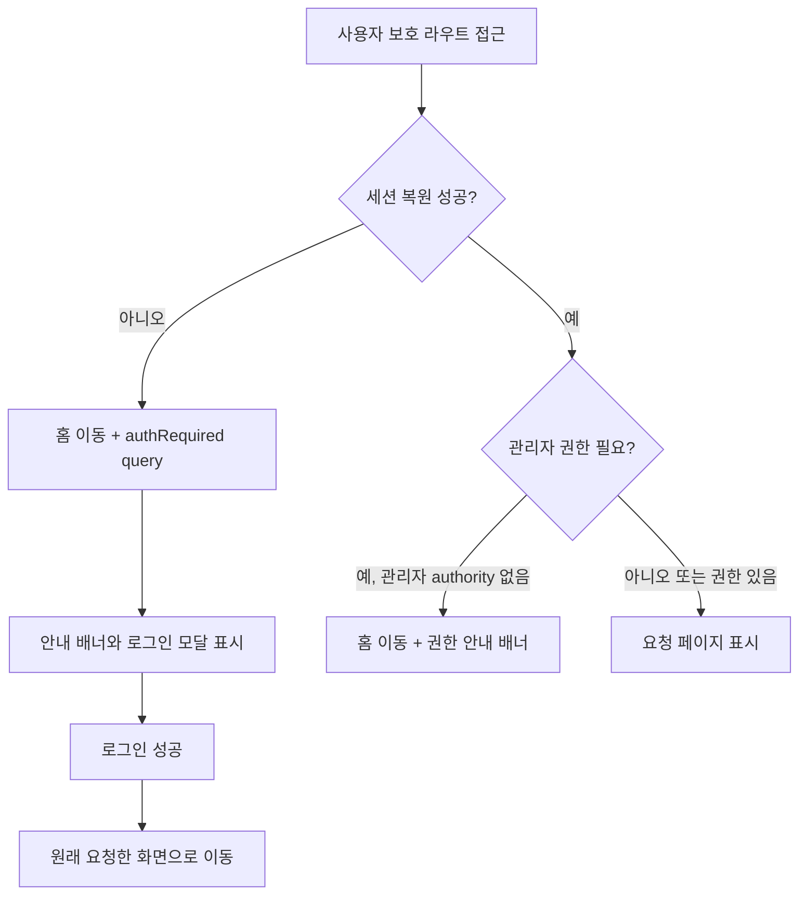
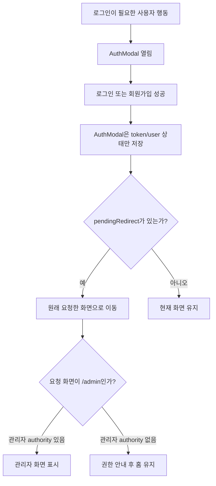
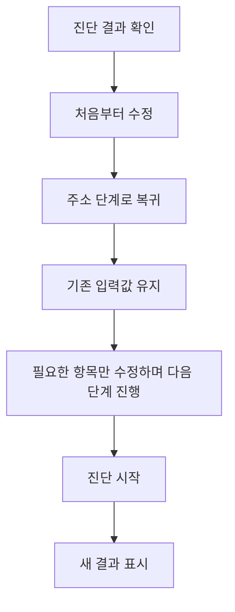

# 프론트엔드 클라이언트 시나리오 테스트 결과

> Historical note: 이 문서는 2026-06-22 당시 구현된 전세·월세 위험진단 화면을 검증한 결과다. 현재 제품 기준은 [과거 지표 기반 부동산 분석 MVP 범위](/docs/product/MVP_SCOPE.md)를 따르며, 현재 매물 미제공, 지역·유형 과거 지표 분석, 정확 주소 위험진단을 MVP 중심으로 본다.

## 요약

2026-06-22에 ZIP:ON 프론트엔드를 순수 사용자 관점으로 실행해 홈, 당시 위험진단 입력 폼, 인증, 커뮤니티, 마이페이지, 관리자, 모바일 헤더 흐름을 확인했다. 당시 구현된 홈 화면 위험진단 입력 폼 기반 전세·월세 위험진단은 정상 동작했고, 외부 API 키가 없는 상태에서도 "안전함"으로 단정하지 않고 데이터 부족과 직접 확인 항목을 분리했다.

이번 테스트에서 실제 UX 문제 두 가지를 수정했다.

- 모바일 헤더의 `메뉴 열기` 버튼이 눌려도 아무 메뉴가 열리지 않던 문제를 `AppHeader.vue`의 모바일 메뉴 토글로 수정했다.
- 위험진단 결과에서 `커뮤니티에 질문하기`를 누르면 커뮤니티 작성 흐름 뒤에 진단 폼 패널이 계속 남던 문제를 `community draft navigation` 이벤트로 수정했다.

2026-06-23 추가 점검에서는 결과 이후 재입력과 인증 후 이동 흐름을 다시 확인했다. 사용자가 원하는 화면으로 돌아가야 하는 상황에서 `AuthModal.vue`가 관리자 계정을 무조건 `/admin`으로 이동시키는 책임 과다를 제거했고, 진단 결과의 `입력 수정`은 마지막 질문이 아니라 첫 질문부터 기존 값을 다시 검토하도록 `처음부터 수정`으로 명확히 바꿨다.

이번 주소 우선 UX 정렬에서는 홈 첫 문장을 `어디를 확인할까요?`로 바꾸고, `SearchBar.vue`가 정확 주소 후보와 지역·유형 분석 후보를 먼저 구분하도록 수정했다. `강남 원룸`, `서울대입구역 근처 오피스텔` 같은 입력은 `POST /api/rent-risk-diagnoses`로 바로 보내지 않고 `SearchResultView.vue`의 과거 지표 분석 화면으로 이동한다. 정확 주소 후보는 기존 전세·월세 위험진단 API를 사용한다.

2026-06-24 follow-up 검증에서는 별도 worktree `feature/address-first-user-entry`에서 Vite dev server를 실행하고 브라우저로 홈, 지역·유형 분기, 정확 주소 분기, 모바일 메뉴를 다시 확인했다. 홈에서는 `어디를 확인할까요?`, `주소·지역으로 분석 시작`, `위치 확인`, `관심 부동산`이 보이고 `지도 검색`, `관심 단지`는 보이지 않았다. `강남 원룸` 입력은 `/search?analysisKeyword=...`로 이동해 `지역·유형 과거 지표 분석`, `현재 매물 목록이 아닙니다`, `현재 매물은 제공하지 않습니다`, `다가구주택`, `오피스텔` 후보를 표시했다. `신림동 1422-5` 입력은 `/search`로 이동하지 않고 홈 진단 패널에 머물며 정확 주소 위험진단 후보로 해석되고, 로컬 백엔드가 실행되지 않은 상태에서는 API 연결 오류를 표시했다. 모바일 390px 폭에서는 수평 overflow가 없고 메뉴 버튼을 열면 `위치 확인`, `커뮤니티`, `관심 부동산`이 표시됐다.

2026-06-24 지역 지표 API 연결 작업에서는 `SearchResultView.vue`가 `POST /api/regional-indicator-analyses`를 호출하도록 바뀌었다. 화면은 더 이상 정적 안내만 표시하지 않고, 저장된 R-ONE 통계자료와 `market_statistics_monthly` 결과가 있으면 `연결됨`, 없으면 `데이터 부족` 또는 `정확 주소 필요` 상태를 보여준다. 이 검증은 브라우저 E2E가 아니라 `RegionalIndicatorAnalysisIntegrationTest`와 `npm run build`로 확인했다.

2026-06-24 관리자 대시보드 권한 저장 후속작업에서는 `AdminDashboardView.vue`의 사용자 목록 정렬 드롭다운, 커뮤니티 권한 체크박스 표, 운영권한 드롭다운, 저장 전 비밀번호 확인 dialog를 추가했다. 저장 요청은 `confirmationPassword`를 포함해 `PUT /api/admin/users/{userId}/role` 또는 `PUT /api/admin/users/{userId}/permissions`를 호출하고, 백엔드 `AdminUserIntegrationTest`가 재인증 실패 401, 성공 시 감사 로그 저장, 사용자 목록 정렬을 검증한다. 이 항목은 브라우저 E2E가 아니라 `AdminUserIntegrationTest`, `AdminUserServiceTest`, `npm run build`로 확인했다.

## 실행 환경

| 항목 | 값 |
| --- | --- |
| Backend | 2026-06-22 당시: Spring Boot default profile, H2 in-memory, port `8082`; 현재 기준: Spring Boot + MySQL datasource, port `8082` |
| Frontend | Vite dev server, `http://localhost:5173` 및 `http://127.0.0.1:5173` |
| API base URL | 당시 실행값: `VITE_API_BASE_URL=http://localhost:8082/api`; 현재 권장값: 비워 두고 Vite proxy `/api` 사용 |
| Seed admin | `admin / admin` |
| 검증 빌드 | `cd frontend && npm run build` 성공 |
| 2026-06-24 follow-up frontend | `npm ci` 후 `http://127.0.0.1:5174/`에서 Vite dev server 실행 |

주의: `127.0.0.1:5173` 프론트와 `localhost:8082` API를 섞으면 refresh cookie 기반 세션 복원이 끊길 수 있다. README 기준처럼 브라우저도 `http://localhost:5173`으로 열거나, 둘 다 `127.0.0.1`로 통일해야 한다.

## 확인한 사용자 행동

| 영역 | 행동 | 결과 | 판정 |
| --- | --- | --- | --- |
| 홈 | 첫 진입 | 위험진단 CTA와 위험진단 입력 폼이 보임 | 정상 |
| 홈 | `주소·지역으로 분석 시작` 클릭 | 홈 화면 주소·지역 우선 입력 폼으로 이동 | 정상 |
| 진입 분기 | `강남 원룸` 입력 후 확인 | 현재 매물 목록이 아니라 지역·유형 과거 지표 분석 화면으로 이동 | 수정 완료 |
| 진입 분기 | `서울대입구역 근처 오피스텔` 입력 후 확인 | 위치와 유형 힌트를 분리하고 지역 지표 분석 API 응답의 지표 상태, 공부상 후보, 데이터 한계를 표시 | 수정 완료 |
| 진입 분기 | `신림동 1422-5` 입력 후 확인 | 정확 주소 위험진단 API 흐름으로 유지 | 수정 완료 |
| 진단 폼 | 빈 주소로 `다음` | 같은 단계에서 검증 메시지 표시 | 정상 |
| 진단 폼 | 주소, 목적, 보증금, 월세, 관리비, 유형, 면적, 층수, 설명 입력 | 단계별 진행 | 정상 |
| 진단 폼 | 외부 API 키 없는 진단 | 주소 정제 성공, 건축물대장/실거래가/등기부는 직접 확인으로 분리 | 정상 |
| 진단 폼 | `커뮤니티에 질문하기` | 커뮤니티 작성 초안 생성, 수정 후 진단 폼 자동 닫힘 | 수정 완료 |
| 인증 | 로그인 모달 | 로그인/회원가입 탭 전환 가능 | 정상 |
| 인증 | 신규 회원가입 | 가입 후 로그인 상태 전환 | 정상 |
| 커뮤니티 | 진단 결과 초안 게시글 등록 | 게시글 상세로 이동 | 정상 |
| 커뮤니티 | 댓글 작성 | 댓글 수 증가, 댓글 표시 | 정상 |
| 커뮤니티 | 게시글 좋아요 | `좋아요 취소`, 좋아요 수 반영 | 정상 |
| 커뮤니티 | 신고 접수 | 신고 모달 제출 후 닫힘 | 정상 |
| 인증 | 보호 라우트에서 로그인 | 로그인 후 원래 요청한 화면으로 이동 | 수정 완료 |
| 관리자 | admin 계정 일반 로그인 | 현재 화면 유지, `/admin` 접근 시에만 관리자 화면 이동 | 수정 완료 |
| 관리자 | 사용자 정렬/권한 저장, 신고/진단/API 로그 조회 | 시나리오 데이터가 운영 화면에 표시되고 권한 저장은 비밀번호 확인 후 수행 | 정상 |
| 관리자 | 신고 검토 패널 | 신고 상태 처리, 대상 숨김/복구 패널 표시 | 정상 |
| 관리자 | 진단 상세 | 요청/응답 snapshot 표시 | 정상 |
| 모바일 | 메뉴 버튼 클릭 | 수정 후 모바일 메뉴 열림 | 수정 완료 |
| 모바일 | 진단 폼 입력 | 작은 화면에서도 입력과 결과 확인 가능 | 정상 |
| 보호 라우트 | 일반 사용자 `/admin` 접근 | 홈 이동 후 권한 안내 배너 표시 | 수정 완료 |
| 진단 폼 | 진단 결과 후 `처음부터 수정` | 기존 입력값을 유지한 채 주소 단계부터 다시 검토 | 수정 완료 |
| 위치/저장/검색 | 노출 화면 확인 | 헤더는 `위치 확인`, `관심 부동산`으로 표시하고 검색 결과는 과거 지표 분석 화면으로 재정의 | 수정 완료 |
| 모바일 follow-up | 390px 폭 홈/메뉴 | 수평 overflow 없음, 모바일 메뉴의 `위치 확인`, `관심 부동산` 표시 | 정상 |
| 정확 주소 follow-up | `신림동 1422-5` 입력 | `/search`로 이동하지 않고 정확 주소 위험진단 후보로 해석, 백엔드 미실행 상태에서는 API 연결 오류 표시 | 프론트 분기 정상, API 성공 미검증 |

## 수정 내용

### 모바일 메뉴

`frontend/src/components/common/AppHeader.vue`에 `mobileMenuOpen` 상태를 추가했다. 모바일 버튼은 `aria-expanded`, `aria-controls`를 갖고, 열렸을 때 `위치 확인`, `커뮤니티`, `관심 부동산`, 로그인 사용자용 `마이페이지`, 관리자용 `관리자` 링크를 표시한다. 라우트가 바뀌거나 로그인/로그아웃 동작이 발생하면 메뉴를 닫는다.

### 진단에서 커뮤니티로 넘어갈 때 패널 정리

`frontend/src/components/home/LeaseRiskDiagnosisResult.vue`의 `openCommunityDraft()`에서 커뮤니티 이동 전에 `community draft navigation` 이벤트를 발행한다. `frontend/src/components/common/SearchBar.vue`는 이 이벤트를 수신해 열린 진단 폼 패널을 닫는다. 이 방식은 `LeaseRiskDiagnosisResult.vue`가 홈 진단 폼뿐 아니라 마이페이지 상세에서도 재사용되는 구조를 유지하면서, 진단 폼 구현 세부사항을 결과 컴포넌트에 직접 주입하지 않는다.

### 보호 라우트 안내 개선

`frontend/src/router/index.js`의 navigation guard에서 `alert()`를 제거했다. 비로그인 사용자가 `/favorites`, `/mypage`, `/admin` 같은 보호 라우트에 접근하면 `authRequired=1`과 `redirect` query를 붙여 홈으로 이동한다. `frontend/src/components/common/AppHeader.vue`는 이 query를 감지해 안내 배너와 로그인 모달을 열고, 로그인 성공 후 원래 요청한 화면으로 이동한다.

관리자 권한이나 페이지 권한이 부족한 경우에는 `accessDenied` query를 전달한다. 이때는 모달을 열지 않고 헤더 아래 안내 배너만 표시해 사용자가 왜 홈으로 이동했는지 알 수 있게 했다.

### 인증 후 이동 책임 정리

`frontend/src/components/auth/AuthModal.vue`는 인증 자체와 사용자 상태 갱신만 담당한다. 관리자 여부를 보고 직접 `/admin`으로 이동하지 않는다. 로그인 후 어디로 갈지는 `frontend/src/components/common/AppHeader.vue`의 `pendingRedirect`와 router guard가 결정한다.

이렇게 나눈 이유는 로그인 모달이 여러 화면에서 재사용되기 때문이다. 커뮤니티 작성, 관심 부동산, 마이페이지, 관리자 페이지 접근은 모두 로그인 모달을 사용할 수 있는데, 모달 내부가 관리자 계정이라는 이유만으로 항상 `/admin`으로 보내면 사용자가 원래 하려던 작업이 끊긴다.

### 진단 결과 후 입력 수정

`frontend/src/components/common/SearchBar.vue`의 결과 하단 버튼을 `입력 수정`에서 `처음부터 수정`으로 바꿨다. 버튼을 누르면 마지막 질문이 아니라 주소 단계부터 다시 열린다. 입력값은 초기화하지 않으므로 사용자는 기존 주소, 보증금, 월세, 관리비, 사용자 입력 유형을 순서대로 확인하며 필요한 항목만 바꿀 수 있다.

또한 `requestDiagnosis()`의 fallback에서 `steps.length`를 참조하던 버그를 `steps.value.length`로 수정했다. `steps`는 Vue `computed ref`이므로 `.value` 없이 길이를 읽으면 예외 상황에서 의도한 단계로 돌아가지 못한다.

### 주소 우선 진입과 지역·유형 분석 화면

`frontend/src/components/common/SearchBar.vue`는 입력 해석 패널을 통해 위치 기준과 유형 힌트를 보여준다. 선택한 Juso 주소나 지번·도로명처럼 정확 주소로 보이는 입력은 기존 `createRentRiskDiagnosis(payload)`를 호출한다. 지역·역세권 수준 입력은 `SearchResultView.vue`로 이동해 현재 매물 목록이 아니라 R-ONE 통계, 전월세 실거래가, 매매 실거래가, 공시가격 후보를 어떤 순서로 볼지 안내한다.

`frontend/src/views/SearchResultView.vue`는 기존 `PropertyList` placeholder를 제거하고, 위치 기준, 유형 힌트, 공부상 후보 유형, 지표 섹션, 데이터 한계를 보여준다. 현재는 `createRegionalIndicatorAnalysis(payload)`로 `POST /api/regional-indicator-analyses`를 호출해 저장된 R-ONE/월별 실거래가 통계 상태를 반영한다. API가 비어 있거나 공시가격처럼 정확 주소가 필요한 항목은 빈 매물 목록처럼 보이지 않도록 `데이터 부족`, `정확 주소 필요`, "현재 매물은 제공하지 않습니다" 경계로 표시한다.

### 진단 리포트와 커뮤니티 초안

`frontend/src/components/home/LeaseRiskDiagnosisResult.vue`는 상세 점수 패널보다 앞에 `한눈에 보는 결론`, `핵심 위험 신호`, `입력한 주소와 계약 조건`, `물건 정체 판별`, `가격·보증금 비교`, `공공데이터 확인 상태`, `자동 판단 불가 영역`을 먼저 보여준다. `RiskAssessmentEvidencePanel.vue`는 상세 산정 근거로 뒤쪽에 배치한다.

커뮤니티 질문 초안에는 주소, 계약 목적, 보증금, 사용자가 말한 유형, 공부상 확인 방향, 핵심 위험 신호, 자동 판단 불가 항목, 체크리스트, 질문 문장이 포함된다.

### 저장/후속 행동 언어

`frontend/src/components/common/AppHeader.vue`의 `지도 검색`은 `위치 확인`, `관심 단지`는 `관심 부동산`으로 바꿨다. `frontend/src/views/FavoriteView.vue`는 API 구조는 유지하되 화면 문구를 `관심 매물/찜`에서 `관심 부동산/사전 검토 리포트`로 정리했다.

## 관찰된 UX 이슈

| 이슈 | 등급 | 상태 | 근거 | 후속 방향 |
| --- | --- | --- | --- | --- |
| 모바일 메뉴 버튼 무반응 | High | 수정 완료 | 모바일 폭에서 nav가 숨겨지고 버튼 클릭 후 변화 없음 | `AppHeader.vue` 모바일 nav 추가 |
| 진단 결과에서 커뮤니티 작성으로 이동 시 진단 폼 패널 겹침 | Medium | 수정 완료 | 작성 모달 뒤에 진단 패널이 남아 시각적으로 산만함 | close 이벤트로 패널 닫기 |
| 보호 라우트 접근 실패가 browser alert로 표시 | Low/Medium | 수정 완료 | `/admin` 권한 없음 또는 로그인 필요 시 alert 후 홈 이동 | query 기반 안내 배너와 로그인 모달 연결 |
| 관리자 계정 로그인 시 모달이 항상 `/admin`으로 이동 | Medium | 수정 완료 | 커뮤니티 글쓰기, 관심 부동산 등 다른 목적의 로그인도 관리자 화면으로 끊길 수 있음 | 인증 모달은 인증만 담당, 이동은 호출한 화면과 라우터가 담당 |
| 진단 결과 후 입력 수정이 마지막 질문부터 시작 | Low/Medium | 수정 완료 | 주소·보증금처럼 앞 단계 값을 고치려면 여러 번 이전을 눌러야 함 | 기존 값을 유지하고 주소 단계부터 다시 검토 |
| 지역·유형 입력이 정확 주소 위험진단 API로 바로 전송될 수 있음 | Medium | 수정 완료 | `강남 원룸`이 매물 검색 또는 정확 주소 진단처럼 보일 수 있음 | 입력 수준을 판별해 지역·유형 과거 지표 분석 API와 화면으로 이동 |
| 검색 결과 화면이 매물 목록 placeholder로 보임 | Medium | 수정 완료 | `검색 결과`, `매물 목록` 문구가 현재 매물 제공 기대를 만듦 | `SearchResultView.vue`를 과거 지표 분석 화면으로 재정의 |
| 저장 화면이 `관심 매물/찜` 언어를 사용 | Medium | 수정 완료 | 저장 대상이 매물 inventory처럼 보임 | 표시 언어를 `관심 부동산`, `사전 검토 리포트`로 정리 |
| 로그인/회원가입 모달의 탭 버튼과 제출 버튼 이름이 중복 | Low | 남김 | 자동화/보조기술에서 `회원가입` 버튼이 2개로 잡힘 | 제출 버튼 aria label 또는 scope 개선 검토 |
| 지역/상가/환경 보조 화면이 placeholder | Medium | 수정 완료 | 화면 골격은 있으나 실제 MVP 위험진단 가치와 직접 연결되지 않음 | 직접 URL 진입 시에도 현재 매물 목록이 아니라 과거 지표/진단 보조 경계로 안내 |

## 플로우차트

### 1. 홈에서 위험진단 완료



### 2. 진단 결과에서 커뮤니티 질문



### 3. 커뮤니티 상호작용



### 4. 관리자 운영 확인



### 5. 모바일 메뉴 수정 후 흐름



### 6. 보호 라우트 실패



### 7. 인증 모달 재사용 흐름



### 8. 진단 결과 후 입력 재검토



## 남은 리스크

- access token은 메모리 기반이고 refresh token은 HttpOnly cookie 기반이다. 개발환경에서 `localhost`와 `127.0.0.1`을 섞으면 세션 복원이 실패할 수 있으므로 README의 실행 주소를 지켜야 한다.
- 위치/상가/환경 화면은 아직 MVP 위험진단 흐름의 핵심이 아니며, 사용자가 이 화면을 핵심으로 오해하지 않도록 우선순위 관리가 필요하다.
- 2026-06-24 검증 당시에는 지역·유형 과거 지표 분석 화면과 API가 아직 연결 전이었다. 현재 기준으로는 `SearchResultView.vue`가 `frontend/src/api/regionalIndicatorAnalysisApi.js`를 통해 `POST /api/regional-indicator-analyses`를 호출하는 첫 slice가 구현되어 있다. 남은 리스크는 API 부재가 아니라 R-ONE/market indicator 운영 적재 조합, 데이터 품질, 빈 결과 UX를 현재 매물 목록처럼 보이지 않게 유지하는 것이다.
- 2026-06-24 follow-up 브라우저 검증에서는 백엔드를 실행하지 않았다. 따라서 정확 주소 입력이 위험진단 요청으로 들어가고 API 연결 오류를 표시하는지는 확인했지만, `POST /api/rent-risk-diagnoses` 성공 응답과 실제 외부 API 데이터 표시까지는 미검증이다.
- 프론트엔드 자동 테스트가 없어 이번 검증은 정적 코드 점검, 사용자 시나리오 검토, `npm run build`, 오해 표현 `rg` 스캔, 브라우저 수동 smoke check에 의존했다.

## 검증 명령

```powershell
cd frontend
npm run build
```

결과: 성공. 2026-06-23 환경에서는 PowerShell 실행 정책 때문에 `npm.ps1`이 막혀 `npm.cmd run build`로 동일한 Vite 빌드를 실행했다.

이번 주소 우선 UX 정렬 후 macOS zsh 환경에서도 `cd frontend && npm run build`를 실행했고 성공했다. 추가로 아래 스캔을 실행했다.

```bash
rg -n "인기 매물|지도 검색|관심 단지|매물 목록|검색 결과|관심 매물|찜|현재 매물" frontend/src docs
```

프론트 소스에 남은 항목은 `현재 매물 목록이 아니다`, `현재 매물은 제공하지 않습니다`처럼 제품 경계를 설명하는 의도적 문장이다. `docs/`에는 제품 기준과 금지사항을 설명하기 위한 같은 표현이 남아 있다.

2026-06-24 follow-up에서는 새 worktree라 `node_modules`가 없어서 먼저 아래 명령을 실행했다.

```bash
cd frontend
npm ci
npm run dev -- --host 127.0.0.1
```

결과: `npm ci` 성공, 취약점 0건. Vite dev server는 기존 5173 port 사용 중으로 `http://127.0.0.1:5174/`에서 실행됐다. 브라우저 수동 smoke check는 홈, `강남 원룸`, `신림동 1422-5`, 모바일 390px 메뉴/overflow를 확인했다.

## Learning path

1. First read: `frontend/src/App.vue`
2. Then inspect: `frontend/src/components/common/SearchBar.vue`
3. Then inspect: `frontend/src/components/home/LeaseRiskDiagnosisResult.vue`
4. Then inspect: `frontend/src/components/common/AppHeader.vue`
5. Then run: `cd frontend && npm run build`
6. Key concept to understand: 프론트 UX는 API 성공뿐 아니라 실패, 권한 없음, 화면 전환 후 남는 UI 상태까지 포함해서 검증해야 한다.
