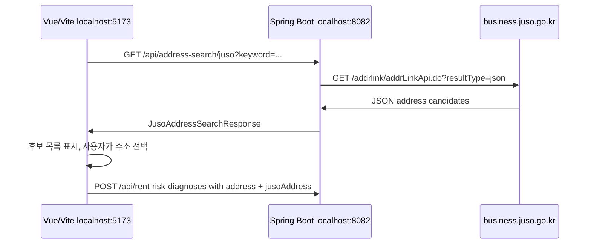
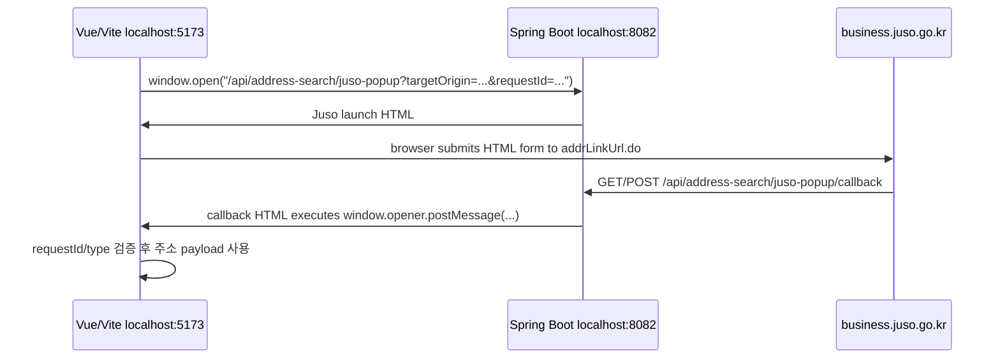

# Juso CORS와 주소 팝업 callback 문제

> Status: Implemented
> Last updated: 2026-06-23

## Goal

이 문서는 ZIP:ON의 Juso 주소 팝업에서 발생한 CORS 의심 오류와 Tomcat HTTP request parsing 오류를 상세히 정리한다.

핵심 결론은 아래와 같다.

```text
프론트엔드는 business.juso.go.kr을 axios/fetch로 직접 호출하지 않는다.
현재 홈 위험진단 화면의 기본 주소 찾기는 Spring Boot backend proxy가 Juso 직접검색 API를 호출한다.
팝업 방식은 보조/호환 경로로만 남긴다.
팝업을 쓸 때 로컬 Spring Boot 8082 포트가 HTTP-only라면 returnUrl도 http://localhost:8082/... 여야 한다.
팝업 HTTPS returnUrl은 실제 HTTPS proxy, tunnel, 또는 server.ssl 설정이 있을 때만 사용한다.
```

## Incident Summary

주소 팝업을 백엔드 endpoint로 열었는데도, 주소 선택 시 CORS처럼 보이는 문제가 계속 발생했다.
이후 Tomcat 로그에는 아래 계열의 오류가 남았다.

```text
Error parsing HTTP request header
java.lang.IllegalArgumentException: Invalid character found in method name [0x16 0x03 ...]
HTTP method names must be tokens
```

이 오류는 일반적인 CORS 실패가 아니다.
`0x16 0x03`은 TLS handshake 시작 바이트다.
즉, 브라우저 또는 Juso callback이 `https://...:8082`로 요청했지만, 로컬 Spring Boot의 `8082` 포트는 plain HTTP로 떠 있어서 Tomcat HTTP parser가 TLS 바이트를 HTTP method로 읽다가 실패한 것이다.

## Current ZIP:ON Implementation

현재 홈 위험진단 화면의 기본 주소 검색 UX는 팝업이 아니라 backend proxy 직접검색이다.



이 방식은 브라우저가 Juso를 직접 `axios/fetch`로 호출하지 않고, Juso 팝업 window와 callback `returnUrl`도 사용하지 않는다.

팝업 endpoint는 보조/호환 경로로 남아 있다.

보조 팝업 흐름:



구현 파일:

| 역할 | 파일 |
| --- | --- |
| 프론트 직접검색 API 호출 | `frontend/src/api/addressSearchApi.js` |
| 프론트 주소 후보 UI와 선택 처리 | `frontend/src/components/common/SearchBar.vue` |
| 프론트 팝업 열기와 `message` 수신 보조 함수 | `frontend/src/utils/jusoAddressSearch.js` |
| Juso 직접검색 controller | `backend/src/main/java/com/zipon/controller/JusoAddressSearchController.java` |
| Juso 직접검색 service | `backend/src/main/java/com/zipon/service/JusoAddressSearchService.java` |
| Juso 직접검색 client/parser | `backend/src/main/java/com/zipon/external/juso/JusoAddressSearchApiClient.java`, `JusoAddressSearchApiResponseParser.java` |
| Juso 팝업 시작 endpoint | `backend/src/main/java/com/zipon/controller/JusoAddressPopupController.java` |
| Juso callback endpoint | `backend/src/main/java/com/zipon/controller/JusoAddressPopupController.java` |
| Juso launch/callback HTML 생성 | `backend/src/main/java/com/zipon/service/JusoAddressPopupPageRenderer.java` |
| Juso 설정 바인딩 | `backend/src/main/java/com/zipon/config/JusoAddressProperties.java` |
| Spring 설정 | `backend/src/main/resources/application.yml` |
| 환경변수 예시 | `.env.example` |

현재 endpoint 경계:

| 동작 | Method | Endpoint | 설명 |
| --- | --- | --- | --- |
| 직접 주소검색 proxy | GET | `/api/address-search/juso` | 기본 화면 흐름. Spring Boot가 `addrLinkApi.do`를 `resultType=json`으로 호출한다. |
| 팝업 시작 | GET | `/api/address-search/juso-popup` | 보조/호환 흐름. 승인키와 `returnUrl`을 담은 HTML form을 생성한다. |
| 주소 선택 callback | GET/POST | `/api/address-search/juso-popup/callback` | 보조/호환 흐름. Juso가 돌려준 주소 필드를 HTML `postMessage`로 부모 창에 전달한다. |

## Why It Looked Like CORS

브라우저에서 Juso 관련 오류가 보이면 CORS부터 의심하기 쉽다.
실제로 Juso 공식 Q&A 사례들도 React, axios, fetch에서 `business.juso.go.kr`을 직접 호출하면 CORS 문제가 난다고 안내한다.

하지만 ZIP:ON 흐름에서는 프론트가 `business.juso.go.kr`을 XHR/fetch로 직접 호출하지 않는다.

현재 기본 화면은 아래 ZIP:ON backend API만 호출한다.

```text
/api/address-search/juso
```

보조 팝업 함수도 아래 백엔드 URL만 연다.

```text
/api/address-search/juso-popup
```

Juso 외부 URL은 `JusoAddressPopupPageRenderer`가 생성하는 HTML form의 `action`에만 있다.

```text
https://business.juso.go.kr/addrlink/addrLinkUrl.do
```

HTML form navigation은 XHR/fetch CORS와 다른 흐름이다.
따라서 이 문제를 CORS allow-origin 추가만으로 해결하려 하면 계속 빗나간다.

## Official And Case-Study Direction

조사한 사례의 방향은 거의 한 가지다.

```text
하지 말 것:
React/Vite에서 axios/fetch로 business.juso.go.kr 직접 호출

가능하지만 현재 ZIP:ON에는 부적합:
addrLinkApiJsonp.do + JSONP + jQuery 방식

추천 1:
Spring Boot backend proxy에서 addrLinkApi.do 호출 후 JSON 반환

추천 2:
공식 팝업 API를 쓰고 returnUrl을 Spring Boot callback으로 받은 뒤
callback HTML에서 postMessage로 Vue 화면에 전달
```

ZIP:ON의 현재 화면 기본 흐름은 추천 1번이다.
팝업 endpoint는 추천 2번 구조로 보조/호환 경로에 남겨 둔다.

참고한 사례:

- Juso Q&A: API 신청 URL/IP는 CORS 허용 설정이 아니며, CORS가 발생하면 서버에서 호출하라는 안내
- Juso Q&A: `addrLinkApiJsonp.do`를 axios/fetch JSON처럼 읽는 방식은 부적합하며 JSONP 또는 서버 호출을 사용하라는 안내
- 커뮤니티 사례: Next.js rewrite, CRA setupProxy, Netlify redirect, Spring Boot proxy 모두 결국 서버 또는 개발 서버 proxy를 경유한다는 공통점이 있음

## Root Cause

이번 문제는 두 개의 혼동이 겹쳤다.

### 1. CORS 문제와 protocol mismatch 문제를 같은 문제로 본 것

CORS는 브라우저가 cross-origin XHR/fetch 응답을 읽을 수 있는지의 문제다.

Tomcat의 아래 오류는 전혀 다른 층위다.

```text
Invalid character found in method name [0x16 0x03 ...]
```

이는 HTTPS 요청이 HTTP-only 포트에 들어왔다는 뜻이다.
Spring MVC controller에 도달하기 전 Tomcat request line parsing 단계에서 실패한다.

### 2. `targetOrigin`과 `returnUrl`의 역할을 혼동한 것

`targetOrigin`은 callback HTML이 `window.opener.postMessage(...)`를 보낼 대상 origin이다.

예:

```text
http://localhost:5173
```

`returnUrl`은 Juso가 주소 선택 결과를 되돌려 보낼 Spring Boot callback URL이다.

예:

```text
http://localhost:8082/api/address-search/juso-popup/callback?targetOrigin=http://localhost:5173&requestId=...
```

`targetOrigin`을 HTTPS로 바꾼다고 Juso callback URL이 HTTPS가 되는 것도 아니고, Juso callback URL을 HTTPS로 바꾼다고 Vite `postMessage` 대상이 바뀌는 것도 아니다.

## Correct Request Flow

### Primary flow: backend proxy direct search

`frontend/src/components/common/SearchBar.vue`:

```text
주소 입력
-> 주소 찾기 클릭
-> searchJusoAddresses(keyword)
-> GET /api/address-search/juso
-> 후보 목록 표시
-> 후보 클릭
-> searchQuery = 후보 지번/도로명 주소
-> diagnosisForm.jusoAddress = 구조화 주소 필드
```

`frontend/src/api/addressSearchApi.js`:

```text
GET /address-search/juso
params:
  keyword
  currentPage=1
  countPerPage=8
  hstryYn=N
  firstSort=none
  addInfoYn=Y
```

`JusoAddressSearchController`는 ZIP:ON backend API boundary다.
브라우저는 이 endpoint만 호출한다.
실제 외부 Juso 호출은 `JusoAddressSearchApiClient`가 수행한다.

이 흐름에서 CORS가 날 수 있는 지점은 ZIP:ON frontend와 ZIP:ON backend 사이뿐이다.
Juso CORS는 브라우저가 Juso를 직접 호출하지 않으므로 문제 경로에서 빠진다.

### Secondary flow: popup callback

아래는 보조/호환으로 남아 있는 팝업 흐름이다.

#### 1. Vue opens ZIP:ON backend popup endpoint

`frontend/src/utils/jusoAddressSearch.js`:

```text
openJusoAddressPopup()
-> buildPopupUrl(requestId)
-> window.open("/api/address-search/juso-popup?targetOrigin=<window.location.origin>&requestId=<uuid>")
```

로컬 Vite proxy-first 모드에서는 실제 브라우저 URL이 아래처럼 된다.

```text
http://localhost:5173/api/address-search/juso-popup?targetOrigin=http://localhost:5173&requestId=...
```

Vite dev server가 `/api`를 backend로 proxy한다.
direct API 모드라면 `VITE_API_BASE_URL=http://localhost:8082/api`로 인해 아래처럼 열린다.

```text
http://localhost:8082/api/address-search/juso-popup?targetOrigin=http://localhost:5173&requestId=...
```

둘 다 프론트가 Juso를 직접 XHR/fetch하지 않는다.

#### 2. Spring Boot creates Juso launch HTML

`JusoAddressPopupController.openPopup(...)`는 `JUSO_ADDRESS_CONFIRM_KEY`가 있으면 `JusoAddressPopupPageRenderer.renderLaunchPage(...)`를 호출한다.

생성되는 핵심 HTML:

```html
<form id="jusoForm" method="post" action="https://business.juso.go.kr/addrlink/addrLinkUrl.do">
  <input type="hidden" name="confmKey" value="...">
  <input type="hidden" name="returnUrl" value="http://localhost:8082/api/address-search/juso-popup/callback?...">
  <input type="hidden" name="resultType" value="4">
  <input type="hidden" name="useDetailAddr" value="Y">
</form>
```

#### 3. Browser submits form to Juso

이 요청은 페이지 navigation/form submit이다.
프론트 JavaScript의 axios/fetch가 아니므로 Juso CORS 정책과 직접 충돌하지 않는다.

#### 4. Juso returns selected address to Spring Boot callback

Juso는 주소 선택 결과를 `returnUrl`로 돌려준다.
현재 ZIP:ON의 callback은 아래다.

```text
/api/address-search/juso-popup/callback
```

`GET`과 `POST`를 모두 받는다.
Juso 또는 환경에 따라 query/form 형태가 달라져도 callback HTML을 생성할 수 있게 하기 위해서다.

#### 5. Callback HTML posts message to Vue opener

`JusoAddressPopupPageRenderer.renderCallbackPage(...)`는 Juso 주소 필드를 payload로 만들어 아래 message를 보낸다.

```text
type: zipon:juso-address-selected
requestId: <same requestId>
payload: { roadAddr, jibunAddr, admCd, ... }
```

프론트는 아래를 검증한다.

```text
event.source === popup
event.data.type === "zipon:juso-address-selected"
event.data.requestId === requestId
```

검증을 통과하면 `SearchBar.vue`의 위험진단 입력값으로 주소를 반영한다.

## URL Rules

### Local default

Spring Boot가 HTTP로 실행 중이면 Juso `returnUrl`도 HTTP여야 한다.

```text
http://localhost:8082/api/address-search/juso-popup/callback?targetOrigin=http://localhost:5173&requestId=...
```

### HTTPS proxy or tunnel

`JUSO_POPUP_RETURN_ORIGIN`은 실제로 접근 가능한 HTTPS origin이 있을 때만 설정한다.

예:

```text
JUSO_POPUP_RETURN_ORIGIN=https://zipon-local-tunnel.example.test
```

이 경우 controller는 origin만 사용하고 path는 현재 callback path로 붙인다.

```text
https://zipon-local-tunnel.example.test/api/address-search/juso-popup/callback?targetOrigin=http://localhost:5173&requestId=...
```

### Do not use fake HTTPS

아래 URL은 로컬 `8082`에 TLS가 설정되어 있지 않으면 실패한다.

```text
https://localhost:8082/api/address-search/juso-popup/callback
```

이 상태에서 주소를 선택하면 Tomcat이 TLS handshake bytes를 HTTP method로 해석해 `0x16 0x03` 오류를 남긴다.

## Configuration

Juso 관련 설정은 backend-owned secret이다.

```yaml
zipon:
  external:
    juso:
      base-url: ${JUSO_BASE_URL:https://business.juso.go.kr}
      popup-confirm-key: ${JUSO_ADDRESS_CONFIRM_KEY:}
      popup-return-origin: ${JUSO_POPUP_RETURN_ORIGIN:}
      address-search-key: ${JUSO_ADDRESS_SEARCH_KEY:}
```

환경변수 역할:

| 환경변수 | 역할 | 프론트 노출 여부 |
| --- | --- | --- |
| `JUSO_ADDRESS_CONFIRM_KEY` | 팝업 API 승인키 | 노출 금지 |
| `JUSO_ADDRESS_SEARCH_KEY` | 직접 주소검색 API 승인키 | 노출 금지 |
| `JUSO_POPUP_RETURN_ORIGIN` | 실제 접근 가능한 callback origin override | 노출 금지 |
| `VITE_API_BASE_URL` | 프론트가 ZIP:ON backend API를 여는 base URL | 프론트 빌드 변수 |

`JUSO_POPUP_RETURN_ORIGIN`은 빈 값이 기본이다.
로컬 개발에서는 빈 값으로 두면 현재 backend request URL에서 HTTP callback을 만든다.

## Reproduction And Diagnosis

### 1. 프론트가 Juso를 직접 호출하는지 확인

```bash
rg -n "business\\.juso|addrLinkUrl|addrLinkApi|fetch\\(|axios\\(" frontend backend/src/main
```

정상 기대:

```text
frontend에는 business.juso.go.kr 직접 호출이 없어야 한다.
business.juso.go.kr은 backend renderer/client 또는 문서에만 있어야 한다.
```

### 2. 생성된 launch HTML 확인

백엔드를 켠 뒤 확인한다.

```bash
curl -s 'http://localhost:8082/api/address-search/juso-popup?targetOrigin=http://localhost:5173&requestId=debug' \
  | rg 'addrLinkUrl|returnUrl|resultType|useDetailAddr'
```

정상 기대:

```text
action="https://business.juso.go.kr/addrlink/addrLinkUrl.do"
name="returnUrl" value="http://localhost:8082/api/address-search/juso-popup/callback?targetOrigin=http://localhost:5173..."
name="resultType" value="4"
name="useDetailAddr" value="Y"
```

### 3. HTTPS가 실제로 열리는지 확인

HTTPS callback을 쓰려면 먼저 origin이 실제로 열려야 한다.

```bash
curl -I 'https://zipon-local-tunnel.example.test/api/address-search/juso-popup/callback'
```

`https://localhost:8082`를 쓰고 싶다면 Spring Boot `server.ssl.*` 또는 앞단 proxy가 먼저 필요하다.

### 4. Tomcat `0x16 0x03` 로그 판별

아래 로그가 있으면 CORS보다 protocol mismatch를 먼저 본다.

```text
Invalid character found in method name [0x16 0x03 ...]
```

확인할 것:

```text
1. Juso returnUrl에 https://localhost:8082가 들어갔는가?
2. server.ssl.enabled가 설정되어 있는가?
3. reverse proxy 또는 tunnel이 실제로 8082 앞에서 TLS를 종료하는가?
4. JUSO_POPUP_RETURN_ORIGIN이 잘못된 HTTPS origin으로 설정되어 있는가?
```

## Fix History

### 2026-06-23: popup callback endpoint 분리

첫 번째 수정에서 endpoint 역할을 분리했다.

이전에는 `/api/address-search/juso-popup` 하나가 팝업 시작과 callback을 함께 처리할 수 있었다.
호환 처리는 남겨 두었지만, Juso에 전달하는 정식 `returnUrl`은 아래 전용 callback endpoint로 바꾸었다.

```text
/api/address-search/juso-popup/callback
```

수정된 핵심 로직:

```text
JusoAddressPopupController.openPopup(...)
-> buildReturnUrl(...)
-> 기본: request.getRequestURL() + "/callback"
-> override: JUSO_POPUP_RETURN_ORIGIN + current request path + "/callback"
```

이렇게 분리한 이유:

```text
1. 팝업 시작 URL과 주소 선택 callback URL이 로그에서 명확히 구분된다.
2. Juso가 되돌려주는 endpoint가 문서와 조사 결과의 권장 흐름과 일치한다.
3. HTTPS origin override를 쓰더라도 path 계산이 일관된다.
4. 이후 callback 보안 검증이나 payload 검증을 추가하기 쉽다.
```

### 2026-06-23: 홈 위험진단 화면을 backend proxy 직접검색으로 전환

팝업 흐름이 계속 CORS 또는 callback 환경 문제로 보이면, 팝업 자체를 기본 사용자 흐름에서 제거하는 것이 더 안정적이다.
두 번째 수정에서 `SearchBar.vue`의 "주소 찾기"를 팝업 열기 대신 `GET /api/address-search/juso` 호출로 바꾸었다.

변경된 파일:

```text
frontend/src/api/addressSearchApi.js
frontend/src/components/common/SearchBar.vue
```

새 기본 흐름:

```text
SearchBar.vue
-> searchJusoAddresses(keyword)
-> GET /api/address-search/juso
-> JusoAddressSearchController
-> JusoAddressSearchService
-> JusoAddressSearchApiClient
-> https://business.juso.go.kr/addrlink/addrLinkApi.do?resultType=json
```

이렇게 바꾼 이유:

```text
1. 브라우저가 business.juso.go.kr을 fetch/axios로 직접 호출하지 않는다.
2. 팝업 차단, opener, postMessage, returnUrl protocol 문제를 기본 흐름에서 제거한다.
3. 주소 후보 목록을 ZIP:ON 화면 안에서 제어할 수 있다.
4. 기존 RentRiskDiagnosisRequest.jusoAddress 구조는 그대로 재사용한다.
```

## Verification

수정 후 실행한 검증:

```bash
git diff --check
cd backend && ./mvnw -Dtest=JusoAddressPopupControllerTest,JusoAddressPopupPageRendererTest,JusoAddressPropertiesTest,CorsIntegrationTest clean test
cd backend && ./mvnw -Dtest=JusoAddressPropertiesTest,JusoAddressPopupControllerTest,JusoAddressPopupPageRendererTest,JusoAddressSearchApiClientTest,JusoAddressSearchApiResponseParserTest,JusoAddressSearchServiceTest,JusoAddressSearchControllerTest,CorsIntegrationTest test
cd backend && ./mvnw test
cd frontend && npm run build
```

검증 결과:

```text
Focused popup/CORS tests: 12 tests passed
Juso related tests: 23 tests passed
Full backend tests: 290 tests passed
Frontend build: passed
```

추가로 아래 scan을 수행했다.

```bash
rg -n "business\\.juso|addrLinkUrl|addrLinkApi|fetch\\(|axios\\(|JUSO_ADDRESS_CONFIRM_KEY|JUSO_ADDRESS_SEARCH_KEY|juso-popup" frontend backend/src/main docs/api docs/operations/skills
```

확인 결과:

```text
frontend에 business.juso.go.kr 직접 호출 없음
Juso popup 외부 URL은 backend JusoAddressPopupPageRenderer에만 존재
직접 주소검색 외부 path는 backend JusoAddressSearchApiClient에만 존재
문서에는 backend-owned key 원칙만 남음
```

## Manual Smoke Test

### Local backend proxy

1. `.env`에 backend Juso search key를 설정한다.

```text
JUSO_ADDRESS_SEARCH_KEY=<address search key>
```

2. backend를 실행한다.

```bash
cd backend
./mvnw spring-boot:run
```

3. frontend를 실행한다.

```bash
cd frontend
npm run dev
```

4. 홈 화면 위험진단 입력 폼에 주소 검색어를 넣고 "주소 찾기"를 누른다.

정상 기대:

```text
주소 후보 목록이 화면 안에 표시된다.
후보를 선택하면 주소 입력값이 채워진다.
진단 요청 payload에 address와 jusoAddress가 함께 들어간다.
브라우저 Network tab에 business.juso.go.kr fetch/XHR 요청이 없다.
```

### Local popup HTTP

이 흐름은 보조/호환 endpoint를 수동으로 확인할 때 사용한다.

1. `.env`에 backend Juso key를 설정한다.

```text
JUSO_ADDRESS_CONFIRM_KEY=<popup confirm key>
JUSO_ADDRESS_SEARCH_KEY=<address search key>
JUSO_POPUP_RETURN_ORIGIN=
```

2. backend를 실행한다.

```bash
cd backend
./mvnw spring-boot:run
```

3. frontend를 실행한다.

```bash
cd frontend
npm run dev
```

4. 브라우저에서 홈 화면 분석/진단 입력 폼의 주소 검색을 연다.

정상 기대:

```text
주소 팝업이 열린다.
주소 선택 후 팝업이 닫힌다.
선택 주소가 SearchBar.vue 입력값으로 반영된다.
Tomcat에 0x16 0x03 request parsing 오류가 남지 않는다.
```

### HTTPS tunnel

1. HTTPS tunnel 또는 proxy를 먼저 띄운다.
2. 아래 URL이 실제로 열리는지 확인한다.

```bash
curl -I 'https://<tunnel-host>/api/address-search/juso-popup/callback'
```

3. `.env`에 origin만 설정한다.

```text
JUSO_POPUP_RETURN_ORIGIN=https://<tunnel-host>
```

4. launch HTML의 `returnUrl`을 확인한다.

```bash
curl -s 'http://localhost:8082/api/address-search/juso-popup?targetOrigin=http://localhost:5173&requestId=debug' \
  | rg 'returnUrl'
```

정상 기대:

```text
https://<tunnel-host>/api/address-search/juso-popup/callback?targetOrigin=http://localhost:5173&requestId=debug
```

## Rollback Notes

문제가 생겼을 때 되돌릴 수 있는 최소 단위:

```text
1. JUSO_POPUP_RETURN_ORIGIN을 비운다.
2. backend를 재시작한다.
3. launch HTML의 returnUrl이 http://localhost:8082/api/address-search/juso-popup/callback... 인지 확인한다.
```

코드 rollback이 필요하다면 callback endpoint 분리 변경만 되돌릴 수 있다.
다만 권장하지 않는다.
팝업 시작 URL과 callback URL을 다시 하나로 합치면 로그 분석과 운영 진단이 다시 어려워진다.

## Common Mistakes

| 실수 | 왜 문제인가 | 올바른 조치 |
| --- | --- | --- |
| 프론트에서 `business.juso.go.kr`을 `fetch`로 직접 호출 | Juso CORS 정책에 막힌다. | 기본 화면은 backend proxy `/api/address-search/juso`를 사용한다. |
| `addrLinkApiJsonp.do`를 `response.json()`으로 파싱 | JSONP는 순수 JSON이 아니다. | backend에서 `addrLinkApi.do?resultType=json`을 호출한다. |
| `returnUrl`만 강제로 HTTPS로 변경 | TLS 없는 8082 포트에 HTTPS 요청이 들어간다. | 실제 HTTPS proxy/tunnel을 먼저 만든다. |
| `targetOrigin`을 callback URL로 착각 | `targetOrigin`은 postMessage 대상이다. | Juso callback은 `returnUrl`, Vue message 대상은 `targetOrigin`으로 분리한다. |
| Juso 승인키를 Vite env로 옮김 | 프론트 빌드 결과에 key가 노출될 수 있다. | 승인키는 backend env에만 둔다. |
| CORS allow-origin만 추가 | `0x16 0x03`은 CORS가 아니라 protocol mismatch다. | 생성된 `returnUrl`과 backend TLS 설정을 확인한다. |

## Learning Path

1. First read: `frontend/src/utils/jusoAddressSearch.js`
2. Then inspect: `frontend/src/api/addressSearchApi.js`
3. Then inspect: `frontend/src/components/common/SearchBar.vue`
4. Then inspect: `backend/src/main/java/com/zipon/controller/JusoAddressSearchController.java`
5. Then inspect: `backend/src/main/java/com/zipon/external/juso/JusoAddressSearchApiClient.java`
6. Then inspect: `backend/src/main/java/com/zipon/controller/JusoAddressPopupController.java`
7. Then inspect: `backend/src/main/resources/application.yml`
8. Then inspect: `docs/api/EXTERNAL_API_CONFIGURATION.md`
9. Then run: focused Juso tests and frontend build
10. Then debug: browser Network tab의 `/api/address-search/juso`, launch HTML의 `returnUrl`, Tomcat `0x16 0x03` 로그

## Spring And Web Concepts

### Spring MVC boundary

`JusoAddressPopupController`는 HTTP boundary다.
팝업 시작 요청과 callback 요청을 endpoint로 분리하면 Spring MVC mapping만 봐도 요청 역할을 알 수 있다.

```text
GET /api/address-search/juso-popup
GET/POST /api/address-search/juso-popup/callback
```

컨트롤러는 외부 API 호출을 직접 수행하지 않고, HTML 생성 책임을 `JusoAddressPopupPageRenderer`에 위임한다.
이 구조는 controller를 얇게 유지하고 테스트하기 쉽게 만든다.

### Browser security boundary

CORS는 fetch/XHR 응답을 JavaScript가 읽을 수 있는지의 정책이다.
HTML form submit, top-level navigation, popup navigation, `postMessage`는 각각 다른 보안 경계를 가진다.

이번 흐름은 fetch/XHR로 Juso를 읽지 않는다.
대신 Juso popup page navigation 후, ZIP:ON backend callback page가 `postMessage`로 같은 사용자의 opener window에 데이터를 전달한다.

### Tomcat HTTP parser boundary

Tomcat의 request parsing 오류는 Spring MVC controller보다 앞에서 발생한다.
따라서 `@CrossOrigin`, CORS config, controller method 수정으로는 `0x16 0x03` 오류를 해결할 수 없다.
먼저 URL scheme과 실제 listener protocol이 맞는지 확인해야 한다.

## Related Documents

- [External API configuration](/docs/api/EXTERNAL_API_CONFIGURATION.md)
- [Frontend connection spec](/docs/api/API_FRONTEND_CONNECTION_SPEC.md)
- [Address code flow](/docs/api/external-api/ADDRESS_CODE_FLOW.md)
- [Juso popup return URL protocol skill](/docs/operations/skills/juso-popup-return-url-protocol.md)
