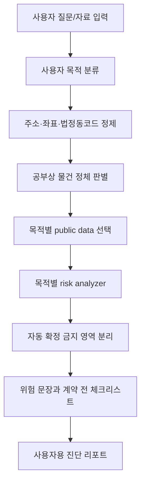

# ZIP:ON 확장형 서비스 정의

> Status: Proposed
>
> 이 문서는 당장 구현할 기능 목록이 아니라, ZIP:ON을 과거 지표 분석과 정확 주소 위험진단 MVP 이후에도 확장 가능한 형태로 설계하기 위한 장기 제품 기준입니다. 현재 구현 우선순위는 여전히 [과거 지표 기반 부동산 분석 MVP 범위](/docs/product/MVP_SCOPE.md)를 따릅니다.

## Goal

ZIP:ON은 사용자가 이미 보고 있는 부동산을 계약하거나 매입하기 전에, 그 물건이 법적으로 무엇이고, 사용자의 목적에 맞는지, 가격·권리·용도·입지·환경 측면에서 무엇이 위험한지, 그리고 계약 전 무엇을 확인해야 하는지 알려주는 목적 기반 부동산 사전진단 서비스입니다.

ZIP:ON이 답해야 하는 질문은 아래입니다.

```text
내가 보고 있는 이 물건을 계약해도 되는지 판단하기 전에,
무엇을 확인해야 하는가?
```

기존 부동산 서비스가 보통 "어디에 어떤 매물이 있는가?"를 보여준다면, ZIP:ON은 "이미 보고 있는 이 물건을 내 목적에 맞게 검토하려면 무엇을 확인해야 하는가?"를 알려줍니다.

이 기준은 확장 단계에서도 유지합니다. ZIP:ON은 현재 매물 목록을 보여주는 플랫폼이 아니라, 사용자가 가져온 주소·지역·유형·목적을 과거 공공데이터와 통계 지표로 분석하는 서비스입니다. `강남 원룸` 같은 입력은 현재 매물 나열이 아니라 강남 지역의 원룸 후보 유형과 전월세·가격지수·실거래 흐름을 분석하는 요청으로 해석합니다.

제품 정체성은 아래 표현으로 정리합니다.

```text
부동산 거래 전 건강검진 서비스
부동산 계약 전 리스크 체크 엔진
목적 기반 공공데이터 해석 서비스
과거 지표 기반 부동산 판단 보조 서비스
```

## Relationship To MVP

MVP의 대표 사용자는 지역·유형의 과거 흐름을 이해하거나 정확 주소의 전세·월세 위험을 확인하려는 부동산 초보자입니다. 그러나 확장형 ZIP:ON은 특정 매물 유형 하나만 다루는 서비스가 아니라, 사용자의 목적과 분석 의도에 따라 기준이 달라지는 서비스입니다.

확장 가능성은 현재 코드를 과하게 일반화하라는 뜻이 아닙니다. MVP 코드는 현재 매물 미제공, 과거 지표 분석, 정확 주소 위험진단을 작고 명확하게 구현하되, 아래 구조가 나중에 막히지 않도록 작성해야 합니다.

```text
User Purpose
-> Property Identification
-> Public Data Collection
-> Purpose-Based Risk Analysis
-> Direct Confirmation Boundary
-> Checklist And Report
```

## Target Users

확장형 ZIP:ON은 아래 사용자를 장기 대상으로 봅니다.

```text
1. 전세·월세 계약을 앞둔 임차인
2. 주거용 매매를 검토하는 실거주자
3. 오피스텔·빌라·아파트 매입을 검토하는 개인
4. 상가를 얻어 창업하려는 자영업자
5. 상가 또는 건물을 매입하려는 투자자
6. 임야·토지를 싸다고 보고 있는 초보 투자자
7. 전원주택·창고·공장 부지를 찾는 사람
8. 꼬마빌딩 매입을 검토하는 개인 투자자
9. 부동산 계약 전 최소한의 리스크를 확인하고 싶은 일반 사용자
```

이 목록은 MVP에서 모두 구현하라는 의미가 아닙니다. 현재 구현은 과거 지표 분석과 정확 주소 위험진단을 우선하지만, 도메인 이름과 서비스 경계는 위 목적들이 나중에 들어올 수 있도록 잡습니다.

## User Inputs

확장형 서비스에서 사용자는 단순히 주소만 입력하지 않습니다.

```text
주소
매물 설명
계약 목적
거래 형태
희망 가격
보증금
월세
매매가
관리비
면적
층수
업종
개발 목적
보유 자료
등기부등본
중개대상물 확인설명서
임대차 관련 자료
현장 사진
```

사용자 질문은 아래처럼 생활 언어로 들어올 수 있습니다.

```text
이 원룸 전세 안전한가요?
이 오피스텔 매매가 괜찮나요?
이 상가에서 카페 가능할까요?
이 임야 사도 되나요?
이 꼬마빌딩 수익성 괜찮나요?
이 토지에 전원주택 지을 수 있나요?
```

중요한 점은 사용자가 "이 집 어때?"라고 물었을 때 바로 실거래가부터 보여주지 않는 것입니다. 먼저 사용자의 목적과 물건 정체를 구분해야 합니다.

같은 오피스텔이라도 목적에 따라 먼저 봐야 할 항목이 달라집니다.

| 사용자 목적 | 먼저 봐야 할 항목 |
| --- | --- |
| 전세입자 | 보증금 회수 가능성, 근저당, 전세보증보험, 권리관계 |
| 월세입자 | 월세 적정성, 관리비, 생활 인프라, 건물 상태 |
| 매수자 | 매매가 적정성, 공시가격, 노후도, 향후 거래 가능성 |
| 투자자 | 수익률, 공실 가능성, 임대수요, 관리비, 매각 리스크 |

## Canonical Flow

확장형 ZIP:ON의 전체 흐름은 아래 순서를 유지합니다.

```text
1. 사용자 입력 정제
2. 주소·좌표·법정동 코드 변환
3. 물건 정체 판별
4. 건축물·토지 기본정보 조회
5. 시세·실거래가·공시가격 조회
6. 용도지역·지적·토지규제 확인
7. 목적별 위험도 계산
8. 목적별 추가 분석
9. 생활·상권·안전·환경 분석
10. 계약 전 확인사항 및 불가능 영역 안내
11. 사용자 자료 업로드 분석
12. 최종 진단 리포트 생성
13. 계약 전 체크리스트 제공
```

핵심은 순서입니다. ZIP:ON은 주소를 넣자마자 실거래가부터 조회하지 않습니다. 먼저 이 물건이 무엇인지 판별합니다.

```text
아파트인가?
다세대주택인가?
다가구주택인가?
오피스텔인가?
상가인가?
토지인가?
임야인가?
꼬마빌딩인가?
근린생활시설인가?
```

물건의 정체가 달라지면 뒤에서 확인해야 할 데이터와 위험도 계산 방식이 달라집니다.



## Property Identification

확장형 서비스에서도 가장 중요한 기능은 물건 정체 판별입니다.

사용자는 부동산을 생활 언어로 말합니다.

```text
원룸
빌라
상가
시골 땅
꼬마빌딩
창고
전원주택 부지
```

하지만 공부상 유형은 다를 수 있습니다.

| 사용자 표현 | 실제 가능성 |
| --- | --- |
| 원룸 | 다가구주택, 다세대주택, 오피스텔, 도시형생활주택, 근린생활시설, 고시원 |
| 빌라 | 다세대주택, 연립주택, 다가구주택, 근린생활시설 일부 |
| 상가 | 제1종 근린생활시설, 제2종 근린생활시설, 업무시설, 판매시설, 위반건축물 일부 |
| 땅 | 대지, 전, 답, 임야, 도로, 잡종지, 보전산지 |

판별 결과에 따라 사용자가 봐야 할 위험이 달라집니다.

| 판별 결과 | 대표 확인 방향 |
| --- | --- |
| 다가구주택 | 건물 전체 선순위 임차인 보증금 확인 필요 |
| 다세대주택 | 해당 호실의 등기와 전유부 확인 필요 |
| 오피스텔 | 주거용 사용 가능 여부, 전세보증보험 가능성 확인 필요 |
| 상가 | 업종 인허가, 용도, 배수·환기·전기용량 확인 필요 |
| 임야 | 도로 접면, 산지 규제, 개발행위 가능성 확인 필요 |
| 꼬마빌딩 | 임대수익, 공실, 권리관계, 건축물 상태 확인 필요 |

## Purpose 1: 전세·월세 위험진단

전세·월세 목적에서는 "살기 좋은가"보다 먼저 "보증금이 안전한가"를 봐야 합니다.

확인 항목:

```text
물건 유형
보증금
월세
관리비
주변 전월세 실거래가
주변 매매 실거래가
공시가격
전세가율
건축물대장상 주용도
위반건축물 여부
사용승인일
다가구 여부
전유부 존재 여부
등기부등본 확인 필요 여부
선순위 임차인 확인 필요 여부
전세보증보험 가능성
```

결과 문장 예시:

```text
이 물건은 사용자가 말한 "원룸"이지만, 공부상 다가구주택일 가능성이 있습니다.
다가구주택은 호실별로 소유권이 나뉘지 않기 때문에 내 보증금만 보는 것이 아니라
건물 전체 선순위 임차인 보증금과 근저당을 함께 확인해야 합니다.
현재 입력한 보증금은 주변 전월세 거래와 비교했을 때 과도하지는 않지만,
매매 추정가 대비 전세가율과 등기부 권리관계 확인이 필요합니다.
```

## Purpose 2: 주거용 매매 사전진단

매매 목적에서는 보증금보다 소유권 이전, 가격 적정성, 건물 상태, 향후 처분 가능성이 중요합니다.

확인 항목:

```text
매매가
주변 매매 실거래가
공시가격
건축물 노후도
사용승인일
주차대수
층수
엘리베이터 여부
위반건축물 여부
대지권 여부
용도지역
거래량 추이
생활 인프라
향후 매각 리스크
```

결과 문장 예시:

```text
입력한 매매가는 최근 주변 실거래가와 비교했을 때 다소 높은 편입니다.
다만 이 물건은 사용승인 후 30년 이상 지난 건물로,
수리비와 향후 매각 가능성을 함께 고려해야 합니다.
계약 전에는 건축물대장상 위반건축물 여부, 대지권 표시 여부,
최근 실거래가와 호가 차이를 확인하는 것이 좋습니다.
```

## Purpose 3: 상가 창업 입지진단

상가 목적에서는 "가격이 싼가"보다 "내 업종이 가능한가"가 먼저입니다.

확인 항목:

```text
건축물대장상 주용도
제1종/제2종 근린생활시설 여부
업종 인허가 가능성
용도지역
주변 동일 업종 밀집도
주변 유사 업종 분포
상업업무용 실거래가
임대료 수준
폐업·영업 상태 데이터
배수·환기·전기용량 확인 필요 여부
간판·동선·가시성 현장 확인 필요 여부
```

결과 문장 예시:

```text
이 상가는 건축물대장상 근린생활시설로 보입니다.
다만 카페 창업 가능 여부는 건축물 용도만으로 확정할 수 없습니다.
휴게음식점 또는 일반음식점 인허가 가능성, 배수·환기·전기용량,
관리단 업종 제한 여부를 추가로 확인해야 합니다.
주변에 동일 업종이 많은 편이라 경쟁 강도도 함께 검토해야 합니다.
```

ZIP:ON은 "이 자리에서 장사가 잘 된다"고 확정하면 안 됩니다. 상권 API는 1차 분석이고, 실제 유동인구·권리금·건물주 성향·현장 동선은 직접 확인해야 한다고 안내해야 합니다.

## Purpose 4: 임야·토지 개발 가능성 1차 진단

토지나 임야 목적에서는 "싸다/비싸다"보다 "쓸 수 있는 땅인가"가 중요합니다.

확인 항목:

```text
지목
면적
필지 경계
도로 접면 여부
용도지역
용도지구
토지이용 규제
개별공시지가
주변 토지 실거래가
산지 규제
농지 규제
하천·침수 위험
산사태 위험
개발행위허가 가능성
전기·수도 인입 가능성
```

결과 문장 예시:

```text
이 토지는 지목상 임야로 확인됩니다.
전원주택 목적이라면 가격보다 먼저 도로 접면 여부, 산지전용 가능성,
용도지역 규제, 전기·수도 인입 가능성을 확인해야 합니다.
현재 데이터만으로 개발 가능성을 확정할 수는 없으며,
계약 전 관할 지자체 개발행위허가 부서에 문의하는 것이 필요합니다.
```

토지·임야에서는 최종 판단을 서비스가 대신하면 안 됩니다.

```text
API 결과: 1차 위험 필터
최종 확인: 지자체 문의, 현장조사, 토목·건축 전문가 확인, 계약서 검토
```

## Purpose 5: 꼬마빌딩 수익성·리스크 진단

꼬마빌딩 매입 목적에서는 건물 자체보다 임대수익 구조를 봐야 합니다.

확인 항목:

```text
매매가
토지 가격
건물 가격
주변 상업업무용 실거래가
공시지가
공시가격
용도지역
건폐율
용적률
건물 노후도
공실 가능성
임대차 현황
월 임대수익
관리비 구조
수선 비용
권리관계
대출 부담
출구 전략
```

결과 문장 예시:

```text
이 물건은 단순 주거용 매매가 아니라 임대수익 구조를 함께 봐야 하는 건물입니다.
현재 입력한 매매가는 주변 거래와 비교해 추가 검토가 필요하며,
임대차 현황과 공실률을 확인하지 않으면 실제 수익률을 판단하기 어렵습니다.
계약 전에는 등기부등본, 임대차계약서, 월세 입금 내역, 수선 이력,
건축물대장상 위반 여부를 함께 확인해야 합니다.
```

## Cross-Cutting Module: 생활·안전·환경 리스크

거주 목적이나 장기 보유 목적에서는 주변 환경도 중요합니다.

확인 항목:

```text
학교
교통
치안시설
보행자 사고다발지역
자전거 사고다발지역
관리비
침수 위험
하천 범람 위험
산사태 위험
열분포
대피소
환경 정보
```

결과 문장 예시:

```text
이 물건은 초등학교와 가까운 편이지만,
주변에 보행자 사고다발 구간이 있어 통학 동선을 확인하는 것이 좋습니다.
저지대 또는 하천 인접 지역이라면 도시침수지도와 하천범람 위험도 함께 확인해야 합니다.
```

## Cross-Cutting Module: 계약 상대방·중개사 확인

확장형 서비스에서는 물건뿐 아니라 계약 상대방과 중개사도 확인해야 합니다.

확인 항목:

```text
중개사무소 등록 여부
중개업소 행정처분 여부
사업자등록 상태
중개보수 예상 금액
계약금 입금 계좌 명의
임대인·매도인 정보 확인 필요 여부
```

결과 문장 예시:

```text
계약 전에는 물건 자체뿐 아니라 계약 상대방과 중개사도 확인해야 합니다.
중개사무소 등록 여부, 행정처분 이력,
계약금 입금 계좌가 소유자 명의인지 확인하세요.
중개보수는 거래 금액과 지역 요율에 따라 달라질 수 있으므로
계약 전 예상 금액을 확인하는 것이 좋습니다.
```

## Cross-Cutting Module: 사용자 자료 업로드 분석

확장형 ZIP:ON에서는 공공데이터만으로 부족한 영역을 사용자 자료 업로드로 보완할 수 있습니다.

업로드 후보:

```text
등기부등본
중개대상물 확인설명서
임대차계약서 초안
건축물대장 PDF
관리비 고지서
임대차 현황 자료
선순위 임차인 내역
현장 사진
```

분석 목적은 확정 판정이 아닙니다.

```text
문서에서 위험 키워드 찾기
사용자가 확인해야 할 문장 표시
체크리스트로 변환
추가 확인 필요 여부 안내
```

결과 문장 예시:

```text
등기부등본에서 "근저당권" 관련 문구가 발견되었습니다.
채권최고액과 말소 조건을 중개사 또는 임대인에게 확인하세요.

등기부등본에서 "신탁" 관련 문구가 발견되었습니다.
신탁원부 확인과 수탁자 동의 여부 확인이 필요합니다.
```

원본 파일 저장, OCR, AI 보조 분석은 별도 보안·저장소·보존기간 설계가 정해진 뒤에만 붙입니다.

## Final Result

확장형 ZIP:ON의 최종 결과는 단순 점수가 아닙니다.

최종 결과물은 아래 내용을 포함해야 합니다.

```text
1. 물건 정체 요약
2. 사용자 목적 요약
3. 가격 적정성 요약
4. 보증금 또는 매매가 위험도
5. 건축물 위험도
6. 권리관계 확인 필요사항
7. 용도 적합성
8. 입지·생활·상권·환경 리스크
9. 직접 확인해야 하는 영역
10. 계약 전 체크리스트
11. 사용자용 진단 리포트
```

결과 화면 예시:

```text
진단 결과: 계약 전 추가 확인 필요

물건 정체:
사용자는 "원룸"이라고 입력했지만, 공부상 다가구주택일 가능성이 있습니다.

가격:
입력한 보증금은 주변 전월세 거래와 비교했을 때 과도하지는 않지만,
매매 추정가 대비 전세가율 확인이 필요합니다.

권리:
등기부등본과 선순위 임차인 보증금 내역을 확인해야 합니다.

건축물:
건축물대장상 위반건축물 여부와 사용승인일을 확인해야 합니다.

계약 전 확인할 것:
1. 등기부등본 갑구·을구 확인
2. 근저당권 채권최고액 확인
3. 선순위 임차인 보증금 내역 요청
4. 전세보증보험 가입 가능 여부 확인
5. 건축물대장상 위반건축물 여부 확인
6. 계약금 입금 계좌가 소유자 명의인지 확인
```

## Does Not Do

ZIP:ON은 확장되더라도 판정자가 아니라 사전 진단자입니다.

하지 않는 것:

```text
매물 목록을 무조건 많이 보여주는 서비스
현재 매물 목록을 자체 제공하는 서비스
네이버부동산/직방/다방 대체
공인중개사 대체
법무사 대체
감정평가사 대체
등기부등본 100% 자동 판정
무조건 사라/사지 마라 결정
전세사기 여부 확정 판정
상가 창업 성공 가능성 확정
토지 개발행위허가 가능성 확정
실제 하자 자동 판정
실제 유동인구 체감 확정
권리금 적정성 확정
```

특히 아래 영역은 API만으로 확정하기 어렵기 때문에 반드시 "직접 확인 필요"로 분리해야 합니다.

```text
소유자 실시간 확인
근저당권 말소 조건
신탁등기 세부 내용
선순위 임차인 전체 보증금
실제 누수·곰팡이·층간소음
상가 실제 매출
권리금 적정성
건물주 성향
도로 사용 권리
개발행위허가 가능성
전기·수도 인입 비용
```

## Expansion Roadmap

확장 순서는 아래가 자연스럽습니다.

```text
1단계: 과거 지표 분석과 정확 주소 위험진단
2단계: 주거용 매매 사전진단
3단계: 상가 창업 입지진단
4단계: 임야·토지 개발 가능성 1차 진단
5단계: 꼬마빌딩 수익성·리스크 진단
6단계: 사용자 문서 업로드 기반 권리관계 보조 분석
7단계: 관리자용 공공데이터·진단 이력·위험 룰 관리
8단계: 과거 진단 재분석과 지역별 위험 통계 제공
```

상세 구현 순서는 [ZIP:ON 성장 로드맵](/docs/product/ROADMAP.md)을 따릅니다.

## Extensible Code Rules

확장 가능하게 코드를 작성한다는 것은 모든 미래 기능을 지금 추상화하라는 뜻이 아닙니다. 현재 MVP를 작게 구현하되, 다음 제약을 지켜 확장 경로를 막지 않는다는 뜻입니다.

1. 사용자 목적을 먼저 모델링합니다.
   - 전세, 월세, 주거용 매매, 상가 창업, 토지 개발, 꼬마빌딩 매입은 서로 다른 use case입니다.
   - 목적이 다르면 request DTO, service orchestration, 위험 문장, checklist rule이 분리될 수 있습니다.

2. 물건 정체 판별을 공통 선행 단계로 둡니다.
   - 주소 정제, 법정동코드, 건축물대장/토지 기본정보, 공부상 유형 판별은 이후 목적별 분석의 입력입니다.
   - 사용자 표현만으로 실거래가 API나 위험 룰을 바로 선택하지 않습니다.

3. 목적별 분석기는 작은 협력 객체로 분리합니다.
   - MVP의 `RentRiskDiagnosisService`가 커지면 `PropertyIdentificationService`, `TransactionComparisonService`, `PublicPriceLookupService`, `BuildingRiskAnalyzer` 같은 협력 객체로 나눌 수 있습니다.
   - 매매, 상가, 토지, 꼬마빌딩 기능을 붙일 때는 `PurchaseRiskAnalyzer`, `CommercialUseRiskAnalyzer`, `LandUseRiskAnalyzer`, `BuildingInvestmentRiskAnalyzer` 같은 목적별 analyzer 후보를 검토합니다.

4. 자동 확정 금지 영역은 코드에서도 별도 표현합니다.
   - 등기 권리관계, 선순위 임차인, 보증보험 가능성, 업종 인허가, 개발행위허가, 실제 하자, 상가 매출은 확정 status로 내려보내지 않습니다.
   - response에는 `사용자 확인 필요`, `제한 진단`, `데이터 부족`, `원본 확인 필요`처럼 사용자의 다음 행동을 유도하는 상태를 둡니다.

5. 외부 API adapter는 원본 호출과 해석을 분리합니다.
   - adapter는 HTTP 호출, timeout, key 누락, parsing 오류를 책임집니다.
   - 위험 계산은 service/analyzer가 맡고, 테스트에서는 실제 외부 API를 호출하지 않습니다.

6. 저장소 선택을 데이터 성격에 맞춥니다.
   - 구조화되어 검색·비교·이력 관리가 필요한 값은 MyBatis/Flyway 기반 DB에 둡니다.
   - 등기부등본, 계약서, OCR 대상 이미지, 외부 API 원본 응답처럼 원본 보존이 필요한 데이터는 object storage 후보로 둡니다.
   - 반복 조회 short TTL cache, rate limit, 중복 요청 lock은 Redis 후보로 둡니다.

7. AI나 OCR은 설명 보조 adapter로 시작합니다.
   - 구조화된 진단 결과를 자연어 초안이나 체크리스트 표현으로 바꾸는 역할부터 시작합니다.
   - 검증, 평가 기준, 책임 경계가 없는 상태에서 핵심 판정 엔진으로 넣지 않습니다.

## Decision: Expanded Service Boundary

### Context

ZIP:ON은 현재 매물 미제공, 과거 지표 분석, 정확 주소 위험진단 MVP에서 시작하지만, 사용자가 부동산을 검토하는 목적은 매매, 창업, 토지 개발, 건물 투자까지 넓어질 수 있습니다. 확장 방향을 문서화하지 않으면 MVP 코드는 빠르게 "전세만 겨우 되는 if-else 덩어리"나 "매물 목록을 흉내 내는 화면"으로 흐를 수 있습니다.

### Options considered

1. 과거 지표 분석과 전세·월세 MVP에 필요한 코드만 목적 없이 빠르게 작성
2. 모든 확장 기능을 지금부터 범용 프레임워크처럼 추상화
3. MVP는 작게 구현하되 사용자 목적, 물건 정체 판별, 자동 확정 금지 영역을 코드 경계로 남김

### Decision

3번을 선택합니다. 현재 구현은 과거 지표 분석과 정확 주소 위험진단을 우선하며, 새로운 코드와 문서는 현재 매물 제공으로 새지 않고 확장형 목적 기반 진단 흐름을 막지 않는 이름과 책임으로 작성합니다.

### Why

이 방식은 MVP 속도와 장기 설계 안정성의 균형이 좋습니다. Spring Boot 학습 관점에서도 Controller, Service, Mapper, external API adapter, analyzer, DTO가 왜 분리되는지 실제 제품 요구와 연결해 이해할 수 있습니다.

### Tradeoffs

처음에는 `RentRiskDiagnosisService` 같은 MVP 중심 이름이 일부 유지됩니다. 대신 service가 커지는 시점에 `PropertyIdentificationService`나 목적별 analyzer로 분리할 수 있는 기준을 문서로 남깁니다. 반대로 지금부터 모든 목적을 generic model 하나로 합치면 초보자가 읽기 어렵고 실제 MVP 구현도 느려질 수 있습니다.

### Future revisit

주거용 매매, 상가 창업, 임야·토지, 꼬마빌딩 중 하나를 실제 구현하기 시작할 때 이 문서의 `Extensible Code Rules`를 기준으로 package, DTO, analyzer 분리 방식을 다시 결정합니다.

## Related Documents

- [ZIP:ON 제품 기준과 서비스 경계](/docs/product/PRODUCT_OVERVIEW.md)
- [과거 지표 기반 부동산 분석 MVP 범위](/docs/product/MVP_SCOPE.md)
- [공공데이터 API 연동 전략](/docs/api/PUBLIC_API_STRATEGY.md)
- [ZIP:ON 성장 로드맵](/docs/product/ROADMAP.md)
- [과거 지표 분석과 정확 주소 위험진단 MVP API 호출 전략](/docs/api/API_CALL_FLOW.md)
- [CODEX reference index](../README.md)

## Learning Path

1. First read: `Goal`, `Relationship To MVP`, `Canonical Flow`
2. Then inspect: [과거 지표 기반 부동산 분석 MVP 범위](/docs/product/MVP_SCOPE.md)의 `Implementation Direction`
3. Then inspect code: `RentRiskDiagnosisController`, `RentRiskDiagnosisService`, `BuildingTypeResolver`, `BuildingRiskAnalyzer`, `DepositRiskCalculator`
4. Then debug: `Does Not Do`와 `Extensible Code Rules`로 자동 확정 금지 영역을 분리
5. Key concept to understand: 확장성은 큰 추상화를 미리 만드는 일이 아니라, 사용자 목적과 물건 정체를 코드 책임으로 보존하는 일
