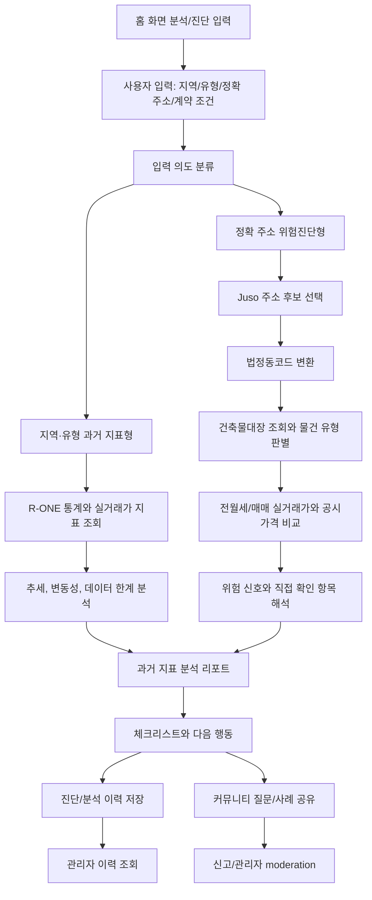

# 과거 지표 기반 부동산 분석 MVP 범위

> Status: Current MVP Baseline

이 문서는 ZIP:ON의 첫 MVP를 "현재 매물 미제공 + 과거 지표 기반 부동산 분석 + 정확 주소 위험진단"으로 고정하고, 무엇을 만들고 무엇을 만들지 않는지 정리합니다.

확장형 ZIP:ON은 주거용 매매, 상가 창업, 임야·토지 개발 가능성, 꼬마빌딩 수익성 진단까지 넓어질 수 있지만, 첫 구현 단위는 현재 매물을 보여주는 플랫폼이 아니다. MVP는 사용자가 입력한 지역·유형·정확 주소를 과거 통계와 공공데이터로 해석하고, 정확 주소가 있는 경우 계약 전 위험진단으로 이어지는 좁은 slice다.

## Goal

MVP는 완성형 부동산 플랫폼이 아니라 핵심 가치가 통하는 최소 기능 버전입니다.

```text
MVP 이름: 과거 지표 기반 부동산 분석과 정확 주소 위험진단
대표 사용자: 지역·유형의 흐름을 이해하거나 이미 본 매물을 검토하려는 부동산 초보자
대표 목적: 현재 매물 목록이 아니라 과거 지표, 데이터 한계, 계약 전 확인사항 이해하기
대표 진입점: 홈 화면 분석/진단 입력 폼
운영 포함 범위: 커뮤니티, 관리자 페이지
AI 포함 범위: 자유 대화형 챗봇은 제거, 백엔드 구조화 위험 항목 산정은 포함
```

MVP가 과거 지표 분석에 집중하는 이유는 세 가지입니다.

- 한국부동산원 R-ONE, 실거래가, 공시가격, 건축물대장처럼 공공데이터로 설명 가능한 근거가 많습니다.
- 현재 매물 재고를 구축하지 않아도 지역·유형별 가격 흐름, 전세·월세 흐름, 수익률, 공실률, 데이터 한계를 통찰력 있게 보여줄 수 있습니다.
- 정확 주소가 있는 경우에는 기존 전세·월세 계약 전 위험진단으로 자연스럽게 이어질 수 있습니다.

이후 확장은 [ZIP:ON 확장형 서비스 정의](/docs/product/EXTENSION_SERVICE_DEFINITION.md)와 [ZIP:ON 성장 로드맵](/docs/product/ROADMAP.md)의 단계 순서를 따릅니다. 새 코드가 MVP 안에서 작성되더라도 사용자 목적, 물건 정체 판별, 목적별 analyzer 분리를 염두에 두어야 합니다.

## Input And Output

사용자 입력은 처음부터 완벽할 필요가 없습니다. MVP의 사용자 입력은 홈 화면 분석/진단 입력 폼에서 지역·유형·정확 주소·계약 조건을 받습니다.

```text
지역/장소/역세권 키워드
유형 키워드: 원룸, 오피스텔, 빌라, 상가 등
정확 주소 또는 지번
보증금
월세
관리비
계약 목적
사용자가 보고 있는 매물 설명
```

정확 주소가 확정됐더라도 보증금, 월세, 관리비가 비어 있거나 일반 전월세 진단 범위를 크게 벗어난 값이면 곧바로 위험진단 결과 화면으로 보내지 않습니다. 이 경우 ZIP:ON은 "자료 없음"이나 "물건 유형 파악 불가" 같은 막힌 결과를 먼저 보여주는 대신, 해당 지번의 과거 전월세 후보를 우선 조회하고 없으면 같은 법정동의 과거 전월세 후보까지 넓혀 카드 목록으로 보여줍니다. 사용자는 후보의 보증금, 월세, 면적, 층수 값을 확인한 뒤 정확 주소 위험진단을 이어가야 합니다.

서비스 출력은 단순 조회 결과가 아니라 계약 전 판단 보조 결과여야 합니다.

```text
지역/유형 과거 지표 분석
가격지수, 전세가격지수, 월세가격지수, 수익률, 공실률 추세
지표 변동성과 데이터 한계
물건 유형 판별
전세가율 또는 월세 적정성
건축물 위험
실거래가 비교
공시가격 참고
추가 확인사항
계약 전 체크리스트
```

정확 주소 전세·월세 위험진단 결과 화면은 데이터 리포트 순서가 아니라 실제 임차인의 계약 전 판단 순서를 따른다. 사용자는 많은 숫자보다 먼저 "이 계약을 지금 멈춰서 확인해야 하는가"를 알아야 한다. 따라서 MVP 결과 화면은 아래 순서를 우선한다.

```text
1. 계약 전 판단 요약
   - 자료 기준 검토 가능 / 조건부 주의 / 계약 전 중단 검토 필요 / 판단 보류
   - 이 문구는 계약 가능 확정이 아니라 확인 우선순위다.

2. 가장 큰 위험 3개
   - 보증금·월세 안전성
   - 권리관계와 보증금 회수 가능성
   - 공적장부와 실제 현황 일치 여부

3. 확인됨 vs 주의 필요 vs 직접 확인 필요
   - 공공데이터로 확인된 항목
   - 근거는 있으나 계약 전 재확인해야 하는 항목
   - 등기부등본, 선순위 임차인, 보증보험, 현장 하자처럼 직접 확인해야 하는 항목

4. 돈 안전성
   - 전월세 실거래가, 매매 실거래가, 공시가격은 과거·공시 기준 자료로 표시한다.
   - 데이터 없음이나 표본 부족은 안전 신호가 아니라 판단 신뢰도 한계다.

5. 권리·공부·현장 확인
   - 등기부등본, 건축물대장 원본, 중개대상물 확인설명서, 현장 상태를 분리해서 표시한다.

6. 계약 전 질문과 다음 행동
   - 임대인/중개사에게 요구할 자료와 계약 전 체크리스트를 행동 문장으로 제공한다.
```

위험도와 데이터 부족도는 분리한다. `위험 높음`은 실제 근거가 위험 신호를 가리킬 때 쓰고, 자료가 부족한 경우에는 `판단 보류`, `직접 확인 필요`, `자료 상태 확인 필요`로 표현한다. ZIP:ON은 `진행 가능`, `안전 확정`, `법적 문제 없음` 같은 최종 판정 문구를 쓰지 않는다.

## MVP Scope

MVP에서 하는 일은 아래와 같습니다.

- 홈 화면 기반 분석/진단 입력 폼
- 현재 매물 목록 미제공 원칙 유지
- 지역·유형 입력 의도 분류
- 한국부동산원 R-ONE 통계 기반 가격지수, 전세·월세 지표, 오피스텔 수익률, 상가 공실률 분석
- 실거래가와 공시가격 기반 과거 지표 보조 분석
- 정확 주소형 입력의 주소 후보 선택
- 주소 정제
- 법정동코드 변환
- 건축물대장 기반 물건 유형 판별
- 아파트, 오피스텔, 다세대, 다가구 구분 보조
- 주변 전월세 실거래가 비교
- 주변 매매 실거래가 비교
- 공시가격 참고
- 보증금 위험도 1차 계산
- 건축물대장 주용도 불일치와 노후도 자동 안내
- 위반건축물 여부 원본 확인 안내
- 관리비 또는 생활 인프라 보조 분석
- 등기부등본 업로드 요청 또는 수동 확인 상태 기록 확장 지점 마련
- 계약 전 체크리스트 제공
- 위험진단 이후 질문과 경험을 공유하는 커뮤니티
- 게시글, 댓글, 대댓글, 좋아요, 신고, 첨부파일, 작성 권한 제어
- 신고 검토, 게시글/댓글 숨김·복구, 사용자/권한/진단 이력 관리를 위한 관리자 페이지

MVP에서 하지 않는 일은 아래와 같습니다.

- 실시간 매물 크롤링
- 현재 매물 목록 제공
- 지도 기반 현재 매물 탐색
- `강남 원룸`, `서울대입구역 근처` 같은 입력을 현재 매물 feed로 해석하기
- 공인중개사 매칭
- 계약 체결 대행
- 법적 권리관계 확정 판정
- 선순위 임차인 자동 조회
- AI를 전세사기, 보증보험 가능성, 등기 권리관계, 계약 가능 여부의 최종 판정자로 사용
- 매수/매도 투자 수익률 정밀 예측
- 상가 창업 성공 가능성 확정
- 관리자 페이지를 임의 SQL 실행기나 DB 직접 편집기로 제공
- 커뮤니티를 위험진단과 무관한 범용 게시판 포털로 확장

지역·유형 검색어는 현재 매물 목록이 아니라 과거 지표 분석으로 처리합니다. 예를 들어 `강남 원룸`은 강남구 원룸 현재 매물을 나열하는 기능이 아니라, 공부상 후보 유형인 오피스텔·연립/다세대·단독/다가구와 관련된 전세·월세·가격지수·실거래 흐름을 해석하는 기능으로 봅니다.

## Request Flow



## Risk Sentence Examples

전세 목적의 결과 문장은 아래처럼 사용자가 이해할 수 있는 말이어야 합니다.

```text
전세 위험도: 높음

이 물건은 다가구주택으로 추정됩니다.
다가구주택은 건물 전체 선순위 임차인 보증금을 함께 확인해야 합니다.
입력한 보증금은 주변 전월세 거래와 비교했을 때 과도하지 않을 수 있지만,
매매 추정가 대비 전세가율과 등기부 권리관계 확인이 필요합니다.
```

계약 전 체크리스트는 행동 중심으로 내려줍니다.

```text
1. 등기부등본 갑구·을구 확인
2. 근저당권 채권최고액 확인
3. 선순위 임차인 보증금 내역 요청
4. 전세보증보험 가입 가능 여부 확인
5. 건축물대장상 주용도, 사용승인일, 위반건축물 여부 확인
6. 계약금 입금 계좌가 소유자 명의인지 확인
```

## Implementation Direction

현재 저장소는 홈 화면 분석/진단 입력 폼에서 두 갈래를 구현했습니다. 정확 주소와 계약 조건이 있는 입력은 정확 주소 위험진단으로 이어지고, `강남 원룸`, `서울대입구역 근처`, `상가 월세` 같은 지역·유형 입력은 현재 매물 목록이 아니라 지역·유형 과거 지표 분석 첫 slice로 이어집니다.

```text
공통 진입:
frontend/src/components/common/SearchBar.vue
frontend/src/components/home/MainHero.vue

정확 주소 위험진단:
-> rentRiskDiagnosisApi.js
-> POST /api/rent-risk-diagnoses
-> RentRiskDiagnosisController
-> RentRiskDiagnosisService
-> LeaseRiskAddressNormalizer
-> BuildingRegisterApiClient
-> BuildingTypeResolver
-> BuildingRiskAnalyzer
-> TransactionApiSelector
-> RentTransactionApiClient
-> RentRiskDiagnosisResponse

지역·유형 과거 지표 분석:
-> frontend/src/api/regionalIndicatorAnalysisApi.js
-> frontend/src/views/SearchResultView.vue
-> POST /api/regional-indicator-analyses
-> RegionalIndicatorAnalysisController
-> RegionalIndicatorAnalysisService
-> RegionalIndicatorAnalysisMapper
-> MarketIndicatorContextService
-> RegionalIndicatorAnalysisResponse
```

현재 `SearchBar.vue`의 위험진단 mode가 주소, 계약 목적, 보증금, 월세, 관리비, 사용자가 보는 매물 유형, 매물 설명을 수집합니다. `MainHero.vue`는 이 입력 폼으로 이동시키며, 전역 위험진단 입력 폼과 채팅 세션 관리는 제거되었습니다.

위험진단 mode의 기본 UX는 "검색 결과"가 아니라 "분석 기준 확인"입니다. `SearchBar.vue`는 지역·유형 입력을 `/search`의 과거 지표 분석으로 보내고, `SearchResultView.vue`가 `POST /api/regional-indicator-analyses`를 호출해 R-ONE/market indicator/지역 통계 상태를 보여줍니다. 정확 주소 입력은 Juso 주소 후보 또는 과거 전월세 후보 선택으로 이어지게 합니다. 계약 금액이 비어 있거나 비현실적으로 큰 값이면 `POST /api/rent-risk-diagnoses`를 바로 호출하지 않고 `POST /api/rent-risk-diagnoses/address-candidates` 후보 목록을 먼저 엽니다.

자유 대화형 AI 설명 보조는 현재 MVP 범위에서 제거되었습니다. 백엔드는 Spring AI 의존성, `com.zipon.ai` 패키지, 기존 prompt/guardrail, `RentRiskDiagnosisResponse.aiNarration` 응답 섹션을 사용하지 않습니다.

대신 MVP는 백엔드 내부의 구조화된 위험 항목 산정을 사용합니다. `RiskAssessmentService`는 `RentRiskDiagnosisService`가 만든 core response를 `NormalizedRiskInput`으로 정규화하고, `RiskTemplateResolver`가 고정한 `LEASE_RENT_RISK` 12개 항목을 산정합니다. OpenAI가 켜져 있으면 `HttpOpenAiRiskScoringClient`가 Responses API structured output을 호출하고, `RiskScoringResponseValidator`가 JSON을 검증합니다. 최종 `totalRiskScore`, `riskGrade`, `displayVerdict`, `uncertaintyPenalty`는 AI가 아니라 `RiskScoreAggregator`와 `RiskGradeCalculator`가 계산합니다. OpenAI가 꺼져 있거나 실패하면 `RiskScoringFallbackService`가 항목별 fallback 결과를 내려 진단 전체가 실패하지 않게 합니다.

지역·유형 과거 지표 분석 slice가 하는 일:

```text
- 지역/장소/역세권 키워드와 유형 힌트를 현재 매물 검색이 아닌 분석 의도로 해석
- `RegionalIndicatorAnalysisRequest`를 통해 locationKeyword, propertyTypeHint, contractPurpose, budgetRange를 수집
- `RegionalIndicatorAnalysisService`에서 공부상 후보 유형, R-ONE 상태, market indicator summary, 데이터 한계 문장을 구성
- `RegionalIndicatorAnalysisMapper`와 `MarketIndicatorContextService`로 저장된 R-ONE/market indicator 데이터를 조회
- `SearchResultView.vue`에서 현재 매물 목록 대신 지표 상태, 후보 유형, 확인 필요 항목을 표시
- 데이터가 부족하면 안전함이 아니라 `데이터 부족`, `정확 주소 필요`, `현재 매물 미제공` 경계로 표시
```

정확 주소 위험진단 slice가 하는 일:

```text
- 지번 주소 정제
- 법정동코드와 시군구코드 반환
- 건축물대장 표제부 기반 물건 유형 판별
- 건축물대장 유형이 확정된 경우에만 실거래가 API 후보 선택
- 선택된 전월세 실거래가 API를 최근 완료월부터 최대 3개월까지 순차 조회하고, 거래가 있는 달의 snapshot을 기존 프론트 응답 구조에 집계 표시
- 선택된 매매 실거래가 API를 최근 완료월부터 최대 3개월까지 순차 조회하고, 거래가 있는 달의 snapshot을 기존 프론트 응답 구조에 집계 표시
- 전월세 실거래가 대표 보증금 대비 입력 보증금 비율을 `riskSummary.reasons`에 표시
- 월세 계약이면 전월세 실거래가 월세 대표값 대비 입력 월세 비율을 `riskSummary.reasons`에 표시
- 월세 계약이면 입력 월세와 관리비를 합산한 월 고정 주거비를 `riskSummary.reasons`에 표시
- 매매 실거래가 대표값 대비 입력 보증금 비율을 `riskSummary.reasons`에 표시
- 공시가격 대표값 대비 입력 보증금 비율을 `riskSummary.reasons`에 표시
- 건축물대장 주용도와 사용승인일 기반으로 주거 목적 불일치 가능성과 노후도 안내를 `riskSummary.reasons`, `checklist`, `nextActions`에 표시
- 건축물대장 미조회/결과 없음/다중 후보/오류를 안전함이 아닌 제한 진단 상태로 표시
- 공시가격 key 미설정/결과 없음/오류, 위반건축물 여부 원본 확인, 등기부등본 미연동 항목을 unavailable/empty 또는 사용자 확인 필요 항목으로 분리
- "추가 확인 필요" 또는 "데이터 부족" 중심의 위험 문장 생성
- 계약 전 체크리스트 생성
- 관리비 총액, 포함 항목, 별도 부과 항목 확인 체크리스트 생성
- 진단 요청과 응답 snapshot 저장
- 로그인 사용자의 본인 진단 이력에 대한 등기부등본 수동 확인 상태 조회/저장
- 관리자 전용 진단 이력 조회 API 제공
```

아직 완성된 위험진단 엔진은 아닙니다. 건축물대장 후보 선택 UI, 보증금-월세 환산/총 주거비 정교화, 관리비 원본 데이터 자동 분석, 공시가격 동·호 정밀 매칭, 위반건축물 여부 원본 필드 자동 판정은 MVP 잔여 구현입니다. 등기부등본 원본 PDF 업로드/OCR 분석은 저장소·보존·보안 정책이 확정된 뒤 붙일 별도 후속 slice입니다. 다음 기능을 붙일 때도 새 도메인을 한 번에 크게 만들지 말고 아래 순서로 작게 붙입니다.

```text
1. Request DTO: 사용자의 주소, 금액, 목적 입력을 명확히 받는다.
2. Controller: HTTP 요청/응답만 담당한다.
3. Service: 주소 정제, 물건 유형 판별, 위험도 계산 순서를 드러낸다.
4. Mapper: MyBatis로 저장 데이터나 캐시 데이터를 조회한다.
5. Response DTO: 위험 문장과 체크리스트를 화면에 필요한 형태로 내려준다.
6. Tests: 정상 입력, 불완전한 주소, 판별 실패, 위험도 계산 경계값을 검증한다.
```

현재 구현된 핵심 이름은 제품 언어를 그대로 반영합니다.

```text
RentRiskDiagnosisRequest
RentRiskDiagnosisResponse
LeaseContractPurposeProfile
RentRiskDiagnosisService
RentRiskDiagnosisController
RentRiskDiagnosisHistoryService
RentRiskDiagnosisHistoryMapper
AdminRentRiskDiagnosisHistoryController
RegistryDocumentConfirmationService
RegistryDocumentConfirmationMapper
RegistryDocumentConfirmationRequest
RegistryDocumentConfirmationResponse
BuildingRegisterApiClient
BuildingTypeResolver
BuildingRiskAnalyzer
BuildingRiskAssessment
TransactionApiSelector
RentTransactionApiClient
SaleTransactionApiClient
PublicPriceApiClient
DepositRiskCalculator
ChecklistItemResponse (RentRiskDiagnosisResponse 내부 record)
```

건축물대장 기반 물건 정체 판별은 현재 `RentRiskDiagnosisService`가 orchestration하고, 실제 HTTP 경계는 `BuildingRegisterApiClient`, `RentTransactionApiClient`, `SaleTransactionApiClient`, `PublicPriceApiClient` 구현체가 담당합니다. 전월세 실거래가 대표 보증금 대비 입력 보증금 비율, 월세 계약의 전월세 실거래가 월세 대표값 대비 입력 월세 비율, 매매 실거래가 대표값 대비 보증금 비율, 공시가격 대표값 대비 보증금 비율 문장은 `DepositRiskCalculator`가 담당합니다. 건축물대장 주용도 불일치와 노후도 안내는 `BuildingRiskAnalyzer`가 `BuildingRiskAssessment`로 분리해 만든 뒤 `riskSummary`, `checklist`, `nextActions`에 합칩니다. 진단 이력 저장과 관리자 조회는 `RentRiskDiagnosisHistoryService`, `RentRiskDiagnosisHistoryMapper`, `AdminRentRiskDiagnosisHistoryController`가 맡습니다. 등기부등본 수동 확인 상태는 `RegistryDocumentConfirmationService`가 본인 진단 이력인지 확인한 뒤 `RegistryDocumentConfirmationMapper`로 `registry_document_confirmations`에 저장합니다. 거래 유사도 필터링, 공시가격 정밀 매칭까지 붙으면 `PropertyIdentificationService`, `TransactionComparisonService`, `PublicPriceLookupService` 같은 더 작은 협력 객체로 더 나눌지 다시 판단합니다.

`LeaseContractPurposeProfile`은 전세·월세 목적별 입력 금액 규칙과 표시 라벨을 모아둔 작은 도메인 객체입니다. 현재는 `RentRiskDiagnosisService`가 이 profile을 사용해 보증금·월세 필수 여부, 위험도 제목, 월세 비교 여부를 판단합니다. 이후 매매·상가·토지 같은 목적을 붙일 때도 목적별 규칙을 service 내부 if-else로 흩뿌리기 전에 profile 또는 목적별 analyzer로 먼저 분리해야 합니다.

## Debugging Checklist

- 사용자가 입력한 주소가 도로명주소인지 지번주소인지 확인했는가?
- 법정동코드, 시군구코드, 본번, 부번이 분리되는가?
- 건축물대장 조회 실패를 "안전"으로 오해하지 않는가?
- 주용도 불일치와 노후도는 자동 안내하되, 위반건축물 여부를 자동 확정처럼 쓰지 않는가?
- 다가구와 다세대를 같은 위험 모델로 처리하지 않는가?
- 실거래가는 과거 계약 데이터라는 한계를 응답에 반영했는가?
- 등기부등본, 선순위 임차인, 실제 하자는 자동 확정하지 않는가?
- 등기부등본 확인 상태가 없거나 `NOT_CHECKED`일 때 안전함으로 표시하지 않는가?
- 체크리스트가 사용자의 다음 행동으로 이어지는가?

## Design Tradeoffs

MVP를 과거 지표 분석과 정확 주소 위험진단에 집중하면 현재 매물 탐색 기능은 제공하지 않습니다. 대신 ZIP:ON의 차별점인 "공공데이터와 과거 지표를 통찰력 있게 해석하는 판단 보조"를 가장 빨리 검증할 수 있습니다.

MVP에서 등기부등본 자동 판정을 하지 않으면 완전 자동 서비스처럼 보이지 않을 수 있습니다. 하지만 권리관계는 잘못 확정하면 위험하므로, 초기에는 확인 상태 기록과 체크리스트로 분리하는 편이 안전합니다. 원본 PDF 업로드/OCR은 S3/object storage, 암호화, 보존 기간, 삭제 정책이 정해진 뒤 별도 흐름으로 붙입니다.

홈 화면 입력 폼을 선택하면 챗봇 상태 관리 없이 지역·유형·주소와 계약 조건을 명확한 폼 경계에서 검증할 수 있습니다. 대신 화면이 현재 매물 검색처럼 보이지 않도록 문구와 결과 표시를 과거 지표 분석과 계약 전 위험진단 중심으로 유지해야 합니다.

커뮤니티와 관리자 페이지를 MVP에 포함하면 운영 가능한 서비스의 형태를 더 빨리 검증할 수 있습니다. 대신 커뮤니티를 범용 게시판으로 키우거나 관리자 페이지를 DB 콘솔처럼 만들면 위험진단 MVP의 초점이 흐려지므로, 진단 이후 질문/사례와 제한된 운영 API로 범위를 고정합니다.

## Related Documents

- [ZIP:ON 제품 기준과 서비스 경계](/docs/product/PRODUCT_OVERVIEW.md)
- [ZIP:ON 확장형 서비스 정의](/docs/product/EXTENSION_SERVICE_DEFINITION.md)
- [공공데이터 API 연동 전략](/docs/api/PUBLIC_API_STRATEGY.md)
- [ZIP:ON 성장 로드맵](/docs/product/ROADMAP.md)
- [CODEX reference index](../README.md)

## Learning Path

1. First read: `MVP Scope`, `Request Flow`, `Design Tradeoffs`
2. Then inspect: [공공데이터 API 연동 전략](/docs/api/PUBLIC_API_STRATEGY.md)의 1순위 필수 코어 API
3. Then run: 현재 backend/frontend 실행은 루트 `README.md` 참고
4. Then debug: `Debugging Checklist`로 자동 판정하면 안 되는 영역을 분리
5. Key concept to understand: MVP는 기능을 작게 만드는 것이 아니라 검증할 가치를 선명하게 고르는 것
