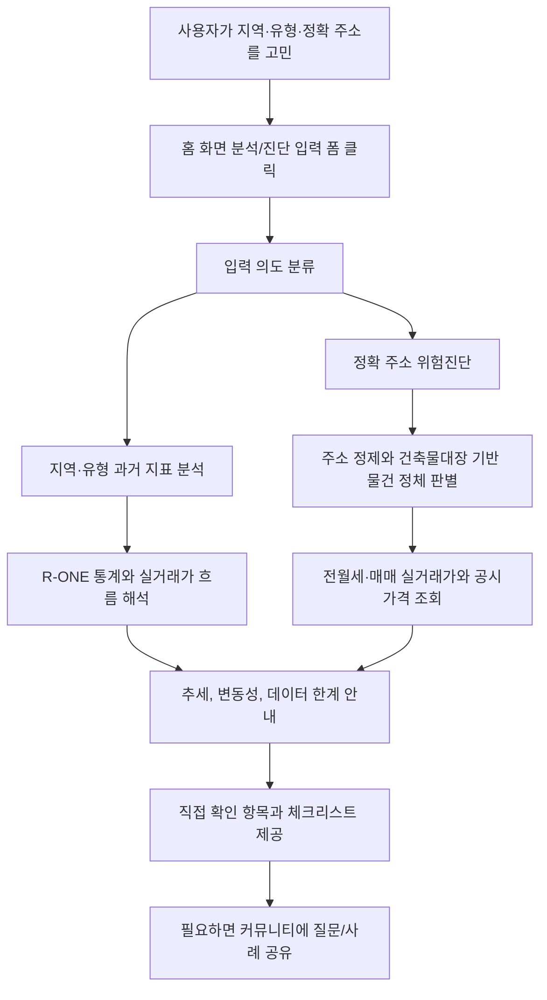

# ZIP:ON 페르소나와 대표 시나리오

> Status: Implemented + Guidance

## 목적

이 문서는 ZIP:ON MVP를 구현할 때 가장 먼저 떠올려야 하는 사용자를 정의한다. 제품 문서가 길어질수록 "지도/매물 목록/인기 매물"로 중심이 흔들리기 쉬우므로, 현재 매물 미제공과 과거 지표 분석 중심의 대표 페르소나와 사용자 흐름을 별도 문서로 고정한다.

## 대표 페르소나

### 과거 지표를 해석하고 싶은 부동산 초보자

- `강남 원룸`, `서울대입구역 근처`, `상가 월세`처럼 지역·유형·장소 기반 질문을 한다.
- 현재 매물 목록보다 과거 전세·월세 흐름, 가격지수, 수익률, 공실률, 데이터 한계를 알고 싶어 한다.
- 전세 또는 월세 계약 경험이 적고, 이미 본 원룸, 오피스텔, 빌라를 계약해도 되는지 불안해한다.
- 다가구주택과 다세대주택의 차이를 잘 모른다.
- 등기부등본, 선순위 임차인, 전세보증보험, 위반건축물 같은 말을 들어도 무엇을 확인해야 하는지 모른다.
- 원하는 것은 최종 판정이 아니라 계약 전 놓치면 안 되는 확인 목록이다.

## 대표 사용자 흐름

## 화면 진입 원칙

- MVP 진입점은 홈 화면 분석/진단 입력 폼이다.
- 큰 검색창, 지도, 인기매물, 현재 매물 목록은 MVP core 진입점이 아니다.
- ZIP:ON은 현재 매물을 보여주지 않는다.
- 지역·유형 입력은 현재 매물 검색이 아니라 과거 지표 분석으로 처리한다.
- 사용자가 이미 보고 있는 물건을 진단하는 흐름을 먼저 완성한다.
- 프론트엔드는 API 원문을 나열하지 않고 "근거 -> 한계 -> 다음 행동"으로 보여준다.

## 확인해야 하는 말투

| 피할 표현 | 사용할 표현 |
| --- | --- |
| 안전합니다 | 현재 데이터만으로 안전 판단은 어렵습니다 |
| 위험합니다 | 위험 가능성이 있어 추가 확인이 필요합니다 |
| 계약하지 마세요 | 계약 전 다음 항목을 먼저 확인하세요 |
| 보증금 회수 가능합니다 | 보증금 회수 가능성은 등기부등본과 선순위 임차인 정보 확인이 필요합니다 |
| 권리관계 확인 완료 | 권리관계는 등기부등본 확인이 필요합니다 |

## Related documents

- [제품 개요](PRODUCT_OVERVIEW.md)
- [MVP 범위](MVP_SCOPE.md)
- [확장형 서비스 정의](EXTENSION_SERVICE_DEFINITION.md)
- [분석 화면 정책](/docs/frontend/SCREEN_ANALYSIS_POLICY.md)
