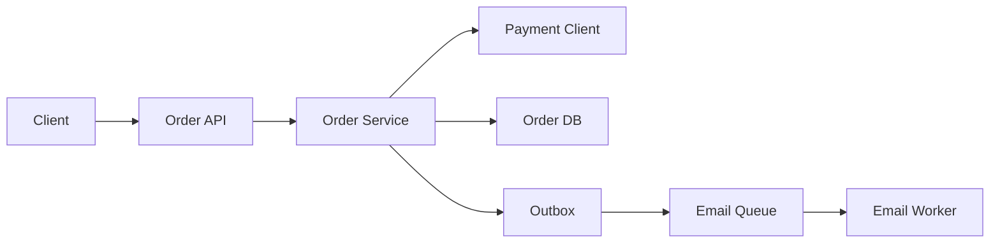

>[!success] 이 문서를 통해 아래 질문들에 답할 수 있게 됩니다.
>- 기능 요구사항을 API, 상태, 트래픽, 장애 경계로 어떻게 바꾸는가?
>- 동기 처리와 비동기 처리를 나누는 기준은 무엇인가?
>- 요구사항 번역은 성능, 정합성, 장애 격리, 운영 복잡도를 어떻게 바꾸는가?

## 개요

System Design의 첫 단계는 구조도를 그리는 것이 아니라 요구사항을 분해하는 것이다.

"주문 기능을 만든다"라는 문장은 설계 입력으로 너무 거칠다.

백엔드 개발자는 이 문장을 쓰기 API, 읽기 API, 데이터 불변식, 외부 의존성, 트래픽, 실패 응답으로 바꿔야 한다.

이 번역을 건너뛰면 cache, queue, DB, replica 같은 선택이 근거 없는 기술 나열이 된다.

## 요구사항을 쪼개는 순서

먼저 사용자에게 보이는 결과를 적는다.

- 사용자는 주문을 생성한다.
- 사용자는 주문 완료 여부를 즉시 알아야 한다.
- 사용자는 주문 목록에서 방금 만든 주문을 볼 수 있어야 한다.
- 운영자는 주문 실패와 결제 실패를 구분해 추적해야 한다.
- 이메일 발송은 늦어져도 주문 생성 성공을 막지 않아야 한다.

이 문장들은 곧 구조 선택으로 이어진다.

주문 저장과 결제 승인은 동기 핵심 경로에 가깝다.

이메일 발송과 분석 로그는 비동기 후속 경로로 분리할 수 있다.

내 주문 목록은 read-after-write 요구가 있으므로 cache나 read model을 쓸 때 주의해야 한다.

## 구조로 번역하는 표

| 요구사항 문장 | 설계 질문 | 구조 결정 |
| --- | --- | --- |
| 주문 완료를 즉시 알려야 한다 | 무엇이 성공의 기준인가? | 주문 row commit과 결제 승인 결과를 동기 응답에 포함 |
| 이메일은 늦어도 된다 | 사용자 응답 전에 필요한가? | queue로 분리하고 실패 재처리 |
| 같은 요청이 두 번 올 수 있다 | 중복 실행되면 무엇이 깨지는가? | idempotency key와 unique constraint |
| 주문 목록은 즉시 보여야 한다 | read-after-write가 필요한가? | 내 주문은 write DB 또는 command 결과 병합 |
| 결제사는 가끔 느리다 | 외부 장애가 어디까지 번지는가? | timeout, retry 제한, circuit breaker |
| 운영자가 원인을 알아야 한다 | 어떤 지표가 필요한가? | order status, payment status, failure reason 분리 |

이 표를 만들면 컴포넌트가 요구사항에서 나온다.

반대로 표 없이 구조부터 그리면 나중에 사용자가 기대한 성공 기준과 설계가 어긋난다.

## 기준 시나리오

```text
주문 생성 peak = 300 TPS
주문 상세 조회 peak = 2,000 QPS
결제 승인 p95 = 800ms
결제 승인 timeout = 2s
이메일 발송 허용 지연 = 5m
주문 목록 read-after-write 허용 지연 = 1s
```

이 숫자에서 바로 보이는 결정이 있다.

주문 생성은 결제 승인 때문에 느려질 수 있으므로 timeout과 실패 상태가 필요하다.

상세 조회는 주문 생성보다 훨씬 많으므로 index, cache, read replica 후보가 된다.

이메일은 주문 성공의 조건이 아니므로 queue와 retry 대상으로 분리한다.

주문 목록은 사용자 신뢰에 직접 닿으므로 stale cache를 그대로 쓰면 안 된다.

## 흐름 예시



이 그림의 핵심은 컴포넌트 수가 아니다.

주문 저장과 결제 승인은 사용자 응답의 일부이고, 이메일 발송은 outbox 이후 비동기 작업이라는 경계가 중요하다.

이 경계가 성능과 장애 격리를 바꾼다.

사용자 응답은 빨라질 수 있지만, 이메일은 중복 발송과 재처리 문제가 생긴다.

## API 계약 예시

동기 핵심 경로와 비동기 후속 경로를 응답에 드러낸다.

```json
{
  "orderId": "ord-1001",
  "orderStatus": "CONFIRMED",
  "paymentStatus": "APPROVED",
  "emailStatus": "PENDING",
  "createdAt": "2026-07-01T10:15:00+09:00"
}
```

이 응답은 "이메일까지 완료됐다"를 약속하지 않는다.

사용자가 주문 성공을 확인하는 데 필요한 정보와 나중에 처리될 정보를 분리한다.

## Spring 경계 예시

서비스 계층은 트랜잭션과 outbox 기록의 경계를 잡는다.

```java
@Transactional
public OrderResult create(CreateOrderCommand command) {
    IdempotencyKey key = idempotencyService.reserve(command.requestId());
    PaymentResult payment = paymentClient.approve(command.payment());

    Order order = orderRepository.save(Order.confirmed(command, payment));
    outboxRepository.save(OutboxMessage.emailRequested(order.id(), key.value()));

    return OrderResult.confirmed(order.id(), payment.status(), EmailStatus.PENDING);
}
```

이 코드는 완성 예제가 아니라 책임 위치를 보여준다.

결제 승인이 주문 성공의 일부라면 timeout과 실패 상태가 명확해야 한다.

이메일 발송이 후속 작업이라면 같은 트랜잭션에서 발송하지 않고 재처리 가능한 기록을 남긴다.

## 설계 축의 변화

요구사항을 구조로 번역하면 다음 축이 바뀐다.

| 결정 | 성능 | 정합성 | 장애 격리 | 운영 복잡도 |
| --- | --- | --- | --- | --- |
| 이메일 queue 분리 | 응답 지연 감소 | 발송은 지연 가능 | 이메일 장애가 주문을 막지 않음 | retry, DLQ 필요 |
| 주문 목록 cache | 조회 지연 감소 | stale 가능 | DB 읽기 부하 감소 | invalidation 필요 |
| 결제 timeout | 지연 상한 설정 | 결제 상태 관리 필요 | 외부 지연 전파 제한 | 실패 원인 추적 필요 |
| idempotency key | 중복 부하 감소 | 중복 주문 방지 | retry 안전성 증가 | key 저장소 필요 |

설계 리뷰에서는 이 표가 기술 선택보다 중요하다.

무엇을 얻고 무엇을 새로 운영해야 하는지 드러내기 때문이다.

## 위험 신호

- 기능 목록만 있고 성공, 지연, 실패 상태가 없다.
- 모든 후속 작업을 사용자 응답 전에 처리한다.
- 외부 API 실패가 주문 상태에 어떻게 남는지 정의하지 않는다.
- read-after-write가 필요한 화면을 cache 뒤에 숨긴다.
- 중복 요청과 retry를 고려하지 않고 "한 번만 호출된다"고 가정한다.
- 운영자가 장애 원인을 구분할 상태값과 로그가 없다.

## 개인 프로젝트 기준

개인 프로젝트에서는 모든 컴포넌트를 실제로 나눌 필요는 없다.

대신 다음 근거는 남긴다.

- 동기 처리와 비동기 처리로 나눈 이유
- 생략한 cache, queue, retry의 전환 조건
- 실패 재현 방법
- 핵심 로그와 상태값

포트폴리오에서는 "queue를 썼다"보다 "주문 성공과 이메일 성공을 다른 사용자 결과로 봤다"가 더 강한 설명이다.

## 기업 운영 기준

기업 운영에서는 요구사항 번역이 runbook과 지표까지 이어져야 한다.

- 주문 생성 p95와 결제 승인 p95를 분리한다.
- 이메일 queue age와 DLQ count를 본다.
- idempotency conflict count를 본다.
- 결제 실패, timeout, 거절을 다른 상태로 남긴다.
- 배포 중 old/new 응답 계약이 호환되는지 확인한다.

## 확인 질문

- 확인 질문: 요구사항에서 가장 먼저 구조로 바꿔야 하는 것은 무엇인가?
	- 답변: 사용자가 성공으로 보는 결과와 지연되어도 되는 후속 작업을 분리하는 것이다.
- 확인 질문: 이메일 발송을 queue로 분리하면 어떤 축이 바뀌는가?
	- 답변: 사용자 응답 성능과 장애 격리는 좋아지지만, 발송 정합성은 지연되고 retry와 DLQ 운영 복잡도가 생긴다.
- 확인 질문: 구조도를 그리기 전에 요구사항 표가 필요한 이유는 무엇인가?
	- 답변: 컴포넌트가 어떤 요구사항 때문에 필요한지, 없으면 무엇이 깨지는지 검증할 수 있기 때문이다.

## 참고 문서

- [AWS Architecture Center](https://aws.amazon.com/architecture/)
- [Microsoft Azure Architecture Center](https://learn.microsoft.com/azure/architecture/)
- [Google SRE Book, Service Level Objectives](https://sre.google/sre-book/service-level-objectives/)
- [Martin Fowler, Patterns of Distributed Systems](https://martinfowler.com/articles/patterns-of-distributed-systems/)
