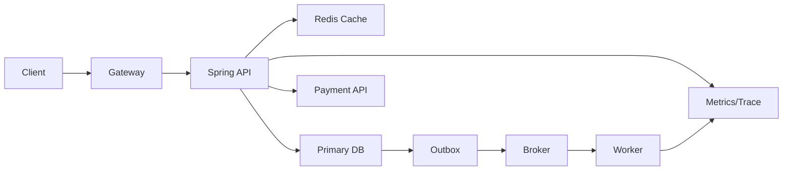

>[!success] 이 문서를 통해 아래 질문들에 답할 수 있게 됩니다.
>- Gateway, Spring App, DB, Cache, Queue, 외부 API는 각각 무엇을 책임지는가?
>- 컴포넌트를 추가할 때 어떤 성능 이득과 운영 비용이 생기는가?
>- 백엔드 구성 요소의 경계가 장애 격리와 정합성을 어떻게 바꾸는가?

## 개요

백엔드 시스템 구성 요소를 외울 때 가장 흔한 실수는 역할을 "기술 이름"으로 기억하는 것이다.

Redis는 빠른 저장소가 아니라 어떤 읽기 경로를 흡수하고 어떤 stale 위험을 만드는 컴포넌트다.

Queue는 비동기 도구가 아니라 사용자 응답 경로와 후속 처리 경로를 나누는 컴포넌트다.

DB는 단순 저장소가 아니라 최종 진실, 제약, 트랜잭션, 복구의 중심이다.

구성 요소 지도는 각 컴포넌트가 어떤 비용과 실패를 맡는지 정리하는 문서다.

## 구성 요소별 책임

| 구성 요소 | 주 책임 | 잘못 맡기면 생기는 문제 |
| --- | --- | --- |
| API Gateway/LB | 진입 제어, 라우팅, TLS 종료, coarse limit | 비즈니스 상태 판단이 섞임 |
| Spring API | API 계약, 인증 후 권한, 유스케이스 조립 | DB와 외부 API 실패를 숨김 |
| Domain Service | 불변식, 상태 전이, 트랜잭션 경계 | 단순 CRUD로 흐르고 정합성 누락 |
| DB | 최종 진실, 제약, 트랜잭션, 영속 상태 | 캐시나 검색 인덱스가 원본처럼 사용됨 |
| Cache | 반복 읽기 지연 감소, hot read 완화 | stale data와 invalidation 장애 |
| Queue/Broker | 후속 작업 분리, buffering, 재처리 | 중복 처리, 순서, DLQ 운영 |
| External API Client | timeout, retry, fallback, circuit 정책 | 외부 지연이 내부 장애로 전파 |
| Observability | 증거, 지표, 추적, 알림 | 장애 원인을 추측으로만 판단 |

이 표는 컴포넌트의 존재 이유를 설명한다.

구조도에는 반드시 이 책임이 같이 있어야 한다.

## 기준 시나리오

상품 상세 페이지와 주문 생성 API를 함께 설계한다고 하자.

상품 상세은 읽기 요청이 많고 약간 오래된 값도 허용된다.

주문 생성은 재고와 결제 상태의 정합성이 중요하다.

리뷰 집계와 추천 로그는 늦게 반영되어도 된다.

이 요구를 한 경로에 넣으면 읽기 최적화와 쓰기 정합성이 충돌한다.

## 구성 흐름



상품 상세 조회는 Redis를 먼저 볼 수 있다.

주문 생성은 Primary DB와 결제 API를 핵심 경로로 둔다.

추천 로그와 이메일은 Outbox와 Broker 뒤로 보낸다.

Observability는 모든 경로에 붙어야 장애 때 경계를 확인할 수 있다.

## 컴포넌트 추가 판단

컴포넌트를 추가할 때는 "무엇을 덜어내는가"와 "무엇을 새로 운영하는가"를 같이 적는다.

| 추가 컴포넌트 | 덜어내는 부담 | 새로 생기는 부담 |
| --- | --- | --- |
| Redis Cache | DB read QPS, p95 latency | TTL, invalidation, memory, stale UX |
| Broker | 사용자 응답 시간, 외부 작업 결합 | retry, DLQ, ordering, idempotency |
| Read Replica | primary read 부하 | replica lag, read routing, failover |
| Search Engine | DB like 검색과 정렬 | indexing lag, 재색인, schema mapping |
| Object Storage | DB binary 저장 부담 | URL 권한, lifecycle, consistency |
| Circuit Breaker | 외부 장애 전파 | fallback 품질, threshold 튜닝 |

이 선택들은 성능을 개선할 수 있지만 정합성과 운영 복잡도를 바꾼다.

컴포넌트가 늘면 장애 격리는 좋아질 수 있지만 원인 추적 경로도 늘어난다.

## API와 저장소 경계

Spring 코드에서는 구성 요소의 책임이 client와 repository 경계로 드러나야 한다.

```java
public ProductDetail getProduct(Long productId) {
    return cache.get(productKey(productId))
        .orElseGet(() -> {
            ProductDetail detail = productReadRepository.findDetail(productId);
            cache.put(productKey(productId), detail, Duration.ofMinutes(3));
            return detail;
        });
}
```

이 코드는 상품 상세 조회에만 적합하다.

재고 차감 같은 쓰기 불변식에 같은 cache-first 사고를 적용하면 정합성이 깨진다.

외부 API도 별도 client로 격리한다.

```java
public PaymentResult approve(PaymentCommand command) {
    return paymentGateway.approve(command, Timeout.ofMillis(1500));
}
```

Service가 외부 장애 정책을 모른 척하면 timeout, retry, fallback이 흩어진다.

## 상태 owner

컴포넌트를 나눌수록 상태 owner를 명확히 해야 한다.

- 상품 가격의 원본은 DB다.
- 상품 상세 cache는 파생 데이터다.
- 검색 인덱스는 조회용 사본이다.
- 주문 상태의 원본은 주문 DB다.
- 결제 승인 결과는 결제사 응답과 내부 주문 상태가 함께 해석한다.
- 이메일 발송 상태는 worker 처리 결과로 남긴다.

owner가 불명확하면 장애 때 "어느 값이 맞는가"를 판단할 수 없다.

특히 cache와 read model을 원본처럼 쓰는 순간 정합성 문제가 운영 사고로 커진다.

## 장애 격리 관점

구성 요소는 성능만이 아니라 장애 경계를 만든다.

Redis 장애 때 상품 상세을 DB fallback으로 열 것인지, 일부 응답을 degraded로 줄 것인지 정해야 한다.

Broker 장애 때 주문 생성은 계속 받을 것인지, 후속 작업 접수를 막을 것인지 정해야 한다.

Payment API 지연 때 전체 Tomcat thread가 막히지 않도록 timeout과 bulkhead가 필요하다.

이 판단은 컴포넌트 선택과 함께 문서에 있어야 한다.

## 위험 신호

- Redis를 "빠른 DB"처럼 사용한다.
- Queue에 넣으면 자동으로 안정적이라고 생각한다.
- DB, cache, search index 중 어느 값이 원본인지 설명하지 못한다.
- 외부 API client에 timeout과 실패 분류가 없다.
- Observability를 마지막에 붙일 부가 기능으로 본다.
- 구조도에는 컴포넌트가 많지만 장애 때 끊을 경계가 없다.

## 개인 프로젝트 기준

개인 프로젝트에서는 구성 요소를 줄여도 된다.

단일 Spring App과 DB로 시작하더라도 다음은 남긴다.

- cache를 생략한 이유와 도입 조건
- queue를 생략한 이유와 비동기 전환 조건
- 외부 API timeout 값
- 핵심 로그와 correlation id
- DB가 원본이고 cache/search가 파생이라는 설명

## 기업 운영 기준

기업 운영에서는 컴포넌트별 owner와 지표가 필요하다.

- Gateway: request count, reject count, 4xx/5xx
- Spring API: p95 latency, error rate, thread pool, connection pool
- DB: slow query, lock wait, replication lag
- Cache: hit ratio, memory, eviction, timeout
- Broker: publish rate, consumer lag, DLQ count
- External API: timeout, failure rate, circuit state

이 지표가 없으면 구성 요소를 늘려도 장애 격리를 증명할 수 없다.

## 확인 질문

- 확인 질문: 백엔드 구성 요소를 추가할 때 반드시 같이 적어야 하는 것은 무엇인가?
	- 답변: 어떤 부담을 덜어내는지와 어떤 정합성, 장애, 운영 비용을 새로 만드는지다.
- 확인 질문: Cache와 DB의 가장 중요한 경계는 무엇인가?
	- 답변: DB는 최종 진실이고 cache는 조회 성능을 위한 파생 데이터라는 점이다.
- 확인 질문: Queue 도입이 바꾸는 설계 축은 무엇인가?
	- 답변: 사용자 응답 성능과 장애 격리는 좋아질 수 있지만 중복 처리, 순서, DLQ 운영 복잡도가 생긴다.

## 참고 문서

- [AWS Architecture Center](https://aws.amazon.com/architecture/)
- [Microsoft Azure Architecture Center, Architecture styles](https://learn.microsoft.com/azure/architecture/guide/architecture-styles/)
- [Google SRE Book, Monitoring Distributed Systems](https://sre.google/sre-book/monitoring-distributed-systems/)
- [Martin Fowler, Circuit Breaker](https://martinfowler.com/bliki/CircuitBreaker.html)
