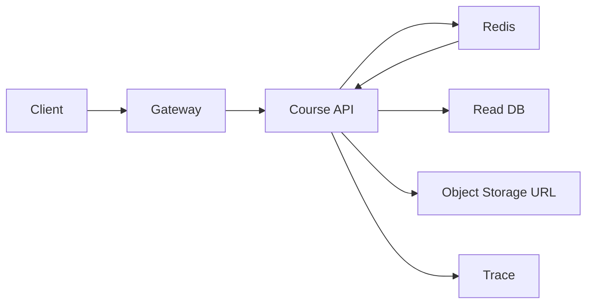
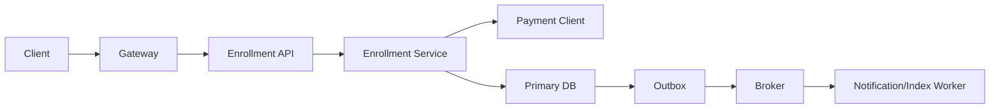

>[!success] 이 문서를 통해 아래 질문들에 답할 수 있게 됩니다.
>- Gateway, Spring App, DB, Cache, Queue, 외부 API는 각각 어떤 책임 계약을 가져야 하는가?
>- 컴포넌트 사이에 상태 판단을 잘못 넘기면 어떤 정합성, 장애, 운영 문제가 생기는가?
>- 백엔드 구성 요소 지도는 성능, 장애 격리, 운영 복잡도를 어떻게 바꾸는가?

## 지도는 기술 목록이 아니라 책임 계약이다

백엔드 시스템 구성 요소를 나열하는 것만으로는 설계가 되지 않는다.

`Gateway`, `Spring API`, `DB`, `Redis`, `Broker`, `Worker`, `External API`, `Observability`가 있다는 말은 시작점일 뿐이다.

중요한 질문은 각 컴포넌트가 어떤 판단을 맡고, 어떤 판단은 절대 맡지 않아야 하는가다.

예를 들어 Redis가 상품 상세 응답을 빠르게 줄 수는 있다.

하지만 결제 가능 여부나 재고 차감의 최종 판단을 Redis에 맡기면 원본과 파생 데이터의 경계가 무너진다.

Redis와 Queue 모두 성능을 돕는 컴포넌트이지, 원본 상태와 비즈니스 성공 기준을 대신 판단하는 컴포넌트가 아니다.

구성 요소 지도는 컴포넌트 이름 옆에 책임, 금지 책임, 실패 시 행동, 관측 지표를 같이 적는 문서다.

## 기준 상황

동영상 강의 플랫폼의 강의 상세 조회와 수강 신청을 같이 설계한다고 하자.

```text
강의 상세 조회 = 12,000 QPS
수강 신청 = 300 TPS
진도 저장 = 2,000 TPS
추천 로그 = 15,000 events/s
결제 승인 p95 = 900ms
강의 영상 파일 = object storage
```

이 상황에서는 모든 요청을 같은 컴포넌트 책임으로 보면 안 된다.

강의 상세 조회는 오래된 설명이나 평점이 잠시 보여도 된다.

수강 신청은 결제, 정원, 권한이 맞아야 하므로 원본 DB와 transaction 경계가 중요하다.

진도 저장은 잦은 쓰기이지만 약간의 지연 저장을 허용할 수 있다.

추천 로그는 사용자 응답 성공 조건이 아니라 분석 입력이다.

## 책임 카드

| 구성 요소 | 맡아야 할 책임 | 맡기면 안 되는 책임 | 핵심 지표 |
| --- | --- | --- | --- |
| Gateway/LB | TLS 종료, routing, coarse rate limit | 수강 가능 여부 판단 | request count, reject count |
| Spring API | 인증 후 유스케이스 조립, 응답 계약 | 영속 상태를 memory에 숨김 | p95, error rate, thread pool |
| Domain Service | 정원, 결제, 권한 같은 불변식 | HTTP 응답 코드 직접 결정 | business error count |
| Primary DB | 최종 진실, 제약, transaction | 단순 cache처럼 대량 조회 흡수 | lock wait, slow query |
| Redis Cache | 반복 읽기 지연 감소 | 원본 상태 최종 판정 | hit ratio, eviction, timeout |
| Broker | 후속 작업 buffering, 재처리 | 정확히 한 번 처리를 보장한다고 가정 | lag, DLQ count |
| Worker | 알림, 통계, 색인 갱신 | 사용자 응답 성공 기준 결정 | retry count, processing time |
| External Client | timeout, retry, fallback 정책 | 무제한 대기와 암묵적 재시도 | timeout rate, circuit state |
| Observability | 증거, trace, alert | 장애를 수동 추측에 맡김 | trace coverage, alert noise |

## 요청 경로를 두 개로 나눈다

강의 상세 조회 경로는 읽기 최적화가 중심이다.



수강 신청 경로는 정합성과 실패 상태가 중심이다.



같은 Spring 애플리케이션 안에 있어도 읽기 경로는 cache miss와 object URL 만료를 보고, 쓰기 경로는 transaction, idempotency, 외부 결제 timeout, outbox 발행을 본다.

## Spring 경계는 port로 드러낸다

컴포넌트 책임은 패키지 이름보다 호출 경계에서 드러난다.

```java
public interface CourseReadCache {
    Optional<CourseDetail> find(CourseId courseId);
    void put(CourseId courseId, CourseDetail detail, Duration ttl);
}

public interface PaymentGateway {
    PaymentResult approve(EnrollmentPaymentCommand command);
}

public interface EnrollmentRepository {
    Enrollment save(Enrollment enrollment);
    boolean existsByCourseAndMember(CourseId courseId, MemberId memberId);
}
```

이런 port는 테스트를 쉽게 하려는 장치만이 아니다.

Cache, 외부 결제, 원본 DB가 서로 다른 실패 정책을 가진다는 사실을 코드에 드러낸다.

`CourseReadCache` 실패는 DB fallback이나 degraded response 후보가 된다.

`PaymentGateway` 실패는 timeout, pending, 실패 응답 중 하나로 계약을 정해야 한다.

`EnrollmentRepository` 실패는 정합성 문제이므로 단순 fallback으로 숨기면 안 된다.

## 상태 owner를 색으로 구분하듯 적는다

컴포넌트가 많아질수록 어떤 값이 원본인지 모호해진다.

| 데이터 | 원본 owner | 파생 사본 | 틀렸을 때 영향 |
| --- | --- | --- | --- |
| 강의 제목과 가격 | Course DB | Redis, search index | 잘못된 가격 노출 |
| 수강 신청 상태 | Enrollment DB | 내 강의 목록 cache | 접근 권한 오류 |
| 결제 승인 결과 | Payment provider와 내부 결제 테이블 | 알림 메시지 | 미결제 수강 허용 |
| 영상 파일 | Object Storage | CDN edge | 재생 실패 또는 오래된 파일 |
| 추천 로그 | Event stream | 분석 저장소 | 추천 품질 저하 |

원본과 파생 사본을 구분하면 정합성 판단이 쉬워진다.

강의 설명은 stale을 허용할 수 있지만 수강 권한은 stale이면 안 된다.

추천 로그는 누락 일부를 감당할 수 있지만 결제 승인 결과 누락은 보정 절차가 필요하다.

## 컴포넌트 추가가 바꾸는 축

| 추가 선택 | 성능 | 정합성 | 장애 격리 | 운영 복잡도 |
| --- | --- | --- | --- | --- |
| Redis 상세 cache | 조회 p95 감소 | 오래된 설명 가능 | DB read 부하 완화 | TTL, invalidation |
| Broker 후속 처리 | 응답 경로 단축 | 완료 시점 지연 | 알림/색인 장애 격리 | retry, DLQ, schema |
| Object Storage | DB binary 부담 제거 | URL 권한 관리 필요 | 파일 트래픽 분리 | lifecycle, CDN purge |
| Read DB | 조회 확장 | replica lag | primary 보호 | routing, failover |
| Circuit breaker | thread 고갈 방지 | fallback 응답 정의 필요 | 외부 장애 차단 | threshold 운영 |

컴포넌트를 추가하면 성능이나 장애 격리는 좋아질 수 있지만, 정합성 설명과 운영 절차를 함께 늘려야 한다.

## 장애 시 끊을 경계

구성 요소 지도에는 장애 때 어디를 끊을지도 있어야 한다.

- Redis 장애: 강의 상세를 DB fallback으로 열지, 인기 강의만 degraded로 줄지 정한다.
- Payment API 지연: 수강 신청을 pending으로 받을지, 즉시 실패로 닫을지 정한다.
- Broker 장애: 수강 신청은 계속 받고 outbox backlog를 쌓을지, 후속 작업 접수를 제한할지 정한다.
- Object Storage 장애: 영상 재생만 실패로 둘지, 강의 상세 조회까지 실패시킬지 정한다.
- Observability 장애: trace 누락을 감수할지, 배포를 멈출지 정한다.

이 판단이 있어야 장애 격리가 설계 문장이 된다.

단순히 컴포넌트를 분리했다는 사실만으로는 장애 격리가 증명되지 않는다.

## 위험 신호

- Redis를 빠른 원본 DB처럼 사용한다.
- Queue에 넣으면 중복과 순서 문제가 사라진다고 가정한다.
- Gateway에 비즈니스 상태 판단을 넣는다.
- Worker 실패가 사용자에게 어떤 상태로 보이는지 정의하지 않는다.
- Object Storage와 CDN URL 권한 만료를 API 계약에서 숨긴다.
- Observability를 기능 구현 뒤에 붙이는 선택 사항으로 본다.

## 개인 프로젝트 기준

개인 프로젝트에서는 모든 컴포넌트를 실제로 분리하지 않아도 된다.

대신 다음 책임 계약은 문서에 남긴다.

- 현재는 단일 Spring App과 DB로 둔 이유
- cache를 생략하거나 도입하는 조건
- 외부 결제 client timeout 값
- 로그에 남길 correlation id
- 원본 DB와 파생 cache의 구분
- 장애를 재현할 최소 시나리오

단순한 구조라도 책임 경계가 선명하면 좋은 설계 설명이 된다.

## 기업 운영 기준

기업 운영에서는 컴포넌트별 owner와 지표가 필요하다.

- Gateway owner와 rate limit 변경 절차
- API owner와 SLO dashboard
- DB owner와 migration 승인 경로
- Cache owner와 stale 대응 기준
- Broker owner와 DLQ 처리 SLA
- External provider 장애 연락 경로
- Observability dashboard와 alert 조정 책임

구성 요소가 늘어날수록 성능과 장애 격리는 좋아질 수 있지만, owner와 runbook이 없으면 운영 복잡도만 커진다.

## 확인 질문

>[!question] 확인 질문
>- 확인 질문: 백엔드 구성 요소 지도에서 컴포넌트 이름보다 중요한 것은 무엇인가?
>	- 답변: 각 컴포넌트가 맡는 책임, 맡기면 안 되는 책임, 실패 시 행동, 관측 지표다.
>- 확인 질문: DB와 Cache의 가장 중요한 경계는 무엇인가?
>	- 답변: DB는 최종 진실이고 cache는 읽기 성능을 위한 파생 사본이라는 점이다.
>- 확인 질문: Broker를 추가하면 어떤 축이 바뀌는가?
>	- 답변: 사용자 응답 성능과 장애 격리는 좋아질 수 있지만 중복, 순서, DLQ, schema version 운영 복잡도가 생긴다.
>
## 참고 문서

- [AWS Architecture Center](https://aws.amazon.com/architecture/)
- [Microsoft Azure Architecture Center, Architecture styles](https://learn.microsoft.com/azure/architecture/guide/architecture-styles/)
- [Google SRE Book, Monitoring Distributed Systems](https://sre.google/sre-book/monitoring-distributed-systems/)
- [Martin Fowler, Circuit Breaker](https://martinfowler.com/bliki/CircuitBreaker.html)
