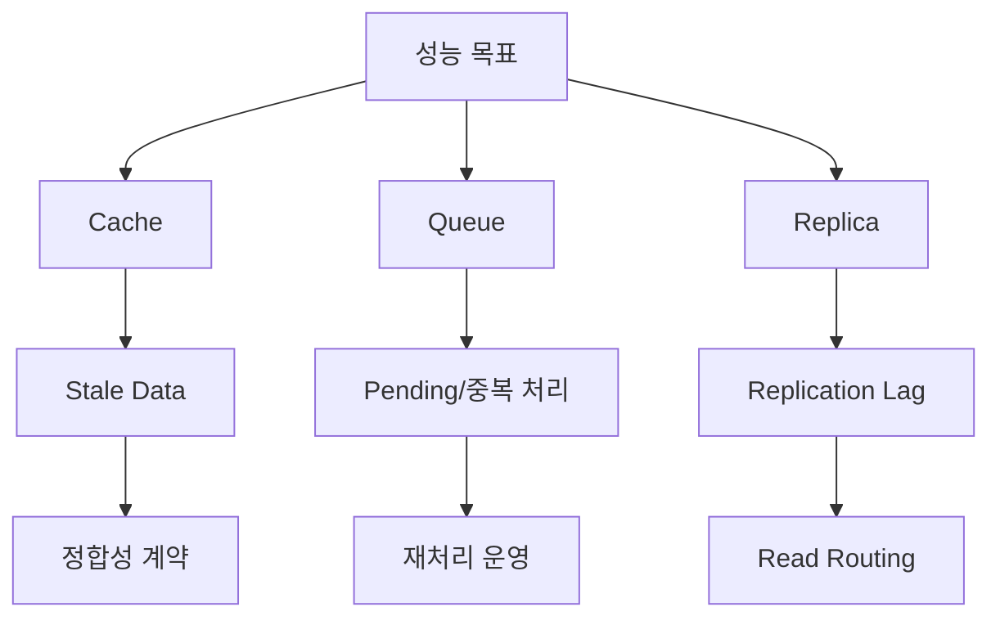

>[!success] 이 문서를 통해 아래 질문들에 답할 수 있게 됩니다.
>- 성능, 확장성, 신뢰성은 왜 동시에 최적화하기 어려운가?
>- cache, queue, replica, rate limit 같은 선택은 어떤 trade-off를 만드는가?
>- 성능 개선이 정합성, 장애 격리, 운영 복잡도를 어떻게 바꾸는가?

## 개요

System Design에서 성능, 확장성, 신뢰성은 따로 움직이지 않는다.

Cache는 읽기 성능을 높이지만 stale data와 invalidation 문제를 만든다.

Queue는 사용자 응답을 빠르게 만들지만 중복 처리와 지연 완료를 만든다.

Replica는 읽기 확장성을 높이지만 replication lag를 만든다.

Rate limit은 시스템을 보호하지만 일부 사용자의 요청을 거절한다.

따라서 trade-off 문서는 "무엇을 얻는가"보다 "무엇을 포기하거나 새로 운영하는가"를 먼저 드러내야 한다.

## 기준 시나리오

이벤트 오픈 시간에 주문 API가 몰리는 상황을 보자.

```text
평상시 주문 생성 = 50 TPS
이벤트 시작 5분 = 800 TPS
상품 상세 조회 = 10,000 QPS
재고 수량 = 5,000개
주문 생성 목표 p95 = 200ms
결제 API timeout = 1.5s
```

단일 DB와 단일 Spring App으로도 평상시는 충분할 수 있다.

하지만 이벤트 시작 5분에는 상품 상세 조회, 재고 차감, 결제 승인, 주문 생성이 같은 리소스에 몰린다.

이때 trade-off를 보지 않고 "캐시를 넣자", "큐를 넣자"라고 말하면 설계가 흐려진다.

## 성능 개선의 비용

| 선택 | 얻는 것 | 잃거나 새로 생기는 것 |
| --- | --- | --- |
| 상품 상세 cache | read latency 감소, DB read 부하 감소 | stale price, invalidation, hot key |
| 주문 queue 접수 | 사용자 응답 안정화, spike 흡수 | pending UX, 중복 처리, queue age |
| 재고 row lock | 정합성 보장 | hot row, lock wait, timeout |
| 재고 선점 token | 처리량 증가 | 만료, 복구, oversell 방지 복잡도 |
| read replica | 조회 확장 | lag, read routing, 장애 전환 |
| rate limit | 시스템 보호 | 429 UX, 공정성, 예외 정책 |

같은 성능 개선이라도 바꾸는 축이 다르다.

Cache는 정합성을 약화시키고, queue는 완료 시점을 늦추며, rate limit은 일부 요청을 실패로 만든다.

## Latency budget

성능 판단은 전체 p95 숫자보다 budget으로 보는 편이 낫다.

```text
목표 p95 = 200ms
Gateway = 10ms
Spring validation = 20ms
DB transaction = 70ms
Payment API = 80ms
Margin = 20ms
```

이 budget에서 결제 API가 p95 800ms라면 주문 생성 p95 200ms는 구조적으로 불가능하다.

선택지는 세 가지다.

- 결제 승인을 주문 성공 조건에서 분리한다.
- 결제사를 동기 호출하되 목표 p95를 다시 합의한다.
- 결제 timeout을 짧게 두고 실패 상태를 사용자에게 명확히 보여준다.

성능 목표가 요구사항과 맞지 않으면 컴포넌트 추가보다 계약 조정이 먼저다.

## 확장성 판단

확장성은 "서버를 더 띄울 수 있는가"보다 "어떤 상태가 확장을 막는가"에 가깝다.

Spring App이 stateless하면 수평 확장이 쉽다.

하지만 session이 local memory에 있거나, 재고가 하나의 row에 몰리거나, 특정 tenant가 모든 요청을 만들면 확장성이 막힌다.

확장성 질문은 다음 순서로 한다.

1. 병목이 CPU, DB, lock, network, external API 중 어디인가?
2. 병목이 전체 요청에 퍼져 있는가, 특정 key에 몰려 있는가?
3. 서버를 늘리면 병목이 줄어드는가?
4. 상태를 나누면 정합성 비용이 감당 가능한가?
5. 운영자가 늘어난 shard, replica, worker를 관측할 수 있는가?

## 신뢰성 판단

신뢰성은 모든 요청을 성공시키는 것이 아니다.

중요한 기능을 살리고 덜 중요한 기능을 줄이는 능력이다.

이벤트 중 결제 API가 느려지면 다음 선택이 가능하다.

- 주문 생성을 막고 명확한 실패를 반환한다.
- 주문을 `PAYMENT_PENDING`으로 받고 나중에 승인한다.
- 결제 없는 장바구니 저장만 허용한다.
- 이벤트 페이지 조회는 캐시로 유지하고 주문만 제한한다.

각 선택은 사용자 경험과 운영 복잡도를 다르게 만든다.

`PAYMENT_PENDING`은 가용성을 높이지만 상태 전이와 보상 처리를 만든다.

명확한 실패는 단순하지만 매출 기회를 잃는다.

## Trade-off map



이 지도는 "성능을 높이면 다음 질문이 열린다"는 사실을 보여준다.

성능 개선은 끝이 아니라 정합성, 장애, 운영 판단의 시작이다.

## 측정과 기준

Trade-off를 논의하려면 지표를 정해야 한다.

- Latency: p50, p95, p99
- Throughput: QPS, TPS, consumer throughput
- Saturation: CPU, thread pool, DB connection, queue depth
- Correctness: duplicate order, stale read, oversell
- Reliability: error rate, timeout rate, fallback rate
- Operations: alert count, rebuild time, manual recovery time

특히 p95만 낮아져도 duplicate order나 stale read가 늘면 설계 품질은 나빠진 것이다.

성능 지표와 정합성 지표를 같이 봐야 한다.

## 위험 신호

- "빠르게 하려고 캐시"처럼 성능 이득만 설명한다.
- p95 목표는 있지만 외부 API latency budget이 없다.
- queue를 도입하면서 pending 상태와 중복 처리를 설계하지 않는다.
- replica lag를 사용자 화면과 API 계약에 반영하지 않는다.
- rate limit을 넣고 429 응답과 재시도 계약을 정하지 않는다.
- 서버 수를 늘리면 모든 문제가 해결된다고 가정한다.

## 개인 프로젝트 기준

개인 프로젝트에서는 대규모 인프라보다 trade-off 설명이 중요하다.

- 캐시를 넣었다면 stale 허용 기준을 적는다.
- queue를 생략했다면 어느 작업이 사용자 응답을 막는지 측정한다.
- rate limit을 넣었다면 어떤 남용을 막는지 설명한다.
- 성능 측정은 평균보다 p95와 실패율을 남긴다.

## 기업 운영 기준

기업 운영에서는 trade-off가 SLO와 연결되어야 한다.

- 주문 생성 p95와 실패율 SLO
- oversell 허용 여부와 보정 절차
- queue age 알림 기준
- cache hit ratio와 stale response 비율
- 결제 API timeout과 circuit breaker 상태
- rate limit 정책 변경 승인 절차

이 기준이 없으면 성능 최적화가 장애와 정합성 문제를 다른 곳으로 옮긴다.

## 확인 질문

>[!question] 확인 질문
>- 확인 질문: 성능 개선 선택을 평가할 때 성능 외에 무엇을 봐야 하는가?
>	- 답변: 정합성 약화, 장애 격리 변화, 운영 복잡도 증가를 함께 봐야 한다.
>- 확인 질문: Queue가 성능과 신뢰성에 주는 장점과 비용은 무엇인가?
>	- 답변: 사용자 응답과 spike 흡수는 좋아지지만 pending 상태, 중복 처리, queue age, DLQ 운영이 생긴다.
>- 확인 질문: p95 latency budget이 필요한 이유는 무엇인가?
>	- 답변: 목표 latency가 외부 API, DB, 애플리케이션 처리 시간과 구조적으로 가능한지 확인하기 위해서다.
>
## 참고 문서

- [Google SRE Book, Service Level Objectives](https://sre.google/sre-book/service-level-objectives/)
- [Google SRE Book, Handling Overload](https://sre.google/sre-book/handling-overload/)
- [AWS Well-Architected Framework, Reliability Pillar](https://docs.aws.amazon.com/wellarchitected/latest/reliability-pillar/welcome.html)
- [Microsoft Azure Architecture Center, Performance efficiency](https://learn.microsoft.com/azure/well-architected/performance-efficiency/)
