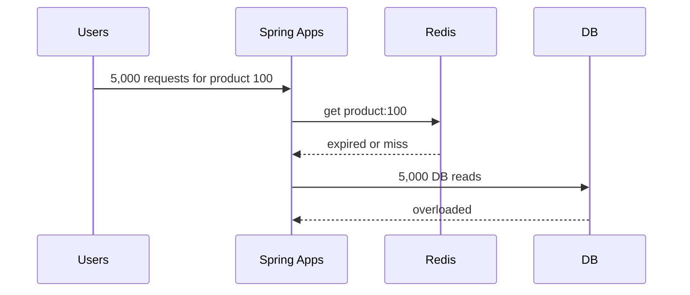

>[!success] 이 문서를 통해 아래 질문들에 답할 수 있게 됩니다.
>- Cache Stampede, Cache Penetration, Hot Key는 어떻게 다른가?
>- 캐시가 있는데도 DB나 Redis가 터지는 이유는 무엇인가?
>- single-flight, lock, TTL jitter, local cache는 각각 어떤 상황에 맞는가?

## 개요

캐시는 부하를 줄이기 위해 넣지만, 특정 상황에서는 부하를 한순간에 몰아 장애를 만들 수 있다.

Cache Stampede는 많은 요청이 동시에 같은 cache miss를 만나 DB로 몰리는 현상이다. Hot Key는 특정 key 하나에 요청이 집중되어 Redis CPU, 네트워크, 단일 shard가 과열되는 현상이다. Cache Penetration은 존재하지 않는 key를 반복 조회해 캐시를 통과하고 DB까지 도달하는 현상이다.

세 문제는 모두 “캐시가 있으니 괜찮다”는 생각을 깨뜨린다. 캐시 설계는 hit 상태뿐 아니라 miss, expired, nonexistent, hot 상태를 함께 설계해야 한다.

## 세 가지 문제 구분

| 문제 | 상황 | 대표 원인 | 피해 |
| --- | --- | --- | --- |
| Stampede | 인기 key가 만료되는 순간 요청이 동시에 DB로 감 | 같은 TTL, 비싼 DB 조회 | DB read 폭주 |
| Hot Key | 특정 key가 계속 과도하게 읽힘 | 인기 상품, 이벤트 페이지, 유명인 피드 | Redis CPU나 shard 과열 |
| Penetration | 없는 key 요청이 계속 DB까지 감 | 악성 요청, 잘못된 id, 크롤러 | DB 불필요 조회 |

해결책도 다르다. stampede는 동시 miss를 하나로 합치는 것이 중요하고, hot key는 읽기 부하를 분산해야 하며, penetration은 없는 값도 방어해야 한다.

## Stampede 흐름



캐시 hit ratio가 평소에 높아도 특정 시점의 miss가 DB를 밀어붙일 수 있다. 평균 hit ratio만 보면 stampede를 놓친다.

## Single-flight

Single-flight는 같은 key에 대한 동시 miss 중 하나만 DB로 보내고 나머지는 기다리게 하는 방식이다.

```java
public ProductDetail getProduct(Long productId) {
    String key = "product:detail:" + productId;
    ProductDetail cached = cache.get(key);
    if (cached != null) {
        return cached;
    }

    return singleFlight.execute(key, () -> {
        ProductDetail secondCheck = cache.get(key);
        if (secondCheck != null) {
            return secondCheck;
        }
        ProductDetail loaded = productRepository.findDetail(productId);
        cache.set(key, loaded, ttlWithJitter());
        return loaded;
    });
}
```

두 번째 cache check가 중요하다. lock을 기다리는 동안 다른 요청이 이미 값을 채웠을 수 있기 때문이다.

single-flight는 애플리케이션 인스턴스 내부에서는 쉽지만, 여러 인스턴스 전체에서 보장하려면 Redis lock 같은 분산 조정이 필요하다. 분산 lock은 timeout과 unlock 안전성까지 설계해야 하므로 무조건 쓰는 것이 아니다.

## TTL Jitter와 Soft TTL

TTL jitter는 만료 시점을 흩는다.

```text
base TTL = 300s
jitter = 0~60s
actual TTL = 300~360s
```

Soft TTL은 캐시 값에 논리적 만료 시간을 따로 두는 방식이다. hard TTL이 지나기 전에도 백그라운드에서 갱신하고, 갱신 중에는 잠시 오래된 값을 반환할 수 있다.

```json
{
  "data": { "productId": 100, "name": "Keyboard" },
  "softExpiresAt": "2026-06-30T10:00:00+09:00",
  "hardExpiresAt": "2026-06-30T10:05:00+09:00"
}
```

이 방식은 사용자에게 빠른 응답을 주면서 DB 폭주를 줄인다. 단, stale 값을 허용할 수 있는 데이터에만 적합하다.

## Hot Key 대응

Hot Key는 miss가 아니라 hit 상태에서도 문제다. Redis가 key를 빠르게 반환하더라도 요청이 한 key에 몰리면 네트워크와 Redis 단일 thread가 병목이 된다.

대응은 다음 순서로 검토한다.

- local cache로 아주 짧게 흡수한다.
- CDN이나 edge cache로 HTTP 응답 자체를 캐시한다.
- key를 여러 조각으로 나누는 sharding key를 검토한다.
- hot key를 미리 감지해 TTL을 늘리거나 refresh한다.
- 인기 데이터는 DB 조회 경로와 분리된 read model을 둔다.

local cache는 빠르지만 인스턴스별 stale이 생긴다.

```java
LoadingCache<Long, ProductDetail> localHotProductCache = Caffeine.newBuilder()
    .maximumSize(10_000)
    .expireAfterWrite(Duration.ofSeconds(3))
    .build(productService::loadFromRedisOrDb);
```

3초 stale이 허용되는 인기 상품 설명에는 적합할 수 있다. 재고 수량에는 위험할 수 있다.

## Cache Penetration

없는 상품 id를 반복 조회하면 캐시는 매번 miss이고 DB도 매번 조회된다.

방어 방법은 다음이다.

- null cache: 존재하지 않음을 짧게 캐시한다.
- Bloom filter: 존재 가능성이 없는 key를 DB 전에 거른다.
- rate limit: 악성 id 스캔을 제한한다.
- id 형식 검증: 말이 안 되는 key를 DB 전에 차단한다.

```java
if (cachedNullMarker != null) {
    throw new ProductNotFoundException();
}

Optional<ProductDetail> loaded = productRepository.findDetail(productId);
if (loaded.isEmpty()) {
    cache.set("product:null:" + productId, NullMarker.INSTANCE, Duration.ofSeconds(30));
    throw new ProductNotFoundException();
}
```

null cache TTL은 짧게 둔다. 나중에 상품이 생성될 수 있기 때문이다.

## 계산 예시

```text
인기 상품 상세 peak = 8,000 QPS
Redis hit latency = 2ms
DB load latency = 80ms
TTL 만료 순간 동시 miss = 3,000 requests
single-flight 없음 = DB 3,000 reads
single-flight 있음 = DB 1 read + 대기 요청
```

stampede는 평균 QPS보다 만료 순간 동시 miss 수가 중요하다.

## 위험 신호!

- hit ratio만 보고 hot key와 stampede를 보지 않는다.
- 모든 key에 같은 TTL을 넣어 동시에 만료시킨다.
- 분산 lock을 넣었지만 lock timeout과 실패 시 fallback이 없다.
- 없는 key를 캐시하지 않아 악성 요청이 DB까지 간다.
- local cache를 쓰면서 stale 허용 시간을 사용자 경험으로 검토하지 않는다.

## 확인 질문

- 확인 질문: Stampede와 Hot Key의 차이는 무엇인가?
	- 답변: Stampede는 만료나 miss 순간 DB로 요청이 몰리는 문제이고, Hot Key는 hit 상태에서도 특정 key 요청이 Redis에 집중되는 문제다.
- 확인 질문: single-flight에서 두 번째 cache check가 필요한 이유는 무엇인가?
	- 답변: lock을 기다리는 동안 다른 요청이 값을 이미 채웠을 수 있으므로 DB 중복 조회를 피하기 위해서다.
- 확인 질문: null cache가 필요한 이유는 무엇인가?
	- 답변: 존재하지 않는 key 요청이 매번 DB까지 가는 cache penetration을 줄이기 위해서다.

## 참고 문서

- [Redis Documentation](https://redis.io/docs/latest/)
- [Caffeine Cache](https://github.com/ben-manes/caffeine)
- [AWS Database Caching Strategies Using Redis](https://docs.aws.amazon.com/whitepapers/latest/database-caching-strategies-using-redis/welcome.html)
- [Google SRE Book, Handling Overload](https://sre.google/sre-book/handling-overload/)
