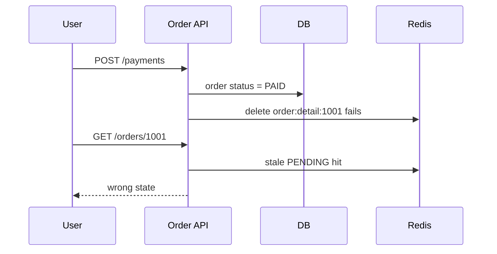

>[!success] 이 문서를 통해 아래 질문들에 답할 수 있게 됩니다.
>- 캐시 정합성 문제를 왜 DB 문제가 아니라 사용자 경험 문제로 봐야 하는가?
>- 어떤 데이터는 stale을 허용하고 어떤 데이터는 강한 읽기가 필요한가?
>- 캐시 때문에 오래된 값이 보일 때 API와 화면은 어떤 계약을 가져야 하는가?

## 개요

캐시 정합성 문제는 “Redis 값이 DB와 다르다”에서 끝나지 않는다. 사용자는 Redis와 DB를 보지 않는다. 사용자는 방금 바꾼 이름이 안 보이거나, 결제한 주문이 아직 미결제로 보이거나, 품절 상품이 구매 가능해 보이는 경험을 한다.

따라서 캐시 정합성은 기술 문제가 아니라 사용자 경험과 API 계약의 문제다. 모든 데이터를 즉시 최신으로 만들 수 없다면, 어떤 화면에서 어떤 지연을 허용할지 설계해야 한다.

## Stale Data의 종류

오래된 값은 모두 같은 위험이 아니다.

| 데이터 | stale 허용 | 사용자 영향 |
| --- | --- | --- |
| 상품 설명 | 대체로 허용 | 설명 수정이 몇 분 늦게 보일 수 있다. |
| 상품 가격 | 제한적으로 허용 | 잘못된 가격 표시가 보상 문제로 이어질 수 있다. |
| 재고 | 매우 제한적 | 구매 실패, oversell, 신뢰 하락이 생긴다. |
| 주문 상태 | 사용자별 강한 읽기 필요 | 결제 후 불안감과 CS가 생긴다. |
| 권한 | 거의 허용 불가 | 보안 사고가 될 수 있다. |
| 추천 목록 | 허용 가능 | 개인화 품질이 잠시 낮아진다. |

캐시 대상은 데이터 변경 빈도보다 사용자 피해 기준으로 나눈다.

## Read-after-write

사용자가 방금 쓴 값은 바로 보고 싶어 한다. 이를 read-after-write 기대라고 볼 수 있다.

예를 들어 사용자가 닉네임을 바꾼 뒤 프로필 화면에 예전 닉네임이 보이면 캐시 관점에서는 TTL 안의 stale이지만, 사용자 경험 관점에서는 “수정이 실패했나?”라는 불안이다.

대응은 여러 가지다.

- 쓰기 직후 해당 사용자 요청은 DB primary에서 읽는다.
- 쓰기 응답에 변경된 값을 포함해 화면 상태를 갱신한다.
- 해당 key를 즉시 invalidation한다.
- 짧은 시간 동안 `Cache-Control: no-cache` 같은 우회 경로를 둔다.
- 화면에 “변경 사항 반영 중” 상태를 명시한다.

항상 DB primary read가 정답은 아니다. 트래픽이 크면 일부 화면은 응답 값으로 보정하고, 목록이나 검색은 늦게 반영될 수 있음을 계약한다.

## 주문 상태 예시

결제 완료 후 주문 상세가 아직 `PAYMENT_PENDING`으로 보이는 상황을 생각해 보자.



이 문제의 핵심은 Redis 삭제 실패가 아니다. 사용자가 돈을 냈는데 주문이 미결제로 보인다는 점이다.

해결은 데이터 중요도에 맞게 선택한다.

- 결제 직후 주문 상세는 cache bypass한다.
- 주문 상태 변경 이벤트로 캐시를 재삭제한다.
- 캐시 값에 version을 넣어 DB version보다 낮으면 버린다.
- stale 상태를 감지하면 DB를 다시 조회한다.

## API 계약

캐시 때문에 지연 반영이 가능한 API는 그 사실을 응답 계약에 포함할 수 있다.

```json
{
  "orderId": 1001,
  "status": "PAYMENT_PENDING",
  "dataFreshness": "STALE_POSSIBLE",
  "lastUpdatedAt": "2026-06-30T10:14:00+09:00"
}
```

모든 API에 이런 필드를 넣을 필요는 없다. 하지만 관리 화면, 통계, 비동기 처리 상태처럼 지연 반영이 정상인 기능에서는 freshness를 표현하는 것이 도움이 된다.

반대로 결제 결과나 권한 판단 API는 stale 가능성을 응답으로 넘기는 것이 아니라 강한 읽기 경로를 선택해야 한다.

## 캐시와 UX 문구

eventual consistency를 선택했다면 화면 문구도 설계 일부다.

- “결제 처리 중입니다. 잠시 후 주문 내역에 반영됩니다.”
- “통계는 최대 5분 지연될 수 있습니다.”
- “변경 사항이 검색 결과에 반영되기까지 시간이 걸릴 수 있습니다.”

이 문구는 변명이 아니라 계약이다. 사용자가 기대하는 즉시성을 낮추고 불필요한 재시도를 줄인다.

## 관리자와 사용자 화면의 기준 차이

사용자 화면과 관리자 화면은 정합성 기준이 다를 수 있다.

사용자 주문 상세는 강한 최신성이 필요하다. 반면 관리자 일별 통계는 5분 지연을 허용할 수 있다. 검색 색인은 수십 초 늦어도 괜찮을 수 있지만, 결제 승인 여부는 즉시 정확해야 한다.

같은 데이터라도 화면과 행동에 따라 캐시 정책이 달라진다.

| 화면 | 캐시 정책 |
| --- | --- |
| 상품 상세 설명 | Cache Aside + TTL |
| 장바구니 가격 계산 | DB 또는 짧은 TTL + 검증 |
| 주문 결제 결과 | cache bypass 또는 primary read |
| 관리자 통계 | read model + 지연 표시 |
| 검색 결과 | eventual consistency 허용 |

## 장애 시 오래된 값 반환

DB 장애 때 stale cache를 반환할 것인지도 사용자 경험 결정이다.

상품 설명은 오래된 값이라도 보여주는 것이 나을 수 있다. 하지만 재고나 가격은 오래된 값을 보여주면 사용자가 구매 단계에서 실패하거나 잘못된 기대를 갖는다.

```text
DB 장애 + 캐시 hit
  상품 설명: stale 반환 가능
  가격: stale 반환 제한 또는 표시 주의
  재고: 구매 가능 판단에는 사용 금지
  권한: stale 반환 금지
```

stale fallback은 장애 격리에 도움이 되지만, 데이터 종류별로 허용 범위를 정해야 한다.

## 위험 신호!

- 모든 캐시 불일치를 “TTL 지나면 해결”로 처리한다.
- 결제, 권한, 재고처럼 민감한 데이터와 상품 설명을 같은 정책으로 캐시한다.
- 사용자에게 지연 반영이 정상인지 장애인지 알려주지 않는다.
- 쓰기 직후 읽기 경로를 별도로 설계하지 않는다.
- stale cache 반환이 가능한 장애 상황을 제품/운영과 합의하지 않았다.

## 실전 팁

- 캐시 정책 문서에 “stale 허용 시간”과 “사용자 영향”을 함께 적는다.
- 쓰기 응답에는 변경된 최신 값을 포함해 화면을 즉시 보정할 수 있게 한다.
- 주문, 결제, 권한처럼 민감한 API는 cache bypass 조건을 명시한다.
- 통계, 검색, 추천은 지연 반영 문구와 freshness 지표를 제공한다.
- CS가 발생한 stale 사례는 key, TTL, invalidation event, 화면 경로를 함께 추적한다.

## 확인 질문

>[!question] 확인 질문
>- 확인 질문: 캐시 정합성을 사용자 경험 문제로 봐야 하는 이유는 무엇인가?
>	- 답변: 사용자는 DB와 Redis의 차이가 아니라 방금 한 행동이 화면에 반영되지 않는 경험을 하기 때문이다.
>- 확인 질문: read-after-write가 필요한 대표 화면은 무엇인가?
>	- 답변: 프로필 수정 직후 화면, 결제 후 주문 상세, 권한 변경 직후 접근 제어처럼 사용자가 방금 수행한 행동의 결과를 확인하는 화면이다.
>- 확인 질문: stale fallback을 모든 데이터에 적용하면 안 되는 이유는 무엇인가?
>	- 답변: 오래된 가격, 재고, 권한, 결제 상태는 사용자 손해나 보안 문제로 이어질 수 있기 때문이다.
>
## 참고 문서

- [Microsoft Azure Cache-Aside Pattern](https://learn.microsoft.com/azure/architecture/patterns/cache-aside)
- [Designing Data-Intensive Applications](https://dataintensive.net/)
- [Google SRE Book, Embracing Risk](https://sre.google/sre-book/embracing-risk/)
- [Redis Documentation](https://redis.io/docs/latest/)
