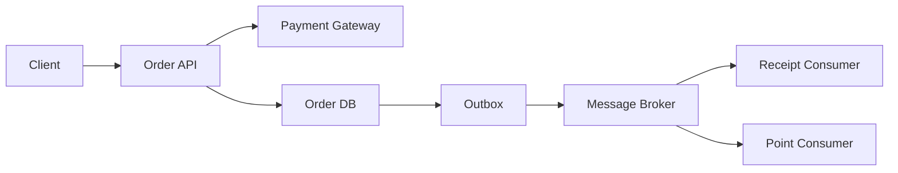

>[!success] 이 문서를 통해 아래 질문들에 답할 수 있게 됩니다.
>- 어떤 작업을 사용자 응답 전에 끝내고, 어떤 작업을 비동기로 미룰 수 있는가?
>- 비동기화가 성능, 정합성, 장애 격리, 운영 복잡도를 각각 어떻게 바꾸는가?
>- pending 상태와 후속 실패를 API 계약과 사용자 경험에 어떻게 드러내야 하는가?

## 개요

동기와 비동기 경계는 "느린 작업을 queue로 보낸다"는 구현 선택이 아니다. 사용자가 응답을 받는 순간 어떤 사실을 믿어도 되는지 정하는 계약이다.

결제 API를 예로 들면 결제 승인, 주문 생성, 재고 예약은 사용자에게 즉시 약속하는 상태다. 반면 영수증 이메일, 추천 통계 적재, 마케팅 이벤트 발행은 늦어져도 주문 성공 자체를 뒤집지 않을 수 있다.

따라서 비동기화의 첫 질문은 "무엇이 느린가?"가 아니라 "무엇이 아직 끝나지 않아도 성공이라고 말할 수 있는가?"다.

## 경계가 바꾸는 것

| 축 | 동기 유지 | 비동기 분리 |
| --- | --- | --- |
| 성능 | 사용자 응답이 모든 작업을 기다린다 | 응답 latency는 줄어들 수 있다 |
| 정합성 | 결과를 즉시 확인하기 쉽다 | 후속 상태는 최종 일관성이 된다 |
| 장애 격리 | 후속 시스템 장애가 요청 실패로 번진다 | 후속 장애를 queue 뒤로 격리할 수 있다 |
| 운영 복잡도 | 흐름은 단순하지만 peak에 취약하다 | lag, retry, DLQ, 재처리를 운영해야 한다 |

이 표에서 중요한 점은 비동기화가 순수한 성능 최적화가 아니라는 것이다. 응답 시간을 낮추는 대신 "나중에 실패한 일"을 찾아내고 처리할 운영 체계를 요구한다.

## 결제 예시

다음 요구사항이 있다고 하자.

```text
사용자는 결제 버튼을 누른 뒤 2초 안에 주문 성공 여부를 알아야 한다.
영수증 이메일은 5분 안에 도착하면 된다.
포인트 적립은 주문 상세 화면에서 pending으로 보여도 된다.
정산 데이터는 하루 안에 누락 없이 생성되어야 한다.
```

이 경우 모든 작업을 동기 호출로 묶으면 이메일 서버나 정산 시스템 장애가 결제 성공률을 낮춘다. 반대로 모든 작업을 비동기로 보내면 사용자는 결제 성공 여부를 알 수 없고, 실패한 결제를 어떻게 복구할지도 불명확해진다.

## 분리 기준

| 작업 | 동기/비동기 | 판단 근거 |
| --- | --- | --- |
| 결제 승인 | 동기 | 사용자에게 금전 결과를 즉시 알려야 한다 |
| 주문 저장 | 동기 | 주문 번호와 상태의 원천이 된다 |
| 재고 예약 | 보통 동기 | oversell 방지 수준에 따라 달라진다 |
| 영수증 이메일 | 비동기 | 늦어져도 주문 성공을 뒤집지 않는다 |
| 포인트 적립 | 비동기 가능 | pending 표시와 재처리가 가능하면 분리한다 |
| 정산 이벤트 | 비동기 | 정확한 보존과 재처리가 응답 시간보다 중요하다 |

동기/비동기 구분은 기술 이름보다 업무 약속에 의해 결정된다. 같은 알림이라도 보안 인증 코드처럼 즉시 필요하면 동기로 남을 수 있고, 마케팅 알림이면 비동기로 충분할 수 있다.

## API 계약

비동기 후속 작업이 있으면 성공 응답은 "모든 일이 끝났다"가 아니라 "핵심 상태가 확정되었고 후속 작업이 접수되었다"를 의미해야 한다.

```json
{
  "orderId": "ord-1001",
  "paymentStatus": "APPROVED",
  "receiptStatus": "PENDING",
  "pointStatus": "PENDING",
  "trackingId": "req-20260630-0001"
}
```

이 응답은 사용자 경험과 운영을 동시에 돕는다. 사용자는 주문 성공과 후속 상태를 구분하고, 운영자는 `trackingId`로 메시지 발행과 consumer 처리 상태를 추적한다.

## 흐름 설계



이 흐름에서 동기 경계는 `Order API`, `Payment Gateway`, `Order DB`까지다. `Outbox` 이후는 후속 작업이다. 사용자가 주문 성공을 봤다면 최소한 주문 DB에 확정된 상태가 있어야 하고, 후속 consumer는 그 상태를 기준으로 재처리할 수 있어야 한다.

## Outbox가 필요한 순간

DB 저장과 메시지 발행을 분리하면 다음 두 실패가 생긴다.

```text
1. 주문 DB 저장 성공, 메시지 발행 실패
2. 메시지 발행 성공, 주문 DB 저장 실패
```

첫 번째는 후속 작업 누락을 만들고, 두 번째는 consumer가 존재하지 않는 주문을 처리하게 만든다. Outbox는 같은 DB transaction 안에 주문과 발행할 이벤트를 함께 기록하고, 별도 publisher가 broker로 전달하게 만들어 이 간극을 줄인다.

```java
@Transactional
public OrderResult completePayment(PaymentApproved approved) {
    Order order = orderRepository.save(Order.from(approved));
    outboxRepository.save(OutboxEvent.orderPaid(order.getId(), approved.eventId()));
    return OrderResult.accepted(order.getId(), "PENDING_FOLLOW_UP");
}
```

이 코드는 메시지 발행을 transaction 안에서 직접 하지 않는다. transaction 안에서는 재처리 가능한 사실만 저장한다.

## 실패를 사용자에게 설명하기

비동기 후속 작업은 실패할 수 있다. 실패를 숨기면 사용자는 "결제는 됐는데 포인트가 없다"는 문제를 고객센터에 설명해야 한다.

주문 상세 화면은 다음처럼 상태를 나눌 수 있다.

```text
주문 상태: 결제 완료
영수증: 발송 대기
포인트: 적립 지연, 자동 재시도 중
```

모든 후속 작업을 화면에 노출할 필요는 없다. 하지만 사용자에게 영향을 주는 후속 상태는 pending, delayed, failed, completed 중 하나로 설명할 수 있어야 한다.

## 설계 질문

- 이 작업이 실패하면 사용자의 핵심 행동이 실패하는가?
- 사용자가 응답 직후 반드시 확인해야 하는 값인가?
- 실패했을 때 자동 재시도와 수동 보정이 가능한가?
- 중복 실행되어도 같은 결과가 되는가?
- 후속 작업이 늦어졌다는 사실을 어디서 볼 수 있는가?
- queue가 쌓이면 어떤 기능을 먼저 줄일 것인가?

이 질문에 답하지 못한 비동기화는 단순한 지연 숨기기에 가깝다.

## 위험 신호

- "느리니까 queue로 뺀다"만 있고 성공 의미가 바뀌지 않는다.
- 주문 성공 응답을 줬지만 후속 실패를 추적할 id가 없다.
- 이메일, 포인트, 정산을 같은 queue와 같은 retry 정책으로 처리한다.
- consumer lag가 커져도 사용자 화면에는 정상처럼 보인다.
- 비동기 작업 실패가 고객센터 문의로만 발견된다.

## 개인 프로젝트 기준

개인 프로젝트에서는 모든 후속 작업을 완벽히 운영할 필요는 없다. 대신 경계와 생략 이유를 명시해야 한다.

- 주문 저장까지 동기, 이메일은 비동기로 분리한다고 적는다.
- 비동기 작업에는 `eventId`와 처리 로그를 남긴다.
- 실패 재현 방법을 하나 둔다.
- DLQ를 생략했다면 실패 메시지를 어디서 확인할지 적는다.
- 화면에 pending을 보여주지 않는다면 사용자 영향이 없는 작업으로 제한한다.

## 기업 운영 기준

기업 운영에서는 비동기화가 SLO와 on-call 책임으로 이어진다.

- 핵심 API latency와 consumer lag를 함께 본다.
- 후속 작업별 owner와 alert 기준을 둔다.
- DLQ 메시지의 재처리 권한과 승인 절차를 정한다.
- queue 적체 시 어떤 producer를 제한할지 runbook에 둔다.
- 배포 중 old event와 new event가 함께 존재하는 기간을 설계한다.

## 확인 질문

- 확인 질문: 동기/비동기 경계를 정할 때 첫 질문은 무엇인가?
	- 답변: 사용자가 응답 시점에 어떤 상태를 성공으로 믿어도 되는지 묻는 것이다.
- 확인 질문: 비동기화가 정합성을 바꾸는 방식은 무엇인가?
	- 답변: 후속 상태가 즉시 확정되지 않고 최종 일관성으로 이동하므로 pending, retry, 보정 절차가 필요해진다.
- 확인 질문: Outbox가 줄이는 실패 간극은 무엇인가?
	- 답변: DB 저장과 메시지 발행 사이에서 한쪽만 성공해 후속 작업이 누락되거나 잘못 실행되는 간극이다.

## 참고 문서

- [Microservices.io, Transactional Outbox](https://microservices.io/patterns/data/transactional-outbox.html)
- [Martin Fowler, What do you mean by Event-Driven?](https://martinfowler.com/articles/201701-event-driven.html)
- [Google SRE Book, Handling Overload](https://sre.google/sre-book/handling-overload/)
