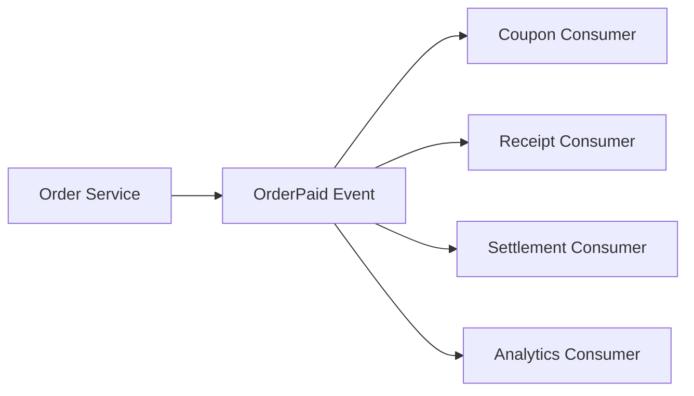

>[!success] 이 문서를 통해 아래 질문들에 답할 수 있게 됩니다.
>- Event-driven 설계가 어떤 결합은 낮추고 어떤 결합은 새로 만드는가?
>- 이벤트 계약, 버전, 발생 시점은 정합성과 운영 복잡도에 어떤 영향을 주는가?
>- 서비스 간 직접 호출과 이벤트 발행 중 무엇을 선택해야 하는가?

## 개요

Event-driven 설계는 서비스가 서로를 직접 호출하지 않고 "일어난 사실"을 발행하게 만든다. 주문 서비스가 쿠폰 서비스, 알림 서비스, 정산 서비스를 하나씩 호출하는 대신 `OrderPaid` 이벤트를 발행하고 각 consumer가 자기 일을 처리한다.

이 구조는 장애 격리와 배포 독립성을 개선할 수 있다. 하지만 결합이 사라지는 것은 아니다. HTTP 호출 결합이 이벤트 이름, payload 의미, version, 발생 시점에 대한 계약 결합으로 이동한다.

따라서 Event-driven의 핵심 질문은 "이벤트를 쓸까?"가 아니라 "어떤 사실을 누구에게 어떤 안정성으로 공개할까?"다.

## 직접 호출과 이벤트

| 기준 | 직접 호출 | 이벤트 발행 |
| --- | --- | --- |
| 응답 의미 | 호출 결과를 즉시 반영한다 | 후속 처리는 나중에 완료된다 |
| 장애 전파 | downstream 장애가 upstream 실패로 번질 수 있다 | downstream 장애를 queue 뒤로 격리할 수 있다 |
| 정합성 | 즉시 성공/실패를 알기 쉽다 | 최종 일관성과 보정이 필요하다 |
| 추적 | call stack과 trace가 비교적 단순하다 | correlation id와 메시지 상태 추적이 필요하다 |
| 계약 | API endpoint 계약 | 이벤트 schema와 의미 계약 |

Event-driven은 downstream 장애를 사용자 요청에서 떼어낼 수 있지만, 사용자가 보는 상태가 늦게 맞춰지는 문제를 만든다.

## 이벤트는 명령이 아니다

좋은 이벤트는 "무엇을 하라"보다 "무엇이 일어났다"에 가깝다.

```text
나쁜 예: SendCouponCommand
좋은 예: OrderPaid
```

`SendCouponCommand`는 producer가 consumer의 일을 알고 있다는 뜻이다. `OrderPaid`는 주문에서 발생한 사실을 공개하고, 쿠폰 consumer가 그 사실을 보고 자기 정책을 실행한다.

다만 모든 이벤트가 순수한 도메인 이벤트일 필요는 없다. 업무에 따라 작업 queue나 command message가 필요할 수 있다. 중요한 것은 이름이 아니라 소유권이다. consumer의 정책을 producer가 결정하면 느슨한 결합이 아니다.

## 이벤트 계약

이벤트는 공개 API처럼 관리해야 한다.

```json
{
  "eventType": "OrderPaid",
  "eventVersion": 2,
  "eventId": "evt-1001",
  "orderId": "ord-1001",
  "paidAmount": 39000,
  "currency": "KRW",
  "paidAt": "2026-06-30T10:30:00+09:00"
}
```

계약에는 최소한 다음이 포함되어야 한다.

- 이벤트 이름
- 발생 조건
- 발행 시점
- payload 필드 의미
- version 정책
- 중복 발행 가능성
- 순서 보장 범위
- 보존 기간

이 중 발생 조건과 발행 시점이 특히 중요하다. `OrderPaid`가 결제 승인 직후인지, 주문 DB commit 후인지, 정산 가능 상태까지 포함하는지에 따라 consumer 판단이 달라진다.

## 결합이 이동하는 지점

Event-driven은 다음 결합을 줄인다.

- producer가 consumer endpoint를 알 필요가 줄어든다.
- consumer 장애가 producer latency를 직접 늘리지 않는다.
- consumer 추가가 producer 배포를 요구하지 않을 수 있다.

대신 다음 결합이 생긴다.

- consumer는 이벤트 의미와 schema에 의존한다.
- producer는 이벤트를 함부로 삭제하거나 의미를 바꿀 수 없다.
- broker와 schema registry 같은 공통 인프라에 의존한다.
- 장애 추적이 여러 서비스와 queue에 걸친다.

느슨한 결합은 "서로 모른다"가 아니다. 서로가 의존하는 계약의 형태를 운영 가능한 형태로 바꾸는 것이다.

## Fanout 판단

하나의 이벤트를 여러 consumer가 구독하면 확장성은 좋아지지만 장애 표면도 커진다.



Fanout이 적합한 경우는 consumer들이 서로 독립적인 후속 작업을 할 때다. 반대로 작업 순서가 강하게 묶여 있거나 하나가 실패하면 전체를 되돌려야 한다면 이벤트 fanout보다 명시적인 workflow가 더 적합할 수 있다.

## Version 변경

이벤트 schema는 한 번 발행되면 과거 메시지와 old consumer를 고려해야 한다.

안전한 변경:

- optional field 추가
- 새 eventVersion 추가
- consumer가 모르는 필드를 무시하도록 설계
- old/new event를 함께 처리하는 기간 확보

위험한 변경:

- 필수 필드 삭제
- 같은 필드의 의미 변경
- eventType 이름 재사용
- 순서 보장 범위 변경을 공지 없이 적용

이벤트 version은 문서만의 문제가 아니다. 배포 순서, backfill, replay, DLQ 재처리까지 영향을 준다.

## Replay와 Backfill

Event-driven 시스템은 과거 이벤트를 다시 읽거나 누락된 read model을 다시 만들 일이 생긴다. 이때 이벤트가 "그 당시의 사실"인지 "현재 상태를 조회하기 위한 신호"인지 구분해야 한다.

예를 들어 `OrderPaid`에 당시 결제 금액이 들어 있으면 정산 재처리에 유리하다. 반대로 orderId만 있으면 consumer는 현재 주문 DB를 다시 읽어야 하고, 시간이 지난 뒤 금액이나 상태가 달라졌을 수 있다.

Replay 가능한 이벤트는 다음 조건이 필요하다.

- 같은 이벤트를 다시 처리해도 결과가 중복되지 않는다.
- 과거 schema를 읽을 수 있다.
- 외부 API 호출 같은 부작용을 분리하거나 방어한다.
- replay와 실시간 처리를 구분하는 지표가 있다.

## 선택 기준

Event-driven을 선택하기 좋은 경우:

- 후속 작업이 여러 팀이나 서비스로 분리되어 있다.
- 후속 실패가 원래 요청 성공을 뒤집지 않는다.
- fanout이 늘어날 가능성이 있다.
- consumer별 처리 속도와 장애를 격리해야 한다.
- 이벤트 이력이 감사나 재처리에 도움이 된다.

직접 호출이 더 나은 경우:

- 호출 결과가 사용자 응답에 즉시 필요하다.
- 실패하면 전체 작업을 바로 중단해야 한다.
- consumer가 하나이고 fanout 가능성이 낮다.
- 운영할 broker, schema, DLQ 체계가 없다.

## 위험 신호

- 이벤트 이름만 있고 발생 조건이 문서화되어 있지 않다.
- producer가 consumer별 payload를 맞춰 발행한다.
- 이벤트 필드 의미를 바꾸면서 version을 올리지 않는다.
- replay하면 이메일, 문자, 포인트가 다시 나간다.
- consumer가 늘어났는데 owner와 장애 알림은 그대로다.

## 개인 프로젝트 기준

- 이벤트 하나를 공개 API처럼 문서화한다.
- `eventId`, `eventType`, `eventVersion`, `occurredAt`을 넣는다.
- consumer가 하나뿐이면 왜 직접 호출이 아닌지 설명한다.
- replay는 생략하더라도 중복 처리 방어는 둔다.
- 이벤트 의미를 README나 설계 문서에 남긴다.

## 기업 운영 기준

- 이벤트 catalog나 schema registry를 운영한다.
- breaking change 절차와 deprecation 기간을 둔다.
- consumer 목록과 owner를 추적한다.
- replay, backfill, DLQ 재처리 권한을 구분한다.
- 이벤트 발행량, consumer lag, 처리 실패율을 eventType별로 본다.

## 확인 질문

- 확인 질문: Event-driven이 없애지 못하는 결합은 무엇인가?
	- 답변: 이벤트 이름, payload 의미, 발생 시점, version에 대한 계약 결합은 남고 오히려 더 명확히 관리해야 한다.
- 확인 질문: 이벤트를 command처럼 설계하면 어떤 문제가 생기는가?
	- 답변: producer가 consumer의 업무를 알게 되어 느슨한 결합이 깨지고 consumer 추가나 정책 변경이 producer 변경으로 번진다.
- 확인 질문: replay 가능한 이벤트를 만들 때 가장 조심할 점은 무엇인가?
	- 답변: 같은 이벤트를 다시 처리해도 외부 부작용과 업무 결과가 중복되지 않도록 idempotency와 부작용 분리가 필요하다.

## 참고 문서

- [Martin Fowler, What do you mean by Event-Driven?](https://martinfowler.com/articles/201701-event-driven.html)
- [Confluent, Schema Evolution and Compatibility](https://docs.confluent.io/platform/current/schema-registry/fundamentals/schema-evolution.html)
- [Microservices.io, Domain Event](https://microservices.io/patterns/data/domain-event.html)
