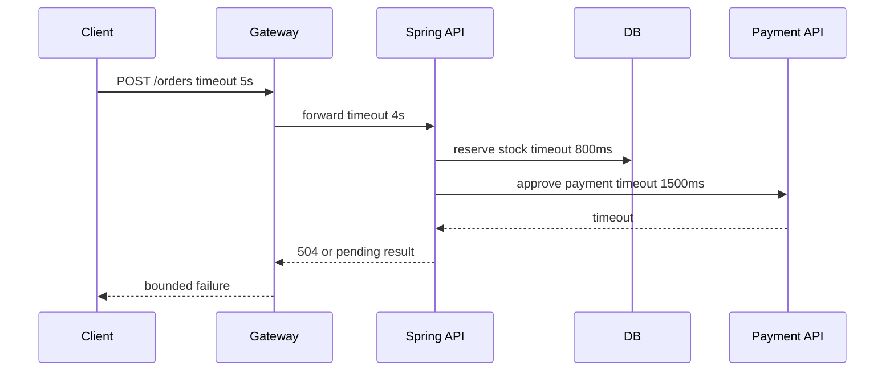

>[!success] 이 문서를 통해 아래 질문들에 답할 수 있게 됩니다.
>- Timeout은 왜 한 곳이 아니라 계층별로 설계해야 하는가?
>- API timeout, DB timeout, 외부 API timeout의 순서는 어떻게 잡아야 하는가?
>- Timeout 설정이 장애 전파와 사용자 경험에 어떤 영향을 주는가?

## 개요

Timeout은 “실패를 빨리 내기 위한 설정”이 아니라 시스템이 얼마나 오래 자원을 붙잡을지 정하는 설계 계약이다.

Spring API 하나는 client, gateway, controller thread, DB connection, 외부 API client, message consumer를 거칠 수 있다. 어느 한 지점에서 timeout이 없거나 너무 길면 요청이 이미 실패한 뒤에도 내부 작업이 계속 남아 스레드와 커넥션을 잡는다.

Timeout 계층 설계의 목표는 모든 작업을 성공시키는 것이 아니다. 정해진 시간 안에 성공하지 못하는 작업을 끊어 영향 범위를 제한하는 것이다.

## 기본 원리

Timeout은 바깥에서 안쪽으로 갈수록 짧아지는 것이 일반적이다.

```text
Client timeout        5s
API Gateway timeout   4s
Spring API budget     3s
External API timeout  1.5s
DB query timeout      1s
```

이 순서가 깨지면 이상한 일이 생긴다. 예를 들어 gateway가 3초에 응답을 끊는데 Spring 내부의 결제 API timeout이 10초라면, 사용자는 이미 실패를 받았지만 서버는 7초 더 외부 API를 기다릴 수 있다.

Timeout은 단순 숫자보다 시간 예산으로 봐야 한다. 하나의 API가 DB 조회 1회, 외부 API 1회, Redis 조회 1회를 한다면 전체 3초 안에서 각 의존성이 쓸 수 있는 시간을 나눠야 한다.

## 요청 흐름 예시



이 흐름에서 결제 API가 느려졌을 때 중요한 것은 결제가 성공할 가능성만이 아니다. 재고 lock, DB connection, servlet thread가 얼마나 오래 잡히는지도 같이 봐야 한다.

## Spring에서 드러나는 위치

HTTP client timeout은 외부 API client에 명시한다.

```java
@Bean
RestClient paymentRestClient(RestClient.Builder builder) {
    ClientHttpRequestFactorySettings settings = ClientHttpRequestFactorySettings.DEFAULTS
        .withConnectTimeout(Duration.ofMillis(300))
        .withReadTimeout(Duration.ofMillis(1500));

    return builder
        .requestFactory(ClientHttpRequestFactories.get(settings))
        .baseUrl("https://payment.example.com")
        .build();
}
```

DB query timeout은 transaction timeout과 query timeout을 분리해서 본다.

```java
@Transactional(timeout = 2)
public PaymentPrepareResult preparePayment(Order order) {
    stockRepository.reserve(order.items());
    return paymentPrepareRepository.save(order.toPrepareRequest());
}
```

`@Transactional(timeout = 2)`는 비즈니스 트랜잭션 전체 시간에 대한 제한이다. 외부 HTTP 호출을 이 트랜잭션 안에 넣으면 DB lock과 connection이 외부 API 지연에 묶일 수 있다.

## 설계 판단 기준

| 판단 항목 | 확인 질문 | 기준 |
| --- | --- | --- |
| 사용자 대기 | 사용자가 몇 초까지 기다릴 수 있는가? | 동기 API는 보통 짧고, 처리 결과 조회 API를 별도로 둘 수 있다. |
| 의존성 비용 | 느린 동안 무엇을 붙잡는가? | thread, connection, lock, memory, queue slot을 확인한다. |
| 실패 응답 | timeout 후 무엇을 반환할 것인가? | 실패, pending, 재조회 링크, 보상 상태 중 하나를 정한다. |
| 재시도 가능성 | timeout 뒤 다시 보내도 안전한가? | 쓰기 요청은 idempotency key가 필요하다. |
| 관측 | 어디에서 시간이 사라졌는가? | client, gateway, app, DB, external span을 나눠 본다. |

Timeout 값은 라이브러리 기본값에 맡기면 안 된다. 기본값은 서비스의 SLO, 트래픽, 의존성 특성을 모른다.

## Timeout과 사용자 경험

Timeout이 발생했을 때 응답은 세 가지 중 하나로 설계한다.

- 명확한 실패: 작업이 수행되지 않았다고 보장할 수 있을 때 사용한다.
- 처리 중: 작업이 시작되었지만 결과를 아직 확정할 수 없을 때 사용한다.
- 부분 성공: 핵심 작업은 성공했고 부가 작업만 실패했을 때 사용한다.

결제 API에서 timeout이 났다고 해서 결제가 실패했다고 단정하면 위험하다. 외부 PG는 승인했지만 응답만 유실되었을 수 있다. 이 경우에는 idempotency key와 결제 상태 조회 API가 필요하다.

```http
HTTP/1.1 202 Accepted
Location: /api/payments/pay_123/status
```

이 응답은 “성공”을 말하지 않는다. 대신 사용자가 확인할 수 있는 다음 경로를 제공한다.

## 위험 신호!

- 외부 API timeout이 API 전체 timeout보다 길다.
- DB transaction 안에서 외부 HTTP 호출을 오래 기다린다.
- timeout 예외를 모두 같은 500으로 처리해 원인 구분이 안 된다.
- client가 timeout 후 같은 쓰기 요청을 다시 보낼 수 있는데 idempotency key가 없다.
- timeout 지표가 dependency별로 나뉘지 않아 어느 계층이 느린지 모른다.

## 실전 팁

- connect timeout과 read timeout을 분리한다. 연결 자체가 안 되는 문제와 응답이 느린 문제는 원인이 다르다.
- timeout은 retry 횟수와 함께 계산한다. `1.5초 timeout * 3회 retry`는 최악의 경우 4.5초 이상을 쓴다.
- batch나 consumer에도 timeout을 둔다. 사용자 요청이 아니어도 worker thread와 queue slot은 자원이다.
- timeout이 너무 짧으면 정상적인 느린 요청을 실패로 만든다. p95, p99 latency와 SLO를 보고 정한다.
- timeout 뒤 보상 작업이 필요한지 확인한다. 특히 외부 결제, 배송 접수, 포인트 적립은 상태 조회나 취소 경로가 필요하다.

## 확인 질문

- 확인 질문: 외부 API timeout이 gateway timeout보다 길면 어떤 문제가 생기는가?
	- 답변: 사용자는 이미 실패 응답을 받았는데 Spring 서버는 외부 API를 계속 기다리며 thread와 connection을 붙잡을 수 있다.
- 확인 질문: 결제 timeout을 단순 실패로 처리하면 위험한 이유는 무엇인가?
	- 답변: 외부 PG에서는 승인되었지만 응답만 유실되었을 수 있어 중복 결제나 상태 불일치가 생길 수 있기 때문이다.
- 확인 질문: timeout 값을 정할 때 함께 봐야 하는 것은 무엇인가?
	- 답변: 전체 API SLO, retry 횟수, downstream p95/p99 latency, 붙잡는 자원, timeout 후 사용자 응답 계약이다.

## 참고 문서

- [AWS Builders Library, Timeouts, Retries, and Backoff with Jitter](https://aws.amazon.com/builders-library/timeouts-retries-and-backoff-with-jitter/)
- [Google SRE Book, Handling Overload](https://sre.google/sre-book/handling-overload/)
- [Resilience4j TimeLimiter](https://resilience4j.readme.io/docs/timeout)
