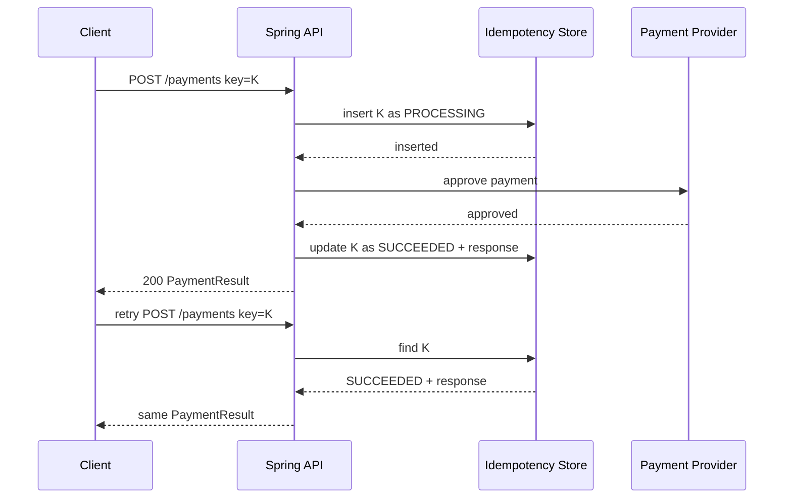

>[!success] 이 문서를 통해 아래 질문들에 답할 수 있게 됩니다.
>- Idempotency key는 request id와 무엇이 다른가?
>- 같은 쓰기 요청이 두 번 들어왔을 때 서버는 어떤 응답을 해야 하는가?
>- 결제, 주문, 포인트 같은 side effect를 중복 실행하지 않으려면 어떤 저장소와 API 계약이 필요한가?

## 개요

Idempotency key는 “같은 비즈니스 의도”를 식별하는 key다.

클라이언트가 결제 요청을 보냈는데 네트워크 timeout이 발생했다고 하자. 클라이언트는 결제가 실패했는지, 서버는 처리했지만 응답만 유실되었는지 알 수 없다. 이때 같은 요청을 다시 보내면 서버는 새 결제를 만들지 않고 이전 처리 결과를 찾아 반환해야 한다.

이 계약이 없으면 retry는 중복 결제, 중복 주문, 중복 포인트 적립으로 바뀐다.

## Request ID와 Idempotency Key

둘은 목적이 다르다.

| 구분 | 목적 | 재시도 때 값 |
| --- | --- | --- |
| Request ID | 로그 추적과 correlation | 보통 매 요청마다 달라진다. |
| Idempotency Key | 같은 비즈니스 의도 중복 방지 | 같은 의도라면 재시도해도 같아야 한다. |

예를 들어 사용자가 같은 장바구니를 결제하려는 시도는 하나의 idempotency key를 가진다. 그러나 사용자가 결제 실패 후 상품을 바꾸고 새로 결제한다면 새 key가 필요하다.

```http
POST /api/payments
Idempotency-Key: payment:user-42:cart-9001:v1
```

key에 user, cart, operation, version을 포함할 수 있다. 다만 key는 추측하기 쉬운 값만으로 만들면 안 되고, 서버에서 사용자 소유권을 반드시 검증해야 한다.

## 저장해야 하는 것

Idempotency store에는 최소한 다음 정보를 저장한다.

| 필드 | 의미 |
| --- | --- |
| `key` | 클라이언트가 보낸 idempotency key |
| `request_hash` | 같은 key로 다른 payload를 보내는 실수를 막기 위한 hash |
| `status` | `PROCESSING`, `SUCCEEDED`, `FAILED` |
| `response_body` | 성공 또는 확정 실패 응답 재사용 |
| `resource_id` | 생성된 결제, 주문, 포인트 적립 id |
| `expires_at` | key 보존 기간 |

같은 key로 다른 payload가 들어오면 새 요청으로 처리하면 안 된다. 보통 `409 Conflict` 또는 `422 Unprocessable Entity`로 거절한다.

```sql
CREATE TABLE idempotency_keys (
    key varchar(200) PRIMARY KEY,
    request_hash varchar(64) NOT NULL,
    status varchar(20) NOT NULL,
    resource_id varchar(100),
    response_body jsonb,
    expires_at timestamp NOT NULL,
    created_at timestamp NOT NULL
);
```

핵심은 `key`에 unique constraint가 있어야 한다는 점이다. 애플리케이션 메모리 lock만으로는 여러 인스턴스 동시 요청을 막기 어렵다.

## 처리 흐름



중간에 서버가 죽으면 `PROCESSING` 상태가 남을 수 있다. 이 상태를 어떻게 처리할지 정해야 한다.

- 짧은 시간 안에는 `409 Conflict`와 `Retry-After`를 반환한다.
- 외부 provider에 상태 조회 API가 있으면 조회 후 store를 보정한다.
- 오래된 `PROCESSING`은 보상 job이 확인하고 실패 또는 성공으로 확정한다.

## Spring 코드 경계

Service 경계에서 idempotency를 잡는다.

```java
@Transactional
public PaymentResult pay(PaymentCommand command, String key) {
    IdempotencyRecord record = idempotencyRepository.tryStart(
        key,
        command.payloadHash(),
        Duration.ofHours(24)
    );

    if (record.isCompleted()) {
        return record.toPaymentResult();
    }

    PaymentResult result = paymentClient.approve(command.toRequest());
    paymentRepository.save(result.toEntity());
    idempotencyRepository.complete(key, result);
    return result;
}
```

실제 구현에서는 `tryStart`가 unique constraint 충돌을 안전하게 처리해야 한다. 두 요청이 동시에 들어오면 하나만 `PROCESSING`을 만들고, 나머지는 기존 record를 읽어야 한다.

## 응답 계약

Idempotency는 성공 응답만 재사용하는 기능이 아니다. 처리 상태별 응답이 필요하다.

```http
HTTP/1.1 200 OK
Idempotency-Status: replayed
```

```http
HTTP/1.1 409 Conflict
Retry-After: 2
{
  "code": "PAYMENT_PROCESSING",
  "message": "Same payment request is still being processed."
}
```

```http
HTTP/1.1 422 Unprocessable Entity
{
  "code": "IDEMPOTENCY_KEY_PAYLOAD_MISMATCH"
}
```

이 응답들이 있어야 클라이언트가 무작정 다시 보내지 않고 조회, 대기, 새 key 발급 중 하나를 선택할 수 있다.

## TTL과 보존 기간

Idempotency key는 무한히 저장하지 않는다. 하지만 너무 짧아도 위험하다.

- 결제 승인: PG timeout과 사용자 재시도 시간을 고려해 24시간 이상을 검토한다.
- 주문 생성: 주문 중복 방지 요구에 따라 수 시간에서 수 일을 둔다.
- 좋아요, 북마크: DB unique constraint로 영구 멱등성을 보장할 수도 있다.

TTL이 지난 뒤 같은 key가 들어오면 서버는 새 요청으로 처리할지, 만료 오류를 반환할지 정해야 한다. 결제처럼 위험한 작업은 만료 후 재사용을 거절하는 편이 안전하다.

## 위험 신호!

- 같은 idempotency key로 다른 payload를 허용한다.
- key를 Redis에만 저장하고 DB side effect와 원자적으로 묶지 않는다.
- 처리 중 상태가 영원히 남을 수 있는데 보상 job이 없다.
- 성공 응답은 저장하지만 실패 응답과 충돌 응답 계약이 없다.
- idempotency key를 사용자 소유권 검증 없이 전역 key처럼 사용한다.

## 실전 팁

- 쓰기 API 문서에 idempotency key 필수 여부를 명시한다.
- key는 클라이언트가 생성하되 서버가 payload hash와 사용자 id를 함께 검증한다.
- DB unique constraint를 최종 방어선으로 둔다.
- 외부 provider도 idempotency key를 지원하면 내부 key와 provider key의 매핑을 저장한다.
- 중복 요청 비율과 replay 응답 비율을 지표로 본다.

## 확인 질문

- 확인 질문: request id와 idempotency key의 차이는 무엇인가?
	- 답변: request id는 로그 추적용이고 idempotency key는 같은 비즈니스 의도를 중복 실행하지 않기 위한 계약이다.
- 확인 질문: 같은 key로 다른 payload가 들어오면 어떻게 해야 하는가?
	- 답변: 새 작업으로 처리하지 말고 payload mismatch로 거절해야 한다.
- 확인 질문: `PROCESSING` 상태가 오래 남으면 왜 위험한가?
	- 답변: 클라이언트는 계속 재시도하고 서버는 결과를 확정하지 못해 사용자와 데이터 상태가 불명확해지기 때문이다.

## 참고 문서

- [Stripe API, Idempotent Requests](https://docs.stripe.com/api/idempotent_requests)
- [AWS Builders Library, Making retries safe with idempotent APIs](https://aws.amazon.com/builders-library/making-retries-safe-with-idempotent-APIs/)
- [PostgreSQL Documentation, Unique Constraints](https://www.postgresql.org/docs/current/ddl-constraints.html)
