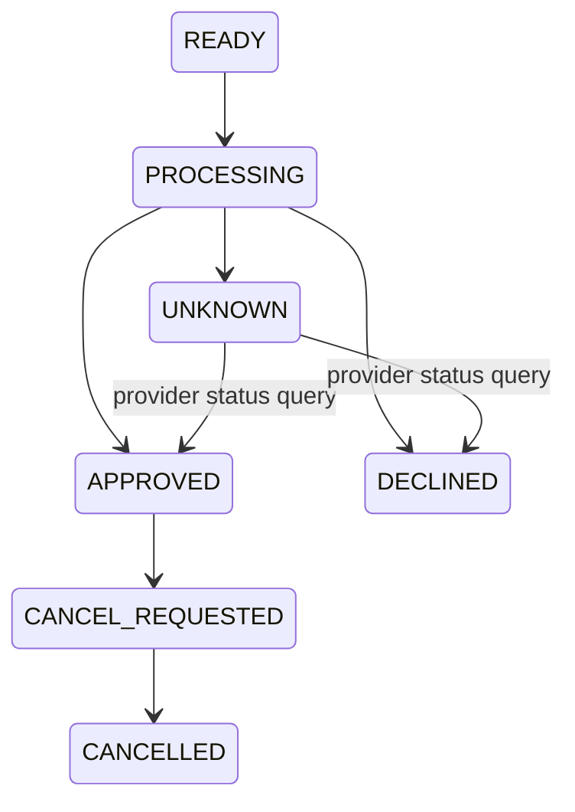

>[!success] 이 문서를 통해 아래 질문들에 답할 수 있게 됩니다.
>- 외부 API 호출을 내부 DB 트랜잭션 안에 넣으면 왜 위험한가?
>- 외부 API timeout 뒤 성공 여부를 모를 때 어떤 상태 모델이 필요한가?
>- 결제, 배송, 알림 provider 장애가 내부 서비스 장애로 번지지 않게 하려면 무엇을 설계해야 하는가?

## 개요

외부 API는 내 시스템 밖에 있는 실패 지점이다. latency, error rate, rate limit, 장애 공지, 응답 형식, 멱등성 지원 여부를 내가 완전히 통제할 수 없다.

따라서 외부 API 호출 안정성의 핵심은 “잘 호출하는 코드”가 아니라 “실패해도 내부 상태가 망가지지 않는 구조”다. 특히 Java/Spring 백엔드에서는 DB 트랜잭션, HTTP client timeout, retry, idempotency, circuit breaker 경계를 분리해야 한다.

결제 API를 예로 들면 timeout이 발생했을 때 결제가 실패했다고 단정할 수 없다. provider가 승인했지만 응답만 유실되었을 수 있다. 이 경우 내부 주문 상태는 `PAYMENT_UNKNOWN`처럼 확인 가능한 중간 상태를 가져야 한다.

## 외부 API 호출의 실패 종류

| 실패 | 의미 | 대응 |
| --- | --- | --- |
| connect timeout | provider에 연결하지 못함 | 짧은 retry 가능 |
| read timeout | 요청은 갔지만 응답을 못 받음 | 상태 불명확, 조회 API 필요 |
| 4xx | 요청 문제 또는 비즈니스 거절 | 대부분 retry 금지 |
| 429 | provider 제한 | `Retry-After` 준수, rate limit 조정 |
| 5xx | provider 내부 오류 | 제한된 retry, circuit breaker |
| malformed response | 계약 불일치 | retry보다 격리와 알림 필요 |

가장 위험한 것은 read timeout이다. 요청이 provider에 도달했는지, provider가 처리했는지, 응답만 유실되었는지 알 수 없기 때문이다.

## 트랜잭션 경계

피해야 할 구조는 다음과 같다.

```java
@Transactional
public void pay(Order order) {
    orderRepository.markPaying(order.id());
    PaymentResult result = paymentClient.approve(order.paymentRequest());
    orderRepository.markPaid(order.id(), result.paymentId());
}
```

이 코드는 단순하지만 위험하다.

- 외부 API가 느리면 DB transaction이 길어진다.
- lock과 connection이 외부 provider latency에 묶인다.
- timeout 발생 시 DB 상태와 provider 상태를 동시에 확정하기 어렵다.
- retry하면 provider side effect가 중복될 수 있다.

더 나은 구조는 내부 상태 변경과 외부 호출을 단계로 나누는 것이다.

```java
public PaymentResult pay(PaymentCommand command, String key) {
    PaymentAttempt attempt = paymentAttemptService.createAttempt(command, key);

    try {
        PaymentApproval approval = paymentClient.approve(attempt.toProviderRequest());
        return paymentAttemptService.markApproved(attempt.id(), approval);
    } catch (PaymentTimeoutException ex) {
        paymentAttemptService.markUnknown(attempt.id());
        throw new PaymentPendingException(attempt.id());
    }
}
```

`createAttempt`와 `markApproved`는 각각 짧은 DB transaction으로 처리한다. 외부 API 호출은 긴 DB transaction 밖에서 수행한다.

## 상태 모델

외부 API가 있는 쓰기 작업은 성공/실패 두 상태만으로 부족하다.

```text
READY
PROCESSING
APPROVED
DECLINED
UNKNOWN
CANCEL_REQUESTED
CANCELLED
```

`UNKNOWN`은 실패가 아니라 확인이 필요한 상태다. provider 조회 API나 webhook으로 최종 상태를 확정해야 한다.



이 상태 모델이 없으면 timeout을 실패로 처리하거나 성공으로 처리하는 극단적인 선택만 남는다.

## Provider Idempotency

외부 provider가 idempotency key를 지원하면 반드시 사용한다.

```http
POST /provider/payments
Idempotency-Key: pay_attempt_1001
```

내부 idempotency key와 provider idempotency key를 매핑해 둔다.

```text
internal key: payment:user-42:cart-9001
attempt id: pay_attempt_1001
provider idempotency key: pay_attempt_1001
provider payment id: pg_7788
```

provider idempotency key가 없으면 내부에서 중복 호출을 막아도 provider가 이미 처리한 요청을 안전하게 재조회하기 어렵다.

## Circuit Breaker와 Rate Limit

외부 provider 장애는 내부 장애로 전파되기 쉽다. 특히 결제, 배송, 문자 발송 provider는 latency가 길어지면 thread pool을 붙잡는다.

```yaml
resilience4j:
  circuitbreaker:
    instances:
      paymentProvider:
        failure-rate-threshold: 50
        slow-call-rate-threshold: 50
        slow-call-duration-threshold: 2s
        wait-duration-in-open-state: 30s
  ratelimiter:
    instances:
      paymentProvider:
        limit-for-period: 100
        limit-refresh-period: 1s
```

Circuit breaker는 provider가 이미 불안정할 때 호출을 줄인다. Rate limiter는 정상 상황에서도 provider 계약량을 넘지 않게 한다.

## Webhook과 상태 조회

외부 API는 동기 응답만 믿으면 안 된다. webhook이나 status query를 함께 설계한다.

```java
@PostMapping("/webhooks/payments")
public ResponseEntity<Void> handleWebhook(@RequestBody PaymentWebhook webhook) {
    paymentStatusService.applyProviderStatus(
        webhook.paymentId(),
        webhook.status(),
        webhook.eventId()
    );
    return ResponseEntity.ok().build();
}
```

Webhook도 중복 전송될 수 있다. `eventId` unique constraint나 provider event id 저장소가 필요하다.

## 운영 지표

외부 API별로 다음 지표를 분리한다.

- provider latency p95, p99
- connect timeout 수
- read timeout 수
- 4xx, 429, 5xx 비율
- circuit breaker open count
- unknown 상태 건수와 체류 시간
- webhook 지연과 중복 이벤트 수

특히 `UNKNOWN` 상태가 쌓이면 단순 API 장애가 아니라 사용자 돈이나 주문 상태가 불명확한 운영 사고가 될 수 있다.

## 위험 신호!

- 외부 API 호출이 DB transaction 안에 있다.
- provider timeout을 무조건 실패로 확정한다.
- provider가 idempotency key를 지원하는데 사용하지 않는다.
- webhook 중복 처리를 하지 않는다.
- 외부 API별 timeout, error, rate limit 지표가 없다.

## 확인 질문

>[!question] 확인 질문
>- 확인 질문: 외부 API read timeout이 connect timeout보다 위험한 이유는 무엇인가?
>	- 답변: 요청이 provider에 도달해 처리되었을 수 있어 성공인지 실패인지 내부에서 확정할 수 없기 때문이다.
>- 확인 질문: 외부 API 호출을 DB transaction 안에 오래 두면 어떤 비용이 생기는가?
>	- 답변: DB connection, lock, transaction 시간이 provider latency에 묶여 내부 장애로 전파될 수 있다.
>- 확인 질문: `UNKNOWN` 상태가 필요한 이유는 무엇인가?
>	- 답변: timeout 뒤 결과를 확정할 수 없는 작업을 실패나 성공으로 잘못 처리하지 않고 재조회나 webhook으로 보정하기 위해서다.
>
## 참고 문서

- [AWS Builders Library, Timeouts, Retries, and Backoff with Jitter](https://aws.amazon.com/builders-library/timeouts-retries-and-backoff-with-jitter/)
- [Stripe API, Idempotent Requests](https://docs.stripe.com/api/idempotent_requests)
- [Resilience4j CircuitBreaker](https://resilience4j.readme.io/docs/circuitbreaker)
