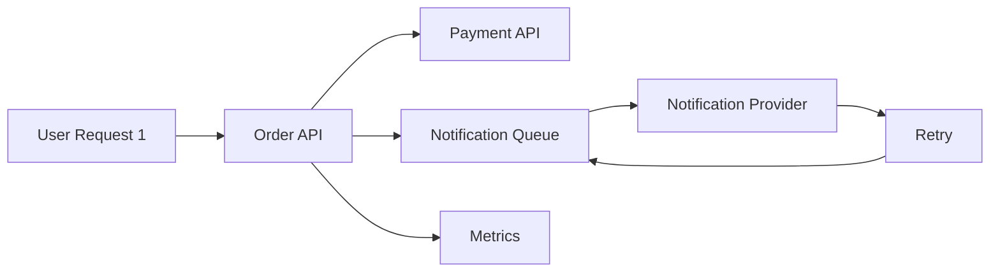

>[!success] 이 문서를 통해 아래 질문들에 답할 수 있게 됩니다.
>- 장애 중 retry, fanout, queue replay가 왜 부하를 더 키울 수 있는가?
>- 호출 설계에서 장애 전파와 장애 증폭을 어떻게 구분하는가?
>- 장애 중 무엇을 줄이고, 무엇을 멈추고, 무엇을 나중에 재처리해야 하는가?

## 개요

장애 전파는 한 의존성의 실패가 다른 기능까지 느리게 만드는 현상이다. 장애 증폭은 실패를 복구하려는 retry, replay, fanout이 오히려 트래픽을 늘려 장애를 키우는 현상이다.

예를 들어 외부 알림 provider가 느려졌을 때 모든 요청이 즉시 retry하면 provider는 더 느려진다. 실패한 메시지를 consumer가 계속 재처리하면 queue lag가 늘고 DB에도 중복 조회가 쏟아진다. 장애가 끝난 뒤 backlog를 한 번에 replay하면 정상 트래픽과 복구 트래픽이 충돌한다.

장애 증폭을 막는 설계는 “성공률을 높이는 설계”가 아니라 “실패 중에도 부하를 제한하는 설계”다.

## 증폭이 생기는 대표 구조

| 구조 | 왜 증폭되는가 | 방어 |
| --- | --- | --- |
| 즉시 retry | 실패 요청이 곧바로 추가 요청이 된다. | backoff, jitter, retry budget |
| fanout 호출 | 요청 하나가 여러 downstream 호출로 늘어난다. | bulkhead, partial response, async fanout |
| queue replay | 실패 메시지가 짧은 간격으로 반복 처리된다. | delayed retry, DLQ, retry topic |
| batch 재시작 | 중단된 대량 작업이 피크 시간에 다시 돈다. | rate control, checkpoint, off-peak replay |
| client 재시도 | 사용자 단말과 서버가 동시에 retry한다. | 202 status, Retry-After, idempotency key |

장애 상황에서는 “어떻게 더 많이 처리할까?”보다 “무엇을 잠시 덜 처리할까?”가 먼저다.

## 호출 그래프에서 보는 방법



이 구조에서 notification provider가 장애라면 주문 생성까지 실패시킬 필요가 없다. 주문 저장과 결제는 핵심 경로이고, 알림은 queue에 남겼다가 provider 회복 뒤 처리할 수 있다.

하지만 consumer가 실패 메시지를 즉시 retry하면 broker와 provider를 계속 압박한다. 이때는 retry 간격을 늘리거나 DLQ로 보내야 한다.

## Retry Storm 계산

간단한 계산만 해도 위험을 볼 수 있다.

```text
정상 요청 = 2,000 QPS
외부 API 호출 비율 = 요청당 1회
외부 API 실패율 = 60%
서버 retry = 최대 2회
클라이언트 retry = 최대 1회

최악 downstream 시도 수
= 2,000 * (1 + 서버 retry 2회) * (1 + 클라이언트 retry 1회)
= 12,000 attempts/s
```

정상 2,000 QPS 시스템이 장애 중 12,000 attempts/s를 만들 수 있다. 이것이 retry storm이다.

Retry 횟수만 보는 것이 아니라 client, gateway, server, queue consumer가 각각 retry하는지 합산해야 한다.

## 줄일 것과 멈출 것

장애 중에는 기능을 네 단계로 나눈다.

| 단계 | 처리 방식 | 예시 |
| --- | --- | --- |
| 핵심 유지 | 짧은 timeout과 최소 의존성으로 유지 | 주문 조회, 로그인 |
| 기능 축소 | fallback이나 cached response 반환 | 배송 추적 숨김 |
| 대기 처리 | queue에 저장하고 나중에 처리 | 이메일, 푸시, 통계 |
| 즉시 거절 | 429, 503, waiting room | 비싼 검색, 대량 export |

모든 기능을 같은 우선순위로 살리려 하면 핵심 기능까지 같이 죽는다.

## Spring 경계 예시

부가 기능 실패가 핵심 요청을 실패시키지 않게 분리한다.

```java
public OrderResult createOrder(OrderCommand command) {
    Order order = orderService.saveOrder(command);
    paymentService.approve(order.paymentCommand());
    notificationOutbox.save(NotificationRequested.from(order));
    return OrderResult.accepted(order.id());
}
```

알림 provider 호출을 요청 스레드에서 직접 하지 않고 outbox나 queue로 넘긴다. 이때 outbox 저장은 주문과 같은 DB transaction 안에서 처리할 수 있지만, provider 호출은 별도 worker가 담당한다.

Worker는 실패를 즉시 반복하지 않는다.

```java
public void handle(NotificationRequested message) {
    try {
        notificationClient.send(message);
        messageRepository.markDone(message.id());
    } catch (ProviderUnavailableException ex) {
        messageRepository.scheduleRetry(message.id(), nextAttemptWithJitter());
    } catch (InvalidRecipientException ex) {
        messageRepository.moveToDlq(message.id(), ex.reason());
    }
}
```

일시 장애와 영구 실패를 분리해야 한다. 잘못된 수신자 번호는 retry해도 성공하지 않으므로 DLQ나 실패 확정으로 보내야 한다.

## 장애 중 운영 스위치

기업 운영에서는 코드 변경 없이 부하를 줄일 수 있는 스위치가 필요하다.

```yaml
degradation:
  notification:
    enabled: false
  recommendation:
    use-cache-only: true
  payment:
    retry-max-attempts: 1
  export:
    rate-limit: 10/minute
```

이런 스위치는 평소에는 복잡해 보이지만, 장애 중에는 복구 시간을 줄인다. 단, 스위치 변경 권한과 감사 로그가 있어야 한다.

## Queue 적체 대응

Queue lag가 늘 때 consumer를 무작정 늘리면 안 된다.

먼저 확인할 것은 downstream이다.

- consumer가 DB를 병목으로 만들고 있는가?
- provider rate limit에 걸리고 있는가?
- retry 메시지가 정상 메시지를 밀어내고 있는가?
- DLQ로 보낼 영구 실패를 계속 retry하고 있는가?
- backlog replay가 피크 시간과 겹치는가?

consumer 증설은 downstream이 받을 수 있을 때만 효과가 있다. 그렇지 않으면 장애 위치가 broker에서 DB나 provider로 이동한다.

## 관측 지표

장애 증폭을 보려면 다음 지표를 함께 본다.

- original request QPS와 downstream attempt QPS의 비율
- retry attempt count
- retry 후 성공률
- circuit breaker open count
- queue lag와 oldest message age
- DLQ 증가량
- client 429, 503 비율
- fallback 응답 비율

`retry 후 성공률`이 낮은데 retry attempt가 많다면 retry를 줄여야 한다. 성공률이 낮은 retry는 회복이 아니라 부하다.

## 위험 신호!

- 장애가 나면 retry 횟수를 늘리는 것이 기본 대응이다.
- client retry와 server retry를 합산해 본 적이 없다.
- queue lag가 늘 때 consumer만 계속 늘린다.
- DLQ 기준이 없어 영구 실패 메시지가 계속 재처리된다.
- 장애 중 끌 수 있는 부가 기능 스위치가 없다.

## 실전 팁

- retry는 성공률 지표와 함께 운영한다.
- retry storm이 감지되면 retry를 줄이고 circuit breaker를 여는 것이 먼저일 수 있다.
- replay는 속도 제한을 걸고 피크 시간을 피한다.
- fallback은 사용자에게 제한된 기능임을 드러내야 한다.
- 장애 후에는 “왜 실패했나”뿐 아니라 “복구 시도가 부하를 얼마나 키웠나”를 회고한다.

## 확인 질문

>[!question] 확인 질문
>- 확인 질문: 장애 전파와 장애 증폭의 차이는 무엇인가?
>	- 답변: 장애 전파는 한 의존성 실패가 다른 기능까지 느리게 만드는 것이고, 장애 증폭은 retry와 replay가 부하를 늘려 장애를 키우는 것이다.
>- 확인 질문: queue lag가 늘 때 consumer를 바로 늘리면 위험한 이유는 무엇인가?
>	- 답변: downstream DB나 provider가 병목이면 consumer 증설이 그 병목을 더 세게 때려 장애 위치만 이동시킬 수 있기 때문이다.
>- 확인 질문: retry 후 성공률을 봐야 하는 이유는 무엇인가?
>	- 답변: retry가 실제로 일시 실패를 회복시키는지, 아니면 실패한 의존성에 부하만 추가하는지 판단하기 위해서다.
>
## 참고 문서

- [Google SRE Book, Handling Overload](https://sre.google/sre-book/handling-overload/)
- [Google SRE Book, Addressing Cascading Failures](https://sre.google/sre-book/addressing-cascading-failures/)
- [AWS Builders Library, Timeouts, Retries, and Backoff with Jitter](https://aws.amazon.com/builders-library/timeouts-retries-and-backoff-with-jitter/)
