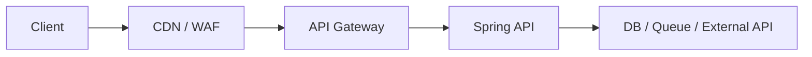

>[!success] 이 문서를 통해 아래 질문들에 답할 수 있게 됩니다.
>- Rate Limit은 남용 방지 외에 어떤 시스템 설계 문제를 해결하는가?
>- 제한 정책이 성능, 정합성, 장애 격리, 운영 복잡도를 어떻게 바꾸는가?
>- API 앞단, 애플리케이션, downstream 호출 중 어디에서 제한해야 하는가?

## 개요

Rate Limit은 "너무 많이 호출하면 막는다"는 단순 기능이 아니다. 시스템이 감당 가능한 속도 안에서 중요한 요청을 살리고, 비싼 요청과 반복 요청이 전체 장애를 만들지 않게 하는 설계 장치다.

검색 API를 예로 들면 모든 사용자를 무제한으로 받으면 DB, 검색 엔진, 캐시, 외부 API 비용이 먼저 포화된다. 반대로 너무 낮게 제한하면 정상 사용자가 서비스를 쓸 수 없다.

따라서 첫 질문은 "몇 QPS까지 받을까?"가 아니라 "무엇을 보호하고, 누구의 요청을 먼저 줄일 것인가?"다.

## 제한의 목적

| 목적 | 보호 대상 | 예시 |
| --- | --- | --- |
| 남용 방지 | 인증, 계정, 보안 | 로그인 시도 IP별 제한 |
| 공정성 | 사용자별 quota | 무료 사용자의 검색 60/min |
| 비용 보호 | 외부 API, LLM, SMS | API key별 일일 호출량 제한 |
| 장애 격리 | DB, queue, downstream | 결제 provider 장애 시 요청 제한 |
| 핵심 기능 보호 | 주문, 결제, 조회 | batch export보다 주문 API 우선 |

목적을 섞으면 정책이 흐려진다. 공격 방어용 제한은 엄격해야 하고, 비용 보호용 제한은 요금제와 연결되어야 하며, 장애 격리용 제한은 지표에 따라 동적으로 바뀔 수 있다.

## 제한 위치

Rate Limit은 여러 위치에 둘 수 있다.



| 위치 | 장점 | 비용 |
| --- | --- | --- |
| CDN/WAF | 앱까지 오기 전에 차단한다 | 업무 사용자 기준을 알기 어렵다 |
| API Gateway | 공통 정책을 한곳에서 관리한다 | 세밀한 업무 상태 판단은 어렵다 |
| Spring API | user, tenant, endpoint 상태를 반영한다 | 애플리케이션 자원을 이미 일부 사용한다 |
| Downstream client | 외부 API와 DB를 직접 보호한다 | 사용자는 이미 요청을 보낸 뒤다 |

실무에서는 한 위치만 고르지 않는다. 거친 제한은 앞단에서 하고, 업무 기준 제한은 애플리케이션에서 하며, 외부 의존성 보호는 client 경계에서 한다.

## 무엇을 바꾸는가

Rate Limit은 네 축을 동시에 바꾼다.

- 성능: 감당 불가능한 유입을 줄여 p95, p99 latency를 보호한다.
- 정합성: 쓰기 요청을 제한하면 중복 생성, 재고 oversell, 결제 중복 같은 위험을 줄일 수 있다.
- 장애 격리: 특정 사용자, tenant, endpoint 폭주가 전체 시스템으로 번지는 것을 막는다.
- 운영 복잡도: quota 저장소, 정책 버전, 예외 처리, dashboard, 고객 문의 대응이 필요해진다.

따라서 제한은 단순히 "막기"가 아니라 "어떤 요청을 살릴지"에 대한 정책이다.

## 알고리즘 큰 그림

| 알고리즘 | 특징 | 적합한 상황 |
| --- | --- | --- |
| Fixed Window | 구현이 쉽고 저장 비용이 낮다 | 단순한 분 단위 제한 |
| Sliding Window | 경계 시간 악용을 줄인다 | 로그인, 결제, 쿠폰 요청 |
| Token Bucket | 평균 제한 안에서 burst를 허용한다 | public API, 검색, 이벤트 오픈 |
| Leaky Bucket | 일정한 속도로 흘려보낸다 | downstream 처리 속도가 일정할 때 |
| Concurrency Limit | 동시에 처리 중인 요청 수를 제한한다 | 느린 외부 API, DB connection 보호 |

알고리즘은 정확도와 운영 비용의 trade-off다. 모든 요청을 초 단위로 정확히 세면 저장소 비용이 커지고, 너무 거칠게 세면 정책 경계에서 부하가 튄다.

## 이벤트 오픈 예시

이벤트 오픈 API가 있다고 하자.

```text
평소 트래픽 = 300 QPS
오픈 직후 예상 유입 = 20,000 QPS
주문 생성 처리 가능량 = 2,000 QPS
결제 provider 안전 처리량 = 1,500 QPS
```

이때 전체 API를 2,000 QPS로만 제한하면 결제 provider를 보호하지 못할 수 있다. 주문 생성은 2,000 QPS를 감당해도 결제 provider가 1,500 QPS에서 느려지면 checkout 전체가 밀린다.

정책은 다음처럼 나뉠 수 있다.

```text
CDN: 비정상 bot IP 차단
Gateway: 전체 이벤트 API 5,000 QPS 상한
Spring API: userId별 1초 1회 주문 시도 제한
Payment Client: provider별 1,500 QPS 이하로 제한
```

이 구조는 사용자 일부를 거절하지만 핵심 결제 경로를 살린다.

## Spring 경계 코드

Controller에서 제한 결과를 HTTP 계약으로 바꾸고, Service는 업무 처리를 맡는다.

```java
public ResponseEntity<?> createOrder(OrderRequest request, User user) {
    RateLimitResult result = orderRateLimiter.check("order:" + user.id());
    if (!result.allowed()) {
        return ResponseEntity.status(429)
            .header("Retry-After", String.valueOf(result.retryAfterSeconds()))
            .body(new ErrorResponse("RATE_LIMITED", "잠시 후 다시 시도해 주세요."));
    }
    return ResponseEntity.ok(orderService.create(request, user));
}
```

이 코드는 rate limit을 숨기지 않는다. 응답에 retry 정보를 포함해 클라이언트가 즉시 재시도하지 않도록 한다.

## Redis 저장소 판단

Rate Limit 상태는 보통 Redis 같은 중앙 저장소에 둔다. 여러 애플리케이션 인스턴스가 같은 사용자 limit을 공유해야 하기 때문이다.

Redis를 쓰면 다음 질문이 필요하다.

- key cardinality가 얼마나 커지는가?
- TTL이 누락되면 key가 계속 쌓이지 않는가?
- counter 증가와 TTL 설정이 원자적으로 처리되는가?
- Redis 장애 시 fail-open인가 fail-closed인가?
- region이 여러 개면 quota를 어떻게 나눌 것인가?

보안 로그인 제한은 Redis 장애 시 fail-closed가 맞을 수 있다. 일반 검색 API는 fail-open 후 downstream limit으로 보호하는 선택이 더 나을 수 있다.

## 위험 신호

- "전체 1000 QPS 제한"만 있고 사용자, endpoint, downstream별 기준이 없다.
- 429 비율만 보고 실제 사용자 전환율을 보지 않는다.
- Redis 장애 시 모든 요청을 허용할지 차단할지 정하지 않았다.
- 내부 batch와 사용자 API가 같은 quota를 공유한다.
- 제한 정책 변경이 배포 없이 가능한지, 감사 로그가 남는지 모른다.

## 개인 프로젝트 기준

- 최소 하나의 API에 제한 목적과 기준 key를 명시한다.
- `Retry-After`가 포함된 429 응답을 구현한다.
- Redis 없이 메모리 제한을 쓴다면 단일 인스턴스 한계와 전환 조건을 적는다.
- 과한 제한과 제한 없음의 장애 시나리오를 둘 다 설명한다.

## 기업 운영 기준

- 정책별 owner, 변경 승인, 긴급 해제 절차를 둔다.
- 429 rate, allowed rate, blocked principal, downstream latency를 함께 본다.
- 정책 변경은 feature flag나 configuration으로 추적 가능하게 한다.
- VIP, 내부 batch, partner API 예외 정책을 감사 가능하게 관리한다.
- 고객 문의에 설명할 수 있는 quota와 reset 기준을 문서화한다.

## 확인 질문

>[!question] 확인 질문
>- 확인 질문: Rate Limit의 목적을 먼저 정해야 하는 이유는 무엇인가?
>	- 답변: 남용 방지, 비용 보호, 장애 격리, 공정성 중 무엇을 목표로 하느냐에 따라 제한 기준과 실패 응답이 달라지기 때문이다.
>- 확인 질문: 제한을 Spring API 안에만 두면 어떤 한계가 있는가?
>	- 답변: 요청이 이미 애플리케이션 자원을 사용한 뒤라 L7 앞단의 대량 유입이나 bot 트래픽을 충분히 줄이지 못할 수 있다.
>- 확인 질문: Redis 장애 시 fail-open과 fail-closed를 정해야 하는 이유는 무엇인가?
>	- 답변: 제한 저장소 장애가 전체 서비스 허용이나 전체 차단으로 바뀔 수 있으므로 업무 위험에 맞는 기본 동작이 필요하다.
>
## 참고 문서

- [Google SRE Book, Handling Overload](https://sre.google/sre-book/handling-overload/)
- [Redis Documentation](https://redis.io/docs/latest/)
- [AWS Architecture Center](https://aws.amazon.com/architecture/)
