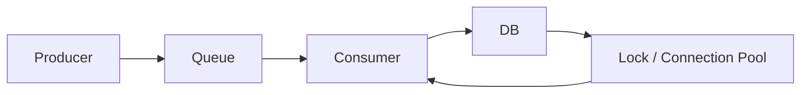

>[!success] 이 문서를 통해 아래 질문들에 답할 수 있게 됩니다.
>- Backpressure는 Rate Limit과 어떻게 다르고, 언제 producer를 늦춰야 하는가?
>- Queue 적체가 성능, 정합성, 장애 격리, 운영 복잡도를 어떻게 바꾸는가?
>- queue depth, oldest age, 처리량을 보고 어떤 완화 조치를 선택해야 하는가?

## 개요

Backpressure는 처리자가 감당할 수 없는 유입을 상류로 되돌려 보내는 설계다. Rate Limit이 "요청을 얼마나 받을지"에 가깝다면, Backpressure는 "현재 처리 상태를 보고 더 받을지, 늦출지, 거절할지"를 결정한다.

Queue가 있으면 모든 요청을 받아도 되는 것처럼 보인다. 하지만 처리량보다 유입량이 계속 크면 queue는 장애를 해결하지 않고 지연시킬 뿐이다. 오래된 작업이 쌓이고, retry가 늘고, 사용자는 이미 의미 없는 결과를 늦게 받는다.

## Rate Limit과 Backpressure

| 구분 | Rate Limit | Backpressure |
| --- | --- | --- |
| 기준 | 사전에 정한 quota와 정책 | 현재 시스템 처리 상태 |
| 목적 | 남용, 비용, 공정성, 보호 | 과부하 전파 차단 |
| 신호 | 요청 수, 사용자, API key | queue depth, oldest age, worker latency |
| 응답 | 429, quota 안내 | 지연, 제한 강화, producer 중단, degraded mode |

둘은 같이 쓰인다. 평상시에는 rate limit이 과도한 사용자를 막고, 장애나 적체 중에는 backpressure가 전체 유입을 줄인다.

## Queue 적체의 의미

Queue depth가 100,000이라고 해서 항상 장애는 아니다. 중요한 것은 처리 속도와 작업의 유효 시간이다.

```text
queue depth = 100,000
consumer 처리량 = 5,000 msg/min
소진 예상 시간 = 20분
작업 유효 시간 = 5분
```

이 경우 depth는 20분 뒤에 비워질 수 있지만 작업은 이미 5분 뒤 의미를 잃는다. 단순 depth보다 oldest message age와 업무 유효 시간을 함께 봐야 한다.

## 적체 지표

최소한 다음 지표를 같이 본다.

- queue depth
- oldest message age
- enqueue rate
- dequeue rate
- processing latency
- retry rate
- DLQ count
- downstream timeout rate
- consumer saturation

`enqueue rate > dequeue rate`가 지속되면 적체는 계속 증가한다. 여기에 retry rate가 붙으면 같은 실패가 다시 queue를 채운다.

## 적체 계산

```text
유입 = 8,000 msg/min
처리 = 5,000 msg/min
순증 = 3,000 msg/min
현재 backlog = 60,000 msg
1시간 뒤 예상 backlog = 240,000 msg
```

이 계산은 "consumer를 몇 대 늘릴까?"보다 먼저 "계속 받아도 되는가?"를 묻게 만든다. downstream이 DB라면 consumer를 늘려도 DB lock과 connection만 더 압박할 수 있다.

## Backpressure 선택지

| 선택지 | 효과 | 비용 |
| --- | --- | --- |
| producer rate 제한 | 적체 증가를 늦춘다 | 신규 요청 일부를 거절한다 |
| consumer concurrency 증가 | 처리량을 늘릴 수 있다 | downstream 포화 위험이 있다 |
| 낮은 우선순위 drop | 핵심 작업을 살린다 | 일부 기능 결과가 사라진다 |
| delayed retry | 장애 중 재시도 폭주를 줄인다 | 완료 시간이 늦어진다 |
| degraded mode | 핵심 기능만 유지한다 | UX와 기능이 줄어든다 |
| queue 분리 | 장애 격리를 높인다 | 운영 복잡도가 늘어난다 |

Backpressure는 항상 고통스러운 선택이다. 하지만 선택하지 않으면 가장 느린 downstream이 전체 시스템의 처리량을 결정한다.

## Producer 제한

Queue가 쌓일 때 consumer만 늘리는 것은 위험할 수 있다.



DB가 병목이면 consumer를 늘려도 lock wait와 connection timeout이 늘 수 있다. 이때는 producer를 제한하거나 batch를 멈추고, 핵심 사용자 요청만 통과시켜야 한다.

## 우선순위 큐

모든 작업을 같은 queue에 넣으면 낮은 가치의 작업이 핵심 작업을 밀어낼 수 있다.

예를 들어 이벤트 기간에 다음 작업이 동시에 들어온다.

```text
주문 생성 후 재고 확정
영수증 이메일
추천 모델 로그 적재
관리자 대량 export
```

이 작업들은 같은 지연 허용치를 갖지 않는다. 재고 확정은 짧게 처리되어야 하고, 추천 로그는 drop 가능할 수 있으며, export는 낮은 우선순위 queue로 보내도 된다.

## 오래된 작업 버리기

Backpressure에는 거절뿐 아니라 폐기도 포함된다. 모든 메시지를 반드시 처리해야 한다는 가정은 위험하다.

버릴 수 있는 작업:

- 실시간 추천 로그
- 오래된 typing indicator
- 이미 만료된 쿠폰 알림
- 중복된 검색 index refresh

버리면 안 되는 작업:

- 결제 승인 결과
- 정산 이벤트
- 재고 차감
- 사용자에게 약속한 포인트 적립

폐기 가능 여부는 기술이 아니라 업무 약속이다.

## Spring 경계

HTTP 요청에서 queue 상태를 보고 받아들일지 결정할 수 있다.

```java
if (queueMetrics.oldestAgeSeconds("export") > 300) {
    return ResponseEntity.status(429)
        .header("Retry-After", "120")
        .body(new ErrorResponse("EXPORT_BUSY", "내보내기 요청이 많습니다."));
}
exportQueue.enqueue(command);
return ResponseEntity.accepted().body(new JobAccepted(jobId));
```

이 코드는 queue가 이미 늦어졌을 때 새 작업을 무조건 받지 않는다. 사용자는 즉시 실패 또는 지연 안내를 받고, 시스템은 오래된 작업을 더 쌓지 않는다.

## 장애 완화 순서

Queue 적체 알림이 왔을 때 순서는 중요하다.

1. 사용자 영향과 핵심 기능 영향 확인
2. enqueue rate와 dequeue rate 비교
3. oldest age와 작업 유효 시간 비교
4. downstream 오류율 확인
5. 낮은 우선순위 producer 제한
6. 안전하면 consumer scale out
7. retry 정책 완화 또는 DLQ 격리

원인 분석보다 유입 제어가 먼저일 때가 많다. 적체가 계속 증가하는 동안 원인만 찾으면 복구 시간이 길어진다.

## 위험 신호

- queue depth만 보고 oldest age를 보지 않는다.
- consumer를 늘릴 때 DB pool과 외부 API limit을 계산하지 않는다.
- retry가 실패 작업을 계속 queue 앞쪽으로 되돌린다.
- 낮은 우선순위 batch가 사용자 요청과 같은 queue를 쓴다.
- queue가 가득 찬 뒤에야 producer를 막는다.

## 개인 프로젝트 기준

- queue depth와 처리량 로그를 남긴다.
- 어떤 작업은 drop 가능하고 어떤 작업은 반드시 처리해야 하는지 적는다.
- queue 적체 시 새 요청을 거절하는 조건을 하나 둔다.
- consumer 증설 전 downstream 병목을 확인한다는 판단을 문서화한다.

## 기업 운영 기준

- queue별 owner, priority, oldest age SLO를 둔다.
- 적체 시 producer throttle과 batch stop runbook을 둔다.
- queue saturation, retry 폭주, downstream timeout을 같은 dashboard에서 본다.
- 낮은 우선순위 작업의 drop 정책과 감사 기준을 정한다.

## 확인 질문

- 확인 질문: Backpressure가 Rate Limit과 다른 점은 무엇인가?
	- 답변: Rate Limit은 사전 quota 중심이고, Backpressure는 현재 queue와 downstream 상태를 보고 유입을 늦추거나 거절하는 동적 보호다.
- 확인 질문: queue depth만으로 적체를 판단하면 부족한 이유는 무엇인가?
	- 답변: 처리량과 oldest age, 작업 유효 시간에 따라 같은 depth라도 정상 backlog일 수도 있고 이미 의미 없는 작업일 수도 있기 때문이다.
- 확인 질문: consumer를 늘리기 전에 확인해야 할 것은 무엇인가?
	- 답변: DB, 외부 API, lock, connection pool 같은 downstream이 추가 병렬 처리를 감당할 수 있는지 확인해야 한다.

## 참고 문서

- [Google SRE Book, Handling Overload](https://sre.google/sre-book/handling-overload/)
- [RabbitMQ Consumer Prefetch](https://www.rabbitmq.com/docs/consumer-prefetch)
- [AWS Well-Architected, Reliability Pillar](https://docs.aws.amazon.com/wellarchitected/latest/reliability-pillar/welcome.html)
