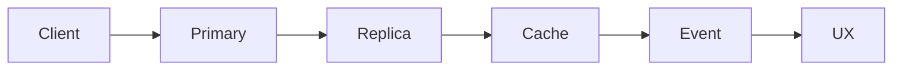

>[!success] 이 문서를 통해 아래 질문들에 답할 수 있게 됩니다.
>- `Read-after-write와 Monotonic Read`에서 먼저 확인해야 하는 요구사항은 무엇인가?
>- 이 선택은 성능, 정합성, 장애 격리, 운영 복잡도 중 무엇을 바꾸는가?
>- Java/Spring 백엔드에서 어떤 API 계약과 안전장치를 남겨야 하는가?

## 개요

`Read-after-write와 Monotonic Read`는 `Consistency Availability Partition`에서 분산 환경에서 어느 읽기 경험을 보장하고 어떤 불일치를 허용할지 정하는 흐름을 다루는 문서다.

사용자가 방금 쓴 값과 이전에 본 값이 뒤로 가지 않게 읽기 경로를 설계한다. 이 문서에서는 이 설명을 구현 팁으로 끝내지 않고, 어떤 요구사항이 어떤 구조 선택을 강제하는지 추적한다.

대표 상황은 다음과 같다. 주문 직후 상세 화면은 primary read를 사용하고 목록은 replica lag를 안내할 수 있다. 이 한 문장 안에는 사용자 경험, 트래픽 모양, 상태 owner, 실패 시 응답이 함께 들어 있다.

## 먼저 고정할 것

- `Read-after-write와 Monotonic Read`의 사용자 결과를 성공, 지연, 실패 상태로 나눠 적는다.
- 이 주제가 읽기 경로를 바꾸는지, 쓰기 경로를 바꾸는지, 외부 호출 경계를 바꾸는지 표시한다.
- 상태가 일시 상태인지 영속 상태인지 구분하고, 최종 진실의 원천을 하나로 정한다.
- 피크 트래픽, retry, batch, fanout이 한 컴포넌트에 몰리는지 확인한다.
- 사용자가 stale data, pending 상태, fallback 응답을 볼 수 있다면 API 계약에 명시한다.

## 요구사항 질문

| 질문 | 확인할 이유 | 설계 결정 |
| --- | --- | --- |
| 사용자는 언제 성공으로 느끼는가? | 동기 응답과 비동기 후속 작업을 나누기 위해서다. | 성공 응답, pending 응답, 재조회 API를 정한다. |
| 가장 비싼 경로는 어디인가? | 병목은 평균이 아니라 특정 경로에서 드러난다. | 캐시, queue, 제한, 격리 중 하나를 검토한다. |
| 중복 실행되면 안 되는 작업은 무엇인가? | retry와 메시지 재처리는 중복을 만든다. | idempotency key나 unique constraint를 둔다. |
| 늦게 반영되어도 되는 값은 무엇인가? | 정합성 비용을 낮출 수 있는 지점을 찾기 위해서다. | eventual consistency와 UX 안내를 정한다. |
| 장애 때 무엇을 포기할 것인가? | 모든 기능을 살리려 하면 전체 장애로 번진다. | fallback, degradation, 429, DLQ 정책을 고른다. |

`Read-after-write와 Monotonic Read`를 설계할 때 위 질문 중 하나라도 답하지 못하면 그림은 그럴듯해도 운영 기준이 비어 있을 가능성이 높다.

## 흐름 예시



이 흐름에서 중요한 것은 화살표 개수가 아니라 경계다. 동기 경계는 사용자 latency를 만들고, 비동기 경계는 중복과 재처리를 만들며, 상태 저장 경계는 복구 책임을 만든다.

## 계산과 정책 예시

```text
replica lag p95 = 800ms
주문 직후 상세 = primary read
목록 조회 = replica read 허용
stale 허용 시간 = 5s
초과 시 안내 또는 refresh
```

이 숫자는 설계 논의를 시작하는 기준선이다. 계산값이 작아도 특정 key, 특정 row, 특정 외부 API, 특정 partition에 몰리면 장애 양상은 전혀 달라진다.

## Spring 코드 경계

```java
ReadConsistency consistency = afterWrite ? PRIMARY : REPLICA_OK;
return orderQuery.find(orderId, consistency);
```

Spring 코드에서는 Controller, Service, Repository, Client의 책임을 분리한다. Controller는 HTTP 계약을 보여주고, Service는 트랜잭션과 idempotency를 잡고, Client는 timeout과 circuit breaker 같은 외부 의존성 정책을 숨기지 않는다.

## 안전장치

```text
policy = Read-after-write와 Monotonic Read
timeout = caller timeout보다 짧게
retry = 멱등성이 있는 경계에만 제한적으로
metric = 사용자 영향과 포화 지표를 함께 기록
rollback = 데이터 변경과 코드 변경을 분리
```

정책 예시는 정답이 아니라 리뷰 기준이다. 숫자는 요구사항, 피크 트래픽, 장애 허용 범위에 맞게 조정한다.

## 선택 기준과 trade-off

| 선택지 | 장점 | 비용 | 적합한 조건 |
| --- | --- | --- | --- |
| primary read | read-after-write가 쉽다 | primary 부하가 늘어난다 | 주문 상세, 결제 결과 |
| replica read | read 부하를 분산한다 | replica lag가 사용자에게 보인다 | 목록, 검색, 통계 |
| cache read | latency가 낮다 | stale data와 invalidation 문제가 생긴다 | 자주 읽고 덜 민감한 데이터 |
| UX 보상 | 불일치를 설명할 수 있다 | 제품 문구와 상태 관리가 필요하다 | eventual consistency를 허용할 때 |

`Read-after-write와 Monotonic Read`의 선택지는 성능만 비교하면 안 된다. 정합성, 장애 전파, 배포 난이도, 관측 지표까지 함께 비교해야 실제 운영 가능한 결정이 된다.

## 개인 프로젝트 기준

- `Read-after-write와 Monotonic Read`를 왜 도입했는지 한 문장으로 남긴다.
- 주문 직후 상세 화면은 primary read를 사용하고 목록은 replica lag를 안내할 수 있다.
- 최소한 timeout, 로그, 재현 가능한 실패 시나리오를 둔다.
- Redis, queue, replica, shard를 생략했다면 생략한 이유와 다음 전환 조건을 적는다.
- 포트폴리오 설명에서는 구현 코드보다 선택 이유와 trade-off를 먼저 말한다.

## 기업 운영 기준

- `replica lag, stale read rate, conflict count`를 dashboard와 alert 기준으로 연결한다.
- owner team, on-call, rollback 조건, 재처리 절차를 설계 문서에 둔다.
- 데이터 변경이 있으면 migration, backfill, old/new code 호환성을 분리한다.
- 외부 의존성이 있으면 timeout, retry, circuit breaker, fallback 품질을 리뷰한다.
- 장애 후에는 임시 완화와 근본 설계 변경을 따로 기록한다.

## 실전 팁

- `Read-after-write와 Monotonic Read`는 단독 패턴이 아니라 주변 경계와 함께 봐야 한다.
- 먼저 가장 단순한 구조를 그리고, 어떤 요구사항 때문에 복잡도가 필요한지 하나씩 추가한다.
- 도입한 컴포넌트마다 새로 생긴 실패 모드를 적는다.
- 성능 개선은 반드시 stale data, duplicate processing, retry amplification, hot partition 중 무엇을 만드는지 확인한다.
- 숫자가 불확실하면 가정을 노출하고 나중에 측정으로 갱신한다.

## 위험 신호!

- `Read-after-write와 Monotonic Read`가 필요한 이유를 트래픽이나 사용자 경험으로 설명하지 못한다.
- 성공 경로만 있고 timeout, retry, fallback, rollback이 없다.
- 상태 owner가 둘 이상인데 충돌 해결 기준이 없다.
- 평균 QPS만 보고 peak, burst, backlog, fanout을 계산하지 않는다.
- 운영자가 볼 지표와 장애 때 줄일 기능이 정해져 있지 않다.

## 확인 질문

- 확인 질문: `Read-after-write와 Monotonic Read`에서 가장 먼저 물어야 할 질문은 무엇인가?
	- 답변: 사용자가 성공으로 기대하는 결과와 실패했을 때 허용할 경험을 먼저 묻는다.
- 확인 질문: 이 주제가 바꾸는 설계 축은 무엇인가?
	- 답변: 분산 환경에서 어느 읽기 경험을 보장하고 어떤 불일치를 허용할지 정하는 흐름과 연결되며 성능, 정합성, 장애 격리, 운영 복잡도 중 하나 이상을 바꾼다.
- 확인 질문: 설계 리뷰에서 탈락해야 하는 답변은 무엇인가?
	- 답변: 기술 이름만 말하고 트래픽 계산, 상태 owner, 실패 모델, 관측 지표를 설명하지 못하는 답변이다.

## 참고 문서

- [Google SRE Book](https://sre.google/sre-book/table-of-contents/)
- [Designing Data-Intensive Applications](https://dataintensive.net/)
- [Martin Fowler](https://martinfowler.com/)
- [AWS Architecture Center](https://aws.amazon.com/architecture/)
