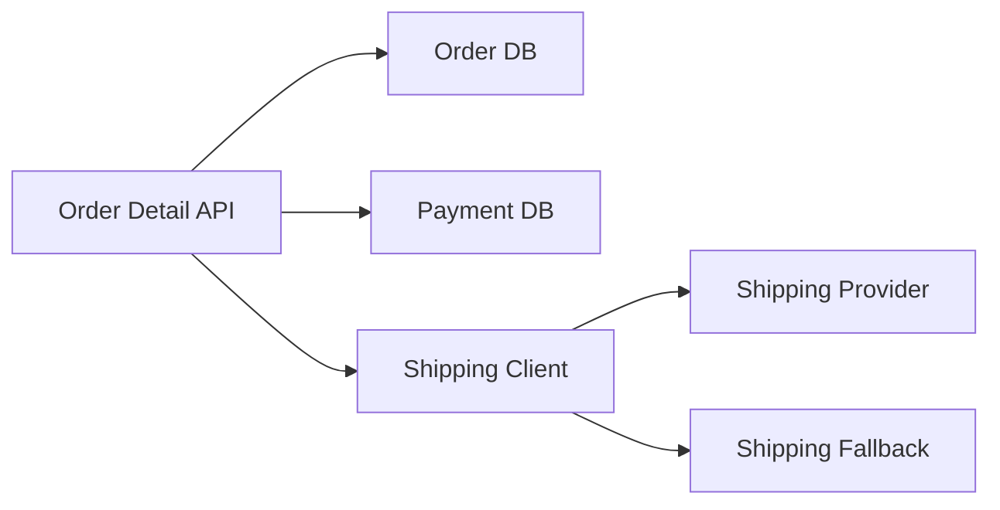

>[!success] 이 문서를 통해 아래 질문들에 답할 수 있게 됩니다.
>- Cascading Failure는 어떤 공유 리소스를 타고 전체 장애로 번지는가?
>- 장애 전파 방어가 성능, 정합성, 장애 격리, 운영 복잡도를 어떻게 바꾸는가?
>- 느린 외부 의존성을 발견했을 때 어떤 순서로 유입, 대기, 기능 축소를 판단해야 하는가?

## 개요

Cascading Failure는 한 컴포넌트의 장애가 호출자를 기다리게 만들고, 그 대기가 또 다른 리소스를 고갈시켜 정상 기능까지 실패시키는 현상이다.

배송 조회 API가 느려진 상황을 보자. 주문 상세 화면은 배송 상태를 같이 보여주기 위해 외부 배송 API를 호출한다. 배송 API가 5초씩 지연되면 주문 상세 스레드는 5초 동안 잡힌다. 트래픽이 늘면 웹 서버 스레드가 고갈되고, 같은 서버에서 처리하던 로그인이나 장바구니도 느려질 수 있다.

이 문제의 핵심은 배송 API 자체가 아니라 공유 리소스다. 같은 스레드 풀, 같은 connection pool, 같은 queue, 같은 retry 정책을 공유하면 부분 장애가 전체 장애로 바뀐다.

## 전파 경로

장애는 보통 다음 순서로 번진다.

```text
외부 API latency 증가
호출자 timeout 대기 증가
웹 스레드 점유 시간 증가
요청 queue 증가
connection pool 반환 지연
retry 증가
정상 API latency 증가
전체 5xx와 timeout 증가
```

이 흐름을 끊으려면 실패한 의존성만 보는 것이 아니라 그 의존성이 점유하는 공통 자원을 찾아야 한다.

## 설계 축 변화

| 축 | 장애 격리 전 | 장애 격리 후 |
| --- | --- | --- |
| 성능 | 느린 의존성이 전체 p99를 끌어올린다 | 일부 기능은 빠르게 fallback하거나 실패한다 |
| 정합성 | 모든 값을 실시간으로 가져오려 한다 | 일부 값은 stale, unknown, pending으로 표시한다 |
| 장애 격리 | 공유 스레드와 커넥션이 같이 고갈된다 | 의존성별 리소스와 실패 반경을 제한한다 |
| 운영 복잡도 | 구조는 단순하지만 장애가 크게 번진다 | timeout, breaker, bulkhead, fallback 지표를 운영한다 |

장애 격리는 성공률을 무조건 높이는 장치가 아니다. 일부 호출을 더 빨리 실패시키거나 축소 응답을 반환해 핵심 경로를 살리는 장치다.

## 배송 조회 예시

요구사항을 다음처럼 나눌 수 있다.

```text
주문 상태: 반드시 보여줘야 한다.
결제 상태: 반드시 최신이어야 한다.
배송 위치: 5분 정도 오래된 값이어도 된다.
추천 상품: 장애 시 숨겨도 된다.
```

이때 배송 API 장애가 주문 상세 전체를 실패시키면 설계가 잘못된 것이다. 주문 상태와 결제 상태는 내부 DB에서 보여주고, 배송 위치는 캐시된 값이나 "조회 지연"으로 표시할 수 있다.

## Mermaid 흐름



`Shipping Client`는 주문 상세 API 안의 부가 의존성이다. 이 의존성이 느려져도 `Order DB`와 `Payment DB` 조회를 막지 않게 timeout, circuit breaker, fallback을 둔다.

## 먼저 확인할 지표

장애 중에는 다음 지표를 함께 본다.

- 느려진 endpoint와 정상 endpoint의 p95, p99
- 외부 API latency와 error rate
- 웹 서버 active thread와 request queue
- connection pool active, pending acquire
- retry count와 retry 대상
- fallback rate
- circuit state 변화
- 사용자 영향 범위

외부 API error rate가 낮아도 slow call rate가 높으면 문제다. 오류보다 느린 성공이 더 위험할 수 있다.

## 즉시 완화

배송 API 지연이 전체 주문 상세을 느리게 만들고 있다면 다음 순서로 판단한다.

1. 배송 조회 timeout을 낮출 수 있는가?
2. 배송 조회 fallback을 켤 수 있는가?
3. 배송 조회 호출을 일시적으로 중단할 수 있는가?
4. 주문 상세 중 핵심 정보만 반환할 수 있는가?
5. retry를 줄이거나 끌 수 있는가?
6. 배송 조회용 bulkhead 크기를 낮출 수 있는가?

원인 분석보다 전파 차단이 먼저일 수 있다. 외부 provider가 복구될 때까지 기다리면 내부 시스템이 먼저 고갈된다.

## Timeout의 위치

Timeout은 모든 외부 호출의 기본이다.

```text
connect timeout = 300ms
read timeout = 800ms
overall timeout = 1s
API p95 target = 300ms
fallback allowed = true
```

timeout이 너무 길면 circuit breaker가 열리기 전에 스레드가 고갈된다. 너무 짧으면 정상적인 느린 응답도 실패로 처리된다. timeout은 사용자 latency 목표와 의존성 p95/p99를 보고 잡아야 한다.

## Retry와 전파

장애 전파에서 retry는 자주 증폭기 역할을 한다.

```text
원래 요청 1,000 rps
외부 API 실패
client retry 2회
실제 외부 호출 3,000 rps
```

Circuit Breaker 없이 retry를 켜면 장애 중인 provider를 더 세게 때리고, 호출자 스레드도 더 오래 잡는다. retry는 timeout, circuit breaker, bulkhead 뒤에서 제한적으로 써야 한다.

## 장애 격리 결정

| 의존성 | 장애 시 사용자 영향 | 격리 전략 |
| --- | --- | --- |
| 결제 승인 | 주문 성공 여부를 결정한다 | 짧은 timeout, 명확한 실패, idempotency |
| 배송 위치 | 부가 정보다 | fallback, 캐시, circuit breaker |
| 추천 상품 | 없어도 핵심 기능 가능 | 빠른 실패, 기능 숨김 |
| 정산 이벤트 | 사용자 응답 밖 후속 작업 | queue, DLQ, 재처리 |

모든 의존성에 같은 breaker와 fallback을 넣으면 부족하다. 업무 영향이 다르기 때문에 실패 처리도 달라야 한다.

## 위험 신호

- 외부 API timeout이 API 전체 latency 목표보다 길다.
- retry가 circuit breaker보다 먼저 대량으로 발생한다.
- 배송, 추천, 결제 호출이 같은 thread pool과 connection pool을 공유한다.
- fallback rate가 높은데 정상 성공으로만 집계된다.
- 장애 중 "provider가 느림"만 보고 내부 스레드 고갈을 보지 않는다.

## 개인 프로젝트 기준

- 외부 API 하나에 timeout과 fallback 정책을 명시한다.
- 느린 외부 API가 전체 API를 느리게 만드는 테스트를 재현한다.
- fallback 응답에 `degraded`나 `source` 같은 표시를 남긴다.
- retry 횟수와 timeout을 함께 설명한다.

## 기업 운영 기준

- 의존성별 latency, error, slow call, fallback 지표를 dashboard로 본다.
- 장애 중 끌 수 있는 부가 기능과 유지해야 하는 핵심 기능을 runbook에 둔다.
- retry, circuit breaker, bulkhead 설정 변경 이력을 남긴다.
- provider 장애와 내부 리소스 고갈을 같은 타임라인에 기록한다.

## 확인 질문

- 확인 질문: Cascading Failure가 단순 외부 API 장애보다 위험한 이유는 무엇인가?
	- 답변: 느린 의존성이 공통 스레드, connection, queue를 점유해 원래 정상인 기능까지 실패시키기 때문이다.
- 확인 질문: 장애 중 retry를 먼저 늘리면 왜 위험한가?
	- 답변: 실패한 의존성에 더 많은 호출을 보내고 호출자 리소스 점유 시간을 늘려 장애를 증폭할 수 있기 때문이다.
- 확인 질문: 배송 조회 fallback이 주문 상세 성공과 구분되어야 하는 이유는 무엇인가?
	- 답변: 사용자가 주문 자체는 정상이고 배송 부가 정보만 축소되었다는 사실을 이해해야 하기 때문이다.

## 참고 문서

- [Google SRE Book, Handling Overload](https://sre.google/sre-book/handling-overload/)
- [Martin Fowler, Circuit Breaker](https://martinfowler.com/bliki/CircuitBreaker.html)
- [AWS Well-Architected, Reliability Pillar](https://docs.aws.amazon.com/wellarchitected/latest/reliability-pillar/welcome.html)
