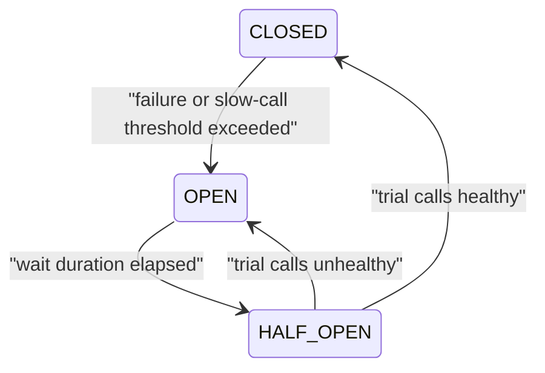

>[!success] 이 문서를 통해 아래 질문들에 답할 수 있게 됩니다.
>- Circuit Breaker의 상태 전환은 어떤 운영 판단을 자동화하는가?
>- failure rate, slow call rate, 최소 호출 수, open 유지 시간은 어떤 위험을 조절하는가?
>- breaker를 적용하면 성능, 정합성, 장애 격리, 운영 복잡도 중 무엇이 바뀌는가?

## 상태 모델의 목적

Circuit Breaker는 외부 시스템의 생사를 맞히는 도구가 아니다.

반복 실패와 느린 성공이 내부 리소스를 잠식하기 전에 호출을 멈추고, 제한된 호출로 회복 여부를 시험하는 상태 기계다.

예시는 `배송 추적 provider`다.

평소에는 주문 상세가 배송 provider를 호출해 현재 위치를 보여준다.

provider가 느려지면 주문 상세 API 스레드가 오래 묶이고, 주문 조회 전체가 느려질 수 있다.

breaker는 이때 배송 provider 호출을 잠시 차단해 주문 기본 정보는 계속 응답하게 만든다.

이 선택은 성능과 장애 격리를 개선하지만, 배송 정보의 최신성 표현과 운영 판단은 더 복잡하게 만든다.

## 세 가지 상태



`closed`는 평상시 상태다.

호출을 downstream으로 보내고, 성공·실패·느린 호출을 관측한다.

`open`은 차단 상태다.

downstream 호출을 보내지 않고 즉시 실패나 fallback으로 돌아간다.

`half-open`은 회복 시험 상태다.

모든 트래픽을 다시 열지 않고 일부 호출만 허용해 provider가 회복됐는지 본다.

## 상태별 운영 의미

| 상태 | 시스템 의미 | 운영자가 볼 것 |
| --- | --- | --- |
| closed | 의존성을 정상 사용 중 | 실패율, slow call rate, latency trend |
| open | 의존성 호출을 차단 중 | 사용자 축소 경험, fallback rate, 차단 지속 시간 |
| half-open | 제한된 회복 시험 중 | trial call 성공률, provider 회복 신호 |

상태 이름을 외우는 것보다 각 상태에서 사용자가 무엇을 보게 되는지 정하는 것이 중요하다.

open 상태에서 배송 추적이 비어도 주문 자체가 실패하면 안 된다.

half-open에서 시험 호출이 실패하면 사용자는 다시 축소 응답을 봐야 한다.

## failure rate 판단

failure rate는 호출 중 실패한 비율이다.

하지만 무엇을 실패로 볼지는 도메인마다 다르다.

| 실패 후보 | 보통 실패로 볼지 | 이유 |
| --- | --- | --- |
| connection error | 예 | 호출 자체가 성립하지 않았다. |
| timeout | 예 | 사용자 latency 목표를 넘겼다. |
| HTTP 500 | 예 | provider 처리 실패다. |
| HTTP 404 | 경우에 따라 다름 | 없는 배송 번호일 수 있다. |
| 검증 오류 | 보통 제외 | 요청 데이터 문제일 수 있다. |

도메인 오류를 모두 provider 실패로 세면 breaker가 잘못 열린다.

반대로 timeout을 실패로 세지 않으면 스레드 고갈 뒤에야 문제가 보인다.

## slow call 판단

느린 성공은 장애 격리에서 중요하다.

배송 provider가 3초 뒤 성공을 주더라도 주문 상세 목표가 500ms라면 사용자 경험은 이미 실패에 가깝다.

slow call threshold는 provider 평균이 아니라 호출자의 latency budget에서 나온다.

```text
주문 상세 p95 목표 = 500ms
주문 DB 조회 예산 = 150ms
결제 상태 조회 예산 = 100ms
배송 조회 예산 = 150ms
남는 여유 = 100ms
```

이 구조에서 배송 조회가 2초까지 기다려도 된다는 설정은 설계 목표와 맞지 않는다.

slow call을 세는 이유는 오류가 없을 때도 리소스 점유 시간이 장애를 만들기 때문이다.

## 최소 호출 수

최소 호출 수는 breaker가 너무 빨리 열리는 것을 막는다.

호출 2번 중 1번 실패했다고 바로 open하면 낮은 트래픽 API는 작은 흔들림에도 차단된다.

반대로 최소 호출 수를 너무 높게 잡으면 장애 중에도 충분한 표본을 모으느라 늦게 열린다.

| 트래픽 특성 | 위험 | 판단 |
| --- | --- | --- |
| 낮은 호출량 | 표본이 적어 오탐이 많다 | 시간 기반 window와 긴 관찰이 필요하다. |
| 높은 호출량 | 짧은 시간에 장애가 빠르게 번진다 | 작은 시간 창에서도 빠르게 열 수 있어야 한다. |
| burst형 호출 | 순간 실패율이 튄다 | 이벤트 시간대와 평상시 기준을 나눈다. |

최소 호출 수는 통계 설정이면서 운영 민감도 설정이다.

## open 유지 시간

open 상태는 provider와 내부 리소스를 쉬게 한다.

너무 짧으면 provider가 회복되기 전에 다시 호출을 밀어 넣는다.

너무 길면 provider가 이미 회복됐는데 사용자에게 계속 축소 응답을 준다.

open 유지 시간은 provider 회복 특성, 사용자 영향, fallback 품질을 함께 보고 정한다.

배송 조회처럼 부가 정보라면 30초나 1분 동안 축소 응답을 주는 것이 괜찮을 수 있다.

결제 승인처럼 대체가 어려운 호출은 breaker로 오래 숨기기보다 명확한 실패와 상태 조회 계약이 더 중요하다.

## half-open 시험

half-open은 가장 위험한 전환이다.

복구를 확인하려고 갑자기 모든 트래픽을 열면 장애가 재발한다.

따라서 허용 호출 수와 동시성 제한이 필요하다.

```text
half-open permitted calls = 5
success required = 5
max concurrent trial = 2
```

시험 호출이 어떤 요청인지도 중요하다.

무거운 요청이나 side effect가 있는 요청으로 회복을 시험하면 provider에 다시 부담을 줄 수 있다.

가능하면 가벼운 조회나 synthetic check와 실제 트래픽을 분리해 본다.

## 정합성 경계

breaker가 open되면 최신 데이터를 가져오지 못한다.

그래서 어떤 데이터가 stale 또는 unknown이 되어도 되는지 먼저 정해야 한다.

배송 위치는 `lastKnownAt`과 함께 보여줄 수 있다.

추천 상품은 숨길 수 있다.

결제 승인, 재고 차감, 권한 확인은 stale 성공으로 대체하면 안 된다.

breaker는 정합성을 포기하는 장치가 아니라, 정합성을 속이지 않으면서 장애 반경을 줄이는 장치다.

## 운영 지표

상태 모델을 운영하려면 다음 지표가 필요하다.

- 상태별 체류 시간
- closed에서의 failure rate와 slow call rate
- open 진입 횟수와 진입 이유
- half-open trial 성공률
- open 중 차단된 호출 수
- fallback 또는 명확한 실패 응답 수
- 사용자 영향 지표

`open count`만 보면 부족하다.

open은 의도한 보호 동작일 수 있고, 너무 자주 반복되면 threshold나 provider 품질 문제일 수 있다.

## 위험 신호

- timeout 없이 breaker 상태만 설계한다.
- 도메인 4xx와 provider 실패를 같은 실패율로 센다.
- slow call을 보지 않아 느린 성공이 스레드를 붙잡는다.
- minimum calls가 트래픽 특성과 맞지 않는다.
- half-open에서 너무 많은 호출을 한 번에 허용한다.
- open 상태의 사용자 응답이 API 계약에 없다.
- breaker가 열렸는데 운영자는 어떤 기능이 축소됐는지 모른다.

## 확인 질문

- 확인 질문: Circuit Breaker가 open 상태로 전환되는 이유는 무엇인가?
	- 답변: 반복 실패나 느린 호출이 충분히 관측되어 downstream 호출을 계속 보내면 내부 리소스가 더 위험해진다고 판단했기 때문이다.
- 확인 질문: slow call rate를 failure rate와 별도로 봐야 하는 이유는 무엇인가?
	- 답변: 오류가 아니어도 호출 시간이 길면 스레드와 connection을 오래 점유해 전체 장애로 번질 수 있기 때문이다.
- 확인 질문: half-open 상태에서 모든 트래픽을 바로 열면 안 되는 이유는 무엇인가?
	- 답변: provider가 완전히 회복되지 않았을 때 다시 대량 호출을 보내 장애를 재발시킬 수 있기 때문이다.

## 참고 문서

- [Martin Fowler, Circuit Breaker](https://martinfowler.com/bliki/CircuitBreaker.html)
- [Resilience4j CircuitBreaker](https://resilience4j.readme.io/docs/circuitbreaker)
- [Google SRE Book, Addressing Cascading Failures](https://sre.google/sre-book/addressing-cascading-failures/)
