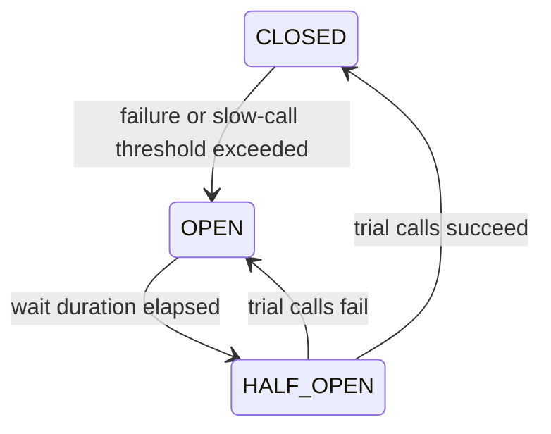

>[!success] 이 문서를 통해 아래 질문들에 답할 수 있게 됩니다.
>- Circuit Breaker의 closed, open, half-open 상태는 어떤 의미인가?
>- 실패율, slow call rate, 최소 호출 수, open 유지 시간을 어떻게 판단해야 하는가?
>- Circuit Breaker가 성능, 정합성, 장애 격리, 운영 복잡도에 어떤 trade-off를 만드는가?

## 개요

Circuit Breaker는 실패한 의존성을 계속 호출하지 않도록 잠시 차단하는 상태 기계다. 전기 차단기처럼 문제가 반복되면 회로를 열고, 일정 시간이 지나면 제한된 호출로 회복 여부를 시험한다.

핵심은 "외부 API가 죽었는지 맞히기"가 아니다. 실패하거나 느린 호출을 계속 보내면 내부 리소스가 고갈되므로, 충분한 증거가 쌓였을 때 빠르게 실패시키고 fallback으로 전환하는 것이다.

## 상태 모델



`closed`는 정상 호출 상태다. 모든 요청이 의존성으로 전달된다.

`open`은 차단 상태다. 외부 호출을 보내지 않고 즉시 fallback이나 실패를 반환한다.

`half-open`은 시험 상태다. 제한된 수의 호출만 보내 회복 여부를 확인한다.

## 어떤 실패를 세는가

Circuit Breaker는 보통 두 종류를 본다.

| 지표 | 의미 | 예시 |
| --- | --- | --- |
| failure rate | 호출 실패 비율 | 5xx, timeout, connection error |
| slow call rate | 느린 호출 비율 | 2초 이상 걸린 호출 |

느린 성공도 실패처럼 봐야 할 때가 있다. 배송 API가 5초 뒤 성공을 주더라도 주문 상세 API의 목표가 500ms라면 그 성공은 사용자 경험 기준에서 실패에 가깝다.

## 최소 호출 수

호출 2번 중 1번 실패했다고 바로 circuit을 열면 너무 민감하다. 그래서 최소 호출 수가 필요하다.

```text
sliding window size = 100 calls
minimum number of calls = 20
failure rate threshold = 50%
```

20번 이상 호출된 뒤 실패율이 50%를 넘으면 open으로 전환한다. 호출량이 낮은 API는 이 기준을 잘못 잡으면 breaker가 늦게 열리거나 거의 열리지 않는다.

## Open 유지 시간

Open 상태는 의존성을 쉬게 하고 내부 리소스를 보호한다. 하지만 너무 오래 열려 있으면 이미 복구된 provider를 계속 쓰지 못한다.

```text
wait duration in open state = 30s
permitted calls in half-open = 5
```

30초 뒤 half-open으로 바꾸고 5개 호출만 시험한다. 5개가 성공하면 closed로 돌아가고, 실패하면 다시 open으로 간다.

## 성능과 정합성 trade-off

Circuit Breaker는 성능과 장애 격리를 보호하지만 정합성 표현을 바꾼다.

- 성능: 느린 호출을 줄이고 빠른 fallback을 반환한다.
- 정합성: 최신 외부 정보를 못 가져오고 stale 또는 unknown 상태를 보여줄 수 있다.
- 장애 격리: 실패 의존성 호출을 차단해 내부 리소스를 보호한다.
- 운영 복잡도: threshold, 상태 전환, fallback 품질, alert를 관리해야 한다.

배송 위치는 stale이어도 괜찮을 수 있지만 결제 승인 결과는 stale fallback을 쓰면 안 된다. breaker를 적용할 수 있는 데이터와 없는 데이터를 구분해야 한다.

## 설정 예시

```yaml
resilience4j:
  circuitbreaker:
    instances:
      shippingClient:
        sliding-window-type: count_based
        sliding-window-size: 100
        minimum-number-of-calls: 20
        failure-rate-threshold: 50
        slow-call-rate-threshold: 50
        slow-call-duration-threshold: 2s
        wait-duration-in-open-state: 30s
        permitted-number-of-calls-in-half-open-state: 5
```

이 값은 출발점일 뿐이다. 실제 값은 provider latency 분포, 사용자 latency 목표, fallback 허용 여부, traffic volume을 보고 정한다.

## Fallback 연결

Open 상태에서 무엇을 반환할지 정하지 않으면 breaker는 단순 실패 발생기로 끝난다.

```java
@CircuitBreaker(name = "shippingClient", fallbackMethod = "fallbackShipping")
public ShippingStatus getShipping(String orderId) {
    return shippingProvider.getStatus(orderId);
}

private ShippingStatus fallbackShipping(String orderId, Throwable cause) {
    return shippingCache.findRecent(orderId)
        .orElse(ShippingStatus.unavailable(orderId));
}
```

fallback은 원인을 숨기지 않아야 한다. API 응답이나 내부 로그에는 fallback 여부와 데이터 출처가 남아야 한다.

## Retry와 순서

Retry와 Circuit Breaker를 함께 쓸 때는 조합 순서를 조심해야 한다.

```text
나쁜 방향: retry 3회 후에 breaker가 실패 1회로 기록
위험: 실제 외부 호출이 3배 증가

나은 방향: 짧은 timeout, 제한된 retry, breaker metric 명확화
```

모든 실패에 retry를 붙이지 않는다. 결제 승인처럼 provider가 idempotency key를 지원하고 일시 장애일 때만 제한적으로 재시도한다.

## Alert 기준

Circuit Breaker alert는 단순히 open 여부만 보면 부족하다.

- circuit open count
- open duration
- slow call rate
- failure rate
- fallback rate
- half-open 실패율
- downstream latency

Open이 자주 반복되면 provider 장애일 수도 있지만 threshold가 너무 민감할 수도 있다. Fallback rate가 높다면 사용자는 축소 경험을 하고 있다.

## 위험 신호

- timeout 없이 circuit breaker만 둔다.
- minimum calls가 너무 낮아 일시 오류에도 open된다.
- slow call을 실패로 보지 않아 스레드 고갈 뒤에야 열린다.
- open 상태에서 fallback 품질을 검증하지 않았다.
- 결제, 재고 같은 강한 정합성 경로에 stale fallback을 반환한다.
- breaker open을 정상 성공으로만 집계한다.

## 개인 프로젝트 기준

- closed, open, half-open 전환을 로그로 확인한다.
- 외부 API 실패와 지연을 각각 재현한다.
- fallback 응답에 `fallback=true`나 `source=cache`를 남긴다.
- threshold 값을 왜 그렇게 잡았는지 한 문장으로 적는다.

## 기업 운영 기준

- 의존성별 circuit 설정과 owner를 관리한다.
- threshold 변경 전후 fallback rate와 사용자 영향 지표를 비교한다.
- half-open 호출 수와 open 유지 시간을 provider 회복 특성에 맞춘다.
- breaker 상태를 incident timeline에 포함한다.

## 확인 질문

- 확인 질문: Circuit Breaker가 open 상태에서 외부 호출을 막는 이유는 무엇인가?
	- 답변: 실패하거나 느린 의존성을 계속 호출하면 내부 스레드와 커넥션이 고갈되므로 빠르게 fallback하거나 실패시키기 위해서다.
- 확인 질문: slow call rate를 보는 이유는 무엇인가?
	- 답변: 오류가 아니어도 사용자 latency 목표를 넘는 느린 성공은 내부 리소스를 오래 점유해 장애를 만들 수 있기 때문이다.
- 확인 질문: half-open 상태가 필요한 이유는 무엇인가?
	- 답변: 의존성이 복구되었는지 제한된 호출로 확인하고, 성공하면 정상 호출로 되돌리기 위해서다.

## 참고 문서

- [Martin Fowler, Circuit Breaker](https://martinfowler.com/bliki/CircuitBreaker.html)
- [Resilience4j CircuitBreaker](https://resilience4j.readme.io/docs/circuitbreaker)
- [Google SRE Book, Addressing Cascading Failures](https://sre.google/sre-book/addressing-cascading-failures/)
