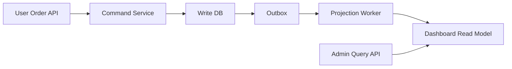

>[!success] 이 문서를 통해 아래 질문들에 답할 수 있게 됩니다.
>- Read Write 분리는 어떤 병목을 해결하려는 선택인가?
>- read replica, cache, projection, CQRS 중 어느 단계까지 가야 하는가?
>- 쓰기 DB 보호와 조회 최적화가 성능, 정합성, 장애 격리, 운영 복잡도를 어떻게 바꾸는가?

## 개요

Read Write 분리는 "조회가 많으니 DB를 하나 더 둔다"가 아니다.

핵심은 쓰기 모델이 지켜야 하는 불변식과 읽기 모델이 만족해야 하는 조회 형태가 서로 충돌할 때, 두 경로의 책임을 나누는 것이다.

주문 시스템을 예로 들면 주문 생성과 결제 승인은 재고, 금액, 상태 전이의 정합성을 지켜야 한다.

반면 관리자 대시보드는 일별 매출, 배송 상태, 고객 등급, 취소율을 한 화면에서 빠르게 보여줘야 한다.

이 조회를 쓰기 DB의 정규화된 테이블에 계속 조인으로 때리면 쓰기 트랜잭션이 느려지고 락, I/O, connection pool이 같이 압박받는다.

따라서 Read Write 분리의 목적은 읽기 성능만이 아니라 쓰기 경로 보호, 장애 격리, 조회 모델 독립성까지 포함한다.

## 먼저 확인할 문제

분리 전에 먼저 물어야 할 질문은 "읽기가 정말 쓰기를 방해하는가?"다.

인덱스가 없어서 느린 조회인지, 불필요하게 큰 페이지를 조회하는지, 관리자 batch가 피크 시간에 도는지, 단순 캐시로 충분한지 확인하지 않으면 구조만 복잡해진다.

다음 신호가 반복될 때 분리를 검토한다.

- 주문 생성 p95가 관리자 대시보드 조회 시간대에 같이 상승한다.
- 읽기 쿼리가 큰 조인, group by, sort로 buffer cache와 I/O를 많이 쓴다.
- 화면이 요구하는 응답 형태가 write model의 정규화 구조와 계속 어긋난다.
- read API의 QPS가 write TPS보다 훨씬 크고 peak가 다르다.
- 읽기 장애가 쓰기 API 장애로 전파된다.

이 선택이 바꾸는 축은 명확하다.

- 성능: 읽기 경로를 조회 형태에 맞춰 빠르게 만들 수 있다.
- 정합성: 읽기 결과가 쓰기 직후 최신이 아닐 수 있다.
- 장애 격리: 무거운 조회 장애가 쓰기 DB로 번지는 것을 줄인다.
- 운영 복잡도: 데이터 복제, lag, 동기화 실패, rebuild가 생긴다.

## 기준 시나리오

전자상거래 관리자 화면을 생각해 보자.

```text
주문 생성 = 500 TPS
주문 상세 조회 = 1,500 QPS
관리자 대시보드 = 3,000 QPS
대시보드 허용 지연 = 30초
주문 생성 목표 p95 = 150ms
대시보드 목표 p95 = 400ms
```

대시보드는 주문, 결제, 배송, 환불, 회원 등급을 합쳐 보여준다.

이 쿼리를 원본 DB에서 매번 수행하면 쓰기 트랜잭션과 읽기 집계가 같은 리소스를 두고 경쟁한다.

문제는 평균 QPS가 아니라 동시에 몰리는 시간대다.

프로모션 종료 직후 관리자는 대시보드를 새로고침하고, 사용자는 주문을 생성하며, batch는 정산 데이터를 갱신할 수 있다.

이때 "읽기 부하를 어디로 보낼 것인가"와 "얼마나 오래된 값을 허용할 것인가"를 같이 정해야 한다.

## 선택지 비교

| 선택지 | 바꾸는 것 | 장점 | 비용 | 적합한 조건 |
| --- | --- | --- | --- | --- |
| 인덱스 개선 | 같은 DB의 실행 계획 | 가장 단순하고 정합성 유지 | write 비용과 인덱스 관리 증가 | 특정 조회만 느릴 때 |
| Cache aside | 반복 조회 결과 | 구현이 비교적 쉽고 응답 빠름 | invalidation과 stale 문제 | 값이 자주 반복되고 약간 오래돼도 될 때 |
| Read replica | 읽기 연결 대상 | write DB 부하 감소 | replica lag와 장애 전환 관리 | 같은 스키마로 조회 가능할 때 |
| Materialized view | 집계 결과 | 복잡한 집계를 단순 조회로 전환 | refresh 비용과 잠금 고려 | DB 내부에서 관리 가능한 집계 |
| Projection read model | 조회 전용 모델 | 화면/API 형태에 최적화 | 이벤트 처리, rebuild, schema version 필요 | 목록, 피드, 통계 모델이 원본과 다를 때 |
| CQRS | command/query 모델 경계 | 쓰기 불변식과 읽기 모델 독립 | 설계, 배포, 운영 책임 증가 | 도메인 복잡도와 조회 비대칭이 충분할 때 |

선택은 위에서 아래로 단계적으로 올린다.

처음부터 CQRS를 고르면 빠른 것처럼 보이지만, 실제로는 동기화 실패와 운영 절차를 먼저 가져오는 셈이다.

## 흐름 예시



이 구조에서 write DB는 주문 생성의 최종 진실을 가진다.

대시보드 read model은 관리자의 조회 경험을 위해 존재하며, 원본을 대체하지 않는다.

장애가 났을 때 주문 생성은 계속 받아야 하고, 대시보드는 "최근 1분 데이터 반영 중" 같은 상태를 표시할 수 있어야 한다.

## API 계약 예시

쓰기 API는 최신 대시보드 반영을 약속하지 않는다.

```http
POST /orders
Idempotency-Key: ord-req-20260701-001
```

```json
{
  "orderId": "ord-1001",
  "status": "ACCEPTED",
  "committedAt": "2026-07-01T10:15:00+09:00",
  "dashboardVisible": "EVENTUAL"
}
```

읽기 API는 데이터의 신선도를 드러낸다.

```json
{
  "salesAmount": 18200000,
  "orderCount": 9421,
  "asOf": "2026-07-01T10:14:35+09:00",
  "lagSeconds": 25,
  "freshness": "STALE_BUT_AVAILABLE"
}
```

이 계약이 없으면 사용자는 주문 완료 직후 대시보드에 숫자가 없을 때 장애로 느낀다.

## Spring 경계 예시

쓰기 서비스는 주문의 불변식과 outbox 기록을 같은 트랜잭션에 둔다.

```java
@Transactional
public OrderResult place(PlaceOrderCommand command) {
    Order order = orderRepository.save(Order.place(command));
    outboxRepository.save(OutboxMessage.of("OrderPlaced", order.id(), order.version()));
    return OrderResult.accepted(order.id(), order.createdAt(), Visibility.EVENTUAL);
}
```

읽기 서비스는 write repository를 직접 조회하지 않는다.

```java
@Transactional(readOnly = true)
public DashboardSummary getSummary(LocalDate date) {
    DashboardRow row = dashboardReadRepository.findByDate(date);
    return DashboardSummary.from(row, freshness(row.projectedAt()));
}
```

코드에서 중요한 것은 repository가 몇 개인지가 아니다.

쓰기 경로의 트랜잭션과 읽기 경로의 응답 계약이 서로 다른 책임을 갖는다는 점이다.

## 설계 판단

Read Write 분리를 검토할 때는 다음 순서로 좁힌다.

1. 쓰기 DB 병목이 실제로 읽기에서 오는지 관측한다.
2. 조회가 원본 스키마로 해결 가능한지 확인한다.
3. stale 허용 시간을 화면/API별로 적는다.
4. 원천 데이터와 read model의 owner를 분리한다.
5. 동기화 실패 시 사용자 응답과 운영 대응을 정한다.
6. rebuild 시간과 트래픽 비용을 계산한다.

예를 들어 대시보드 lag 목표가 30초인데 rebuild가 8시간 걸리면 장애 복구 중 긴 시간 동안 stale data를 노출해야 한다.

그 시간 동안 운영자가 어떤 값을 믿어야 하는지 정하지 않았다면 분리 설계는 완성되지 않은 것이다.

## 위험 신호

- 단일 느린 SQL을 고치지 않고 바로 CQRS를 도입한다.
- 쓰기 DB의 최종 진실과 read model의 파생 데이터를 구분하지 않는다.
- 주문 완료 응답이 대시보드 최신 반영까지 암묵적으로 약속한다.
- replica lag나 projection lag를 사용자 화면에 설명하지 않는다.
- read model rebuild 절차 없이 projection table만 만든다.
- 관리자 조회 장애가 write API connection pool을 계속 점유한다.

## 개인 프로젝트 기준

개인 프로젝트에서는 read replica나 별도 projection을 꼭 둘 필요는 없다.

대신 선택 이유를 짧게 남겨야 한다.

- 단일 DB로 시작한다면 예상 read/write 비율과 전환 조건을 적는다.
- 캐시를 둔다면 TTL과 stale 허용 화면을 명시한다.
- read model을 둔다면 수동 rebuild 스크립트라도 있어야 한다.
- 포트폴리오 설명에서는 "조회 성능 개선"보다 "쓰기 경로 보호"를 먼저 말한다.

## 기업 운영 기준

기업 운영에서는 분리 이후의 관측과 복구가 설계의 일부다.

- `order.write.latency.p95`
- `dashboard.read.latency.p95`
- `projection.lag.seconds`
- `projection.failed.events`
- `read_model.rebuild.duration`
- `stale_response.ratio`

이 지표를 알림, 대시보드, 장애 등급과 연결한다.

read model 장애 때 주문 생성까지 막을지, 대시보드만 degraded로 둘지 사전에 정해야 한다.

## 확인 질문

- 확인 질문: Read Write 분리를 검토하기 전에 가장 먼저 확인할 것은 무엇인가?
	- 답변: 읽기 쿼리가 실제로 쓰기 DB의 latency, I/O, connection pool을 압박하는지 관측해야 한다.
- 확인 질문: Read replica와 projection read model의 차이는 무엇인가?
	- 답변: Read replica는 같은 스키마를 복제해 읽는 방식이고, projection은 조회 요구에 맞춘 별도 파생 모델을 만든다.
- 확인 질문: 이 선택이 운영 복잡도를 늘리는 이유는 무엇인가?
	- 답변: lag 측정, 동기화 실패, 재처리, rebuild, 사용자 stale 계약을 새로 운영해야 하기 때문이다.

## 참고 문서

- [Martin Fowler, CQRS](https://martinfowler.com/bliki/CQRS.html)
- [Microsoft, CQRS pattern](https://learn.microsoft.com/en-us/azure/architecture/patterns/cqrs)
- [PostgreSQL Documentation, High Availability, Load Balancing, and Replication](https://www.postgresql.org/docs/current/high-availability.html)
- [Google SRE Book, Monitoring Distributed Systems](https://sre.google/sre-book/monitoring-distributed-systems/)
