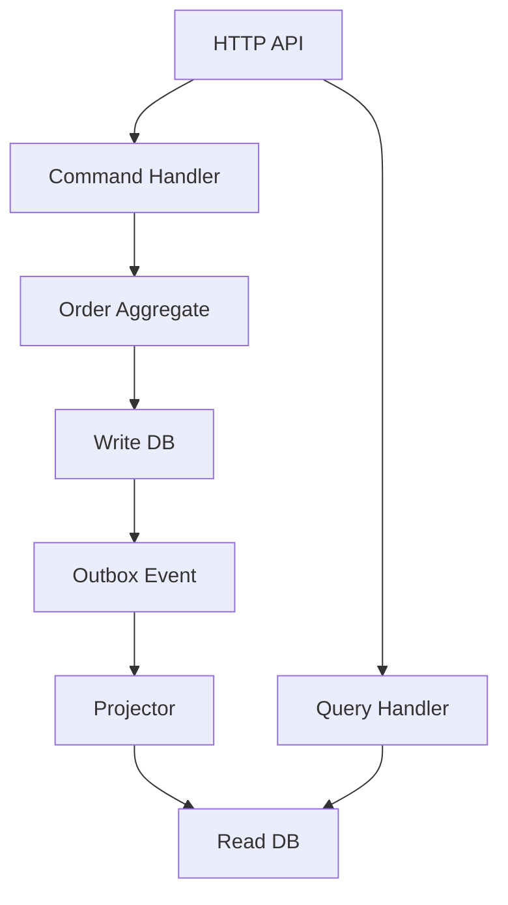

>[!success] 이 문서를 통해 아래 질문들에 답할 수 있게 됩니다.
>- CQRS에서 command model과 query model은 무엇을 각각 책임지는가?
>- CQRS를 적용해야 하는 조건과 적용하면 안 되는 조건은 무엇인가?
>- CQRS는 성능, 정합성, 장애 격리, 운영 복잡도를 어떻게 동시에 바꾸는가?

## 개요

CQRS는 Command Query Responsibility Segregation의 약자다.

핵심은 쓰기 요청을 처리하는 모델과 읽기 요청을 처리하는 모델의 책임을 분리하는 것이다.

쓰기 모델은 도메인 불변식, 상태 전이, 트랜잭션 경계를 지킨다.

읽기 모델은 화면, 검색, 목록, 통계, API 응답 형태에 맞게 데이터를 제공한다.

따라서 CQRS를 "조회 DB 하나 추가"로 이해하면 부족하다.

CQRS는 코드 구조, 데이터 모델, 배포 전략, 장애 대응, 사용자 정합성 계약까지 바꾸는 설계 결정이다.

## Command와 Query의 책임

Command는 시스템 상태를 바꾸는 요청이다.

예를 들어 `PlaceOrder`, `PayOrder`, `CancelOrder`, `ShipOrder`는 command다.

Command model은 다음 질문에 답해야 한다.

- 이 상태 전이는 허용되는가?
- 중복 요청이면 같은 결과를 반환할 수 있는가?
- 트랜잭션 안에서 어떤 row와 제약을 보호해야 하는가?
- 이벤트나 outbox는 언제 기록해야 하는가?

Query는 상태를 읽는 요청이다.

예를 들어 `GetOrderDetail`, `SearchOrders`, `GetSellerDashboard`, `GetUserTimeline`은 query다.

Query model은 다음 질문에 답해야 한다.

- 화면이 어떤 형태의 데이터를 필요로 하는가?
- 조회 latency 목표는 얼마인가?
- 오래된 데이터를 보여줘도 되는가?
- 검색, 정렬, 필터, 페이지네이션을 어떤 저장소가 감당하는가?

둘을 분리하면 command는 정합성에 집중하고 query는 성능과 표현 형태에 집중할 수 있다.

대신 쓰기 직후 읽기가 최신을 보장하지 않을 수 있다.

## 적용 기준

CQRS가 맞는 상황은 대체로 다음 조건이 겹칠 때다.

| 조건 | 의미 | 설계 영향 |
| --- | --- | --- |
| 읽기와 쓰기 비율이 크게 다름 | 조회가 압도적으로 많거나 peak가 다름 | query model을 독립 확장 |
| 조회 형태가 쓰기 모델과 다름 | 정규화된 도메인 모델로 화면 구성이 어려움 | projection 또는 search index 필요 |
| 쓰기 불변식이 복잡함 | 상태 전이와 제약이 중요함 | command model을 얇은 CRUD로 만들지 않음 |
| stale 허용 화면이 있음 | 일부 조회는 지연 반영 가능 | eventual consistency 계약 필요 |
| 운영팀이 lag와 rebuild를 감당 가능 | 장애 복구 절차가 있음 | 복잡도 비용을 수용 가능 |

반대로 다음 조건이라면 CQRS는 과하다.

- 단순 CRUD이고 읽기/쓰기 모델이 거의 같다.
- 조회는 느리지만 인덱스와 pagination으로 해결 가능하다.
- 쓰기 직후 읽기 최신성이 모든 화면에서 필수다.
- projection lag를 측정하거나 설명할 방법이 없다.
- read model을 재생성할 원천 이벤트나 데이터가 없다.
- 팀이 장애 재처리와 schema version을 운영할 여력이 없다.

## 구조 예시



이 그림에서 중요한 경계는 `Command Handler`와 `Query Handler`다.

Command handler는 read model을 갱신하려고 직접 여러 저장소를 만지지 않는다.

Query handler는 주문 상태를 바꾸지 않고 조회 요구에 맞는 read model만 읽는다.

## Spring 코드 경계

쓰기 쪽은 command를 명시적으로 받는다.

```java
public record PlaceOrderCommand(
    Long memberId,
    List<OrderLineCommand> lines,
    String idempotencyKey
) {
}
```

```java
@Transactional
public PlaceOrderResult handle(PlaceOrderCommand command) {
    idempotencyService.ensureFirstRequest(command.idempotencyKey());

    Order order = Order.place(command.memberId(), command.lines());
    orderRepository.save(order);
    outboxRepository.save(OutboxMessage.orderPlaced(order.id(), order.version()));

    return PlaceOrderResult.accepted(order.id());
}
```

읽기 쪽은 화면 요구에 맞춘 DTO를 반환한다.

```java
@Transactional(readOnly = true)
public List<OrderListItem> search(OrderSearchCondition condition) {
    return orderListReadRepository.search(condition);
}
```

이 분리는 layer를 늘리기 위한 분리가 아니다.

쓰기 코드는 도메인 상태를 보호하고, 읽기 코드는 조회 성능과 API 응답 형태를 보호한다.

## 저장소 분리의 단계

CQRS라고 해서 반드시 물리 DB를 바로 나눌 필요는 없다.

1. 같은 DB 안에서 command repository와 query repository를 분리한다.
2. 같은 DB 안에 조회 전용 table이나 materialized view를 둔다.
3. read replica를 query 경로에 사용한다.
4. projection worker가 read model DB를 갱신한다.
5. 검색 엔진이나 document store를 query model로 둔다.

초기에는 코드 책임만 분리하고 저장소는 하나로 유지할 수 있다.

운영 부담이 감당 가능하고 조회 요구가 충분히 커졌을 때 물리 저장소를 분리한다.

## 정합성 계약

CQRS에서 쓰기 성공은 "query model에 즉시 보인다"는 뜻이 아니다.

쓰기 API는 다음 중 하나를 명확히 반환해야 한다.

- `COMMITTED`: write model에 반영되었고 강한 조회가 가능하다.
- `ACCEPTED`: write model에는 반영되었지만 query model은 지연될 수 있다.
- `PENDING`: command 접수 후 비동기 처리 중이다.
- `REJECTED`: 불변식 위반이나 중복 요청으로 거절되었다.

이 계약이 없으면 사용자와 운영자는 장애와 지연 반영을 구분하지 못한다.

## 설계 판단

CQRS가 성능을 개선하는 이유는 read path가 write model의 정규화 구조에서 벗어날 수 있기 때문이다.

하지만 정합성 비용은 늘어난다.

특히 read-after-write가 중요한 화면은 CQRS 뒤에서도 별도 처리가 필요하다.

예를 들어 사용자가 주문 직후 자기 주문 상세를 볼 때는 write DB를 직접 읽거나 command 결과를 화면에 유지할 수 있다.

반면 관리자 통계는 30초 지연을 허용하고 read model을 읽을 수 있다.

이처럼 화면별 정합성 등급을 나누지 않으면 CQRS는 장애 원인을 숨긴다.

## 위험 신호

- CQRS를 적용한다고 말하지만 command와 query가 같은 entity를 공유한다.
- query handler에서 상태를 변경한다.
- command handler가 read model DB까지 동기 갱신한다.
- 모든 화면에 read-after-write를 요구하면서 projection lag를 허용하지 않는다.
- event schema version 없이 projection을 배포한다.
- read model 장애 때 command API까지 실패하도록 묶어 둔다.

## 개인 프로젝트 기준

개인 프로젝트에서는 CQRS를 물리적으로 완성하지 않아도 된다.

다음 정도만 해도 설계 의도를 설명할 수 있다.

- command DTO와 query condition을 분리한다.
- 쓰기 service와 읽기 service를 다른 책임으로 둔다.
- 조회 전용 repository method를 entity 반환이 아니라 DTO 반환으로 둔다.
- read-after-write가 필요한 화면과 stale 허용 화면을 구분해 적는다.

## 기업 운영 기준

기업에서는 CQRS 도입 전에 운영 체크리스트가 필요하다.

- command 실패율과 query 실패율을 분리해 본다.
- projection lag SLO를 둔다.
- read model rebuild 시간을 측정한다.
- event schema version 호환성을 테스트한다.
- 장애 때 read model만 격리하거나 재처리할 수 있다.
- 배포 중 old command와 new projector가 동시에 동작해도 된다.

운영 준비가 없다면 CQRS는 성능 개선보다 장애 원인 증가에 가깝다.

## 확인 질문

- 확인 질문: CQRS에서 command model의 핵심 책임은 무엇인가?
	- 답변: 도메인 불변식, 상태 전이, 트랜잭션 경계, 중복 요청 방어를 책임지는 것이다.
- 확인 질문: 단순 CRUD에 CQRS가 과한 이유는 무엇인가?
	- 답변: 읽기와 쓰기 모델이 거의 같은데도 lag, projection, rebuild, schema version 운영 비용을 추가하기 때문이다.
- 확인 질문: CQRS가 바꾸는 설계 축은 무엇인가?
	- 답변: 읽기 성능과 장애 격리는 좋아질 수 있지만, 쓰기 직후 읽기 정합성과 운영 복잡도는 나빠질 수 있다.

## 참고 문서

- [Martin Fowler, CQRS](https://martinfowler.com/bliki/CQRS.html)
- [Microsoft, CQRS pattern](https://learn.microsoft.com/en-us/azure/architecture/patterns/cqrs)
- [Microsoft, Event Sourcing pattern](https://learn.microsoft.com/en-us/azure/architecture/patterns/event-sourcing)
- [Designing Data-Intensive Applications](https://dataintensive.net/)
